cola Report for Consensus Partitioning
==================

**Date**: 2019-12-02 23:35:25 CET, **cola version**: 1.3.2

----------------------------------------------------------------

<style type='text/css'>

body, td, th {
   font-family: Arial,Helvetica,sans-serif;
   background-color: white;
   font-size: 13px;
  max-width: 800px;
  margin: auto;
  margin-left:210px;
  padding: 0px 10px 0px 10px;
  border-left: 1px solid #EEEEEE;
  line-height: 150%;
}

tt, code, pre {
   font-family: 'DejaVu Sans Mono', 'Droid Sans Mono', 'Lucida Console', Consolas, Monaco, 

monospace;
}

h1 {
   font-size:2.2em;
}

h2 {
   font-size:1.8em;
}

h3 {
   font-size:1.4em;
}

h4 {
   font-size:1.0em;
}

h5 {
   font-size:0.9em;
}

h6 {
   font-size:0.8em;
}

a {
  text-decoration: none;
  color: #0366d6;
}

a:hover {
  text-decoration: underline;
}

a:visited {
   color: #0366d6;
}

pre, img {
  max-width: 100%;
}
pre {
  overflow-x: auto;
}
pre code {
   display: block; padding: 0.5em;
}

code {
  font-size: 92%;
  border: 1px solid #ccc;
}

code[class] {
  background-color: #F8F8F8;
}

table, td, th {
  border: 1px solid #ccc;
}

blockquote {
   color:#666666;
   margin:0;
   padding-left: 1em;
   border-left: 0.5em #EEE solid;
}

hr {
   height: 0px;
   border-bottom: none;
   border-top-width: thin;
   border-top-style: dotted;
   border-top-color: #999999;
}

@media print {
   * {
      background: transparent !important;
      color: black !important;
      filter:none !important;
      -ms-filter: none !important;
   }

   body {
      font-size:12pt;
      max-width:100%;
   }

   a, a:visited {
      text-decoration: underline;
   }

   hr {
      visibility: hidden;
      page-break-before: always;
   }

   pre, blockquote {
      padding-right: 1em;
      page-break-inside: avoid;
   }

   tr, img {
      page-break-inside: avoid;
   }

   img {
      max-width: 100% !important;
   }

   @page :left {
      margin: 15mm 20mm 15mm 10mm;
   }

   @page :right {
      margin: 15mm 10mm 15mm 20mm;
   }

   p, h2, h3 {
      orphans: 3; widows: 3;
   }

   h2, h3 {
      page-break-after: avoid;
   }
}
</style>


## Summary


All available functions which can be applied to this `res_list` object:


```r
res_list
```

```
#> A 'ConsensusPartitionList' object with 24 methods.
#>   On a matrix with 8229 rows and 84 columns.
#>   Top rows are extracted by 'SD, CV, MAD, ATC' methods.
#>   Subgroups are detected by 'hclust, kmeans, skmeans, pam, mclust, NMF' method.
#>   Number of partitions are tried for k = 2, 3, 4, 5, 6.
#>   Performed in total 30000 partitions by row resampling.
#> 
#> Following methods can be applied to this 'ConsensusPartitionList' object:
#>  [1] "cola_report"           "collect_classes"       "collect_plots"         "collect_stats"        
#>  [5] "colnames"              "functional_enrichment" "get_anno_col"          "get_anno"             
#>  [9] "get_classes"           "get_matrix"            "get_membership"        "get_stats"            
#> [13] "is_best_k"             "is_stable_k"           "ncol"                  "nrow"                 
#> [17] "rownames"              "show"                  "suggest_best_k"        "test_to_known_factors"
#> [21] "top_rows_heatmap"      "top_rows_overlap"     
#> 
#> You can get result for a single method by, e.g. object["SD", "hclust"] or object["SD:hclust"]
#> or a subset of methods by object[c("SD", "CV")], c("hclust", "kmeans")]
```

The call of `run_all_consensus_partition_methods()` was:


```
#> run_all_consensus_partition_methods(data = mat, mc.cores = 4, anno = anno)
```

Dimension of the input matrix:


```r
mat = get_matrix(res_list)
dim(mat)
```

```
#> [1] 8229   84
```

### Density distribution

The density distribution for each sample is visualized as in one column in the
following heatmap. The clustering is based on the distance which is the
Kolmogorov-Smirnov statistic between two distributions.


```r
library(ComplexHeatmap)
densityHeatmap(mat, top_annotation = HeatmapAnnotation(df = get_anno(res_list), 
    col = get_anno_col(res_list)), ylab = "value", cluster_columns = TRUE, show_column_names = FALSE,
    mc.cores = 4)
```


### Suggest the best k


Folowing table shows the best `k` (number of partitions) for each combination
of top-value methods and partition methods. Clicking on the method name in
the table goes to the section for a single combination of methods.

[The cola vignette](http://bioconductor.org/packages/devel/bioc/vignettes/cola/inst/doc/cola.html#toc_13)
explains the definition of the metrics used for determining the best
number of partitions.


```r
suggest_best_k(res_list)
```


|                            | The best k| 1-PAC| Mean silhouette| Concordance|   |Optional k |
|:---------------------------|----------:|-----:|---------------:|-----------:|:--|:----------|
|[SD:pam](#SD-pam)           |          3| 1.000|           0.964|       0.988|** |2          |
|[ATC:hclust](#ATC-hclust)   |          2| 1.000|           0.987|       0.995|** |           |
|[MAD:mclust](#MAD-mclust)   |          3| 0.981|           0.919|       0.954|** |           |
|[CV:NMF](#CV-NMF)           |          4| 0.974|           0.925|       0.967|** |2          |
|[ATC:skmeans](#ATC-skmeans) |          4| 0.973|           0.946|       0.978|** |2,3        |
|[ATC:pam](#ATC-pam)         |          6| 0.973|           0.901|       0.951|** |4,5        |
|[SD:skmeans](#SD-skmeans)   |          4| 0.964|           0.964|       0.983|** |2          |
|[ATC:NMF](#ATC-NMF)         |          4| 0.961|           0.948|       0.977|** |3          |
|[CV:mclust](#CV-mclust)     |          3| 0.958|           0.900|       0.957|** |           |
|[MAD:NMF](#MAD-NMF)         |          4| 0.941|           0.926|       0.963|*  |3          |
|[SD:NMF](#SD-NMF)           |          4| 0.938|           0.919|       0.963|*  |           |
|[SD:mclust](#SD-mclust)     |          3| 0.937|           0.893|       0.947|*  |           |
|[MAD:hclust](#MAD-hclust)   |          6| 0.935|           0.884|       0.903|*  |4          |
|[MAD:pam](#MAD-pam)         |          5| 0.925|           0.831|       0.932|*  |3          |
|[MAD:skmeans](#MAD-skmeans) |          5| 0.916|           0.893|       0.896|*  |4          |
|[CV:skmeans](#CV-skmeans)   |          5| 0.910|           0.810|       0.899|*  |2,4        |
|[CV:pam](#CV-pam)           |          4| 0.904|           0.884|       0.948|*  |3          |
|[CV:hclust](#CV-hclust)     |          5| 0.903|           0.897|       0.926|*  |4          |
|[ATC:mclust](#ATC-mclust)   |          6| 0.901|           0.844|       0.910|*  |           |
|[SD:hclust](#SD-hclust)     |          4| 0.891|           0.939|       0.965|   |           |
|[CV:kmeans](#CV-kmeans)     |          4| 0.630|           0.908|       0.854|   |           |
|[SD:kmeans](#SD-kmeans)     |          4| 0.613|           0.901|       0.834|   |           |
|[MAD:kmeans](#MAD-kmeans)   |          4| 0.603|           0.896|       0.853|   |           |
|[ATC:kmeans](#ATC-kmeans)   |          3| 0.592|           0.878|       0.871|   |           |

\*\*: 1-PAC > 0.95, \*: 1-PAC > 0.9


### CDF of consensus matrices

Cumulative distribution function curves of consensus matrix for all methods.


```r
collect_plots(res_list, fun = plot_ecdf)
```


### Consensus heatmap

Consensus heatmaps for all methods. ([What is a consensus heatmap?](http://bioconductor.org/packages/devel/bioc/vignettes/cola/inst/doc/cola.html#toc_9))


<style type='text/css'>


.ui-helper-hidden {
	display: none;
}
.ui-helper-hidden-accessible {
	border: 0;
	clip: rect(0 0 0 0);
	height: 1px;
	margin: -1px;
	overflow: hidden;
	padding: 0;
	position: absolute;
	width: 1px;
}
.ui-helper-reset {
	margin: 0;
	padding: 0;
	border: 0;
	outline: 0;
	line-height: 1.3;
	text-decoration: none;
	font-size: 100%;
	list-style: none;
}
.ui-helper-clearfix:before,
.ui-helper-clearfix:after {
	content: "";
	display: table;
	border-collapse: collapse;
}
.ui-helper-clearfix:after {
	clear: both;
}
.ui-helper-zfix {
	width: 100%;
	height: 100%;
	top: 0;
	left: 0;
	position: absolute;
	opacity: 0;
	filter:Alpha(Opacity=0); 
}

.ui-front {
	z-index: 100;
}


.ui-state-disabled {
	cursor: default !important;
	pointer-events: none;
}


.ui-icon {
	display: inline-block;
	vertical-align: middle;
	margin-top: -.25em;
	position: relative;
	text-indent: -99999px;
	overflow: hidden;
	background-repeat: no-repeat;
}

.ui-widget-icon-block {
	left: 50%;
	margin-left: -8px;
	display: block;
}


.ui-widget-overlay {
	position: fixed;
	top: 0;
	left: 0;
	width: 100%;
	height: 100%;
}
.ui-accordion .ui-accordion-header {
	display: block;
	cursor: pointer;
	position: relative;
	margin: 2px 0 0 0;
	padding: .5em .5em .5em .7em;
	font-size: 100%;
}
.ui-accordion .ui-accordion-content {
	padding: 1em 2.2em;
	border-top: 0;
	overflow: auto;
}
.ui-autocomplete {
	position: absolute;
	top: 0;
	left: 0;
	cursor: default;
}
.ui-menu {
	list-style: none;
	padding: 0;
	margin: 0;
	display: block;
	outline: 0;
}
.ui-menu .ui-menu {
	position: absolute;
}
.ui-menu .ui-menu-item {
	margin: 0;
	cursor: pointer;
	
	list-style-image: url("data:image/gif;base64,R0lGODlhAQABAIAAAAAAAP///yH5BAEAAAAALAAAAAABAAEAAAIBRAA7");
}
.ui-menu .ui-menu-item-wrapper {
	position: relative;
	padding: 3px 1em 3px .4em;
}
.ui-menu .ui-menu-divider {
	margin: 5px 0;
	height: 0;
	font-size: 0;
	line-height: 0;
	border-width: 1px 0 0 0;
}
.ui-menu .ui-state-focus,
.ui-menu .ui-state-active {
	margin: -1px;
}


.ui-menu-icons {
	position: relative;
}
.ui-menu-icons .ui-menu-item-wrapper {
	padding-left: 2em;
}


.ui-menu .ui-icon {
	position: absolute;
	top: 0;
	bottom: 0;
	left: .2em;
	margin: auto 0;
}


.ui-menu .ui-menu-icon {
	left: auto;
	right: 0;
}
.ui-button {
	padding: .4em 1em;
	display: inline-block;
	position: relative;
	line-height: normal;
	margin-right: .1em;
	cursor: pointer;
	vertical-align: middle;
	text-align: center;
	-webkit-user-select: none;
	-moz-user-select: none;
	-ms-user-select: none;
	user-select: none;

	
	overflow: visible;
}

.ui-button,
.ui-button:link,
.ui-button:visited,
.ui-button:hover,
.ui-button:active {
	text-decoration: none;
}


.ui-button-icon-only {
	width: 2em;
	box-sizing: border-box;
	text-indent: -9999px;
	white-space: nowrap;
}


input.ui-button.ui-button-icon-only {
	text-indent: 0;
}


.ui-button-icon-only .ui-icon {
	position: absolute;
	top: 50%;
	left: 50%;
	margin-top: -8px;
	margin-left: -8px;
}

.ui-button.ui-icon-notext .ui-icon {
	padding: 0;
	width: 2.1em;
	height: 2.1em;
	text-indent: -9999px;
	white-space: nowrap;

}

input.ui-button.ui-icon-notext .ui-icon {
	width: auto;
	height: auto;
	text-indent: 0;
	white-space: normal;
	padding: .4em 1em;
}


input.ui-button::-moz-focus-inner,
button.ui-button::-moz-focus-inner {
	border: 0;
	padding: 0;
}
.ui-controlgroup {
	vertical-align: middle;
	display: inline-block;
}
.ui-controlgroup > .ui-controlgroup-item {
	float: left;
	margin-left: 0;
	margin-right: 0;
}
.ui-controlgroup > .ui-controlgroup-item:focus,
.ui-controlgroup > .ui-controlgroup-item.ui-visual-focus {
	z-index: 9999;
}
.ui-controlgroup-vertical > .ui-controlgroup-item {
	display: block;
	float: none;
	width: 100%;
	margin-top: 0;
	margin-bottom: 0;
	text-align: left;
}
.ui-controlgroup-vertical .ui-controlgroup-item {
	box-sizing: border-box;
}
.ui-controlgroup .ui-controlgroup-label {
	padding: .4em 1em;
}
.ui-controlgroup .ui-controlgroup-label span {
	font-size: 80%;
}
.ui-controlgroup-horizontal .ui-controlgroup-label + .ui-controlgroup-item {
	border-left: none;
}
.ui-controlgroup-vertical .ui-controlgroup-label + .ui-controlgroup-item {
	border-top: none;
}
.ui-controlgroup-horizontal .ui-controlgroup-label.ui-widget-content {
	border-right: none;
}
.ui-controlgroup-vertical .ui-controlgroup-label.ui-widget-content {
	border-bottom: none;
}


.ui-controlgroup-vertical .ui-spinner-input {

	
	width: 75%;
	width: calc( 100% - 2.4em );
}
.ui-controlgroup-vertical .ui-spinner .ui-spinner-up {
	border-top-style: solid;
}

.ui-checkboxradio-label .ui-icon-background {
	box-shadow: inset 1px 1px 1px #ccc;
	border-radius: .12em;
	border: none;
}
.ui-checkboxradio-radio-label .ui-icon-background {
	width: 16px;
	height: 16px;
	border-radius: 1em;
	overflow: visible;
	border: none;
}
.ui-checkboxradio-radio-label.ui-checkboxradio-checked .ui-icon,
.ui-checkboxradio-radio-label.ui-checkboxradio-checked:hover .ui-icon {
	background-image: none;
	width: 8px;
	height: 8px;
	border-width: 4px;
	border-style: solid;
}
.ui-checkboxradio-disabled {
	pointer-events: none;
}
.ui-datepicker {
	width: 17em;
	padding: .2em .2em 0;
	display: none;
}
.ui-datepicker .ui-datepicker-header {
	position: relative;
	padding: .2em 0;
}
.ui-datepicker .ui-datepicker-prev,
.ui-datepicker .ui-datepicker-next {
	position: absolute;
	top: 2px;
	width: 1.8em;
	height: 1.8em;
}
.ui-datepicker .ui-datepicker-prev-hover,
.ui-datepicker .ui-datepicker-next-hover {
	top: 1px;
}
.ui-datepicker .ui-datepicker-prev {
	left: 2px;
}
.ui-datepicker .ui-datepicker-next {
	right: 2px;
}
.ui-datepicker .ui-datepicker-prev-hover {
	left: 1px;
}
.ui-datepicker .ui-datepicker-next-hover {
	right: 1px;
}
.ui-datepicker .ui-datepicker-prev span,
.ui-datepicker .ui-datepicker-next span {
	display: block;
	position: absolute;
	left: 50%;
	margin-left: -8px;
	top: 50%;
	margin-top: -8px;
}
.ui-datepicker .ui-datepicker-title {
	margin: 0 2.3em;
	line-height: 1.8em;
	text-align: center;
}
.ui-datepicker .ui-datepicker-title select {
	font-size: 1em;
	margin: 1px 0;
}
.ui-datepicker select.ui-datepicker-month,
.ui-datepicker select.ui-datepicker-year {
	width: 45%;
}
.ui-datepicker table {
	width: 100%;
	font-size: .9em;
	border-collapse: collapse;
	margin: 0 0 .4em;
}
.ui-datepicker th {
	padding: .7em .3em;
	text-align: center;
	font-weight: bold;
	border: 0;
}
.ui-datepicker td {
	border: 0;
	padding: 1px;
}
.ui-datepicker td span,
.ui-datepicker td a {
	display: block;
	padding: .2em;
	text-align: right;
	text-decoration: none;
}
.ui-datepicker .ui-datepicker-buttonpane {
	background-image: none;
	margin: .7em 0 0 0;
	padding: 0 .2em;
	border-left: 0;
	border-right: 0;
	border-bottom: 0;
}
.ui-datepicker .ui-datepicker-buttonpane button {
	float: right;
	margin: .5em .2em .4em;
	cursor: pointer;
	padding: .2em .6em .3em .6em;
	width: auto;
	overflow: visible;
}
.ui-datepicker .ui-datepicker-buttonpane button.ui-datepicker-current {
	float: left;
}


.ui-datepicker.ui-datepicker-multi {
	width: auto;
}
.ui-datepicker-multi .ui-datepicker-group {
	float: left;
}
.ui-datepicker-multi .ui-datepicker-group table {
	width: 95%;
	margin: 0 auto .4em;
}
.ui-datepicker-multi-2 .ui-datepicker-group {
	width: 50%;
}
.ui-datepicker-multi-3 .ui-datepicker-group {
	width: 33.3%;
}
.ui-datepicker-multi-4 .ui-datepicker-group {
	width: 25%;
}
.ui-datepicker-multi .ui-datepicker-group-last .ui-datepicker-header,
.ui-datepicker-multi .ui-datepicker-group-middle .ui-datepicker-header {
	border-left-width: 0;
}
.ui-datepicker-multi .ui-datepicker-buttonpane {
	clear: left;
}
.ui-datepicker-row-break {
	clear: both;
	width: 100%;
	font-size: 0;
}


.ui-datepicker-rtl {
	direction: rtl;
}
.ui-datepicker-rtl .ui-datepicker-prev {
	right: 2px;
	left: auto;
}
.ui-datepicker-rtl .ui-datepicker-next {
	left: 2px;
	right: auto;
}
.ui-datepicker-rtl .ui-datepicker-prev:hover {
	right: 1px;
	left: auto;
}
.ui-datepicker-rtl .ui-datepicker-next:hover {
	left: 1px;
	right: auto;
}
.ui-datepicker-rtl .ui-datepicker-buttonpane {
	clear: right;
}
.ui-datepicker-rtl .ui-datepicker-buttonpane button {
	float: left;
}
.ui-datepicker-rtl .ui-datepicker-buttonpane button.ui-datepicker-current,
.ui-datepicker-rtl .ui-datepicker-group {
	float: right;
}
.ui-datepicker-rtl .ui-datepicker-group-last .ui-datepicker-header,
.ui-datepicker-rtl .ui-datepicker-group-middle .ui-datepicker-header {
	border-right-width: 0;
	border-left-width: 1px;
}


.ui-datepicker .ui-icon {
	display: block;
	text-indent: -99999px;
	overflow: hidden;
	background-repeat: no-repeat;
	left: .5em;
	top: .3em;
}
.ui-dialog {
	position: absolute;
	top: 0;
	left: 0;
	padding: .2em;
	outline: 0;
}
.ui-dialog .ui-dialog-titlebar {
	padding: .4em 1em;
	position: relative;
}
.ui-dialog .ui-dialog-title {
	float: left;
	margin: .1em 0;
	white-space: nowrap;
	width: 90%;
	overflow: hidden;
	text-overflow: ellipsis;
}
.ui-dialog .ui-dialog-titlebar-close {
	position: absolute;
	right: .3em;
	top: 50%;
	width: 20px;
	margin: -10px 0 0 0;
	padding: 1px;
	height: 20px;
}
.ui-dialog .ui-dialog-content {
	position: relative;
	border: 0;
	padding: .5em 1em;
	background: none;
	overflow: auto;
}
.ui-dialog .ui-dialog-buttonpane {
	text-align: left;
	border-width: 1px 0 0 0;
	background-image: none;
	margin-top: .5em;
	padding: .3em 1em .5em .4em;
}
.ui-dialog .ui-dialog-buttonpane .ui-dialog-buttonset {
	float: right;
}
.ui-dialog .ui-dialog-buttonpane button {
	margin: .5em .4em .5em 0;
	cursor: pointer;
}
.ui-dialog .ui-resizable-n {
	height: 2px;
	top: 0;
}
.ui-dialog .ui-resizable-e {
	width: 2px;
	right: 0;
}
.ui-dialog .ui-resizable-s {
	height: 2px;
	bottom: 0;
}
.ui-dialog .ui-resizable-w {
	width: 2px;
	left: 0;
}
.ui-dialog .ui-resizable-se,
.ui-dialog .ui-resizable-sw,
.ui-dialog .ui-resizable-ne,
.ui-dialog .ui-resizable-nw {
	width: 7px;
	height: 7px;
}
.ui-dialog .ui-resizable-se {
	right: 0;
	bottom: 0;
}
.ui-dialog .ui-resizable-sw {
	left: 0;
	bottom: 0;
}
.ui-dialog .ui-resizable-ne {
	right: 0;
	top: 0;
}
.ui-dialog .ui-resizable-nw {
	left: 0;
	top: 0;
}
.ui-draggable .ui-dialog-titlebar {
	cursor: move;
}
.ui-draggable-handle {
	-ms-touch-action: none;
	touch-action: none;
}
.ui-resizable {
	position: relative;
}
.ui-resizable-handle {
	position: absolute;
	font-size: 0.1px;
	display: block;
	-ms-touch-action: none;
	touch-action: none;
}
.ui-resizable-disabled .ui-resizable-handle,
.ui-resizable-autohide .ui-resizable-handle {
	display: none;
}
.ui-resizable-n {
	cursor: n-resize;
	height: 7px;
	width: 100%;
	top: -5px;
	left: 0;
}
.ui-resizable-s {
	cursor: s-resize;
	height: 7px;
	width: 100%;
	bottom: -5px;
	left: 0;
}
.ui-resizable-e {
	cursor: e-resize;
	width: 7px;
	right: -5px;
	top: 0;
	height: 100%;
}
.ui-resizable-w {
	cursor: w-resize;
	width: 7px;
	left: -5px;
	top: 0;
	height: 100%;
}
.ui-resizable-se {
	cursor: se-resize;
	width: 12px;
	height: 12px;
	right: 1px;
	bottom: 1px;
}
.ui-resizable-sw {
	cursor: sw-resize;
	width: 9px;
	height: 9px;
	left: -5px;
	bottom: -5px;
}
.ui-resizable-nw {
	cursor: nw-resize;
	width: 9px;
	height: 9px;
	left: -5px;
	top: -5px;
}
.ui-resizable-ne {
	cursor: ne-resize;
	width: 9px;
	height: 9px;
	right: -5px;
	top: -5px;
}
.ui-progressbar {
	height: 2em;
	text-align: left;
	overflow: hidden;
}
.ui-progressbar .ui-progressbar-value {
	margin: -1px;
	height: 100%;
}
.ui-progressbar .ui-progressbar-overlay {
	background: url("data:image/gif;base64,R0lGODlhKAAoAIABAAAAAP///yH/C05FVFNDQVBFMi4wAwEAAAAh+QQJAQABACwAAAAAKAAoAAACkYwNqXrdC52DS06a7MFZI+4FHBCKoDeWKXqymPqGqxvJrXZbMx7Ttc+w9XgU2FB3lOyQRWET2IFGiU9m1frDVpxZZc6bfHwv4c1YXP6k1Vdy292Fb6UkuvFtXpvWSzA+HycXJHUXiGYIiMg2R6W459gnWGfHNdjIqDWVqemH2ekpObkpOlppWUqZiqr6edqqWQAAIfkECQEAAQAsAAAAACgAKAAAApSMgZnGfaqcg1E2uuzDmmHUBR8Qil95hiPKqWn3aqtLsS18y7G1SzNeowWBENtQd+T1JktP05nzPTdJZlR6vUxNWWjV+vUWhWNkWFwxl9VpZRedYcflIOLafaa28XdsH/ynlcc1uPVDZxQIR0K25+cICCmoqCe5mGhZOfeYSUh5yJcJyrkZWWpaR8doJ2o4NYq62lAAACH5BAkBAAEALAAAAAAoACgAAAKVDI4Yy22ZnINRNqosw0Bv7i1gyHUkFj7oSaWlu3ovC8GxNso5fluz3qLVhBVeT/Lz7ZTHyxL5dDalQWPVOsQWtRnuwXaFTj9jVVh8pma9JjZ4zYSj5ZOyma7uuolffh+IR5aW97cHuBUXKGKXlKjn+DiHWMcYJah4N0lYCMlJOXipGRr5qdgoSTrqWSq6WFl2ypoaUAAAIfkECQEAAQAsAAAAACgAKAAAApaEb6HLgd/iO7FNWtcFWe+ufODGjRfoiJ2akShbueb0wtI50zm02pbvwfWEMWBQ1zKGlLIhskiEPm9R6vRXxV4ZzWT2yHOGpWMyorblKlNp8HmHEb/lCXjcW7bmtXP8Xt229OVWR1fod2eWqNfHuMjXCPkIGNileOiImVmCOEmoSfn3yXlJWmoHGhqp6ilYuWYpmTqKUgAAIfkECQEAAQAsAAAAACgAKAAAApiEH6kb58biQ3FNWtMFWW3eNVcojuFGfqnZqSebuS06w5V80/X02pKe8zFwP6EFWOT1lDFk8rGERh1TTNOocQ61Hm4Xm2VexUHpzjymViHrFbiELsefVrn6XKfnt2Q9G/+Xdie499XHd2g4h7ioOGhXGJboGAnXSBnoBwKYyfioubZJ2Hn0RuRZaflZOil56Zp6iioKSXpUAAAh+QQJAQABACwAAAAAKAAoAAACkoQRqRvnxuI7kU1a1UU5bd5tnSeOZXhmn5lWK3qNTWvRdQxP8qvaC+/yaYQzXO7BMvaUEmJRd3TsiMAgswmNYrSgZdYrTX6tSHGZO73ezuAw2uxuQ+BbeZfMxsexY35+/Qe4J1inV0g4x3WHuMhIl2jXOKT2Q+VU5fgoSUI52VfZyfkJGkha6jmY+aaYdirq+lQAACH5BAkBAAEALAAAAAAoACgAAAKWBIKpYe0L3YNKToqswUlvznigd4wiR4KhZrKt9Upqip61i9E3vMvxRdHlbEFiEXfk9YARYxOZZD6VQ2pUunBmtRXo1Lf8hMVVcNl8JafV38aM2/Fu5V16Bn63r6xt97j09+MXSFi4BniGFae3hzbH9+hYBzkpuUh5aZmHuanZOZgIuvbGiNeomCnaxxap2upaCZsq+1kAACH5BAkBAAEALAAAAAAoACgAAAKXjI8By5zf4kOxTVrXNVlv1X0d8IGZGKLnNpYtm8Lr9cqVeuOSvfOW79D9aDHizNhDJidFZhNydEahOaDH6nomtJjp1tutKoNWkvA6JqfRVLHU/QUfau9l2x7G54d1fl995xcIGAdXqMfBNadoYrhH+Mg2KBlpVpbluCiXmMnZ2Sh4GBqJ+ckIOqqJ6LmKSllZmsoq6wpQAAAh+QQJAQABACwAAAAAKAAoAAAClYx/oLvoxuJDkU1a1YUZbJ59nSd2ZXhWqbRa2/gF8Gu2DY3iqs7yrq+xBYEkYvFSM8aSSObE+ZgRl1BHFZNr7pRCavZ5BW2142hY3AN/zWtsmf12p9XxxFl2lpLn1rseztfXZjdIWIf2s5dItwjYKBgo9yg5pHgzJXTEeGlZuenpyPmpGQoKOWkYmSpaSnqKileI2FAAACH5BAkBAAEALAAAAAAoACgAAAKVjB+gu+jG4kORTVrVhRlsnn2dJ3ZleFaptFrb+CXmO9OozeL5VfP99HvAWhpiUdcwkpBH3825AwYdU8xTqlLGhtCosArKMpvfa1mMRae9VvWZfeB2XfPkeLmm18lUcBj+p5dnN8jXZ3YIGEhYuOUn45aoCDkp16hl5IjYJvjWKcnoGQpqyPlpOhr3aElaqrq56Bq7VAAAOw==");
	height: 100%;
	filter: alpha(opacity=25); 
	opacity: 0.25;
}
.ui-progressbar-indeterminate .ui-progressbar-value {
	background-image: none;
}
.ui-selectable {
	-ms-touch-action: none;
	touch-action: none;
}
.ui-selectable-helper {
	position: absolute;
	z-index: 100;
	border: 1px dotted black;
}
.ui-selectmenu-menu {
	padding: 0;
	margin: 0;
	position: absolute;
	top: 0;
	left: 0;
	display: none;
}
.ui-selectmenu-menu .ui-menu {
	overflow: auto;
	overflow-x: hidden;
	padding-bottom: 1px;
}
.ui-selectmenu-menu .ui-menu .ui-selectmenu-optgroup {
	font-size: 1em;
	font-weight: bold;
	line-height: 1.5;
	padding: 2px 0.4em;
	margin: 0.5em 0 0 0;
	height: auto;
	border: 0;
}
.ui-selectmenu-open {
	display: block;
}
.ui-selectmenu-text {
	display: block;
	margin-right: 20px;
	overflow: hidden;
	text-overflow: ellipsis;
}
.ui-selectmenu-button.ui-button {
	text-align: left;
	white-space: nowrap;
	width: 14em;
}
.ui-selectmenu-icon.ui-icon {
	float: right;
	margin-top: 0;
}
.ui-slider {
	position: relative;
	text-align: left;
}
.ui-slider .ui-slider-handle {
	position: absolute;
	z-index: 2;
	width: 1.2em;
	height: 1.2em;
	cursor: default;
	-ms-touch-action: none;
	touch-action: none;
}
.ui-slider .ui-slider-range {
	position: absolute;
	z-index: 1;
	font-size: .7em;
	display: block;
	border: 0;
	background-position: 0 0;
}


.ui-slider.ui-state-disabled .ui-slider-handle,
.ui-slider.ui-state-disabled .ui-slider-range {
	filter: inherit;
}

.ui-slider-horizontal {
	height: .8em;
}
.ui-slider-horizontal .ui-slider-handle {
	top: -.3em;
	margin-left: -.6em;
}
.ui-slider-horizontal .ui-slider-range {
	top: 0;
	height: 100%;
}
.ui-slider-horizontal .ui-slider-range-min {
	left: 0;
}
.ui-slider-horizontal .ui-slider-range-max {
	right: 0;
}

.ui-slider-vertical {
	width: .8em;
	height: 100px;
}
.ui-slider-vertical .ui-slider-handle {
	left: -.3em;
	margin-left: 0;
	margin-bottom: -.6em;
}
.ui-slider-vertical .ui-slider-range {
	left: 0;
	width: 100%;
}
.ui-slider-vertical .ui-slider-range-min {
	bottom: 0;
}
.ui-slider-vertical .ui-slider-range-max {
	top: 0;
}
.ui-sortable-handle {
	-ms-touch-action: none;
	touch-action: none;
}
.ui-spinner {
	position: relative;
	display: inline-block;
	overflow: hidden;
	padding: 0;
	vertical-align: middle;
}
.ui-spinner-input {
	border: none;
	background: none;
	color: inherit;
	padding: .222em 0;
	margin: .2em 0;
	vertical-align: middle;
	margin-left: .4em;
	margin-right: 2em;
}
.ui-spinner-button {
	width: 1.6em;
	height: 50%;
	font-size: .5em;
	padding: 0;
	margin: 0;
	text-align: center;
	position: absolute;
	cursor: default;
	display: block;
	overflow: hidden;
	right: 0;
}

.ui-spinner a.ui-spinner-button {
	border-top-style: none;
	border-bottom-style: none;
	border-right-style: none;
}
.ui-spinner-up {
	top: 0;
}
.ui-spinner-down {
	bottom: 0;
}
.ui-tabs {
	position: relative;
	padding: .2em;
}
.ui-tabs .ui-tabs-nav {
	margin: 0;
	padding: .2em .2em 0;
}
.ui-tabs .ui-tabs-nav li {
	list-style: none;
	float: left;
	position: relative;
	top: 0;
	margin: 1px .2em 0 0;
	border-bottom-width: 0;
	padding: 0;
	white-space: nowrap;
}
.ui-tabs .ui-tabs-nav .ui-tabs-anchor {
	float: left;
	padding: .5em 1em;
	text-decoration: none;
}
.ui-tabs .ui-tabs-nav li.ui-tabs-active {
	margin-bottom: -1px;
	padding-bottom: 1px;
}
.ui-tabs .ui-tabs-nav li.ui-tabs-active .ui-tabs-anchor,
.ui-tabs .ui-tabs-nav li.ui-state-disabled .ui-tabs-anchor,
.ui-tabs .ui-tabs-nav li.ui-tabs-loading .ui-tabs-anchor {
	cursor: text;
}
.ui-tabs-collapsible .ui-tabs-nav li.ui-tabs-active .ui-tabs-anchor {
	cursor: pointer;
}
.ui-tabs .ui-tabs-panel {
	display: block;
	border-width: 0;
	padding: 1em 1.4em;
	background: none;
}
.ui-tooltip {
	padding: 8px;
	position: absolute;
	z-index: 9999;
	max-width: 300px;
}
body .ui-tooltip {
	border-width: 2px;
}

.ui-widget {
	font-family: Arial,Helvetica,sans-serif;
	font-size: 1em;
}
.ui-widget .ui-widget {
	font-size: 1em;
}
.ui-widget input,
.ui-widget select,
.ui-widget textarea,
.ui-widget button {
	font-family: Arial,Helvetica,sans-serif;
	font-size: 1em;
}
.ui-widget.ui-widget-content {
	border: 1px solid #c5c5c5;
}
.ui-widget-content {
	border: 1px solid #dddddd;
	background: #ffffff;
	color: #333333;
}
.ui-widget-content a {
	color: #333333;
}
.ui-widget-header {
	border: 1px solid #dddddd;
	background: #e9e9e9;
	color: #333333;
	font-weight: bold;
}
.ui-widget-header a {
	color: #333333;
}


.ui-state-default,
.ui-widget-content .ui-state-default,
.ui-widget-header .ui-state-default,
.ui-button,


html .ui-button.ui-state-disabled:hover,
html .ui-button.ui-state-disabled:active {
	border: 1px solid #c5c5c5;
	background: #f6f6f6;
	font-weight: normal;
	color: #454545;
}
.ui-state-default a,
.ui-state-default a:link,
.ui-state-default a:visited,
a.ui-button,
a:link.ui-button,
a:visited.ui-button,
.ui-button {
	color: #454545;
	text-decoration: none;
}
.ui-state-hover,
.ui-widget-content .ui-state-hover,
.ui-widget-header .ui-state-hover,
.ui-state-focus,
.ui-widget-content .ui-state-focus,
.ui-widget-header .ui-state-focus,
.ui-button:hover,
.ui-button:focus {
	border: 1px solid #cccccc;
	background: #ededed;
	font-weight: normal;
	color: #2b2b2b;
}
.ui-state-hover a,
.ui-state-hover a:hover,
.ui-state-hover a:link,
.ui-state-hover a:visited,
.ui-state-focus a,
.ui-state-focus a:hover,
.ui-state-focus a:link,
.ui-state-focus a:visited,
a.ui-button:hover,
a.ui-button:focus {
	color: #2b2b2b;
	text-decoration: none;
}

.ui-visual-focus {
	box-shadow: 0 0 3px 1px rgb(94, 158, 214);
}
.ui-state-active,
.ui-widget-content .ui-state-active,
.ui-widget-header .ui-state-active,
a.ui-button:active,
.ui-button:active,
.ui-button.ui-state-active:hover {
	border: 1px solid #003eff;
	background: #007fff;
	font-weight: normal;
	color: #ffffff;
}
.ui-icon-background,
.ui-state-active .ui-icon-background {
	border: #003eff;
	background-color: #ffffff;
}
.ui-state-active a,
.ui-state-active a:link,
.ui-state-active a:visited {
	color: #ffffff;
	text-decoration: none;
}


.ui-state-highlight,
.ui-widget-content .ui-state-highlight,
.ui-widget-header .ui-state-highlight {
	border: 1px solid #dad55e;
	background: #fffa90;
	color: #777620;
}
.ui-state-checked {
	border: 1px solid #dad55e;
	background: #fffa90;
}
.ui-state-highlight a,
.ui-widget-content .ui-state-highlight a,
.ui-widget-header .ui-state-highlight a {
	color: #777620;
}
.ui-state-error,
.ui-widget-content .ui-state-error,
.ui-widget-header .ui-state-error {
	border: 1px solid #f1a899;
	background: #fddfdf;
	color: #5f3f3f;
}
.ui-state-error a,
.ui-widget-content .ui-state-error a,
.ui-widget-header .ui-state-error a {
	color: #5f3f3f;
}
.ui-state-error-text,
.ui-widget-content .ui-state-error-text,
.ui-widget-header .ui-state-error-text {
	color: #5f3f3f;
}
.ui-priority-primary,
.ui-widget-content .ui-priority-primary,
.ui-widget-header .ui-priority-primary {
	font-weight: bold;
}
.ui-priority-secondary,
.ui-widget-content .ui-priority-secondary,
.ui-widget-header .ui-priority-secondary {
	opacity: .7;
	filter:Alpha(Opacity=70); 
	font-weight: normal;
}
.ui-state-disabled,
.ui-widget-content .ui-state-disabled,
.ui-widget-header .ui-state-disabled {
	opacity: .35;
	filter:Alpha(Opacity=35); 
	background-image: none;
}
.ui-state-disabled .ui-icon {
	filter:Alpha(Opacity=35); 
}


.ui-icon {
	width: 16px;
	height: 16px;
}
.ui-icon,
.ui-widget-content .ui-icon {
	background-image: url("images/ui-icons_444444_256x240.png");
}
.ui-widget-header .ui-icon {
	background-image: url("images/ui-icons_444444_256x240.png");
}
.ui-state-hover .ui-icon,
.ui-state-focus .ui-icon,
.ui-button:hover .ui-icon,
.ui-button:focus .ui-icon {
	background-image: url("images/ui-icons_555555_256x240.png");
}
.ui-state-active .ui-icon,
.ui-button:active .ui-icon {
	background-image: url("images/ui-icons_ffffff_256x240.png");
}
.ui-state-highlight .ui-icon,
.ui-button .ui-state-highlight.ui-icon {
	background-image: url("images/ui-icons_777620_256x240.png");
}
.ui-state-error .ui-icon,
.ui-state-error-text .ui-icon {
	background-image: url("images/ui-icons_cc0000_256x240.png");
}
.ui-button .ui-icon {
	background-image: url("images/ui-icons_777777_256x240.png");
}


.ui-icon-blank { background-position: 16px 16px; }
.ui-icon-caret-1-n { background-position: 0 0; }
.ui-icon-caret-1-ne { background-position: -16px 0; }
.ui-icon-caret-1-e { background-position: -32px 0; }
.ui-icon-caret-1-se { background-position: -48px 0; }
.ui-icon-caret-1-s { background-position: -65px 0; }
.ui-icon-caret-1-sw { background-position: -80px 0; }
.ui-icon-caret-1-w { background-position: -96px 0; }
.ui-icon-caret-1-nw { background-position: -112px 0; }
.ui-icon-caret-2-n-s { background-position: -128px 0; }
.ui-icon-caret-2-e-w { background-position: -144px 0; }
.ui-icon-triangle-1-n { background-position: 0 -16px; }
.ui-icon-triangle-1-ne { background-position: -16px -16px; }
.ui-icon-triangle-1-e { background-position: -32px -16px; }
.ui-icon-triangle-1-se { background-position: -48px -16px; }
.ui-icon-triangle-1-s { background-position: -65px -16px; }
.ui-icon-triangle-1-sw { background-position: -80px -16px; }
.ui-icon-triangle-1-w { background-position: -96px -16px; }
.ui-icon-triangle-1-nw { background-position: -112px -16px; }
.ui-icon-triangle-2-n-s { background-position: -128px -16px; }
.ui-icon-triangle-2-e-w { background-position: -144px -16px; }
.ui-icon-arrow-1-n { background-position: 0 -32px; }
.ui-icon-arrow-1-ne { background-position: -16px -32px; }
.ui-icon-arrow-1-e { background-position: -32px -32px; }
.ui-icon-arrow-1-se { background-position: -48px -32px; }
.ui-icon-arrow-1-s { background-position: -65px -32px; }
.ui-icon-arrow-1-sw { background-position: -80px -32px; }
.ui-icon-arrow-1-w { background-position: -96px -32px; }
.ui-icon-arrow-1-nw { background-position: -112px -32px; }
.ui-icon-arrow-2-n-s { background-position: -128px -32px; }
.ui-icon-arrow-2-ne-sw { background-position: -144px -32px; }
.ui-icon-arrow-2-e-w { background-position: -160px -32px; }
.ui-icon-arrow-2-se-nw { background-position: -176px -32px; }
.ui-icon-arrowstop-1-n { background-position: -192px -32px; }
.ui-icon-arrowstop-1-e { background-position: -208px -32px; }
.ui-icon-arrowstop-1-s { background-position: -224px -32px; }
.ui-icon-arrowstop-1-w { background-position: -240px -32px; }
.ui-icon-arrowthick-1-n { background-position: 1px -48px; }
.ui-icon-arrowthick-1-ne { background-position: -16px -48px; }
.ui-icon-arrowthick-1-e { background-position: -32px -48px; }
.ui-icon-arrowthick-1-se { background-position: -48px -48px; }
.ui-icon-arrowthick-1-s { background-position: -64px -48px; }
.ui-icon-arrowthick-1-sw { background-position: -80px -48px; }
.ui-icon-arrowthick-1-w { background-position: -96px -48px; }
.ui-icon-arrowthick-1-nw { background-position: -112px -48px; }
.ui-icon-arrowthick-2-n-s { background-position: -128px -48px; }
.ui-icon-arrowthick-2-ne-sw { background-position: -144px -48px; }
.ui-icon-arrowthick-2-e-w { background-position: -160px -48px; }
.ui-icon-arrowthick-2-se-nw { background-position: -176px -48px; }
.ui-icon-arrowthickstop-1-n { background-position: -192px -48px; }
.ui-icon-arrowthickstop-1-e { background-position: -208px -48px; }
.ui-icon-arrowthickstop-1-s { background-position: -224px -48px; }
.ui-icon-arrowthickstop-1-w { background-position: -240px -48px; }
.ui-icon-arrowreturnthick-1-w { background-position: 0 -64px; }
.ui-icon-arrowreturnthick-1-n { background-position: -16px -64px; }
.ui-icon-arrowreturnthick-1-e { background-position: -32px -64px; }
.ui-icon-arrowreturnthick-1-s { background-position: -48px -64px; }
.ui-icon-arrowreturn-1-w { background-position: -64px -64px; }
.ui-icon-arrowreturn-1-n { background-position: -80px -64px; }
.ui-icon-arrowreturn-1-e { background-position: -96px -64px; }
.ui-icon-arrowreturn-1-s { background-position: -112px -64px; }
.ui-icon-arrowrefresh-1-w { background-position: -128px -64px; }
.ui-icon-arrowrefresh-1-n { background-position: -144px -64px; }
.ui-icon-arrowrefresh-1-e { background-position: -160px -64px; }
.ui-icon-arrowrefresh-1-s { background-position: -176px -64px; }
.ui-icon-arrow-4 { background-position: 0 -80px; }
.ui-icon-arrow-4-diag { background-position: -16px -80px; }
.ui-icon-extlink { background-position: -32px -80px; }
.ui-icon-newwin { background-position: -48px -80px; }
.ui-icon-refresh { background-position: -64px -80px; }
.ui-icon-shuffle { background-position: -80px -80px; }
.ui-icon-transfer-e-w { background-position: -96px -80px; }
.ui-icon-transferthick-e-w { background-position: -112px -80px; }
.ui-icon-folder-collapsed { background-position: 0 -96px; }
.ui-icon-folder-open { background-position: -16px -96px; }
.ui-icon-document { background-position: -32px -96px; }
.ui-icon-document-b { background-position: -48px -96px; }
.ui-icon-note { background-position: -64px -96px; }
.ui-icon-mail-closed { background-position: -80px -96px; }
.ui-icon-mail-open { background-position: -96px -96px; }
.ui-icon-suitcase { background-position: -112px -96px; }
.ui-icon-comment { background-position: -128px -96px; }
.ui-icon-person { background-position: -144px -96px; }
.ui-icon-print { background-position: -160px -96px; }
.ui-icon-trash { background-position: -176px -96px; }
.ui-icon-locked { background-position: -192px -96px; }
.ui-icon-unlocked { background-position: -208px -96px; }
.ui-icon-bookmark { background-position: -224px -96px; }
.ui-icon-tag { background-position: -240px -96px; }
.ui-icon-home { background-position: 0 -112px; }
.ui-icon-flag { background-position: -16px -112px; }
.ui-icon-calendar { background-position: -32px -112px; }
.ui-icon-cart { background-position: -48px -112px; }
.ui-icon-pencil { background-position: -64px -112px; }
.ui-icon-clock { background-position: -80px -112px; }
.ui-icon-disk { background-position: -96px -112px; }
.ui-icon-calculator { background-position: -112px -112px; }
.ui-icon-zoomin { background-position: -128px -112px; }
.ui-icon-zoomout { background-position: -144px -112px; }
.ui-icon-search { background-position: -160px -112px; }
.ui-icon-wrench { background-position: -176px -112px; }
.ui-icon-gear { background-position: -192px -112px; }
.ui-icon-heart { background-position: -208px -112px; }
.ui-icon-star { background-position: -224px -112px; }
.ui-icon-link { background-position: -240px -112px; }
.ui-icon-cancel { background-position: 0 -128px; }
.ui-icon-plus { background-position: -16px -128px; }
.ui-icon-plusthick { background-position: -32px -128px; }
.ui-icon-minus { background-position: -48px -128px; }
.ui-icon-minusthick { background-position: -64px -128px; }
.ui-icon-close { background-position: -80px -128px; }
.ui-icon-closethick { background-position: -96px -128px; }
.ui-icon-key { background-position: -112px -128px; }
.ui-icon-lightbulb { background-position: -128px -128px; }
.ui-icon-scissors { background-position: -144px -128px; }
.ui-icon-clipboard { background-position: -160px -128px; }
.ui-icon-copy { background-position: -176px -128px; }
.ui-icon-contact { background-position: -192px -128px; }
.ui-icon-image { background-position: -208px -128px; }
.ui-icon-video { background-position: -224px -128px; }
.ui-icon-script { background-position: -240px -128px; }
.ui-icon-alert { background-position: 0 -144px; }
.ui-icon-info { background-position: -16px -144px; }
.ui-icon-notice { background-position: -32px -144px; }
.ui-icon-help { background-position: -48px -144px; }
.ui-icon-check { background-position: -64px -144px; }
.ui-icon-bullet { background-position: -80px -144px; }
.ui-icon-radio-on { background-position: -96px -144px; }
.ui-icon-radio-off { background-position: -112px -144px; }
.ui-icon-pin-w { background-position: -128px -144px; }
.ui-icon-pin-s { background-position: -144px -144px; }
.ui-icon-play { background-position: 0 -160px; }
.ui-icon-pause { background-position: -16px -160px; }
.ui-icon-seek-next { background-position: -32px -160px; }
.ui-icon-seek-prev { background-position: -48px -160px; }
.ui-icon-seek-end { background-position: -64px -160px; }
.ui-icon-seek-start { background-position: -80px -160px; }

.ui-icon-seek-first { background-position: -80px -160px; }
.ui-icon-stop { background-position: -96px -160px; }
.ui-icon-eject { background-position: -112px -160px; }
.ui-icon-volume-off { background-position: -128px -160px; }
.ui-icon-volume-on { background-position: -144px -160px; }
.ui-icon-power { background-position: 0 -176px; }
.ui-icon-signal-diag { background-position: -16px -176px; }
.ui-icon-signal { background-position: -32px -176px; }
.ui-icon-battery-0 { background-position: -48px -176px; }
.ui-icon-battery-1 { background-position: -64px -176px; }
.ui-icon-battery-2 { background-position: -80px -176px; }
.ui-icon-battery-3 { background-position: -96px -176px; }
.ui-icon-circle-plus { background-position: 0 -192px; }
.ui-icon-circle-minus { background-position: -16px -192px; }
.ui-icon-circle-close { background-position: -32px -192px; }
.ui-icon-circle-triangle-e { background-position: -48px -192px; }
.ui-icon-circle-triangle-s { background-position: -64px -192px; }
.ui-icon-circle-triangle-w { background-position: -80px -192px; }
.ui-icon-circle-triangle-n { background-position: -96px -192px; }
.ui-icon-circle-arrow-e { background-position: -112px -192px; }
.ui-icon-circle-arrow-s { background-position: -128px -192px; }
.ui-icon-circle-arrow-w { background-position: -144px -192px; }
.ui-icon-circle-arrow-n { background-position: -160px -192px; }
.ui-icon-circle-zoomin { background-position: -176px -192px; }
.ui-icon-circle-zoomout { background-position: -192px -192px; }
.ui-icon-circle-check { background-position: -208px -192px; }
.ui-icon-circlesmall-plus { background-position: 0 -208px; }
.ui-icon-circlesmall-minus { background-position: -16px -208px; }
.ui-icon-circlesmall-close { background-position: -32px -208px; }
.ui-icon-squaresmall-plus { background-position: -48px -208px; }
.ui-icon-squaresmall-minus { background-position: -64px -208px; }
.ui-icon-squaresmall-close { background-position: -80px -208px; }
.ui-icon-grip-dotted-vertical { background-position: 0 -224px; }
.ui-icon-grip-dotted-horizontal { background-position: -16px -224px; }
.ui-icon-grip-solid-vertical { background-position: -32px -224px; }
.ui-icon-grip-solid-horizontal { background-position: -48px -224px; }
.ui-icon-gripsmall-diagonal-se { background-position: -64px -224px; }
.ui-icon-grip-diagonal-se { background-position: -80px -224px; }


.ui-corner-all,
.ui-corner-top,
.ui-corner-left,
.ui-corner-tl {
	border-top-left-radius: 3px;
}
.ui-corner-all,
.ui-corner-top,
.ui-corner-right,
.ui-corner-tr {
	border-top-right-radius: 3px;
}
.ui-corner-all,
.ui-corner-bottom,
.ui-corner-left,
.ui-corner-bl {
	border-bottom-left-radius: 3px;
}
.ui-corner-all,
.ui-corner-bottom,
.ui-corner-right,
.ui-corner-br {
	border-bottom-right-radius: 3px;
}


.ui-widget-overlay {
	background: #aaaaaa;
	opacity: .3;
	filter: Alpha(Opacity=30); 
}
.ui-widget-shadow {
	-webkit-box-shadow: 0px 0px 5px #666666;
	box-shadow: 0px 0px 5px #666666;
} 
</style>
<script src='js/jquery-1.12.4.js'></script>
<script src='js/jquery-ui.js'></script>

<script>
$( function() {
	$( '#tabs-collect-consensus-heatmap' ).tabs();
} );
</script>
<div id='tabs-collect-consensus-heatmap'>
<ul>
<li><a href='#tab-collect-consensus-heatmap-1'>k = 2</a></li>
<li><a href='#tab-collect-consensus-heatmap-2'>k = 3</a></li>
<li><a href='#tab-collect-consensus-heatmap-3'>k = 4</a></li>
<li><a href='#tab-collect-consensus-heatmap-4'>k = 5</a></li>
<li><a href='#tab-collect-consensus-heatmap-5'>k = 6</a></li>
</ul>
<div id='tab-collect-consensus-heatmap-1'>
<pre><code class="r">collect_plots(res_list, k = 2, fun = consensus_heatmap, mc.cores = 4)
</code></pre>

<p></p>

</div>
<div id='tab-collect-consensus-heatmap-2'>
<pre><code class="r">collect_plots(res_list, k = 3, fun = consensus_heatmap, mc.cores = 4)
</code></pre>

<p></p>

</div>
<div id='tab-collect-consensus-heatmap-3'>
<pre><code class="r">collect_plots(res_list, k = 4, fun = consensus_heatmap, mc.cores = 4)
</code></pre>

<p></p>

</div>
<div id='tab-collect-consensus-heatmap-4'>
<pre><code class="r">collect_plots(res_list, k = 5, fun = consensus_heatmap, mc.cores = 4)
</code></pre>

<p></p>

</div>
<div id='tab-collect-consensus-heatmap-5'>
<pre><code class="r">collect_plots(res_list, k = 6, fun = consensus_heatmap, mc.cores = 4)
</code></pre>

<p></p>

</div>
</div>


### Membership heatmap

Membership heatmaps for all methods. ([What is a membership heatmap?](http://bioconductor.org/packages/devel/bioc/vignettes/cola/inst/doc/cola.html#toc_12))


<script>
$( function() {
	$( '#tabs-collect-membership-heatmap' ).tabs();
} );
</script>
<div id='tabs-collect-membership-heatmap'>
<ul>
<li><a href='#tab-collect-membership-heatmap-1'>k = 2</a></li>
<li><a href='#tab-collect-membership-heatmap-2'>k = 3</a></li>
<li><a href='#tab-collect-membership-heatmap-3'>k = 4</a></li>
<li><a href='#tab-collect-membership-heatmap-4'>k = 5</a></li>
<li><a href='#tab-collect-membership-heatmap-5'>k = 6</a></li>
</ul>
<div id='tab-collect-membership-heatmap-1'>
<pre><code class="r">collect_plots(res_list, k = 2, fun = membership_heatmap, mc.cores = 4)
</code></pre>

<p></p>

</div>
<div id='tab-collect-membership-heatmap-2'>
<pre><code class="r">collect_plots(res_list, k = 3, fun = membership_heatmap, mc.cores = 4)
</code></pre>

<p></p>

</div>
<div id='tab-collect-membership-heatmap-3'>
<pre><code class="r">collect_plots(res_list, k = 4, fun = membership_heatmap, mc.cores = 4)
</code></pre>

<p>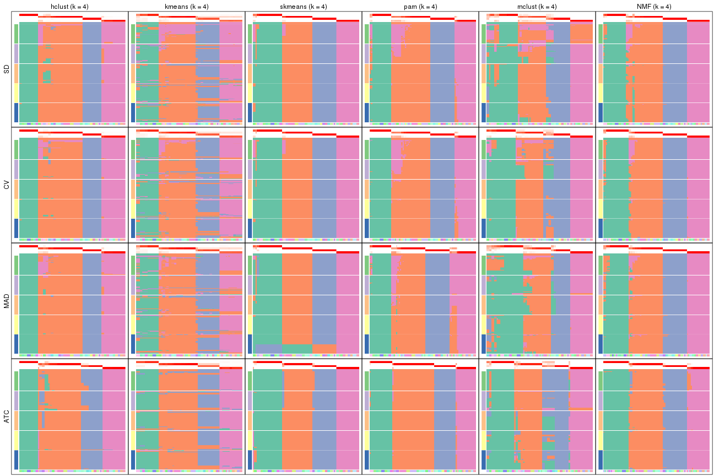</p>

</div>
<div id='tab-collect-membership-heatmap-4'>
<pre><code class="r">collect_plots(res_list, k = 5, fun = membership_heatmap, mc.cores = 4)
</code></pre>

<p></p>

</div>
<div id='tab-collect-membership-heatmap-5'>
<pre><code class="r">collect_plots(res_list, k = 6, fun = membership_heatmap, mc.cores = 4)
</code></pre>

<p></p>

</div>
</div>


### Signature heatmap

Signature heatmaps for all methods. ([What is a signature heatmap?](http://bioconductor.org/packages/devel/bioc/vignettes/cola/inst/doc/cola.html#toc_22))


Note in following heatmaps, rows are scaled.


<script>
$( function() {
	$( '#tabs-collect-get-signatures' ).tabs();
} );
</script>
<div id='tabs-collect-get-signatures'>
<ul>
<li><a href='#tab-collect-get-signatures-1'>k = 2</a></li>
<li><a href='#tab-collect-get-signatures-2'>k = 3</a></li>
<li><a href='#tab-collect-get-signatures-3'>k = 4</a></li>
<li><a href='#tab-collect-get-signatures-4'>k = 5</a></li>
<li><a href='#tab-collect-get-signatures-5'>k = 6</a></li>
</ul>
<div id='tab-collect-get-signatures-1'>
<pre><code class="r">collect_plots(res_list, k = 2, fun = get_signatures, mc.cores = 4)
</code></pre>

<p></p>

</div>
<div id='tab-collect-get-signatures-2'>
<pre><code class="r">collect_plots(res_list, k = 3, fun = get_signatures, mc.cores = 4)
</code></pre>

<p></p>

</div>
<div id='tab-collect-get-signatures-3'>
<pre><code class="r">collect_plots(res_list, k = 4, fun = get_signatures, mc.cores = 4)
</code></pre>

<p></p>

</div>
<div id='tab-collect-get-signatures-4'>
<pre><code class="r">collect_plots(res_list, k = 5, fun = get_signatures, mc.cores = 4)
</code></pre>

<p></p>

</div>
<div id='tab-collect-get-signatures-5'>
<pre><code class="r">collect_plots(res_list, k = 6, fun = get_signatures, mc.cores = 4)
</code></pre>

<p></p>

</div>
</div>


### Statistics table

The statistics used for measuring the stability of consensus partitioning.
([How are they
defined?](http://bioconductor.org/packages/devel/bioc/vignettes/cola/inst/doc/cola.html#toc_13))


<script>
$( function() {
	$( '#tabs-get-stats-from-consensus-partition-list' ).tabs();
} );
</script>
<div id='tabs-get-stats-from-consensus-partition-list'>
<ul>
<li><a href='#tab-get-stats-from-consensus-partition-list-1'>k = 2</a></li>
<li><a href='#tab-get-stats-from-consensus-partition-list-2'>k = 3</a></li>
<li><a href='#tab-get-stats-from-consensus-partition-list-3'>k = 4</a></li>
<li><a href='#tab-get-stats-from-consensus-partition-list-4'>k = 5</a></li>
<li><a href='#tab-get-stats-from-consensus-partition-list-5'>k = 6</a></li>
</ul>
<div id='tab-get-stats-from-consensus-partition-list-1'>
<pre><code class="r">get_stats(res_list, k = 2)
</code></pre>

<pre><code>#&gt;             k 1-PAC mean_silhouette concordance area_increased  Rand Jaccard
#&gt; SD:NMF      2 0.892           0.896       0.935          0.437 0.577   0.577
#&gt; CV:NMF      2 0.910           0.917       0.960          0.456 0.550   0.550
#&gt; MAD:NMF     2 0.861           0.883       0.937          0.447 0.550   0.550
#&gt; ATC:NMF     2 0.894           0.912       0.961          0.453 0.535   0.535
#&gt; SD:skmeans  2 1.000           0.937       0.949          0.506 0.494   0.494
#&gt; CV:skmeans  2 1.000           0.980       0.991          0.506 0.494   0.494
#&gt; MAD:skmeans 2 0.494           0.926       0.943          0.506 0.494   0.494
#&gt; ATC:skmeans 2 1.000           0.954       0.966          0.504 0.497   0.497
#&gt; SD:mclust   2 0.221           0.373       0.679          0.503 0.559   0.559
#&gt; CV:mclust   2 0.220           0.484       0.677          0.503 0.620   0.620
#&gt; MAD:mclust  2 0.279           0.886       0.894          0.505 0.497   0.497
#&gt; ATC:mclust  2 0.532           0.919       0.924          0.498 0.501   0.501
#&gt; SD:kmeans   2 0.229           0.504       0.653          0.396 0.494   0.494
#&gt; CV:kmeans   2 0.242           0.524       0.644          0.385 0.598   0.598
#&gt; MAD:kmeans  2 0.189           0.502       0.686          0.399 0.508   0.508
#&gt; ATC:kmeans  2 0.223           0.681       0.723          0.381 0.646   0.646
#&gt; SD:pam      2 1.000           0.982       0.979          0.350 0.646   0.646
#&gt; CV:pam      2 0.485           0.834       0.851          0.342 0.646   0.646
#&gt; MAD:pam     2 0.491           0.806       0.827          0.346 0.646   0.646
#&gt; ATC:pam     2 0.510           0.893       0.895          0.335 0.659   0.659
#&gt; SD:hclust   2 0.371           0.728       0.810          0.355 0.512   0.512
#&gt; CV:hclust   2 0.405           0.359       0.691          0.361 0.620   0.620
#&gt; MAD:hclust  2 0.280           0.598       0.791          0.398 0.703   0.703
#&gt; ATC:hclust  2 1.000           0.987       0.995          0.347 0.659   0.659
</code></pre>

</div>
<div id='tab-get-stats-from-consensus-partition-list-2'>
<pre><code class="r">get_stats(res_list, k = 3)
</code></pre>

<pre><code>#&gt;             k 1-PAC mean_silhouette concordance area_increased  Rand Jaccard
#&gt; SD:NMF      3 0.821           0.869       0.937          0.427 0.648   0.465
#&gt; CV:NMF      3 0.778           0.887       0.939          0.377 0.616   0.419
#&gt; MAD:NMF     3 0.945           0.932       0.969          0.387 0.626   0.430
#&gt; ATC:NMF     3 1.000           0.966       0.984          0.396 0.793   0.626
#&gt; SD:skmeans  3 0.609           0.786       0.870          0.272 0.598   0.364
#&gt; CV:skmeans  3 0.589           0.604       0.776          0.274 0.572   0.319
#&gt; MAD:skmeans 3 0.564           0.699       0.859          0.283 0.687   0.453
#&gt; ATC:skmeans 3 1.000           0.973       0.988          0.271 0.804   0.627
#&gt; SD:mclust   3 0.937           0.893       0.947          0.273 0.551   0.339
#&gt; CV:mclust   3 0.958           0.900       0.957          0.279 0.690   0.519
#&gt; MAD:mclust  3 0.981           0.919       0.954          0.265 0.824   0.659
#&gt; ATC:mclust  3 0.585           0.814       0.777          0.273 0.579   0.345
#&gt; SD:kmeans   3 0.391           0.764       0.780          0.499 0.592   0.375
#&gt; CV:kmeans   3 0.382           0.778       0.781          0.544 0.685   0.521
#&gt; MAD:kmeans  3 0.478           0.636       0.634          0.511 0.641   0.408
#&gt; ATC:kmeans  3 0.592           0.878       0.871          0.559 0.739   0.604
#&gt; SD:pam      3 1.000           0.964       0.988          0.653 0.785   0.667
#&gt; CV:pam      3 1.000           0.996       0.999          0.719 0.766   0.637
#&gt; MAD:pam     3 1.000           0.984       0.994          0.701 0.766   0.637
#&gt; ATC:pam     3 0.676           0.906       0.861          0.705 0.771   0.652
#&gt; SD:hclust   3 0.639           0.808       0.813          0.588 0.918   0.840
#&gt; CV:hclust   3 0.640           0.832       0.829          0.550 0.659   0.510
#&gt; MAD:hclust  3 0.657           0.816       0.821          0.392 0.727   0.612
#&gt; ATC:hclust  3 0.626           0.483       0.769          0.700 0.673   0.508
</code></pre>

</div>
<div id='tab-get-stats-from-consensus-partition-list-3'>
<pre><code class="r">get_stats(res_list, k = 4)
</code></pre>

<pre><code>#&gt;             k 1-PAC mean_silhouette concordance area_increased  Rand Jaccard
#&gt; SD:NMF      4 0.938           0.919       0.963          0.202 0.834   0.589
#&gt; CV:NMF      4 0.974           0.925       0.967          0.199 0.861   0.640
#&gt; MAD:NMF     4 0.941           0.926       0.963          0.212 0.850   0.618
#&gt; ATC:NMF     4 0.961           0.948       0.977          0.187 0.820   0.546
#&gt; SD:skmeans  4 0.964           0.964       0.983          0.173 0.876   0.664
#&gt; CV:skmeans  4 0.964           0.967       0.985          0.172 0.865   0.621
#&gt; MAD:skmeans 4 1.000           0.968       0.912          0.164 0.837   0.563
#&gt; ATC:skmeans 4 0.973           0.946       0.978          0.181 0.849   0.599
#&gt; SD:mclust   4 0.659           0.817       0.838          0.145 0.857   0.613
#&gt; CV:mclust   4 0.783           0.859       0.915          0.153 0.818   0.533
#&gt; MAD:mclust  4 0.718           0.779       0.886          0.138 0.803   0.517
#&gt; ATC:mclust  4 0.820           0.807       0.897          0.166 0.880   0.669
#&gt; SD:kmeans   4 0.613           0.901       0.834          0.175 0.850   0.628
#&gt; CV:kmeans   4 0.630           0.908       0.854          0.189 0.850   0.628
#&gt; MAD:kmeans  4 0.603           0.896       0.853          0.163 0.899   0.711
#&gt; ATC:kmeans  4 0.828           0.956       0.909          0.200 0.849   0.632
#&gt; SD:pam      4 0.880           0.867       0.939          0.272 0.813   0.573
#&gt; CV:pam      4 0.904           0.884       0.948          0.260 0.849   0.633
#&gt; MAD:pam     4 0.862           0.805       0.930          0.262 0.837   0.605
#&gt; ATC:pam     4 1.000           0.969       0.989          0.279 0.839   0.626
#&gt; SD:hclust   4 0.891           0.939       0.965          0.287 0.849   0.650
#&gt; CV:hclust   4 0.938           0.963       0.972          0.292 0.849   0.650
#&gt; MAD:hclust  4 0.914           0.954       0.973          0.305 0.849   0.650
#&gt; ATC:hclust  4 0.869           0.921       0.961          0.241 0.757   0.435
</code></pre>

</div>
<div id='tab-get-stats-from-consensus-partition-list-4'>
<pre><code class="r">get_stats(res_list, k = 5)
</code></pre>

<pre><code>#&gt;             k 1-PAC mean_silhouette concordance area_increased  Rand Jaccard
#&gt; SD:NMF      5 0.878           0.825       0.887         0.0483 0.944   0.787
#&gt; CV:NMF      5 0.852           0.743       0.822         0.0499 0.943   0.780
#&gt; MAD:NMF     5 0.888           0.799       0.893         0.0473 0.977   0.908
#&gt; ATC:NMF     5 0.853           0.872       0.902         0.0434 0.987   0.948
#&gt; SD:skmeans  5 0.891           0.879       0.896         0.0463 0.971   0.880
#&gt; CV:skmeans  5 0.910           0.810       0.899         0.0470 0.983   0.930
#&gt; MAD:skmeans 5 0.916           0.893       0.896         0.0471 0.971   0.880
#&gt; ATC:skmeans 5 0.892           0.863       0.927         0.0434 0.962   0.847
#&gt; SD:mclust   5 0.780           0.658       0.834         0.0748 0.913   0.680
#&gt; CV:mclust   5 0.813           0.780       0.889         0.0654 0.882   0.572
#&gt; MAD:mclust  5 0.830           0.643       0.827         0.0875 0.936   0.761
#&gt; ATC:mclust  5 0.875           0.840       0.916         0.0731 0.917   0.682
#&gt; SD:kmeans   5 0.765           0.836       0.841         0.0871 1.000   1.000
#&gt; CV:kmeans   5 0.790           0.853       0.853         0.0823 1.000   1.000
#&gt; MAD:kmeans  5 0.806           0.831       0.852         0.0904 0.987   0.949
#&gt; ATC:kmeans  5 0.743           0.892       0.877         0.0643 1.000   1.000
#&gt; SD:pam      5 0.795           0.810       0.873         0.0382 0.971   0.888
#&gt; CV:pam      5 0.828           0.806       0.890         0.0326 0.974   0.899
#&gt; MAD:pam     5 0.925           0.831       0.932         0.0346 0.917   0.707
#&gt; ATC:pam     5 1.000           0.958       0.983         0.0278 0.981   0.931
#&gt; SD:hclust   5 0.855           0.869       0.914         0.0461 0.964   0.873
#&gt; CV:hclust   5 0.903           0.897       0.926         0.0492 0.964   0.873
#&gt; MAD:hclust  5 0.889           0.902       0.945         0.0539 0.964   0.873
#&gt; ATC:hclust  5 0.866           0.894       0.941         0.0371 0.977   0.916
</code></pre>

</div>
<div id='tab-get-stats-from-consensus-partition-list-5'>
<pre><code class="r">get_stats(res_list, k = 6)
</code></pre>

<pre><code>#&gt;             k 1-PAC mean_silhouette concordance area_increased  Rand Jaccard
#&gt; SD:NMF      6 0.868           0.803       0.857         0.0381 0.968   0.853
#&gt; CV:NMF      6 0.869           0.738       0.859         0.0371 0.949   0.771
#&gt; MAD:NMF     6 0.858           0.785       0.872         0.0392 0.955   0.807
#&gt; ATC:NMF     6 0.826           0.797       0.851         0.0316 0.964   0.857
#&gt; SD:skmeans  6 0.869           0.757       0.839         0.0389 0.961   0.823
#&gt; CV:skmeans  6 0.858           0.761       0.780         0.0377 0.930   0.704
#&gt; MAD:skmeans 6 0.871           0.799       0.836         0.0380 0.943   0.744
#&gt; ATC:skmeans 6 0.879           0.776       0.864         0.0333 0.990   0.954
#&gt; SD:mclust   6 0.839           0.822       0.856         0.0442 0.884   0.541
#&gt; CV:mclust   6 0.840           0.778       0.869         0.0398 0.940   0.715
#&gt; MAD:mclust  6 0.849           0.672       0.846         0.0387 0.906   0.607
#&gt; ATC:mclust  6 0.901           0.844       0.910         0.0395 0.916   0.628
#&gt; SD:kmeans   6 0.764           0.731       0.811         0.0533 0.978   0.914
#&gt; CV:kmeans   6 0.765           0.755       0.800         0.0445 0.987   0.949
#&gt; MAD:kmeans  6 0.776           0.728       0.816         0.0494 0.991   0.963
#&gt; ATC:kmeans  6 0.810           0.821       0.822         0.0438 1.000   1.000
#&gt; SD:pam      6 0.856           0.861       0.916         0.0268 0.987   0.946
#&gt; CV:pam      6 0.878           0.869       0.917         0.0243 0.987   0.947
#&gt; MAD:pam     6 0.876           0.820       0.914         0.0199 0.987   0.946
#&gt; ATC:pam     6 0.973           0.901       0.951         0.0250 0.968   0.879
#&gt; SD:hclust   6 0.873           0.877       0.917         0.0438 0.974   0.894
#&gt; CV:hclust   6 0.870           0.887       0.910         0.0393 0.974   0.894
#&gt; MAD:hclust  6 0.935           0.884       0.903         0.0427 0.955   0.819
#&gt; ATC:hclust  6 0.874           0.867       0.936         0.0490 0.952   0.808
</code></pre>

</div>
</div>

Following heatmap plots the partition for each combination of methods and the
lightness correspond to the silhouette scores for samples in each method. On
top the consensus subgroup is inferred from all methods by taking the mean
silhouette scores as weight.


<script>
$( function() {
	$( '#tabs-collect-stats-from-consensus-partition-list' ).tabs();
} );
</script>
<div id='tabs-collect-stats-from-consensus-partition-list'>
<ul>
<li><a href='#tab-collect-stats-from-consensus-partition-list-1'>k = 2</a></li>
<li><a href='#tab-collect-stats-from-consensus-partition-list-2'>k = 3</a></li>
<li><a href='#tab-collect-stats-from-consensus-partition-list-3'>k = 4</a></li>
<li><a href='#tab-collect-stats-from-consensus-partition-list-4'>k = 5</a></li>
<li><a href='#tab-collect-stats-from-consensus-partition-list-5'>k = 6</a></li>
</ul>
<div id='tab-collect-stats-from-consensus-partition-list-1'>
<pre><code class="r">collect_stats(res_list, k = 2)
</code></pre>

<p></p>

</div>
<div id='tab-collect-stats-from-consensus-partition-list-2'>
<pre><code class="r">collect_stats(res_list, k = 3)
</code></pre>

<p></p>

</div>
<div id='tab-collect-stats-from-consensus-partition-list-3'>
<pre><code class="r">collect_stats(res_list, k = 4)
</code></pre>

<p></p>

</div>
<div id='tab-collect-stats-from-consensus-partition-list-4'>
<pre><code class="r">collect_stats(res_list, k = 5)
</code></pre>

<p>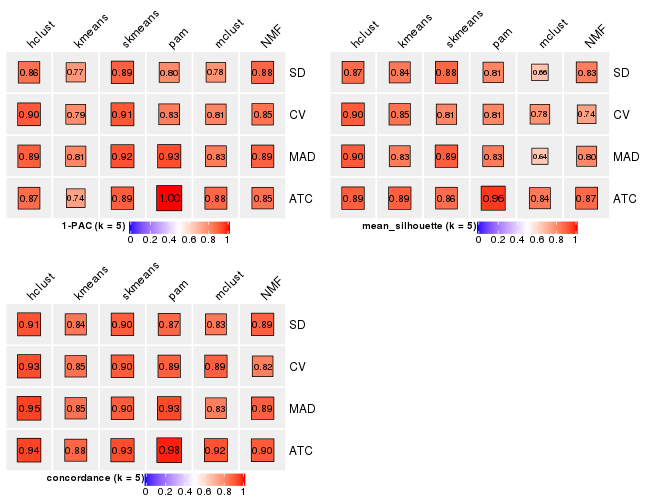</p>

</div>
<div id='tab-collect-stats-from-consensus-partition-list-5'>
<pre><code class="r">collect_stats(res_list, k = 6)
</code></pre>

<p></p>

</div>
</div>

### Partition from all methods


Collect partitions from all methods:


<script>
$( function() {
	$( '#tabs-collect-classes-from-consensus-partition-list' ).tabs();
} );
</script>
<div id='tabs-collect-classes-from-consensus-partition-list'>
<ul>
<li><a href='#tab-collect-classes-from-consensus-partition-list-1'>k = 2</a></li>
<li><a href='#tab-collect-classes-from-consensus-partition-list-2'>k = 3</a></li>
<li><a href='#tab-collect-classes-from-consensus-partition-list-3'>k = 4</a></li>
<li><a href='#tab-collect-classes-from-consensus-partition-list-4'>k = 5</a></li>
<li><a href='#tab-collect-classes-from-consensus-partition-list-5'>k = 6</a></li>
</ul>
<div id='tab-collect-classes-from-consensus-partition-list-1'>
<pre><code class="r">collect_classes(res_list, k = 2)
</code></pre>

<p>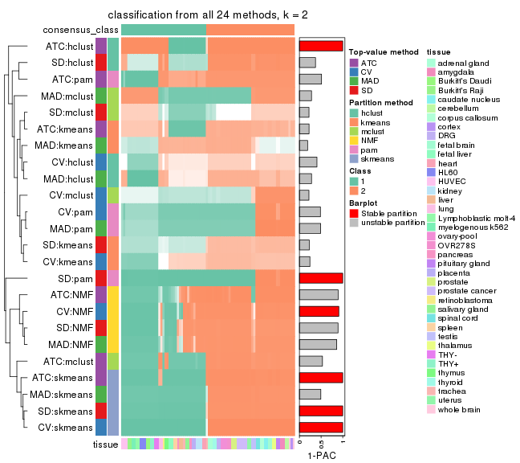</p>

</div>
<div id='tab-collect-classes-from-consensus-partition-list-2'>
<pre><code class="r">collect_classes(res_list, k = 3)
</code></pre>

<p></p>

</div>
<div id='tab-collect-classes-from-consensus-partition-list-3'>
<pre><code class="r">collect_classes(res_list, k = 4)
</code></pre>

<p></p>

</div>
<div id='tab-collect-classes-from-consensus-partition-list-4'>
<pre><code class="r">collect_classes(res_list, k = 5)
</code></pre>

<p></p>

</div>
<div id='tab-collect-classes-from-consensus-partition-list-5'>
<pre><code class="r">collect_classes(res_list, k = 6)
</code></pre>

<p></p>

</div>
</div>


### Top rows overlap


Overlap of top rows from different top-row methods:


<script>
$( function() {
	$( '#tabs-top-rows-overlap-by-euler' ).tabs();
} );
</script>
<div id='tabs-top-rows-overlap-by-euler'>
<ul>
<li><a href='#tab-top-rows-overlap-by-euler-1'>top_n = 823</a></li>
<li><a href='#tab-top-rows-overlap-by-euler-2'>top_n = 1646</a></li>
<li><a href='#tab-top-rows-overlap-by-euler-3'>top_n = 2468</a></li>
<li><a href='#tab-top-rows-overlap-by-euler-4'>top_n = 3291</a></li>
<li><a href='#tab-top-rows-overlap-by-euler-5'>top_n = 4114</a></li>
</ul>
<div id='tab-top-rows-overlap-by-euler-1'>
<pre><code class="r">top_rows_overlap(res_list, top_n = 823, method = &quot;euler&quot;)
</code></pre>

<p></p>

</div>
<div id='tab-top-rows-overlap-by-euler-2'>
<pre><code class="r">top_rows_overlap(res_list, top_n = 1646, method = &quot;euler&quot;)
</code></pre>

<p>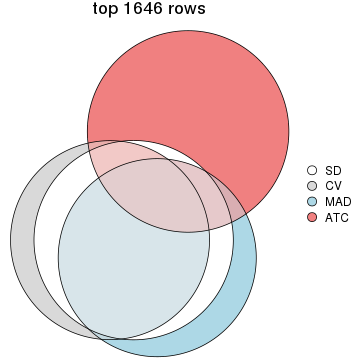</p>

</div>
<div id='tab-top-rows-overlap-by-euler-3'>
<pre><code class="r">top_rows_overlap(res_list, top_n = 2468, method = &quot;euler&quot;)
</code></pre>

<p></p>

</div>
<div id='tab-top-rows-overlap-by-euler-4'>
<pre><code class="r">top_rows_overlap(res_list, top_n = 3291, method = &quot;euler&quot;)
</code></pre>

<p></p>

</div>
<div id='tab-top-rows-overlap-by-euler-5'>
<pre><code class="r">top_rows_overlap(res_list, top_n = 4114, method = &quot;euler&quot;)
</code></pre>

<p></p>

</div>
</div>

Also visualize the correspondance of rankings between different top-row methods:


<script>
$( function() {
	$( '#tabs-top-rows-overlap-by-correspondance' ).tabs();
} );
</script>
<div id='tabs-top-rows-overlap-by-correspondance'>
<ul>
<li><a href='#tab-top-rows-overlap-by-correspondance-1'>top_n = 823</a></li>
<li><a href='#tab-top-rows-overlap-by-correspondance-2'>top_n = 1646</a></li>
<li><a href='#tab-top-rows-overlap-by-correspondance-3'>top_n = 2468</a></li>
<li><a href='#tab-top-rows-overlap-by-correspondance-4'>top_n = 3291</a></li>
<li><a href='#tab-top-rows-overlap-by-correspondance-5'>top_n = 4114</a></li>
</ul>
<div id='tab-top-rows-overlap-by-correspondance-1'>
<pre><code class="r">top_rows_overlap(res_list, top_n = 823, method = &quot;correspondance&quot;)
</code></pre>

<p></p>

</div>
<div id='tab-top-rows-overlap-by-correspondance-2'>
<pre><code class="r">top_rows_overlap(res_list, top_n = 1646, method = &quot;correspondance&quot;)
</code></pre>

<p>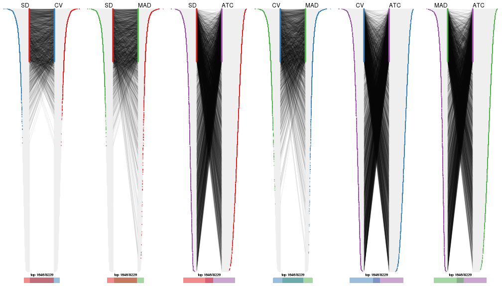</p>

</div>
<div id='tab-top-rows-overlap-by-correspondance-3'>
<pre><code class="r">top_rows_overlap(res_list, top_n = 2468, method = &quot;correspondance&quot;)
</code></pre>

<p></p>

</div>
<div id='tab-top-rows-overlap-by-correspondance-4'>
<pre><code class="r">top_rows_overlap(res_list, top_n = 3291, method = &quot;correspondance&quot;)
</code></pre>

<p></p>

</div>
<div id='tab-top-rows-overlap-by-correspondance-5'>
<pre><code class="r">top_rows_overlap(res_list, top_n = 4114, method = &quot;correspondance&quot;)
</code></pre>

<p></p>

</div>
</div>


Heatmaps of the top rows:


<script>
$( function() {
	$( '#tabs-top-rows-heatmap' ).tabs();
} );
</script>
<div id='tabs-top-rows-heatmap'>
<ul>
<li><a href='#tab-top-rows-heatmap-1'>top_n = 823</a></li>
<li><a href='#tab-top-rows-heatmap-2'>top_n = 1646</a></li>
<li><a href='#tab-top-rows-heatmap-3'>top_n = 2468</a></li>
<li><a href='#tab-top-rows-heatmap-4'>top_n = 3291</a></li>
<li><a href='#tab-top-rows-heatmap-5'>top_n = 4114</a></li>
</ul>
<div id='tab-top-rows-heatmap-1'>
<pre><code class="r">top_rows_heatmap(res_list, top_n = 823)
</code></pre>

<p></p>

</div>
<div id='tab-top-rows-heatmap-2'>
<pre><code class="r">top_rows_heatmap(res_list, top_n = 1646)
</code></pre>

<p></p>

</div>
<div id='tab-top-rows-heatmap-3'>
<pre><code class="r">top_rows_heatmap(res_list, top_n = 2468)
</code></pre>

<p></p>

</div>
<div id='tab-top-rows-heatmap-4'>
<pre><code class="r">top_rows_heatmap(res_list, top_n = 3291)
</code></pre>

<p></p>

</div>
<div id='tab-top-rows-heatmap-5'>
<pre><code class="r">top_rows_heatmap(res_list, top_n = 4114)
</code></pre>

<p></p>

</div>
</div>


### Test to known annotations


Test correlation between subgroups and known annotations. If the known
annotation is numeric, one-way ANOVA test is applied, and if the known
annotation is discrete, chi-squared contingency table test is applied.


<script>
$( function() {
	$( '#tabs-test-to-known-factors-from-consensus-partition-list' ).tabs();
} );
</script>
<div id='tabs-test-to-known-factors-from-consensus-partition-list'>
<ul>
<li><a href='#tab-test-to-known-factors-from-consensus-partition-list-1'>k = 2</a></li>
<li><a href='#tab-test-to-known-factors-from-consensus-partition-list-2'>k = 3</a></li>
<li><a href='#tab-test-to-known-factors-from-consensus-partition-list-3'>k = 4</a></li>
<li><a href='#tab-test-to-known-factors-from-consensus-partition-list-4'>k = 5</a></li>
<li><a href='#tab-test-to-known-factors-from-consensus-partition-list-5'>k = 6</a></li>
</ul>
<div id='tab-test-to-known-factors-from-consensus-partition-list-1'>
<pre><code class="r">test_to_known_factors(res_list, k = 2)
</code></pre>

<pre><code>#&gt;              n tissue(p) k
#&gt; SD:NMF      79  4.66e-05 2
#&gt; CV:NMF      81  6.04e-05 2
#&gt; MAD:NMF     80  5.31e-05 2
#&gt; ATC:NMF     81  6.04e-05 2
#&gt; SD:skmeans  83  3.39e-05 2
#&gt; CV:skmeans  83  3.39e-05 2
#&gt; MAD:skmeans 83  3.39e-05 2
#&gt; ATC:skmeans 84  4.54e-05 2
#&gt; SD:mclust   19        NA 2
#&gt; CV:mclust   19        NA 2
#&gt; MAD:mclust  84  2.53e-05 2
#&gt; ATC:mclust  84  4.57e-05 2
#&gt; SD:kmeans   60  1.68e-04 2
#&gt; CV:kmeans   61  1.95e-04 2
#&gt; MAD:kmeans  45        NA 2
#&gt; ATC:kmeans  64  3.97e-04 2
#&gt; SD:pam      84  2.53e-05 2
#&gt; CV:pam      84  2.53e-05 2
#&gt; MAD:pam     84  2.53e-05 2
#&gt; ATC:pam     84  2.53e-05 2
#&gt; SD:hclust   67  1.21e-04 2
#&gt; CV:hclust   15        NA 2
#&gt; MAD:hclust  65  1.42e-04 2
#&gt; ATC:hclust  83  3.39e-05 2
</code></pre>

</div>
<div id='tab-test-to-known-factors-from-consensus-partition-list-2'>
<pre><code class="r">test_to_known_factors(res_list, k = 3)
</code></pre>

<pre><code>#&gt;              n tissue(p) k
#&gt; SD:NMF      77  2.99e-08 3
#&gt; CV:NMF      79  2.19e-08 3
#&gt; MAD:NMF     82  9.10e-09 3
#&gt; ATC:NMF     84  1.72e-08 3
#&gt; SD:skmeans  81  6.98e-09 3
#&gt; CV:skmeans  64  1.46e-07 3
#&gt; MAD:skmeans 64  1.46e-07 3
#&gt; ATC:skmeans 84  6.67e-09 3
#&gt; SD:mclust   78  1.69e-08 3
#&gt; CV:mclust   79  2.19e-08 3
#&gt; MAD:mclust  80  1.24e-08 3
#&gt; ATC:mclust  83  5.13e-09 3
#&gt; SD:kmeans   84  6.67e-09 3
#&gt; CV:kmeans   84  6.67e-09 3
#&gt; MAD:kmeans  61  8.31e-07 3
#&gt; ATC:kmeans  84  1.65e-08 3
#&gt; SD:pam      82  2.06e-08 3
#&gt; CV:pam      84  2.34e-08 3
#&gt; MAD:pam     84  2.34e-08 3
#&gt; ATC:pam     84  1.63e-07 3
#&gt; SD:hclust   84  6.67e-09 3
#&gt; CV:hclust   84  6.67e-09 3
#&gt; MAD:hclust  84  6.67e-09 3
#&gt; ATC:hclust  50  1.60e-05 3
</code></pre>

</div>
<div id='tab-test-to-known-factors-from-consensus-partition-list-3'>
<pre><code class="r">test_to_known_factors(res_list, k = 4)
</code></pre>

<pre><code>#&gt;              n tissue(p) k
#&gt; SD:NMF      81  2.10e-11 4
#&gt; CV:NMF      80  1.46e-11 4
#&gt; MAD:NMF     82  9.12e-12 4
#&gt; ATC:NMF     83  4.06e-12 4
#&gt; SD:skmeans  83  4.22e-12 4
#&gt; CV:skmeans  83  4.22e-12 4
#&gt; MAD:skmeans 83  4.22e-12 4
#&gt; ATC:skmeans 81  6.79e-12 4
#&gt; SD:mclust   76  3.70e-11 4
#&gt; CV:mclust   79  1.16e-11 4
#&gt; MAD:mclust  74  6.77e-11 4
#&gt; ATC:mclust  77  1.70e-11 4
#&gt; SD:kmeans   82  8.86e-12 4
#&gt; CV:kmeans   84  5.71e-12 4
#&gt; MAD:kmeans  82  8.86e-12 4
#&gt; ATC:kmeans  84  5.57e-12 4
#&gt; SD:pam      81  2.66e-10 4
#&gt; CV:pam      80  6.57e-11 4
#&gt; MAD:pam     73  4.97e-10 4
#&gt; ATC:pam     83  1.77e-10 4
#&gt; SD:hclust   84  1.99e-12 4
#&gt; CV:hclust   84  1.99e-12 4
#&gt; MAD:hclust  84  1.99e-12 4
#&gt; ATC:hclust  81  7.31e-12 4
</code></pre>

</div>
<div id='tab-test-to-known-factors-from-consensus-partition-list-4'>
<pre><code class="r">test_to_known_factors(res_list, k = 5)
</code></pre>

<pre><code>#&gt;              n tissue(p) k
#&gt; SD:NMF      77  3.38e-14 5
#&gt; CV:NMF      61  8.46e-07 5
#&gt; MAD:NMF     76  2.03e-14 5
#&gt; ATC:NMF     83  4.06e-12 5
#&gt; SD:skmeans  82  3.49e-15 5
#&gt; CV:skmeans  79  1.87e-14 5
#&gt; MAD:skmeans 82  3.49e-15 5
#&gt; ATC:skmeans 78  3.91e-15 5
#&gt; SD:mclust   64  1.46e-12 5
#&gt; CV:mclust   74  6.72e-14 5
#&gt; MAD:mclust  63  8.71e-13 5
#&gt; ATC:mclust  79  4.10e-15 5
#&gt; SD:kmeans   79  3.12e-11 5
#&gt; CV:kmeans   82  8.86e-12 5
#&gt; MAD:kmeans  79  3.61e-15 5
#&gt; ATC:kmeans  84  5.57e-12 5
#&gt; SD:pam      75  3.07e-10 5
#&gt; CV:pam      76  1.38e-10 5
#&gt; MAD:pam     74  3.22e-13 5
#&gt; ATC:pam     83  4.01e-12 5
#&gt; SD:hclust   78  3.91e-15 5
#&gt; CV:hclust   84  6.24e-16 5
#&gt; MAD:hclust  82  1.15e-15 5
#&gt; ATC:hclust  79  6.48e-15 5
</code></pre>

</div>
<div id='tab-test-to-known-factors-from-consensus-partition-list-5'>
<pre><code class="r">test_to_known_factors(res_list, k = 6)
</code></pre>

<pre><code>#&gt;              n tissue(p) k
#&gt; SD:NMF      78  5.97e-18 6
#&gt; CV:NMF      75  5.30e-17 6
#&gt; MAD:NMF     78  5.97e-18 6
#&gt; ATC:NMF     80  6.28e-15 6
#&gt; SD:skmeans  67  6.10e-12 6
#&gt; CV:skmeans  73  3.70e-17 6
#&gt; MAD:skmeans 77  8.02e-18 6
#&gt; ATC:skmeans 74  9.11e-18 6
#&gt; SD:mclust   78  4.67e-17 6
#&gt; CV:mclust   78  2.87e-16 6
#&gt; MAD:mclust  61  1.60e-12 6
#&gt; ATC:mclust  73  3.70e-17 6
#&gt; SD:kmeans   77  6.70e-15 6
#&gt; CV:kmeans   77  6.70e-15 6
#&gt; MAD:kmeans  77  6.70e-15 6
#&gt; ATC:kmeans  84  5.57e-12 6
#&gt; SD:pam      80  1.42e-16 6
#&gt; CV:pam      81  1.23e-17 6
#&gt; MAD:pam     74  4.81e-16 6
#&gt; ATC:pam     80  8.33e-17 6
#&gt; SD:hclust   78  1.99e-18 6
#&gt; CV:hclust   80  9.28e-19 6
#&gt; MAD:hclust  78  1.99e-18 6
#&gt; ATC:hclust  79  3.73e-18 6
</code></pre>

</div>
</div>


 
## Results for each method


---------------------------------------------------


### SD:hclust


The object with results only for a single top-value method and a single partition method 
can be extracted as:

```r
res = res_list["SD", "hclust"]
# you can also extract it by
# res = res_list["SD:hclust"]
```

A summary of `res` and all the functions that can be applied to it:

```r
res
```

```
#> A 'ConsensusPartition' object with k = 2, 3, 4, 5, 6.
#>   On a matrix with 8229 rows and 84 columns.
#>   Top rows (823, 1646, 2468, 3291, 4114) are extracted by 'SD' method.
#>   Subgroups are detected by 'hclust' method.
#>   Performed in total 1250 partitions by row resampling.
#>   Best k for subgroups seems to be 4.
#> 
#> Following methods can be applied to this 'ConsensusPartition' object:
#>  [1] "cola_report"             "collect_classes"         "collect_plots"          
#>  [4] "collect_stats"           "colnames"                "compare_signatures"     
#>  [7] "consensus_heatmap"       "dimension_reduction"     "functional_enrichment"  
#> [10] "get_anno_col"            "get_anno"                "get_classes"            
#> [13] "get_consensus"           "get_matrix"              "get_membership"         
#> [16] "get_param"               "get_signatures"          "get_stats"              
#> [19] "is_best_k"               "is_stable_k"             "membership_heatmap"     
#> [22] "ncol"                    "nrow"                    "plot_ecdf"              
#> [25] "rownames"                "select_partition_number" "show"                   
#> [28] "suggest_best_k"          "test_to_known_factors"
```

`collect_plots()` function collects all the plots made from `res` for all `k` (number of partitions)
into one single page to provide an easy and fast comparison between different `k`.

```r
collect_plots(res)
```


The plots are:

- The first row: a plot of the ECDF (Empirical cumulative distribution
  function) curves of the consensus matrix for each `k` and the heatmap of
  predicted classes for each `k`.
- The second row: heatmaps of the consensus matrix for each `k`.
- The third row: heatmaps of the membership matrix for each `k`.
- The fouth row: heatmaps of the signatures for each `k`.

All the plots in panels can be made by individual functions and they are
plotted later in this section.

`select_partition_number()` produces several plots showing different
statistics for choosing "optimized" `k`. There are following statistics:

- ECDF curves of the consensus matrix for each `k`;
- 1-PAC. [The PAC
  score](https://en.wikipedia.org/wiki/Consensus_clustering#Over-interpretation_potential_of_consensus_clustering)
  measures the proportion of the ambiguous subgrouping.
- Mean silhouette score.
- Concordance. The mean probability of fiting the consensus class ids in all
  partitions.
- Area increased. Denote $A_k$ as the area under the ECDF curve for current
  `k`, the area increased is defined as $A_k - A_{k-1}$.
- Rand index. The percent of pairs of samples that are both in a same cluster
  or both are not in a same cluster in the partition of k and k-1.
- Jaccard index. The ratio of pairs of samples are both in a same cluster in
  the partition of k and k-1 and the pairs of samples are both in a same
  cluster in the partition k or k-1.

The detailed explanations of these statistics can be found in [the cola
vignette](http://bioconductor.org/packages/devel/bioc/vignettes/cola/inst/doc/cola.html#toc_13).

Generally speaking, lower PAC score, higher mean silhouette score or higher
concordance corresponds to better partition. Rand index and Jaccard index
measure how similar the current partition is compared to partition with `k-1`.
If they are too similar, we won't accept `k` is better than `k-1`.

```r
select_partition_number(res)
```


The numeric values for all these statistics can be obtained by `get_stats()`.

```r
get_stats(res)
```

```
#>   k 1-PAC mean_silhouette concordance area_increased  Rand Jaccard
#> 2 2 0.371           0.728       0.810         0.3549 0.512   0.512
#> 3 3 0.639           0.808       0.813         0.5876 0.918   0.840
#> 4 4 0.891           0.939       0.965         0.2867 0.849   0.650
#> 5 5 0.855           0.869       0.914         0.0461 0.964   0.873
#> 6 6 0.873           0.877       0.917         0.0438 0.974   0.894
```

`suggest_best_k()` suggests the best $k$ based on these statistics. The rules are as follows:

- All $k$ with Jaccard index larger than 0.95 are removed because the increase of
  the partition number does not provides enough extra information. If all $k$ are removed,
  the best $k$ is assigned by `NA`.
- For $k$ with 1-PAC larger than 0.9, the maximal $k$ is taken as the "best k". Other $k$ is called "optional k".
- If it does not fit the second rule. The $k$ with the highest vote of highest
  1-PAC, mean silhouette and concordance is taken as the "best k".

```r
suggest_best_k(res)
```

```
#> [1] 4
```


Following shows the table of the partitions (You need to click the **show/hide
code output** link to see it). The membership matrix (columns with name `p*`)
is inferred by
[`clue::cl_consensus()`](https://www.rdocumentation.org/link/cl_consensus?package=clue)
function with the `SE` method. Basically the value in the membership matrix
represents the probability to belong to a certain group. The finall class
label for an item is determined with the group with highest probability it
belongs to.

In `get_classes()` function, the entropy is calculated from the membership
matrix and the silhouette score is calculated from the consensus matrix.


<script>
$( function() {
	$( '#tabs-SD-hclust-get-classes' ).tabs();
} );
</script>
<div id='tabs-SD-hclust-get-classes'>
<ul>
<li><a href='#tab-SD-hclust-get-classes-1'>k = 2</a></li>
<li><a href='#tab-SD-hclust-get-classes-2'>k = 3</a></li>
<li><a href='#tab-SD-hclust-get-classes-3'>k = 4</a></li>
<li><a href='#tab-SD-hclust-get-classes-4'>k = 5</a></li>
<li><a href='#tab-SD-hclust-get-classes-5'>k = 6</a></li>
</ul>

<div id='tab-SD-hclust-get-classes-1'>
<p><a id='tab-SD-hclust-get-classes-1-a' style='color:#0366d6' href='#'>show/hide code output</a></p>
<pre><code class="r">cbind(get_classes(res, k = 2), get_membership(res, k = 2))
</code></pre>

<pre><code>#&gt;         class entropy silhouette    p1    p2
#&gt; GSM2819     2  0.6048      0.730 0.148 0.852
#&gt; GSM2820     2  0.1633      0.946 0.024 0.976
#&gt; GSM2822     2  0.0672      0.951 0.008 0.992
#&gt; GSM2832     2  0.0672      0.951 0.008 0.992
#&gt; GSM2823     2  0.4161      0.846 0.084 0.916
#&gt; GSM2824     2  0.4161      0.846 0.084 0.916
#&gt; GSM2825     2  0.0672      0.951 0.008 0.992
#&gt; GSM2826     2  0.0672      0.951 0.008 0.992
#&gt; GSM2829     1  0.9775      0.532 0.588 0.412
#&gt; GSM2856     1  0.9775      0.532 0.588 0.412
#&gt; GSM2830     1  0.9775      0.532 0.588 0.412
#&gt; GSM2843     1  0.9775      0.532 0.588 0.412
#&gt; GSM2871     1  0.9775      0.532 0.588 0.412
#&gt; GSM2831     1  0.9775      0.532 0.588 0.412
#&gt; GSM2844     1  0.9775      0.532 0.588 0.412
#&gt; GSM2833     1  0.9775      0.532 0.588 0.412
#&gt; GSM2846     1  0.9775      0.532 0.588 0.412
#&gt; GSM2835     1  0.9775      0.532 0.588 0.412
#&gt; GSM2858     1  0.9775      0.532 0.588 0.412
#&gt; GSM2836     2  0.0000      0.959 0.000 1.000
#&gt; GSM2848     2  0.0000      0.959 0.000 1.000
#&gt; GSM2828     2  0.1633      0.946 0.024 0.976
#&gt; GSM2837     2  0.1633      0.946 0.024 0.976
#&gt; GSM2839     1  0.9983      0.303 0.524 0.476
#&gt; GSM2841     1  0.9983      0.303 0.524 0.476
#&gt; GSM2827     2  0.0000      0.959 0.000 1.000
#&gt; GSM2842     2  0.0000      0.959 0.000 1.000
#&gt; GSM2845     1  0.9775      0.532 0.588 0.412
#&gt; GSM2872     1  0.9775      0.532 0.588 0.412
#&gt; GSM2834     1  0.9775      0.532 0.588 0.412
#&gt; GSM2847     1  0.9775      0.532 0.588 0.412
#&gt; GSM2849     2  0.1633      0.946 0.024 0.976
#&gt; GSM2850     2  0.1633      0.946 0.024 0.976
#&gt; GSM2838     2  0.0000      0.959 0.000 1.000
#&gt; GSM2853     2  0.0000      0.959 0.000 1.000
#&gt; GSM2852     2  0.0000      0.959 0.000 1.000
#&gt; GSM2855     2  0.0000      0.959 0.000 1.000
#&gt; GSM2840     1  0.9983      0.303 0.524 0.476
#&gt; GSM2857     1  0.9983      0.303 0.524 0.476
#&gt; GSM2859     2  0.0000      0.959 0.000 1.000
#&gt; GSM2860     2  0.0000      0.959 0.000 1.000
#&gt; GSM2861     2  0.0000      0.959 0.000 1.000
#&gt; GSM2862     2  0.0000      0.959 0.000 1.000
#&gt; GSM2863     2  0.0000      0.959 0.000 1.000
#&gt; GSM2864     2  0.0000      0.959 0.000 1.000
#&gt; GSM2865     2  0.0000      0.959 0.000 1.000
#&gt; GSM2866     2  0.0000      0.959 0.000 1.000
#&gt; GSM2868     2  0.0000      0.959 0.000 1.000
#&gt; GSM2869     2  0.0000      0.959 0.000 1.000
#&gt; GSM2851     2  0.0000      0.959 0.000 1.000
#&gt; GSM2867     2  0.0000      0.959 0.000 1.000
#&gt; GSM2870     2  0.0000      0.959 0.000 1.000
#&gt; GSM2854     1  0.9909      0.490 0.556 0.444
#&gt; GSM2873     1  0.9909      0.490 0.556 0.444
#&gt; GSM2874     2  0.1633      0.946 0.024 0.976
#&gt; GSM2884     2  0.1633      0.946 0.024 0.976
#&gt; GSM2875     1  0.9983      0.303 0.524 0.476
#&gt; GSM2890     1  0.9983      0.303 0.524 0.476
#&gt; GSM2877     1  0.9983      0.303 0.524 0.476
#&gt; GSM2892     1  0.9983      0.303 0.524 0.476
#&gt; GSM2902     1  0.9983      0.303 0.524 0.476
#&gt; GSM2878     1  0.9983      0.303 0.524 0.476
#&gt; GSM2901     1  0.9983      0.303 0.524 0.476
#&gt; GSM2879     2  0.0000      0.959 0.000 1.000
#&gt; GSM2898     2  0.0000      0.959 0.000 1.000
#&gt; GSM2881     2  0.1633      0.946 0.024 0.976
#&gt; GSM2897     2  0.1633      0.946 0.024 0.976
#&gt; GSM2882     1  0.9775      0.532 0.588 0.412
#&gt; GSM2894     1  0.9775      0.532 0.588 0.412
#&gt; GSM2883     2  0.1633      0.946 0.024 0.976
#&gt; GSM2895     2  0.1633      0.946 0.024 0.976
#&gt; GSM2885     2  0.1633      0.946 0.024 0.976
#&gt; GSM2886     2  0.1633      0.946 0.024 0.976
#&gt; GSM2887     2  0.1633      0.946 0.024 0.976
#&gt; GSM2896     2  0.1633      0.946 0.024 0.976
#&gt; GSM2888     2  0.0000      0.959 0.000 1.000
#&gt; GSM2889     2  0.0000      0.959 0.000 1.000
#&gt; GSM2876     1  0.9983      0.303 0.524 0.476
#&gt; GSM2891     1  0.9983      0.303 0.524 0.476
#&gt; GSM2880     1  0.9983      0.303 0.524 0.476
#&gt; GSM2893     1  0.9983      0.303 0.524 0.476
#&gt; GSM2821     2  0.6048      0.730 0.148 0.852
#&gt; GSM2900     2  0.6048      0.730 0.148 0.852
#&gt; GSM2903     2  0.6048      0.730 0.148 0.852
</code></pre>

<script>
$('#tab-SD-hclust-get-classes-1-a').parent().next().next().hide();
$('#tab-SD-hclust-get-classes-1-a').click(function(){
  $('#tab-SD-hclust-get-classes-1-a').parent().next().next().toggle();
  return(false);
});
</script>
</div>

<div id='tab-SD-hclust-get-classes-2'>
<p><a id='tab-SD-hclust-get-classes-2-a' style='color:#0366d6' href='#'>show/hide code output</a></p>
<pre><code class="r">cbind(get_classes(res, k = 3), get_membership(res, k = 3))
</code></pre>

<pre><code>#&gt;         class entropy silhouette    p1    p2    p3
#&gt; GSM2819     3  0.9497      0.572 0.200 0.332 0.468
#&gt; GSM2820     3  0.0000      0.601 0.000 0.000 1.000
#&gt; GSM2822     3  0.6192      0.737 0.000 0.420 0.580
#&gt; GSM2832     3  0.6192      0.737 0.000 0.420 0.580
#&gt; GSM2823     3  0.8887      0.641 0.128 0.368 0.504
#&gt; GSM2824     3  0.8887      0.641 0.128 0.368 0.504
#&gt; GSM2825     3  0.6192      0.737 0.000 0.420 0.580
#&gt; GSM2826     3  0.6192      0.737 0.000 0.420 0.580
#&gt; GSM2829     2  0.0000      0.994 0.000 1.000 0.000
#&gt; GSM2856     2  0.0000      0.994 0.000 1.000 0.000
#&gt; GSM2830     2  0.0000      0.994 0.000 1.000 0.000
#&gt; GSM2843     2  0.0000      0.994 0.000 1.000 0.000
#&gt; GSM2871     2  0.0000      0.994 0.000 1.000 0.000
#&gt; GSM2831     2  0.0000      0.994 0.000 1.000 0.000
#&gt; GSM2844     2  0.0000      0.994 0.000 1.000 0.000
#&gt; GSM2833     2  0.0000      0.994 0.000 1.000 0.000
#&gt; GSM2846     2  0.0000      0.994 0.000 1.000 0.000
#&gt; GSM2835     2  0.0000      0.994 0.000 1.000 0.000
#&gt; GSM2858     2  0.0000      0.994 0.000 1.000 0.000
#&gt; GSM2836     3  0.6168      0.745 0.000 0.412 0.588
#&gt; GSM2848     3  0.6168      0.745 0.000 0.412 0.588
#&gt; GSM2828     3  0.0000      0.601 0.000 0.000 1.000
#&gt; GSM2837     3  0.0000      0.601 0.000 0.000 1.000
#&gt; GSM2839     1  0.0000      0.998 1.000 0.000 0.000
#&gt; GSM2841     1  0.0000      0.998 1.000 0.000 0.000
#&gt; GSM2827     3  0.6168      0.745 0.000 0.412 0.588
#&gt; GSM2842     3  0.6168      0.745 0.000 0.412 0.588
#&gt; GSM2845     2  0.0000      0.994 0.000 1.000 0.000
#&gt; GSM2872     2  0.0000      0.994 0.000 1.000 0.000
#&gt; GSM2834     2  0.0000      0.994 0.000 1.000 0.000
#&gt; GSM2847     2  0.0000      0.994 0.000 1.000 0.000
#&gt; GSM2849     3  0.0000      0.601 0.000 0.000 1.000
#&gt; GSM2850     3  0.0000      0.601 0.000 0.000 1.000
#&gt; GSM2838     3  0.6168      0.745 0.000 0.412 0.588
#&gt; GSM2853     3  0.6168      0.745 0.000 0.412 0.588
#&gt; GSM2852     3  0.6008      0.737 0.000 0.372 0.628
#&gt; GSM2855     3  0.6008      0.737 0.000 0.372 0.628
#&gt; GSM2840     1  0.0000      0.998 1.000 0.000 0.000
#&gt; GSM2857     1  0.0000      0.998 1.000 0.000 0.000
#&gt; GSM2859     3  0.6168      0.745 0.000 0.412 0.588
#&gt; GSM2860     3  0.6168      0.745 0.000 0.412 0.588
#&gt; GSM2861     3  0.6168      0.745 0.000 0.412 0.588
#&gt; GSM2862     3  0.6168      0.745 0.000 0.412 0.588
#&gt; GSM2863     3  0.6168      0.745 0.000 0.412 0.588
#&gt; GSM2864     3  0.6168      0.745 0.000 0.412 0.588
#&gt; GSM2865     3  0.6168      0.745 0.000 0.412 0.588
#&gt; GSM2866     3  0.6168      0.745 0.000 0.412 0.588
#&gt; GSM2868     3  0.6168      0.745 0.000 0.412 0.588
#&gt; GSM2869     3  0.6168      0.745 0.000 0.412 0.588
#&gt; GSM2851     3  0.6168      0.745 0.000 0.412 0.588
#&gt; GSM2867     3  0.6168      0.745 0.000 0.412 0.588
#&gt; GSM2870     3  0.6168      0.745 0.000 0.412 0.588
#&gt; GSM2854     2  0.1289      0.950 0.000 0.968 0.032
#&gt; GSM2873     2  0.1289      0.950 0.000 0.968 0.032
#&gt; GSM2874     3  0.0000      0.601 0.000 0.000 1.000
#&gt; GSM2884     3  0.0000      0.601 0.000 0.000 1.000
#&gt; GSM2875     1  0.0000      0.998 1.000 0.000 0.000
#&gt; GSM2890     1  0.0000      0.998 1.000 0.000 0.000
#&gt; GSM2877     1  0.0000      0.998 1.000 0.000 0.000
#&gt; GSM2892     1  0.0000      0.998 1.000 0.000 0.000
#&gt; GSM2902     1  0.0000      0.998 1.000 0.000 0.000
#&gt; GSM2878     1  0.0000      0.998 1.000 0.000 0.000
#&gt; GSM2901     1  0.0000      0.998 1.000 0.000 0.000
#&gt; GSM2879     3  0.6095      0.743 0.000 0.392 0.608
#&gt; GSM2898     3  0.6095      0.743 0.000 0.392 0.608
#&gt; GSM2881     3  0.0000      0.601 0.000 0.000 1.000
#&gt; GSM2897     3  0.0000      0.601 0.000 0.000 1.000
#&gt; GSM2882     2  0.0000      0.994 0.000 1.000 0.000
#&gt; GSM2894     2  0.0000      0.994 0.000 1.000 0.000
#&gt; GSM2883     3  0.0000      0.601 0.000 0.000 1.000
#&gt; GSM2895     3  0.0000      0.601 0.000 0.000 1.000
#&gt; GSM2885     3  0.0000      0.601 0.000 0.000 1.000
#&gt; GSM2886     3  0.0000      0.601 0.000 0.000 1.000
#&gt; GSM2887     3  0.0000      0.601 0.000 0.000 1.000
#&gt; GSM2896     3  0.0000      0.601 0.000 0.000 1.000
#&gt; GSM2888     3  0.6168      0.745 0.000 0.412 0.588
#&gt; GSM2889     3  0.6168      0.745 0.000 0.412 0.588
#&gt; GSM2876     1  0.0592      0.985 0.988 0.000 0.012
#&gt; GSM2891     1  0.0592      0.985 0.988 0.000 0.012
#&gt; GSM2880     1  0.0000      0.998 1.000 0.000 0.000
#&gt; GSM2893     1  0.0000      0.998 1.000 0.000 0.000
#&gt; GSM2821     3  0.9497      0.572 0.200 0.332 0.468
#&gt; GSM2900     3  0.9497      0.572 0.200 0.332 0.468
#&gt; GSM2903     3  0.9497      0.572 0.200 0.332 0.468
</code></pre>

<script>
$('#tab-SD-hclust-get-classes-2-a').parent().next().next().hide();
$('#tab-SD-hclust-get-classes-2-a').click(function(){
  $('#tab-SD-hclust-get-classes-2-a').parent().next().next().toggle();
  return(false);
});
</script>
</div>

<div id='tab-SD-hclust-get-classes-3'>
<p><a id='tab-SD-hclust-get-classes-3-a' style='color:#0366d6' href='#'>show/hide code output</a></p>
<pre><code class="r">cbind(get_classes(res, k = 4), get_membership(res, k = 4))
</code></pre>

<pre><code>#&gt;         class entropy silhouette    p1    p2    p3    p4
#&gt; GSM2819     2  0.4284      0.761 0.200 0.780 0.000 0.020
#&gt; GSM2820     3  0.0000      0.999 0.000 0.000 1.000 0.000
#&gt; GSM2822     2  0.3688      0.755 0.000 0.792 0.000 0.208
#&gt; GSM2832     2  0.3688      0.755 0.000 0.792 0.000 0.208
#&gt; GSM2823     2  0.3088      0.847 0.128 0.864 0.000 0.008
#&gt; GSM2824     2  0.3088      0.847 0.128 0.864 0.000 0.008
#&gt; GSM2825     2  0.3688      0.755 0.000 0.792 0.000 0.208
#&gt; GSM2826     2  0.3688      0.755 0.000 0.792 0.000 0.208
#&gt; GSM2829     4  0.0336      0.965 0.000 0.008 0.000 0.992
#&gt; GSM2856     4  0.0336      0.965 0.000 0.008 0.000 0.992
#&gt; GSM2830     4  0.0921      0.962 0.000 0.028 0.000 0.972
#&gt; GSM2843     4  0.0921      0.962 0.000 0.028 0.000 0.972
#&gt; GSM2871     4  0.0921      0.962 0.000 0.028 0.000 0.972
#&gt; GSM2831     4  0.0336      0.965 0.000 0.008 0.000 0.992
#&gt; GSM2844     4  0.0336      0.965 0.000 0.008 0.000 0.992
#&gt; GSM2833     4  0.0336      0.965 0.000 0.008 0.000 0.992
#&gt; GSM2846     4  0.0336      0.965 0.000 0.008 0.000 0.992
#&gt; GSM2835     4  0.0336      0.965 0.000 0.008 0.000 0.992
#&gt; GSM2858     4  0.0336      0.965 0.000 0.008 0.000 0.992
#&gt; GSM2836     2  0.0336      0.932 0.000 0.992 0.000 0.008
#&gt; GSM2848     2  0.0336      0.932 0.000 0.992 0.000 0.008
#&gt; GSM2828     3  0.0000      0.999 0.000 0.000 1.000 0.000
#&gt; GSM2837     3  0.0000      0.999 0.000 0.000 1.000 0.000
#&gt; GSM2839     1  0.0000      0.998 1.000 0.000 0.000 0.000
#&gt; GSM2841     1  0.0000      0.998 1.000 0.000 0.000 0.000
#&gt; GSM2827     2  0.0336      0.932 0.000 0.992 0.000 0.008
#&gt; GSM2842     2  0.0336      0.932 0.000 0.992 0.000 0.008
#&gt; GSM2845     4  0.0921      0.962 0.000 0.028 0.000 0.972
#&gt; GSM2872     4  0.0921      0.962 0.000 0.028 0.000 0.972
#&gt; GSM2834     4  0.0921      0.962 0.000 0.028 0.000 0.972
#&gt; GSM2847     4  0.0921      0.962 0.000 0.028 0.000 0.972
#&gt; GSM2849     3  0.0000      0.999 0.000 0.000 1.000 0.000
#&gt; GSM2850     3  0.0000      0.999 0.000 0.000 1.000 0.000
#&gt; GSM2838     2  0.0000      0.934 0.000 1.000 0.000 0.000
#&gt; GSM2853     2  0.0000      0.934 0.000 1.000 0.000 0.000
#&gt; GSM2852     2  0.1557      0.905 0.000 0.944 0.056 0.000
#&gt; GSM2855     2  0.1557      0.905 0.000 0.944 0.056 0.000
#&gt; GSM2840     1  0.0000      0.998 1.000 0.000 0.000 0.000
#&gt; GSM2857     1  0.0000      0.998 1.000 0.000 0.000 0.000
#&gt; GSM2859     2  0.0000      0.934 0.000 1.000 0.000 0.000
#&gt; GSM2860     2  0.0000      0.934 0.000 1.000 0.000 0.000
#&gt; GSM2861     2  0.0000      0.934 0.000 1.000 0.000 0.000
#&gt; GSM2862     2  0.0000      0.934 0.000 1.000 0.000 0.000
#&gt; GSM2863     2  0.0000      0.934 0.000 1.000 0.000 0.000
#&gt; GSM2864     2  0.0000      0.934 0.000 1.000 0.000 0.000
#&gt; GSM2865     2  0.0000      0.934 0.000 1.000 0.000 0.000
#&gt; GSM2866     2  0.0000      0.934 0.000 1.000 0.000 0.000
#&gt; GSM2868     2  0.0000      0.934 0.000 1.000 0.000 0.000
#&gt; GSM2869     2  0.0000      0.934 0.000 1.000 0.000 0.000
#&gt; GSM2851     2  0.0000      0.934 0.000 1.000 0.000 0.000
#&gt; GSM2867     2  0.0000      0.934 0.000 1.000 0.000 0.000
#&gt; GSM2870     2  0.0000      0.934 0.000 1.000 0.000 0.000
#&gt; GSM2854     4  0.3528      0.774 0.000 0.192 0.000 0.808
#&gt; GSM2873     4  0.3528      0.774 0.000 0.192 0.000 0.808
#&gt; GSM2874     3  0.0000      0.999 0.000 0.000 1.000 0.000
#&gt; GSM2884     3  0.0000      0.999 0.000 0.000 1.000 0.000
#&gt; GSM2875     1  0.0000      0.998 1.000 0.000 0.000 0.000
#&gt; GSM2890     1  0.0000      0.998 1.000 0.000 0.000 0.000
#&gt; GSM2877     1  0.0000      0.998 1.000 0.000 0.000 0.000
#&gt; GSM2892     1  0.0000      0.998 1.000 0.000 0.000 0.000
#&gt; GSM2902     1  0.0000      0.998 1.000 0.000 0.000 0.000
#&gt; GSM2878     1  0.0000      0.998 1.000 0.000 0.000 0.000
#&gt; GSM2901     1  0.0000      0.998 1.000 0.000 0.000 0.000
#&gt; GSM2879     2  0.1042      0.925 0.000 0.972 0.020 0.008
#&gt; GSM2898     2  0.1042      0.925 0.000 0.972 0.020 0.008
#&gt; GSM2881     3  0.0000      0.999 0.000 0.000 1.000 0.000
#&gt; GSM2897     3  0.0000      0.999 0.000 0.000 1.000 0.000
#&gt; GSM2882     4  0.0336      0.965 0.000 0.008 0.000 0.992
#&gt; GSM2894     4  0.0336      0.965 0.000 0.008 0.000 0.992
#&gt; GSM2883     3  0.0000      0.999 0.000 0.000 1.000 0.000
#&gt; GSM2895     3  0.0000      0.999 0.000 0.000 1.000 0.000
#&gt; GSM2885     3  0.0000      0.999 0.000 0.000 1.000 0.000
#&gt; GSM2886     3  0.0000      0.999 0.000 0.000 1.000 0.000
#&gt; GSM2887     3  0.0188      0.995 0.000 0.004 0.996 0.000
#&gt; GSM2896     3  0.0188      0.995 0.000 0.004 0.996 0.000
#&gt; GSM2888     2  0.0000      0.934 0.000 1.000 0.000 0.000
#&gt; GSM2889     2  0.0000      0.934 0.000 1.000 0.000 0.000
#&gt; GSM2876     1  0.0469      0.986 0.988 0.012 0.000 0.000
#&gt; GSM2891     1  0.0469      0.986 0.988 0.012 0.000 0.000
#&gt; GSM2880     1  0.0000      0.998 1.000 0.000 0.000 0.000
#&gt; GSM2893     1  0.0000      0.998 1.000 0.000 0.000 0.000
#&gt; GSM2821     2  0.4284      0.761 0.200 0.780 0.000 0.020
#&gt; GSM2900     2  0.4284      0.761 0.200 0.780 0.000 0.020
#&gt; GSM2903     2  0.4284      0.761 0.200 0.780 0.000 0.020
</code></pre>

<script>
$('#tab-SD-hclust-get-classes-3-a').parent().next().next().hide();
$('#tab-SD-hclust-get-classes-3-a').click(function(){
  $('#tab-SD-hclust-get-classes-3-a').parent().next().next().toggle();
  return(false);
});
</script>
</div>

<div id='tab-SD-hclust-get-classes-4'>
<p><a id='tab-SD-hclust-get-classes-4-a' style='color:#0366d6' href='#'>show/hide code output</a></p>
<pre><code class="r">cbind(get_classes(res, k = 5), get_membership(res, k = 5))
</code></pre>

<pre><code>#&gt;         class entropy silhouette    p1    p2    p3    p4    p5
#&gt; GSM2819     5  0.4045      1.000 0.000 0.356 0.000 0.000 0.644
#&gt; GSM2820     3  0.0000      0.999 0.000 0.000 1.000 0.000 0.000
#&gt; GSM2822     2  0.4073      0.498 0.000 0.752 0.000 0.216 0.032
#&gt; GSM2832     2  0.4073      0.498 0.000 0.752 0.000 0.216 0.032
#&gt; GSM2823     2  0.3582      0.429 0.000 0.768 0.000 0.008 0.224
#&gt; GSM2824     2  0.3582      0.429 0.000 0.768 0.000 0.008 0.224
#&gt; GSM2825     2  0.4073      0.498 0.000 0.752 0.000 0.216 0.032
#&gt; GSM2826     2  0.4073      0.498 0.000 0.752 0.000 0.216 0.032
#&gt; GSM2829     4  0.0000      0.811 0.000 0.000 0.000 1.000 0.000
#&gt; GSM2856     4  0.0000      0.811 0.000 0.000 0.000 1.000 0.000
#&gt; GSM2830     4  0.4599      0.768 0.000 0.020 0.000 0.624 0.356
#&gt; GSM2843     4  0.4599      0.768 0.000 0.020 0.000 0.624 0.356
#&gt; GSM2871     4  0.4599      0.768 0.000 0.020 0.000 0.624 0.356
#&gt; GSM2831     4  0.0000      0.811 0.000 0.000 0.000 1.000 0.000
#&gt; GSM2844     4  0.0000      0.811 0.000 0.000 0.000 1.000 0.000
#&gt; GSM2833     4  0.0000      0.811 0.000 0.000 0.000 1.000 0.000
#&gt; GSM2846     4  0.0000      0.811 0.000 0.000 0.000 1.000 0.000
#&gt; GSM2835     4  0.0000      0.811 0.000 0.000 0.000 1.000 0.000
#&gt; GSM2858     4  0.0000      0.811 0.000 0.000 0.000 1.000 0.000
#&gt; GSM2836     2  0.0290      0.897 0.000 0.992 0.000 0.008 0.000
#&gt; GSM2848     2  0.0290      0.897 0.000 0.992 0.000 0.008 0.000
#&gt; GSM2828     3  0.0000      0.999 0.000 0.000 1.000 0.000 0.000
#&gt; GSM2837     3  0.0000      0.999 0.000 0.000 1.000 0.000 0.000
#&gt; GSM2839     1  0.0000      0.971 1.000 0.000 0.000 0.000 0.000
#&gt; GSM2841     1  0.0000      0.971 1.000 0.000 0.000 0.000 0.000
#&gt; GSM2827     2  0.0290      0.897 0.000 0.992 0.000 0.008 0.000
#&gt; GSM2842     2  0.0290      0.897 0.000 0.992 0.000 0.008 0.000
#&gt; GSM2845     4  0.4599      0.768 0.000 0.020 0.000 0.624 0.356
#&gt; GSM2872     4  0.4599      0.768 0.000 0.020 0.000 0.624 0.356
#&gt; GSM2834     4  0.4599      0.768 0.000 0.020 0.000 0.624 0.356
#&gt; GSM2847     4  0.4599      0.768 0.000 0.020 0.000 0.624 0.356
#&gt; GSM2849     3  0.0000      0.999 0.000 0.000 1.000 0.000 0.000
#&gt; GSM2850     3  0.0000      0.999 0.000 0.000 1.000 0.000 0.000
#&gt; GSM2838     2  0.0000      0.902 0.000 1.000 0.000 0.000 0.000
#&gt; GSM2853     2  0.0000      0.902 0.000 1.000 0.000 0.000 0.000
#&gt; GSM2852     2  0.1341      0.837 0.000 0.944 0.056 0.000 0.000
#&gt; GSM2855     2  0.1341      0.837 0.000 0.944 0.056 0.000 0.000
#&gt; GSM2840     1  0.0000      0.971 1.000 0.000 0.000 0.000 0.000
#&gt; GSM2857     1  0.0000      0.971 1.000 0.000 0.000 0.000 0.000
#&gt; GSM2859     2  0.0000      0.902 0.000 1.000 0.000 0.000 0.000
#&gt; GSM2860     2  0.0000      0.902 0.000 1.000 0.000 0.000 0.000
#&gt; GSM2861     2  0.0000      0.902 0.000 1.000 0.000 0.000 0.000
#&gt; GSM2862     2  0.0000      0.902 0.000 1.000 0.000 0.000 0.000
#&gt; GSM2863     2  0.0000      0.902 0.000 1.000 0.000 0.000 0.000
#&gt; GSM2864     2  0.0000      0.902 0.000 1.000 0.000 0.000 0.000
#&gt; GSM2865     2  0.0000      0.902 0.000 1.000 0.000 0.000 0.000
#&gt; GSM2866     2  0.0000      0.902 0.000 1.000 0.000 0.000 0.000
#&gt; GSM2868     2  0.0000      0.902 0.000 1.000 0.000 0.000 0.000
#&gt; GSM2869     2  0.0000      0.902 0.000 1.000 0.000 0.000 0.000
#&gt; GSM2851     2  0.0000      0.902 0.000 1.000 0.000 0.000 0.000
#&gt; GSM2867     2  0.0000      0.902 0.000 1.000 0.000 0.000 0.000
#&gt; GSM2870     2  0.0000      0.902 0.000 1.000 0.000 0.000 0.000
#&gt; GSM2854     4  0.6326      0.563 0.000 0.160 0.000 0.460 0.380
#&gt; GSM2873     4  0.6326      0.563 0.000 0.160 0.000 0.460 0.380
#&gt; GSM2874     3  0.0000      0.999 0.000 0.000 1.000 0.000 0.000
#&gt; GSM2884     3  0.0000      0.999 0.000 0.000 1.000 0.000 0.000
#&gt; GSM2875     1  0.0000      0.971 1.000 0.000 0.000 0.000 0.000
#&gt; GSM2890     1  0.0000      0.971 1.000 0.000 0.000 0.000 0.000
#&gt; GSM2877     1  0.0000      0.971 1.000 0.000 0.000 0.000 0.000
#&gt; GSM2892     1  0.0000      0.971 1.000 0.000 0.000 0.000 0.000
#&gt; GSM2902     1  0.0000      0.971 1.000 0.000 0.000 0.000 0.000
#&gt; GSM2878     1  0.0000      0.971 1.000 0.000 0.000 0.000 0.000
#&gt; GSM2901     1  0.0000      0.971 1.000 0.000 0.000 0.000 0.000
#&gt; GSM2879     2  0.0898      0.882 0.000 0.972 0.020 0.008 0.000
#&gt; GSM2898     2  0.0898      0.882 0.000 0.972 0.020 0.008 0.000
#&gt; GSM2881     3  0.0000      0.999 0.000 0.000 1.000 0.000 0.000
#&gt; GSM2897     3  0.0000      0.999 0.000 0.000 1.000 0.000 0.000
#&gt; GSM2882     4  0.0000      0.811 0.000 0.000 0.000 1.000 0.000
#&gt; GSM2894     4  0.0000      0.811 0.000 0.000 0.000 1.000 0.000
#&gt; GSM2883     3  0.0000      0.999 0.000 0.000 1.000 0.000 0.000
#&gt; GSM2895     3  0.0000      0.999 0.000 0.000 1.000 0.000 0.000
#&gt; GSM2885     3  0.0000      0.999 0.000 0.000 1.000 0.000 0.000
#&gt; GSM2886     3  0.0000      0.999 0.000 0.000 1.000 0.000 0.000
#&gt; GSM2887     3  0.0162      0.995 0.000 0.004 0.996 0.000 0.000
#&gt; GSM2896     3  0.0162      0.995 0.000 0.004 0.996 0.000 0.000
#&gt; GSM2888     2  0.0000      0.902 0.000 1.000 0.000 0.000 0.000
#&gt; GSM2889     2  0.0000      0.902 0.000 1.000 0.000 0.000 0.000
#&gt; GSM2876     1  0.3210      0.780 0.788 0.000 0.000 0.000 0.212
#&gt; GSM2891     1  0.3210      0.780 0.788 0.000 0.000 0.000 0.212
#&gt; GSM2880     1  0.0000      0.971 1.000 0.000 0.000 0.000 0.000
#&gt; GSM2893     1  0.0000      0.971 1.000 0.000 0.000 0.000 0.000
#&gt; GSM2821     5  0.4045      1.000 0.000 0.356 0.000 0.000 0.644
#&gt; GSM2900     5  0.4045      1.000 0.000 0.356 0.000 0.000 0.644
#&gt; GSM2903     5  0.4045      1.000 0.000 0.356 0.000 0.000 0.644
</code></pre>

<script>
$('#tab-SD-hclust-get-classes-4-a').parent().next().next().hide();
$('#tab-SD-hclust-get-classes-4-a').click(function(){
  $('#tab-SD-hclust-get-classes-4-a').parent().next().next().toggle();
  return(false);
});
</script>
</div>

<div id='tab-SD-hclust-get-classes-5'>
<p><a id='tab-SD-hclust-get-classes-5-a' style='color:#0366d6' href='#'>show/hide code output</a></p>
<pre><code class="r">cbind(get_classes(res, k = 6), get_membership(res, k = 6))
</code></pre>

<pre><code>#&gt;         class entropy silhouette    p1    p2    p3    p4    p5    p6
#&gt; GSM2819     5  0.1957      1.000 0.000 0.112 0.000 0.000 0.888 0.000
#&gt; GSM2820     3  0.0000      0.999 0.000 0.000 1.000 0.000 0.000 0.000
#&gt; GSM2822     2  0.5321      0.442 0.000 0.596 0.000 0.136 0.004 0.264
#&gt; GSM2832     2  0.5321      0.442 0.000 0.596 0.000 0.136 0.004 0.264
#&gt; GSM2823     2  0.4300      0.259 0.000 0.608 0.000 0.000 0.364 0.028
#&gt; GSM2824     2  0.4300      0.259 0.000 0.608 0.000 0.000 0.364 0.028
#&gt; GSM2825     2  0.5321      0.442 0.000 0.596 0.000 0.136 0.004 0.264
#&gt; GSM2826     2  0.5321      0.442 0.000 0.596 0.000 0.136 0.004 0.264
#&gt; GSM2829     4  0.0000      0.957 0.000 0.000 0.000 1.000 0.000 0.000
#&gt; GSM2856     4  0.0000      0.957 0.000 0.000 0.000 1.000 0.000 0.000
#&gt; GSM2830     6  0.3244      0.871 0.000 0.000 0.000 0.268 0.000 0.732
#&gt; GSM2843     6  0.3244      0.871 0.000 0.000 0.000 0.268 0.000 0.732
#&gt; GSM2871     6  0.3244      0.871 0.000 0.000 0.000 0.268 0.000 0.732
#&gt; GSM2831     4  0.1267      0.934 0.000 0.000 0.000 0.940 0.000 0.060
#&gt; GSM2844     4  0.1267      0.934 0.000 0.000 0.000 0.940 0.000 0.060
#&gt; GSM2833     4  0.0000      0.957 0.000 0.000 0.000 1.000 0.000 0.000
#&gt; GSM2846     4  0.0000      0.957 0.000 0.000 0.000 1.000 0.000 0.000
#&gt; GSM2835     4  0.0000      0.957 0.000 0.000 0.000 1.000 0.000 0.000
#&gt; GSM2858     4  0.0000      0.957 0.000 0.000 0.000 1.000 0.000 0.000
#&gt; GSM2836     2  0.0632      0.884 0.000 0.976 0.000 0.000 0.000 0.024
#&gt; GSM2848     2  0.0632      0.884 0.000 0.976 0.000 0.000 0.000 0.024
#&gt; GSM2828     3  0.0000      0.999 0.000 0.000 1.000 0.000 0.000 0.000
#&gt; GSM2837     3  0.0000      0.999 0.000 0.000 1.000 0.000 0.000 0.000
#&gt; GSM2839     1  0.1957      0.897 0.888 0.000 0.000 0.000 0.112 0.000
#&gt; GSM2841     1  0.1957      0.897 0.888 0.000 0.000 0.000 0.112 0.000
#&gt; GSM2827     2  0.0632      0.884 0.000 0.976 0.000 0.000 0.000 0.024
#&gt; GSM2842     2  0.0632      0.884 0.000 0.976 0.000 0.000 0.000 0.024
#&gt; GSM2845     6  0.3244      0.871 0.000 0.000 0.000 0.268 0.000 0.732
#&gt; GSM2872     6  0.3244      0.871 0.000 0.000 0.000 0.268 0.000 0.732
#&gt; GSM2834     6  0.3244      0.871 0.000 0.000 0.000 0.268 0.000 0.732
#&gt; GSM2847     6  0.3244      0.871 0.000 0.000 0.000 0.268 0.000 0.732
#&gt; GSM2849     3  0.0000      0.999 0.000 0.000 1.000 0.000 0.000 0.000
#&gt; GSM2850     3  0.0000      0.999 0.000 0.000 1.000 0.000 0.000 0.000
#&gt; GSM2838     2  0.0000      0.894 0.000 1.000 0.000 0.000 0.000 0.000
#&gt; GSM2853     2  0.0000      0.894 0.000 1.000 0.000 0.000 0.000 0.000
#&gt; GSM2852     2  0.1349      0.852 0.000 0.940 0.056 0.000 0.000 0.004
#&gt; GSM2855     2  0.1349      0.852 0.000 0.940 0.056 0.000 0.000 0.004
#&gt; GSM2840     1  0.1957      0.897 0.888 0.000 0.000 0.000 0.112 0.000
#&gt; GSM2857     1  0.1957      0.897 0.888 0.000 0.000 0.000 0.112 0.000
#&gt; GSM2859     2  0.0146      0.894 0.000 0.996 0.000 0.000 0.000 0.004
#&gt; GSM2860     2  0.0146      0.894 0.000 0.996 0.000 0.000 0.000 0.004
#&gt; GSM2861     2  0.0146      0.894 0.000 0.996 0.000 0.000 0.000 0.004
#&gt; GSM2862     2  0.0146      0.894 0.000 0.996 0.000 0.000 0.000 0.004
#&gt; GSM2863     2  0.0146      0.894 0.000 0.996 0.000 0.000 0.000 0.004
#&gt; GSM2864     2  0.0146      0.894 0.000 0.996 0.000 0.000 0.000 0.004
#&gt; GSM2865     2  0.0146      0.894 0.000 0.996 0.000 0.000 0.000 0.004
#&gt; GSM2866     2  0.0146      0.894 0.000 0.996 0.000 0.000 0.000 0.004
#&gt; GSM2868     2  0.0000      0.894 0.000 1.000 0.000 0.000 0.000 0.000
#&gt; GSM2869     2  0.0000      0.894 0.000 1.000 0.000 0.000 0.000 0.000
#&gt; GSM2851     2  0.0000      0.894 0.000 1.000 0.000 0.000 0.000 0.000
#&gt; GSM2867     2  0.0000      0.894 0.000 1.000 0.000 0.000 0.000 0.000
#&gt; GSM2870     2  0.0000      0.894 0.000 1.000 0.000 0.000 0.000 0.000
#&gt; GSM2854     6  0.3388      0.564 0.000 0.036 0.000 0.172 0.000 0.792
#&gt; GSM2873     6  0.3388      0.564 0.000 0.036 0.000 0.172 0.000 0.792
#&gt; GSM2874     3  0.0000      0.999 0.000 0.000 1.000 0.000 0.000 0.000
#&gt; GSM2884     3  0.0000      0.999 0.000 0.000 1.000 0.000 0.000 0.000
#&gt; GSM2875     1  0.0000      0.938 1.000 0.000 0.000 0.000 0.000 0.000
#&gt; GSM2890     1  0.0000      0.938 1.000 0.000 0.000 0.000 0.000 0.000
#&gt; GSM2877     1  0.0000      0.938 1.000 0.000 0.000 0.000 0.000 0.000
#&gt; GSM2892     1  0.0000      0.938 1.000 0.000 0.000 0.000 0.000 0.000
#&gt; GSM2902     1  0.0000      0.938 1.000 0.000 0.000 0.000 0.000 0.000
#&gt; GSM2878     1  0.0000      0.938 1.000 0.000 0.000 0.000 0.000 0.000
#&gt; GSM2901     1  0.0000      0.938 1.000 0.000 0.000 0.000 0.000 0.000
#&gt; GSM2879     2  0.1257      0.873 0.000 0.952 0.020 0.000 0.000 0.028
#&gt; GSM2898     2  0.1257      0.873 0.000 0.952 0.020 0.000 0.000 0.028
#&gt; GSM2881     3  0.0000      0.999 0.000 0.000 1.000 0.000 0.000 0.000
#&gt; GSM2897     3  0.0000      0.999 0.000 0.000 1.000 0.000 0.000 0.000
#&gt; GSM2882     4  0.1267      0.934 0.000 0.000 0.000 0.940 0.000 0.060
#&gt; GSM2894     4  0.1267      0.934 0.000 0.000 0.000 0.940 0.000 0.060
#&gt; GSM2883     3  0.0000      0.999 0.000 0.000 1.000 0.000 0.000 0.000
#&gt; GSM2895     3  0.0000      0.999 0.000 0.000 1.000 0.000 0.000 0.000
#&gt; GSM2885     3  0.0000      0.999 0.000 0.000 1.000 0.000 0.000 0.000
#&gt; GSM2886     3  0.0000      0.999 0.000 0.000 1.000 0.000 0.000 0.000
#&gt; GSM2887     3  0.0146      0.994 0.000 0.004 0.996 0.000 0.000 0.000
#&gt; GSM2896     3  0.0146      0.994 0.000 0.004 0.996 0.000 0.000 0.000
#&gt; GSM2888     2  0.0146      0.894 0.000 0.996 0.000 0.000 0.000 0.004
#&gt; GSM2889     2  0.0146      0.894 0.000 0.996 0.000 0.000 0.000 0.004
#&gt; GSM2876     1  0.2883      0.742 0.788 0.000 0.000 0.000 0.212 0.000
#&gt; GSM2891     1  0.2883      0.742 0.788 0.000 0.000 0.000 0.212 0.000
#&gt; GSM2880     1  0.0000      0.938 1.000 0.000 0.000 0.000 0.000 0.000
#&gt; GSM2893     1  0.0000      0.938 1.000 0.000 0.000 0.000 0.000 0.000
#&gt; GSM2821     5  0.1957      1.000 0.000 0.112 0.000 0.000 0.888 0.000
#&gt; GSM2900     5  0.1957      1.000 0.000 0.112 0.000 0.000 0.888 0.000
#&gt; GSM2903     5  0.1957      1.000 0.000 0.112 0.000 0.000 0.888 0.000
</code></pre>

<script>
$('#tab-SD-hclust-get-classes-5-a').parent().next().next().hide();
$('#tab-SD-hclust-get-classes-5-a').click(function(){
  $('#tab-SD-hclust-get-classes-5-a').parent().next().next().toggle();
  return(false);
});
</script>
</div>
</div>

Heatmaps for the consensus matrix. It visualizes the probability of two
samples to be in a same group.


<script>
$( function() {
	$( '#tabs-SD-hclust-consensus-heatmap' ).tabs();
} );
</script>
<div id='tabs-SD-hclust-consensus-heatmap'>
<ul>
<li><a href='#tab-SD-hclust-consensus-heatmap-1'>k = 2</a></li>
<li><a href='#tab-SD-hclust-consensus-heatmap-2'>k = 3</a></li>
<li><a href='#tab-SD-hclust-consensus-heatmap-3'>k = 4</a></li>
<li><a href='#tab-SD-hclust-consensus-heatmap-4'>k = 5</a></li>
<li><a href='#tab-SD-hclust-consensus-heatmap-5'>k = 6</a></li>
</ul>
<div id='tab-SD-hclust-consensus-heatmap-1'>
<pre><code class="r">consensus_heatmap(res, k = 2)
</code></pre>

<p></p>

</div>
<div id='tab-SD-hclust-consensus-heatmap-2'>
<pre><code class="r">consensus_heatmap(res, k = 3)
</code></pre>

<p></p>

</div>
<div id='tab-SD-hclust-consensus-heatmap-3'>
<pre><code class="r">consensus_heatmap(res, k = 4)
</code></pre>

<p></p>

</div>
<div id='tab-SD-hclust-consensus-heatmap-4'>
<pre><code class="r">consensus_heatmap(res, k = 5)
</code></pre>

<p></p>

</div>
<div id='tab-SD-hclust-consensus-heatmap-5'>
<pre><code class="r">consensus_heatmap(res, k = 6)
</code></pre>

<p></p>

</div>
</div>

Heatmaps for the membership of samples in all partitions to see how consistent they are:


<script>
$( function() {
	$( '#tabs-SD-hclust-membership-heatmap' ).tabs();
} );
</script>
<div id='tabs-SD-hclust-membership-heatmap'>
<ul>
<li><a href='#tab-SD-hclust-membership-heatmap-1'>k = 2</a></li>
<li><a href='#tab-SD-hclust-membership-heatmap-2'>k = 3</a></li>
<li><a href='#tab-SD-hclust-membership-heatmap-3'>k = 4</a></li>
<li><a href='#tab-SD-hclust-membership-heatmap-4'>k = 5</a></li>
<li><a href='#tab-SD-hclust-membership-heatmap-5'>k = 6</a></li>
</ul>
<div id='tab-SD-hclust-membership-heatmap-1'>
<pre><code class="r">membership_heatmap(res, k = 2)
</code></pre>

<p></p>

</div>
<div id='tab-SD-hclust-membership-heatmap-2'>
<pre><code class="r">membership_heatmap(res, k = 3)
</code></pre>

<p></p>

</div>
<div id='tab-SD-hclust-membership-heatmap-3'>
<pre><code class="r">membership_heatmap(res, k = 4)
</code></pre>

<p></p>

</div>
<div id='tab-SD-hclust-membership-heatmap-4'>
<pre><code class="r">membership_heatmap(res, k = 5)
</code></pre>

<p></p>

</div>
<div id='tab-SD-hclust-membership-heatmap-5'>
<pre><code class="r">membership_heatmap(res, k = 6)
</code></pre>

<p></p>

</div>
</div>

As soon as we have had the classes for columns, we can look for signatures
which are significantly different between classes which can be candidate marks
for certain classes. Following are the heatmaps for signatures.


Signature heatmaps where rows are scaled:


<script>
$( function() {
	$( '#tabs-SD-hclust-get-signatures' ).tabs();
} );
</script>
<div id='tabs-SD-hclust-get-signatures'>
<ul>
<li><a href='#tab-SD-hclust-get-signatures-1'>k = 2</a></li>
<li><a href='#tab-SD-hclust-get-signatures-2'>k = 3</a></li>
<li><a href='#tab-SD-hclust-get-signatures-3'>k = 4</a></li>
<li><a href='#tab-SD-hclust-get-signatures-4'>k = 5</a></li>
<li><a href='#tab-SD-hclust-get-signatures-5'>k = 6</a></li>
</ul>
<div id='tab-SD-hclust-get-signatures-1'>
<pre><code class="r">get_signatures(res, k = 2)
</code></pre>

<p></p>

</div>
<div id='tab-SD-hclust-get-signatures-2'>
<pre><code class="r">get_signatures(res, k = 3)
</code></pre>

<p></p>

</div>
<div id='tab-SD-hclust-get-signatures-3'>
<pre><code class="r">get_signatures(res, k = 4)
</code></pre>

<p></p>

</div>
<div id='tab-SD-hclust-get-signatures-4'>
<pre><code class="r">get_signatures(res, k = 5)
</code></pre>

<p></p>

</div>
<div id='tab-SD-hclust-get-signatures-5'>
<pre><code class="r">get_signatures(res, k = 6)
</code></pre>

<p></p>

</div>
</div>


Signature heatmaps where rows are not scaled:


<script>
$( function() {
	$( '#tabs-SD-hclust-get-signatures-no-scale' ).tabs();
} );
</script>
<div id='tabs-SD-hclust-get-signatures-no-scale'>
<ul>
<li><a href='#tab-SD-hclust-get-signatures-no-scale-1'>k = 2</a></li>
<li><a href='#tab-SD-hclust-get-signatures-no-scale-2'>k = 3</a></li>
<li><a href='#tab-SD-hclust-get-signatures-no-scale-3'>k = 4</a></li>
<li><a href='#tab-SD-hclust-get-signatures-no-scale-4'>k = 5</a></li>
<li><a href='#tab-SD-hclust-get-signatures-no-scale-5'>k = 6</a></li>
</ul>
<div id='tab-SD-hclust-get-signatures-no-scale-1'>
<pre><code class="r">get_signatures(res, k = 2, scale_rows = FALSE)
</code></pre>

<p></p>

</div>
<div id='tab-SD-hclust-get-signatures-no-scale-2'>
<pre><code class="r">get_signatures(res, k = 3, scale_rows = FALSE)
</code></pre>

<p></p>

</div>
<div id='tab-SD-hclust-get-signatures-no-scale-3'>
<pre><code class="r">get_signatures(res, k = 4, scale_rows = FALSE)
</code></pre>

<p></p>

</div>
<div id='tab-SD-hclust-get-signatures-no-scale-4'>
<pre><code class="r">get_signatures(res, k = 5, scale_rows = FALSE)
</code></pre>

<p></p>

</div>
<div id='tab-SD-hclust-get-signatures-no-scale-5'>
<pre><code class="r">get_signatures(res, k = 6, scale_rows = FALSE)
</code></pre>

<p></p>

</div>
</div>


Compare the overlap of signatures from different k:

```r
compare_signatures(res)
```


`get_signature()` returns a data frame invisibly. TO get the list of signatures, the function
call should be assigned to a variable explicitly. In following code, if `plot` argument is set
to `FALSE`, no heatmap is plotted while only the differential analysis is performed.

```r
# code only for demonstration
tb = get_signature(res, k = ..., plot = FALSE)
```

An example of the output of `tb` is:

```
#>   which_row         fdr    mean_1    mean_2 scaled_mean_1 scaled_mean_2 km
#> 1        38 0.042760348  8.373488  9.131774    -0.5533452     0.5164555  1
#> 2        40 0.018707592  7.106213  8.469186    -0.6173731     0.5762149  1
#> 3        55 0.019134737 10.221463 11.207825    -0.6159697     0.5749050  1
#> 4        59 0.006059896  5.921854  7.869574    -0.6899429     0.6439467  1
#> 5        60 0.018055526  8.928898 10.211722    -0.6204761     0.5791110  1
#> 6        98 0.009384629 15.714769 14.887706     0.6635654    -0.6193277  2
...
```

The columns in `tb` are:

1. `which_row`: row indices corresponding to the input matrix.
2. `fdr`: FDR for the differential test. 
3. `mean_x`: The mean value in group x.
4. `scaled_mean_x`: The mean value in group x after rows are scaled.
5. `km`: Row groups if k-means clustering is applied to rows.


UMAP plot which shows how samples are separated.


<script>
$( function() {
	$( '#tabs-SD-hclust-dimension-reduction' ).tabs();
} );
</script>
<div id='tabs-SD-hclust-dimension-reduction'>
<ul>
<li><a href='#tab-SD-hclust-dimension-reduction-1'>k = 2</a></li>
<li><a href='#tab-SD-hclust-dimension-reduction-2'>k = 3</a></li>
<li><a href='#tab-SD-hclust-dimension-reduction-3'>k = 4</a></li>
<li><a href='#tab-SD-hclust-dimension-reduction-4'>k = 5</a></li>
<li><a href='#tab-SD-hclust-dimension-reduction-5'>k = 6</a></li>
</ul>
<div id='tab-SD-hclust-dimension-reduction-1'>
<pre><code class="r">dimension_reduction(res, k = 2, method = &quot;UMAP&quot;)
</code></pre>

<p></p>

</div>
<div id='tab-SD-hclust-dimension-reduction-2'>
<pre><code class="r">dimension_reduction(res, k = 3, method = &quot;UMAP&quot;)
</code></pre>

<p></p>

</div>
<div id='tab-SD-hclust-dimension-reduction-3'>
<pre><code class="r">dimension_reduction(res, k = 4, method = &quot;UMAP&quot;)
</code></pre>

<p></p>

</div>
<div id='tab-SD-hclust-dimension-reduction-4'>
<pre><code class="r">dimension_reduction(res, k = 5, method = &quot;UMAP&quot;)
</code></pre>

<p></p>

</div>
<div id='tab-SD-hclust-dimension-reduction-5'>
<pre><code class="r">dimension_reduction(res, k = 6, method = &quot;UMAP&quot;)
</code></pre>

<p></p>

</div>
</div>


Following heatmap shows how subgroups are split when increasing `k`:

```r
collect_classes(res)
```


Test correlation between subgroups and known annotations. If the known
annotation is numeric, one-way ANOVA test is applied, and if the known
annotation is discrete, chi-squared contingency table test is applied.

```r
test_to_known_factors(res)
```

```
#>            n tissue(p) k
#> SD:hclust 67  1.21e-04 2
#> SD:hclust 84  6.67e-09 3
#> SD:hclust 84  1.99e-12 4
#> SD:hclust 78  3.91e-15 5
#> SD:hclust 78  1.99e-18 6
```


If matrix rows can be associated to genes, consider to use `GO_Enrichment(res,
...)` to perform function enrichment for the signature genes.


 

---------------------------------------------------


### SD:kmeans


The object with results only for a single top-value method and a single partition method 
can be extracted as:

```r
res = res_list["SD", "kmeans"]
# you can also extract it by
# res = res_list["SD:kmeans"]
```

A summary of `res` and all the functions that can be applied to it:

```r
res
```

```
#> A 'ConsensusPartition' object with k = 2, 3, 4, 5, 6.
#>   On a matrix with 8229 rows and 84 columns.
#>   Top rows (823, 1646, 2468, 3291, 4114) are extracted by 'SD' method.
#>   Subgroups are detected by 'kmeans' method.
#>   Performed in total 1250 partitions by row resampling.
#>   Best k for subgroups seems to be 4.
#> 
#> Following methods can be applied to this 'ConsensusPartition' object:
#>  [1] "cola_report"             "collect_classes"         "collect_plots"          
#>  [4] "collect_stats"           "colnames"                "compare_signatures"     
#>  [7] "consensus_heatmap"       "dimension_reduction"     "functional_enrichment"  
#> [10] "get_anno_col"            "get_anno"                "get_classes"            
#> [13] "get_consensus"           "get_matrix"              "get_membership"         
#> [16] "get_param"               "get_signatures"          "get_stats"              
#> [19] "is_best_k"               "is_stable_k"             "membership_heatmap"     
#> [22] "ncol"                    "nrow"                    "plot_ecdf"              
#> [25] "rownames"                "select_partition_number" "show"                   
#> [28] "suggest_best_k"          "test_to_known_factors"
```

`collect_plots()` function collects all the plots made from `res` for all `k` (number of partitions)
into one single page to provide an easy and fast comparison between different `k`.

```r
collect_plots(res)
```


The plots are:

- The first row: a plot of the ECDF (Empirical cumulative distribution
  function) curves of the consensus matrix for each `k` and the heatmap of
  predicted classes for each `k`.
- The second row: heatmaps of the consensus matrix for each `k`.
- The third row: heatmaps of the membership matrix for each `k`.
- The fouth row: heatmaps of the signatures for each `k`.

All the plots in panels can be made by individual functions and they are
plotted later in this section.

`select_partition_number()` produces several plots showing different
statistics for choosing "optimized" `k`. There are following statistics:

- ECDF curves of the consensus matrix for each `k`;
- 1-PAC. [The PAC
  score](https://en.wikipedia.org/wiki/Consensus_clustering#Over-interpretation_potential_of_consensus_clustering)
  measures the proportion of the ambiguous subgrouping.
- Mean silhouette score.
- Concordance. The mean probability of fiting the consensus class ids in all
  partitions.
- Area increased. Denote $A_k$ as the area under the ECDF curve for current
  `k`, the area increased is defined as $A_k - A_{k-1}$.
- Rand index. The percent of pairs of samples that are both in a same cluster
  or both are not in a same cluster in the partition of k and k-1.
- Jaccard index. The ratio of pairs of samples are both in a same cluster in
  the partition of k and k-1 and the pairs of samples are both in a same
  cluster in the partition k or k-1.

The detailed explanations of these statistics can be found in [the cola
vignette](http://bioconductor.org/packages/devel/bioc/vignettes/cola/inst/doc/cola.html#toc_13).

Generally speaking, lower PAC score, higher mean silhouette score or higher
concordance corresponds to better partition. Rand index and Jaccard index
measure how similar the current partition is compared to partition with `k-1`.
If they are too similar, we won't accept `k` is better than `k-1`.

```r
select_partition_number(res)
```


The numeric values for all these statistics can be obtained by `get_stats()`.

```r
get_stats(res)
```

```
#>   k 1-PAC mean_silhouette concordance area_increased  Rand Jaccard
#> 2 2 0.229           0.504       0.653         0.3958 0.494   0.494
#> 3 3 0.391           0.764       0.780         0.4991 0.592   0.375
#> 4 4 0.613           0.901       0.834         0.1754 0.850   0.628
#> 5 5 0.765           0.836       0.841         0.0871 1.000   1.000
#> 6 6 0.764           0.731       0.811         0.0533 0.978   0.914
```

`suggest_best_k()` suggests the best $k$ based on these statistics. The rules are as follows:

- All $k$ with Jaccard index larger than 0.95 are removed because the increase of
  the partition number does not provides enough extra information. If all $k$ are removed,
  the best $k$ is assigned by `NA`.
- For $k$ with 1-PAC larger than 0.9, the maximal $k$ is taken as the "best k". Other $k$ is called "optional k".
- If it does not fit the second rule. The $k$ with the highest vote of highest
  1-PAC, mean silhouette and concordance is taken as the "best k".

```r
suggest_best_k(res)
```

```
#> [1] 4
```


Following shows the table of the partitions (You need to click the **show/hide
code output** link to see it). The membership matrix (columns with name `p*`)
is inferred by
[`clue::cl_consensus()`](https://www.rdocumentation.org/link/cl_consensus?package=clue)
function with the `SE` method. Basically the value in the membership matrix
represents the probability to belong to a certain group. The finall class
label for an item is determined with the group with highest probability it
belongs to.

In `get_classes()` function, the entropy is calculated from the membership
matrix and the silhouette score is calculated from the consensus matrix.


<script>
$( function() {
	$( '#tabs-SD-kmeans-get-classes' ).tabs();
} );
</script>
<div id='tabs-SD-kmeans-get-classes'>
<ul>
<li><a href='#tab-SD-kmeans-get-classes-1'>k = 2</a></li>
<li><a href='#tab-SD-kmeans-get-classes-2'>k = 3</a></li>
<li><a href='#tab-SD-kmeans-get-classes-3'>k = 4</a></li>
<li><a href='#tab-SD-kmeans-get-classes-4'>k = 5</a></li>
<li><a href='#tab-SD-kmeans-get-classes-5'>k = 6</a></li>
</ul>

<div id='tab-SD-kmeans-get-classes-1'>
<p><a id='tab-SD-kmeans-get-classes-1-a' style='color:#0366d6' href='#'>show/hide code output</a></p>
<pre><code class="r">cbind(get_classes(res, k = 2), get_membership(res, k = 2))
</code></pre>

<pre><code>#&gt;         class entropy silhouette    p1    p2
#&gt; GSM2819     1  0.9933      0.136 0.548 0.452
#&gt; GSM2820     2  0.0938      0.618 0.012 0.988
#&gt; GSM2822     1  0.9896      0.180 0.560 0.440
#&gt; GSM2832     1  0.9896      0.180 0.560 0.440
#&gt; GSM2823     2  0.8555      0.537 0.280 0.720
#&gt; GSM2824     2  0.8555      0.537 0.280 0.720
#&gt; GSM2825     1  0.9881      0.182 0.564 0.436
#&gt; GSM2826     1  0.9881      0.182 0.564 0.436
#&gt; GSM2829     1  0.9635      0.368 0.612 0.388
#&gt; GSM2856     1  0.9635      0.368 0.612 0.388
#&gt; GSM2830     1  0.9635      0.368 0.612 0.388
#&gt; GSM2843     1  0.9635      0.368 0.612 0.388
#&gt; GSM2871     1  0.9635      0.368 0.612 0.388
#&gt; GSM2831     1  0.9635      0.368 0.612 0.388
#&gt; GSM2844     1  0.9635      0.368 0.612 0.388
#&gt; GSM2833     1  0.9635      0.368 0.612 0.388
#&gt; GSM2846     1  0.9635      0.368 0.612 0.388
#&gt; GSM2835     1  0.9635      0.368 0.612 0.388
#&gt; GSM2858     1  0.9635      0.368 0.612 0.388
#&gt; GSM2836     2  0.9427      0.595 0.360 0.640
#&gt; GSM2848     2  0.9427      0.595 0.360 0.640
#&gt; GSM2828     2  0.0938      0.618 0.012 0.988
#&gt; GSM2837     2  0.0938      0.618 0.012 0.988
#&gt; GSM2839     1  0.6801      0.514 0.820 0.180
#&gt; GSM2841     1  0.6801      0.514 0.820 0.180
#&gt; GSM2827     2  0.9427      0.595 0.360 0.640
#&gt; GSM2842     2  0.9427      0.595 0.360 0.640
#&gt; GSM2845     1  0.9635      0.368 0.612 0.388
#&gt; GSM2872     1  0.9635      0.368 0.612 0.388
#&gt; GSM2834     1  0.9635      0.368 0.612 0.388
#&gt; GSM2847     1  0.9635      0.368 0.612 0.388
#&gt; GSM2849     2  0.0938      0.618 0.012 0.988
#&gt; GSM2850     2  0.0938      0.618 0.012 0.988
#&gt; GSM2838     2  0.9460      0.595 0.364 0.636
#&gt; GSM2853     2  0.9460      0.595 0.364 0.636
#&gt; GSM2852     2  0.3733      0.608 0.072 0.928
#&gt; GSM2855     2  0.3733      0.608 0.072 0.928
#&gt; GSM2840     1  0.6801      0.514 0.820 0.180
#&gt; GSM2857     1  0.6801      0.514 0.820 0.180
#&gt; GSM2859     2  0.9460      0.595 0.364 0.636
#&gt; GSM2860     2  0.9460      0.595 0.364 0.636
#&gt; GSM2861     2  0.9460      0.595 0.364 0.636
#&gt; GSM2862     2  0.9460      0.595 0.364 0.636
#&gt; GSM2863     2  0.9460      0.595 0.364 0.636
#&gt; GSM2864     2  0.9460      0.595 0.364 0.636
#&gt; GSM2865     2  0.9460      0.595 0.364 0.636
#&gt; GSM2866     2  0.9460      0.595 0.364 0.636
#&gt; GSM2868     2  0.9460      0.595 0.364 0.636
#&gt; GSM2869     2  0.9460      0.595 0.364 0.636
#&gt; GSM2851     2  0.9460      0.595 0.364 0.636
#&gt; GSM2867     2  0.9460      0.595 0.364 0.636
#&gt; GSM2870     2  0.9460      0.595 0.364 0.636
#&gt; GSM2854     1  0.9710      0.345 0.600 0.400
#&gt; GSM2873     2  0.9850      0.413 0.428 0.572
#&gt; GSM2874     2  0.0938      0.618 0.012 0.988
#&gt; GSM2884     2  0.0938      0.618 0.012 0.988
#&gt; GSM2875     1  0.7299      0.507 0.796 0.204
#&gt; GSM2890     1  0.7299      0.507 0.796 0.204
#&gt; GSM2877     1  0.7299      0.507 0.796 0.204
#&gt; GSM2892     1  0.7299      0.507 0.796 0.204
#&gt; GSM2902     1  0.7299      0.507 0.796 0.204
#&gt; GSM2878     1  0.7299      0.507 0.796 0.204
#&gt; GSM2901     1  0.7299      0.507 0.796 0.204
#&gt; GSM2879     2  0.3733      0.612 0.072 0.928
#&gt; GSM2898     2  0.3733      0.612 0.072 0.928
#&gt; GSM2881     2  0.0938      0.618 0.012 0.988
#&gt; GSM2897     2  0.0938      0.618 0.012 0.988
#&gt; GSM2882     1  0.9635      0.368 0.612 0.388
#&gt; GSM2894     1  0.9635      0.368 0.612 0.388
#&gt; GSM2883     2  0.0938      0.618 0.012 0.988
#&gt; GSM2895     2  0.0938      0.618 0.012 0.988
#&gt; GSM2885     2  0.0938      0.618 0.012 0.988
#&gt; GSM2886     2  0.0938      0.618 0.012 0.988
#&gt; GSM2887     2  0.0938      0.618 0.012 0.988
#&gt; GSM2896     2  0.0938      0.618 0.012 0.988
#&gt; GSM2888     2  0.9209      0.603 0.336 0.664
#&gt; GSM2889     2  0.9209      0.603 0.336 0.664
#&gt; GSM2876     1  0.7139      0.510 0.804 0.196
#&gt; GSM2891     1  0.7139      0.510 0.804 0.196
#&gt; GSM2880     1  0.7299      0.507 0.796 0.204
#&gt; GSM2893     1  0.7299      0.507 0.796 0.204
#&gt; GSM2821     1  0.7674      0.501 0.776 0.224
#&gt; GSM2900     1  0.7674      0.501 0.776 0.224
#&gt; GSM2903     1  0.7674      0.501 0.776 0.224
</code></pre>

<script>
$('#tab-SD-kmeans-get-classes-1-a').parent().next().next().hide();
$('#tab-SD-kmeans-get-classes-1-a').click(function(){
  $('#tab-SD-kmeans-get-classes-1-a').parent().next().next().toggle();
  return(false);
});
</script>
</div>

<div id='tab-SD-kmeans-get-classes-2'>
<p><a id='tab-SD-kmeans-get-classes-2-a' style='color:#0366d6' href='#'>show/hide code output</a></p>
<pre><code class="r">cbind(get_classes(res, k = 3), get_membership(res, k = 3))
</code></pre>

<pre><code>#&gt;         class entropy silhouette    p1    p2    p3
#&gt; GSM2819     2   0.802      0.679 0.160 0.656 0.184
#&gt; GSM2820     3   0.380      0.954 0.052 0.056 0.892
#&gt; GSM2822     2   0.679      0.690 0.100 0.740 0.160
#&gt; GSM2832     2   0.679      0.690 0.100 0.740 0.160
#&gt; GSM2823     2   0.891      0.597 0.176 0.564 0.260
#&gt; GSM2824     2   0.891      0.597 0.176 0.564 0.260
#&gt; GSM2825     2   0.760      0.649 0.228 0.672 0.100
#&gt; GSM2826     2   0.760      0.649 0.228 0.672 0.100
#&gt; GSM2829     2   0.492      0.614 0.108 0.840 0.052
#&gt; GSM2856     2   0.492      0.614 0.108 0.840 0.052
#&gt; GSM2830     2   0.484      0.614 0.104 0.844 0.052
#&gt; GSM2843     2   0.484      0.614 0.104 0.844 0.052
#&gt; GSM2871     2   0.436      0.623 0.080 0.868 0.052
#&gt; GSM2831     2   0.484      0.614 0.104 0.844 0.052
#&gt; GSM2844     2   0.484      0.614 0.104 0.844 0.052
#&gt; GSM2833     2   0.492      0.614 0.108 0.840 0.052
#&gt; GSM2846     2   0.492      0.614 0.108 0.840 0.052
#&gt; GSM2835     2   0.492      0.614 0.108 0.840 0.052
#&gt; GSM2858     2   0.492      0.614 0.108 0.840 0.052
#&gt; GSM2836     2   0.788      0.683 0.100 0.640 0.260
#&gt; GSM2848     2   0.788      0.683 0.100 0.640 0.260
#&gt; GSM2828     3   0.380      0.954 0.052 0.056 0.892
#&gt; GSM2837     3   0.380      0.954 0.052 0.056 0.892
#&gt; GSM2839     1   0.175      0.928 0.960 0.012 0.028
#&gt; GSM2841     1   0.175      0.928 0.960 0.012 0.028
#&gt; GSM2827     2   0.798      0.679 0.100 0.628 0.272
#&gt; GSM2842     2   0.798      0.679 0.100 0.628 0.272
#&gt; GSM2845     2   0.484      0.614 0.104 0.844 0.052
#&gt; GSM2872     2   0.484      0.614 0.104 0.844 0.052
#&gt; GSM2834     2   0.477      0.616 0.100 0.848 0.052
#&gt; GSM2847     2   0.484      0.614 0.104 0.844 0.052
#&gt; GSM2849     3   0.380      0.954 0.052 0.056 0.892
#&gt; GSM2850     3   0.380      0.954 0.052 0.056 0.892
#&gt; GSM2838     2   0.801      0.678 0.100 0.624 0.276
#&gt; GSM2853     2   0.801      0.678 0.100 0.624 0.276
#&gt; GSM2852     3   0.311      0.861 0.004 0.096 0.900
#&gt; GSM2855     3   0.311      0.861 0.004 0.096 0.900
#&gt; GSM2840     1   0.175      0.928 0.960 0.012 0.028
#&gt; GSM2857     1   0.175      0.928 0.960 0.012 0.028
#&gt; GSM2859     2   0.801      0.678 0.100 0.624 0.276
#&gt; GSM2860     2   0.801      0.678 0.100 0.624 0.276
#&gt; GSM2861     2   0.801      0.678 0.100 0.624 0.276
#&gt; GSM2862     2   0.801      0.678 0.100 0.624 0.276
#&gt; GSM2863     2   0.801      0.678 0.100 0.624 0.276
#&gt; GSM2864     2   0.801      0.678 0.100 0.624 0.276
#&gt; GSM2865     2   0.801      0.678 0.100 0.624 0.276
#&gt; GSM2866     2   0.785      0.683 0.100 0.644 0.256
#&gt; GSM2868     2   0.801      0.678 0.100 0.624 0.276
#&gt; GSM2869     2   0.801      0.678 0.100 0.624 0.276
#&gt; GSM2851     2   0.801      0.678 0.100 0.624 0.276
#&gt; GSM2867     2   0.801      0.678 0.100 0.624 0.276
#&gt; GSM2870     2   0.801      0.678 0.100 0.624 0.276
#&gt; GSM2854     2   0.304      0.628 0.044 0.920 0.036
#&gt; GSM2873     2   0.672      0.690 0.096 0.744 0.160
#&gt; GSM2874     3   0.380      0.954 0.052 0.056 0.892
#&gt; GSM2884     3   0.380      0.954 0.052 0.056 0.892
#&gt; GSM2875     1   0.195      0.936 0.952 0.008 0.040
#&gt; GSM2890     1   0.195      0.936 0.952 0.008 0.040
#&gt; GSM2877     1   0.195      0.936 0.952 0.008 0.040
#&gt; GSM2892     1   0.195      0.936 0.952 0.008 0.040
#&gt; GSM2902     1   0.195      0.936 0.952 0.008 0.040
#&gt; GSM2878     1   0.145      0.936 0.968 0.008 0.024
#&gt; GSM2901     1   0.145      0.936 0.968 0.008 0.024
#&gt; GSM2879     3   0.706      0.693 0.068 0.236 0.696
#&gt; GSM2898     3   0.706      0.693 0.068 0.236 0.696
#&gt; GSM2881     3   0.380      0.954 0.052 0.056 0.892
#&gt; GSM2897     3   0.380      0.954 0.052 0.056 0.892
#&gt; GSM2882     2   0.484      0.614 0.104 0.844 0.052
#&gt; GSM2894     2   0.484      0.614 0.104 0.844 0.052
#&gt; GSM2883     3   0.379      0.943 0.060 0.048 0.892
#&gt; GSM2895     3   0.379      0.943 0.060 0.048 0.892
#&gt; GSM2885     3   0.380      0.954 0.052 0.056 0.892
#&gt; GSM2886     3   0.380      0.954 0.052 0.056 0.892
#&gt; GSM2887     3   0.380      0.954 0.052 0.056 0.892
#&gt; GSM2896     3   0.380      0.954 0.052 0.056 0.892
#&gt; GSM2888     2   0.797      0.674 0.096 0.624 0.280
#&gt; GSM2889     2   0.797      0.674 0.096 0.624 0.280
#&gt; GSM2876     1   0.195      0.933 0.952 0.008 0.040
#&gt; GSM2891     1   0.195      0.933 0.952 0.008 0.040
#&gt; GSM2880     1   0.195      0.936 0.952 0.008 0.040
#&gt; GSM2893     1   0.195      0.936 0.952 0.008 0.040
#&gt; GSM2821     1   0.601      0.728 0.768 0.184 0.048
#&gt; GSM2900     1   0.601      0.728 0.768 0.184 0.048
#&gt; GSM2903     1   0.601      0.728 0.768 0.184 0.048
</code></pre>

<script>
$('#tab-SD-kmeans-get-classes-2-a').parent().next().next().hide();
$('#tab-SD-kmeans-get-classes-2-a').click(function(){
  $('#tab-SD-kmeans-get-classes-2-a').parent().next().next().toggle();
  return(false);
});
</script>
</div>

<div id='tab-SD-kmeans-get-classes-3'>
<p><a id='tab-SD-kmeans-get-classes-3-a' style='color:#0366d6' href='#'>show/hide code output</a></p>
<pre><code class="r">cbind(get_classes(res, k = 4), get_membership(res, k = 4))
</code></pre>

<pre><code>#&gt;         class entropy silhouette    p1    p2    p3    p4
#&gt; GSM2819     2  0.4807      0.773 0.008 0.800 0.104 0.088
#&gt; GSM2820     3  0.4217      0.940 0.016 0.152 0.816 0.016
#&gt; GSM2822     2  0.4055      0.792 0.000 0.832 0.060 0.108
#&gt; GSM2832     2  0.4055      0.792 0.000 0.832 0.060 0.108
#&gt; GSM2823     2  0.3705      0.852 0.016 0.868 0.040 0.076
#&gt; GSM2824     2  0.3705      0.852 0.016 0.868 0.040 0.076
#&gt; GSM2825     2  0.5518      0.681 0.020 0.752 0.064 0.164
#&gt; GSM2826     2  0.5518      0.681 0.020 0.752 0.064 0.164
#&gt; GSM2829     4  0.5234      0.975 0.024 0.208 0.024 0.744
#&gt; GSM2856     4  0.5234      0.975 0.024 0.208 0.024 0.744
#&gt; GSM2830     4  0.5520      0.974 0.028 0.208 0.032 0.732
#&gt; GSM2843     4  0.5520      0.974 0.028 0.208 0.032 0.732
#&gt; GSM2871     4  0.5394      0.969 0.020 0.216 0.032 0.732
#&gt; GSM2831     4  0.4808      0.976 0.020 0.208 0.012 0.760
#&gt; GSM2844     4  0.4808      0.976 0.020 0.208 0.012 0.760
#&gt; GSM2833     4  0.5424      0.973 0.024 0.208 0.032 0.736
#&gt; GSM2846     4  0.5424      0.973 0.024 0.208 0.032 0.736
#&gt; GSM2835     4  0.5387      0.971 0.024 0.204 0.032 0.740
#&gt; GSM2858     4  0.5387      0.971 0.024 0.204 0.032 0.740
#&gt; GSM2836     2  0.0188      0.936 0.000 0.996 0.000 0.004
#&gt; GSM2848     2  0.0188      0.936 0.000 0.996 0.000 0.004
#&gt; GSM2828     3  0.4217      0.940 0.016 0.152 0.816 0.016
#&gt; GSM2837     3  0.4217      0.940 0.016 0.152 0.816 0.016
#&gt; GSM2839     1  0.4653      0.882 0.820 0.020 0.080 0.080
#&gt; GSM2841     1  0.4653      0.882 0.820 0.020 0.080 0.080
#&gt; GSM2827     2  0.0188      0.936 0.000 0.996 0.000 0.004
#&gt; GSM2842     2  0.0188      0.936 0.000 0.996 0.000 0.004
#&gt; GSM2845     4  0.5520      0.974 0.028 0.208 0.032 0.732
#&gt; GSM2872     4  0.5520      0.974 0.028 0.208 0.032 0.732
#&gt; GSM2834     4  0.5608      0.974 0.028 0.208 0.036 0.728
#&gt; GSM2847     4  0.5608      0.974 0.028 0.208 0.036 0.728
#&gt; GSM2849     3  0.4217      0.940 0.016 0.152 0.816 0.016
#&gt; GSM2850     3  0.4217      0.940 0.016 0.152 0.816 0.016
#&gt; GSM2838     2  0.0336      0.937 0.000 0.992 0.008 0.000
#&gt; GSM2853     2  0.0336      0.937 0.000 0.992 0.008 0.000
#&gt; GSM2852     3  0.4467      0.920 0.000 0.172 0.788 0.040
#&gt; GSM2855     3  0.4467      0.920 0.000 0.172 0.788 0.040
#&gt; GSM2840     1  0.4653      0.882 0.820 0.020 0.080 0.080
#&gt; GSM2857     1  0.4653      0.882 0.820 0.020 0.080 0.080
#&gt; GSM2859     2  0.0000      0.937 0.000 1.000 0.000 0.000
#&gt; GSM2860     2  0.0000      0.937 0.000 1.000 0.000 0.000
#&gt; GSM2861     2  0.0000      0.937 0.000 1.000 0.000 0.000
#&gt; GSM2862     2  0.0000      0.937 0.000 1.000 0.000 0.000
#&gt; GSM2863     2  0.0000      0.937 0.000 1.000 0.000 0.000
#&gt; GSM2864     2  0.0000      0.937 0.000 1.000 0.000 0.000
#&gt; GSM2865     2  0.0000      0.937 0.000 1.000 0.000 0.000
#&gt; GSM2866     2  0.0188      0.936 0.000 0.996 0.004 0.000
#&gt; GSM2868     2  0.0336      0.937 0.000 0.992 0.008 0.000
#&gt; GSM2869     2  0.0336      0.937 0.000 0.992 0.008 0.000
#&gt; GSM2851     2  0.0336      0.937 0.000 0.992 0.008 0.000
#&gt; GSM2867     2  0.0336      0.937 0.000 0.992 0.008 0.000
#&gt; GSM2870     2  0.0336      0.937 0.000 0.992 0.008 0.000
#&gt; GSM2854     4  0.5217      0.952 0.012 0.232 0.028 0.728
#&gt; GSM2873     2  0.2867      0.834 0.000 0.884 0.012 0.104
#&gt; GSM2874     3  0.4217      0.940 0.016 0.152 0.816 0.016
#&gt; GSM2884     3  0.4217      0.940 0.016 0.152 0.816 0.016
#&gt; GSM2875     1  0.1516      0.901 0.960 0.016 0.008 0.016
#&gt; GSM2890     1  0.1516      0.901 0.960 0.016 0.008 0.016
#&gt; GSM2877     1  0.1516      0.901 0.960 0.016 0.008 0.016
#&gt; GSM2892     1  0.1516      0.901 0.960 0.016 0.008 0.016
#&gt; GSM2902     1  0.1516      0.901 0.960 0.016 0.008 0.016
#&gt; GSM2878     1  0.0967      0.902 0.976 0.016 0.004 0.004
#&gt; GSM2901     1  0.0967      0.902 0.976 0.016 0.004 0.004
#&gt; GSM2879     3  0.6152      0.425 0.008 0.464 0.496 0.032
#&gt; GSM2898     3  0.6152      0.425 0.008 0.464 0.496 0.032
#&gt; GSM2881     3  0.3982      0.940 0.012 0.152 0.824 0.012
#&gt; GSM2897     3  0.3982      0.940 0.012 0.152 0.824 0.012
#&gt; GSM2882     4  0.4732      0.974 0.020 0.200 0.012 0.768
#&gt; GSM2894     4  0.4732      0.974 0.020 0.200 0.012 0.768
#&gt; GSM2883     3  0.5159      0.921 0.020 0.152 0.776 0.052
#&gt; GSM2895     3  0.5159      0.921 0.020 0.152 0.776 0.052
#&gt; GSM2885     3  0.3982      0.940 0.012 0.152 0.824 0.012
#&gt; GSM2886     3  0.3982      0.940 0.012 0.152 0.824 0.012
#&gt; GSM2887     3  0.4258      0.937 0.012 0.156 0.812 0.020
#&gt; GSM2896     3  0.4258      0.937 0.012 0.156 0.812 0.020
#&gt; GSM2888     2  0.0921      0.919 0.000 0.972 0.000 0.028
#&gt; GSM2889     2  0.0921      0.919 0.000 0.972 0.000 0.028
#&gt; GSM2876     1  0.3959      0.889 0.856 0.016 0.052 0.076
#&gt; GSM2891     1  0.3959      0.889 0.856 0.016 0.052 0.076
#&gt; GSM2880     1  0.1516      0.901 0.960 0.016 0.008 0.016
#&gt; GSM2893     1  0.1516      0.901 0.960 0.016 0.008 0.016
#&gt; GSM2821     1  0.8107      0.695 0.584 0.176 0.096 0.144
#&gt; GSM2900     1  0.8107      0.695 0.584 0.176 0.096 0.144
#&gt; GSM2903     1  0.8107      0.695 0.584 0.176 0.096 0.144
</code></pre>

<script>
$('#tab-SD-kmeans-get-classes-3-a').parent().next().next().hide();
$('#tab-SD-kmeans-get-classes-3-a').click(function(){
  $('#tab-SD-kmeans-get-classes-3-a').parent().next().next().toggle();
  return(false);
});
</script>
</div>

<div id='tab-SD-kmeans-get-classes-4'>
<p><a id='tab-SD-kmeans-get-classes-4-a' style='color:#0366d6' href='#'>show/hide code output</a></p>
<pre><code class="r">cbind(get_classes(res, k = 5), get_membership(res, k = 5))
</code></pre>

<pre><code>#&gt;         class entropy silhouette    p1    p2    p3    p4    p5
#&gt; GSM2819     2  0.4608      0.699 0.000 0.644 0.008 0.012 0.336
#&gt; GSM2820     3  0.1996      0.905 0.000 0.036 0.928 0.004 0.032
#&gt; GSM2822     2  0.4269      0.767 0.000 0.780 0.004 0.076 0.140
#&gt; GSM2832     2  0.4269      0.767 0.000 0.780 0.004 0.076 0.140
#&gt; GSM2823     2  0.5177      0.743 0.004 0.660 0.020 0.028 0.288
#&gt; GSM2824     2  0.5177      0.743 0.004 0.660 0.020 0.028 0.288
#&gt; GSM2825     2  0.5689      0.591 0.000 0.644 0.004 0.160 0.192
#&gt; GSM2826     2  0.5689      0.591 0.000 0.644 0.004 0.160 0.192
#&gt; GSM2829     4  0.4089      0.920 0.000 0.100 0.008 0.804 0.088
#&gt; GSM2856     4  0.4089      0.920 0.000 0.100 0.008 0.804 0.088
#&gt; GSM2830     4  0.3908      0.922 0.000 0.088 0.016 0.824 0.072
#&gt; GSM2843     4  0.3908      0.922 0.000 0.088 0.016 0.824 0.072
#&gt; GSM2871     4  0.3908      0.922 0.000 0.088 0.016 0.824 0.072
#&gt; GSM2831     4  0.2532      0.931 0.000 0.088 0.008 0.892 0.012
#&gt; GSM2844     4  0.2532      0.931 0.000 0.088 0.008 0.892 0.012
#&gt; GSM2833     4  0.4195      0.918 0.000 0.104 0.008 0.796 0.092
#&gt; GSM2846     4  0.4195      0.918 0.000 0.104 0.008 0.796 0.092
#&gt; GSM2835     4  0.4351      0.914 0.000 0.104 0.008 0.784 0.104
#&gt; GSM2858     4  0.4351      0.914 0.000 0.104 0.008 0.784 0.104
#&gt; GSM2836     2  0.1799      0.879 0.000 0.940 0.012 0.020 0.028
#&gt; GSM2848     2  0.1799      0.879 0.000 0.940 0.012 0.020 0.028
#&gt; GSM2828     3  0.1996      0.905 0.000 0.036 0.928 0.004 0.032
#&gt; GSM2837     3  0.1996      0.905 0.000 0.036 0.928 0.004 0.032
#&gt; GSM2839     1  0.4915      0.796 0.700 0.000 0.012 0.048 0.240
#&gt; GSM2841     1  0.4915      0.796 0.700 0.000 0.012 0.048 0.240
#&gt; GSM2827     2  0.2859      0.880 0.000 0.876 0.012 0.016 0.096
#&gt; GSM2842     2  0.2859      0.880 0.000 0.876 0.012 0.016 0.096
#&gt; GSM2845     4  0.3852      0.920 0.000 0.084 0.016 0.828 0.072
#&gt; GSM2872     4  0.3852      0.920 0.000 0.084 0.016 0.828 0.072
#&gt; GSM2834     4  0.4121      0.923 0.000 0.088 0.020 0.812 0.080
#&gt; GSM2847     4  0.4121      0.923 0.000 0.088 0.020 0.812 0.080
#&gt; GSM2849     3  0.2122      0.904 0.000 0.036 0.924 0.008 0.032
#&gt; GSM2850     3  0.2122      0.904 0.000 0.036 0.924 0.008 0.032
#&gt; GSM2838     2  0.2305      0.881 0.000 0.896 0.012 0.000 0.092
#&gt; GSM2853     2  0.2305      0.881 0.000 0.896 0.012 0.000 0.092
#&gt; GSM2852     3  0.4031      0.861 0.004 0.044 0.804 0.008 0.140
#&gt; GSM2855     3  0.4031      0.861 0.004 0.044 0.804 0.008 0.140
#&gt; GSM2840     1  0.4915      0.796 0.700 0.000 0.012 0.048 0.240
#&gt; GSM2857     1  0.4915      0.796 0.700 0.000 0.012 0.048 0.240
#&gt; GSM2859     2  0.1074      0.884 0.000 0.968 0.012 0.004 0.016
#&gt; GSM2860     2  0.1074      0.884 0.000 0.968 0.012 0.004 0.016
#&gt; GSM2861     2  0.1364      0.885 0.000 0.952 0.012 0.000 0.036
#&gt; GSM2862     2  0.1074      0.884 0.000 0.968 0.012 0.004 0.016
#&gt; GSM2863     2  0.1074      0.884 0.000 0.968 0.012 0.004 0.016
#&gt; GSM2864     2  0.1074      0.884 0.000 0.968 0.012 0.004 0.016
#&gt; GSM2865     2  0.1074      0.884 0.000 0.968 0.012 0.004 0.016
#&gt; GSM2866     2  0.0671      0.882 0.000 0.980 0.000 0.004 0.016
#&gt; GSM2868     2  0.2574      0.878 0.000 0.876 0.012 0.000 0.112
#&gt; GSM2869     2  0.2574      0.878 0.000 0.876 0.012 0.000 0.112
#&gt; GSM2851     2  0.2522      0.878 0.000 0.880 0.012 0.000 0.108
#&gt; GSM2867     2  0.2574      0.878 0.000 0.876 0.012 0.000 0.112
#&gt; GSM2870     2  0.2574      0.878 0.000 0.876 0.012 0.000 0.112
#&gt; GSM2854     4  0.4455      0.912 0.000 0.112 0.012 0.780 0.096
#&gt; GSM2873     2  0.3448      0.805 0.000 0.852 0.012 0.072 0.064
#&gt; GSM2874     3  0.1412      0.906 0.000 0.036 0.952 0.004 0.008
#&gt; GSM2884     3  0.1412      0.906 0.000 0.036 0.952 0.004 0.008
#&gt; GSM2875     1  0.0162      0.847 0.996 0.000 0.000 0.004 0.000
#&gt; GSM2890     1  0.0162      0.847 0.996 0.000 0.000 0.004 0.000
#&gt; GSM2877     1  0.0162      0.847 0.996 0.000 0.000 0.004 0.000
#&gt; GSM2892     1  0.0162      0.847 0.996 0.000 0.000 0.004 0.000
#&gt; GSM2902     1  0.0162      0.847 0.996 0.000 0.000 0.004 0.000
#&gt; GSM2878     1  0.1646      0.846 0.944 0.000 0.004 0.020 0.032
#&gt; GSM2901     1  0.1646      0.846 0.944 0.000 0.004 0.020 0.032
#&gt; GSM2879     3  0.6695      0.247 0.004 0.388 0.468 0.020 0.120
#&gt; GSM2898     3  0.6695      0.247 0.004 0.388 0.468 0.020 0.120
#&gt; GSM2881     3  0.1630      0.906 0.000 0.036 0.944 0.004 0.016
#&gt; GSM2897     3  0.1630      0.906 0.000 0.036 0.944 0.004 0.016
#&gt; GSM2882     4  0.2532      0.932 0.000 0.088 0.008 0.892 0.012
#&gt; GSM2894     4  0.2532      0.932 0.000 0.088 0.008 0.892 0.012
#&gt; GSM2883     3  0.3058      0.880 0.004 0.032 0.884 0.024 0.056
#&gt; GSM2895     3  0.3058      0.880 0.004 0.032 0.884 0.024 0.056
#&gt; GSM2885     3  0.1630      0.906 0.000 0.036 0.944 0.004 0.016
#&gt; GSM2886     3  0.1630      0.906 0.000 0.036 0.944 0.004 0.016
#&gt; GSM2887     3  0.2853      0.890 0.000 0.040 0.880 0.004 0.076
#&gt; GSM2896     3  0.2853      0.890 0.000 0.040 0.880 0.004 0.076
#&gt; GSM2888     2  0.3067      0.868 0.000 0.844 0.012 0.004 0.140
#&gt; GSM2889     2  0.3067      0.868 0.000 0.844 0.012 0.004 0.140
#&gt; GSM2876     1  0.3360      0.826 0.816 0.000 0.004 0.012 0.168
#&gt; GSM2891     1  0.3360      0.826 0.816 0.000 0.004 0.012 0.168
#&gt; GSM2880     1  0.0162      0.847 0.996 0.000 0.000 0.004 0.000
#&gt; GSM2893     1  0.0162      0.847 0.996 0.000 0.000 0.004 0.000
#&gt; GSM2821     1  0.7352      0.434 0.384 0.216 0.008 0.020 0.372
#&gt; GSM2900     1  0.7337      0.441 0.388 0.212 0.008 0.020 0.372
#&gt; GSM2903     1  0.7337      0.441 0.388 0.212 0.008 0.020 0.372
</code></pre>

<script>
$('#tab-SD-kmeans-get-classes-4-a').parent().next().next().hide();
$('#tab-SD-kmeans-get-classes-4-a').click(function(){
  $('#tab-SD-kmeans-get-classes-4-a').parent().next().next().toggle();
  return(false);
});
</script>
</div>

<div id='tab-SD-kmeans-get-classes-5'>
<p><a id='tab-SD-kmeans-get-classes-5-a' style='color:#0366d6' href='#'>show/hide code output</a></p>
<pre><code class="r">cbind(get_classes(res, k = 6), get_membership(res, k = 6))
</code></pre>

<pre><code>#&gt;         class entropy silhouette    p1    p2    p3    p4    p5 p6
#&gt; GSM2819     5  0.4528     0.0195 0.000 0.428 0.000 0.008 0.544 NA
#&gt; GSM2820     3  0.1718     0.8621 0.000 0.024 0.936 0.000 0.020 NA
#&gt; GSM2822     2  0.5709     0.5324 0.000 0.652 0.000 0.088 0.124 NA
#&gt; GSM2832     2  0.5709     0.5324 0.000 0.652 0.000 0.088 0.124 NA
#&gt; GSM2823     2  0.5700     0.0358 0.000 0.464 0.004 0.020 0.432 NA
#&gt; GSM2824     2  0.5700     0.0358 0.000 0.464 0.004 0.020 0.432 NA
#&gt; GSM2825     2  0.6628     0.3464 0.000 0.544 0.000 0.152 0.132 NA
#&gt; GSM2826     2  0.6628     0.3464 0.000 0.544 0.000 0.152 0.132 NA
#&gt; GSM2829     4  0.3152     0.8596 0.000 0.020 0.000 0.832 0.016 NA
#&gt; GSM2856     4  0.3152     0.8596 0.000 0.020 0.000 0.832 0.016 NA
#&gt; GSM2830     4  0.2592     0.8584 0.000 0.016 0.000 0.864 0.004 NA
#&gt; GSM2843     4  0.2592     0.8584 0.000 0.016 0.000 0.864 0.004 NA
#&gt; GSM2871     4  0.3111     0.8425 0.000 0.016 0.000 0.820 0.008 NA
#&gt; GSM2831     4  0.1672     0.8748 0.000 0.016 0.000 0.932 0.048 NA
#&gt; GSM2844     4  0.1672     0.8748 0.000 0.016 0.000 0.932 0.048 NA
#&gt; GSM2833     4  0.3357     0.8538 0.000 0.020 0.000 0.816 0.020 NA
#&gt; GSM2846     4  0.3357     0.8538 0.000 0.020 0.000 0.816 0.020 NA
#&gt; GSM2835     4  0.3438     0.8532 0.000 0.020 0.000 0.812 0.024 NA
#&gt; GSM2858     4  0.3438     0.8532 0.000 0.020 0.000 0.812 0.024 NA
#&gt; GSM2836     2  0.2556     0.7084 0.000 0.888 0.000 0.012 0.052 NA
#&gt; GSM2848     2  0.2556     0.7084 0.000 0.888 0.000 0.012 0.052 NA
#&gt; GSM2828     3  0.1802     0.8615 0.000 0.024 0.932 0.000 0.020 NA
#&gt; GSM2837     3  0.1802     0.8615 0.000 0.024 0.932 0.000 0.020 NA
#&gt; GSM2839     1  0.4828     0.7094 0.676 0.000 0.004 0.000 0.196 NA
#&gt; GSM2841     1  0.4828     0.7094 0.676 0.000 0.004 0.000 0.196 NA
#&gt; GSM2827     2  0.3955     0.7004 0.000 0.772 0.000 0.004 0.132 NA
#&gt; GSM2842     2  0.3955     0.7004 0.000 0.772 0.000 0.004 0.132 NA
#&gt; GSM2845     4  0.3406     0.8429 0.000 0.016 0.012 0.820 0.012 NA
#&gt; GSM2872     4  0.3406     0.8429 0.000 0.016 0.012 0.820 0.012 NA
#&gt; GSM2834     4  0.2704     0.8595 0.000 0.016 0.000 0.844 0.000 NA
#&gt; GSM2847     4  0.2664     0.8606 0.000 0.016 0.000 0.848 0.000 NA
#&gt; GSM2849     3  0.2172     0.8591 0.000 0.024 0.912 0.000 0.020 NA
#&gt; GSM2850     3  0.2172     0.8591 0.000 0.024 0.912 0.000 0.020 NA
#&gt; GSM2838     2  0.3686     0.6987 0.000 0.788 0.000 0.000 0.088 NA
#&gt; GSM2853     2  0.3686     0.6987 0.000 0.788 0.000 0.000 0.088 NA
#&gt; GSM2852     3  0.5226     0.7264 0.000 0.032 0.676 0.000 0.140 NA
#&gt; GSM2855     3  0.5226     0.7264 0.000 0.032 0.676 0.000 0.140 NA
#&gt; GSM2840     1  0.4828     0.7094 0.676 0.000 0.004 0.000 0.196 NA
#&gt; GSM2857     1  0.4828     0.7094 0.676 0.000 0.004 0.000 0.196 NA
#&gt; GSM2859     2  0.1462     0.7189 0.000 0.936 0.000 0.000 0.008 NA
#&gt; GSM2860     2  0.1462     0.7189 0.000 0.936 0.000 0.000 0.008 NA
#&gt; GSM2861     2  0.2147     0.7178 0.000 0.896 0.000 0.000 0.020 NA
#&gt; GSM2862     2  0.1462     0.7189 0.000 0.936 0.000 0.000 0.008 NA
#&gt; GSM2863     2  0.1462     0.7189 0.000 0.936 0.000 0.000 0.008 NA
#&gt; GSM2864     2  0.1462     0.7189 0.000 0.936 0.000 0.000 0.008 NA
#&gt; GSM2865     2  0.1462     0.7189 0.000 0.936 0.000 0.000 0.008 NA
#&gt; GSM2866     2  0.1524     0.7173 0.000 0.932 0.000 0.000 0.008 NA
#&gt; GSM2868     2  0.4074     0.6814 0.000 0.748 0.000 0.000 0.092 NA
#&gt; GSM2869     2  0.4074     0.6814 0.000 0.748 0.000 0.000 0.092 NA
#&gt; GSM2851     2  0.4050     0.6843 0.000 0.752 0.000 0.000 0.096 NA
#&gt; GSM2867     2  0.4074     0.6814 0.000 0.748 0.000 0.000 0.092 NA
#&gt; GSM2870     2  0.4074     0.6814 0.000 0.748 0.000 0.000 0.092 NA
#&gt; GSM2854     4  0.3969     0.8278 0.000 0.032 0.000 0.760 0.020 NA
#&gt; GSM2873     2  0.4747     0.6054 0.000 0.736 0.000 0.084 0.052 NA
#&gt; GSM2874     3  0.0922     0.8643 0.000 0.024 0.968 0.000 0.004 NA
#&gt; GSM2884     3  0.0632     0.8644 0.000 0.024 0.976 0.000 0.000 NA
#&gt; GSM2875     1  0.0146     0.8540 0.996 0.000 0.000 0.000 0.000 NA
#&gt; GSM2890     1  0.0146     0.8540 0.996 0.000 0.000 0.000 0.000 NA
#&gt; GSM2877     1  0.0146     0.8540 0.996 0.000 0.000 0.000 0.000 NA
#&gt; GSM2892     1  0.0146     0.8540 0.996 0.000 0.000 0.000 0.000 NA
#&gt; GSM2902     1  0.0146     0.8540 0.996 0.000 0.000 0.000 0.000 NA
#&gt; GSM2878     1  0.1562     0.8452 0.940 0.000 0.000 0.004 0.032 NA
#&gt; GSM2901     1  0.1562     0.8452 0.940 0.000 0.000 0.004 0.032 NA
#&gt; GSM2879     3  0.7330     0.1321 0.000 0.340 0.360 0.004 0.184 NA
#&gt; GSM2898     3  0.7330     0.1321 0.000 0.340 0.360 0.004 0.184 NA
#&gt; GSM2881     3  0.1138     0.8650 0.000 0.024 0.960 0.000 0.004 NA
#&gt; GSM2897     3  0.1138     0.8650 0.000 0.024 0.960 0.000 0.004 NA
#&gt; GSM2882     4  0.1913     0.8749 0.000 0.016 0.000 0.924 0.044 NA
#&gt; GSM2894     4  0.1913     0.8749 0.000 0.016 0.000 0.924 0.044 NA
#&gt; GSM2883     3  0.3150     0.8314 0.000 0.024 0.848 0.000 0.032 NA
#&gt; GSM2895     3  0.3150     0.8314 0.000 0.024 0.848 0.000 0.032 NA
#&gt; GSM2885     3  0.1138     0.8650 0.000 0.024 0.960 0.000 0.004 NA
#&gt; GSM2886     3  0.1138     0.8650 0.000 0.024 0.960 0.000 0.004 NA
#&gt; GSM2887     3  0.3467     0.8249 0.000 0.024 0.832 0.000 0.068 NA
#&gt; GSM2896     3  0.3467     0.8249 0.000 0.024 0.832 0.000 0.068 NA
#&gt; GSM2888     2  0.4465     0.6728 0.000 0.712 0.000 0.000 0.144 NA
#&gt; GSM2889     2  0.4465     0.6728 0.000 0.712 0.000 0.000 0.144 NA
#&gt; GSM2876     1  0.3817     0.7533 0.780 0.000 0.008 0.008 0.172 NA
#&gt; GSM2891     1  0.3817     0.7533 0.780 0.000 0.008 0.008 0.172 NA
#&gt; GSM2880     1  0.0146     0.8538 0.996 0.000 0.000 0.004 0.000 NA
#&gt; GSM2893     1  0.0146     0.8538 0.996 0.000 0.000 0.004 0.000 NA
#&gt; GSM2821     5  0.5430     0.7519 0.260 0.128 0.000 0.012 0.600 NA
#&gt; GSM2900     5  0.5430     0.7519 0.260 0.128 0.000 0.012 0.600 NA
#&gt; GSM2903     5  0.5430     0.7519 0.260 0.128 0.000 0.012 0.600 NA
</code></pre>

<script>
$('#tab-SD-kmeans-get-classes-5-a').parent().next().next().hide();
$('#tab-SD-kmeans-get-classes-5-a').click(function(){
  $('#tab-SD-kmeans-get-classes-5-a').parent().next().next().toggle();
  return(false);
});
</script>
</div>
</div>

Heatmaps for the consensus matrix. It visualizes the probability of two
samples to be in a same group.


<script>
$( function() {
	$( '#tabs-SD-kmeans-consensus-heatmap' ).tabs();
} );
</script>
<div id='tabs-SD-kmeans-consensus-heatmap'>
<ul>
<li><a href='#tab-SD-kmeans-consensus-heatmap-1'>k = 2</a></li>
<li><a href='#tab-SD-kmeans-consensus-heatmap-2'>k = 3</a></li>
<li><a href='#tab-SD-kmeans-consensus-heatmap-3'>k = 4</a></li>
<li><a href='#tab-SD-kmeans-consensus-heatmap-4'>k = 5</a></li>
<li><a href='#tab-SD-kmeans-consensus-heatmap-5'>k = 6</a></li>
</ul>
<div id='tab-SD-kmeans-consensus-heatmap-1'>
<pre><code class="r">consensus_heatmap(res, k = 2)
</code></pre>

<p></p>

</div>
<div id='tab-SD-kmeans-consensus-heatmap-2'>
<pre><code class="r">consensus_heatmap(res, k = 3)
</code></pre>

<p></p>

</div>
<div id='tab-SD-kmeans-consensus-heatmap-3'>
<pre><code class="r">consensus_heatmap(res, k = 4)
</code></pre>

<p></p>

</div>
<div id='tab-SD-kmeans-consensus-heatmap-4'>
<pre><code class="r">consensus_heatmap(res, k = 5)
</code></pre>

<p></p>

</div>
<div id='tab-SD-kmeans-consensus-heatmap-5'>
<pre><code class="r">consensus_heatmap(res, k = 6)
</code></pre>

<p></p>

</div>
</div>

Heatmaps for the membership of samples in all partitions to see how consistent they are:


<script>
$( function() {
	$( '#tabs-SD-kmeans-membership-heatmap' ).tabs();
} );
</script>
<div id='tabs-SD-kmeans-membership-heatmap'>
<ul>
<li><a href='#tab-SD-kmeans-membership-heatmap-1'>k = 2</a></li>
<li><a href='#tab-SD-kmeans-membership-heatmap-2'>k = 3</a></li>
<li><a href='#tab-SD-kmeans-membership-heatmap-3'>k = 4</a></li>
<li><a href='#tab-SD-kmeans-membership-heatmap-4'>k = 5</a></li>
<li><a href='#tab-SD-kmeans-membership-heatmap-5'>k = 6</a></li>
</ul>
<div id='tab-SD-kmeans-membership-heatmap-1'>
<pre><code class="r">membership_heatmap(res, k = 2)
</code></pre>

<p></p>

</div>
<div id='tab-SD-kmeans-membership-heatmap-2'>
<pre><code class="r">membership_heatmap(res, k = 3)
</code></pre>

<p></p>

</div>
<div id='tab-SD-kmeans-membership-heatmap-3'>
<pre><code class="r">membership_heatmap(res, k = 4)
</code></pre>

<p></p>

</div>
<div id='tab-SD-kmeans-membership-heatmap-4'>
<pre><code class="r">membership_heatmap(res, k = 5)
</code></pre>

<p></p>

</div>
<div id='tab-SD-kmeans-membership-heatmap-5'>
<pre><code class="r">membership_heatmap(res, k = 6)
</code></pre>

<p></p>

</div>
</div>

As soon as we have had the classes for columns, we can look for signatures
which are significantly different between classes which can be candidate marks
for certain classes. Following are the heatmaps for signatures.


Signature heatmaps where rows are scaled:


<script>
$( function() {
	$( '#tabs-SD-kmeans-get-signatures' ).tabs();
} );
</script>
<div id='tabs-SD-kmeans-get-signatures'>
<ul>
<li><a href='#tab-SD-kmeans-get-signatures-1'>k = 2</a></li>
<li><a href='#tab-SD-kmeans-get-signatures-2'>k = 3</a></li>
<li><a href='#tab-SD-kmeans-get-signatures-3'>k = 4</a></li>
<li><a href='#tab-SD-kmeans-get-signatures-4'>k = 5</a></li>
<li><a href='#tab-SD-kmeans-get-signatures-5'>k = 6</a></li>
</ul>
<div id='tab-SD-kmeans-get-signatures-1'>
<pre><code class="r">get_signatures(res, k = 2)
</code></pre>

<p></p>

</div>
<div id='tab-SD-kmeans-get-signatures-2'>
<pre><code class="r">get_signatures(res, k = 3)
</code></pre>

<p></p>

</div>
<div id='tab-SD-kmeans-get-signatures-3'>
<pre><code class="r">get_signatures(res, k = 4)
</code></pre>

<p></p>

</div>
<div id='tab-SD-kmeans-get-signatures-4'>
<pre><code class="r">get_signatures(res, k = 5)
</code></pre>

<p></p>

</div>
<div id='tab-SD-kmeans-get-signatures-5'>
<pre><code class="r">get_signatures(res, k = 6)
</code></pre>

<p></p>

</div>
</div>


Signature heatmaps where rows are not scaled:


<script>
$( function() {
	$( '#tabs-SD-kmeans-get-signatures-no-scale' ).tabs();
} );
</script>
<div id='tabs-SD-kmeans-get-signatures-no-scale'>
<ul>
<li><a href='#tab-SD-kmeans-get-signatures-no-scale-1'>k = 2</a></li>
<li><a href='#tab-SD-kmeans-get-signatures-no-scale-2'>k = 3</a></li>
<li><a href='#tab-SD-kmeans-get-signatures-no-scale-3'>k = 4</a></li>
<li><a href='#tab-SD-kmeans-get-signatures-no-scale-4'>k = 5</a></li>
<li><a href='#tab-SD-kmeans-get-signatures-no-scale-5'>k = 6</a></li>
</ul>
<div id='tab-SD-kmeans-get-signatures-no-scale-1'>
<pre><code class="r">get_signatures(res, k = 2, scale_rows = FALSE)
</code></pre>

<p></p>

</div>
<div id='tab-SD-kmeans-get-signatures-no-scale-2'>
<pre><code class="r">get_signatures(res, k = 3, scale_rows = FALSE)
</code></pre>

<p></p>

</div>
<div id='tab-SD-kmeans-get-signatures-no-scale-3'>
<pre><code class="r">get_signatures(res, k = 4, scale_rows = FALSE)
</code></pre>

<p></p>

</div>
<div id='tab-SD-kmeans-get-signatures-no-scale-4'>
<pre><code class="r">get_signatures(res, k = 5, scale_rows = FALSE)
</code></pre>

<p></p>

</div>
<div id='tab-SD-kmeans-get-signatures-no-scale-5'>
<pre><code class="r">get_signatures(res, k = 6, scale_rows = FALSE)
</code></pre>

<p></p>

</div>
</div>


Compare the overlap of signatures from different k:

```r
compare_signatures(res)
```


`get_signature()` returns a data frame invisibly. TO get the list of signatures, the function
call should be assigned to a variable explicitly. In following code, if `plot` argument is set
to `FALSE`, no heatmap is plotted while only the differential analysis is performed.

```r
# code only for demonstration
tb = get_signature(res, k = ..., plot = FALSE)
```

An example of the output of `tb` is:

```
#>   which_row         fdr    mean_1    mean_2 scaled_mean_1 scaled_mean_2 km
#> 1        38 0.042760348  8.373488  9.131774    -0.5533452     0.5164555  1
#> 2        40 0.018707592  7.106213  8.469186    -0.6173731     0.5762149  1
#> 3        55 0.019134737 10.221463 11.207825    -0.6159697     0.5749050  1
#> 4        59 0.006059896  5.921854  7.869574    -0.6899429     0.6439467  1
#> 5        60 0.018055526  8.928898 10.211722    -0.6204761     0.5791110  1
#> 6        98 0.009384629 15.714769 14.887706     0.6635654    -0.6193277  2
...
```

The columns in `tb` are:

1. `which_row`: row indices corresponding to the input matrix.
2. `fdr`: FDR for the differential test. 
3. `mean_x`: The mean value in group x.
4. `scaled_mean_x`: The mean value in group x after rows are scaled.
5. `km`: Row groups if k-means clustering is applied to rows.


UMAP plot which shows how samples are separated.


<script>
$( function() {
	$( '#tabs-SD-kmeans-dimension-reduction' ).tabs();
} );
</script>
<div id='tabs-SD-kmeans-dimension-reduction'>
<ul>
<li><a href='#tab-SD-kmeans-dimension-reduction-1'>k = 2</a></li>
<li><a href='#tab-SD-kmeans-dimension-reduction-2'>k = 3</a></li>
<li><a href='#tab-SD-kmeans-dimension-reduction-3'>k = 4</a></li>
<li><a href='#tab-SD-kmeans-dimension-reduction-4'>k = 5</a></li>
<li><a href='#tab-SD-kmeans-dimension-reduction-5'>k = 6</a></li>
</ul>
<div id='tab-SD-kmeans-dimension-reduction-1'>
<pre><code class="r">dimension_reduction(res, k = 2, method = &quot;UMAP&quot;)
</code></pre>

<p></p>

</div>
<div id='tab-SD-kmeans-dimension-reduction-2'>
<pre><code class="r">dimension_reduction(res, k = 3, method = &quot;UMAP&quot;)
</code></pre>

<p></p>

</div>
<div id='tab-SD-kmeans-dimension-reduction-3'>
<pre><code class="r">dimension_reduction(res, k = 4, method = &quot;UMAP&quot;)
</code></pre>

<p></p>

</div>
<div id='tab-SD-kmeans-dimension-reduction-4'>
<pre><code class="r">dimension_reduction(res, k = 5, method = &quot;UMAP&quot;)
</code></pre>

<p></p>

</div>
<div id='tab-SD-kmeans-dimension-reduction-5'>
<pre><code class="r">dimension_reduction(res, k = 6, method = &quot;UMAP&quot;)
</code></pre>

<p></p>

</div>
</div>


Following heatmap shows how subgroups are split when increasing `k`:

```r
collect_classes(res)
```


Test correlation between subgroups and known annotations. If the known
annotation is numeric, one-way ANOVA test is applied, and if the known
annotation is discrete, chi-squared contingency table test is applied.

```r
test_to_known_factors(res)
```

```
#>            n tissue(p) k
#> SD:kmeans 60  1.68e-04 2
#> SD:kmeans 84  6.67e-09 3
#> SD:kmeans 82  8.86e-12 4
#> SD:kmeans 79  3.12e-11 5
#> SD:kmeans 77  6.70e-15 6
```


If matrix rows can be associated to genes, consider to use `GO_Enrichment(res,
...)` to perform function enrichment for the signature genes.


 

---------------------------------------------------


### SD:skmeans**


The object with results only for a single top-value method and a single partition method 
can be extracted as:

```r
res = res_list["SD", "skmeans"]
# you can also extract it by
# res = res_list["SD:skmeans"]
```

A summary of `res` and all the functions that can be applied to it:

```r
res
```

```
#> A 'ConsensusPartition' object with k = 2, 3, 4, 5, 6.
#>   On a matrix with 8229 rows and 84 columns.
#>   Top rows (823, 1646, 2468, 3291, 4114) are extracted by 'SD' method.
#>   Subgroups are detected by 'skmeans' method.
#>   Performed in total 1250 partitions by row resampling.
#>   Best k for subgroups seems to be 4.
#> 
#> Following methods can be applied to this 'ConsensusPartition' object:
#>  [1] "cola_report"             "collect_classes"         "collect_plots"          
#>  [4] "collect_stats"           "colnames"                "compare_signatures"     
#>  [7] "consensus_heatmap"       "dimension_reduction"     "functional_enrichment"  
#> [10] "get_anno_col"            "get_anno"                "get_classes"            
#> [13] "get_consensus"           "get_matrix"              "get_membership"         
#> [16] "get_param"               "get_signatures"          "get_stats"              
#> [19] "is_best_k"               "is_stable_k"             "membership_heatmap"     
#> [22] "ncol"                    "nrow"                    "plot_ecdf"              
#> [25] "rownames"                "select_partition_number" "show"                   
#> [28] "suggest_best_k"          "test_to_known_factors"
```

`collect_plots()` function collects all the plots made from `res` for all `k` (number of partitions)
into one single page to provide an easy and fast comparison between different `k`.

```r
collect_plots(res)
```


The plots are:

- The first row: a plot of the ECDF (Empirical cumulative distribution
  function) curves of the consensus matrix for each `k` and the heatmap of
  predicted classes for each `k`.
- The second row: heatmaps of the consensus matrix for each `k`.
- The third row: heatmaps of the membership matrix for each `k`.
- The fouth row: heatmaps of the signatures for each `k`.

All the plots in panels can be made by individual functions and they are
plotted later in this section.

`select_partition_number()` produces several plots showing different
statistics for choosing "optimized" `k`. There are following statistics:

- ECDF curves of the consensus matrix for each `k`;
- 1-PAC. [The PAC
  score](https://en.wikipedia.org/wiki/Consensus_clustering#Over-interpretation_potential_of_consensus_clustering)
  measures the proportion of the ambiguous subgrouping.
- Mean silhouette score.
- Concordance. The mean probability of fiting the consensus class ids in all
  partitions.
- Area increased. Denote $A_k$ as the area under the ECDF curve for current
  `k`, the area increased is defined as $A_k - A_{k-1}$.
- Rand index. The percent of pairs of samples that are both in a same cluster
  or both are not in a same cluster in the partition of k and k-1.
- Jaccard index. The ratio of pairs of samples are both in a same cluster in
  the partition of k and k-1 and the pairs of samples are both in a same
  cluster in the partition k or k-1.

The detailed explanations of these statistics can be found in [the cola
vignette](http://bioconductor.org/packages/devel/bioc/vignettes/cola/inst/doc/cola.html#toc_13).

Generally speaking, lower PAC score, higher mean silhouette score or higher
concordance corresponds to better partition. Rand index and Jaccard index
measure how similar the current partition is compared to partition with `k-1`.
If they are too similar, we won't accept `k` is better than `k-1`.

```r
select_partition_number(res)
```


The numeric values for all these statistics can be obtained by `get_stats()`.

```r
get_stats(res)
```

```
#>   k 1-PAC mean_silhouette concordance area_increased  Rand Jaccard
#> 2 2 1.000           0.937       0.949         0.5061 0.494   0.494
#> 3 3 0.609           0.786       0.870         0.2723 0.598   0.364
#> 4 4 0.964           0.964       0.983         0.1733 0.876   0.664
#> 5 5 0.891           0.879       0.896         0.0463 0.971   0.880
#> 6 6 0.869           0.757       0.839         0.0389 0.961   0.823
```

`suggest_best_k()` suggests the best $k$ based on these statistics. The rules are as follows:

- All $k$ with Jaccard index larger than 0.95 are removed because the increase of
  the partition number does not provides enough extra information. If all $k$ are removed,
  the best $k$ is assigned by `NA`.
- For $k$ with 1-PAC larger than 0.9, the maximal $k$ is taken as the "best k". Other $k$ is called "optional k".
- If it does not fit the second rule. The $k$ with the highest vote of highest
  1-PAC, mean silhouette and concordance is taken as the "best k".

```r
suggest_best_k(res)
```

```
#> [1] 4
#> attr(,"optional")
#> [1] 2
```

There is also optional best $k$ = 2 that is worth to check.

Following shows the table of the partitions (You need to click the **show/hide
code output** link to see it). The membership matrix (columns with name `p*`)
is inferred by
[`clue::cl_consensus()`](https://www.rdocumentation.org/link/cl_consensus?package=clue)
function with the `SE` method. Basically the value in the membership matrix
represents the probability to belong to a certain group. The finall class
label for an item is determined with the group with highest probability it
belongs to.

In `get_classes()` function, the entropy is calculated from the membership
matrix and the silhouette score is calculated from the consensus matrix.


<script>
$( function() {
	$( '#tabs-SD-skmeans-get-classes' ).tabs();
} );
</script>
<div id='tabs-SD-skmeans-get-classes'>
<ul>
<li><a href='#tab-SD-skmeans-get-classes-1'>k = 2</a></li>
<li><a href='#tab-SD-skmeans-get-classes-2'>k = 3</a></li>
<li><a href='#tab-SD-skmeans-get-classes-3'>k = 4</a></li>
<li><a href='#tab-SD-skmeans-get-classes-4'>k = 5</a></li>
<li><a href='#tab-SD-skmeans-get-classes-5'>k = 6</a></li>
</ul>

<div id='tab-SD-skmeans-get-classes-1'>
<p><a id='tab-SD-skmeans-get-classes-1-a' style='color:#0366d6' href='#'>show/hide code output</a></p>
<pre><code class="r">cbind(get_classes(res, k = 2), get_membership(res, k = 2))
</code></pre>

<pre><code>#&gt;         class entropy silhouette    p1    p2
#&gt; GSM2819     1  0.0000      0.952 1.000 0.000
#&gt; GSM2820     2  0.0000      0.937 0.000 1.000
#&gt; GSM2822     1  0.0000      0.952 1.000 0.000
#&gt; GSM2832     1  0.0000      0.952 1.000 0.000
#&gt; GSM2823     2  0.0938      0.933 0.012 0.988
#&gt; GSM2824     2  0.0938      0.933 0.012 0.988
#&gt; GSM2825     1  0.0000      0.952 1.000 0.000
#&gt; GSM2826     1  0.0000      0.952 1.000 0.000
#&gt; GSM2829     1  0.0376      0.954 0.996 0.004
#&gt; GSM2856     1  0.0376      0.954 0.996 0.004
#&gt; GSM2830     1  0.0376      0.954 0.996 0.004
#&gt; GSM2843     1  0.0376      0.954 0.996 0.004
#&gt; GSM2871     1  0.0376      0.954 0.996 0.004
#&gt; GSM2831     1  0.0376      0.954 0.996 0.004
#&gt; GSM2844     1  0.0376      0.954 0.996 0.004
#&gt; GSM2833     1  0.0376      0.954 0.996 0.004
#&gt; GSM2846     1  0.0376      0.954 0.996 0.004
#&gt; GSM2835     1  0.0376      0.954 0.996 0.004
#&gt; GSM2858     1  0.0376      0.954 0.996 0.004
#&gt; GSM2836     2  0.4562      0.942 0.096 0.904
#&gt; GSM2848     2  0.4562      0.942 0.096 0.904
#&gt; GSM2828     2  0.0000      0.937 0.000 1.000
#&gt; GSM2837     2  0.0000      0.937 0.000 1.000
#&gt; GSM2839     1  0.4431      0.941 0.908 0.092
#&gt; GSM2841     1  0.4431      0.941 0.908 0.092
#&gt; GSM2827     2  0.4562      0.942 0.096 0.904
#&gt; GSM2842     2  0.4562      0.942 0.096 0.904
#&gt; GSM2845     1  0.0376      0.954 0.996 0.004
#&gt; GSM2872     1  0.0376      0.954 0.996 0.004
#&gt; GSM2834     1  0.0376      0.954 0.996 0.004
#&gt; GSM2847     1  0.0376      0.954 0.996 0.004
#&gt; GSM2849     2  0.0000      0.937 0.000 1.000
#&gt; GSM2850     2  0.0000      0.937 0.000 1.000
#&gt; GSM2838     2  0.4562      0.942 0.096 0.904
#&gt; GSM2853     2  0.4562      0.942 0.096 0.904
#&gt; GSM2852     2  0.2423      0.941 0.040 0.960
#&gt; GSM2855     2  0.2423      0.941 0.040 0.960
#&gt; GSM2840     1  0.4431      0.941 0.908 0.092
#&gt; GSM2857     1  0.4431      0.941 0.908 0.092
#&gt; GSM2859     2  0.4562      0.942 0.096 0.904
#&gt; GSM2860     2  0.4562      0.942 0.096 0.904
#&gt; GSM2861     2  0.4562      0.942 0.096 0.904
#&gt; GSM2862     2  0.4562      0.942 0.096 0.904
#&gt; GSM2863     2  0.4562      0.942 0.096 0.904
#&gt; GSM2864     2  0.4562      0.942 0.096 0.904
#&gt; GSM2865     2  0.4562      0.942 0.096 0.904
#&gt; GSM2866     2  0.4562      0.942 0.096 0.904
#&gt; GSM2868     2  0.4562      0.942 0.096 0.904
#&gt; GSM2869     2  0.4562      0.942 0.096 0.904
#&gt; GSM2851     2  0.4562      0.942 0.096 0.904
#&gt; GSM2867     2  0.4562      0.942 0.096 0.904
#&gt; GSM2870     2  0.4562      0.942 0.096 0.904
#&gt; GSM2854     1  0.0376      0.954 0.996 0.004
#&gt; GSM2873     2  0.9909      0.363 0.444 0.556
#&gt; GSM2874     2  0.0000      0.937 0.000 1.000
#&gt; GSM2884     2  0.0000      0.937 0.000 1.000
#&gt; GSM2875     1  0.4431      0.941 0.908 0.092
#&gt; GSM2890     1  0.4431      0.941 0.908 0.092
#&gt; GSM2877     1  0.4431      0.941 0.908 0.092
#&gt; GSM2892     1  0.4431      0.941 0.908 0.092
#&gt; GSM2902     1  0.4431      0.941 0.908 0.092
#&gt; GSM2878     1  0.4431      0.941 0.908 0.092
#&gt; GSM2901     1  0.4431      0.941 0.908 0.092
#&gt; GSM2879     2  0.0000      0.937 0.000 1.000
#&gt; GSM2898     2  0.0000      0.937 0.000 1.000
#&gt; GSM2881     2  0.0000      0.937 0.000 1.000
#&gt; GSM2897     2  0.0000      0.937 0.000 1.000
#&gt; GSM2882     1  0.0376      0.954 0.996 0.004
#&gt; GSM2894     1  0.0376      0.954 0.996 0.004
#&gt; GSM2883     2  0.0000      0.937 0.000 1.000
#&gt; GSM2895     2  0.0000      0.937 0.000 1.000
#&gt; GSM2885     2  0.0000      0.937 0.000 1.000
#&gt; GSM2886     2  0.0000      0.937 0.000 1.000
#&gt; GSM2887     2  0.0000      0.937 0.000 1.000
#&gt; GSM2896     2  0.0000      0.937 0.000 1.000
#&gt; GSM2888     2  0.4562      0.942 0.096 0.904
#&gt; GSM2889     2  0.4562      0.942 0.096 0.904
#&gt; GSM2876     1  0.4431      0.941 0.908 0.092
#&gt; GSM2891     1  0.4431      0.941 0.908 0.092
#&gt; GSM2880     1  0.4431      0.941 0.908 0.092
#&gt; GSM2893     1  0.4431      0.941 0.908 0.092
#&gt; GSM2821     1  0.4431      0.941 0.908 0.092
#&gt; GSM2900     1  0.4431      0.941 0.908 0.092
#&gt; GSM2903     1  0.4431      0.941 0.908 0.092
</code></pre>

<script>
$('#tab-SD-skmeans-get-classes-1-a').parent().next().next().hide();
$('#tab-SD-skmeans-get-classes-1-a').click(function(){
  $('#tab-SD-skmeans-get-classes-1-a').parent().next().next().toggle();
  return(false);
});
</script>
</div>

<div id='tab-SD-skmeans-get-classes-2'>
<p><a id='tab-SD-skmeans-get-classes-2-a' style='color:#0366d6' href='#'>show/hide code output</a></p>
<pre><code class="r">cbind(get_classes(res, k = 3), get_membership(res, k = 3))
</code></pre>

<pre><code>#&gt;         class entropy silhouette    p1    p2   p3
#&gt; GSM2819     1  0.6045      0.329 0.620 0.380 0.00
#&gt; GSM2820     3  0.5560      1.000 0.000 0.300 0.70
#&gt; GSM2822     2  0.5560      0.704 0.000 0.700 0.30
#&gt; GSM2832     2  0.5560      0.704 0.000 0.700 0.30
#&gt; GSM2823     1  0.5506      0.692 0.764 0.016 0.22
#&gt; GSM2824     1  0.5506      0.692 0.764 0.016 0.22
#&gt; GSM2825     1  0.2165      0.901 0.936 0.064 0.00
#&gt; GSM2826     1  0.2165      0.901 0.936 0.064 0.00
#&gt; GSM2829     2  0.8362      0.684 0.112 0.588 0.30
#&gt; GSM2856     2  0.8362      0.684 0.112 0.588 0.30
#&gt; GSM2830     2  0.8362      0.684 0.112 0.588 0.30
#&gt; GSM2843     2  0.8301      0.686 0.108 0.592 0.30
#&gt; GSM2871     2  0.7749      0.697 0.076 0.624 0.30
#&gt; GSM2831     2  0.9800      0.537 0.268 0.432 0.30
#&gt; GSM2844     2  0.9800      0.537 0.268 0.432 0.30
#&gt; GSM2833     2  0.8362      0.684 0.112 0.588 0.30
#&gt; GSM2846     2  0.8362      0.684 0.112 0.588 0.30
#&gt; GSM2835     2  0.9800      0.537 0.268 0.432 0.30
#&gt; GSM2858     2  0.9800      0.537 0.268 0.432 0.30
#&gt; GSM2836     2  0.0000      0.673 0.000 1.000 0.00
#&gt; GSM2848     2  0.0000      0.673 0.000 1.000 0.00
#&gt; GSM2828     3  0.5560      1.000 0.000 0.300 0.70
#&gt; GSM2837     3  0.5560      1.000 0.000 0.300 0.70
#&gt; GSM2839     1  0.0000      0.950 1.000 0.000 0.00
#&gt; GSM2841     1  0.0000      0.950 1.000 0.000 0.00
#&gt; GSM2827     2  0.0000      0.673 0.000 1.000 0.00
#&gt; GSM2842     2  0.0000      0.673 0.000 1.000 0.00
#&gt; GSM2845     2  0.9783      0.542 0.264 0.436 0.30
#&gt; GSM2872     2  0.9833      0.525 0.276 0.424 0.30
#&gt; GSM2834     2  0.8301      0.686 0.108 0.592 0.30
#&gt; GSM2847     2  0.8362      0.684 0.112 0.588 0.30
#&gt; GSM2849     3  0.5560      1.000 0.000 0.300 0.70
#&gt; GSM2850     3  0.5560      1.000 0.000 0.300 0.70
#&gt; GSM2838     2  0.0000      0.673 0.000 1.000 0.00
#&gt; GSM2853     2  0.0000      0.673 0.000 1.000 0.00
#&gt; GSM2852     3  0.5560      1.000 0.000 0.300 0.70
#&gt; GSM2855     3  0.5560      1.000 0.000 0.300 0.70
#&gt; GSM2840     1  0.0000      0.950 1.000 0.000 0.00
#&gt; GSM2857     1  0.0000      0.950 1.000 0.000 0.00
#&gt; GSM2859     2  0.0000      0.673 0.000 1.000 0.00
#&gt; GSM2860     2  0.0000      0.673 0.000 1.000 0.00
#&gt; GSM2861     2  0.0000      0.673 0.000 1.000 0.00
#&gt; GSM2862     2  0.0000      0.673 0.000 1.000 0.00
#&gt; GSM2863     2  0.0000      0.673 0.000 1.000 0.00
#&gt; GSM2864     2  0.0000      0.673 0.000 1.000 0.00
#&gt; GSM2865     2  0.0000      0.673 0.000 1.000 0.00
#&gt; GSM2866     2  0.0000      0.673 0.000 1.000 0.00
#&gt; GSM2868     2  0.0000      0.673 0.000 1.000 0.00
#&gt; GSM2869     2  0.0000      0.673 0.000 1.000 0.00
#&gt; GSM2851     2  0.0000      0.673 0.000 1.000 0.00
#&gt; GSM2867     2  0.0000      0.673 0.000 1.000 0.00
#&gt; GSM2870     2  0.0000      0.673 0.000 1.000 0.00
#&gt; GSM2854     2  0.6744      0.706 0.032 0.668 0.30
#&gt; GSM2873     2  0.5560      0.704 0.000 0.700 0.30
#&gt; GSM2874     3  0.5560      1.000 0.000 0.300 0.70
#&gt; GSM2884     3  0.5560      1.000 0.000 0.300 0.70
#&gt; GSM2875     1  0.0000      0.950 1.000 0.000 0.00
#&gt; GSM2890     1  0.0000      0.950 1.000 0.000 0.00
#&gt; GSM2877     1  0.0000      0.950 1.000 0.000 0.00
#&gt; GSM2892     1  0.0000      0.950 1.000 0.000 0.00
#&gt; GSM2902     1  0.0000      0.950 1.000 0.000 0.00
#&gt; GSM2878     1  0.0000      0.950 1.000 0.000 0.00
#&gt; GSM2901     1  0.0000      0.950 1.000 0.000 0.00
#&gt; GSM2879     3  0.5560      1.000 0.000 0.300 0.70
#&gt; GSM2898     3  0.5560      1.000 0.000 0.300 0.70
#&gt; GSM2881     3  0.5560      1.000 0.000 0.300 0.70
#&gt; GSM2897     3  0.5560      1.000 0.000 0.300 0.70
#&gt; GSM2882     2  0.9817      0.531 0.272 0.428 0.30
#&gt; GSM2894     2  0.9817      0.531 0.272 0.428 0.30
#&gt; GSM2883     3  0.5560      1.000 0.000 0.300 0.70
#&gt; GSM2895     3  0.5560      1.000 0.000 0.300 0.70
#&gt; GSM2885     3  0.5560      1.000 0.000 0.300 0.70
#&gt; GSM2886     3  0.5560      1.000 0.000 0.300 0.70
#&gt; GSM2887     3  0.5560      1.000 0.000 0.300 0.70
#&gt; GSM2896     3  0.5560      1.000 0.000 0.300 0.70
#&gt; GSM2888     2  0.4796      0.199 0.000 0.780 0.22
#&gt; GSM2889     2  0.4796      0.199 0.000 0.780 0.22
#&gt; GSM2876     1  0.0000      0.950 1.000 0.000 0.00
#&gt; GSM2891     1  0.0000      0.950 1.000 0.000 0.00
#&gt; GSM2880     1  0.0000      0.950 1.000 0.000 0.00
#&gt; GSM2893     1  0.0000      0.950 1.000 0.000 0.00
#&gt; GSM2821     1  0.0237      0.948 0.996 0.004 0.00
#&gt; GSM2900     1  0.0237      0.948 0.996 0.004 0.00
#&gt; GSM2903     1  0.0237      0.948 0.996 0.004 0.00
</code></pre>

<script>
$('#tab-SD-skmeans-get-classes-2-a').parent().next().next().hide();
$('#tab-SD-skmeans-get-classes-2-a').click(function(){
  $('#tab-SD-skmeans-get-classes-2-a').parent().next().next().toggle();
  return(false);
});
</script>
</div>

<div id='tab-SD-skmeans-get-classes-3'>
<p><a id='tab-SD-skmeans-get-classes-3-a' style='color:#0366d6' href='#'>show/hide code output</a></p>
<pre><code class="r">cbind(get_classes(res, k = 4), get_membership(res, k = 4))
</code></pre>

<pre><code>#&gt;         class entropy silhouette    p1    p2 p3   p4
#&gt; GSM2819     1   0.480      0.415 0.616 0.384  0 0.00
#&gt; GSM2820     3   0.000      1.000 0.000 0.000  1 0.00
#&gt; GSM2822     2   0.265      0.871 0.000 0.880  0 0.12
#&gt; GSM2832     2   0.265      0.871 0.000 0.880  0 0.12
#&gt; GSM2823     1   0.139      0.918 0.952 0.048  0 0.00
#&gt; GSM2824     1   0.139      0.918 0.952 0.048  0 0.00
#&gt; GSM2825     1   0.596      0.655 0.692 0.128  0 0.18
#&gt; GSM2826     1   0.596      0.655 0.692 0.128  0 0.18
#&gt; GSM2829     4   0.000      1.000 0.000 0.000  0 1.00
#&gt; GSM2856     4   0.000      1.000 0.000 0.000  0 1.00
#&gt; GSM2830     4   0.000      1.000 0.000 0.000  0 1.00
#&gt; GSM2843     4   0.000      1.000 0.000 0.000  0 1.00
#&gt; GSM2871     4   0.000      1.000 0.000 0.000  0 1.00
#&gt; GSM2831     4   0.000      1.000 0.000 0.000  0 1.00
#&gt; GSM2844     4   0.000      1.000 0.000 0.000  0 1.00
#&gt; GSM2833     4   0.000      1.000 0.000 0.000  0 1.00
#&gt; GSM2846     4   0.000      1.000 0.000 0.000  0 1.00
#&gt; GSM2835     4   0.000      1.000 0.000 0.000  0 1.00
#&gt; GSM2858     4   0.000      1.000 0.000 0.000  0 1.00
#&gt; GSM2836     2   0.000      0.983 0.000 1.000  0 0.00
#&gt; GSM2848     2   0.000      0.983 0.000 1.000  0 0.00
#&gt; GSM2828     3   0.000      1.000 0.000 0.000  1 0.00
#&gt; GSM2837     3   0.000      1.000 0.000 0.000  1 0.00
#&gt; GSM2839     1   0.000      0.951 1.000 0.000  0 0.00
#&gt; GSM2841     1   0.000      0.951 1.000 0.000  0 0.00
#&gt; GSM2827     2   0.000      0.983 0.000 1.000  0 0.00
#&gt; GSM2842     2   0.000      0.983 0.000 1.000  0 0.00
#&gt; GSM2845     4   0.000      1.000 0.000 0.000  0 1.00
#&gt; GSM2872     4   0.000      1.000 0.000 0.000  0 1.00
#&gt; GSM2834     4   0.000      1.000 0.000 0.000  0 1.00
#&gt; GSM2847     4   0.000      1.000 0.000 0.000  0 1.00
#&gt; GSM2849     3   0.000      1.000 0.000 0.000  1 0.00
#&gt; GSM2850     3   0.000      1.000 0.000 0.000  1 0.00
#&gt; GSM2838     2   0.000      0.983 0.000 1.000  0 0.00
#&gt; GSM2853     2   0.000      0.983 0.000 1.000  0 0.00
#&gt; GSM2852     3   0.000      1.000 0.000 0.000  1 0.00
#&gt; GSM2855     3   0.000      1.000 0.000 0.000  1 0.00
#&gt; GSM2840     1   0.000      0.951 1.000 0.000  0 0.00
#&gt; GSM2857     1   0.000      0.951 1.000 0.000  0 0.00
#&gt; GSM2859     2   0.000      0.983 0.000 1.000  0 0.00
#&gt; GSM2860     2   0.000      0.983 0.000 1.000  0 0.00
#&gt; GSM2861     2   0.000      0.983 0.000 1.000  0 0.00
#&gt; GSM2862     2   0.000      0.983 0.000 1.000  0 0.00
#&gt; GSM2863     2   0.000      0.983 0.000 1.000  0 0.00
#&gt; GSM2864     2   0.000      0.983 0.000 1.000  0 0.00
#&gt; GSM2865     2   0.000      0.983 0.000 1.000  0 0.00
#&gt; GSM2866     2   0.000      0.983 0.000 1.000  0 0.00
#&gt; GSM2868     2   0.000      0.983 0.000 1.000  0 0.00
#&gt; GSM2869     2   0.000      0.983 0.000 1.000  0 0.00
#&gt; GSM2851     2   0.000      0.983 0.000 1.000  0 0.00
#&gt; GSM2867     2   0.000      0.983 0.000 1.000  0 0.00
#&gt; GSM2870     2   0.000      0.983 0.000 1.000  0 0.00
#&gt; GSM2854     4   0.000      1.000 0.000 0.000  0 1.00
#&gt; GSM2873     2   0.265      0.871 0.000 0.880  0 0.12
#&gt; GSM2874     3   0.000      1.000 0.000 0.000  1 0.00
#&gt; GSM2884     3   0.000      1.000 0.000 0.000  1 0.00
#&gt; GSM2875     1   0.000      0.951 1.000 0.000  0 0.00
#&gt; GSM2890     1   0.000      0.951 1.000 0.000  0 0.00
#&gt; GSM2877     1   0.000      0.951 1.000 0.000  0 0.00
#&gt; GSM2892     1   0.000      0.951 1.000 0.000  0 0.00
#&gt; GSM2902     1   0.000      0.951 1.000 0.000  0 0.00
#&gt; GSM2878     1   0.000      0.951 1.000 0.000  0 0.00
#&gt; GSM2901     1   0.000      0.951 1.000 0.000  0 0.00
#&gt; GSM2879     3   0.000      1.000 0.000 0.000  1 0.00
#&gt; GSM2898     3   0.000      1.000 0.000 0.000  1 0.00
#&gt; GSM2881     3   0.000      1.000 0.000 0.000  1 0.00
#&gt; GSM2897     3   0.000      1.000 0.000 0.000  1 0.00
#&gt; GSM2882     4   0.000      1.000 0.000 0.000  0 1.00
#&gt; GSM2894     4   0.000      1.000 0.000 0.000  0 1.00
#&gt; GSM2883     3   0.000      1.000 0.000 0.000  1 0.00
#&gt; GSM2895     3   0.000      1.000 0.000 0.000  1 0.00
#&gt; GSM2885     3   0.000      1.000 0.000 0.000  1 0.00
#&gt; GSM2886     3   0.000      1.000 0.000 0.000  1 0.00
#&gt; GSM2887     3   0.000      1.000 0.000 0.000  1 0.00
#&gt; GSM2896     3   0.000      1.000 0.000 0.000  1 0.00
#&gt; GSM2888     2   0.000      0.983 0.000 1.000  0 0.00
#&gt; GSM2889     2   0.000      0.983 0.000 1.000  0 0.00
#&gt; GSM2876     1   0.000      0.951 1.000 0.000  0 0.00
#&gt; GSM2891     1   0.000      0.951 1.000 0.000  0 0.00
#&gt; GSM2880     1   0.000      0.951 1.000 0.000  0 0.00
#&gt; GSM2893     1   0.000      0.951 1.000 0.000  0 0.00
#&gt; GSM2821     1   0.000      0.951 1.000 0.000  0 0.00
#&gt; GSM2900     1   0.000      0.951 1.000 0.000  0 0.00
#&gt; GSM2903     1   0.000      0.951 1.000 0.000  0 0.00
</code></pre>

<script>
$('#tab-SD-skmeans-get-classes-3-a').parent().next().next().hide();
$('#tab-SD-skmeans-get-classes-3-a').click(function(){
  $('#tab-SD-skmeans-get-classes-3-a').parent().next().next().toggle();
  return(false);
});
</script>
</div>

<div id='tab-SD-skmeans-get-classes-4'>
<p><a id='tab-SD-skmeans-get-classes-4-a' style='color:#0366d6' href='#'>show/hide code output</a></p>
<pre><code class="r">cbind(get_classes(res, k = 5), get_membership(res, k = 5))
</code></pre>

<pre><code>#&gt;         class entropy silhouette    p1    p2    p3    p4    p5
#&gt; GSM2819     5  0.6332      0.612 0.264 0.212 0.000 0.000 0.524
#&gt; GSM2820     3  0.0000      0.999 0.000 0.000 1.000 0.000 0.000
#&gt; GSM2822     2  0.4768      0.667 0.000 0.592 0.000 0.024 0.384
#&gt; GSM2832     2  0.4768      0.667 0.000 0.592 0.000 0.024 0.384
#&gt; GSM2823     5  0.5227      0.845 0.448 0.044 0.000 0.000 0.508
#&gt; GSM2824     5  0.5227      0.845 0.448 0.044 0.000 0.000 0.508
#&gt; GSM2825     1  0.5620      0.279 0.504 0.020 0.000 0.036 0.440
#&gt; GSM2826     1  0.5620      0.279 0.504 0.020 0.000 0.036 0.440
#&gt; GSM2829     4  0.2329      0.920 0.000 0.000 0.000 0.876 0.124
#&gt; GSM2856     4  0.2329      0.920 0.000 0.000 0.000 0.876 0.124
#&gt; GSM2830     4  0.0000      0.950 0.000 0.000 0.000 1.000 0.000
#&gt; GSM2843     4  0.0000      0.950 0.000 0.000 0.000 1.000 0.000
#&gt; GSM2871     4  0.0000      0.950 0.000 0.000 0.000 1.000 0.000
#&gt; GSM2831     4  0.0000      0.950 0.000 0.000 0.000 1.000 0.000
#&gt; GSM2844     4  0.0000      0.950 0.000 0.000 0.000 1.000 0.000
#&gt; GSM2833     4  0.2329      0.920 0.000 0.000 0.000 0.876 0.124
#&gt; GSM2846     4  0.2329      0.920 0.000 0.000 0.000 0.876 0.124
#&gt; GSM2835     4  0.2329      0.920 0.000 0.000 0.000 0.876 0.124
#&gt; GSM2858     4  0.2329      0.920 0.000 0.000 0.000 0.876 0.124
#&gt; GSM2836     2  0.3177      0.866 0.000 0.792 0.000 0.000 0.208
#&gt; GSM2848     2  0.3177      0.866 0.000 0.792 0.000 0.000 0.208
#&gt; GSM2828     3  0.0000      0.999 0.000 0.000 1.000 0.000 0.000
#&gt; GSM2837     3  0.0000      0.999 0.000 0.000 1.000 0.000 0.000
#&gt; GSM2839     1  0.2471      0.743 0.864 0.000 0.000 0.000 0.136
#&gt; GSM2841     1  0.2471      0.743 0.864 0.000 0.000 0.000 0.136
#&gt; GSM2827     2  0.1270      0.881 0.000 0.948 0.000 0.000 0.052
#&gt; GSM2842     2  0.1043      0.878 0.000 0.960 0.000 0.000 0.040
#&gt; GSM2845     4  0.0000      0.950 0.000 0.000 0.000 1.000 0.000
#&gt; GSM2872     4  0.0000      0.950 0.000 0.000 0.000 1.000 0.000
#&gt; GSM2834     4  0.0000      0.950 0.000 0.000 0.000 1.000 0.000
#&gt; GSM2847     4  0.0000      0.950 0.000 0.000 0.000 1.000 0.000
#&gt; GSM2849     3  0.0000      0.999 0.000 0.000 1.000 0.000 0.000
#&gt; GSM2850     3  0.0000      0.999 0.000 0.000 1.000 0.000 0.000
#&gt; GSM2838     2  0.0404      0.883 0.000 0.988 0.000 0.000 0.012
#&gt; GSM2853     2  0.0404      0.883 0.000 0.988 0.000 0.000 0.012
#&gt; GSM2852     3  0.0000      0.999 0.000 0.000 1.000 0.000 0.000
#&gt; GSM2855     3  0.0000      0.999 0.000 0.000 1.000 0.000 0.000
#&gt; GSM2840     1  0.2471      0.743 0.864 0.000 0.000 0.000 0.136
#&gt; GSM2857     1  0.2471      0.743 0.864 0.000 0.000 0.000 0.136
#&gt; GSM2859     2  0.2773      0.882 0.000 0.836 0.000 0.000 0.164
#&gt; GSM2860     2  0.2773      0.882 0.000 0.836 0.000 0.000 0.164
#&gt; GSM2861     2  0.2074      0.886 0.000 0.896 0.000 0.000 0.104
#&gt; GSM2862     2  0.2773      0.882 0.000 0.836 0.000 0.000 0.164
#&gt; GSM2863     2  0.2773      0.882 0.000 0.836 0.000 0.000 0.164
#&gt; GSM2864     2  0.2773      0.882 0.000 0.836 0.000 0.000 0.164
#&gt; GSM2865     2  0.2773      0.882 0.000 0.836 0.000 0.000 0.164
#&gt; GSM2866     2  0.2773      0.882 0.000 0.836 0.000 0.000 0.164
#&gt; GSM2868     2  0.0404      0.883 0.000 0.988 0.000 0.000 0.012
#&gt; GSM2869     2  0.0404      0.883 0.000 0.988 0.000 0.000 0.012
#&gt; GSM2851     2  0.0404      0.883 0.000 0.988 0.000 0.000 0.012
#&gt; GSM2867     2  0.0404      0.883 0.000 0.988 0.000 0.000 0.012
#&gt; GSM2870     2  0.0404      0.883 0.000 0.988 0.000 0.000 0.012
#&gt; GSM2854     4  0.2516      0.909 0.000 0.000 0.000 0.860 0.140
#&gt; GSM2873     2  0.4456      0.750 0.000 0.660 0.000 0.020 0.320
#&gt; GSM2874     3  0.0000      0.999 0.000 0.000 1.000 0.000 0.000
#&gt; GSM2884     3  0.0000      0.999 0.000 0.000 1.000 0.000 0.000
#&gt; GSM2875     1  0.0000      0.824 1.000 0.000 0.000 0.000 0.000
#&gt; GSM2890     1  0.0000      0.824 1.000 0.000 0.000 0.000 0.000
#&gt; GSM2877     1  0.0000      0.824 1.000 0.000 0.000 0.000 0.000
#&gt; GSM2892     1  0.0000      0.824 1.000 0.000 0.000 0.000 0.000
#&gt; GSM2902     1  0.0000      0.824 1.000 0.000 0.000 0.000 0.000
#&gt; GSM2878     1  0.0000      0.824 1.000 0.000 0.000 0.000 0.000
#&gt; GSM2901     1  0.0000      0.824 1.000 0.000 0.000 0.000 0.000
#&gt; GSM2879     3  0.0290      0.993 0.000 0.000 0.992 0.000 0.008
#&gt; GSM2898     3  0.0290      0.993 0.000 0.000 0.992 0.000 0.008
#&gt; GSM2881     3  0.0000      0.999 0.000 0.000 1.000 0.000 0.000
#&gt; GSM2897     3  0.0000      0.999 0.000 0.000 1.000 0.000 0.000
#&gt; GSM2882     4  0.0000      0.950 0.000 0.000 0.000 1.000 0.000
#&gt; GSM2894     4  0.0000      0.950 0.000 0.000 0.000 1.000 0.000
#&gt; GSM2883     3  0.0000      0.999 0.000 0.000 1.000 0.000 0.000
#&gt; GSM2895     3  0.0000      0.999 0.000 0.000 1.000 0.000 0.000
#&gt; GSM2885     3  0.0000      0.999 0.000 0.000 1.000 0.000 0.000
#&gt; GSM2886     3  0.0000      0.999 0.000 0.000 1.000 0.000 0.000
#&gt; GSM2887     3  0.0000      0.999 0.000 0.000 1.000 0.000 0.000
#&gt; GSM2896     3  0.0000      0.999 0.000 0.000 1.000 0.000 0.000
#&gt; GSM2888     2  0.0609      0.883 0.000 0.980 0.000 0.000 0.020
#&gt; GSM2889     2  0.0609      0.883 0.000 0.980 0.000 0.000 0.020
#&gt; GSM2876     1  0.0162      0.820 0.996 0.000 0.000 0.000 0.004
#&gt; GSM2891     1  0.0162      0.820 0.996 0.000 0.000 0.000 0.004
#&gt; GSM2880     1  0.0000      0.824 1.000 0.000 0.000 0.000 0.000
#&gt; GSM2893     1  0.0000      0.824 1.000 0.000 0.000 0.000 0.000
#&gt; GSM2821     5  0.4307      0.839 0.496 0.000 0.000 0.000 0.504
#&gt; GSM2900     5  0.4307      0.839 0.496 0.000 0.000 0.000 0.504
#&gt; GSM2903     5  0.4307      0.839 0.496 0.000 0.000 0.000 0.504
</code></pre>

<script>
$('#tab-SD-skmeans-get-classes-4-a').parent().next().next().hide();
$('#tab-SD-skmeans-get-classes-4-a').click(function(){
  $('#tab-SD-skmeans-get-classes-4-a').parent().next().next().toggle();
  return(false);
});
</script>
</div>

<div id='tab-SD-skmeans-get-classes-5'>
<p><a id='tab-SD-skmeans-get-classes-5-a' style='color:#0366d6' href='#'>show/hide code output</a></p>
<pre><code class="r">cbind(get_classes(res, k = 6), get_membership(res, k = 6))
</code></pre>

<pre><code>#&gt;         class entropy silhouette    p1    p2    p3    p4    p5    p6
#&gt; GSM2819     5  0.5183      0.744 0.128 0.160 0.000 0.000 0.680 0.032
#&gt; GSM2820     3  0.0000      0.988 0.000 0.000 1.000 0.000 0.000 0.000
#&gt; GSM2822     6  0.3487      0.483 0.000 0.224 0.000 0.000 0.020 0.756
#&gt; GSM2832     6  0.3487      0.483 0.000 0.224 0.000 0.000 0.020 0.756
#&gt; GSM2823     5  0.4389      0.830 0.208 0.076 0.004 0.000 0.712 0.000
#&gt; GSM2824     5  0.4389      0.830 0.208 0.076 0.004 0.000 0.712 0.000
#&gt; GSM2825     6  0.4862      0.287 0.216 0.020 0.000 0.000 0.080 0.684
#&gt; GSM2826     6  0.4862      0.287 0.216 0.020 0.000 0.000 0.080 0.684
#&gt; GSM2829     4  0.3104      0.852 0.000 0.000 0.000 0.800 0.016 0.184
#&gt; GSM2856     4  0.3104      0.852 0.000 0.000 0.000 0.800 0.016 0.184
#&gt; GSM2830     4  0.0146      0.908 0.000 0.000 0.000 0.996 0.000 0.004
#&gt; GSM2843     4  0.0146      0.908 0.000 0.000 0.000 0.996 0.000 0.004
#&gt; GSM2871     4  0.0146      0.908 0.000 0.000 0.000 0.996 0.000 0.004
#&gt; GSM2831     4  0.0146      0.909 0.000 0.000 0.000 0.996 0.004 0.000
#&gt; GSM2844     4  0.0146      0.909 0.000 0.000 0.000 0.996 0.004 0.000
#&gt; GSM2833     4  0.3104      0.852 0.000 0.000 0.000 0.800 0.016 0.184
#&gt; GSM2846     4  0.3104      0.852 0.000 0.000 0.000 0.800 0.016 0.184
#&gt; GSM2835     4  0.3168      0.847 0.000 0.000 0.000 0.792 0.016 0.192
#&gt; GSM2858     4  0.3168      0.847 0.000 0.000 0.000 0.792 0.016 0.192
#&gt; GSM2836     6  0.5658     -0.203 0.000 0.380 0.000 0.000 0.156 0.464
#&gt; GSM2848     6  0.5662     -0.208 0.000 0.384 0.000 0.000 0.156 0.460
#&gt; GSM2828     3  0.0000      0.988 0.000 0.000 1.000 0.000 0.000 0.000
#&gt; GSM2837     3  0.0000      0.988 0.000 0.000 1.000 0.000 0.000 0.000
#&gt; GSM2839     1  0.3871      0.751 0.768 0.000 0.000 0.000 0.084 0.148
#&gt; GSM2841     1  0.3871      0.751 0.768 0.000 0.000 0.000 0.084 0.148
#&gt; GSM2827     2  0.4079      0.456 0.000 0.744 0.000 0.000 0.084 0.172
#&gt; GSM2842     2  0.3978      0.461 0.000 0.756 0.000 0.000 0.084 0.160
#&gt; GSM2845     4  0.0260      0.907 0.000 0.000 0.000 0.992 0.000 0.008
#&gt; GSM2872     4  0.0146      0.908 0.000 0.000 0.000 0.996 0.000 0.004
#&gt; GSM2834     4  0.0717      0.906 0.000 0.000 0.000 0.976 0.008 0.016
#&gt; GSM2847     4  0.0622      0.907 0.000 0.000 0.000 0.980 0.008 0.012
#&gt; GSM2849     3  0.0000      0.988 0.000 0.000 1.000 0.000 0.000 0.000
#&gt; GSM2850     3  0.0000      0.988 0.000 0.000 1.000 0.000 0.000 0.000
#&gt; GSM2838     2  0.0146      0.628 0.000 0.996 0.000 0.000 0.000 0.004
#&gt; GSM2853     2  0.0146      0.628 0.000 0.996 0.000 0.000 0.000 0.004
#&gt; GSM2852     3  0.0520      0.978 0.000 0.000 0.984 0.000 0.008 0.008
#&gt; GSM2855     3  0.0520      0.978 0.000 0.000 0.984 0.000 0.008 0.008
#&gt; GSM2840     1  0.3871      0.751 0.768 0.000 0.000 0.000 0.084 0.148
#&gt; GSM2857     1  0.3871      0.751 0.768 0.000 0.000 0.000 0.084 0.148
#&gt; GSM2859     2  0.5583      0.394 0.000 0.508 0.000 0.000 0.156 0.336
#&gt; GSM2860     2  0.5583      0.394 0.000 0.508 0.000 0.000 0.156 0.336
#&gt; GSM2861     2  0.5411      0.421 0.000 0.560 0.000 0.000 0.152 0.288
#&gt; GSM2862     2  0.5583      0.394 0.000 0.508 0.000 0.000 0.156 0.336
#&gt; GSM2863     2  0.5583      0.394 0.000 0.508 0.000 0.000 0.156 0.336
#&gt; GSM2864     2  0.5583      0.394 0.000 0.508 0.000 0.000 0.156 0.336
#&gt; GSM2865     2  0.5583      0.394 0.000 0.508 0.000 0.000 0.156 0.336
#&gt; GSM2866     2  0.5583      0.394 0.000 0.508 0.000 0.000 0.156 0.336
#&gt; GSM2868     2  0.0260      0.628 0.000 0.992 0.000 0.000 0.008 0.000
#&gt; GSM2869     2  0.0260      0.628 0.000 0.992 0.000 0.000 0.008 0.000
#&gt; GSM2851     2  0.0260      0.628 0.000 0.992 0.000 0.000 0.008 0.000
#&gt; GSM2867     2  0.0260      0.628 0.000 0.992 0.000 0.000 0.008 0.000
#&gt; GSM2870     2  0.0260      0.628 0.000 0.992 0.000 0.000 0.008 0.000
#&gt; GSM2854     4  0.3314      0.797 0.000 0.000 0.000 0.740 0.004 0.256
#&gt; GSM2873     6  0.3853      0.403 0.000 0.196 0.000 0.004 0.044 0.756
#&gt; GSM2874     3  0.0000      0.988 0.000 0.000 1.000 0.000 0.000 0.000
#&gt; GSM2884     3  0.0000      0.988 0.000 0.000 1.000 0.000 0.000 0.000
#&gt; GSM2875     1  0.0000      0.911 1.000 0.000 0.000 0.000 0.000 0.000
#&gt; GSM2890     1  0.0000      0.911 1.000 0.000 0.000 0.000 0.000 0.000
#&gt; GSM2877     1  0.0000      0.911 1.000 0.000 0.000 0.000 0.000 0.000
#&gt; GSM2892     1  0.0000      0.911 1.000 0.000 0.000 0.000 0.000 0.000
#&gt; GSM2902     1  0.0000      0.911 1.000 0.000 0.000 0.000 0.000 0.000
#&gt; GSM2878     1  0.0000      0.911 1.000 0.000 0.000 0.000 0.000 0.000
#&gt; GSM2901     1  0.0000      0.911 1.000 0.000 0.000 0.000 0.000 0.000
#&gt; GSM2879     3  0.2039      0.908 0.000 0.000 0.904 0.000 0.076 0.020
#&gt; GSM2898     3  0.2039      0.908 0.000 0.000 0.904 0.000 0.076 0.020
#&gt; GSM2881     3  0.0000      0.988 0.000 0.000 1.000 0.000 0.000 0.000
#&gt; GSM2897     3  0.0000      0.988 0.000 0.000 1.000 0.000 0.000 0.000
#&gt; GSM2882     4  0.0291      0.909 0.000 0.000 0.000 0.992 0.004 0.004
#&gt; GSM2894     4  0.0291      0.909 0.000 0.000 0.000 0.992 0.004 0.004
#&gt; GSM2883     3  0.0000      0.988 0.000 0.000 1.000 0.000 0.000 0.000
#&gt; GSM2895     3  0.0000      0.988 0.000 0.000 1.000 0.000 0.000 0.000
#&gt; GSM2885     3  0.0000      0.988 0.000 0.000 1.000 0.000 0.000 0.000
#&gt; GSM2886     3  0.0000      0.988 0.000 0.000 1.000 0.000 0.000 0.000
#&gt; GSM2887     3  0.0000      0.988 0.000 0.000 1.000 0.000 0.000 0.000
#&gt; GSM2896     3  0.0000      0.988 0.000 0.000 1.000 0.000 0.000 0.000
#&gt; GSM2888     2  0.1625      0.592 0.000 0.928 0.000 0.000 0.012 0.060
#&gt; GSM2889     2  0.1625      0.592 0.000 0.928 0.000 0.000 0.012 0.060
#&gt; GSM2876     1  0.0458      0.900 0.984 0.000 0.000 0.000 0.016 0.000
#&gt; GSM2891     1  0.0458      0.900 0.984 0.000 0.000 0.000 0.016 0.000
#&gt; GSM2880     1  0.0000      0.911 1.000 0.000 0.000 0.000 0.000 0.000
#&gt; GSM2893     1  0.0000      0.911 1.000 0.000 0.000 0.000 0.000 0.000
#&gt; GSM2821     5  0.3871      0.836 0.308 0.000 0.000 0.000 0.676 0.016
#&gt; GSM2900     5  0.3871      0.836 0.308 0.000 0.000 0.000 0.676 0.016
#&gt; GSM2903     5  0.3871      0.836 0.308 0.000 0.000 0.000 0.676 0.016
</code></pre>

<script>
$('#tab-SD-skmeans-get-classes-5-a').parent().next().next().hide();
$('#tab-SD-skmeans-get-classes-5-a').click(function(){
  $('#tab-SD-skmeans-get-classes-5-a').parent().next().next().toggle();
  return(false);
});
</script>
</div>
</div>

Heatmaps for the consensus matrix. It visualizes the probability of two
samples to be in a same group.


<script>
$( function() {
	$( '#tabs-SD-skmeans-consensus-heatmap' ).tabs();
} );
</script>
<div id='tabs-SD-skmeans-consensus-heatmap'>
<ul>
<li><a href='#tab-SD-skmeans-consensus-heatmap-1'>k = 2</a></li>
<li><a href='#tab-SD-skmeans-consensus-heatmap-2'>k = 3</a></li>
<li><a href='#tab-SD-skmeans-consensus-heatmap-3'>k = 4</a></li>
<li><a href='#tab-SD-skmeans-consensus-heatmap-4'>k = 5</a></li>
<li><a href='#tab-SD-skmeans-consensus-heatmap-5'>k = 6</a></li>
</ul>
<div id='tab-SD-skmeans-consensus-heatmap-1'>
<pre><code class="r">consensus_heatmap(res, k = 2)
</code></pre>

<p></p>

</div>
<div id='tab-SD-skmeans-consensus-heatmap-2'>
<pre><code class="r">consensus_heatmap(res, k = 3)
</code></pre>

<p></p>

</div>
<div id='tab-SD-skmeans-consensus-heatmap-3'>
<pre><code class="r">consensus_heatmap(res, k = 4)
</code></pre>

<p></p>

</div>
<div id='tab-SD-skmeans-consensus-heatmap-4'>
<pre><code class="r">consensus_heatmap(res, k = 5)
</code></pre>

<p></p>

</div>
<div id='tab-SD-skmeans-consensus-heatmap-5'>
<pre><code class="r">consensus_heatmap(res, k = 6)
</code></pre>

<p></p>

</div>
</div>

Heatmaps for the membership of samples in all partitions to see how consistent they are:


<script>
$( function() {
	$( '#tabs-SD-skmeans-membership-heatmap' ).tabs();
} );
</script>
<div id='tabs-SD-skmeans-membership-heatmap'>
<ul>
<li><a href='#tab-SD-skmeans-membership-heatmap-1'>k = 2</a></li>
<li><a href='#tab-SD-skmeans-membership-heatmap-2'>k = 3</a></li>
<li><a href='#tab-SD-skmeans-membership-heatmap-3'>k = 4</a></li>
<li><a href='#tab-SD-skmeans-membership-heatmap-4'>k = 5</a></li>
<li><a href='#tab-SD-skmeans-membership-heatmap-5'>k = 6</a></li>
</ul>
<div id='tab-SD-skmeans-membership-heatmap-1'>
<pre><code class="r">membership_heatmap(res, k = 2)
</code></pre>

<p></p>

</div>
<div id='tab-SD-skmeans-membership-heatmap-2'>
<pre><code class="r">membership_heatmap(res, k = 3)
</code></pre>

<p></p>

</div>
<div id='tab-SD-skmeans-membership-heatmap-3'>
<pre><code class="r">membership_heatmap(res, k = 4)
</code></pre>

<p></p>

</div>
<div id='tab-SD-skmeans-membership-heatmap-4'>
<pre><code class="r">membership_heatmap(res, k = 5)
</code></pre>

<p></p>

</div>
<div id='tab-SD-skmeans-membership-heatmap-5'>
<pre><code class="r">membership_heatmap(res, k = 6)
</code></pre>

<p></p>

</div>
</div>

As soon as we have had the classes for columns, we can look for signatures
which are significantly different between classes which can be candidate marks
for certain classes. Following are the heatmaps for signatures.


Signature heatmaps where rows are scaled:


<script>
$( function() {
	$( '#tabs-SD-skmeans-get-signatures' ).tabs();
} );
</script>
<div id='tabs-SD-skmeans-get-signatures'>
<ul>
<li><a href='#tab-SD-skmeans-get-signatures-1'>k = 2</a></li>
<li><a href='#tab-SD-skmeans-get-signatures-2'>k = 3</a></li>
<li><a href='#tab-SD-skmeans-get-signatures-3'>k = 4</a></li>
<li><a href='#tab-SD-skmeans-get-signatures-4'>k = 5</a></li>
<li><a href='#tab-SD-skmeans-get-signatures-5'>k = 6</a></li>
</ul>
<div id='tab-SD-skmeans-get-signatures-1'>
<pre><code class="r">get_signatures(res, k = 2)
</code></pre>

<p></p>

</div>
<div id='tab-SD-skmeans-get-signatures-2'>
<pre><code class="r">get_signatures(res, k = 3)
</code></pre>

<p></p>

</div>
<div id='tab-SD-skmeans-get-signatures-3'>
<pre><code class="r">get_signatures(res, k = 4)
</code></pre>

<p></p>

</div>
<div id='tab-SD-skmeans-get-signatures-4'>
<pre><code class="r">get_signatures(res, k = 5)
</code></pre>

<p></p>

</div>
<div id='tab-SD-skmeans-get-signatures-5'>
<pre><code class="r">get_signatures(res, k = 6)
</code></pre>

<p></p>

</div>
</div>


Signature heatmaps where rows are not scaled:


<script>
$( function() {
	$( '#tabs-SD-skmeans-get-signatures-no-scale' ).tabs();
} );
</script>
<div id='tabs-SD-skmeans-get-signatures-no-scale'>
<ul>
<li><a href='#tab-SD-skmeans-get-signatures-no-scale-1'>k = 2</a></li>
<li><a href='#tab-SD-skmeans-get-signatures-no-scale-2'>k = 3</a></li>
<li><a href='#tab-SD-skmeans-get-signatures-no-scale-3'>k = 4</a></li>
<li><a href='#tab-SD-skmeans-get-signatures-no-scale-4'>k = 5</a></li>
<li><a href='#tab-SD-skmeans-get-signatures-no-scale-5'>k = 6</a></li>
</ul>
<div id='tab-SD-skmeans-get-signatures-no-scale-1'>
<pre><code class="r">get_signatures(res, k = 2, scale_rows = FALSE)
</code></pre>

<p></p>

</div>
<div id='tab-SD-skmeans-get-signatures-no-scale-2'>
<pre><code class="r">get_signatures(res, k = 3, scale_rows = FALSE)
</code></pre>

<p>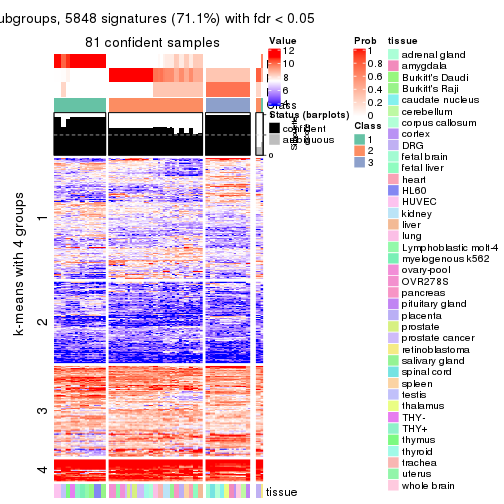</p>

</div>
<div id='tab-SD-skmeans-get-signatures-no-scale-3'>
<pre><code class="r">get_signatures(res, k = 4, scale_rows = FALSE)
</code></pre>

<p></p>

</div>
<div id='tab-SD-skmeans-get-signatures-no-scale-4'>
<pre><code class="r">get_signatures(res, k = 5, scale_rows = FALSE)
</code></pre>

<p></p>

</div>
<div id='tab-SD-skmeans-get-signatures-no-scale-5'>
<pre><code class="r">get_signatures(res, k = 6, scale_rows = FALSE)
</code></pre>

<p></p>

</div>
</div>


Compare the overlap of signatures from different k:

```r
compare_signatures(res)
```


`get_signature()` returns a data frame invisibly. TO get the list of signatures, the function
call should be assigned to a variable explicitly. In following code, if `plot` argument is set
to `FALSE`, no heatmap is plotted while only the differential analysis is performed.

```r
# code only for demonstration
tb = get_signature(res, k = ..., plot = FALSE)
```

An example of the output of `tb` is:

```
#>   which_row         fdr    mean_1    mean_2 scaled_mean_1 scaled_mean_2 km
#> 1        38 0.042760348  8.373488  9.131774    -0.5533452     0.5164555  1
#> 2        40 0.018707592  7.106213  8.469186    -0.6173731     0.5762149  1
#> 3        55 0.019134737 10.221463 11.207825    -0.6159697     0.5749050  1
#> 4        59 0.006059896  5.921854  7.869574    -0.6899429     0.6439467  1
#> 5        60 0.018055526  8.928898 10.211722    -0.6204761     0.5791110  1
#> 6        98 0.009384629 15.714769 14.887706     0.6635654    -0.6193277  2
...
```

The columns in `tb` are:

1. `which_row`: row indices corresponding to the input matrix.
2. `fdr`: FDR for the differential test. 
3. `mean_x`: The mean value in group x.
4. `scaled_mean_x`: The mean value in group x after rows are scaled.
5. `km`: Row groups if k-means clustering is applied to rows.


UMAP plot which shows how samples are separated.


<script>
$( function() {
	$( '#tabs-SD-skmeans-dimension-reduction' ).tabs();
} );
</script>
<div id='tabs-SD-skmeans-dimension-reduction'>
<ul>
<li><a href='#tab-SD-skmeans-dimension-reduction-1'>k = 2</a></li>
<li><a href='#tab-SD-skmeans-dimension-reduction-2'>k = 3</a></li>
<li><a href='#tab-SD-skmeans-dimension-reduction-3'>k = 4</a></li>
<li><a href='#tab-SD-skmeans-dimension-reduction-4'>k = 5</a></li>
<li><a href='#tab-SD-skmeans-dimension-reduction-5'>k = 6</a></li>
</ul>
<div id='tab-SD-skmeans-dimension-reduction-1'>
<pre><code class="r">dimension_reduction(res, k = 2, method = &quot;UMAP&quot;)
</code></pre>

<p></p>

</div>
<div id='tab-SD-skmeans-dimension-reduction-2'>
<pre><code class="r">dimension_reduction(res, k = 3, method = &quot;UMAP&quot;)
</code></pre>

<p></p>

</div>
<div id='tab-SD-skmeans-dimension-reduction-3'>
<pre><code class="r">dimension_reduction(res, k = 4, method = &quot;UMAP&quot;)
</code></pre>

<p></p>

</div>
<div id='tab-SD-skmeans-dimension-reduction-4'>
<pre><code class="r">dimension_reduction(res, k = 5, method = &quot;UMAP&quot;)
</code></pre>

<p></p>

</div>
<div id='tab-SD-skmeans-dimension-reduction-5'>
<pre><code class="r">dimension_reduction(res, k = 6, method = &quot;UMAP&quot;)
</code></pre>

<p></p>

</div>
</div>


Following heatmap shows how subgroups are split when increasing `k`:

```r
collect_classes(res)
```


Test correlation between subgroups and known annotations. If the known
annotation is numeric, one-way ANOVA test is applied, and if the known
annotation is discrete, chi-squared contingency table test is applied.

```r
test_to_known_factors(res)
```

```
#>             n tissue(p) k
#> SD:skmeans 83  3.39e-05 2
#> SD:skmeans 81  6.98e-09 3
#> SD:skmeans 83  4.22e-12 4
#> SD:skmeans 82  3.49e-15 5
#> SD:skmeans 67  6.10e-12 6
```


If matrix rows can be associated to genes, consider to use `GO_Enrichment(res,
...)` to perform function enrichment for the signature genes.


 

---------------------------------------------------


### SD:pam**


The object with results only for a single top-value method and a single partition method 
can be extracted as:

```r
res = res_list["SD", "pam"]
# you can also extract it by
# res = res_list["SD:pam"]
```

A summary of `res` and all the functions that can be applied to it:

```r
res
```

```
#> A 'ConsensusPartition' object with k = 2, 3, 4, 5, 6.
#>   On a matrix with 8229 rows and 84 columns.
#>   Top rows (823, 1646, 2468, 3291, 4114) are extracted by 'SD' method.
#>   Subgroups are detected by 'pam' method.
#>   Performed in total 1250 partitions by row resampling.
#>   Best k for subgroups seems to be 3.
#> 
#> Following methods can be applied to this 'ConsensusPartition' object:
#>  [1] "cola_report"             "collect_classes"         "collect_plots"          
#>  [4] "collect_stats"           "colnames"                "compare_signatures"     
#>  [7] "consensus_heatmap"       "dimension_reduction"     "functional_enrichment"  
#> [10] "get_anno_col"            "get_anno"                "get_classes"            
#> [13] "get_consensus"           "get_matrix"              "get_membership"         
#> [16] "get_param"               "get_signatures"          "get_stats"              
#> [19] "is_best_k"               "is_stable_k"             "membership_heatmap"     
#> [22] "ncol"                    "nrow"                    "plot_ecdf"              
#> [25] "rownames"                "select_partition_number" "show"                   
#> [28] "suggest_best_k"          "test_to_known_factors"
```

`collect_plots()` function collects all the plots made from `res` for all `k` (number of partitions)
into one single page to provide an easy and fast comparison between different `k`.

```r
collect_plots(res)
```


The plots are:

- The first row: a plot of the ECDF (Empirical cumulative distribution
  function) curves of the consensus matrix for each `k` and the heatmap of
  predicted classes for each `k`.
- The second row: heatmaps of the consensus matrix for each `k`.
- The third row: heatmaps of the membership matrix for each `k`.
- The fouth row: heatmaps of the signatures for each `k`.

All the plots in panels can be made by individual functions and they are
plotted later in this section.

`select_partition_number()` produces several plots showing different
statistics for choosing "optimized" `k`. There are following statistics:

- ECDF curves of the consensus matrix for each `k`;
- 1-PAC. [The PAC
  score](https://en.wikipedia.org/wiki/Consensus_clustering#Over-interpretation_potential_of_consensus_clustering)
  measures the proportion of the ambiguous subgrouping.
- Mean silhouette score.
- Concordance. The mean probability of fiting the consensus class ids in all
  partitions.
- Area increased. Denote $A_k$ as the area under the ECDF curve for current
  `k`, the area increased is defined as $A_k - A_{k-1}$.
- Rand index. The percent of pairs of samples that are both in a same cluster
  or both are not in a same cluster in the partition of k and k-1.
- Jaccard index. The ratio of pairs of samples are both in a same cluster in
  the partition of k and k-1 and the pairs of samples are both in a same
  cluster in the partition k or k-1.

The detailed explanations of these statistics can be found in [the cola
vignette](http://bioconductor.org/packages/devel/bioc/vignettes/cola/inst/doc/cola.html#toc_13).

Generally speaking, lower PAC score, higher mean silhouette score or higher
concordance corresponds to better partition. Rand index and Jaccard index
measure how similar the current partition is compared to partition with `k-1`.
If they are too similar, we won't accept `k` is better than `k-1`.

```r
select_partition_number(res)
```


The numeric values for all these statistics can be obtained by `get_stats()`.

```r
get_stats(res)
```

```
#>   k 1-PAC mean_silhouette concordance area_increased  Rand Jaccard
#> 2 2 1.000           0.982       0.979         0.3503 0.646   0.646
#> 3 3 1.000           0.964       0.988         0.6525 0.785   0.667
#> 4 4 0.880           0.867       0.939         0.2722 0.813   0.573
#> 5 5 0.795           0.810       0.873         0.0382 0.971   0.888
#> 6 6 0.856           0.861       0.916         0.0268 0.987   0.946
```

`suggest_best_k()` suggests the best $k$ based on these statistics. The rules are as follows:

- All $k$ with Jaccard index larger than 0.95 are removed because the increase of
  the partition number does not provides enough extra information. If all $k$ are removed,
  the best $k$ is assigned by `NA`.
- For $k$ with 1-PAC larger than 0.9, the maximal $k$ is taken as the "best k". Other $k$ is called "optional k".
- If it does not fit the second rule. The $k$ with the highest vote of highest
  1-PAC, mean silhouette and concordance is taken as the "best k".

```r
suggest_best_k(res)
```

```
#> [1] 3
#> attr(,"optional")
#> [1] 2
```

There is also optional best $k$ = 2 that is worth to check.

Following shows the table of the partitions (You need to click the **show/hide
code output** link to see it). The membership matrix (columns with name `p*`)
is inferred by
[`clue::cl_consensus()`](https://www.rdocumentation.org/link/cl_consensus?package=clue)
function with the `SE` method. Basically the value in the membership matrix
represents the probability to belong to a certain group. The finall class
label for an item is determined with the group with highest probability it
belongs to.

In `get_classes()` function, the entropy is calculated from the membership
matrix and the silhouette score is calculated from the consensus matrix.


<script>
$( function() {
	$( '#tabs-SD-pam-get-classes' ).tabs();
} );
</script>
<div id='tabs-SD-pam-get-classes'>
<ul>
<li><a href='#tab-SD-pam-get-classes-1'>k = 2</a></li>
<li><a href='#tab-SD-pam-get-classes-2'>k = 3</a></li>
<li><a href='#tab-SD-pam-get-classes-3'>k = 4</a></li>
<li><a href='#tab-SD-pam-get-classes-4'>k = 5</a></li>
<li><a href='#tab-SD-pam-get-classes-5'>k = 6</a></li>
</ul>

<div id='tab-SD-pam-get-classes-1'>
<p><a id='tab-SD-pam-get-classes-1-a' style='color:#0366d6' href='#'>show/hide code output</a></p>
<pre><code class="r">cbind(get_classes(res, k = 2), get_membership(res, k = 2))
</code></pre>

<pre><code>#&gt;         class entropy silhouette    p1    p2
#&gt; GSM2819     1   0.000      0.989 1.000 0.000
#&gt; GSM2820     2   0.260      0.988 0.044 0.956
#&gt; GSM2822     1   0.000      0.989 1.000 0.000
#&gt; GSM2832     1   0.000      0.989 1.000 0.000
#&gt; GSM2823     1   0.000      0.989 1.000 0.000
#&gt; GSM2824     1   0.000      0.989 1.000 0.000
#&gt; GSM2825     1   0.000      0.989 1.000 0.000
#&gt; GSM2826     1   0.000      0.989 1.000 0.000
#&gt; GSM2829     1   0.000      0.989 1.000 0.000
#&gt; GSM2856     1   0.000      0.989 1.000 0.000
#&gt; GSM2830     1   0.000      0.989 1.000 0.000
#&gt; GSM2843     1   0.000      0.989 1.000 0.000
#&gt; GSM2871     1   0.000      0.989 1.000 0.000
#&gt; GSM2831     1   0.000      0.989 1.000 0.000
#&gt; GSM2844     1   0.000      0.989 1.000 0.000
#&gt; GSM2833     1   0.000      0.989 1.000 0.000
#&gt; GSM2846     1   0.000      0.989 1.000 0.000
#&gt; GSM2835     1   0.000      0.989 1.000 0.000
#&gt; GSM2858     1   0.000      0.989 1.000 0.000
#&gt; GSM2836     1   0.000      0.989 1.000 0.000
#&gt; GSM2848     1   0.000      0.989 1.000 0.000
#&gt; GSM2828     2   0.260      0.988 0.044 0.956
#&gt; GSM2837     2   0.260      0.988 0.044 0.956
#&gt; GSM2839     1   0.260      0.964 0.956 0.044
#&gt; GSM2841     1   0.260      0.964 0.956 0.044
#&gt; GSM2827     1   0.000      0.989 1.000 0.000
#&gt; GSM2842     1   0.000      0.989 1.000 0.000
#&gt; GSM2845     1   0.000      0.989 1.000 0.000
#&gt; GSM2872     1   0.000      0.989 1.000 0.000
#&gt; GSM2834     1   0.000      0.989 1.000 0.000
#&gt; GSM2847     1   0.000      0.989 1.000 0.000
#&gt; GSM2849     2   0.260      0.988 0.044 0.956
#&gt; GSM2850     2   0.260      0.988 0.044 0.956
#&gt; GSM2838     1   0.000      0.989 1.000 0.000
#&gt; GSM2853     1   0.000      0.989 1.000 0.000
#&gt; GSM2852     2   0.260      0.988 0.044 0.956
#&gt; GSM2855     2   0.260      0.988 0.044 0.956
#&gt; GSM2840     1   0.260      0.964 0.956 0.044
#&gt; GSM2857     1   0.260      0.964 0.956 0.044
#&gt; GSM2859     1   0.000      0.989 1.000 0.000
#&gt; GSM2860     1   0.000      0.989 1.000 0.000
#&gt; GSM2861     1   0.000      0.989 1.000 0.000
#&gt; GSM2862     1   0.000      0.989 1.000 0.000
#&gt; GSM2863     1   0.000      0.989 1.000 0.000
#&gt; GSM2864     1   0.000      0.989 1.000 0.000
#&gt; GSM2865     1   0.000      0.989 1.000 0.000
#&gt; GSM2866     1   0.000      0.989 1.000 0.000
#&gt; GSM2868     1   0.000      0.989 1.000 0.000
#&gt; GSM2869     1   0.000      0.989 1.000 0.000
#&gt; GSM2851     1   0.000      0.989 1.000 0.000
#&gt; GSM2867     1   0.000      0.989 1.000 0.000
#&gt; GSM2870     1   0.000      0.989 1.000 0.000
#&gt; GSM2854     1   0.000      0.989 1.000 0.000
#&gt; GSM2873     1   0.000      0.989 1.000 0.000
#&gt; GSM2874     2   0.260      0.988 0.044 0.956
#&gt; GSM2884     2   0.260      0.988 0.044 0.956
#&gt; GSM2875     1   0.260      0.964 0.956 0.044
#&gt; GSM2890     1   0.260      0.964 0.956 0.044
#&gt; GSM2877     1   0.260      0.964 0.956 0.044
#&gt; GSM2892     1   0.260      0.964 0.956 0.044
#&gt; GSM2902     1   0.260      0.964 0.956 0.044
#&gt; GSM2878     1   0.260      0.964 0.956 0.044
#&gt; GSM2901     1   0.260      0.964 0.956 0.044
#&gt; GSM2879     2   0.574      0.898 0.136 0.864
#&gt; GSM2898     2   0.615      0.879 0.152 0.848
#&gt; GSM2881     2   0.260      0.988 0.044 0.956
#&gt; GSM2897     2   0.260      0.988 0.044 0.956
#&gt; GSM2882     1   0.000      0.989 1.000 0.000
#&gt; GSM2894     1   0.000      0.989 1.000 0.000
#&gt; GSM2883     2   0.260      0.988 0.044 0.956
#&gt; GSM2895     2   0.260      0.988 0.044 0.956
#&gt; GSM2885     2   0.260      0.988 0.044 0.956
#&gt; GSM2886     2   0.260      0.988 0.044 0.956
#&gt; GSM2887     2   0.260      0.988 0.044 0.956
#&gt; GSM2896     2   0.260      0.988 0.044 0.956
#&gt; GSM2888     1   0.000      0.989 1.000 0.000
#&gt; GSM2889     1   0.000      0.989 1.000 0.000
#&gt; GSM2876     1   0.260      0.964 0.956 0.044
#&gt; GSM2891     1   0.260      0.964 0.956 0.044
#&gt; GSM2880     1   0.260      0.964 0.956 0.044
#&gt; GSM2893     1   0.260      0.964 0.956 0.044
#&gt; GSM2821     1   0.000      0.989 1.000 0.000
#&gt; GSM2900     1   0.141      0.978 0.980 0.020
#&gt; GSM2903     1   0.141      0.978 0.980 0.020
</code></pre>

<script>
$('#tab-SD-pam-get-classes-1-a').parent().next().next().hide();
$('#tab-SD-pam-get-classes-1-a').click(function(){
  $('#tab-SD-pam-get-classes-1-a').parent().next().next().toggle();
  return(false);
});
</script>
</div>

<div id='tab-SD-pam-get-classes-2'>
<p><a id='tab-SD-pam-get-classes-2-a' style='color:#0366d6' href='#'>show/hide code output</a></p>
<pre><code class="r">cbind(get_classes(res, k = 3), get_membership(res, k = 3))
</code></pre>

<pre><code>#&gt;         class entropy silhouette    p1    p2   p3
#&gt; GSM2819     2  0.0000     0.9797 0.000 1.000 0.00
#&gt; GSM2820     3  0.0000     0.9969 0.000 0.000 1.00
#&gt; GSM2822     2  0.0000     0.9797 0.000 1.000 0.00
#&gt; GSM2832     2  0.0000     0.9797 0.000 1.000 0.00
#&gt; GSM2823     2  0.0000     0.9797 0.000 1.000 0.00
#&gt; GSM2824     2  0.0000     0.9797 0.000 1.000 0.00
#&gt; GSM2825     2  0.0000     0.9797 0.000 1.000 0.00
#&gt; GSM2826     2  0.0000     0.9797 0.000 1.000 0.00
#&gt; GSM2829     2  0.0000     0.9797 0.000 1.000 0.00
#&gt; GSM2856     2  0.0000     0.9797 0.000 1.000 0.00
#&gt; GSM2830     2  0.0000     0.9797 0.000 1.000 0.00
#&gt; GSM2843     2  0.0000     0.9797 0.000 1.000 0.00
#&gt; GSM2871     2  0.0000     0.9797 0.000 1.000 0.00
#&gt; GSM2831     2  0.0000     0.9797 0.000 1.000 0.00
#&gt; GSM2844     2  0.0000     0.9797 0.000 1.000 0.00
#&gt; GSM2833     2  0.0000     0.9797 0.000 1.000 0.00
#&gt; GSM2846     2  0.0000     0.9797 0.000 1.000 0.00
#&gt; GSM2835     2  0.0000     0.9797 0.000 1.000 0.00
#&gt; GSM2858     2  0.0000     0.9797 0.000 1.000 0.00
#&gt; GSM2836     2  0.0000     0.9797 0.000 1.000 0.00
#&gt; GSM2848     2  0.0000     0.9797 0.000 1.000 0.00
#&gt; GSM2828     3  0.0000     0.9969 0.000 0.000 1.00
#&gt; GSM2837     3  0.0000     0.9969 0.000 0.000 1.00
#&gt; GSM2839     1  0.0000     1.0000 1.000 0.000 0.00
#&gt; GSM2841     1  0.0000     1.0000 1.000 0.000 0.00
#&gt; GSM2827     2  0.0000     0.9797 0.000 1.000 0.00
#&gt; GSM2842     2  0.0000     0.9797 0.000 1.000 0.00
#&gt; GSM2845     2  0.0000     0.9797 0.000 1.000 0.00
#&gt; GSM2872     2  0.0000     0.9797 0.000 1.000 0.00
#&gt; GSM2834     2  0.0000     0.9797 0.000 1.000 0.00
#&gt; GSM2847     2  0.0000     0.9797 0.000 1.000 0.00
#&gt; GSM2849     3  0.0000     0.9969 0.000 0.000 1.00
#&gt; GSM2850     3  0.0000     0.9969 0.000 0.000 1.00
#&gt; GSM2838     2  0.0000     0.9797 0.000 1.000 0.00
#&gt; GSM2853     2  0.0000     0.9797 0.000 1.000 0.00
#&gt; GSM2852     3  0.0000     0.9969 0.000 0.000 1.00
#&gt; GSM2855     3  0.0000     0.9969 0.000 0.000 1.00
#&gt; GSM2840     1  0.0000     1.0000 1.000 0.000 0.00
#&gt; GSM2857     1  0.0000     1.0000 1.000 0.000 0.00
#&gt; GSM2859     2  0.0000     0.9797 0.000 1.000 0.00
#&gt; GSM2860     2  0.0000     0.9797 0.000 1.000 0.00
#&gt; GSM2861     2  0.0000     0.9797 0.000 1.000 0.00
#&gt; GSM2862     2  0.0000     0.9797 0.000 1.000 0.00
#&gt; GSM2863     2  0.0000     0.9797 0.000 1.000 0.00
#&gt; GSM2864     2  0.0000     0.9797 0.000 1.000 0.00
#&gt; GSM2865     2  0.0000     0.9797 0.000 1.000 0.00
#&gt; GSM2866     2  0.0000     0.9797 0.000 1.000 0.00
#&gt; GSM2868     2  0.0000     0.9797 0.000 1.000 0.00
#&gt; GSM2869     2  0.0000     0.9797 0.000 1.000 0.00
#&gt; GSM2851     2  0.0000     0.9797 0.000 1.000 0.00
#&gt; GSM2867     2  0.0000     0.9797 0.000 1.000 0.00
#&gt; GSM2870     2  0.0000     0.9797 0.000 1.000 0.00
#&gt; GSM2854     2  0.0000     0.9797 0.000 1.000 0.00
#&gt; GSM2873     2  0.0000     0.9797 0.000 1.000 0.00
#&gt; GSM2874     3  0.0000     0.9969 0.000 0.000 1.00
#&gt; GSM2884     3  0.0000     0.9969 0.000 0.000 1.00
#&gt; GSM2875     1  0.0000     1.0000 1.000 0.000 0.00
#&gt; GSM2890     1  0.0000     1.0000 1.000 0.000 0.00
#&gt; GSM2877     1  0.0000     1.0000 1.000 0.000 0.00
#&gt; GSM2892     1  0.0000     1.0000 1.000 0.000 0.00
#&gt; GSM2902     1  0.0000     1.0000 1.000 0.000 0.00
#&gt; GSM2878     1  0.0000     1.0000 1.000 0.000 0.00
#&gt; GSM2901     1  0.0000     1.0000 1.000 0.000 0.00
#&gt; GSM2879     3  0.0892     0.9731 0.000 0.020 0.98
#&gt; GSM2898     3  0.0892     0.9731 0.000 0.020 0.98
#&gt; GSM2881     3  0.0000     0.9969 0.000 0.000 1.00
#&gt; GSM2897     3  0.0000     0.9969 0.000 0.000 1.00
#&gt; GSM2882     2  0.0000     0.9797 0.000 1.000 0.00
#&gt; GSM2894     2  0.0000     0.9797 0.000 1.000 0.00
#&gt; GSM2883     3  0.0000     0.9969 0.000 0.000 1.00
#&gt; GSM2895     3  0.0000     0.9969 0.000 0.000 1.00
#&gt; GSM2885     3  0.0000     0.9969 0.000 0.000 1.00
#&gt; GSM2886     3  0.0000     0.9969 0.000 0.000 1.00
#&gt; GSM2887     3  0.0000     0.9969 0.000 0.000 1.00
#&gt; GSM2896     3  0.0000     0.9969 0.000 0.000 1.00
#&gt; GSM2888     2  0.0000     0.9797 0.000 1.000 0.00
#&gt; GSM2889     2  0.0000     0.9797 0.000 1.000 0.00
#&gt; GSM2876     1  0.0000     1.0000 1.000 0.000 0.00
#&gt; GSM2891     1  0.0000     1.0000 1.000 0.000 0.00
#&gt; GSM2880     1  0.0000     1.0000 1.000 0.000 0.00
#&gt; GSM2893     1  0.0000     1.0000 1.000 0.000 0.00
#&gt; GSM2821     2  0.0000     0.9797 0.000 1.000 0.00
#&gt; GSM2900     2  0.6309     0.0356 0.496 0.504 0.00
#&gt; GSM2903     2  0.6307     0.0653 0.488 0.512 0.00
</code></pre>

<script>
$('#tab-SD-pam-get-classes-2-a').parent().next().next().hide();
$('#tab-SD-pam-get-classes-2-a').click(function(){
  $('#tab-SD-pam-get-classes-2-a').parent().next().next().toggle();
  return(false);
});
</script>
</div>

<div id='tab-SD-pam-get-classes-3'>
<p><a id='tab-SD-pam-get-classes-3-a' style='color:#0366d6' href='#'>show/hide code output</a></p>
<pre><code class="r">cbind(get_classes(res, k = 4), get_membership(res, k = 4))
</code></pre>

<pre><code>#&gt;         class entropy silhouette    p1    p2 p3    p4
#&gt; GSM2819     2  0.1867     0.8559 0.000 0.928  0 0.072
#&gt; GSM2820     3  0.0000     1.0000 0.000 0.000  1 0.000
#&gt; GSM2822     2  0.4605     0.6260 0.000 0.664  0 0.336
#&gt; GSM2832     2  0.4605     0.6260 0.000 0.664  0 0.336
#&gt; GSM2823     2  0.4454     0.6638 0.000 0.692  0 0.308
#&gt; GSM2824     2  0.4164     0.7144 0.000 0.736  0 0.264
#&gt; GSM2825     2  0.4605     0.6260 0.000 0.664  0 0.336
#&gt; GSM2826     2  0.4605     0.6260 0.000 0.664  0 0.336
#&gt; GSM2829     4  0.0000     0.9416 0.000 0.000  0 1.000
#&gt; GSM2856     4  0.0000     0.9416 0.000 0.000  0 1.000
#&gt; GSM2830     4  0.0000     0.9416 0.000 0.000  0 1.000
#&gt; GSM2843     4  0.0000     0.9416 0.000 0.000  0 1.000
#&gt; GSM2871     2  0.4830     0.5080 0.000 0.608  0 0.392
#&gt; GSM2831     4  0.0000     0.9416 0.000 0.000  0 1.000
#&gt; GSM2844     4  0.0000     0.9416 0.000 0.000  0 1.000
#&gt; GSM2833     4  0.0000     0.9416 0.000 0.000  0 1.000
#&gt; GSM2846     4  0.0000     0.9416 0.000 0.000  0 1.000
#&gt; GSM2835     4  0.0000     0.9416 0.000 0.000  0 1.000
#&gt; GSM2858     4  0.0000     0.9416 0.000 0.000  0 1.000
#&gt; GSM2836     2  0.2868     0.8207 0.000 0.864  0 0.136
#&gt; GSM2848     2  0.3444     0.7872 0.000 0.816  0 0.184
#&gt; GSM2828     3  0.0000     1.0000 0.000 0.000  1 0.000
#&gt; GSM2837     3  0.0000     1.0000 0.000 0.000  1 0.000
#&gt; GSM2839     1  0.0000     0.9312 1.000 0.000  0 0.000
#&gt; GSM2841     1  0.0000     0.9312 1.000 0.000  0 0.000
#&gt; GSM2827     2  0.0336     0.8755 0.000 0.992  0 0.008
#&gt; GSM2842     2  0.1389     0.8654 0.000 0.952  0 0.048
#&gt; GSM2845     4  0.4925     0.0293 0.000 0.428  0 0.572
#&gt; GSM2872     4  0.0000     0.9416 0.000 0.000  0 1.000
#&gt; GSM2834     4  0.4250     0.5207 0.000 0.276  0 0.724
#&gt; GSM2847     4  0.0000     0.9416 0.000 0.000  0 1.000
#&gt; GSM2849     3  0.0000     1.0000 0.000 0.000  1 0.000
#&gt; GSM2850     3  0.0000     1.0000 0.000 0.000  1 0.000
#&gt; GSM2838     2  0.0000     0.8764 0.000 1.000  0 0.000
#&gt; GSM2853     2  0.0000     0.8764 0.000 1.000  0 0.000
#&gt; GSM2852     3  0.0000     1.0000 0.000 0.000  1 0.000
#&gt; GSM2855     3  0.0000     1.0000 0.000 0.000  1 0.000
#&gt; GSM2840     1  0.0000     0.9312 1.000 0.000  0 0.000
#&gt; GSM2857     1  0.0000     0.9312 1.000 0.000  0 0.000
#&gt; GSM2859     2  0.0000     0.8764 0.000 1.000  0 0.000
#&gt; GSM2860     2  0.0000     0.8764 0.000 1.000  0 0.000
#&gt; GSM2861     2  0.0000     0.8764 0.000 1.000  0 0.000
#&gt; GSM2862     2  0.0000     0.8764 0.000 1.000  0 0.000
#&gt; GSM2863     2  0.0000     0.8764 0.000 1.000  0 0.000
#&gt; GSM2864     2  0.0000     0.8764 0.000 1.000  0 0.000
#&gt; GSM2865     2  0.0000     0.8764 0.000 1.000  0 0.000
#&gt; GSM2866     2  0.0000     0.8764 0.000 1.000  0 0.000
#&gt; GSM2868     2  0.0000     0.8764 0.000 1.000  0 0.000
#&gt; GSM2869     2  0.0000     0.8764 0.000 1.000  0 0.000
#&gt; GSM2851     2  0.0000     0.8764 0.000 1.000  0 0.000
#&gt; GSM2867     2  0.0000     0.8764 0.000 1.000  0 0.000
#&gt; GSM2870     2  0.0000     0.8764 0.000 1.000  0 0.000
#&gt; GSM2854     4  0.1302     0.9005 0.000 0.044  0 0.956
#&gt; GSM2873     2  0.4605     0.6260 0.000 0.664  0 0.336
#&gt; GSM2874     3  0.0000     1.0000 0.000 0.000  1 0.000
#&gt; GSM2884     3  0.0000     1.0000 0.000 0.000  1 0.000
#&gt; GSM2875     1  0.0000     0.9312 1.000 0.000  0 0.000
#&gt; GSM2890     1  0.0000     0.9312 1.000 0.000  0 0.000
#&gt; GSM2877     1  0.0000     0.9312 1.000 0.000  0 0.000
#&gt; GSM2892     1  0.0000     0.9312 1.000 0.000  0 0.000
#&gt; GSM2902     1  0.0000     0.9312 1.000 0.000  0 0.000
#&gt; GSM2878     1  0.0000     0.9312 1.000 0.000  0 0.000
#&gt; GSM2901     1  0.0000     0.9312 1.000 0.000  0 0.000
#&gt; GSM2879     3  0.0000     1.0000 0.000 0.000  1 0.000
#&gt; GSM2898     3  0.0000     1.0000 0.000 0.000  1 0.000
#&gt; GSM2881     3  0.0000     1.0000 0.000 0.000  1 0.000
#&gt; GSM2897     3  0.0000     1.0000 0.000 0.000  1 0.000
#&gt; GSM2882     4  0.0000     0.9416 0.000 0.000  0 1.000
#&gt; GSM2894     4  0.0000     0.9416 0.000 0.000  0 1.000
#&gt; GSM2883     3  0.0000     1.0000 0.000 0.000  1 0.000
#&gt; GSM2895     3  0.0000     1.0000 0.000 0.000  1 0.000
#&gt; GSM2885     3  0.0000     1.0000 0.000 0.000  1 0.000
#&gt; GSM2886     3  0.0000     1.0000 0.000 0.000  1 0.000
#&gt; GSM2887     3  0.0000     1.0000 0.000 0.000  1 0.000
#&gt; GSM2896     3  0.0000     1.0000 0.000 0.000  1 0.000
#&gt; GSM2888     2  0.1022     0.8708 0.000 0.968  0 0.032
#&gt; GSM2889     2  0.1118     0.8697 0.000 0.964  0 0.036
#&gt; GSM2876     1  0.0000     0.9312 1.000 0.000  0 0.000
#&gt; GSM2891     1  0.0000     0.9312 1.000 0.000  0 0.000
#&gt; GSM2880     1  0.0000     0.9312 1.000 0.000  0 0.000
#&gt; GSM2893     1  0.0000     0.9312 1.000 0.000  0 0.000
#&gt; GSM2821     2  0.3074     0.8102 0.000 0.848  0 0.152
#&gt; GSM2900     1  0.7098     0.1108 0.472 0.400  0 0.128
#&gt; GSM2903     1  0.7464     0.1942 0.480 0.328  0 0.192
</code></pre>

<script>
$('#tab-SD-pam-get-classes-3-a').parent().next().next().hide();
$('#tab-SD-pam-get-classes-3-a').click(function(){
  $('#tab-SD-pam-get-classes-3-a').parent().next().next().toggle();
  return(false);
});
</script>
</div>

<div id='tab-SD-pam-get-classes-4'>
<p><a id='tab-SD-pam-get-classes-4-a' style='color:#0366d6' href='#'>show/hide code output</a></p>
<pre><code class="r">cbind(get_classes(res, k = 5), get_membership(res, k = 5))
</code></pre>

<pre><code>#&gt;         class entropy silhouette    p1    p2 p3    p4    p5
#&gt; GSM2819     2   0.457    0.44844 0.000 0.664  0 0.028 0.308
#&gt; GSM2820     3   0.000    1.00000 0.000 0.000  1 0.000 0.000
#&gt; GSM2822     2   0.389    0.64018 0.000 0.680  0 0.320 0.000
#&gt; GSM2832     2   0.389    0.64018 0.000 0.680  0 0.320 0.000
#&gt; GSM2823     2   0.345    0.72993 0.000 0.784  0 0.208 0.008
#&gt; GSM2824     2   0.477    0.63633 0.000 0.728  0 0.108 0.164
#&gt; GSM2825     2   0.431    0.62105 0.000 0.660  0 0.328 0.012
#&gt; GSM2826     2   0.408    0.62754 0.000 0.668  0 0.328 0.004
#&gt; GSM2829     4   0.000    0.93073 0.000 0.000  0 1.000 0.000
#&gt; GSM2856     4   0.000    0.93073 0.000 0.000  0 1.000 0.000
#&gt; GSM2830     4   0.000    0.93073 0.000 0.000  0 1.000 0.000
#&gt; GSM2843     4   0.000    0.93073 0.000 0.000  0 1.000 0.000
#&gt; GSM2871     2   0.416    0.50923 0.000 0.608  0 0.392 0.000
#&gt; GSM2831     4   0.000    0.93073 0.000 0.000  0 1.000 0.000
#&gt; GSM2844     4   0.000    0.93073 0.000 0.000  0 1.000 0.000
#&gt; GSM2833     4   0.000    0.93073 0.000 0.000  0 1.000 0.000
#&gt; GSM2846     4   0.000    0.93073 0.000 0.000  0 1.000 0.000
#&gt; GSM2835     4   0.000    0.93073 0.000 0.000  0 1.000 0.000
#&gt; GSM2858     4   0.000    0.93073 0.000 0.000  0 1.000 0.000
#&gt; GSM2836     2   0.364    0.78208 0.000 0.812  0 0.144 0.044
#&gt; GSM2848     2   0.357    0.76837 0.000 0.800  0 0.176 0.024
#&gt; GSM2828     3   0.000    1.00000 0.000 0.000  1 0.000 0.000
#&gt; GSM2837     3   0.000    1.00000 0.000 0.000  1 0.000 0.000
#&gt; GSM2839     5   0.429    0.32406 0.468 0.000  0 0.000 0.532
#&gt; GSM2841     5   0.429    0.32406 0.468 0.000  0 0.000 0.532
#&gt; GSM2827     2   0.000    0.81829 0.000 1.000  0 0.000 0.000
#&gt; GSM2842     2   0.029    0.81748 0.000 0.992  0 0.008 0.000
#&gt; GSM2845     4   0.424    0.00988 0.000 0.428  0 0.572 0.000
#&gt; GSM2872     4   0.000    0.93073 0.000 0.000  0 1.000 0.000
#&gt; GSM2834     4   0.366    0.50981 0.000 0.276  0 0.724 0.000
#&gt; GSM2847     4   0.000    0.93073 0.000 0.000  0 1.000 0.000
#&gt; GSM2849     3   0.000    1.00000 0.000 0.000  1 0.000 0.000
#&gt; GSM2850     3   0.000    1.00000 0.000 0.000  1 0.000 0.000
#&gt; GSM2838     2   0.000    0.81829 0.000 1.000  0 0.000 0.000
#&gt; GSM2853     2   0.000    0.81829 0.000 1.000  0 0.000 0.000
#&gt; GSM2852     3   0.000    1.00000 0.000 0.000  1 0.000 0.000
#&gt; GSM2855     3   0.000    1.00000 0.000 0.000  1 0.000 0.000
#&gt; GSM2840     5   0.429    0.32406 0.468 0.000  0 0.000 0.532
#&gt; GSM2857     5   0.429    0.32406 0.468 0.000  0 0.000 0.532
#&gt; GSM2859     2   0.273    0.79951 0.000 0.840  0 0.000 0.160
#&gt; GSM2860     2   0.273    0.79951 0.000 0.840  0 0.000 0.160
#&gt; GSM2861     2   0.273    0.79951 0.000 0.840  0 0.000 0.160
#&gt; GSM2862     2   0.273    0.79951 0.000 0.840  0 0.000 0.160
#&gt; GSM2863     2   0.273    0.79951 0.000 0.840  0 0.000 0.160
#&gt; GSM2864     2   0.273    0.79951 0.000 0.840  0 0.000 0.160
#&gt; GSM2865     2   0.273    0.79951 0.000 0.840  0 0.000 0.160
#&gt; GSM2866     2   0.273    0.79951 0.000 0.840  0 0.000 0.160
#&gt; GSM2868     2   0.000    0.81829 0.000 1.000  0 0.000 0.000
#&gt; GSM2869     2   0.000    0.81829 0.000 1.000  0 0.000 0.000
#&gt; GSM2851     2   0.000    0.81829 0.000 1.000  0 0.000 0.000
#&gt; GSM2867     2   0.000    0.81829 0.000 1.000  0 0.000 0.000
#&gt; GSM2870     2   0.000    0.81829 0.000 1.000  0 0.000 0.000
#&gt; GSM2854     4   0.120    0.87932 0.000 0.048  0 0.952 0.000
#&gt; GSM2873     2   0.437    0.63713 0.000 0.664  0 0.320 0.016
#&gt; GSM2874     3   0.000    1.00000 0.000 0.000  1 0.000 0.000
#&gt; GSM2884     3   0.000    1.00000 0.000 0.000  1 0.000 0.000
#&gt; GSM2875     1   0.000    0.96455 1.000 0.000  0 0.000 0.000
#&gt; GSM2890     1   0.000    0.96455 1.000 0.000  0 0.000 0.000
#&gt; GSM2877     1   0.000    0.96455 1.000 0.000  0 0.000 0.000
#&gt; GSM2892     1   0.000    0.96455 1.000 0.000  0 0.000 0.000
#&gt; GSM2902     1   0.000    0.96455 1.000 0.000  0 0.000 0.000
#&gt; GSM2878     1   0.000    0.96455 1.000 0.000  0 0.000 0.000
#&gt; GSM2901     1   0.000    0.96455 1.000 0.000  0 0.000 0.000
#&gt; GSM2879     3   0.000    1.00000 0.000 0.000  1 0.000 0.000
#&gt; GSM2898     3   0.000    1.00000 0.000 0.000  1 0.000 0.000
#&gt; GSM2881     3   0.000    1.00000 0.000 0.000  1 0.000 0.000
#&gt; GSM2897     3   0.000    1.00000 0.000 0.000  1 0.000 0.000
#&gt; GSM2882     4   0.000    0.93073 0.000 0.000  0 1.000 0.000
#&gt; GSM2894     4   0.000    0.93073 0.000 0.000  0 1.000 0.000
#&gt; GSM2883     3   0.000    1.00000 0.000 0.000  1 0.000 0.000
#&gt; GSM2895     3   0.000    1.00000 0.000 0.000  1 0.000 0.000
#&gt; GSM2885     3   0.000    1.00000 0.000 0.000  1 0.000 0.000
#&gt; GSM2886     3   0.000    1.00000 0.000 0.000  1 0.000 0.000
#&gt; GSM2887     3   0.000    1.00000 0.000 0.000  1 0.000 0.000
#&gt; GSM2896     3   0.000    1.00000 0.000 0.000  1 0.000 0.000
#&gt; GSM2888     2   0.000    0.81829 0.000 1.000  0 0.000 0.000
#&gt; GSM2889     2   0.000    0.81829 0.000 1.000  0 0.000 0.000
#&gt; GSM2876     1   0.223    0.81779 0.884 0.000  0 0.000 0.116
#&gt; GSM2891     1   0.223    0.81773 0.884 0.000  0 0.000 0.116
#&gt; GSM2880     1   0.000    0.96455 1.000 0.000  0 0.000 0.000
#&gt; GSM2893     1   0.000    0.96455 1.000 0.000  0 0.000 0.000
#&gt; GSM2821     5   0.466   -0.13345 0.000 0.488  0 0.012 0.500
#&gt; GSM2900     5   0.676    0.34765 0.244 0.116  0 0.064 0.576
#&gt; GSM2903     5   0.666    0.36227 0.220 0.100  0 0.080 0.600
</code></pre>

<script>
$('#tab-SD-pam-get-classes-4-a').parent().next().next().hide();
$('#tab-SD-pam-get-classes-4-a').click(function(){
  $('#tab-SD-pam-get-classes-4-a').parent().next().next().toggle();
  return(false);
});
</script>
</div>

<div id='tab-SD-pam-get-classes-5'>
<p><a id='tab-SD-pam-get-classes-5-a' style='color:#0366d6' href='#'>show/hide code output</a></p>
<pre><code class="r">cbind(get_classes(res, k = 6), get_membership(res, k = 6))
</code></pre>

<pre><code>#&gt;         class entropy silhouette    p1    p2 p3    p4    p5    p6
#&gt; GSM2819     5  0.1863    0.86454 0.000 0.104  0 0.000 0.896 0.000
#&gt; GSM2820     3  0.0000    1.00000 0.000 0.000  1 0.000 0.000 0.000
#&gt; GSM2822     2  0.3619    0.64155 0.000 0.680  0 0.316 0.004 0.000
#&gt; GSM2832     2  0.3619    0.64155 0.000 0.680  0 0.316 0.004 0.000
#&gt; GSM2823     2  0.3189    0.74492 0.000 0.796  0 0.184 0.020 0.000
#&gt; GSM2824     2  0.4565    0.01576 0.000 0.532  0 0.036 0.432 0.000
#&gt; GSM2825     2  0.3515    0.63181 0.000 0.676  0 0.324 0.000 0.000
#&gt; GSM2826     2  0.3515    0.63181 0.000 0.676  0 0.324 0.000 0.000
#&gt; GSM2829     4  0.0000    0.93012 0.000 0.000  0 1.000 0.000 0.000
#&gt; GSM2856     4  0.0000    0.93012 0.000 0.000  0 1.000 0.000 0.000
#&gt; GSM2830     4  0.0000    0.93012 0.000 0.000  0 1.000 0.000 0.000
#&gt; GSM2843     4  0.0000    0.93012 0.000 0.000  0 1.000 0.000 0.000
#&gt; GSM2871     2  0.3747    0.49962 0.000 0.604  0 0.396 0.000 0.000
#&gt; GSM2831     4  0.0000    0.93012 0.000 0.000  0 1.000 0.000 0.000
#&gt; GSM2844     4  0.0000    0.93012 0.000 0.000  0 1.000 0.000 0.000
#&gt; GSM2833     4  0.0000    0.93012 0.000 0.000  0 1.000 0.000 0.000
#&gt; GSM2846     4  0.0000    0.93012 0.000 0.000  0 1.000 0.000 0.000
#&gt; GSM2835     4  0.0000    0.93012 0.000 0.000  0 1.000 0.000 0.000
#&gt; GSM2858     4  0.0000    0.93012 0.000 0.000  0 1.000 0.000 0.000
#&gt; GSM2836     2  0.3820    0.78303 0.000 0.784  0 0.144 0.008 0.064
#&gt; GSM2848     2  0.3602    0.77350 0.000 0.784  0 0.176 0.008 0.032
#&gt; GSM2828     3  0.0000    1.00000 0.000 0.000  1 0.000 0.000 0.000
#&gt; GSM2837     3  0.0000    1.00000 0.000 0.000  1 0.000 0.000 0.000
#&gt; GSM2839     6  0.3514    1.00000 0.108 0.000  0 0.000 0.088 0.804
#&gt; GSM2841     6  0.3514    1.00000 0.108 0.000  0 0.000 0.088 0.804
#&gt; GSM2827     2  0.0146    0.81032 0.000 0.996  0 0.000 0.004 0.000
#&gt; GSM2842     2  0.0146    0.81032 0.000 0.996  0 0.000 0.004 0.000
#&gt; GSM2845     4  0.3810    0.00917 0.000 0.428  0 0.572 0.000 0.000
#&gt; GSM2872     4  0.0000    0.93012 0.000 0.000  0 1.000 0.000 0.000
#&gt; GSM2834     4  0.3309    0.49739 0.000 0.280  0 0.720 0.000 0.000
#&gt; GSM2847     4  0.0000    0.93012 0.000 0.000  0 1.000 0.000 0.000
#&gt; GSM2849     3  0.0000    1.00000 0.000 0.000  1 0.000 0.000 0.000
#&gt; GSM2850     3  0.0000    1.00000 0.000 0.000  1 0.000 0.000 0.000
#&gt; GSM2838     2  0.0146    0.81032 0.000 0.996  0 0.000 0.004 0.000
#&gt; GSM2853     2  0.0146    0.81032 0.000 0.996  0 0.000 0.004 0.000
#&gt; GSM2852     3  0.0000    1.00000 0.000 0.000  1 0.000 0.000 0.000
#&gt; GSM2855     3  0.0000    1.00000 0.000 0.000  1 0.000 0.000 0.000
#&gt; GSM2840     6  0.3514    1.00000 0.108 0.000  0 0.000 0.088 0.804
#&gt; GSM2857     6  0.3514    1.00000 0.108 0.000  0 0.000 0.088 0.804
#&gt; GSM2859     2  0.3200    0.78909 0.000 0.788  0 0.000 0.016 0.196
#&gt; GSM2860     2  0.3200    0.78909 0.000 0.788  0 0.000 0.016 0.196
#&gt; GSM2861     2  0.3200    0.78909 0.000 0.788  0 0.000 0.016 0.196
#&gt; GSM2862     2  0.3200    0.78909 0.000 0.788  0 0.000 0.016 0.196
#&gt; GSM2863     2  0.3200    0.78909 0.000 0.788  0 0.000 0.016 0.196
#&gt; GSM2864     2  0.3200    0.78909 0.000 0.788  0 0.000 0.016 0.196
#&gt; GSM2865     2  0.3200    0.78909 0.000 0.788  0 0.000 0.016 0.196
#&gt; GSM2866     2  0.3200    0.78909 0.000 0.788  0 0.000 0.016 0.196
#&gt; GSM2868     2  0.0146    0.81032 0.000 0.996  0 0.000 0.004 0.000
#&gt; GSM2869     2  0.0146    0.81032 0.000 0.996  0 0.000 0.004 0.000
#&gt; GSM2851     2  0.0146    0.81032 0.000 0.996  0 0.000 0.004 0.000
#&gt; GSM2867     2  0.0146    0.81032 0.000 0.996  0 0.000 0.004 0.000
#&gt; GSM2870     2  0.0146    0.81032 0.000 0.996  0 0.000 0.004 0.000
#&gt; GSM2854     4  0.1075    0.87878 0.000 0.048  0 0.952 0.000 0.000
#&gt; GSM2873     2  0.3986    0.63740 0.000 0.664  0 0.316 0.000 0.020
#&gt; GSM2874     3  0.0000    1.00000 0.000 0.000  1 0.000 0.000 0.000
#&gt; GSM2884     3  0.0000    1.00000 0.000 0.000  1 0.000 0.000 0.000
#&gt; GSM2875     1  0.0000    0.95158 1.000 0.000  0 0.000 0.000 0.000
#&gt; GSM2890     1  0.0000    0.95158 1.000 0.000  0 0.000 0.000 0.000
#&gt; GSM2877     1  0.0000    0.95158 1.000 0.000  0 0.000 0.000 0.000
#&gt; GSM2892     1  0.0000    0.95158 1.000 0.000  0 0.000 0.000 0.000
#&gt; GSM2902     1  0.0000    0.95158 1.000 0.000  0 0.000 0.000 0.000
#&gt; GSM2878     1  0.0000    0.95158 1.000 0.000  0 0.000 0.000 0.000
#&gt; GSM2901     1  0.0000    0.95158 1.000 0.000  0 0.000 0.000 0.000
#&gt; GSM2879     3  0.0000    1.00000 0.000 0.000  1 0.000 0.000 0.000
#&gt; GSM2898     3  0.0000    1.00000 0.000 0.000  1 0.000 0.000 0.000
#&gt; GSM2881     3  0.0000    1.00000 0.000 0.000  1 0.000 0.000 0.000
#&gt; GSM2897     3  0.0000    1.00000 0.000 0.000  1 0.000 0.000 0.000
#&gt; GSM2882     4  0.0000    0.93012 0.000 0.000  0 1.000 0.000 0.000
#&gt; GSM2894     4  0.0000    0.93012 0.000 0.000  0 1.000 0.000 0.000
#&gt; GSM2883     3  0.0000    1.00000 0.000 0.000  1 0.000 0.000 0.000
#&gt; GSM2895     3  0.0000    1.00000 0.000 0.000  1 0.000 0.000 0.000
#&gt; GSM2885     3  0.0000    1.00000 0.000 0.000  1 0.000 0.000 0.000
#&gt; GSM2886     3  0.0000    1.00000 0.000 0.000  1 0.000 0.000 0.000
#&gt; GSM2887     3  0.0000    1.00000 0.000 0.000  1 0.000 0.000 0.000
#&gt; GSM2896     3  0.0000    1.00000 0.000 0.000  1 0.000 0.000 0.000
#&gt; GSM2888     2  0.0146    0.81032 0.000 0.996  0 0.000 0.004 0.000
#&gt; GSM2889     2  0.0146    0.81032 0.000 0.996  0 0.000 0.004 0.000
#&gt; GSM2876     1  0.3877    0.72581 0.764 0.000  0 0.000 0.160 0.076
#&gt; GSM2891     1  0.3694    0.73974 0.784 0.000  0 0.000 0.140 0.076
#&gt; GSM2880     1  0.0000    0.95158 1.000 0.000  0 0.000 0.000 0.000
#&gt; GSM2893     1  0.0000    0.95158 1.000 0.000  0 0.000 0.000 0.000
#&gt; GSM2821     5  0.1082    0.92957 0.000 0.040  0 0.004 0.956 0.000
#&gt; GSM2900     5  0.0458    0.92983 0.000 0.016  0 0.000 0.984 0.000
#&gt; GSM2903     5  0.0508    0.92549 0.000 0.012  0 0.000 0.984 0.004
</code></pre>

<script>
$('#tab-SD-pam-get-classes-5-a').parent().next().next().hide();
$('#tab-SD-pam-get-classes-5-a').click(function(){
  $('#tab-SD-pam-get-classes-5-a').parent().next().next().toggle();
  return(false);
});
</script>
</div>
</div>

Heatmaps for the consensus matrix. It visualizes the probability of two
samples to be in a same group.


<script>
$( function() {
	$( '#tabs-SD-pam-consensus-heatmap' ).tabs();
} );
</script>
<div id='tabs-SD-pam-consensus-heatmap'>
<ul>
<li><a href='#tab-SD-pam-consensus-heatmap-1'>k = 2</a></li>
<li><a href='#tab-SD-pam-consensus-heatmap-2'>k = 3</a></li>
<li><a href='#tab-SD-pam-consensus-heatmap-3'>k = 4</a></li>
<li><a href='#tab-SD-pam-consensus-heatmap-4'>k = 5</a></li>
<li><a href='#tab-SD-pam-consensus-heatmap-5'>k = 6</a></li>
</ul>
<div id='tab-SD-pam-consensus-heatmap-1'>
<pre><code class="r">consensus_heatmap(res, k = 2)
</code></pre>

<p></p>

</div>
<div id='tab-SD-pam-consensus-heatmap-2'>
<pre><code class="r">consensus_heatmap(res, k = 3)
</code></pre>

<p></p>

</div>
<div id='tab-SD-pam-consensus-heatmap-3'>
<pre><code class="r">consensus_heatmap(res, k = 4)
</code></pre>

<p></p>

</div>
<div id='tab-SD-pam-consensus-heatmap-4'>
<pre><code class="r">consensus_heatmap(res, k = 5)
</code></pre>

<p></p>

</div>
<div id='tab-SD-pam-consensus-heatmap-5'>
<pre><code class="r">consensus_heatmap(res, k = 6)
</code></pre>

<p></p>

</div>
</div>

Heatmaps for the membership of samples in all partitions to see how consistent they are:


<script>
$( function() {
	$( '#tabs-SD-pam-membership-heatmap' ).tabs();
} );
</script>
<div id='tabs-SD-pam-membership-heatmap'>
<ul>
<li><a href='#tab-SD-pam-membership-heatmap-1'>k = 2</a></li>
<li><a href='#tab-SD-pam-membership-heatmap-2'>k = 3</a></li>
<li><a href='#tab-SD-pam-membership-heatmap-3'>k = 4</a></li>
<li><a href='#tab-SD-pam-membership-heatmap-4'>k = 5</a></li>
<li><a href='#tab-SD-pam-membership-heatmap-5'>k = 6</a></li>
</ul>
<div id='tab-SD-pam-membership-heatmap-1'>
<pre><code class="r">membership_heatmap(res, k = 2)
</code></pre>

<p></p>

</div>
<div id='tab-SD-pam-membership-heatmap-2'>
<pre><code class="r">membership_heatmap(res, k = 3)
</code></pre>

<p></p>

</div>
<div id='tab-SD-pam-membership-heatmap-3'>
<pre><code class="r">membership_heatmap(res, k = 4)
</code></pre>

<p></p>

</div>
<div id='tab-SD-pam-membership-heatmap-4'>
<pre><code class="r">membership_heatmap(res, k = 5)
</code></pre>

<p></p>

</div>
<div id='tab-SD-pam-membership-heatmap-5'>
<pre><code class="r">membership_heatmap(res, k = 6)
</code></pre>

<p></p>

</div>
</div>

As soon as we have had the classes for columns, we can look for signatures
which are significantly different between classes which can be candidate marks
for certain classes. Following are the heatmaps for signatures.


Signature heatmaps where rows are scaled:


<script>
$( function() {
	$( '#tabs-SD-pam-get-signatures' ).tabs();
} );
</script>
<div id='tabs-SD-pam-get-signatures'>
<ul>
<li><a href='#tab-SD-pam-get-signatures-1'>k = 2</a></li>
<li><a href='#tab-SD-pam-get-signatures-2'>k = 3</a></li>
<li><a href='#tab-SD-pam-get-signatures-3'>k = 4</a></li>
<li><a href='#tab-SD-pam-get-signatures-4'>k = 5</a></li>
<li><a href='#tab-SD-pam-get-signatures-5'>k = 6</a></li>
</ul>
<div id='tab-SD-pam-get-signatures-1'>
<pre><code class="r">get_signatures(res, k = 2)
</code></pre>

<p></p>

</div>
<div id='tab-SD-pam-get-signatures-2'>
<pre><code class="r">get_signatures(res, k = 3)
</code></pre>

<p></p>

</div>
<div id='tab-SD-pam-get-signatures-3'>
<pre><code class="r">get_signatures(res, k = 4)
</code></pre>

<p></p>

</div>
<div id='tab-SD-pam-get-signatures-4'>
<pre><code class="r">get_signatures(res, k = 5)
</code></pre>

<p></p>

</div>
<div id='tab-SD-pam-get-signatures-5'>
<pre><code class="r">get_signatures(res, k = 6)
</code></pre>

<p></p>

</div>
</div>


Signature heatmaps where rows are not scaled:


<script>
$( function() {
	$( '#tabs-SD-pam-get-signatures-no-scale' ).tabs();
} );
</script>
<div id='tabs-SD-pam-get-signatures-no-scale'>
<ul>
<li><a href='#tab-SD-pam-get-signatures-no-scale-1'>k = 2</a></li>
<li><a href='#tab-SD-pam-get-signatures-no-scale-2'>k = 3</a></li>
<li><a href='#tab-SD-pam-get-signatures-no-scale-3'>k = 4</a></li>
<li><a href='#tab-SD-pam-get-signatures-no-scale-4'>k = 5</a></li>
<li><a href='#tab-SD-pam-get-signatures-no-scale-5'>k = 6</a></li>
</ul>
<div id='tab-SD-pam-get-signatures-no-scale-1'>
<pre><code class="r">get_signatures(res, k = 2, scale_rows = FALSE)
</code></pre>

<p></p>

</div>
<div id='tab-SD-pam-get-signatures-no-scale-2'>
<pre><code class="r">get_signatures(res, k = 3, scale_rows = FALSE)
</code></pre>

<p></p>

</div>
<div id='tab-SD-pam-get-signatures-no-scale-3'>
<pre><code class="r">get_signatures(res, k = 4, scale_rows = FALSE)
</code></pre>

<p></p>

</div>
<div id='tab-SD-pam-get-signatures-no-scale-4'>
<pre><code class="r">get_signatures(res, k = 5, scale_rows = FALSE)
</code></pre>

<p></p>

</div>
<div id='tab-SD-pam-get-signatures-no-scale-5'>
<pre><code class="r">get_signatures(res, k = 6, scale_rows = FALSE)
</code></pre>

<p></p>

</div>
</div>


Compare the overlap of signatures from different k:

```r
compare_signatures(res)
```


`get_signature()` returns a data frame invisibly. TO get the list of signatures, the function
call should be assigned to a variable explicitly. In following code, if `plot` argument is set
to `FALSE`, no heatmap is plotted while only the differential analysis is performed.

```r
# code only for demonstration
tb = get_signature(res, k = ..., plot = FALSE)
```

An example of the output of `tb` is:

```
#>   which_row         fdr    mean_1    mean_2 scaled_mean_1 scaled_mean_2 km
#> 1        38 0.042760348  8.373488  9.131774    -0.5533452     0.5164555  1
#> 2        40 0.018707592  7.106213  8.469186    -0.6173731     0.5762149  1
#> 3        55 0.019134737 10.221463 11.207825    -0.6159697     0.5749050  1
#> 4        59 0.006059896  5.921854  7.869574    -0.6899429     0.6439467  1
#> 5        60 0.018055526  8.928898 10.211722    -0.6204761     0.5791110  1
#> 6        98 0.009384629 15.714769 14.887706     0.6635654    -0.6193277  2
...
```

The columns in `tb` are:

1. `which_row`: row indices corresponding to the input matrix.
2. `fdr`: FDR for the differential test. 
3. `mean_x`: The mean value in group x.
4. `scaled_mean_x`: The mean value in group x after rows are scaled.
5. `km`: Row groups if k-means clustering is applied to rows.


UMAP plot which shows how samples are separated.


<script>
$( function() {
	$( '#tabs-SD-pam-dimension-reduction' ).tabs();
} );
</script>
<div id='tabs-SD-pam-dimension-reduction'>
<ul>
<li><a href='#tab-SD-pam-dimension-reduction-1'>k = 2</a></li>
<li><a href='#tab-SD-pam-dimension-reduction-2'>k = 3</a></li>
<li><a href='#tab-SD-pam-dimension-reduction-3'>k = 4</a></li>
<li><a href='#tab-SD-pam-dimension-reduction-4'>k = 5</a></li>
<li><a href='#tab-SD-pam-dimension-reduction-5'>k = 6</a></li>
</ul>
<div id='tab-SD-pam-dimension-reduction-1'>
<pre><code class="r">dimension_reduction(res, k = 2, method = &quot;UMAP&quot;)
</code></pre>

<p></p>

</div>
<div id='tab-SD-pam-dimension-reduction-2'>
<pre><code class="r">dimension_reduction(res, k = 3, method = &quot;UMAP&quot;)
</code></pre>

<p></p>

</div>
<div id='tab-SD-pam-dimension-reduction-3'>
<pre><code class="r">dimension_reduction(res, k = 4, method = &quot;UMAP&quot;)
</code></pre>

<p></p>

</div>
<div id='tab-SD-pam-dimension-reduction-4'>
<pre><code class="r">dimension_reduction(res, k = 5, method = &quot;UMAP&quot;)
</code></pre>

<p></p>

</div>
<div id='tab-SD-pam-dimension-reduction-5'>
<pre><code class="r">dimension_reduction(res, k = 6, method = &quot;UMAP&quot;)
</code></pre>

<p></p>

</div>
</div>


Following heatmap shows how subgroups are split when increasing `k`:

```r
collect_classes(res)
```


Test correlation between subgroups and known annotations. If the known
annotation is numeric, one-way ANOVA test is applied, and if the known
annotation is discrete, chi-squared contingency table test is applied.

```r
test_to_known_factors(res)
```

```
#>         n tissue(p) k
#> SD:pam 84  2.53e-05 2
#> SD:pam 82  2.06e-08 3
#> SD:pam 81  2.66e-10 4
#> SD:pam 75  3.07e-10 5
#> SD:pam 80  1.42e-16 6
```


If matrix rows can be associated to genes, consider to use `GO_Enrichment(res,
...)` to perform function enrichment for the signature genes.


 

---------------------------------------------------


### SD:mclust*


The object with results only for a single top-value method and a single partition method 
can be extracted as:

```r
res = res_list["SD", "mclust"]
# you can also extract it by
# res = res_list["SD:mclust"]
```

A summary of `res` and all the functions that can be applied to it:

```r
res
```

```
#> A 'ConsensusPartition' object with k = 2, 3, 4, 5, 6.
#>   On a matrix with 8229 rows and 84 columns.
#>   Top rows (823, 1646, 2468, 3291, 4114) are extracted by 'SD' method.
#>   Subgroups are detected by 'mclust' method.
#>   Performed in total 1250 partitions by row resampling.
#>   Best k for subgroups seems to be 3.
#> 
#> Following methods can be applied to this 'ConsensusPartition' object:
#>  [1] "cola_report"             "collect_classes"         "collect_plots"          
#>  [4] "collect_stats"           "colnames"                "compare_signatures"     
#>  [7] "consensus_heatmap"       "dimension_reduction"     "functional_enrichment"  
#> [10] "get_anno_col"            "get_anno"                "get_classes"            
#> [13] "get_consensus"           "get_matrix"              "get_membership"         
#> [16] "get_param"               "get_signatures"          "get_stats"              
#> [19] "is_best_k"               "is_stable_k"             "membership_heatmap"     
#> [22] "ncol"                    "nrow"                    "plot_ecdf"              
#> [25] "rownames"                "select_partition_number" "show"                   
#> [28] "suggest_best_k"          "test_to_known_factors"
```

`collect_plots()` function collects all the plots made from `res` for all `k` (number of partitions)
into one single page to provide an easy and fast comparison between different `k`.

```r
collect_plots(res)
```


The plots are:

- The first row: a plot of the ECDF (Empirical cumulative distribution
  function) curves of the consensus matrix for each `k` and the heatmap of
  predicted classes for each `k`.
- The second row: heatmaps of the consensus matrix for each `k`.
- The third row: heatmaps of the membership matrix for each `k`.
- The fouth row: heatmaps of the signatures for each `k`.

All the plots in panels can be made by individual functions and they are
plotted later in this section.

`select_partition_number()` produces several plots showing different
statistics for choosing "optimized" `k`. There are following statistics:

- ECDF curves of the consensus matrix for each `k`;
- 1-PAC. [The PAC
  score](https://en.wikipedia.org/wiki/Consensus_clustering#Over-interpretation_potential_of_consensus_clustering)
  measures the proportion of the ambiguous subgrouping.
- Mean silhouette score.
- Concordance. The mean probability of fiting the consensus class ids in all
  partitions.
- Area increased. Denote $A_k$ as the area under the ECDF curve for current
  `k`, the area increased is defined as $A_k - A_{k-1}$.
- Rand index. The percent of pairs of samples that are both in a same cluster
  or both are not in a same cluster in the partition of k and k-1.
- Jaccard index. The ratio of pairs of samples are both in a same cluster in
  the partition of k and k-1 and the pairs of samples are both in a same
  cluster in the partition k or k-1.

The detailed explanations of these statistics can be found in [the cola
vignette](http://bioconductor.org/packages/devel/bioc/vignettes/cola/inst/doc/cola.html#toc_13).

Generally speaking, lower PAC score, higher mean silhouette score or higher
concordance corresponds to better partition. Rand index and Jaccard index
measure how similar the current partition is compared to partition with `k-1`.
If they are too similar, we won't accept `k` is better than `k-1`.

```r
select_partition_number(res)
```


The numeric values for all these statistics can be obtained by `get_stats()`.

```r
get_stats(res)
```

```
#>   k 1-PAC mean_silhouette concordance area_increased  Rand Jaccard
#> 2 2 0.221           0.373       0.679         0.5030 0.559   0.559
#> 3 3 0.937           0.893       0.947         0.2735 0.551   0.339
#> 4 4 0.659           0.817       0.838         0.1447 0.857   0.613
#> 5 5 0.780           0.658       0.834         0.0748 0.913   0.680
#> 6 6 0.839           0.822       0.856         0.0442 0.884   0.541
```

`suggest_best_k()` suggests the best $k$ based on these statistics. The rules are as follows:

- All $k$ with Jaccard index larger than 0.95 are removed because the increase of
  the partition number does not provides enough extra information. If all $k$ are removed,
  the best $k$ is assigned by `NA`.
- For $k$ with 1-PAC larger than 0.9, the maximal $k$ is taken as the "best k". Other $k$ is called "optional k".
- If it does not fit the second rule. The $k$ with the highest vote of highest
  1-PAC, mean silhouette and concordance is taken as the "best k".

```r
suggest_best_k(res)
```

```
#> [1] 3
```


Following shows the table of the partitions (You need to click the **show/hide
code output** link to see it). The membership matrix (columns with name `p*`)
is inferred by
[`clue::cl_consensus()`](https://www.rdocumentation.org/link/cl_consensus?package=clue)
function with the `SE` method. Basically the value in the membership matrix
represents the probability to belong to a certain group. The finall class
label for an item is determined with the group with highest probability it
belongs to.

In `get_classes()` function, the entropy is calculated from the membership
matrix and the silhouette score is calculated from the consensus matrix.


<script>
$( function() {
	$( '#tabs-SD-mclust-get-classes' ).tabs();
} );
</script>
<div id='tabs-SD-mclust-get-classes'>
<ul>
<li><a href='#tab-SD-mclust-get-classes-1'>k = 2</a></li>
<li><a href='#tab-SD-mclust-get-classes-2'>k = 3</a></li>
<li><a href='#tab-SD-mclust-get-classes-3'>k = 4</a></li>
<li><a href='#tab-SD-mclust-get-classes-4'>k = 5</a></li>
<li><a href='#tab-SD-mclust-get-classes-5'>k = 6</a></li>
</ul>

<div id='tab-SD-mclust-get-classes-1'>
<p><a id='tab-SD-mclust-get-classes-1-a' style='color:#0366d6' href='#'>show/hide code output</a></p>
<pre><code class="r">cbind(get_classes(res, k = 2), get_membership(res, k = 2))
</code></pre>

<pre><code>#&gt;         class entropy silhouette    p1    p2
#&gt; GSM2819     2   0.997    -0.1865 0.468 0.532
#&gt; GSM2820     2   0.909     0.4134 0.324 0.676
#&gt; GSM2822     1   0.925     0.4433 0.660 0.340
#&gt; GSM2832     1   0.925     0.4433 0.660 0.340
#&gt; GSM2823     2   0.141     0.4278 0.020 0.980
#&gt; GSM2824     2   0.141     0.4278 0.020 0.980
#&gt; GSM2825     1   0.992     0.2569 0.552 0.448
#&gt; GSM2826     1   0.992     0.2569 0.552 0.448
#&gt; GSM2829     1   0.000     0.7722 1.000 0.000
#&gt; GSM2856     1   0.000     0.7722 1.000 0.000
#&gt; GSM2830     1   0.000     0.7722 1.000 0.000
#&gt; GSM2843     1   0.000     0.7722 1.000 0.000
#&gt; GSM2871     1   0.000     0.7722 1.000 0.000
#&gt; GSM2831     1   0.000     0.7722 1.000 0.000
#&gt; GSM2844     1   0.000     0.7722 1.000 0.000
#&gt; GSM2833     1   0.000     0.7722 1.000 0.000
#&gt; GSM2846     1   0.000     0.7722 1.000 0.000
#&gt; GSM2835     1   0.000     0.7722 1.000 0.000
#&gt; GSM2858     1   0.000     0.7722 1.000 0.000
#&gt; GSM2836     1   0.961     0.4101 0.616 0.384
#&gt; GSM2848     1   0.961     0.4102 0.616 0.384
#&gt; GSM2828     2   0.909     0.4134 0.324 0.676
#&gt; GSM2837     2   0.909     0.4134 0.324 0.676
#&gt; GSM2839     2   0.767     0.4166 0.224 0.776
#&gt; GSM2841     2   0.767     0.4166 0.224 0.776
#&gt; GSM2827     1   0.871     0.5107 0.708 0.292
#&gt; GSM2842     1   0.961     0.4103 0.616 0.384
#&gt; GSM2845     1   0.000     0.7722 1.000 0.000
#&gt; GSM2872     1   0.000     0.7722 1.000 0.000
#&gt; GSM2834     1   0.000     0.7722 1.000 0.000
#&gt; GSM2847     1   0.000     0.7722 1.000 0.000
#&gt; GSM2849     2   0.909     0.4134 0.324 0.676
#&gt; GSM2850     2   0.909     0.4134 0.324 0.676
#&gt; GSM2838     2   0.993    -0.1423 0.452 0.548
#&gt; GSM2853     2   0.993    -0.1423 0.452 0.548
#&gt; GSM2852     2   0.909     0.4134 0.324 0.676
#&gt; GSM2855     2   0.909     0.4134 0.324 0.676
#&gt; GSM2840     2   0.767     0.4166 0.224 0.776
#&gt; GSM2857     2   0.767     0.4166 0.224 0.776
#&gt; GSM2859     2   0.993    -0.1423 0.452 0.548
#&gt; GSM2860     2   0.993    -0.1423 0.452 0.548
#&gt; GSM2861     2   0.993    -0.1423 0.452 0.548
#&gt; GSM2862     2   0.993    -0.1423 0.452 0.548
#&gt; GSM2863     2   0.993    -0.1423 0.452 0.548
#&gt; GSM2864     2   0.993    -0.1423 0.452 0.548
#&gt; GSM2865     2   0.993    -0.1423 0.452 0.548
#&gt; GSM2866     2   0.993    -0.1423 0.452 0.548
#&gt; GSM2868     2   0.993    -0.1423 0.452 0.548
#&gt; GSM2869     2   0.993    -0.1423 0.452 0.548
#&gt; GSM2851     2   0.993    -0.1423 0.452 0.548
#&gt; GSM2867     2   0.993    -0.1423 0.452 0.548
#&gt; GSM2870     2   0.993    -0.1423 0.452 0.548
#&gt; GSM2854     1   0.000     0.7722 1.000 0.000
#&gt; GSM2873     1   0.913     0.4505 0.672 0.328
#&gt; GSM2874     2   0.909     0.4134 0.324 0.676
#&gt; GSM2884     2   0.909     0.4134 0.324 0.676
#&gt; GSM2875     2   0.767     0.4166 0.224 0.776
#&gt; GSM2890     2   0.767     0.4166 0.224 0.776
#&gt; GSM2877     2   0.767     0.4166 0.224 0.776
#&gt; GSM2892     2   0.767     0.4166 0.224 0.776
#&gt; GSM2902     2   0.767     0.4166 0.224 0.776
#&gt; GSM2878     2   0.767     0.4166 0.224 0.776
#&gt; GSM2901     2   0.767     0.4166 0.224 0.776
#&gt; GSM2879     2   0.909     0.4134 0.324 0.676
#&gt; GSM2898     2   0.909     0.4134 0.324 0.676
#&gt; GSM2881     2   0.909     0.4134 0.324 0.676
#&gt; GSM2897     2   0.909     0.4134 0.324 0.676
#&gt; GSM2882     1   0.000     0.7722 1.000 0.000
#&gt; GSM2894     1   0.000     0.7722 1.000 0.000
#&gt; GSM2883     2   0.909     0.4134 0.324 0.676
#&gt; GSM2895     2   0.909     0.4134 0.324 0.676
#&gt; GSM2885     2   0.909     0.4134 0.324 0.676
#&gt; GSM2886     2   0.909     0.4134 0.324 0.676
#&gt; GSM2887     2   0.909     0.4134 0.324 0.676
#&gt; GSM2896     2   0.909     0.4134 0.324 0.676
#&gt; GSM2888     2   0.952    -0.0258 0.372 0.628
#&gt; GSM2889     2   0.952    -0.0258 0.372 0.628
#&gt; GSM2876     2   0.767     0.4166 0.224 0.776
#&gt; GSM2891     2   0.767     0.4166 0.224 0.776
#&gt; GSM2880     2   0.767     0.4166 0.224 0.776
#&gt; GSM2893     2   0.767     0.4166 0.224 0.776
#&gt; GSM2821     2   0.767     0.4166 0.224 0.776
#&gt; GSM2900     2   0.767     0.4166 0.224 0.776
#&gt; GSM2903     2   0.767     0.4166 0.224 0.776
</code></pre>

<script>
$('#tab-SD-mclust-get-classes-1-a').parent().next().next().hide();
$('#tab-SD-mclust-get-classes-1-a').click(function(){
  $('#tab-SD-mclust-get-classes-1-a').parent().next().next().toggle();
  return(false);
});
</script>
</div>

<div id='tab-SD-mclust-get-classes-2'>
<p><a id='tab-SD-mclust-get-classes-2-a' style='color:#0366d6' href='#'>show/hide code output</a></p>
<pre><code class="r">cbind(get_classes(res, k = 3), get_membership(res, k = 3))
</code></pre>

<pre><code>#&gt;         class entropy silhouette    p1    p2    p3
#&gt; GSM2819     1  0.0661      0.917 0.988 0.008 0.004
#&gt; GSM2820     3  0.0747      0.936 0.016 0.000 0.984
#&gt; GSM2822     1  0.6432      0.219 0.568 0.428 0.004
#&gt; GSM2832     2  0.6169      0.440 0.360 0.636 0.004
#&gt; GSM2823     1  0.6410      0.277 0.576 0.004 0.420
#&gt; GSM2824     1  0.6410      0.277 0.576 0.004 0.420
#&gt; GSM2825     1  0.3644      0.810 0.872 0.124 0.004
#&gt; GSM2826     1  0.3644      0.810 0.872 0.124 0.004
#&gt; GSM2829     2  0.0747      0.966 0.016 0.984 0.000
#&gt; GSM2856     2  0.0747      0.966 0.016 0.984 0.000
#&gt; GSM2830     2  0.0747      0.966 0.016 0.984 0.000
#&gt; GSM2843     2  0.0747      0.966 0.016 0.984 0.000
#&gt; GSM2871     2  0.0747      0.966 0.016 0.984 0.000
#&gt; GSM2831     2  0.0747      0.966 0.016 0.984 0.000
#&gt; GSM2844     2  0.0747      0.966 0.016 0.984 0.000
#&gt; GSM2833     2  0.0747      0.966 0.016 0.984 0.000
#&gt; GSM2846     2  0.0747      0.966 0.016 0.984 0.000
#&gt; GSM2835     2  0.0747      0.966 0.016 0.984 0.000
#&gt; GSM2858     2  0.0747      0.966 0.016 0.984 0.000
#&gt; GSM2836     2  0.1337      0.965 0.016 0.972 0.012
#&gt; GSM2848     2  0.1337      0.965 0.016 0.972 0.012
#&gt; GSM2828     3  0.0747      0.936 0.016 0.000 0.984
#&gt; GSM2837     3  0.0747      0.936 0.016 0.000 0.984
#&gt; GSM2839     1  0.0000      0.924 1.000 0.000 0.000
#&gt; GSM2841     1  0.0000      0.924 1.000 0.000 0.000
#&gt; GSM2827     2  0.1163      0.962 0.028 0.972 0.000
#&gt; GSM2842     2  0.1163      0.962 0.028 0.972 0.000
#&gt; GSM2845     2  0.0747      0.966 0.016 0.984 0.000
#&gt; GSM2872     2  0.0747      0.966 0.016 0.984 0.000
#&gt; GSM2834     2  0.0747      0.966 0.016 0.984 0.000
#&gt; GSM2847     2  0.0747      0.966 0.016 0.984 0.000
#&gt; GSM2849     3  0.0747      0.936 0.016 0.000 0.984
#&gt; GSM2850     3  0.0747      0.936 0.016 0.000 0.984
#&gt; GSM2838     2  0.2229      0.948 0.012 0.944 0.044
#&gt; GSM2853     2  0.1620      0.955 0.012 0.964 0.024
#&gt; GSM2852     3  0.1289      0.930 0.032 0.000 0.968
#&gt; GSM2855     3  0.1289      0.930 0.032 0.000 0.968
#&gt; GSM2840     1  0.0000      0.924 1.000 0.000 0.000
#&gt; GSM2857     1  0.0000      0.924 1.000 0.000 0.000
#&gt; GSM2859     2  0.1620      0.955 0.012 0.964 0.024
#&gt; GSM2860     2  0.2446      0.944 0.012 0.936 0.052
#&gt; GSM2861     2  0.2550      0.941 0.012 0.932 0.056
#&gt; GSM2862     2  0.2446      0.944 0.012 0.936 0.052
#&gt; GSM2863     2  0.1751      0.954 0.012 0.960 0.028
#&gt; GSM2864     2  0.2229      0.948 0.012 0.944 0.044
#&gt; GSM2865     2  0.1999      0.952 0.012 0.952 0.036
#&gt; GSM2866     2  0.1751      0.961 0.028 0.960 0.012
#&gt; GSM2868     2  0.2681      0.945 0.040 0.932 0.028
#&gt; GSM2869     2  0.2339      0.946 0.012 0.940 0.048
#&gt; GSM2851     2  0.2446      0.944 0.012 0.936 0.052
#&gt; GSM2867     2  0.2527      0.949 0.020 0.936 0.044
#&gt; GSM2870     2  0.2939      0.928 0.012 0.916 0.072
#&gt; GSM2854     2  0.0747      0.966 0.016 0.984 0.000
#&gt; GSM2873     2  0.1267      0.964 0.024 0.972 0.004
#&gt; GSM2874     3  0.0747      0.936 0.016 0.000 0.984
#&gt; GSM2884     3  0.0747      0.936 0.016 0.000 0.984
#&gt; GSM2875     1  0.0000      0.924 1.000 0.000 0.000
#&gt; GSM2890     1  0.0000      0.924 1.000 0.000 0.000
#&gt; GSM2877     1  0.0000      0.924 1.000 0.000 0.000
#&gt; GSM2892     1  0.0000      0.924 1.000 0.000 0.000
#&gt; GSM2902     1  0.0000      0.924 1.000 0.000 0.000
#&gt; GSM2878     1  0.0000      0.924 1.000 0.000 0.000
#&gt; GSM2901     1  0.0000      0.924 1.000 0.000 0.000
#&gt; GSM2879     3  0.1289      0.930 0.032 0.000 0.968
#&gt; GSM2898     3  0.1289      0.930 0.032 0.000 0.968
#&gt; GSM2881     3  0.0747      0.936 0.016 0.000 0.984
#&gt; GSM2897     3  0.0747      0.936 0.016 0.000 0.984
#&gt; GSM2882     2  0.0747      0.966 0.016 0.984 0.000
#&gt; GSM2894     2  0.0747      0.966 0.016 0.984 0.000
#&gt; GSM2883     3  0.1411      0.928 0.036 0.000 0.964
#&gt; GSM2895     3  0.1411      0.928 0.036 0.000 0.964
#&gt; GSM2885     3  0.0747      0.936 0.016 0.000 0.984
#&gt; GSM2886     3  0.0747      0.936 0.016 0.000 0.984
#&gt; GSM2887     3  0.0892      0.935 0.020 0.000 0.980
#&gt; GSM2896     3  0.0892      0.935 0.020 0.000 0.980
#&gt; GSM2888     3  0.7102      0.227 0.024 0.420 0.556
#&gt; GSM2889     3  0.7102      0.227 0.024 0.420 0.556
#&gt; GSM2876     1  0.0000      0.924 1.000 0.000 0.000
#&gt; GSM2891     1  0.0000      0.924 1.000 0.000 0.000
#&gt; GSM2880     1  0.0000      0.924 1.000 0.000 0.000
#&gt; GSM2893     1  0.0000      0.924 1.000 0.000 0.000
#&gt; GSM2821     1  0.0000      0.924 1.000 0.000 0.000
#&gt; GSM2900     1  0.0000      0.924 1.000 0.000 0.000
#&gt; GSM2903     1  0.0000      0.924 1.000 0.000 0.000
</code></pre>

<script>
$('#tab-SD-mclust-get-classes-2-a').parent().next().next().hide();
$('#tab-SD-mclust-get-classes-2-a').click(function(){
  $('#tab-SD-mclust-get-classes-2-a').parent().next().next().toggle();
  return(false);
});
</script>
</div>

<div id='tab-SD-mclust-get-classes-3'>
<p><a id='tab-SD-mclust-get-classes-3-a' style='color:#0366d6' href='#'>show/hide code output</a></p>
<pre><code class="r">cbind(get_classes(res, k = 4), get_membership(res, k = 4))
</code></pre>

<pre><code>#&gt;         class entropy silhouette    p1    p2    p3    p4
#&gt; GSM2819     1  0.5389      0.616 0.660 0.308 0.000 0.032
#&gt; GSM2820     3  0.0000      0.882 0.000 0.000 1.000 0.000
#&gt; GSM2822     1  0.7516      0.169 0.496 0.240 0.000 0.264
#&gt; GSM2832     1  0.7516      0.169 0.496 0.240 0.000 0.264
#&gt; GSM2823     1  0.8413      0.118 0.416 0.264 0.296 0.024
#&gt; GSM2824     1  0.8413      0.118 0.416 0.264 0.296 0.024
#&gt; GSM2825     1  0.6732      0.495 0.612 0.220 0.000 0.168
#&gt; GSM2826     1  0.6732      0.495 0.612 0.220 0.000 0.168
#&gt; GSM2829     4  0.0000      0.998 0.000 0.000 0.000 1.000
#&gt; GSM2856     4  0.0000      0.998 0.000 0.000 0.000 1.000
#&gt; GSM2830     4  0.0000      0.998 0.000 0.000 0.000 1.000
#&gt; GSM2843     4  0.0000      0.998 0.000 0.000 0.000 1.000
#&gt; GSM2871     4  0.0188      0.995 0.000 0.004 0.000 0.996
#&gt; GSM2831     4  0.0000      0.998 0.000 0.000 0.000 1.000
#&gt; GSM2844     4  0.0000      0.998 0.000 0.000 0.000 1.000
#&gt; GSM2833     4  0.0000      0.998 0.000 0.000 0.000 1.000
#&gt; GSM2846     4  0.0000      0.998 0.000 0.000 0.000 1.000
#&gt; GSM2835     4  0.0000      0.998 0.000 0.000 0.000 1.000
#&gt; GSM2858     4  0.0000      0.998 0.000 0.000 0.000 1.000
#&gt; GSM2836     2  0.6265      0.799 0.124 0.656 0.000 0.220
#&gt; GSM2848     2  0.6265      0.799 0.124 0.656 0.000 0.220
#&gt; GSM2828     3  0.0000      0.882 0.000 0.000 1.000 0.000
#&gt; GSM2837     3  0.0000      0.882 0.000 0.000 1.000 0.000
#&gt; GSM2839     1  0.0921      0.833 0.972 0.028 0.000 0.000
#&gt; GSM2841     1  0.0921      0.833 0.972 0.028 0.000 0.000
#&gt; GSM2827     2  0.6374      0.791 0.128 0.644 0.000 0.228
#&gt; GSM2842     2  0.6344      0.793 0.128 0.648 0.000 0.224
#&gt; GSM2845     4  0.0188      0.995 0.000 0.004 0.000 0.996
#&gt; GSM2872     4  0.0188      0.995 0.000 0.004 0.000 0.996
#&gt; GSM2834     4  0.0000      0.998 0.000 0.000 0.000 1.000
#&gt; GSM2847     4  0.0000      0.998 0.000 0.000 0.000 1.000
#&gt; GSM2849     3  0.0000      0.882 0.000 0.000 1.000 0.000
#&gt; GSM2850     3  0.0000      0.882 0.000 0.000 1.000 0.000
#&gt; GSM2838     2  0.2704      0.889 0.000 0.876 0.000 0.124
#&gt; GSM2853     2  0.2704      0.889 0.000 0.876 0.000 0.124
#&gt; GSM2852     3  0.7797      0.481 0.148 0.320 0.508 0.024
#&gt; GSM2855     3  0.7797      0.481 0.148 0.320 0.508 0.024
#&gt; GSM2840     1  0.0921      0.833 0.972 0.028 0.000 0.000
#&gt; GSM2857     1  0.0921      0.833 0.972 0.028 0.000 0.000
#&gt; GSM2859     2  0.3311      0.875 0.000 0.828 0.000 0.172
#&gt; GSM2860     2  0.2704      0.889 0.000 0.876 0.000 0.124
#&gt; GSM2861     2  0.4669      0.868 0.052 0.780 0.000 0.168
#&gt; GSM2862     2  0.2760      0.889 0.000 0.872 0.000 0.128
#&gt; GSM2863     2  0.2760      0.889 0.000 0.872 0.000 0.128
#&gt; GSM2864     2  0.2760      0.889 0.000 0.872 0.000 0.128
#&gt; GSM2865     2  0.2760      0.889 0.000 0.872 0.000 0.128
#&gt; GSM2866     2  0.5184      0.851 0.060 0.736 0.000 0.204
#&gt; GSM2868     2  0.3907      0.879 0.032 0.828 0.000 0.140
#&gt; GSM2869     2  0.2704      0.889 0.000 0.876 0.000 0.124
#&gt; GSM2851     2  0.2704      0.889 0.000 0.876 0.000 0.124
#&gt; GSM2867     2  0.3088      0.889 0.008 0.864 0.000 0.128
#&gt; GSM2870     2  0.2921      0.887 0.000 0.860 0.000 0.140
#&gt; GSM2854     4  0.0524      0.984 0.004 0.008 0.000 0.988
#&gt; GSM2873     2  0.6432      0.632 0.076 0.552 0.000 0.372
#&gt; GSM2874     3  0.0000      0.882 0.000 0.000 1.000 0.000
#&gt; GSM2884     3  0.0000      0.882 0.000 0.000 1.000 0.000
#&gt; GSM2875     1  0.0336      0.831 0.992 0.008 0.000 0.000
#&gt; GSM2890     1  0.0336      0.831 0.992 0.008 0.000 0.000
#&gt; GSM2877     1  0.0336      0.831 0.992 0.008 0.000 0.000
#&gt; GSM2892     1  0.0336      0.831 0.992 0.008 0.000 0.000
#&gt; GSM2902     1  0.0336      0.831 0.992 0.008 0.000 0.000
#&gt; GSM2878     1  0.0336      0.831 0.992 0.008 0.000 0.000
#&gt; GSM2901     1  0.0336      0.831 0.992 0.008 0.000 0.000
#&gt; GSM2879     3  0.7047      0.620 0.148 0.192 0.636 0.024
#&gt; GSM2898     3  0.7047      0.620 0.148 0.192 0.636 0.024
#&gt; GSM2881     3  0.0000      0.882 0.000 0.000 1.000 0.000
#&gt; GSM2897     3  0.0000      0.882 0.000 0.000 1.000 0.000
#&gt; GSM2882     4  0.0000      0.998 0.000 0.000 0.000 1.000
#&gt; GSM2894     4  0.0000      0.998 0.000 0.000 0.000 1.000
#&gt; GSM2883     3  0.5369      0.759 0.084 0.116 0.776 0.024
#&gt; GSM2895     3  0.5369      0.759 0.084 0.116 0.776 0.024
#&gt; GSM2885     3  0.0000      0.882 0.000 0.000 1.000 0.000
#&gt; GSM2886     3  0.0000      0.882 0.000 0.000 1.000 0.000
#&gt; GSM2887     3  0.0469      0.878 0.012 0.000 0.988 0.000
#&gt; GSM2896     3  0.0469      0.878 0.012 0.000 0.988 0.000
#&gt; GSM2888     2  0.6455      0.711 0.132 0.716 0.060 0.092
#&gt; GSM2889     2  0.6443      0.706 0.136 0.716 0.060 0.088
#&gt; GSM2876     1  0.0921      0.833 0.972 0.028 0.000 0.000
#&gt; GSM2891     1  0.0921      0.833 0.972 0.028 0.000 0.000
#&gt; GSM2880     1  0.0000      0.831 1.000 0.000 0.000 0.000
#&gt; GSM2893     1  0.0336      0.831 0.992 0.008 0.000 0.000
#&gt; GSM2821     1  0.3711      0.780 0.836 0.140 0.000 0.024
#&gt; GSM2900     1  0.3711      0.780 0.836 0.140 0.000 0.024
#&gt; GSM2903     1  0.3711      0.780 0.836 0.140 0.000 0.024
</code></pre>

<script>
$('#tab-SD-mclust-get-classes-3-a').parent().next().next().hide();
$('#tab-SD-mclust-get-classes-3-a').click(function(){
  $('#tab-SD-mclust-get-classes-3-a').parent().next().next().toggle();
  return(false);
});
</script>
</div>

<div id='tab-SD-mclust-get-classes-4'>
<p><a id='tab-SD-mclust-get-classes-4-a' style='color:#0366d6' href='#'>show/hide code output</a></p>
<pre><code class="r">cbind(get_classes(res, k = 5), get_membership(res, k = 5))
</code></pre>

<pre><code>#&gt;         class entropy silhouette    p1    p2    p3    p4    p5
#&gt; GSM2819     5  0.6726     0.6096 0.348 0.176 0.000 0.012 0.464
#&gt; GSM2820     3  0.0000     0.9567 0.000 0.000 1.000 0.000 0.000
#&gt; GSM2822     2  0.8217     0.1826 0.304 0.368 0.000 0.172 0.156
#&gt; GSM2832     2  0.8212     0.1907 0.300 0.372 0.000 0.172 0.156
#&gt; GSM2823     5  0.4300     0.8798 0.476 0.000 0.000 0.000 0.524
#&gt; GSM2824     5  0.4300     0.8798 0.476 0.000 0.000 0.000 0.524
#&gt; GSM2825     1  0.8140    -0.5076 0.364 0.176 0.000 0.136 0.324
#&gt; GSM2826     1  0.8140    -0.5076 0.364 0.176 0.000 0.136 0.324
#&gt; GSM2829     4  0.0000     0.9958 0.000 0.000 0.000 1.000 0.000
#&gt; GSM2856     4  0.0000     0.9958 0.000 0.000 0.000 1.000 0.000
#&gt; GSM2830     4  0.0000     0.9958 0.000 0.000 0.000 1.000 0.000
#&gt; GSM2843     4  0.0000     0.9958 0.000 0.000 0.000 1.000 0.000
#&gt; GSM2871     4  0.0162     0.9920 0.004 0.000 0.000 0.996 0.000
#&gt; GSM2831     4  0.0000     0.9958 0.000 0.000 0.000 1.000 0.000
#&gt; GSM2844     4  0.0000     0.9958 0.000 0.000 0.000 1.000 0.000
#&gt; GSM2833     4  0.0162     0.9924 0.000 0.004 0.000 0.996 0.000
#&gt; GSM2846     4  0.0162     0.9924 0.000 0.004 0.000 0.996 0.000
#&gt; GSM2835     4  0.0000     0.9958 0.000 0.000 0.000 1.000 0.000
#&gt; GSM2858     4  0.0000     0.9958 0.000 0.000 0.000 1.000 0.000
#&gt; GSM2836     2  0.7426     0.3816 0.268 0.488 0.000 0.172 0.072
#&gt; GSM2848     2  0.7447     0.3799 0.268 0.488 0.000 0.168 0.076
#&gt; GSM2828     3  0.0000     0.9567 0.000 0.000 1.000 0.000 0.000
#&gt; GSM2837     3  0.0000     0.9567 0.000 0.000 1.000 0.000 0.000
#&gt; GSM2839     1  0.0000     0.3016 1.000 0.000 0.000 0.000 0.000
#&gt; GSM2841     1  0.0000     0.3016 1.000 0.000 0.000 0.000 0.000
#&gt; GSM2827     2  0.8090     0.2580 0.276 0.408 0.000 0.176 0.140
#&gt; GSM2842     2  0.8095     0.2550 0.276 0.408 0.000 0.172 0.144
#&gt; GSM2845     4  0.0000     0.9958 0.000 0.000 0.000 1.000 0.000
#&gt; GSM2872     4  0.0000     0.9958 0.000 0.000 0.000 1.000 0.000
#&gt; GSM2834     4  0.0000     0.9958 0.000 0.000 0.000 1.000 0.000
#&gt; GSM2847     4  0.0000     0.9958 0.000 0.000 0.000 1.000 0.000
#&gt; GSM2849     3  0.0000     0.9567 0.000 0.000 1.000 0.000 0.000
#&gt; GSM2850     3  0.0000     0.9567 0.000 0.000 1.000 0.000 0.000
#&gt; GSM2838     2  0.0000     0.7015 0.000 1.000 0.000 0.000 0.000
#&gt; GSM2853     2  0.0000     0.7015 0.000 1.000 0.000 0.000 0.000
#&gt; GSM2852     1  0.6777    -0.6108 0.372 0.000 0.276 0.000 0.352
#&gt; GSM2855     1  0.6777    -0.6108 0.372 0.000 0.276 0.000 0.352
#&gt; GSM2840     1  0.0000     0.3016 1.000 0.000 0.000 0.000 0.000
#&gt; GSM2857     1  0.0000     0.3016 1.000 0.000 0.000 0.000 0.000
#&gt; GSM2859     2  0.1082     0.6981 0.000 0.964 0.000 0.028 0.008
#&gt; GSM2860     2  0.0000     0.7015 0.000 1.000 0.000 0.000 0.000
#&gt; GSM2861     2  0.2732     0.6590 0.088 0.884 0.000 0.008 0.020
#&gt; GSM2862     2  0.0000     0.7015 0.000 1.000 0.000 0.000 0.000
#&gt; GSM2863     2  0.0000     0.7015 0.000 1.000 0.000 0.000 0.000
#&gt; GSM2864     2  0.0000     0.7015 0.000 1.000 0.000 0.000 0.000
#&gt; GSM2865     2  0.0000     0.7015 0.000 1.000 0.000 0.000 0.000
#&gt; GSM2866     2  0.7125     0.4771 0.140 0.576 0.000 0.132 0.152
#&gt; GSM2868     2  0.2784     0.6774 0.012 0.888 0.000 0.072 0.028
#&gt; GSM2869     2  0.0000     0.7015 0.000 1.000 0.000 0.000 0.000
#&gt; GSM2851     2  0.0000     0.7015 0.000 1.000 0.000 0.000 0.000
#&gt; GSM2867     2  0.2390     0.6840 0.008 0.908 0.000 0.060 0.024
#&gt; GSM2870     2  0.0290     0.7010 0.000 0.992 0.000 0.008 0.000
#&gt; GSM2854     4  0.1538     0.9423 0.008 0.008 0.000 0.948 0.036
#&gt; GSM2873     2  0.8063     0.3052 0.200 0.412 0.000 0.264 0.124
#&gt; GSM2874     3  0.0000     0.9567 0.000 0.000 1.000 0.000 0.000
#&gt; GSM2884     3  0.0000     0.9567 0.000 0.000 1.000 0.000 0.000
#&gt; GSM2875     1  0.4297     0.5952 0.528 0.000 0.000 0.000 0.472
#&gt; GSM2890     1  0.4297     0.5952 0.528 0.000 0.000 0.000 0.472
#&gt; GSM2877     1  0.4297     0.5952 0.528 0.000 0.000 0.000 0.472
#&gt; GSM2892     1  0.4297     0.5952 0.528 0.000 0.000 0.000 0.472
#&gt; GSM2902     1  0.4297     0.5952 0.528 0.000 0.000 0.000 0.472
#&gt; GSM2878     1  0.4297     0.5952 0.528 0.000 0.000 0.000 0.472
#&gt; GSM2901     1  0.4297     0.5952 0.528 0.000 0.000 0.000 0.472
#&gt; GSM2879     5  0.5812     0.8131 0.372 0.000 0.100 0.000 0.528
#&gt; GSM2898     5  0.5812     0.8131 0.372 0.000 0.100 0.000 0.528
#&gt; GSM2881     3  0.0000     0.9567 0.000 0.000 1.000 0.000 0.000
#&gt; GSM2897     3  0.0000     0.9567 0.000 0.000 1.000 0.000 0.000
#&gt; GSM2882     4  0.0000     0.9958 0.000 0.000 0.000 1.000 0.000
#&gt; GSM2894     4  0.0000     0.9958 0.000 0.000 0.000 1.000 0.000
#&gt; GSM2883     3  0.4434     0.6526 0.056 0.000 0.736 0.000 0.208
#&gt; GSM2895     3  0.4434     0.6526 0.056 0.000 0.736 0.000 0.208
#&gt; GSM2885     3  0.0000     0.9567 0.000 0.000 1.000 0.000 0.000
#&gt; GSM2886     3  0.0000     0.9567 0.000 0.000 1.000 0.000 0.000
#&gt; GSM2887     3  0.0579     0.9470 0.008 0.000 0.984 0.000 0.008
#&gt; GSM2896     3  0.0579     0.9470 0.008 0.000 0.984 0.000 0.008
#&gt; GSM2888     2  0.7473    -0.0378 0.280 0.392 0.000 0.036 0.292
#&gt; GSM2889     2  0.7473    -0.0378 0.280 0.392 0.000 0.036 0.292
#&gt; GSM2876     1  0.0609     0.3142 0.980 0.000 0.000 0.000 0.020
#&gt; GSM2891     1  0.0609     0.3142 0.980 0.000 0.000 0.000 0.020
#&gt; GSM2880     1  0.4294     0.5938 0.532 0.000 0.000 0.000 0.468
#&gt; GSM2893     1  0.4297     0.5952 0.528 0.000 0.000 0.000 0.472
#&gt; GSM2821     5  0.4302     0.8785 0.480 0.000 0.000 0.000 0.520
#&gt; GSM2900     5  0.4302     0.8785 0.480 0.000 0.000 0.000 0.520
#&gt; GSM2903     5  0.4305     0.8711 0.488 0.000 0.000 0.000 0.512
</code></pre>

<script>
$('#tab-SD-mclust-get-classes-4-a').parent().next().next().hide();
$('#tab-SD-mclust-get-classes-4-a').click(function(){
  $('#tab-SD-mclust-get-classes-4-a').parent().next().next().toggle();
  return(false);
});
</script>
</div>

<div id='tab-SD-mclust-get-classes-5'>
<p><a id='tab-SD-mclust-get-classes-5-a' style='color:#0366d6' href='#'>show/hide code output</a></p>
<pre><code class="r">cbind(get_classes(res, k = 6), get_membership(res, k = 6))
</code></pre>

<pre><code>#&gt;         class entropy silhouette    p1    p2    p3    p4    p5    p6
#&gt; GSM2819     5  0.1391     0.6047 0.000 0.016 0.000 0.000 0.944 0.040
#&gt; GSM2820     3  0.0000     0.8995 0.000 0.000 1.000 0.000 0.000 0.000
#&gt; GSM2822     5  0.5114     0.6642 0.000 0.128 0.000 0.028 0.684 0.160
#&gt; GSM2832     5  0.5114     0.6642 0.000 0.128 0.000 0.028 0.684 0.160
#&gt; GSM2823     5  0.2340     0.5969 0.000 0.000 0.000 0.000 0.852 0.148
#&gt; GSM2824     5  0.2340     0.5969 0.000 0.000 0.000 0.000 0.852 0.148
#&gt; GSM2825     5  0.4297     0.4993 0.068 0.000 0.000 0.044 0.772 0.116
#&gt; GSM2826     5  0.4297     0.4993 0.068 0.000 0.000 0.044 0.772 0.116
#&gt; GSM2829     4  0.0000     0.9674 0.000 0.000 0.000 1.000 0.000 0.000
#&gt; GSM2856     4  0.0000     0.9674 0.000 0.000 0.000 1.000 0.000 0.000
#&gt; GSM2830     4  0.0000     0.9674 0.000 0.000 0.000 1.000 0.000 0.000
#&gt; GSM2843     4  0.0000     0.9674 0.000 0.000 0.000 1.000 0.000 0.000
#&gt; GSM2871     4  0.0993     0.9520 0.000 0.000 0.000 0.964 0.024 0.012
#&gt; GSM2831     4  0.0000     0.9674 0.000 0.000 0.000 1.000 0.000 0.000
#&gt; GSM2844     4  0.0000     0.9674 0.000 0.000 0.000 1.000 0.000 0.000
#&gt; GSM2833     4  0.1434     0.9359 0.000 0.000 0.000 0.940 0.012 0.048
#&gt; GSM2846     4  0.1367     0.9392 0.000 0.000 0.000 0.944 0.012 0.044
#&gt; GSM2835     4  0.0000     0.9674 0.000 0.000 0.000 1.000 0.000 0.000
#&gt; GSM2858     4  0.0000     0.9674 0.000 0.000 0.000 1.000 0.000 0.000
#&gt; GSM2836     5  0.5967     0.6315 0.000 0.228 0.000 0.020 0.548 0.204
#&gt; GSM2848     5  0.5904     0.6380 0.000 0.220 0.000 0.020 0.560 0.200
#&gt; GSM2828     3  0.0000     0.8995 0.000 0.000 1.000 0.000 0.000 0.000
#&gt; GSM2837     3  0.0000     0.8995 0.000 0.000 1.000 0.000 0.000 0.000
#&gt; GSM2839     6  0.5787     0.9922 0.248 0.000 0.000 0.000 0.248 0.504
#&gt; GSM2841     6  0.5787     0.9922 0.248 0.000 0.000 0.000 0.248 0.504
#&gt; GSM2827     5  0.6282     0.6411 0.000 0.204 0.000 0.048 0.544 0.204
#&gt; GSM2842     5  0.6282     0.6411 0.000 0.204 0.000 0.048 0.544 0.204
#&gt; GSM2845     4  0.0622     0.9599 0.000 0.000 0.000 0.980 0.008 0.012
#&gt; GSM2872     4  0.0622     0.9599 0.000 0.000 0.000 0.980 0.008 0.012
#&gt; GSM2834     4  0.0146     0.9664 0.000 0.000 0.000 0.996 0.000 0.004
#&gt; GSM2847     4  0.0520     0.9620 0.000 0.000 0.000 0.984 0.008 0.008
#&gt; GSM2849     3  0.0000     0.8995 0.000 0.000 1.000 0.000 0.000 0.000
#&gt; GSM2850     3  0.0000     0.8995 0.000 0.000 1.000 0.000 0.000 0.000
#&gt; GSM2838     2  0.0000     0.9372 0.000 1.000 0.000 0.000 0.000 0.000
#&gt; GSM2853     2  0.0146     0.9352 0.000 0.996 0.000 0.000 0.004 0.000
#&gt; GSM2852     5  0.3802     0.6196 0.000 0.000 0.012 0.000 0.676 0.312
#&gt; GSM2855     5  0.3802     0.6196 0.000 0.000 0.012 0.000 0.676 0.312
#&gt; GSM2840     6  0.5787     0.9922 0.248 0.000 0.000 0.000 0.248 0.504
#&gt; GSM2857     6  0.5787     0.9922 0.248 0.000 0.000 0.000 0.248 0.504
#&gt; GSM2859     2  0.0922     0.9192 0.000 0.968 0.000 0.004 0.004 0.024
#&gt; GSM2860     2  0.0000     0.9372 0.000 1.000 0.000 0.000 0.000 0.000
#&gt; GSM2861     2  0.1970     0.8639 0.000 0.912 0.000 0.000 0.028 0.060
#&gt; GSM2862     2  0.0000     0.9372 0.000 1.000 0.000 0.000 0.000 0.000
#&gt; GSM2863     2  0.0000     0.9372 0.000 1.000 0.000 0.000 0.000 0.000
#&gt; GSM2864     2  0.0000     0.9372 0.000 1.000 0.000 0.000 0.000 0.000
#&gt; GSM2865     2  0.0000     0.9372 0.000 1.000 0.000 0.000 0.000 0.000
#&gt; GSM2866     5  0.5771     0.3894 0.000 0.396 0.000 0.012 0.468 0.124
#&gt; GSM2868     2  0.4516    -0.0872 0.000 0.564 0.000 0.000 0.400 0.036
#&gt; GSM2869     2  0.0508     0.9298 0.000 0.984 0.000 0.000 0.004 0.012
#&gt; GSM2851     2  0.0000     0.9372 0.000 1.000 0.000 0.000 0.000 0.000
#&gt; GSM2867     2  0.1789     0.8768 0.000 0.924 0.000 0.000 0.044 0.032
#&gt; GSM2870     2  0.0000     0.9372 0.000 1.000 0.000 0.000 0.000 0.000
#&gt; GSM2854     4  0.4855     0.5121 0.000 0.000 0.000 0.660 0.204 0.136
#&gt; GSM2873     5  0.6683     0.6095 0.000 0.200 0.000 0.112 0.528 0.160
#&gt; GSM2874     3  0.0000     0.8995 0.000 0.000 1.000 0.000 0.000 0.000
#&gt; GSM2884     3  0.0000     0.8995 0.000 0.000 1.000 0.000 0.000 0.000
#&gt; GSM2875     1  0.0000     0.9828 1.000 0.000 0.000 0.000 0.000 0.000
#&gt; GSM2890     1  0.0000     0.9828 1.000 0.000 0.000 0.000 0.000 0.000
#&gt; GSM2877     1  0.0000     0.9828 1.000 0.000 0.000 0.000 0.000 0.000
#&gt; GSM2892     1  0.0000     0.9828 1.000 0.000 0.000 0.000 0.000 0.000
#&gt; GSM2902     1  0.0000     0.9828 1.000 0.000 0.000 0.000 0.000 0.000
#&gt; GSM2878     1  0.0405     0.9736 0.988 0.000 0.000 0.000 0.008 0.004
#&gt; GSM2901     1  0.0692     0.9644 0.976 0.000 0.000 0.000 0.020 0.004
#&gt; GSM2879     5  0.3636     0.6197 0.000 0.000 0.004 0.000 0.676 0.320
#&gt; GSM2898     5  0.3636     0.6197 0.000 0.000 0.004 0.000 0.676 0.320
#&gt; GSM2881     3  0.0000     0.8995 0.000 0.000 1.000 0.000 0.000 0.000
#&gt; GSM2897     3  0.0000     0.8995 0.000 0.000 1.000 0.000 0.000 0.000
#&gt; GSM2882     4  0.0000     0.9674 0.000 0.000 0.000 1.000 0.000 0.000
#&gt; GSM2894     4  0.0000     0.9674 0.000 0.000 0.000 1.000 0.000 0.000
#&gt; GSM2883     3  0.5651     0.4933 0.000 0.000 0.532 0.000 0.208 0.260
#&gt; GSM2895     3  0.5651     0.4933 0.000 0.000 0.532 0.000 0.208 0.260
#&gt; GSM2885     3  0.0000     0.8995 0.000 0.000 1.000 0.000 0.000 0.000
#&gt; GSM2886     3  0.0000     0.8995 0.000 0.000 1.000 0.000 0.000 0.000
#&gt; GSM2887     3  0.3670     0.7401 0.000 0.000 0.736 0.000 0.024 0.240
#&gt; GSM2896     3  0.3645     0.7429 0.000 0.000 0.740 0.000 0.024 0.236
#&gt; GSM2888     5  0.5430     0.6526 0.000 0.224 0.000 0.016 0.620 0.140
#&gt; GSM2889     5  0.5430     0.6526 0.000 0.224 0.000 0.016 0.620 0.140
#&gt; GSM2876     6  0.5784     0.9842 0.260 0.000 0.000 0.000 0.236 0.504
#&gt; GSM2891     6  0.5784     0.9842 0.260 0.000 0.000 0.000 0.236 0.504
#&gt; GSM2880     1  0.1219     0.9116 0.948 0.000 0.000 0.000 0.048 0.004
#&gt; GSM2893     1  0.0000     0.9828 1.000 0.000 0.000 0.000 0.000 0.000
#&gt; GSM2821     5  0.1757     0.5754 0.000 0.008 0.000 0.000 0.916 0.076
#&gt; GSM2900     5  0.1967     0.5681 0.000 0.012 0.000 0.000 0.904 0.084
#&gt; GSM2903     5  0.1866     0.5675 0.000 0.008 0.000 0.000 0.908 0.084
</code></pre>

<script>
$('#tab-SD-mclust-get-classes-5-a').parent().next().next().hide();
$('#tab-SD-mclust-get-classes-5-a').click(function(){
  $('#tab-SD-mclust-get-classes-5-a').parent().next().next().toggle();
  return(false);
});
</script>
</div>
</div>

Heatmaps for the consensus matrix. It visualizes the probability of two
samples to be in a same group.


<script>
$( function() {
	$( '#tabs-SD-mclust-consensus-heatmap' ).tabs();
} );
</script>
<div id='tabs-SD-mclust-consensus-heatmap'>
<ul>
<li><a href='#tab-SD-mclust-consensus-heatmap-1'>k = 2</a></li>
<li><a href='#tab-SD-mclust-consensus-heatmap-2'>k = 3</a></li>
<li><a href='#tab-SD-mclust-consensus-heatmap-3'>k = 4</a></li>
<li><a href='#tab-SD-mclust-consensus-heatmap-4'>k = 5</a></li>
<li><a href='#tab-SD-mclust-consensus-heatmap-5'>k = 6</a></li>
</ul>
<div id='tab-SD-mclust-consensus-heatmap-1'>
<pre><code class="r">consensus_heatmap(res, k = 2)
</code></pre>

<p></p>

</div>
<div id='tab-SD-mclust-consensus-heatmap-2'>
<pre><code class="r">consensus_heatmap(res, k = 3)
</code></pre>

<p></p>

</div>
<div id='tab-SD-mclust-consensus-heatmap-3'>
<pre><code class="r">consensus_heatmap(res, k = 4)
</code></pre>

<p></p>

</div>
<div id='tab-SD-mclust-consensus-heatmap-4'>
<pre><code class="r">consensus_heatmap(res, k = 5)
</code></pre>

<p></p>

</div>
<div id='tab-SD-mclust-consensus-heatmap-5'>
<pre><code class="r">consensus_heatmap(res, k = 6)
</code></pre>

<p></p>

</div>
</div>

Heatmaps for the membership of samples in all partitions to see how consistent they are:


<script>
$( function() {
	$( '#tabs-SD-mclust-membership-heatmap' ).tabs();
} );
</script>
<div id='tabs-SD-mclust-membership-heatmap'>
<ul>
<li><a href='#tab-SD-mclust-membership-heatmap-1'>k = 2</a></li>
<li><a href='#tab-SD-mclust-membership-heatmap-2'>k = 3</a></li>
<li><a href='#tab-SD-mclust-membership-heatmap-3'>k = 4</a></li>
<li><a href='#tab-SD-mclust-membership-heatmap-4'>k = 5</a></li>
<li><a href='#tab-SD-mclust-membership-heatmap-5'>k = 6</a></li>
</ul>
<div id='tab-SD-mclust-membership-heatmap-1'>
<pre><code class="r">membership_heatmap(res, k = 2)
</code></pre>

<p></p>

</div>
<div id='tab-SD-mclust-membership-heatmap-2'>
<pre><code class="r">membership_heatmap(res, k = 3)
</code></pre>

<p></p>

</div>
<div id='tab-SD-mclust-membership-heatmap-3'>
<pre><code class="r">membership_heatmap(res, k = 4)
</code></pre>

<p></p>

</div>
<div id='tab-SD-mclust-membership-heatmap-4'>
<pre><code class="r">membership_heatmap(res, k = 5)
</code></pre>

<p></p>

</div>
<div id='tab-SD-mclust-membership-heatmap-5'>
<pre><code class="r">membership_heatmap(res, k = 6)
</code></pre>

<p></p>

</div>
</div>

As soon as we have had the classes for columns, we can look for signatures
which are significantly different between classes which can be candidate marks
for certain classes. Following are the heatmaps for signatures.


Signature heatmaps where rows are scaled:


<script>
$( function() {
	$( '#tabs-SD-mclust-get-signatures' ).tabs();
} );
</script>
<div id='tabs-SD-mclust-get-signatures'>
<ul>
<li><a href='#tab-SD-mclust-get-signatures-1'>k = 2</a></li>
<li><a href='#tab-SD-mclust-get-signatures-2'>k = 3</a></li>
<li><a href='#tab-SD-mclust-get-signatures-3'>k = 4</a></li>
<li><a href='#tab-SD-mclust-get-signatures-4'>k = 5</a></li>
<li><a href='#tab-SD-mclust-get-signatures-5'>k = 6</a></li>
</ul>
<div id='tab-SD-mclust-get-signatures-1'>
<pre><code class="r">get_signatures(res, k = 2)
</code></pre>

<p></p>

</div>
<div id='tab-SD-mclust-get-signatures-2'>
<pre><code class="r">get_signatures(res, k = 3)
</code></pre>

<p></p>

</div>
<div id='tab-SD-mclust-get-signatures-3'>
<pre><code class="r">get_signatures(res, k = 4)
</code></pre>

<p></p>

</div>
<div id='tab-SD-mclust-get-signatures-4'>
<pre><code class="r">get_signatures(res, k = 5)
</code></pre>

<p></p>

</div>
<div id='tab-SD-mclust-get-signatures-5'>
<pre><code class="r">get_signatures(res, k = 6)
</code></pre>

<p></p>

</div>
</div>


Signature heatmaps where rows are not scaled:


<script>
$( function() {
	$( '#tabs-SD-mclust-get-signatures-no-scale' ).tabs();
} );
</script>
<div id='tabs-SD-mclust-get-signatures-no-scale'>
<ul>
<li><a href='#tab-SD-mclust-get-signatures-no-scale-1'>k = 2</a></li>
<li><a href='#tab-SD-mclust-get-signatures-no-scale-2'>k = 3</a></li>
<li><a href='#tab-SD-mclust-get-signatures-no-scale-3'>k = 4</a></li>
<li><a href='#tab-SD-mclust-get-signatures-no-scale-4'>k = 5</a></li>
<li><a href='#tab-SD-mclust-get-signatures-no-scale-5'>k = 6</a></li>
</ul>
<div id='tab-SD-mclust-get-signatures-no-scale-1'>
<pre><code class="r">get_signatures(res, k = 2, scale_rows = FALSE)
</code></pre>

<p></p>

</div>
<div id='tab-SD-mclust-get-signatures-no-scale-2'>
<pre><code class="r">get_signatures(res, k = 3, scale_rows = FALSE)
</code></pre>

<p></p>

</div>
<div id='tab-SD-mclust-get-signatures-no-scale-3'>
<pre><code class="r">get_signatures(res, k = 4, scale_rows = FALSE)
</code></pre>

<p></p>

</div>
<div id='tab-SD-mclust-get-signatures-no-scale-4'>
<pre><code class="r">get_signatures(res, k = 5, scale_rows = FALSE)
</code></pre>

<p></p>

</div>
<div id='tab-SD-mclust-get-signatures-no-scale-5'>
<pre><code class="r">get_signatures(res, k = 6, scale_rows = FALSE)
</code></pre>

<p></p>

</div>
</div>


Compare the overlap of signatures from different k:

```r
compare_signatures(res)
```


`get_signature()` returns a data frame invisibly. TO get the list of signatures, the function
call should be assigned to a variable explicitly. In following code, if `plot` argument is set
to `FALSE`, no heatmap is plotted while only the differential analysis is performed.

```r
# code only for demonstration
tb = get_signature(res, k = ..., plot = FALSE)
```

An example of the output of `tb` is:

```
#>   which_row         fdr    mean_1    mean_2 scaled_mean_1 scaled_mean_2 km
#> 1        38 0.042760348  8.373488  9.131774    -0.5533452     0.5164555  1
#> 2        40 0.018707592  7.106213  8.469186    -0.6173731     0.5762149  1
#> 3        55 0.019134737 10.221463 11.207825    -0.6159697     0.5749050  1
#> 4        59 0.006059896  5.921854  7.869574    -0.6899429     0.6439467  1
#> 5        60 0.018055526  8.928898 10.211722    -0.6204761     0.5791110  1
#> 6        98 0.009384629 15.714769 14.887706     0.6635654    -0.6193277  2
...
```

The columns in `tb` are:

1. `which_row`: row indices corresponding to the input matrix.
2. `fdr`: FDR for the differential test. 
3. `mean_x`: The mean value in group x.
4. `scaled_mean_x`: The mean value in group x after rows are scaled.
5. `km`: Row groups if k-means clustering is applied to rows.


UMAP plot which shows how samples are separated.


<script>
$( function() {
	$( '#tabs-SD-mclust-dimension-reduction' ).tabs();
} );
</script>
<div id='tabs-SD-mclust-dimension-reduction'>
<ul>
<li><a href='#tab-SD-mclust-dimension-reduction-1'>k = 2</a></li>
<li><a href='#tab-SD-mclust-dimension-reduction-2'>k = 3</a></li>
<li><a href='#tab-SD-mclust-dimension-reduction-3'>k = 4</a></li>
<li><a href='#tab-SD-mclust-dimension-reduction-4'>k = 5</a></li>
<li><a href='#tab-SD-mclust-dimension-reduction-5'>k = 6</a></li>
</ul>
<div id='tab-SD-mclust-dimension-reduction-1'>
<pre><code class="r">dimension_reduction(res, k = 2, method = &quot;UMAP&quot;)
</code></pre>

<p>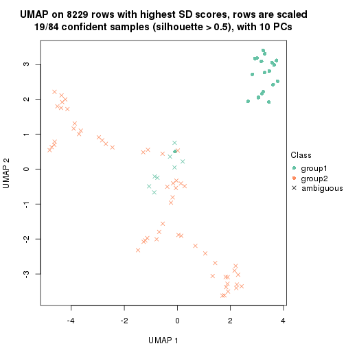</p>

</div>
<div id='tab-SD-mclust-dimension-reduction-2'>
<pre><code class="r">dimension_reduction(res, k = 3, method = &quot;UMAP&quot;)
</code></pre>

<p></p>

</div>
<div id='tab-SD-mclust-dimension-reduction-3'>
<pre><code class="r">dimension_reduction(res, k = 4, method = &quot;UMAP&quot;)
</code></pre>

<p></p>

</div>
<div id='tab-SD-mclust-dimension-reduction-4'>
<pre><code class="r">dimension_reduction(res, k = 5, method = &quot;UMAP&quot;)
</code></pre>

<p></p>

</div>
<div id='tab-SD-mclust-dimension-reduction-5'>
<pre><code class="r">dimension_reduction(res, k = 6, method = &quot;UMAP&quot;)
</code></pre>

<p>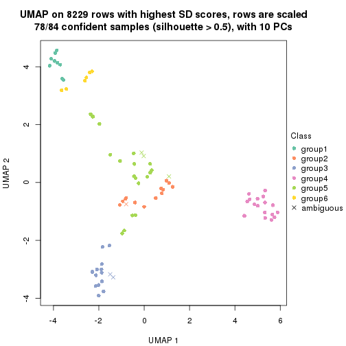</p>

</div>
</div>


Following heatmap shows how subgroups are split when increasing `k`:

```r
collect_classes(res)
```


Test correlation between subgroups and known annotations. If the known
annotation is numeric, one-way ANOVA test is applied, and if the known
annotation is discrete, chi-squared contingency table test is applied.

```r
test_to_known_factors(res)
```

```
#>            n tissue(p) k
#> SD:mclust 19        NA 2
#> SD:mclust 78  1.69e-08 3
#> SD:mclust 76  3.70e-11 4
#> SD:mclust 64  1.46e-12 5
#> SD:mclust 78  4.67e-17 6
```


If matrix rows can be associated to genes, consider to use `GO_Enrichment(res,
...)` to perform function enrichment for the signature genes.


 

---------------------------------------------------


### SD:NMF*


The object with results only for a single top-value method and a single partition method 
can be extracted as:

```r
res = res_list["SD", "NMF"]
# you can also extract it by
# res = res_list["SD:NMF"]
```

A summary of `res` and all the functions that can be applied to it:

```r
res
```

```
#> A 'ConsensusPartition' object with k = 2, 3, 4, 5, 6.
#>   On a matrix with 8229 rows and 84 columns.
#>   Top rows (823, 1646, 2468, 3291, 4114) are extracted by 'SD' method.
#>   Subgroups are detected by 'NMF' method.
#>   Performed in total 1250 partitions by row resampling.
#>   Best k for subgroups seems to be 4.
#> 
#> Following methods can be applied to this 'ConsensusPartition' object:
#>  [1] "cola_report"             "collect_classes"         "collect_plots"          
#>  [4] "collect_stats"           "colnames"                "compare_signatures"     
#>  [7] "consensus_heatmap"       "dimension_reduction"     "functional_enrichment"  
#> [10] "get_anno_col"            "get_anno"                "get_classes"            
#> [13] "get_consensus"           "get_matrix"              "get_membership"         
#> [16] "get_param"               "get_signatures"          "get_stats"              
#> [19] "is_best_k"               "is_stable_k"             "membership_heatmap"     
#> [22] "ncol"                    "nrow"                    "plot_ecdf"              
#> [25] "rownames"                "select_partition_number" "show"                   
#> [28] "suggest_best_k"          "test_to_known_factors"
```

`collect_plots()` function collects all the plots made from `res` for all `k` (number of partitions)
into one single page to provide an easy and fast comparison between different `k`.

```r
collect_plots(res)
```

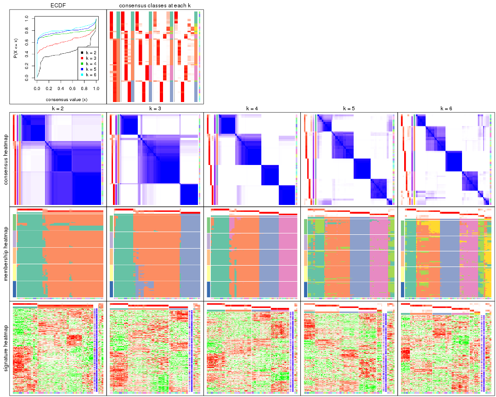

The plots are:

- The first row: a plot of the ECDF (Empirical cumulative distribution
  function) curves of the consensus matrix for each `k` and the heatmap of
  predicted classes for each `k`.
- The second row: heatmaps of the consensus matrix for each `k`.
- The third row: heatmaps of the membership matrix for each `k`.
- The fouth row: heatmaps of the signatures for each `k`.

All the plots in panels can be made by individual functions and they are
plotted later in this section.

`select_partition_number()` produces several plots showing different
statistics for choosing "optimized" `k`. There are following statistics:

- ECDF curves of the consensus matrix for each `k`;
- 1-PAC. [The PAC
  score](https://en.wikipedia.org/wiki/Consensus_clustering#Over-interpretation_potential_of_consensus_clustering)
  measures the proportion of the ambiguous subgrouping.
- Mean silhouette score.
- Concordance. The mean probability of fiting the consensus class ids in all
  partitions.
- Area increased. Denote $A_k$ as the area under the ECDF curve for current
  `k`, the area increased is defined as $A_k - A_{k-1}$.
- Rand index. The percent of pairs of samples that are both in a same cluster
  or both are not in a same cluster in the partition of k and k-1.
- Jaccard index. The ratio of pairs of samples are both in a same cluster in
  the partition of k and k-1 and the pairs of samples are both in a same
  cluster in the partition k or k-1.

The detailed explanations of these statistics can be found in [the cola
vignette](http://bioconductor.org/packages/devel/bioc/vignettes/cola/inst/doc/cola.html#toc_13).

Generally speaking, lower PAC score, higher mean silhouette score or higher
concordance corresponds to better partition. Rand index and Jaccard index
measure how similar the current partition is compared to partition with `k-1`.
If they are too similar, we won't accept `k` is better than `k-1`.

```r
select_partition_number(res)
```


The numeric values for all these statistics can be obtained by `get_stats()`.

```r
get_stats(res)
```

```
#>   k 1-PAC mean_silhouette concordance area_increased  Rand Jaccard
#> 2 2 0.892           0.896       0.935         0.4374 0.577   0.577
#> 3 3 0.821           0.869       0.937         0.4272 0.648   0.465
#> 4 4 0.938           0.919       0.963         0.2023 0.834   0.589
#> 5 5 0.878           0.825       0.887         0.0483 0.944   0.787
#> 6 6 0.868           0.803       0.857         0.0381 0.968   0.853
```

`suggest_best_k()` suggests the best $k$ based on these statistics. The rules are as follows:

- All $k$ with Jaccard index larger than 0.95 are removed because the increase of
  the partition number does not provides enough extra information. If all $k$ are removed,
  the best $k$ is assigned by `NA`.
- For $k$ with 1-PAC larger than 0.9, the maximal $k$ is taken as the "best k". Other $k$ is called "optional k".
- If it does not fit the second rule. The $k$ with the highest vote of highest
  1-PAC, mean silhouette and concordance is taken as the "best k".

```r
suggest_best_k(res)
```

```
#> [1] 4
```


Following shows the table of the partitions (You need to click the **show/hide
code output** link to see it). The membership matrix (columns with name `p*`)
is inferred by
[`clue::cl_consensus()`](https://www.rdocumentation.org/link/cl_consensus?package=clue)
function with the `SE` method. Basically the value in the membership matrix
represents the probability to belong to a certain group. The finall class
label for an item is determined with the group with highest probability it
belongs to.

In `get_classes()` function, the entropy is calculated from the membership
matrix and the silhouette score is calculated from the consensus matrix.


<script>
$( function() {
	$( '#tabs-SD-NMF-get-classes' ).tabs();
} );
</script>
<div id='tabs-SD-NMF-get-classes'>
<ul>
<li><a href='#tab-SD-NMF-get-classes-1'>k = 2</a></li>
<li><a href='#tab-SD-NMF-get-classes-2'>k = 3</a></li>
<li><a href='#tab-SD-NMF-get-classes-3'>k = 4</a></li>
<li><a href='#tab-SD-NMF-get-classes-4'>k = 5</a></li>
<li><a href='#tab-SD-NMF-get-classes-5'>k = 6</a></li>
</ul>

<div id='tab-SD-NMF-get-classes-1'>
<p><a id='tab-SD-NMF-get-classes-1-a' style='color:#0366d6' href='#'>show/hide code output</a></p>
<pre><code class="r">cbind(get_classes(res, k = 2), get_membership(res, k = 2))
</code></pre>

<pre><code>#&gt;         class entropy silhouette    p1    p2
#&gt; GSM2819     1  0.9129      0.465 0.672 0.328
#&gt; GSM2820     2  0.2043      0.908 0.032 0.968
#&gt; GSM2822     2  0.9998      0.150 0.492 0.508
#&gt; GSM2832     2  0.7453      0.784 0.212 0.788
#&gt; GSM2823     2  0.7950      0.712 0.240 0.760
#&gt; GSM2824     2  0.9552      0.483 0.376 0.624
#&gt; GSM2825     1  0.2043      0.960 0.968 0.032
#&gt; GSM2826     1  0.2043      0.960 0.968 0.032
#&gt; GSM2829     2  0.3274      0.929 0.060 0.940
#&gt; GSM2856     2  0.3431      0.927 0.064 0.936
#&gt; GSM2830     2  0.3274      0.929 0.060 0.940
#&gt; GSM2843     2  0.3274      0.929 0.060 0.940
#&gt; GSM2871     2  0.3274      0.929 0.060 0.940
#&gt; GSM2831     2  0.9661      0.455 0.392 0.608
#&gt; GSM2844     2  0.9866      0.347 0.432 0.568
#&gt; GSM2833     2  0.5408      0.881 0.124 0.876
#&gt; GSM2846     2  0.3431      0.927 0.064 0.936
#&gt; GSM2835     1  0.2043      0.960 0.968 0.032
#&gt; GSM2858     1  0.2043      0.960 0.968 0.032
#&gt; GSM2836     2  0.3274      0.929 0.060 0.940
#&gt; GSM2848     2  0.3274      0.929 0.060 0.940
#&gt; GSM2828     2  0.2043      0.908 0.032 0.968
#&gt; GSM2837     2  0.2043      0.908 0.032 0.968
#&gt; GSM2839     1  0.0000      0.972 1.000 0.000
#&gt; GSM2841     1  0.0000      0.972 1.000 0.000
#&gt; GSM2827     2  0.3274      0.929 0.060 0.940
#&gt; GSM2842     2  0.3274      0.929 0.060 0.940
#&gt; GSM2845     2  0.3274      0.929 0.060 0.940
#&gt; GSM2872     2  0.7376      0.790 0.208 0.792
#&gt; GSM2834     2  0.3274      0.929 0.060 0.940
#&gt; GSM2847     2  0.3274      0.929 0.060 0.940
#&gt; GSM2849     2  0.2043      0.908 0.032 0.968
#&gt; GSM2850     2  0.2043      0.908 0.032 0.968
#&gt; GSM2838     2  0.3274      0.929 0.060 0.940
#&gt; GSM2853     2  0.3274      0.929 0.060 0.940
#&gt; GSM2852     2  0.1633      0.910 0.024 0.976
#&gt; GSM2855     2  0.1633      0.910 0.024 0.976
#&gt; GSM2840     1  0.0000      0.972 1.000 0.000
#&gt; GSM2857     1  0.0000      0.972 1.000 0.000
#&gt; GSM2859     2  0.3274      0.929 0.060 0.940
#&gt; GSM2860     2  0.3274      0.929 0.060 0.940
#&gt; GSM2861     2  0.3274      0.929 0.060 0.940
#&gt; GSM2862     2  0.3274      0.929 0.060 0.940
#&gt; GSM2863     2  0.3274      0.929 0.060 0.940
#&gt; GSM2864     2  0.3274      0.929 0.060 0.940
#&gt; GSM2865     2  0.3274      0.929 0.060 0.940
#&gt; GSM2866     2  0.3274      0.929 0.060 0.940
#&gt; GSM2868     2  0.3274      0.929 0.060 0.940
#&gt; GSM2869     2  0.3274      0.929 0.060 0.940
#&gt; GSM2851     2  0.3274      0.929 0.060 0.940
#&gt; GSM2867     2  0.3274      0.929 0.060 0.940
#&gt; GSM2870     2  0.3274      0.929 0.060 0.940
#&gt; GSM2854     2  0.3431      0.927 0.064 0.936
#&gt; GSM2873     2  0.3274      0.929 0.060 0.940
#&gt; GSM2874     2  0.2043      0.908 0.032 0.968
#&gt; GSM2884     2  0.2043      0.908 0.032 0.968
#&gt; GSM2875     1  0.0000      0.972 1.000 0.000
#&gt; GSM2890     1  0.0000      0.972 1.000 0.000
#&gt; GSM2877     1  0.0000      0.972 1.000 0.000
#&gt; GSM2892     1  0.0000      0.972 1.000 0.000
#&gt; GSM2902     1  0.0000      0.972 1.000 0.000
#&gt; GSM2878     1  0.0000      0.972 1.000 0.000
#&gt; GSM2901     1  0.0000      0.972 1.000 0.000
#&gt; GSM2879     2  0.1414      0.911 0.020 0.980
#&gt; GSM2898     2  0.1184      0.911 0.016 0.984
#&gt; GSM2881     2  0.2043      0.908 0.032 0.968
#&gt; GSM2897     2  0.2043      0.908 0.032 0.968
#&gt; GSM2882     1  0.2778      0.949 0.952 0.048
#&gt; GSM2894     1  0.2778      0.949 0.952 0.048
#&gt; GSM2883     2  0.2043      0.908 0.032 0.968
#&gt; GSM2895     2  0.2043      0.908 0.032 0.968
#&gt; GSM2885     2  0.2043      0.908 0.032 0.968
#&gt; GSM2886     2  0.2043      0.908 0.032 0.968
#&gt; GSM2887     2  0.2043      0.908 0.032 0.968
#&gt; GSM2896     2  0.2043      0.908 0.032 0.968
#&gt; GSM2888     2  0.0672      0.915 0.008 0.992
#&gt; GSM2889     2  0.0672      0.915 0.008 0.992
#&gt; GSM2876     1  0.0000      0.972 1.000 0.000
#&gt; GSM2891     1  0.0000      0.972 1.000 0.000
#&gt; GSM2880     1  0.0000      0.972 1.000 0.000
#&gt; GSM2893     1  0.0000      0.972 1.000 0.000
#&gt; GSM2821     1  0.1843      0.962 0.972 0.028
#&gt; GSM2900     1  0.1414      0.966 0.980 0.020
#&gt; GSM2903     1  0.1414      0.966 0.980 0.020
</code></pre>

<script>
$('#tab-SD-NMF-get-classes-1-a').parent().next().next().hide();
$('#tab-SD-NMF-get-classes-1-a').click(function(){
  $('#tab-SD-NMF-get-classes-1-a').parent().next().next().toggle();
  return(false);
});
</script>
</div>

<div id='tab-SD-NMF-get-classes-2'>
<p><a id='tab-SD-NMF-get-classes-2-a' style='color:#0366d6' href='#'>show/hide code output</a></p>
<pre><code class="r">cbind(get_classes(res, k = 3), get_membership(res, k = 3))
</code></pre>

<pre><code>#&gt;         class entropy silhouette    p1    p2    p3
#&gt; GSM2819     2  0.0000     0.9083 0.000 1.000 0.000
#&gt; GSM2820     3  0.0000     0.9673 0.000 0.000 1.000
#&gt; GSM2822     2  0.0000     0.9083 0.000 1.000 0.000
#&gt; GSM2832     2  0.0000     0.9083 0.000 1.000 0.000
#&gt; GSM2823     3  0.9949    -0.0397 0.356 0.284 0.360
#&gt; GSM2824     1  0.8853     0.4225 0.568 0.264 0.168
#&gt; GSM2825     2  0.6079     0.4020 0.388 0.612 0.000
#&gt; GSM2826     2  0.6126     0.3788 0.400 0.600 0.000
#&gt; GSM2829     2  0.0000     0.9083 0.000 1.000 0.000
#&gt; GSM2856     2  0.0000     0.9083 0.000 1.000 0.000
#&gt; GSM2830     2  0.0000     0.9083 0.000 1.000 0.000
#&gt; GSM2843     2  0.0000     0.9083 0.000 1.000 0.000
#&gt; GSM2871     2  0.0000     0.9083 0.000 1.000 0.000
#&gt; GSM2831     2  0.0000     0.9083 0.000 1.000 0.000
#&gt; GSM2844     2  0.0000     0.9083 0.000 1.000 0.000
#&gt; GSM2833     2  0.0000     0.9083 0.000 1.000 0.000
#&gt; GSM2846     2  0.0000     0.9083 0.000 1.000 0.000
#&gt; GSM2835     2  0.0892     0.8984 0.020 0.980 0.000
#&gt; GSM2858     2  0.0747     0.9007 0.016 0.984 0.000
#&gt; GSM2836     2  0.2448     0.8837 0.000 0.924 0.076
#&gt; GSM2848     2  0.1529     0.8984 0.000 0.960 0.040
#&gt; GSM2828     3  0.0000     0.9673 0.000 0.000 1.000
#&gt; GSM2837     3  0.0000     0.9673 0.000 0.000 1.000
#&gt; GSM2839     1  0.0000     0.9596 1.000 0.000 0.000
#&gt; GSM2841     1  0.0000     0.9596 1.000 0.000 0.000
#&gt; GSM2827     2  0.2261     0.8883 0.000 0.932 0.068
#&gt; GSM2842     2  0.4121     0.8172 0.000 0.832 0.168
#&gt; GSM2845     2  0.0000     0.9083 0.000 1.000 0.000
#&gt; GSM2872     2  0.0000     0.9083 0.000 1.000 0.000
#&gt; GSM2834     2  0.0000     0.9083 0.000 1.000 0.000
#&gt; GSM2847     2  0.0000     0.9083 0.000 1.000 0.000
#&gt; GSM2849     3  0.0000     0.9673 0.000 0.000 1.000
#&gt; GSM2850     3  0.0000     0.9673 0.000 0.000 1.000
#&gt; GSM2838     2  0.0237     0.9077 0.000 0.996 0.004
#&gt; GSM2853     2  0.0000     0.9083 0.000 1.000 0.000
#&gt; GSM2852     3  0.0000     0.9673 0.000 0.000 1.000
#&gt; GSM2855     3  0.0000     0.9673 0.000 0.000 1.000
#&gt; GSM2840     1  0.0000     0.9596 1.000 0.000 0.000
#&gt; GSM2857     1  0.0000     0.9596 1.000 0.000 0.000
#&gt; GSM2859     2  0.1411     0.8995 0.000 0.964 0.036
#&gt; GSM2860     2  0.2625     0.8798 0.000 0.916 0.084
#&gt; GSM2861     2  0.4654     0.7756 0.000 0.792 0.208
#&gt; GSM2862     2  0.1753     0.8954 0.000 0.952 0.048
#&gt; GSM2863     2  0.3038     0.8681 0.000 0.896 0.104
#&gt; GSM2864     2  0.4002     0.8240 0.000 0.840 0.160
#&gt; GSM2865     2  0.2878     0.8731 0.000 0.904 0.096
#&gt; GSM2866     2  0.0000     0.9083 0.000 1.000 0.000
#&gt; GSM2868     2  0.6111     0.4729 0.000 0.604 0.396
#&gt; GSM2869     2  0.4931     0.7476 0.000 0.768 0.232
#&gt; GSM2851     2  0.2878     0.8734 0.000 0.904 0.096
#&gt; GSM2867     2  0.5327     0.6945 0.000 0.728 0.272
#&gt; GSM2870     2  0.3116     0.8654 0.000 0.892 0.108
#&gt; GSM2854     2  0.0000     0.9083 0.000 1.000 0.000
#&gt; GSM2873     2  0.0000     0.9083 0.000 1.000 0.000
#&gt; GSM2874     3  0.0000     0.9673 0.000 0.000 1.000
#&gt; GSM2884     3  0.0000     0.9673 0.000 0.000 1.000
#&gt; GSM2875     1  0.0000     0.9596 1.000 0.000 0.000
#&gt; GSM2890     1  0.0000     0.9596 1.000 0.000 0.000
#&gt; GSM2877     1  0.0000     0.9596 1.000 0.000 0.000
#&gt; GSM2892     1  0.0000     0.9596 1.000 0.000 0.000
#&gt; GSM2902     1  0.0000     0.9596 1.000 0.000 0.000
#&gt; GSM2878     1  0.0000     0.9596 1.000 0.000 0.000
#&gt; GSM2901     1  0.0000     0.9596 1.000 0.000 0.000
#&gt; GSM2879     3  0.0000     0.9673 0.000 0.000 1.000
#&gt; GSM2898     3  0.0000     0.9673 0.000 0.000 1.000
#&gt; GSM2881     3  0.0000     0.9673 0.000 0.000 1.000
#&gt; GSM2897     3  0.0000     0.9673 0.000 0.000 1.000
#&gt; GSM2882     2  0.0424     0.9049 0.008 0.992 0.000
#&gt; GSM2894     2  0.0424     0.9049 0.008 0.992 0.000
#&gt; GSM2883     3  0.0000     0.9673 0.000 0.000 1.000
#&gt; GSM2895     3  0.0000     0.9673 0.000 0.000 1.000
#&gt; GSM2885     3  0.0000     0.9673 0.000 0.000 1.000
#&gt; GSM2886     3  0.0000     0.9673 0.000 0.000 1.000
#&gt; GSM2887     3  0.0000     0.9673 0.000 0.000 1.000
#&gt; GSM2896     3  0.0000     0.9673 0.000 0.000 1.000
#&gt; GSM2888     2  0.6286     0.3016 0.000 0.536 0.464
#&gt; GSM2889     2  0.6302     0.2540 0.000 0.520 0.480
#&gt; GSM2876     1  0.0000     0.9596 1.000 0.000 0.000
#&gt; GSM2891     1  0.0000     0.9596 1.000 0.000 0.000
#&gt; GSM2880     1  0.0000     0.9596 1.000 0.000 0.000
#&gt; GSM2893     1  0.0000     0.9596 1.000 0.000 0.000
#&gt; GSM2821     1  0.3816     0.7927 0.852 0.148 0.000
#&gt; GSM2900     1  0.1163     0.9356 0.972 0.028 0.000
#&gt; GSM2903     1  0.1289     0.9317 0.968 0.032 0.000
</code></pre>

<script>
$('#tab-SD-NMF-get-classes-2-a').parent().next().next().hide();
$('#tab-SD-NMF-get-classes-2-a').click(function(){
  $('#tab-SD-NMF-get-classes-2-a').parent().next().next().toggle();
  return(false);
});
</script>
</div>

<div id='tab-SD-NMF-get-classes-3'>
<p><a id='tab-SD-NMF-get-classes-3-a' style='color:#0366d6' href='#'>show/hide code output</a></p>
<pre><code class="r">cbind(get_classes(res, k = 4), get_membership(res, k = 4))
</code></pre>

<pre><code>#&gt;         class entropy silhouette    p1    p2    p3    p4
#&gt; GSM2819     2  0.0524      0.903 0.008 0.988 0.000 0.004
#&gt; GSM2820     3  0.0000      0.997 0.000 0.000 1.000 0.000
#&gt; GSM2822     2  0.3400      0.768 0.000 0.820 0.000 0.180
#&gt; GSM2832     2  0.3400      0.768 0.000 0.820 0.000 0.180
#&gt; GSM2823     2  0.4967      0.138 0.452 0.548 0.000 0.000
#&gt; GSM2824     2  0.4843      0.312 0.396 0.604 0.000 0.000
#&gt; GSM2825     2  0.7430      0.423 0.228 0.512 0.000 0.260
#&gt; GSM2826     2  0.6680      0.542 0.136 0.604 0.000 0.260
#&gt; GSM2829     4  0.0000      0.998 0.000 0.000 0.000 1.000
#&gt; GSM2856     4  0.0000      0.998 0.000 0.000 0.000 1.000
#&gt; GSM2830     4  0.0000      0.998 0.000 0.000 0.000 1.000
#&gt; GSM2843     4  0.0000      0.998 0.000 0.000 0.000 1.000
#&gt; GSM2871     4  0.0188      0.995 0.000 0.004 0.000 0.996
#&gt; GSM2831     4  0.0000      0.998 0.000 0.000 0.000 1.000
#&gt; GSM2844     4  0.0000      0.998 0.000 0.000 0.000 1.000
#&gt; GSM2833     4  0.0188      0.995 0.000 0.004 0.000 0.996
#&gt; GSM2846     4  0.0000      0.998 0.000 0.000 0.000 1.000
#&gt; GSM2835     4  0.0000      0.998 0.000 0.000 0.000 1.000
#&gt; GSM2858     4  0.0000      0.998 0.000 0.000 0.000 1.000
#&gt; GSM2836     2  0.1211      0.891 0.000 0.960 0.000 0.040
#&gt; GSM2848     2  0.1022      0.895 0.000 0.968 0.000 0.032
#&gt; GSM2828     3  0.0000      0.997 0.000 0.000 1.000 0.000
#&gt; GSM2837     3  0.0000      0.997 0.000 0.000 1.000 0.000
#&gt; GSM2839     1  0.0000      0.968 1.000 0.000 0.000 0.000
#&gt; GSM2841     1  0.0000      0.968 1.000 0.000 0.000 0.000
#&gt; GSM2827     2  0.1211      0.891 0.000 0.960 0.000 0.040
#&gt; GSM2842     2  0.0817      0.899 0.000 0.976 0.000 0.024
#&gt; GSM2845     4  0.0000      0.998 0.000 0.000 0.000 1.000
#&gt; GSM2872     4  0.0000      0.998 0.000 0.000 0.000 1.000
#&gt; GSM2834     4  0.0188      0.995 0.000 0.004 0.000 0.996
#&gt; GSM2847     4  0.0000      0.998 0.000 0.000 0.000 1.000
#&gt; GSM2849     3  0.0000      0.997 0.000 0.000 1.000 0.000
#&gt; GSM2850     3  0.0000      0.997 0.000 0.000 1.000 0.000
#&gt; GSM2838     2  0.0000      0.907 0.000 1.000 0.000 0.000
#&gt; GSM2853     2  0.0000      0.907 0.000 1.000 0.000 0.000
#&gt; GSM2852     3  0.0336      0.991 0.000 0.008 0.992 0.000
#&gt; GSM2855     3  0.0188      0.995 0.000 0.004 0.996 0.000
#&gt; GSM2840     1  0.0000      0.968 1.000 0.000 0.000 0.000
#&gt; GSM2857     1  0.0000      0.968 1.000 0.000 0.000 0.000
#&gt; GSM2859     2  0.0000      0.907 0.000 1.000 0.000 0.000
#&gt; GSM2860     2  0.0000      0.907 0.000 1.000 0.000 0.000
#&gt; GSM2861     2  0.0000      0.907 0.000 1.000 0.000 0.000
#&gt; GSM2862     2  0.0000      0.907 0.000 1.000 0.000 0.000
#&gt; GSM2863     2  0.0000      0.907 0.000 1.000 0.000 0.000
#&gt; GSM2864     2  0.0000      0.907 0.000 1.000 0.000 0.000
#&gt; GSM2865     2  0.0000      0.907 0.000 1.000 0.000 0.000
#&gt; GSM2866     2  0.0000      0.907 0.000 1.000 0.000 0.000
#&gt; GSM2868     2  0.0000      0.907 0.000 1.000 0.000 0.000
#&gt; GSM2869     2  0.0000      0.907 0.000 1.000 0.000 0.000
#&gt; GSM2851     2  0.0000      0.907 0.000 1.000 0.000 0.000
#&gt; GSM2867     2  0.0000      0.907 0.000 1.000 0.000 0.000
#&gt; GSM2870     2  0.0000      0.907 0.000 1.000 0.000 0.000
#&gt; GSM2854     4  0.0707      0.979 0.000 0.020 0.000 0.980
#&gt; GSM2873     2  0.4277      0.637 0.000 0.720 0.000 0.280
#&gt; GSM2874     3  0.0000      0.997 0.000 0.000 1.000 0.000
#&gt; GSM2884     3  0.0000      0.997 0.000 0.000 1.000 0.000
#&gt; GSM2875     1  0.0000      0.968 1.000 0.000 0.000 0.000
#&gt; GSM2890     1  0.0000      0.968 1.000 0.000 0.000 0.000
#&gt; GSM2877     1  0.0000      0.968 1.000 0.000 0.000 0.000
#&gt; GSM2892     1  0.0000      0.968 1.000 0.000 0.000 0.000
#&gt; GSM2902     1  0.0000      0.968 1.000 0.000 0.000 0.000
#&gt; GSM2878     1  0.0000      0.968 1.000 0.000 0.000 0.000
#&gt; GSM2901     1  0.0000      0.968 1.000 0.000 0.000 0.000
#&gt; GSM2879     3  0.0469      0.988 0.000 0.012 0.988 0.000
#&gt; GSM2898     3  0.0817      0.977 0.000 0.024 0.976 0.000
#&gt; GSM2881     3  0.0000      0.997 0.000 0.000 1.000 0.000
#&gt; GSM2897     3  0.0000      0.997 0.000 0.000 1.000 0.000
#&gt; GSM2882     4  0.0000      0.998 0.000 0.000 0.000 1.000
#&gt; GSM2894     4  0.0000      0.998 0.000 0.000 0.000 1.000
#&gt; GSM2883     3  0.0000      0.997 0.000 0.000 1.000 0.000
#&gt; GSM2895     3  0.0000      0.997 0.000 0.000 1.000 0.000
#&gt; GSM2885     3  0.0000      0.997 0.000 0.000 1.000 0.000
#&gt; GSM2886     3  0.0000      0.997 0.000 0.000 1.000 0.000
#&gt; GSM2887     3  0.0000      0.997 0.000 0.000 1.000 0.000
#&gt; GSM2896     3  0.0000      0.997 0.000 0.000 1.000 0.000
#&gt; GSM2888     2  0.0524      0.905 0.000 0.988 0.004 0.008
#&gt; GSM2889     2  0.0376      0.906 0.000 0.992 0.004 0.004
#&gt; GSM2876     1  0.0000      0.968 1.000 0.000 0.000 0.000
#&gt; GSM2891     1  0.0000      0.968 1.000 0.000 0.000 0.000
#&gt; GSM2880     1  0.0000      0.968 1.000 0.000 0.000 0.000
#&gt; GSM2893     1  0.0000      0.968 1.000 0.000 0.000 0.000
#&gt; GSM2821     1  0.4222      0.634 0.728 0.272 0.000 0.000
#&gt; GSM2900     1  0.2647      0.864 0.880 0.120 0.000 0.000
#&gt; GSM2903     1  0.2647      0.864 0.880 0.120 0.000 0.000
</code></pre>

<script>
$('#tab-SD-NMF-get-classes-3-a').parent().next().next().hide();
$('#tab-SD-NMF-get-classes-3-a').click(function(){
  $('#tab-SD-NMF-get-classes-3-a').parent().next().next().toggle();
  return(false);
});
</script>
</div>

<div id='tab-SD-NMF-get-classes-4'>
<p><a id='tab-SD-NMF-get-classes-4-a' style='color:#0366d6' href='#'>show/hide code output</a></p>
<pre><code class="r">cbind(get_classes(res, k = 5), get_membership(res, k = 5))
</code></pre>

<pre><code>#&gt;         class entropy silhouette    p1    p2    p3    p4    p5
#&gt; GSM2819     2  0.6446      0.288 0.388 0.464 0.000 0.008 0.140
#&gt; GSM2820     3  0.0000      0.997 0.000 0.000 1.000 0.000 0.000
#&gt; GSM2822     2  0.5390      0.733 0.056 0.724 0.000 0.072 0.148
#&gt; GSM2832     2  0.5308      0.723 0.036 0.728 0.000 0.108 0.128
#&gt; GSM2823     1  0.5584      0.198 0.584 0.324 0.000 0.000 0.092
#&gt; GSM2824     1  0.5289      0.204 0.616 0.312 0.000 0.000 0.072
#&gt; GSM2825     5  0.6858      0.525 0.124 0.184 0.000 0.096 0.596
#&gt; GSM2826     5  0.6803      0.476 0.104 0.256 0.000 0.072 0.568
#&gt; GSM2829     4  0.0609      0.967 0.000 0.000 0.000 0.980 0.020
#&gt; GSM2856     4  0.0703      0.967 0.000 0.000 0.000 0.976 0.024
#&gt; GSM2830     4  0.0451      0.969 0.004 0.000 0.000 0.988 0.008
#&gt; GSM2843     4  0.0451      0.969 0.000 0.004 0.000 0.988 0.008
#&gt; GSM2871     4  0.1267      0.963 0.004 0.012 0.000 0.960 0.024
#&gt; GSM2831     4  0.0162      0.969 0.004 0.000 0.000 0.996 0.000
#&gt; GSM2844     4  0.0162      0.969 0.004 0.000 0.000 0.996 0.000
#&gt; GSM2833     4  0.2236      0.937 0.024 0.000 0.000 0.908 0.068
#&gt; GSM2846     4  0.2079      0.941 0.020 0.000 0.000 0.916 0.064
#&gt; GSM2835     4  0.1270      0.956 0.000 0.000 0.000 0.948 0.052
#&gt; GSM2858     4  0.1732      0.938 0.000 0.000 0.000 0.920 0.080
#&gt; GSM2836     2  0.0865      0.900 0.004 0.972 0.000 0.000 0.024
#&gt; GSM2848     2  0.0510      0.903 0.000 0.984 0.000 0.000 0.016
#&gt; GSM2828     3  0.0000      0.997 0.000 0.000 1.000 0.000 0.000
#&gt; GSM2837     3  0.0000      0.997 0.000 0.000 1.000 0.000 0.000
#&gt; GSM2839     5  0.2648      0.663 0.152 0.000 0.000 0.000 0.848
#&gt; GSM2841     5  0.2813      0.631 0.168 0.000 0.000 0.000 0.832
#&gt; GSM2827     2  0.1012      0.906 0.020 0.968 0.000 0.000 0.012
#&gt; GSM2842     2  0.1386      0.905 0.032 0.952 0.000 0.000 0.016
#&gt; GSM2845     4  0.0609      0.968 0.000 0.000 0.000 0.980 0.020
#&gt; GSM2872     4  0.0566      0.969 0.004 0.000 0.000 0.984 0.012
#&gt; GSM2834     4  0.1568      0.948 0.000 0.020 0.000 0.944 0.036
#&gt; GSM2847     4  0.0609      0.968 0.000 0.000 0.000 0.980 0.020
#&gt; GSM2849     3  0.0000      0.997 0.000 0.000 1.000 0.000 0.000
#&gt; GSM2850     3  0.0000      0.997 0.000 0.000 1.000 0.000 0.000
#&gt; GSM2838     2  0.2359      0.896 0.060 0.904 0.000 0.000 0.036
#&gt; GSM2853     2  0.2359      0.896 0.060 0.904 0.000 0.000 0.036
#&gt; GSM2852     3  0.0162      0.994 0.000 0.004 0.996 0.000 0.000
#&gt; GSM2855     3  0.0162      0.994 0.000 0.004 0.996 0.000 0.000
#&gt; GSM2840     5  0.2439      0.676 0.120 0.000 0.000 0.004 0.876
#&gt; GSM2857     5  0.2536      0.676 0.128 0.000 0.000 0.004 0.868
#&gt; GSM2859     2  0.0912      0.903 0.012 0.972 0.000 0.000 0.016
#&gt; GSM2860     2  0.0510      0.903 0.000 0.984 0.000 0.000 0.016
#&gt; GSM2861     2  0.0693      0.906 0.012 0.980 0.000 0.000 0.008
#&gt; GSM2862     2  0.0671      0.902 0.004 0.980 0.000 0.000 0.016
#&gt; GSM2863     2  0.0798      0.902 0.008 0.976 0.000 0.000 0.016
#&gt; GSM2864     2  0.0912      0.903 0.012 0.972 0.000 0.000 0.016
#&gt; GSM2865     2  0.0798      0.902 0.008 0.976 0.000 0.000 0.016
#&gt; GSM2866     2  0.0609      0.902 0.000 0.980 0.000 0.000 0.020
#&gt; GSM2868     2  0.3075      0.875 0.092 0.860 0.000 0.000 0.048
#&gt; GSM2869     2  0.2889      0.884 0.084 0.872 0.000 0.000 0.044
#&gt; GSM2851     2  0.2426      0.894 0.064 0.900 0.000 0.000 0.036
#&gt; GSM2867     2  0.2770      0.887 0.076 0.880 0.000 0.000 0.044
#&gt; GSM2870     2  0.2554      0.891 0.072 0.892 0.000 0.000 0.036
#&gt; GSM2854     4  0.1568      0.955 0.000 0.020 0.000 0.944 0.036
#&gt; GSM2873     2  0.3019      0.816 0.000 0.864 0.000 0.088 0.048
#&gt; GSM2874     3  0.0000      0.997 0.000 0.000 1.000 0.000 0.000
#&gt; GSM2884     3  0.0000      0.997 0.000 0.000 1.000 0.000 0.000
#&gt; GSM2875     1  0.3999      0.625 0.656 0.000 0.000 0.000 0.344
#&gt; GSM2890     1  0.3999      0.625 0.656 0.000 0.000 0.000 0.344
#&gt; GSM2877     1  0.4015      0.621 0.652 0.000 0.000 0.000 0.348
#&gt; GSM2892     1  0.3999      0.625 0.656 0.000 0.000 0.000 0.344
#&gt; GSM2902     1  0.3999      0.625 0.656 0.000 0.000 0.000 0.344
#&gt; GSM2878     1  0.3949      0.623 0.668 0.000 0.000 0.000 0.332
#&gt; GSM2901     1  0.3949      0.623 0.668 0.000 0.000 0.000 0.332
#&gt; GSM2879     3  0.0771      0.976 0.000 0.020 0.976 0.000 0.004
#&gt; GSM2898     3  0.0609      0.978 0.000 0.020 0.980 0.000 0.000
#&gt; GSM2881     3  0.0000      0.997 0.000 0.000 1.000 0.000 0.000
#&gt; GSM2897     3  0.0000      0.997 0.000 0.000 1.000 0.000 0.000
#&gt; GSM2882     4  0.0693      0.967 0.012 0.000 0.000 0.980 0.008
#&gt; GSM2894     4  0.0912      0.965 0.016 0.000 0.000 0.972 0.012
#&gt; GSM2883     3  0.0000      0.997 0.000 0.000 1.000 0.000 0.000
#&gt; GSM2895     3  0.0000      0.997 0.000 0.000 1.000 0.000 0.000
#&gt; GSM2885     3  0.0000      0.997 0.000 0.000 1.000 0.000 0.000
#&gt; GSM2886     3  0.0000      0.997 0.000 0.000 1.000 0.000 0.000
#&gt; GSM2887     3  0.0000      0.997 0.000 0.000 1.000 0.000 0.000
#&gt; GSM2896     3  0.0000      0.997 0.000 0.000 1.000 0.000 0.000
#&gt; GSM2888     2  0.2536      0.897 0.044 0.900 0.004 0.000 0.052
#&gt; GSM2889     2  0.2536      0.897 0.044 0.900 0.004 0.000 0.052
#&gt; GSM2876     1  0.3508      0.548 0.748 0.000 0.000 0.000 0.252
#&gt; GSM2891     1  0.3452      0.545 0.756 0.000 0.000 0.000 0.244
#&gt; GSM2880     1  0.4045      0.612 0.644 0.000 0.000 0.000 0.356
#&gt; GSM2893     1  0.4045      0.612 0.644 0.000 0.000 0.000 0.356
#&gt; GSM2821     1  0.4525      0.263 0.740 0.056 0.000 0.004 0.200
#&gt; GSM2900     1  0.3174      0.379 0.844 0.020 0.000 0.004 0.132
#&gt; GSM2903     1  0.3219      0.375 0.840 0.020 0.000 0.004 0.136
</code></pre>

<script>
$('#tab-SD-NMF-get-classes-4-a').parent().next().next().hide();
$('#tab-SD-NMF-get-classes-4-a').click(function(){
  $('#tab-SD-NMF-get-classes-4-a').parent().next().next().toggle();
  return(false);
});
</script>
</div>

<div id='tab-SD-NMF-get-classes-5'>
<p><a id='tab-SD-NMF-get-classes-5-a' style='color:#0366d6' href='#'>show/hide code output</a></p>
<pre><code class="r">cbind(get_classes(res, k = 6), get_membership(res, k = 6))
</code></pre>

<pre><code>#&gt;         class entropy silhouette    p1    p2    p3    p4    p5    p6
#&gt; GSM2819     5  0.2324     0.5743 0.016 0.048 0.000 0.020 0.908 0.008
#&gt; GSM2820     3  0.0000     0.9919 0.000 0.000 1.000 0.000 0.000 0.000
#&gt; GSM2822     6  0.5879    -0.3229 0.000 0.396 0.000 0.016 0.128 0.460
#&gt; GSM2832     2  0.6099     0.3270 0.000 0.440 0.000 0.024 0.140 0.396
#&gt; GSM2823     5  0.5082     0.3999 0.460 0.056 0.000 0.000 0.476 0.008
#&gt; GSM2824     5  0.5108     0.4821 0.424 0.060 0.000 0.000 0.508 0.008
#&gt; GSM2825     6  0.3311     0.6374 0.092 0.024 0.000 0.016 0.020 0.848
#&gt; GSM2826     6  0.3298     0.6167 0.064 0.044 0.000 0.016 0.020 0.856
#&gt; GSM2829     4  0.1471     0.9091 0.000 0.000 0.000 0.932 0.004 0.064
#&gt; GSM2856     4  0.1753     0.9017 0.000 0.000 0.000 0.912 0.004 0.084
#&gt; GSM2830     4  0.0725     0.9211 0.000 0.000 0.000 0.976 0.012 0.012
#&gt; GSM2843     4  0.0820     0.9206 0.000 0.000 0.000 0.972 0.012 0.016
#&gt; GSM2871     4  0.1798     0.9070 0.000 0.028 0.000 0.932 0.020 0.020
#&gt; GSM2831     4  0.0146     0.9231 0.000 0.000 0.000 0.996 0.000 0.004
#&gt; GSM2844     4  0.0291     0.9233 0.000 0.000 0.000 0.992 0.004 0.004
#&gt; GSM2833     4  0.3426     0.8393 0.000 0.000 0.000 0.808 0.124 0.068
#&gt; GSM2846     4  0.3261     0.8531 0.000 0.000 0.000 0.824 0.104 0.072
#&gt; GSM2835     4  0.3440     0.8043 0.000 0.000 0.000 0.776 0.028 0.196
#&gt; GSM2858     4  0.3470     0.8000 0.000 0.000 0.000 0.772 0.028 0.200
#&gt; GSM2836     2  0.1148     0.7854 0.000 0.960 0.000 0.004 0.016 0.020
#&gt; GSM2848     2  0.0436     0.7988 0.000 0.988 0.000 0.004 0.004 0.004
#&gt; GSM2828     3  0.0000     0.9919 0.000 0.000 1.000 0.000 0.000 0.000
#&gt; GSM2837     3  0.0000     0.9919 0.000 0.000 1.000 0.000 0.000 0.000
#&gt; GSM2839     6  0.4520     0.6782 0.220 0.000 0.000 0.000 0.092 0.688
#&gt; GSM2841     6  0.4614     0.6692 0.228 0.000 0.000 0.000 0.096 0.676
#&gt; GSM2827     2  0.2724     0.8013 0.000 0.864 0.000 0.000 0.052 0.084
#&gt; GSM2842     2  0.3321     0.7953 0.000 0.820 0.000 0.000 0.080 0.100
#&gt; GSM2845     4  0.1350     0.9176 0.000 0.008 0.000 0.952 0.020 0.020
#&gt; GSM2872     4  0.1059     0.9191 0.000 0.004 0.000 0.964 0.016 0.016
#&gt; GSM2834     4  0.2816     0.8561 0.000 0.088 0.000 0.868 0.020 0.024
#&gt; GSM2847     4  0.1369     0.9163 0.000 0.016 0.000 0.952 0.016 0.016
#&gt; GSM2849     3  0.0000     0.9919 0.000 0.000 1.000 0.000 0.000 0.000
#&gt; GSM2850     3  0.0000     0.9919 0.000 0.000 1.000 0.000 0.000 0.000
#&gt; GSM2838     2  0.4780     0.7511 0.000 0.660 0.000 0.000 0.228 0.112
#&gt; GSM2853     2  0.4866     0.7450 0.000 0.648 0.000 0.000 0.236 0.116
#&gt; GSM2852     3  0.0000     0.9919 0.000 0.000 1.000 0.000 0.000 0.000
#&gt; GSM2855     3  0.0000     0.9919 0.000 0.000 1.000 0.000 0.000 0.000
#&gt; GSM2840     6  0.4156     0.6972 0.188 0.000 0.000 0.000 0.080 0.732
#&gt; GSM2857     6  0.4186     0.6969 0.192 0.000 0.000 0.000 0.080 0.728
#&gt; GSM2859     2  0.0748     0.7966 0.000 0.976 0.000 0.004 0.004 0.016
#&gt; GSM2860     2  0.0363     0.7969 0.000 0.988 0.000 0.000 0.000 0.012
#&gt; GSM2861     2  0.1984     0.8050 0.000 0.912 0.000 0.000 0.056 0.032
#&gt; GSM2862     2  0.0363     0.7969 0.000 0.988 0.000 0.000 0.000 0.012
#&gt; GSM2863     2  0.0603     0.7944 0.000 0.980 0.000 0.000 0.004 0.016
#&gt; GSM2864     2  0.0951     0.7898 0.000 0.968 0.000 0.004 0.008 0.020
#&gt; GSM2865     2  0.0748     0.7931 0.000 0.976 0.000 0.004 0.004 0.016
#&gt; GSM2866     2  0.0725     0.7928 0.000 0.976 0.000 0.000 0.012 0.012
#&gt; GSM2868     2  0.4873     0.7283 0.000 0.632 0.000 0.000 0.268 0.100
#&gt; GSM2869     2  0.4834     0.7394 0.000 0.644 0.000 0.000 0.252 0.104
#&gt; GSM2851     2  0.4625     0.7582 0.000 0.680 0.000 0.000 0.216 0.104
#&gt; GSM2867     2  0.4769     0.7467 0.000 0.656 0.000 0.000 0.240 0.104
#&gt; GSM2870     2  0.4914     0.7314 0.000 0.628 0.000 0.000 0.268 0.104
#&gt; GSM2854     4  0.1555     0.9141 0.000 0.004 0.000 0.932 0.004 0.060
#&gt; GSM2873     2  0.2084     0.7734 0.000 0.916 0.000 0.044 0.016 0.024
#&gt; GSM2874     3  0.0000     0.9919 0.000 0.000 1.000 0.000 0.000 0.000
#&gt; GSM2884     3  0.0000     0.9919 0.000 0.000 1.000 0.000 0.000 0.000
#&gt; GSM2875     1  0.0000     0.8781 1.000 0.000 0.000 0.000 0.000 0.000
#&gt; GSM2890     1  0.0000     0.8781 1.000 0.000 0.000 0.000 0.000 0.000
#&gt; GSM2877     1  0.0291     0.8751 0.992 0.000 0.000 0.000 0.004 0.004
#&gt; GSM2892     1  0.0000     0.8781 1.000 0.000 0.000 0.000 0.000 0.000
#&gt; GSM2902     1  0.0146     0.8769 0.996 0.000 0.000 0.000 0.000 0.004
#&gt; GSM2878     1  0.0458     0.8689 0.984 0.000 0.000 0.000 0.016 0.000
#&gt; GSM2901     1  0.0458     0.8689 0.984 0.000 0.000 0.000 0.016 0.000
#&gt; GSM2879     3  0.1588     0.9132 0.000 0.072 0.924 0.000 0.004 0.000
#&gt; GSM2898     3  0.1219     0.9396 0.000 0.048 0.948 0.000 0.004 0.000
#&gt; GSM2881     3  0.0000     0.9919 0.000 0.000 1.000 0.000 0.000 0.000
#&gt; GSM2897     3  0.0000     0.9919 0.000 0.000 1.000 0.000 0.000 0.000
#&gt; GSM2882     4  0.0363     0.9231 0.000 0.000 0.000 0.988 0.012 0.000
#&gt; GSM2894     4  0.0603     0.9228 0.000 0.000 0.000 0.980 0.016 0.004
#&gt; GSM2883     3  0.0000     0.9919 0.000 0.000 1.000 0.000 0.000 0.000
#&gt; GSM2895     3  0.0000     0.9919 0.000 0.000 1.000 0.000 0.000 0.000
#&gt; GSM2885     3  0.0000     0.9919 0.000 0.000 1.000 0.000 0.000 0.000
#&gt; GSM2886     3  0.0000     0.9919 0.000 0.000 1.000 0.000 0.000 0.000
#&gt; GSM2887     3  0.0000     0.9919 0.000 0.000 1.000 0.000 0.000 0.000
#&gt; GSM2896     3  0.0000     0.9919 0.000 0.000 1.000 0.000 0.000 0.000
#&gt; GSM2888     2  0.5008     0.7246 0.000 0.644 0.000 0.000 0.168 0.188
#&gt; GSM2889     2  0.5088     0.7302 0.000 0.648 0.004 0.000 0.168 0.180
#&gt; GSM2876     1  0.3899     0.1325 0.628 0.000 0.000 0.000 0.364 0.008
#&gt; GSM2891     1  0.3945     0.0706 0.612 0.000 0.000 0.000 0.380 0.008
#&gt; GSM2880     1  0.0405     0.8733 0.988 0.000 0.000 0.000 0.004 0.008
#&gt; GSM2893     1  0.0405     0.8733 0.988 0.000 0.000 0.000 0.004 0.008
#&gt; GSM2821     5  0.3025     0.7149 0.132 0.012 0.000 0.004 0.840 0.012
#&gt; GSM2900     5  0.3368     0.7174 0.232 0.000 0.000 0.000 0.756 0.012
#&gt; GSM2903     5  0.3398     0.7236 0.216 0.004 0.000 0.000 0.768 0.012
</code></pre>

<script>
$('#tab-SD-NMF-get-classes-5-a').parent().next().next().hide();
$('#tab-SD-NMF-get-classes-5-a').click(function(){
  $('#tab-SD-NMF-get-classes-5-a').parent().next().next().toggle();
  return(false);
});
</script>
</div>
</div>

Heatmaps for the consensus matrix. It visualizes the probability of two
samples to be in a same group.


<script>
$( function() {
	$( '#tabs-SD-NMF-consensus-heatmap' ).tabs();
} );
</script>
<div id='tabs-SD-NMF-consensus-heatmap'>
<ul>
<li><a href='#tab-SD-NMF-consensus-heatmap-1'>k = 2</a></li>
<li><a href='#tab-SD-NMF-consensus-heatmap-2'>k = 3</a></li>
<li><a href='#tab-SD-NMF-consensus-heatmap-3'>k = 4</a></li>
<li><a href='#tab-SD-NMF-consensus-heatmap-4'>k = 5</a></li>
<li><a href='#tab-SD-NMF-consensus-heatmap-5'>k = 6</a></li>
</ul>
<div id='tab-SD-NMF-consensus-heatmap-1'>
<pre><code class="r">consensus_heatmap(res, k = 2)
</code></pre>

<p></p>

</div>
<div id='tab-SD-NMF-consensus-heatmap-2'>
<pre><code class="r">consensus_heatmap(res, k = 3)
</code></pre>

<p></p>

</div>
<div id='tab-SD-NMF-consensus-heatmap-3'>
<pre><code class="r">consensus_heatmap(res, k = 4)
</code></pre>

<p></p>

</div>
<div id='tab-SD-NMF-consensus-heatmap-4'>
<pre><code class="r">consensus_heatmap(res, k = 5)
</code></pre>

<p></p>

</div>
<div id='tab-SD-NMF-consensus-heatmap-5'>
<pre><code class="r">consensus_heatmap(res, k = 6)
</code></pre>

<p></p>

</div>
</div>

Heatmaps for the membership of samples in all partitions to see how consistent they are:


<script>
$( function() {
	$( '#tabs-SD-NMF-membership-heatmap' ).tabs();
} );
</script>
<div id='tabs-SD-NMF-membership-heatmap'>
<ul>
<li><a href='#tab-SD-NMF-membership-heatmap-1'>k = 2</a></li>
<li><a href='#tab-SD-NMF-membership-heatmap-2'>k = 3</a></li>
<li><a href='#tab-SD-NMF-membership-heatmap-3'>k = 4</a></li>
<li><a href='#tab-SD-NMF-membership-heatmap-4'>k = 5</a></li>
<li><a href='#tab-SD-NMF-membership-heatmap-5'>k = 6</a></li>
</ul>
<div id='tab-SD-NMF-membership-heatmap-1'>
<pre><code class="r">membership_heatmap(res, k = 2)
</code></pre>

<p></p>

</div>
<div id='tab-SD-NMF-membership-heatmap-2'>
<pre><code class="r">membership_heatmap(res, k = 3)
</code></pre>

<p></p>

</div>
<div id='tab-SD-NMF-membership-heatmap-3'>
<pre><code class="r">membership_heatmap(res, k = 4)
</code></pre>

<p></p>

</div>
<div id='tab-SD-NMF-membership-heatmap-4'>
<pre><code class="r">membership_heatmap(res, k = 5)
</code></pre>

<p></p>

</div>
<div id='tab-SD-NMF-membership-heatmap-5'>
<pre><code class="r">membership_heatmap(res, k = 6)
</code></pre>

<p></p>

</div>
</div>

As soon as we have had the classes for columns, we can look for signatures
which are significantly different between classes which can be candidate marks
for certain classes. Following are the heatmaps for signatures.


Signature heatmaps where rows are scaled:


<script>
$( function() {
	$( '#tabs-SD-NMF-get-signatures' ).tabs();
} );
</script>
<div id='tabs-SD-NMF-get-signatures'>
<ul>
<li><a href='#tab-SD-NMF-get-signatures-1'>k = 2</a></li>
<li><a href='#tab-SD-NMF-get-signatures-2'>k = 3</a></li>
<li><a href='#tab-SD-NMF-get-signatures-3'>k = 4</a></li>
<li><a href='#tab-SD-NMF-get-signatures-4'>k = 5</a></li>
<li><a href='#tab-SD-NMF-get-signatures-5'>k = 6</a></li>
</ul>
<div id='tab-SD-NMF-get-signatures-1'>
<pre><code class="r">get_signatures(res, k = 2)
</code></pre>

<p></p>

</div>
<div id='tab-SD-NMF-get-signatures-2'>
<pre><code class="r">get_signatures(res, k = 3)
</code></pre>

<p></p>

</div>
<div id='tab-SD-NMF-get-signatures-3'>
<pre><code class="r">get_signatures(res, k = 4)
</code></pre>

<p></p>

</div>
<div id='tab-SD-NMF-get-signatures-4'>
<pre><code class="r">get_signatures(res, k = 5)
</code></pre>

<p>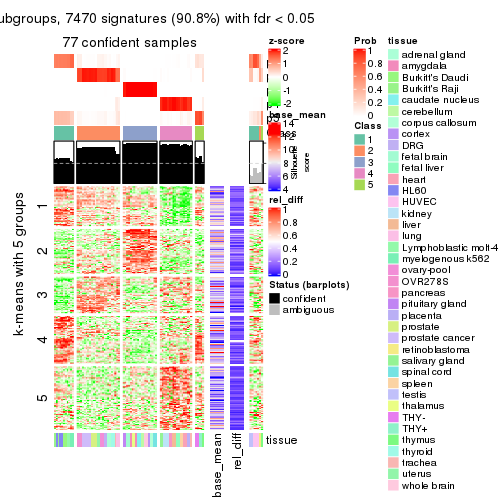</p>

</div>
<div id='tab-SD-NMF-get-signatures-5'>
<pre><code class="r">get_signatures(res, k = 6)
</code></pre>

<p></p>

</div>
</div>


Signature heatmaps where rows are not scaled:


<script>
$( function() {
	$( '#tabs-SD-NMF-get-signatures-no-scale' ).tabs();
} );
</script>
<div id='tabs-SD-NMF-get-signatures-no-scale'>
<ul>
<li><a href='#tab-SD-NMF-get-signatures-no-scale-1'>k = 2</a></li>
<li><a href='#tab-SD-NMF-get-signatures-no-scale-2'>k = 3</a></li>
<li><a href='#tab-SD-NMF-get-signatures-no-scale-3'>k = 4</a></li>
<li><a href='#tab-SD-NMF-get-signatures-no-scale-4'>k = 5</a></li>
<li><a href='#tab-SD-NMF-get-signatures-no-scale-5'>k = 6</a></li>
</ul>
<div id='tab-SD-NMF-get-signatures-no-scale-1'>
<pre><code class="r">get_signatures(res, k = 2, scale_rows = FALSE)
</code></pre>

<p></p>

</div>
<div id='tab-SD-NMF-get-signatures-no-scale-2'>
<pre><code class="r">get_signatures(res, k = 3, scale_rows = FALSE)
</code></pre>

<p></p>

</div>
<div id='tab-SD-NMF-get-signatures-no-scale-3'>
<pre><code class="r">get_signatures(res, k = 4, scale_rows = FALSE)
</code></pre>

<p></p>

</div>
<div id='tab-SD-NMF-get-signatures-no-scale-4'>
<pre><code class="r">get_signatures(res, k = 5, scale_rows = FALSE)
</code></pre>

<p></p>

</div>
<div id='tab-SD-NMF-get-signatures-no-scale-5'>
<pre><code class="r">get_signatures(res, k = 6, scale_rows = FALSE)
</code></pre>

<p>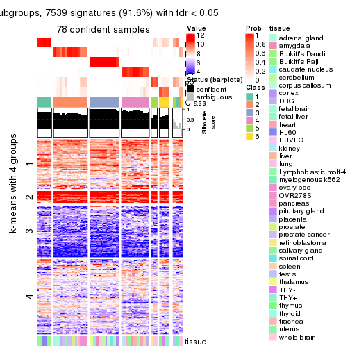</p>

</div>
</div>


Compare the overlap of signatures from different k:

```r
compare_signatures(res)
```


`get_signature()` returns a data frame invisibly. TO get the list of signatures, the function
call should be assigned to a variable explicitly. In following code, if `plot` argument is set
to `FALSE`, no heatmap is plotted while only the differential analysis is performed.

```r
# code only for demonstration
tb = get_signature(res, k = ..., plot = FALSE)
```

An example of the output of `tb` is:

```
#>   which_row         fdr    mean_1    mean_2 scaled_mean_1 scaled_mean_2 km
#> 1        38 0.042760348  8.373488  9.131774    -0.5533452     0.5164555  1
#> 2        40 0.018707592  7.106213  8.469186    -0.6173731     0.5762149  1
#> 3        55 0.019134737 10.221463 11.207825    -0.6159697     0.5749050  1
#> 4        59 0.006059896  5.921854  7.869574    -0.6899429     0.6439467  1
#> 5        60 0.018055526  8.928898 10.211722    -0.6204761     0.5791110  1
#> 6        98 0.009384629 15.714769 14.887706     0.6635654    -0.6193277  2
...
```

The columns in `tb` are:

1. `which_row`: row indices corresponding to the input matrix.
2. `fdr`: FDR for the differential test. 
3. `mean_x`: The mean value in group x.
4. `scaled_mean_x`: The mean value in group x after rows are scaled.
5. `km`: Row groups if k-means clustering is applied to rows.


UMAP plot which shows how samples are separated.


<script>
$( function() {
	$( '#tabs-SD-NMF-dimension-reduction' ).tabs();
} );
</script>
<div id='tabs-SD-NMF-dimension-reduction'>
<ul>
<li><a href='#tab-SD-NMF-dimension-reduction-1'>k = 2</a></li>
<li><a href='#tab-SD-NMF-dimension-reduction-2'>k = 3</a></li>
<li><a href='#tab-SD-NMF-dimension-reduction-3'>k = 4</a></li>
<li><a href='#tab-SD-NMF-dimension-reduction-4'>k = 5</a></li>
<li><a href='#tab-SD-NMF-dimension-reduction-5'>k = 6</a></li>
</ul>
<div id='tab-SD-NMF-dimension-reduction-1'>
<pre><code class="r">dimension_reduction(res, k = 2, method = &quot;UMAP&quot;)
</code></pre>

<p></p>

</div>
<div id='tab-SD-NMF-dimension-reduction-2'>
<pre><code class="r">dimension_reduction(res, k = 3, method = &quot;UMAP&quot;)
</code></pre>

<p></p>

</div>
<div id='tab-SD-NMF-dimension-reduction-3'>
<pre><code class="r">dimension_reduction(res, k = 4, method = &quot;UMAP&quot;)
</code></pre>

<p></p>

</div>
<div id='tab-SD-NMF-dimension-reduction-4'>
<pre><code class="r">dimension_reduction(res, k = 5, method = &quot;UMAP&quot;)
</code></pre>

<p></p>

</div>
<div id='tab-SD-NMF-dimension-reduction-5'>
<pre><code class="r">dimension_reduction(res, k = 6, method = &quot;UMAP&quot;)
</code></pre>

<p></p>

</div>
</div>


Following heatmap shows how subgroups are split when increasing `k`:

```r
collect_classes(res)
```


Test correlation between subgroups and known annotations. If the known
annotation is numeric, one-way ANOVA test is applied, and if the known
annotation is discrete, chi-squared contingency table test is applied.

```r
test_to_known_factors(res)
```

```
#>         n tissue(p) k
#> SD:NMF 79  4.66e-05 2
#> SD:NMF 77  2.99e-08 3
#> SD:NMF 81  2.10e-11 4
#> SD:NMF 77  3.38e-14 5
#> SD:NMF 78  5.97e-18 6
```


If matrix rows can be associated to genes, consider to use `GO_Enrichment(res,
...)` to perform function enrichment for the signature genes.


 

---------------------------------------------------


### CV:hclust*


The object with results only for a single top-value method and a single partition method 
can be extracted as:

```r
res = res_list["CV", "hclust"]
# you can also extract it by
# res = res_list["CV:hclust"]
```

A summary of `res` and all the functions that can be applied to it:

```r
res
```

```
#> A 'ConsensusPartition' object with k = 2, 3, 4, 5, 6.
#>   On a matrix with 8229 rows and 84 columns.
#>   Top rows (823, 1646, 2468, 3291, 4114) are extracted by 'CV' method.
#>   Subgroups are detected by 'hclust' method.
#>   Performed in total 1250 partitions by row resampling.
#>   Best k for subgroups seems to be 5.
#> 
#> Following methods can be applied to this 'ConsensusPartition' object:
#>  [1] "cola_report"             "collect_classes"         "collect_plots"          
#>  [4] "collect_stats"           "colnames"                "compare_signatures"     
#>  [7] "consensus_heatmap"       "dimension_reduction"     "functional_enrichment"  
#> [10] "get_anno_col"            "get_anno"                "get_classes"            
#> [13] "get_consensus"           "get_matrix"              "get_membership"         
#> [16] "get_param"               "get_signatures"          "get_stats"              
#> [19] "is_best_k"               "is_stable_k"             "membership_heatmap"     
#> [22] "ncol"                    "nrow"                    "plot_ecdf"              
#> [25] "rownames"                "select_partition_number" "show"                   
#> [28] "suggest_best_k"          "test_to_known_factors"
```

`collect_plots()` function collects all the plots made from `res` for all `k` (number of partitions)
into one single page to provide an easy and fast comparison between different `k`.

```r
collect_plots(res)
```


The plots are:

- The first row: a plot of the ECDF (Empirical cumulative distribution
  function) curves of the consensus matrix for each `k` and the heatmap of
  predicted classes for each `k`.
- The second row: heatmaps of the consensus matrix for each `k`.
- The third row: heatmaps of the membership matrix for each `k`.
- The fouth row: heatmaps of the signatures for each `k`.

All the plots in panels can be made by individual functions and they are
plotted later in this section.

`select_partition_number()` produces several plots showing different
statistics for choosing "optimized" `k`. There are following statistics:

- ECDF curves of the consensus matrix for each `k`;
- 1-PAC. [The PAC
  score](https://en.wikipedia.org/wiki/Consensus_clustering#Over-interpretation_potential_of_consensus_clustering)
  measures the proportion of the ambiguous subgrouping.
- Mean silhouette score.
- Concordance. The mean probability of fiting the consensus class ids in all
  partitions.
- Area increased. Denote $A_k$ as the area under the ECDF curve for current
  `k`, the area increased is defined as $A_k - A_{k-1}$.
- Rand index. The percent of pairs of samples that are both in a same cluster
  or both are not in a same cluster in the partition of k and k-1.
- Jaccard index. The ratio of pairs of samples are both in a same cluster in
  the partition of k and k-1 and the pairs of samples are both in a same
  cluster in the partition k or k-1.

The detailed explanations of these statistics can be found in [the cola
vignette](http://bioconductor.org/packages/devel/bioc/vignettes/cola/inst/doc/cola.html#toc_13).

Generally speaking, lower PAC score, higher mean silhouette score or higher
concordance corresponds to better partition. Rand index and Jaccard index
measure how similar the current partition is compared to partition with `k-1`.
If they are too similar, we won't accept `k` is better than `k-1`.

```r
select_partition_number(res)
```


The numeric values for all these statistics can be obtained by `get_stats()`.

```r
get_stats(res)
```

```
#>   k 1-PAC mean_silhouette concordance area_increased  Rand Jaccard
#> 2 2 0.405           0.359       0.691         0.3610 0.620   0.620
#> 3 3 0.640           0.832       0.829         0.5497 0.659   0.510
#> 4 4 0.938           0.963       0.972         0.2916 0.849   0.650
#> 5 5 0.903           0.897       0.926         0.0492 0.964   0.873
#> 6 6 0.870           0.887       0.910         0.0393 0.974   0.894
```

`suggest_best_k()` suggests the best $k$ based on these statistics. The rules are as follows:

- All $k$ with Jaccard index larger than 0.95 are removed because the increase of
  the partition number does not provides enough extra information. If all $k$ are removed,
  the best $k$ is assigned by `NA`.
- For $k$ with 1-PAC larger than 0.9, the maximal $k$ is taken as the "best k". Other $k$ is called "optional k".
- If it does not fit the second rule. The $k$ with the highest vote of highest
  1-PAC, mean silhouette and concordance is taken as the "best k".

```r
suggest_best_k(res)
```

```
#> [1] 5
#> attr(,"optional")
#> [1] 4
```

There is also optional best $k$ = 4 that is worth to check.

Following shows the table of the partitions (You need to click the **show/hide
code output** link to see it). The membership matrix (columns with name `p*`)
is inferred by
[`clue::cl_consensus()`](https://www.rdocumentation.org/link/cl_consensus?package=clue)
function with the `SE` method. Basically the value in the membership matrix
represents the probability to belong to a certain group. The finall class
label for an item is determined with the group with highest probability it
belongs to.

In `get_classes()` function, the entropy is calculated from the membership
matrix and the silhouette score is calculated from the consensus matrix.


<script>
$( function() {
	$( '#tabs-CV-hclust-get-classes' ).tabs();
} );
</script>
<div id='tabs-CV-hclust-get-classes'>
<ul>
<li><a href='#tab-CV-hclust-get-classes-1'>k = 2</a></li>
<li><a href='#tab-CV-hclust-get-classes-2'>k = 3</a></li>
<li><a href='#tab-CV-hclust-get-classes-3'>k = 4</a></li>
<li><a href='#tab-CV-hclust-get-classes-4'>k = 5</a></li>
<li><a href='#tab-CV-hclust-get-classes-5'>k = 6</a></li>
</ul>

<div id='tab-CV-hclust-get-classes-1'>
<p><a id='tab-CV-hclust-get-classes-1-a' style='color:#0366d6' href='#'>show/hide code output</a></p>
<pre><code class="r">cbind(get_classes(res, k = 2), get_membership(res, k = 2))
</code></pre>

<pre><code>#&gt;         class entropy silhouette    p1    p2
#&gt; GSM2819     1   0.993     -0.318 0.548 0.452
#&gt; GSM2820     2   0.978      0.384 0.412 0.588
#&gt; GSM2822     2   1.000      0.414 0.496 0.504
#&gt; GSM2832     2   1.000      0.414 0.496 0.504
#&gt; GSM2823     1   1.000     -0.425 0.508 0.492
#&gt; GSM2824     1   1.000     -0.425 0.508 0.492
#&gt; GSM2825     2   1.000      0.414 0.496 0.504
#&gt; GSM2826     2   1.000      0.414 0.496 0.504
#&gt; GSM2829     2   0.855      0.195 0.280 0.720
#&gt; GSM2856     2   0.855      0.195 0.280 0.720
#&gt; GSM2830     2   0.855      0.195 0.280 0.720
#&gt; GSM2843     2   0.855      0.195 0.280 0.720
#&gt; GSM2871     2   0.855      0.195 0.280 0.720
#&gt; GSM2831     2   0.855      0.195 0.280 0.720
#&gt; GSM2844     2   0.855      0.195 0.280 0.720
#&gt; GSM2833     2   0.855      0.195 0.280 0.720
#&gt; GSM2846     2   0.855      0.195 0.280 0.720
#&gt; GSM2835     2   0.855      0.195 0.280 0.720
#&gt; GSM2858     2   0.855      0.195 0.280 0.720
#&gt; GSM2836     2   1.000      0.414 0.496 0.504
#&gt; GSM2848     2   1.000      0.414 0.496 0.504
#&gt; GSM2828     2   0.978      0.384 0.412 0.588
#&gt; GSM2837     2   0.978      0.384 0.412 0.588
#&gt; GSM2839     1   0.000      0.725 1.000 0.000
#&gt; GSM2841     1   0.000      0.725 1.000 0.000
#&gt; GSM2827     2   1.000      0.414 0.496 0.504
#&gt; GSM2842     2   1.000      0.414 0.496 0.504
#&gt; GSM2845     2   0.855      0.195 0.280 0.720
#&gt; GSM2872     2   0.855      0.195 0.280 0.720
#&gt; GSM2834     2   0.855      0.195 0.280 0.720
#&gt; GSM2847     2   0.855      0.195 0.280 0.720
#&gt; GSM2849     2   0.978      0.384 0.412 0.588
#&gt; GSM2850     2   0.978      0.384 0.412 0.588
#&gt; GSM2838     2   1.000      0.414 0.496 0.504
#&gt; GSM2853     2   1.000      0.414 0.496 0.504
#&gt; GSM2852     2   0.998      0.405 0.472 0.528
#&gt; GSM2855     2   0.998      0.405 0.472 0.528
#&gt; GSM2840     1   0.000      0.725 1.000 0.000
#&gt; GSM2857     1   0.000      0.725 1.000 0.000
#&gt; GSM2859     2   1.000      0.414 0.496 0.504
#&gt; GSM2860     2   1.000      0.414 0.496 0.504
#&gt; GSM2861     2   1.000      0.414 0.496 0.504
#&gt; GSM2862     2   1.000      0.414 0.496 0.504
#&gt; GSM2863     2   1.000      0.414 0.496 0.504
#&gt; GSM2864     2   1.000      0.414 0.496 0.504
#&gt; GSM2865     2   1.000      0.414 0.496 0.504
#&gt; GSM2866     2   1.000      0.414 0.496 0.504
#&gt; GSM2868     2   1.000      0.414 0.496 0.504
#&gt; GSM2869     2   1.000      0.414 0.496 0.504
#&gt; GSM2851     2   1.000      0.414 0.496 0.504
#&gt; GSM2867     2   1.000      0.414 0.496 0.504
#&gt; GSM2870     2   1.000      0.414 0.496 0.504
#&gt; GSM2854     2   0.886      0.184 0.304 0.696
#&gt; GSM2873     2   0.886      0.184 0.304 0.696
#&gt; GSM2874     2   0.978      0.384 0.412 0.588
#&gt; GSM2884     2   0.978      0.384 0.412 0.588
#&gt; GSM2875     1   0.000      0.725 1.000 0.000
#&gt; GSM2890     1   0.000      0.725 1.000 0.000
#&gt; GSM2877     1   0.000      0.725 1.000 0.000
#&gt; GSM2892     1   0.000      0.725 1.000 0.000
#&gt; GSM2902     1   0.000      0.725 1.000 0.000
#&gt; GSM2878     1   0.000      0.725 1.000 0.000
#&gt; GSM2901     1   0.000      0.725 1.000 0.000
#&gt; GSM2879     2   1.000      0.414 0.496 0.504
#&gt; GSM2898     2   1.000      0.414 0.496 0.504
#&gt; GSM2881     2   0.978      0.384 0.412 0.588
#&gt; GSM2897     2   0.978      0.384 0.412 0.588
#&gt; GSM2882     2   0.855      0.195 0.280 0.720
#&gt; GSM2894     2   0.855      0.195 0.280 0.720
#&gt; GSM2883     2   0.978      0.384 0.412 0.588
#&gt; GSM2895     2   0.978      0.384 0.412 0.588
#&gt; GSM2885     2   0.978      0.384 0.412 0.588
#&gt; GSM2886     2   0.978      0.384 0.412 0.588
#&gt; GSM2887     2   0.978      0.384 0.412 0.588
#&gt; GSM2896     2   0.978      0.384 0.412 0.588
#&gt; GSM2888     2   1.000      0.414 0.496 0.504
#&gt; GSM2889     2   1.000      0.414 0.496 0.504
#&gt; GSM2876     1   0.000      0.725 1.000 0.000
#&gt; GSM2891     1   0.000      0.725 1.000 0.000
#&gt; GSM2880     1   0.000      0.725 1.000 0.000
#&gt; GSM2893     1   0.000      0.725 1.000 0.000
#&gt; GSM2821     1   0.993     -0.318 0.548 0.452
#&gt; GSM2900     1   0.993     -0.318 0.548 0.452
#&gt; GSM2903     1   0.993     -0.318 0.548 0.452
</code></pre>

<script>
$('#tab-CV-hclust-get-classes-1-a').parent().next().next().hide();
$('#tab-CV-hclust-get-classes-1-a').click(function(){
  $('#tab-CV-hclust-get-classes-1-a').parent().next().next().toggle();
  return(false);
});
</script>
</div>

<div id='tab-CV-hclust-get-classes-2'>
<p><a id='tab-CV-hclust-get-classes-2-a' style='color:#0366d6' href='#'>show/hide code output</a></p>
<pre><code class="r">cbind(get_classes(res, k = 3), get_membership(res, k = 3))
</code></pre>

<pre><code>#&gt;         class entropy silhouette    p1    p2    p3
#&gt; GSM2819     3  0.2448      0.730 0.076 0.000 0.924
#&gt; GSM2820     3  0.6126      0.621 0.000 0.400 0.600
#&gt; GSM2822     3  0.0000      0.776 0.000 0.000 1.000
#&gt; GSM2832     3  0.0000      0.776 0.000 0.000 1.000
#&gt; GSM2823     3  0.1411      0.749 0.036 0.000 0.964
#&gt; GSM2824     3  0.1411      0.749 0.036 0.000 0.964
#&gt; GSM2825     3  0.0000      0.776 0.000 0.000 1.000
#&gt; GSM2826     3  0.0000      0.776 0.000 0.000 1.000
#&gt; GSM2829     2  0.6126      0.996 0.000 0.600 0.400
#&gt; GSM2856     2  0.6126      0.996 0.000 0.600 0.400
#&gt; GSM2830     2  0.6126      0.996 0.000 0.600 0.400
#&gt; GSM2843     2  0.6126      0.996 0.000 0.600 0.400
#&gt; GSM2871     2  0.6126      0.996 0.000 0.600 0.400
#&gt; GSM2831     2  0.6126      0.996 0.000 0.600 0.400
#&gt; GSM2844     2  0.6126      0.996 0.000 0.600 0.400
#&gt; GSM2833     2  0.6126      0.996 0.000 0.600 0.400
#&gt; GSM2846     2  0.6126      0.996 0.000 0.600 0.400
#&gt; GSM2835     2  0.6126      0.996 0.000 0.600 0.400
#&gt; GSM2858     2  0.6126      0.996 0.000 0.600 0.400
#&gt; GSM2836     3  0.0000      0.776 0.000 0.000 1.000
#&gt; GSM2848     3  0.0000      0.776 0.000 0.000 1.000
#&gt; GSM2828     3  0.6126      0.621 0.000 0.400 0.600
#&gt; GSM2837     3  0.6126      0.621 0.000 0.400 0.600
#&gt; GSM2839     1  0.0000      0.996 1.000 0.000 0.000
#&gt; GSM2841     1  0.0000      0.996 1.000 0.000 0.000
#&gt; GSM2827     3  0.0000      0.776 0.000 0.000 1.000
#&gt; GSM2842     3  0.0000      0.776 0.000 0.000 1.000
#&gt; GSM2845     2  0.6126      0.996 0.000 0.600 0.400
#&gt; GSM2872     2  0.6126      0.996 0.000 0.600 0.400
#&gt; GSM2834     2  0.6126      0.996 0.000 0.600 0.400
#&gt; GSM2847     2  0.6126      0.996 0.000 0.600 0.400
#&gt; GSM2849     3  0.6126      0.621 0.000 0.400 0.600
#&gt; GSM2850     3  0.6126      0.621 0.000 0.400 0.600
#&gt; GSM2838     3  0.0000      0.776 0.000 0.000 1.000
#&gt; GSM2853     3  0.0000      0.776 0.000 0.000 1.000
#&gt; GSM2852     3  0.3752      0.720 0.000 0.144 0.856
#&gt; GSM2855     3  0.3752      0.720 0.000 0.144 0.856
#&gt; GSM2840     1  0.0000      0.996 1.000 0.000 0.000
#&gt; GSM2857     1  0.0000      0.996 1.000 0.000 0.000
#&gt; GSM2859     3  0.0000      0.776 0.000 0.000 1.000
#&gt; GSM2860     3  0.0000      0.776 0.000 0.000 1.000
#&gt; GSM2861     3  0.0000      0.776 0.000 0.000 1.000
#&gt; GSM2862     3  0.0000      0.776 0.000 0.000 1.000
#&gt; GSM2863     3  0.0000      0.776 0.000 0.000 1.000
#&gt; GSM2864     3  0.0000      0.776 0.000 0.000 1.000
#&gt; GSM2865     3  0.0000      0.776 0.000 0.000 1.000
#&gt; GSM2866     3  0.0000      0.776 0.000 0.000 1.000
#&gt; GSM2868     3  0.0000      0.776 0.000 0.000 1.000
#&gt; GSM2869     3  0.0000      0.776 0.000 0.000 1.000
#&gt; GSM2851     3  0.0000      0.776 0.000 0.000 1.000
#&gt; GSM2867     3  0.0000      0.776 0.000 0.000 1.000
#&gt; GSM2870     3  0.0000      0.776 0.000 0.000 1.000
#&gt; GSM2854     2  0.6204      0.963 0.000 0.576 0.424
#&gt; GSM2873     2  0.6204      0.963 0.000 0.576 0.424
#&gt; GSM2874     3  0.6126      0.621 0.000 0.400 0.600
#&gt; GSM2884     3  0.6126      0.621 0.000 0.400 0.600
#&gt; GSM2875     1  0.0000      0.996 1.000 0.000 0.000
#&gt; GSM2890     1  0.0000      0.996 1.000 0.000 0.000
#&gt; GSM2877     1  0.0000      0.996 1.000 0.000 0.000
#&gt; GSM2892     1  0.0000      0.996 1.000 0.000 0.000
#&gt; GSM2902     1  0.0000      0.996 1.000 0.000 0.000
#&gt; GSM2878     1  0.0000      0.996 1.000 0.000 0.000
#&gt; GSM2901     1  0.0000      0.996 1.000 0.000 0.000
#&gt; GSM2879     3  0.0000      0.776 0.000 0.000 1.000
#&gt; GSM2898     3  0.0000      0.776 0.000 0.000 1.000
#&gt; GSM2881     3  0.6126      0.621 0.000 0.400 0.600
#&gt; GSM2897     3  0.6126      0.621 0.000 0.400 0.600
#&gt; GSM2882     2  0.6126      0.996 0.000 0.600 0.400
#&gt; GSM2894     2  0.6126      0.996 0.000 0.600 0.400
#&gt; GSM2883     3  0.6126      0.621 0.000 0.400 0.600
#&gt; GSM2895     3  0.6126      0.621 0.000 0.400 0.600
#&gt; GSM2885     3  0.6126      0.621 0.000 0.400 0.600
#&gt; GSM2886     3  0.6126      0.621 0.000 0.400 0.600
#&gt; GSM2887     3  0.6126      0.621 0.000 0.400 0.600
#&gt; GSM2896     3  0.6126      0.621 0.000 0.400 0.600
#&gt; GSM2888     3  0.0000      0.776 0.000 0.000 1.000
#&gt; GSM2889     3  0.0000      0.776 0.000 0.000 1.000
#&gt; GSM2876     1  0.0892      0.976 0.980 0.000 0.020
#&gt; GSM2891     1  0.0892      0.976 0.980 0.000 0.020
#&gt; GSM2880     1  0.0000      0.996 1.000 0.000 0.000
#&gt; GSM2893     1  0.0000      0.996 1.000 0.000 0.000
#&gt; GSM2821     3  0.2448      0.730 0.076 0.000 0.924
#&gt; GSM2900     3  0.2448      0.730 0.076 0.000 0.924
#&gt; GSM2903     3  0.2448      0.730 0.076 0.000 0.924
</code></pre>

<script>
$('#tab-CV-hclust-get-classes-2-a').parent().next().next().hide();
$('#tab-CV-hclust-get-classes-2-a').click(function(){
  $('#tab-CV-hclust-get-classes-2-a').parent().next().next().toggle();
  return(false);
});
</script>
</div>

<div id='tab-CV-hclust-get-classes-3'>
<p><a id='tab-CV-hclust-get-classes-3-a' style='color:#0366d6' href='#'>show/hide code output</a></p>
<pre><code class="r">cbind(get_classes(res, k = 4), get_membership(res, k = 4))
</code></pre>

<pre><code>#&gt;         class entropy silhouette    p1    p2    p3    p4
#&gt; GSM2819     2  0.3621      0.881 0.072 0.860 0.000 0.068
#&gt; GSM2820     3  0.0000      1.000 0.000 0.000 1.000 0.000
#&gt; GSM2822     2  0.3356      0.824 0.000 0.824 0.000 0.176
#&gt; GSM2832     2  0.3356      0.824 0.000 0.824 0.000 0.176
#&gt; GSM2823     2  0.1305      0.934 0.036 0.960 0.000 0.004
#&gt; GSM2824     2  0.1305      0.934 0.036 0.960 0.000 0.004
#&gt; GSM2825     2  0.3356      0.824 0.000 0.824 0.000 0.176
#&gt; GSM2826     2  0.3356      0.824 0.000 0.824 0.000 0.176
#&gt; GSM2829     4  0.0592      0.990 0.000 0.016 0.000 0.984
#&gt; GSM2856     4  0.0592      0.990 0.000 0.016 0.000 0.984
#&gt; GSM2830     4  0.0707      0.989 0.000 0.020 0.000 0.980
#&gt; GSM2843     4  0.0707      0.989 0.000 0.020 0.000 0.980
#&gt; GSM2871     4  0.0707      0.989 0.000 0.020 0.000 0.980
#&gt; GSM2831     4  0.0592      0.990 0.000 0.016 0.000 0.984
#&gt; GSM2844     4  0.0592      0.990 0.000 0.016 0.000 0.984
#&gt; GSM2833     4  0.0592      0.990 0.000 0.016 0.000 0.984
#&gt; GSM2846     4  0.0592      0.990 0.000 0.016 0.000 0.984
#&gt; GSM2835     4  0.0592      0.990 0.000 0.016 0.000 0.984
#&gt; GSM2858     4  0.0592      0.990 0.000 0.016 0.000 0.984
#&gt; GSM2836     2  0.0188      0.952 0.000 0.996 0.000 0.004
#&gt; GSM2848     2  0.0188      0.952 0.000 0.996 0.000 0.004
#&gt; GSM2828     3  0.0000      1.000 0.000 0.000 1.000 0.000
#&gt; GSM2837     3  0.0000      1.000 0.000 0.000 1.000 0.000
#&gt; GSM2839     1  0.0000      0.996 1.000 0.000 0.000 0.000
#&gt; GSM2841     1  0.0000      0.996 1.000 0.000 0.000 0.000
#&gt; GSM2827     2  0.0188      0.952 0.000 0.996 0.000 0.004
#&gt; GSM2842     2  0.0188      0.952 0.000 0.996 0.000 0.004
#&gt; GSM2845     4  0.0707      0.989 0.000 0.020 0.000 0.980
#&gt; GSM2872     4  0.0707      0.989 0.000 0.020 0.000 0.980
#&gt; GSM2834     4  0.0817      0.986 0.000 0.024 0.000 0.976
#&gt; GSM2847     4  0.0817      0.986 0.000 0.024 0.000 0.976
#&gt; GSM2849     3  0.0000      1.000 0.000 0.000 1.000 0.000
#&gt; GSM2850     3  0.0000      1.000 0.000 0.000 1.000 0.000
#&gt; GSM2838     2  0.0188      0.953 0.000 0.996 0.000 0.004
#&gt; GSM2853     2  0.0188      0.953 0.000 0.996 0.000 0.004
#&gt; GSM2852     2  0.2973      0.840 0.000 0.856 0.144 0.000
#&gt; GSM2855     2  0.2973      0.840 0.000 0.856 0.144 0.000
#&gt; GSM2840     1  0.0000      0.996 1.000 0.000 0.000 0.000
#&gt; GSM2857     1  0.0000      0.996 1.000 0.000 0.000 0.000
#&gt; GSM2859     2  0.0188      0.953 0.000 0.996 0.000 0.004
#&gt; GSM2860     2  0.0188      0.953 0.000 0.996 0.000 0.004
#&gt; GSM2861     2  0.0188      0.953 0.000 0.996 0.000 0.004
#&gt; GSM2862     2  0.0188      0.953 0.000 0.996 0.000 0.004
#&gt; GSM2863     2  0.0188      0.953 0.000 0.996 0.000 0.004
#&gt; GSM2864     2  0.0188      0.953 0.000 0.996 0.000 0.004
#&gt; GSM2865     2  0.0188      0.953 0.000 0.996 0.000 0.004
#&gt; GSM2866     2  0.0188      0.953 0.000 0.996 0.000 0.004
#&gt; GSM2868     2  0.0000      0.952 0.000 1.000 0.000 0.000
#&gt; GSM2869     2  0.0000      0.952 0.000 1.000 0.000 0.000
#&gt; GSM2851     2  0.0188      0.953 0.000 0.996 0.000 0.004
#&gt; GSM2867     2  0.0000      0.952 0.000 1.000 0.000 0.000
#&gt; GSM2870     2  0.0188      0.953 0.000 0.996 0.000 0.004
#&gt; GSM2854     4  0.1940      0.933 0.000 0.076 0.000 0.924
#&gt; GSM2873     4  0.1940      0.933 0.000 0.076 0.000 0.924
#&gt; GSM2874     3  0.0000      1.000 0.000 0.000 1.000 0.000
#&gt; GSM2884     3  0.0000      1.000 0.000 0.000 1.000 0.000
#&gt; GSM2875     1  0.0000      0.996 1.000 0.000 0.000 0.000
#&gt; GSM2890     1  0.0000      0.996 1.000 0.000 0.000 0.000
#&gt; GSM2877     1  0.0000      0.996 1.000 0.000 0.000 0.000
#&gt; GSM2892     1  0.0000      0.996 1.000 0.000 0.000 0.000
#&gt; GSM2902     1  0.0000      0.996 1.000 0.000 0.000 0.000
#&gt; GSM2878     1  0.0000      0.996 1.000 0.000 0.000 0.000
#&gt; GSM2901     1  0.0000      0.996 1.000 0.000 0.000 0.000
#&gt; GSM2879     2  0.0376      0.951 0.000 0.992 0.004 0.004
#&gt; GSM2898     2  0.0376      0.951 0.000 0.992 0.004 0.004
#&gt; GSM2881     3  0.0000      1.000 0.000 0.000 1.000 0.000
#&gt; GSM2897     3  0.0000      1.000 0.000 0.000 1.000 0.000
#&gt; GSM2882     4  0.0592      0.990 0.000 0.016 0.000 0.984
#&gt; GSM2894     4  0.0592      0.990 0.000 0.016 0.000 0.984
#&gt; GSM2883     3  0.0000      1.000 0.000 0.000 1.000 0.000
#&gt; GSM2895     3  0.0000      1.000 0.000 0.000 1.000 0.000
#&gt; GSM2885     3  0.0000      1.000 0.000 0.000 1.000 0.000
#&gt; GSM2886     3  0.0000      1.000 0.000 0.000 1.000 0.000
#&gt; GSM2887     3  0.0000      1.000 0.000 0.000 1.000 0.000
#&gt; GSM2896     3  0.0000      1.000 0.000 0.000 1.000 0.000
#&gt; GSM2888     2  0.0188      0.953 0.000 0.996 0.000 0.004
#&gt; GSM2889     2  0.0188      0.953 0.000 0.996 0.000 0.004
#&gt; GSM2876     1  0.0707      0.976 0.980 0.020 0.000 0.000
#&gt; GSM2891     1  0.0707      0.976 0.980 0.020 0.000 0.000
#&gt; GSM2880     1  0.0000      0.996 1.000 0.000 0.000 0.000
#&gt; GSM2893     1  0.0000      0.996 1.000 0.000 0.000 0.000
#&gt; GSM2821     2  0.3621      0.881 0.072 0.860 0.000 0.068
#&gt; GSM2900     2  0.3621      0.881 0.072 0.860 0.000 0.068
#&gt; GSM2903     2  0.3621      0.881 0.072 0.860 0.000 0.068
</code></pre>

<script>
$('#tab-CV-hclust-get-classes-3-a').parent().next().next().hide();
$('#tab-CV-hclust-get-classes-3-a').click(function(){
  $('#tab-CV-hclust-get-classes-3-a').parent().next().next().toggle();
  return(false);
});
</script>
</div>

<div id='tab-CV-hclust-get-classes-4'>
<p><a id='tab-CV-hclust-get-classes-4-a' style='color:#0366d6' href='#'>show/hide code output</a></p>
<pre><code class="r">cbind(get_classes(res, k = 5), get_membership(res, k = 5))
</code></pre>

<pre><code>#&gt;         class entropy silhouette    p1    p2    p3    p4    p5
#&gt; GSM2819     5  0.3949      1.000 0.000 0.332 0.000 0.000 0.668
#&gt; GSM2820     3  0.0000      1.000 0.000 0.000 1.000 0.000 0.000
#&gt; GSM2822     2  0.4395      0.511 0.000 0.748 0.000 0.188 0.064
#&gt; GSM2832     2  0.4395      0.511 0.000 0.748 0.000 0.188 0.064
#&gt; GSM2823     2  0.2124      0.800 0.000 0.900 0.000 0.004 0.096
#&gt; GSM2824     2  0.2124      0.800 0.000 0.900 0.000 0.004 0.096
#&gt; GSM2825     2  0.4395      0.511 0.000 0.748 0.000 0.188 0.064
#&gt; GSM2826     2  0.4395      0.511 0.000 0.748 0.000 0.188 0.064
#&gt; GSM2829     4  0.0000      0.843 0.000 0.000 0.000 1.000 0.000
#&gt; GSM2856     4  0.0000      0.843 0.000 0.000 0.000 1.000 0.000
#&gt; GSM2830     4  0.4288      0.817 0.000 0.012 0.000 0.664 0.324
#&gt; GSM2843     4  0.4288      0.817 0.000 0.012 0.000 0.664 0.324
#&gt; GSM2871     4  0.4288      0.817 0.000 0.012 0.000 0.664 0.324
#&gt; GSM2831     4  0.0609      0.842 0.000 0.000 0.000 0.980 0.020
#&gt; GSM2844     4  0.0609      0.842 0.000 0.000 0.000 0.980 0.020
#&gt; GSM2833     4  0.0000      0.843 0.000 0.000 0.000 1.000 0.000
#&gt; GSM2846     4  0.0000      0.843 0.000 0.000 0.000 1.000 0.000
#&gt; GSM2835     4  0.0000      0.843 0.000 0.000 0.000 1.000 0.000
#&gt; GSM2858     4  0.0000      0.843 0.000 0.000 0.000 1.000 0.000
#&gt; GSM2836     2  0.0566      0.905 0.000 0.984 0.000 0.004 0.012
#&gt; GSM2848     2  0.0566      0.905 0.000 0.984 0.000 0.004 0.012
#&gt; GSM2828     3  0.0000      1.000 0.000 0.000 1.000 0.000 0.000
#&gt; GSM2837     3  0.0000      1.000 0.000 0.000 1.000 0.000 0.000
#&gt; GSM2839     1  0.0000      0.991 1.000 0.000 0.000 0.000 0.000
#&gt; GSM2841     1  0.0000      0.991 1.000 0.000 0.000 0.000 0.000
#&gt; GSM2827     2  0.0566      0.905 0.000 0.984 0.000 0.004 0.012
#&gt; GSM2842     2  0.0566      0.905 0.000 0.984 0.000 0.004 0.012
#&gt; GSM2845     4  0.4288      0.817 0.000 0.012 0.000 0.664 0.324
#&gt; GSM2872     4  0.4288      0.817 0.000 0.012 0.000 0.664 0.324
#&gt; GSM2834     4  0.4290      0.815 0.000 0.016 0.000 0.680 0.304
#&gt; GSM2847     4  0.4290      0.815 0.000 0.016 0.000 0.680 0.304
#&gt; GSM2849     3  0.0000      1.000 0.000 0.000 1.000 0.000 0.000
#&gt; GSM2850     3  0.0000      1.000 0.000 0.000 1.000 0.000 0.000
#&gt; GSM2838     2  0.0000      0.909 0.000 1.000 0.000 0.000 0.000
#&gt; GSM2853     2  0.0000      0.909 0.000 1.000 0.000 0.000 0.000
#&gt; GSM2852     2  0.2561      0.701 0.000 0.856 0.144 0.000 0.000
#&gt; GSM2855     2  0.2561      0.701 0.000 0.856 0.144 0.000 0.000
#&gt; GSM2840     1  0.0000      0.991 1.000 0.000 0.000 0.000 0.000
#&gt; GSM2857     1  0.0000      0.991 1.000 0.000 0.000 0.000 0.000
#&gt; GSM2859     2  0.0000      0.909 0.000 1.000 0.000 0.000 0.000
#&gt; GSM2860     2  0.0000      0.909 0.000 1.000 0.000 0.000 0.000
#&gt; GSM2861     2  0.0000      0.909 0.000 1.000 0.000 0.000 0.000
#&gt; GSM2862     2  0.0000      0.909 0.000 1.000 0.000 0.000 0.000
#&gt; GSM2863     2  0.0000      0.909 0.000 1.000 0.000 0.000 0.000
#&gt; GSM2864     2  0.0000      0.909 0.000 1.000 0.000 0.000 0.000
#&gt; GSM2865     2  0.0000      0.909 0.000 1.000 0.000 0.000 0.000
#&gt; GSM2866     2  0.0000      0.909 0.000 1.000 0.000 0.000 0.000
#&gt; GSM2868     2  0.0404      0.905 0.000 0.988 0.000 0.000 0.012
#&gt; GSM2869     2  0.0404      0.905 0.000 0.988 0.000 0.000 0.012
#&gt; GSM2851     2  0.0000      0.909 0.000 1.000 0.000 0.000 0.000
#&gt; GSM2867     2  0.0404      0.905 0.000 0.988 0.000 0.000 0.012
#&gt; GSM2870     2  0.0000      0.909 0.000 1.000 0.000 0.000 0.000
#&gt; GSM2854     4  0.5126      0.774 0.000 0.064 0.000 0.636 0.300
#&gt; GSM2873     4  0.5126      0.774 0.000 0.064 0.000 0.636 0.300
#&gt; GSM2874     3  0.0000      1.000 0.000 0.000 1.000 0.000 0.000
#&gt; GSM2884     3  0.0000      1.000 0.000 0.000 1.000 0.000 0.000
#&gt; GSM2875     1  0.0000      0.991 1.000 0.000 0.000 0.000 0.000
#&gt; GSM2890     1  0.0000      0.991 1.000 0.000 0.000 0.000 0.000
#&gt; GSM2877     1  0.0000      0.991 1.000 0.000 0.000 0.000 0.000
#&gt; GSM2892     1  0.0000      0.991 1.000 0.000 0.000 0.000 0.000
#&gt; GSM2902     1  0.0000      0.991 1.000 0.000 0.000 0.000 0.000
#&gt; GSM2878     1  0.0000      0.991 1.000 0.000 0.000 0.000 0.000
#&gt; GSM2901     1  0.0000      0.991 1.000 0.000 0.000 0.000 0.000
#&gt; GSM2879     2  0.0727      0.903 0.000 0.980 0.004 0.004 0.012
#&gt; GSM2898     2  0.0727      0.903 0.000 0.980 0.004 0.004 0.012
#&gt; GSM2881     3  0.0000      1.000 0.000 0.000 1.000 0.000 0.000
#&gt; GSM2897     3  0.0000      1.000 0.000 0.000 1.000 0.000 0.000
#&gt; GSM2882     4  0.0609      0.842 0.000 0.000 0.000 0.980 0.020
#&gt; GSM2894     4  0.0609      0.842 0.000 0.000 0.000 0.980 0.020
#&gt; GSM2883     3  0.0000      1.000 0.000 0.000 1.000 0.000 0.000
#&gt; GSM2895     3  0.0000      1.000 0.000 0.000 1.000 0.000 0.000
#&gt; GSM2885     3  0.0000      1.000 0.000 0.000 1.000 0.000 0.000
#&gt; GSM2886     3  0.0000      1.000 0.000 0.000 1.000 0.000 0.000
#&gt; GSM2887     3  0.0000      1.000 0.000 0.000 1.000 0.000 0.000
#&gt; GSM2896     3  0.0000      1.000 0.000 0.000 1.000 0.000 0.000
#&gt; GSM2888     2  0.0000      0.909 0.000 1.000 0.000 0.000 0.000
#&gt; GSM2889     2  0.0000      0.909 0.000 1.000 0.000 0.000 0.000
#&gt; GSM2876     1  0.1478      0.940 0.936 0.000 0.000 0.000 0.064
#&gt; GSM2891     1  0.1478      0.940 0.936 0.000 0.000 0.000 0.064
#&gt; GSM2880     1  0.0000      0.991 1.000 0.000 0.000 0.000 0.000
#&gt; GSM2893     1  0.0000      0.991 1.000 0.000 0.000 0.000 0.000
#&gt; GSM2821     5  0.3949      1.000 0.000 0.332 0.000 0.000 0.668
#&gt; GSM2900     5  0.3949      1.000 0.000 0.332 0.000 0.000 0.668
#&gt; GSM2903     5  0.3949      1.000 0.000 0.332 0.000 0.000 0.668
</code></pre>

<script>
$('#tab-CV-hclust-get-classes-4-a').parent().next().next().hide();
$('#tab-CV-hclust-get-classes-4-a').click(function(){
  $('#tab-CV-hclust-get-classes-4-a').parent().next().next().toggle();
  return(false);
});
</script>
</div>

<div id='tab-CV-hclust-get-classes-5'>
<p><a id='tab-CV-hclust-get-classes-5-a' style='color:#0366d6' href='#'>show/hide code output</a></p>
<pre><code class="r">cbind(get_classes(res, k = 6), get_membership(res, k = 6))
</code></pre>

<pre><code>#&gt;         class entropy silhouette    p1    p2    p3    p4    p5    p6
#&gt; GSM2819     5  0.2260      1.000 0.000 0.140 0.000 0.000 0.860 0.000
#&gt; GSM2820     3  0.0000      1.000 0.000 0.000 1.000 0.000 0.000 0.000
#&gt; GSM2822     2  0.5709      0.396 0.000 0.584 0.000 0.152 0.020 0.244
#&gt; GSM2832     2  0.5709      0.396 0.000 0.584 0.000 0.152 0.020 0.244
#&gt; GSM2823     2  0.3168      0.705 0.000 0.804 0.000 0.000 0.172 0.024
#&gt; GSM2824     2  0.3168      0.705 0.000 0.804 0.000 0.000 0.172 0.024
#&gt; GSM2825     2  0.5709      0.396 0.000 0.584 0.000 0.152 0.020 0.244
#&gt; GSM2826     2  0.5709      0.396 0.000 0.584 0.000 0.152 0.020 0.244
#&gt; GSM2829     4  0.0000      0.901 0.000 0.000 0.000 1.000 0.000 0.000
#&gt; GSM2856     4  0.0000      0.901 0.000 0.000 0.000 1.000 0.000 0.000
#&gt; GSM2830     6  0.3244      0.885 0.000 0.000 0.000 0.268 0.000 0.732
#&gt; GSM2843     6  0.3244      0.885 0.000 0.000 0.000 0.268 0.000 0.732
#&gt; GSM2871     6  0.3244      0.885 0.000 0.000 0.000 0.268 0.000 0.732
#&gt; GSM2831     4  0.2219      0.843 0.000 0.000 0.000 0.864 0.000 0.136
#&gt; GSM2844     4  0.2219      0.843 0.000 0.000 0.000 0.864 0.000 0.136
#&gt; GSM2833     4  0.0000      0.901 0.000 0.000 0.000 1.000 0.000 0.000
#&gt; GSM2846     4  0.0000      0.901 0.000 0.000 0.000 1.000 0.000 0.000
#&gt; GSM2835     4  0.0000      0.901 0.000 0.000 0.000 1.000 0.000 0.000
#&gt; GSM2858     4  0.0000      0.901 0.000 0.000 0.000 1.000 0.000 0.000
#&gt; GSM2836     2  0.0777      0.890 0.000 0.972 0.000 0.000 0.004 0.024
#&gt; GSM2848     2  0.0777      0.890 0.000 0.972 0.000 0.000 0.004 0.024
#&gt; GSM2828     3  0.0000      1.000 0.000 0.000 1.000 0.000 0.000 0.000
#&gt; GSM2837     3  0.0000      1.000 0.000 0.000 1.000 0.000 0.000 0.000
#&gt; GSM2839     1  0.2531      0.891 0.856 0.000 0.000 0.000 0.132 0.012
#&gt; GSM2841     1  0.2531      0.891 0.856 0.000 0.000 0.000 0.132 0.012
#&gt; GSM2827     2  0.0777      0.890 0.000 0.972 0.000 0.000 0.004 0.024
#&gt; GSM2842     2  0.0777      0.890 0.000 0.972 0.000 0.000 0.004 0.024
#&gt; GSM2845     6  0.3244      0.885 0.000 0.000 0.000 0.268 0.000 0.732
#&gt; GSM2872     6  0.3244      0.885 0.000 0.000 0.000 0.268 0.000 0.732
#&gt; GSM2834     6  0.3830      0.846 0.000 0.004 0.000 0.376 0.000 0.620
#&gt; GSM2847     6  0.3830      0.846 0.000 0.004 0.000 0.376 0.000 0.620
#&gt; GSM2849     3  0.0000      1.000 0.000 0.000 1.000 0.000 0.000 0.000
#&gt; GSM2850     3  0.0000      1.000 0.000 0.000 1.000 0.000 0.000 0.000
#&gt; GSM2838     2  0.0146      0.895 0.000 0.996 0.000 0.000 0.000 0.004
#&gt; GSM2853     2  0.0146      0.895 0.000 0.996 0.000 0.000 0.000 0.004
#&gt; GSM2852     2  0.2300      0.758 0.000 0.856 0.144 0.000 0.000 0.000
#&gt; GSM2855     2  0.2300      0.758 0.000 0.856 0.144 0.000 0.000 0.000
#&gt; GSM2840     1  0.2531      0.891 0.856 0.000 0.000 0.000 0.132 0.012
#&gt; GSM2857     1  0.2531      0.891 0.856 0.000 0.000 0.000 0.132 0.012
#&gt; GSM2859     2  0.0260      0.895 0.000 0.992 0.000 0.000 0.000 0.008
#&gt; GSM2860     2  0.0260      0.895 0.000 0.992 0.000 0.000 0.000 0.008
#&gt; GSM2861     2  0.0260      0.895 0.000 0.992 0.000 0.000 0.000 0.008
#&gt; GSM2862     2  0.0260      0.895 0.000 0.992 0.000 0.000 0.000 0.008
#&gt; GSM2863     2  0.0260      0.895 0.000 0.992 0.000 0.000 0.000 0.008
#&gt; GSM2864     2  0.0260      0.895 0.000 0.992 0.000 0.000 0.000 0.008
#&gt; GSM2865     2  0.0260      0.895 0.000 0.992 0.000 0.000 0.000 0.008
#&gt; GSM2866     2  0.0260      0.895 0.000 0.992 0.000 0.000 0.000 0.008
#&gt; GSM2868     2  0.0717      0.890 0.000 0.976 0.000 0.000 0.008 0.016
#&gt; GSM2869     2  0.0717      0.890 0.000 0.976 0.000 0.000 0.008 0.016
#&gt; GSM2851     2  0.0000      0.895 0.000 1.000 0.000 0.000 0.000 0.000
#&gt; GSM2867     2  0.0717      0.890 0.000 0.976 0.000 0.000 0.008 0.016
#&gt; GSM2870     2  0.0000      0.895 0.000 1.000 0.000 0.000 0.000 0.000
#&gt; GSM2854     6  0.4444      0.793 0.000 0.024 0.000 0.356 0.008 0.612
#&gt; GSM2873     6  0.4444      0.793 0.000 0.024 0.000 0.356 0.008 0.612
#&gt; GSM2874     3  0.0000      1.000 0.000 0.000 1.000 0.000 0.000 0.000
#&gt; GSM2884     3  0.0000      1.000 0.000 0.000 1.000 0.000 0.000 0.000
#&gt; GSM2875     1  0.0000      0.953 1.000 0.000 0.000 0.000 0.000 0.000
#&gt; GSM2890     1  0.0000      0.953 1.000 0.000 0.000 0.000 0.000 0.000
#&gt; GSM2877     1  0.0000      0.953 1.000 0.000 0.000 0.000 0.000 0.000
#&gt; GSM2892     1  0.0000      0.953 1.000 0.000 0.000 0.000 0.000 0.000
#&gt; GSM2902     1  0.0000      0.953 1.000 0.000 0.000 0.000 0.000 0.000
#&gt; GSM2878     1  0.0000      0.953 1.000 0.000 0.000 0.000 0.000 0.000
#&gt; GSM2901     1  0.0000      0.953 1.000 0.000 0.000 0.000 0.000 0.000
#&gt; GSM2879     2  0.0922      0.888 0.000 0.968 0.004 0.000 0.004 0.024
#&gt; GSM2898     2  0.0922      0.888 0.000 0.968 0.004 0.000 0.004 0.024
#&gt; GSM2881     3  0.0000      1.000 0.000 0.000 1.000 0.000 0.000 0.000
#&gt; GSM2897     3  0.0000      1.000 0.000 0.000 1.000 0.000 0.000 0.000
#&gt; GSM2882     4  0.2219      0.843 0.000 0.000 0.000 0.864 0.000 0.136
#&gt; GSM2894     4  0.2219      0.843 0.000 0.000 0.000 0.864 0.000 0.136
#&gt; GSM2883     3  0.0000      1.000 0.000 0.000 1.000 0.000 0.000 0.000
#&gt; GSM2895     3  0.0000      1.000 0.000 0.000 1.000 0.000 0.000 0.000
#&gt; GSM2885     3  0.0000      1.000 0.000 0.000 1.000 0.000 0.000 0.000
#&gt; GSM2886     3  0.0000      1.000 0.000 0.000 1.000 0.000 0.000 0.000
#&gt; GSM2887     3  0.0000      1.000 0.000 0.000 1.000 0.000 0.000 0.000
#&gt; GSM2896     3  0.0000      1.000 0.000 0.000 1.000 0.000 0.000 0.000
#&gt; GSM2888     2  0.0000      0.895 0.000 1.000 0.000 0.000 0.000 0.000
#&gt; GSM2889     2  0.0000      0.895 0.000 1.000 0.000 0.000 0.000 0.000
#&gt; GSM2876     1  0.1327      0.913 0.936 0.000 0.000 0.000 0.064 0.000
#&gt; GSM2891     1  0.1327      0.913 0.936 0.000 0.000 0.000 0.064 0.000
#&gt; GSM2880     1  0.0000      0.953 1.000 0.000 0.000 0.000 0.000 0.000
#&gt; GSM2893     1  0.0000      0.953 1.000 0.000 0.000 0.000 0.000 0.000
#&gt; GSM2821     5  0.2260      1.000 0.000 0.140 0.000 0.000 0.860 0.000
#&gt; GSM2900     5  0.2260      1.000 0.000 0.140 0.000 0.000 0.860 0.000
#&gt; GSM2903     5  0.2260      1.000 0.000 0.140 0.000 0.000 0.860 0.000
</code></pre>

<script>
$('#tab-CV-hclust-get-classes-5-a').parent().next().next().hide();
$('#tab-CV-hclust-get-classes-5-a').click(function(){
  $('#tab-CV-hclust-get-classes-5-a').parent().next().next().toggle();
  return(false);
});
</script>
</div>
</div>

Heatmaps for the consensus matrix. It visualizes the probability of two
samples to be in a same group.


<script>
$( function() {
	$( '#tabs-CV-hclust-consensus-heatmap' ).tabs();
} );
</script>
<div id='tabs-CV-hclust-consensus-heatmap'>
<ul>
<li><a href='#tab-CV-hclust-consensus-heatmap-1'>k = 2</a></li>
<li><a href='#tab-CV-hclust-consensus-heatmap-2'>k = 3</a></li>
<li><a href='#tab-CV-hclust-consensus-heatmap-3'>k = 4</a></li>
<li><a href='#tab-CV-hclust-consensus-heatmap-4'>k = 5</a></li>
<li><a href='#tab-CV-hclust-consensus-heatmap-5'>k = 6</a></li>
</ul>
<div id='tab-CV-hclust-consensus-heatmap-1'>
<pre><code class="r">consensus_heatmap(res, k = 2)
</code></pre>

<p></p>

</div>
<div id='tab-CV-hclust-consensus-heatmap-2'>
<pre><code class="r">consensus_heatmap(res, k = 3)
</code></pre>

<p></p>

</div>
<div id='tab-CV-hclust-consensus-heatmap-3'>
<pre><code class="r">consensus_heatmap(res, k = 4)
</code></pre>

<p></p>

</div>
<div id='tab-CV-hclust-consensus-heatmap-4'>
<pre><code class="r">consensus_heatmap(res, k = 5)
</code></pre>

<p></p>

</div>
<div id='tab-CV-hclust-consensus-heatmap-5'>
<pre><code class="r">consensus_heatmap(res, k = 6)
</code></pre>

<p></p>

</div>
</div>

Heatmaps for the membership of samples in all partitions to see how consistent they are:


<script>
$( function() {
	$( '#tabs-CV-hclust-membership-heatmap' ).tabs();
} );
</script>
<div id='tabs-CV-hclust-membership-heatmap'>
<ul>
<li><a href='#tab-CV-hclust-membership-heatmap-1'>k = 2</a></li>
<li><a href='#tab-CV-hclust-membership-heatmap-2'>k = 3</a></li>
<li><a href='#tab-CV-hclust-membership-heatmap-3'>k = 4</a></li>
<li><a href='#tab-CV-hclust-membership-heatmap-4'>k = 5</a></li>
<li><a href='#tab-CV-hclust-membership-heatmap-5'>k = 6</a></li>
</ul>
<div id='tab-CV-hclust-membership-heatmap-1'>
<pre><code class="r">membership_heatmap(res, k = 2)
</code></pre>

<p></p>

</div>
<div id='tab-CV-hclust-membership-heatmap-2'>
<pre><code class="r">membership_heatmap(res, k = 3)
</code></pre>

<p></p>

</div>
<div id='tab-CV-hclust-membership-heatmap-3'>
<pre><code class="r">membership_heatmap(res, k = 4)
</code></pre>

<p></p>

</div>
<div id='tab-CV-hclust-membership-heatmap-4'>
<pre><code class="r">membership_heatmap(res, k = 5)
</code></pre>

<p></p>

</div>
<div id='tab-CV-hclust-membership-heatmap-5'>
<pre><code class="r">membership_heatmap(res, k = 6)
</code></pre>

<p></p>

</div>
</div>

As soon as we have had the classes for columns, we can look for signatures
which are significantly different between classes which can be candidate marks
for certain classes. Following are the heatmaps for signatures.


Signature heatmaps where rows are scaled:


<script>
$( function() {
	$( '#tabs-CV-hclust-get-signatures' ).tabs();
} );
</script>
<div id='tabs-CV-hclust-get-signatures'>
<ul>
<li><a href='#tab-CV-hclust-get-signatures-1'>k = 2</a></li>
<li><a href='#tab-CV-hclust-get-signatures-2'>k = 3</a></li>
<li><a href='#tab-CV-hclust-get-signatures-3'>k = 4</a></li>
<li><a href='#tab-CV-hclust-get-signatures-4'>k = 5</a></li>
<li><a href='#tab-CV-hclust-get-signatures-5'>k = 6</a></li>
</ul>
<div id='tab-CV-hclust-get-signatures-1'>
<pre><code class="r">get_signatures(res, k = 2)
</code></pre>

<p></p>

</div>
<div id='tab-CV-hclust-get-signatures-2'>
<pre><code class="r">get_signatures(res, k = 3)
</code></pre>

<p></p>

</div>
<div id='tab-CV-hclust-get-signatures-3'>
<pre><code class="r">get_signatures(res, k = 4)
</code></pre>

<p></p>

</div>
<div id='tab-CV-hclust-get-signatures-4'>
<pre><code class="r">get_signatures(res, k = 5)
</code></pre>

<p></p>

</div>
<div id='tab-CV-hclust-get-signatures-5'>
<pre><code class="r">get_signatures(res, k = 6)
</code></pre>

<p></p>

</div>
</div>


Signature heatmaps where rows are not scaled:


<script>
$( function() {
	$( '#tabs-CV-hclust-get-signatures-no-scale' ).tabs();
} );
</script>
<div id='tabs-CV-hclust-get-signatures-no-scale'>
<ul>
<li><a href='#tab-CV-hclust-get-signatures-no-scale-1'>k = 2</a></li>
<li><a href='#tab-CV-hclust-get-signatures-no-scale-2'>k = 3</a></li>
<li><a href='#tab-CV-hclust-get-signatures-no-scale-3'>k = 4</a></li>
<li><a href='#tab-CV-hclust-get-signatures-no-scale-4'>k = 5</a></li>
<li><a href='#tab-CV-hclust-get-signatures-no-scale-5'>k = 6</a></li>
</ul>
<div id='tab-CV-hclust-get-signatures-no-scale-1'>
<pre><code class="r">get_signatures(res, k = 2, scale_rows = FALSE)
</code></pre>

<p></p>

</div>
<div id='tab-CV-hclust-get-signatures-no-scale-2'>
<pre><code class="r">get_signatures(res, k = 3, scale_rows = FALSE)
</code></pre>

<p></p>

</div>
<div id='tab-CV-hclust-get-signatures-no-scale-3'>
<pre><code class="r">get_signatures(res, k = 4, scale_rows = FALSE)
</code></pre>

<p></p>

</div>
<div id='tab-CV-hclust-get-signatures-no-scale-4'>
<pre><code class="r">get_signatures(res, k = 5, scale_rows = FALSE)
</code></pre>

<p></p>

</div>
<div id='tab-CV-hclust-get-signatures-no-scale-5'>
<pre><code class="r">get_signatures(res, k = 6, scale_rows = FALSE)
</code></pre>

<p></p>

</div>
</div>


Compare the overlap of signatures from different k:

```r
compare_signatures(res)
```


`get_signature()` returns a data frame invisibly. TO get the list of signatures, the function
call should be assigned to a variable explicitly. In following code, if `plot` argument is set
to `FALSE`, no heatmap is plotted while only the differential analysis is performed.

```r
# code only for demonstration
tb = get_signature(res, k = ..., plot = FALSE)
```

An example of the output of `tb` is:

```
#>   which_row         fdr    mean_1    mean_2 scaled_mean_1 scaled_mean_2 km
#> 1        38 0.042760348  8.373488  9.131774    -0.5533452     0.5164555  1
#> 2        40 0.018707592  7.106213  8.469186    -0.6173731     0.5762149  1
#> 3        55 0.019134737 10.221463 11.207825    -0.6159697     0.5749050  1
#> 4        59 0.006059896  5.921854  7.869574    -0.6899429     0.6439467  1
#> 5        60 0.018055526  8.928898 10.211722    -0.6204761     0.5791110  1
#> 6        98 0.009384629 15.714769 14.887706     0.6635654    -0.6193277  2
...
```

The columns in `tb` are:

1. `which_row`: row indices corresponding to the input matrix.
2. `fdr`: FDR for the differential test. 
3. `mean_x`: The mean value in group x.
4. `scaled_mean_x`: The mean value in group x after rows are scaled.
5. `km`: Row groups if k-means clustering is applied to rows.


UMAP plot which shows how samples are separated.


<script>
$( function() {
	$( '#tabs-CV-hclust-dimension-reduction' ).tabs();
} );
</script>
<div id='tabs-CV-hclust-dimension-reduction'>
<ul>
<li><a href='#tab-CV-hclust-dimension-reduction-1'>k = 2</a></li>
<li><a href='#tab-CV-hclust-dimension-reduction-2'>k = 3</a></li>
<li><a href='#tab-CV-hclust-dimension-reduction-3'>k = 4</a></li>
<li><a href='#tab-CV-hclust-dimension-reduction-4'>k = 5</a></li>
<li><a href='#tab-CV-hclust-dimension-reduction-5'>k = 6</a></li>
</ul>
<div id='tab-CV-hclust-dimension-reduction-1'>
<pre><code class="r">dimension_reduction(res, k = 2, method = &quot;UMAP&quot;)
</code></pre>

<p></p>

</div>
<div id='tab-CV-hclust-dimension-reduction-2'>
<pre><code class="r">dimension_reduction(res, k = 3, method = &quot;UMAP&quot;)
</code></pre>

<p></p>

</div>
<div id='tab-CV-hclust-dimension-reduction-3'>
<pre><code class="r">dimension_reduction(res, k = 4, method = &quot;UMAP&quot;)
</code></pre>

<p></p>

</div>
<div id='tab-CV-hclust-dimension-reduction-4'>
<pre><code class="r">dimension_reduction(res, k = 5, method = &quot;UMAP&quot;)
</code></pre>

<p></p>

</div>
<div id='tab-CV-hclust-dimension-reduction-5'>
<pre><code class="r">dimension_reduction(res, k = 6, method = &quot;UMAP&quot;)
</code></pre>

<p></p>

</div>
</div>


Following heatmap shows how subgroups are split when increasing `k`:

```r
collect_classes(res)
```


Test correlation between subgroups and known annotations. If the known
annotation is numeric, one-way ANOVA test is applied, and if the known
annotation is discrete, chi-squared contingency table test is applied.

```r
test_to_known_factors(res)
```

```
#>            n tissue(p) k
#> CV:hclust 15        NA 2
#> CV:hclust 84  6.67e-09 3
#> CV:hclust 84  1.99e-12 4
#> CV:hclust 84  6.24e-16 5
#> CV:hclust 80  9.28e-19 6
```


If matrix rows can be associated to genes, consider to use `GO_Enrichment(res,
...)` to perform function enrichment for the signature genes.


 

---------------------------------------------------


### CV:kmeans


The object with results only for a single top-value method and a single partition method 
can be extracted as:

```r
res = res_list["CV", "kmeans"]
# you can also extract it by
# res = res_list["CV:kmeans"]
```

A summary of `res` and all the functions that can be applied to it:

```r
res
```

```
#> A 'ConsensusPartition' object with k = 2, 3, 4, 5, 6.
#>   On a matrix with 8229 rows and 84 columns.
#>   Top rows (823, 1646, 2468, 3291, 4114) are extracted by 'CV' method.
#>   Subgroups are detected by 'kmeans' method.
#>   Performed in total 1250 partitions by row resampling.
#>   Best k for subgroups seems to be 4.
#> 
#> Following methods can be applied to this 'ConsensusPartition' object:
#>  [1] "cola_report"             "collect_classes"         "collect_plots"          
#>  [4] "collect_stats"           "colnames"                "compare_signatures"     
#>  [7] "consensus_heatmap"       "dimension_reduction"     "functional_enrichment"  
#> [10] "get_anno_col"            "get_anno"                "get_classes"            
#> [13] "get_consensus"           "get_matrix"              "get_membership"         
#> [16] "get_param"               "get_signatures"          "get_stats"              
#> [19] "is_best_k"               "is_stable_k"             "membership_heatmap"     
#> [22] "ncol"                    "nrow"                    "plot_ecdf"              
#> [25] "rownames"                "select_partition_number" "show"                   
#> [28] "suggest_best_k"          "test_to_known_factors"
```

`collect_plots()` function collects all the plots made from `res` for all `k` (number of partitions)
into one single page to provide an easy and fast comparison between different `k`.

```r
collect_plots(res)
```


The plots are:

- The first row: a plot of the ECDF (Empirical cumulative distribution
  function) curves of the consensus matrix for each `k` and the heatmap of
  predicted classes for each `k`.
- The second row: heatmaps of the consensus matrix for each `k`.
- The third row: heatmaps of the membership matrix for each `k`.
- The fouth row: heatmaps of the signatures for each `k`.

All the plots in panels can be made by individual functions and they are
plotted later in this section.

`select_partition_number()` produces several plots showing different
statistics for choosing "optimized" `k`. There are following statistics:

- ECDF curves of the consensus matrix for each `k`;
- 1-PAC. [The PAC
  score](https://en.wikipedia.org/wiki/Consensus_clustering#Over-interpretation_potential_of_consensus_clustering)
  measures the proportion of the ambiguous subgrouping.
- Mean silhouette score.
- Concordance. The mean probability of fiting the consensus class ids in all
  partitions.
- Area increased. Denote $A_k$ as the area under the ECDF curve for current
  `k`, the area increased is defined as $A_k - A_{k-1}$.
- Rand index. The percent of pairs of samples that are both in a same cluster
  or both are not in a same cluster in the partition of k and k-1.
- Jaccard index. The ratio of pairs of samples are both in a same cluster in
  the partition of k and k-1 and the pairs of samples are both in a same
  cluster in the partition k or k-1.

The detailed explanations of these statistics can be found in [the cola
vignette](http://bioconductor.org/packages/devel/bioc/vignettes/cola/inst/doc/cola.html#toc_13).

Generally speaking, lower PAC score, higher mean silhouette score or higher
concordance corresponds to better partition. Rand index and Jaccard index
measure how similar the current partition is compared to partition with `k-1`.
If they are too similar, we won't accept `k` is better than `k-1`.

```r
select_partition_number(res)
```


The numeric values for all these statistics can be obtained by `get_stats()`.

```r
get_stats(res)
```

```
#>   k 1-PAC mean_silhouette concordance area_increased  Rand Jaccard
#> 2 2 0.242           0.524       0.644         0.3847 0.598   0.598
#> 3 3 0.382           0.778       0.781         0.5444 0.685   0.521
#> 4 4 0.630           0.908       0.854         0.1890 0.850   0.628
#> 5 5 0.790           0.853       0.853         0.0823 1.000   1.000
#> 6 6 0.765           0.755       0.800         0.0445 0.987   0.949
```

`suggest_best_k()` suggests the best $k$ based on these statistics. The rules are as follows:

- All $k$ with Jaccard index larger than 0.95 are removed because the increase of
  the partition number does not provides enough extra information. If all $k$ are removed,
  the best $k$ is assigned by `NA`.
- For $k$ with 1-PAC larger than 0.9, the maximal $k$ is taken as the "best k". Other $k$ is called "optional k".
- If it does not fit the second rule. The $k$ with the highest vote of highest
  1-PAC, mean silhouette and concordance is taken as the "best k".

```r
suggest_best_k(res)
```

```
#> [1] 4
```


Following shows the table of the partitions (You need to click the **show/hide
code output** link to see it). The membership matrix (columns with name `p*`)
is inferred by
[`clue::cl_consensus()`](https://www.rdocumentation.org/link/cl_consensus?package=clue)
function with the `SE` method. Basically the value in the membership matrix
represents the probability to belong to a certain group. The finall class
label for an item is determined with the group with highest probability it
belongs to.

In `get_classes()` function, the entropy is calculated from the membership
matrix and the silhouette score is calculated from the consensus matrix.


<script>
$( function() {
	$( '#tabs-CV-kmeans-get-classes' ).tabs();
} );
</script>
<div id='tabs-CV-kmeans-get-classes'>
<ul>
<li><a href='#tab-CV-kmeans-get-classes-1'>k = 2</a></li>
<li><a href='#tab-CV-kmeans-get-classes-2'>k = 3</a></li>
<li><a href='#tab-CV-kmeans-get-classes-3'>k = 4</a></li>
<li><a href='#tab-CV-kmeans-get-classes-4'>k = 5</a></li>
<li><a href='#tab-CV-kmeans-get-classes-5'>k = 6</a></li>
</ul>

<div id='tab-CV-kmeans-get-classes-1'>
<p><a id='tab-CV-kmeans-get-classes-1-a' style='color:#0366d6' href='#'>show/hide code output</a></p>
<pre><code class="r">cbind(get_classes(res, k = 2), get_membership(res, k = 2))
</code></pre>

<pre><code>#&gt;         class entropy silhouette    p1    p2
#&gt; GSM2819     1  0.9954     -0.396 0.540 0.460
#&gt; GSM2820     2  0.6973      0.537 0.188 0.812
#&gt; GSM2822     1  0.9988     -0.429 0.520 0.480
#&gt; GSM2832     1  0.9988     -0.429 0.520 0.480
#&gt; GSM2823     2  0.9933      0.565 0.452 0.548
#&gt; GSM2824     2  0.9933      0.565 0.452 0.548
#&gt; GSM2825     1  0.9922     -0.373 0.552 0.448
#&gt; GSM2826     1  0.9922     -0.373 0.552 0.448
#&gt; GSM2829     2  0.9833      0.405 0.424 0.576
#&gt; GSM2856     2  0.9833      0.405 0.424 0.576
#&gt; GSM2830     2  0.9833      0.405 0.424 0.576
#&gt; GSM2843     2  0.9833      0.405 0.424 0.576
#&gt; GSM2871     2  0.9833      0.405 0.424 0.576
#&gt; GSM2831     2  0.9850      0.398 0.428 0.572
#&gt; GSM2844     2  0.9850      0.398 0.428 0.572
#&gt; GSM2833     2  0.9815      0.405 0.420 0.580
#&gt; GSM2846     2  0.9815      0.405 0.420 0.580
#&gt; GSM2835     2  0.9881      0.381 0.436 0.564
#&gt; GSM2858     2  0.9881      0.381 0.436 0.564
#&gt; GSM2836     2  0.9686      0.603 0.396 0.604
#&gt; GSM2848     2  0.9686      0.603 0.396 0.604
#&gt; GSM2828     2  0.6973      0.537 0.188 0.812
#&gt; GSM2837     2  0.6973      0.537 0.188 0.812
#&gt; GSM2839     1  0.0000      0.793 1.000 0.000
#&gt; GSM2841     1  0.0000      0.793 1.000 0.000
#&gt; GSM2827     2  0.9635      0.605 0.388 0.612
#&gt; GSM2842     2  0.9635      0.605 0.388 0.612
#&gt; GSM2845     2  0.9833      0.405 0.424 0.576
#&gt; GSM2872     2  0.9833      0.405 0.424 0.576
#&gt; GSM2834     2  0.9833      0.405 0.424 0.576
#&gt; GSM2847     2  0.9833      0.405 0.424 0.576
#&gt; GSM2849     2  0.6973      0.537 0.188 0.812
#&gt; GSM2850     2  0.6973      0.537 0.188 0.812
#&gt; GSM2838     2  0.9686      0.603 0.396 0.604
#&gt; GSM2853     2  0.9686      0.603 0.396 0.604
#&gt; GSM2852     2  0.5408      0.547 0.124 0.876
#&gt; GSM2855     2  0.5408      0.547 0.124 0.876
#&gt; GSM2840     1  0.0000      0.793 1.000 0.000
#&gt; GSM2857     1  0.0000      0.793 1.000 0.000
#&gt; GSM2859     2  0.9686      0.603 0.396 0.604
#&gt; GSM2860     2  0.9686      0.603 0.396 0.604
#&gt; GSM2861     2  0.9686      0.603 0.396 0.604
#&gt; GSM2862     2  0.9686      0.603 0.396 0.604
#&gt; GSM2863     2  0.9686      0.603 0.396 0.604
#&gt; GSM2864     2  0.9686      0.603 0.396 0.604
#&gt; GSM2865     2  0.9686      0.603 0.396 0.604
#&gt; GSM2866     2  0.9686      0.603 0.396 0.604
#&gt; GSM2868     2  0.9686      0.603 0.396 0.604
#&gt; GSM2869     2  0.9686      0.603 0.396 0.604
#&gt; GSM2851     2  0.9686      0.603 0.396 0.604
#&gt; GSM2867     2  0.9686      0.603 0.396 0.604
#&gt; GSM2870     2  0.9686      0.603 0.396 0.604
#&gt; GSM2854     2  0.9710      0.404 0.400 0.600
#&gt; GSM2873     2  0.9795      0.571 0.416 0.584
#&gt; GSM2874     2  0.6973      0.537 0.188 0.812
#&gt; GSM2884     2  0.6973      0.537 0.188 0.812
#&gt; GSM2875     1  0.0672      0.793 0.992 0.008
#&gt; GSM2890     1  0.0672      0.793 0.992 0.008
#&gt; GSM2877     1  0.0672      0.793 0.992 0.008
#&gt; GSM2892     1  0.0672      0.793 0.992 0.008
#&gt; GSM2902     1  0.0672      0.793 0.992 0.008
#&gt; GSM2878     1  0.0672      0.793 0.992 0.008
#&gt; GSM2901     1  0.0672      0.793 0.992 0.008
#&gt; GSM2879     2  0.7376      0.541 0.208 0.792
#&gt; GSM2898     2  0.7376      0.541 0.208 0.792
#&gt; GSM2881     2  0.6973      0.537 0.188 0.812
#&gt; GSM2897     2  0.6973      0.537 0.188 0.812
#&gt; GSM2882     2  0.9881      0.381 0.436 0.564
#&gt; GSM2894     2  0.9881      0.381 0.436 0.564
#&gt; GSM2883     2  0.6973      0.537 0.188 0.812
#&gt; GSM2895     2  0.6973      0.537 0.188 0.812
#&gt; GSM2885     2  0.6973      0.537 0.188 0.812
#&gt; GSM2886     2  0.6973      0.537 0.188 0.812
#&gt; GSM2887     2  0.6887      0.537 0.184 0.816
#&gt; GSM2896     2  0.6887      0.537 0.184 0.816
#&gt; GSM2888     2  0.9323      0.606 0.348 0.652
#&gt; GSM2889     2  0.9323      0.606 0.348 0.652
#&gt; GSM2876     1  0.0000      0.793 1.000 0.000
#&gt; GSM2891     1  0.0000      0.793 1.000 0.000
#&gt; GSM2880     1  0.0672      0.793 0.992 0.008
#&gt; GSM2893     1  0.0672      0.793 0.992 0.008
#&gt; GSM2821     1  0.1843      0.770 0.972 0.028
#&gt; GSM2900     1  0.1843      0.770 0.972 0.028
#&gt; GSM2903     1  0.1843      0.770 0.972 0.028
</code></pre>

<script>
$('#tab-CV-kmeans-get-classes-1-a').parent().next().next().hide();
$('#tab-CV-kmeans-get-classes-1-a').click(function(){
  $('#tab-CV-kmeans-get-classes-1-a').parent().next().next().toggle();
  return(false);
});
</script>
</div>

<div id='tab-CV-kmeans-get-classes-2'>
<p><a id='tab-CV-kmeans-get-classes-2-a' style='color:#0366d6' href='#'>show/hide code output</a></p>
<pre><code class="r">cbind(get_classes(res, k = 3), get_membership(res, k = 3))
</code></pre>

<pre><code>#&gt;         class entropy silhouette    p1    p2    p3
#&gt; GSM2819     2   0.780      0.673 0.140 0.672 0.188
#&gt; GSM2820     3   0.298      0.973 0.024 0.056 0.920
#&gt; GSM2822     2   0.672      0.681 0.096 0.744 0.160
#&gt; GSM2832     2   0.672      0.681 0.096 0.744 0.160
#&gt; GSM2823     2   0.835      0.650 0.120 0.600 0.280
#&gt; GSM2824     2   0.835      0.650 0.120 0.600 0.280
#&gt; GSM2825     2   0.780      0.612 0.276 0.636 0.088
#&gt; GSM2826     2   0.780      0.612 0.276 0.636 0.088
#&gt; GSM2829     2   0.466      0.602 0.124 0.844 0.032
#&gt; GSM2856     2   0.466      0.602 0.124 0.844 0.032
#&gt; GSM2830     2   0.473      0.602 0.128 0.840 0.032
#&gt; GSM2843     2   0.473      0.602 0.128 0.840 0.032
#&gt; GSM2871     2   0.473      0.602 0.128 0.840 0.032
#&gt; GSM2831     2   0.466      0.602 0.124 0.844 0.032
#&gt; GSM2844     2   0.466      0.602 0.124 0.844 0.032
#&gt; GSM2833     2   0.454      0.603 0.124 0.848 0.028
#&gt; GSM2846     2   0.454      0.603 0.124 0.848 0.028
#&gt; GSM2835     2   0.454      0.603 0.124 0.848 0.028
#&gt; GSM2858     2   0.454      0.603 0.124 0.848 0.028
#&gt; GSM2836     2   0.807      0.671 0.104 0.620 0.276
#&gt; GSM2848     2   0.807      0.671 0.104 0.620 0.276
#&gt; GSM2828     3   0.298      0.973 0.024 0.056 0.920
#&gt; GSM2837     3   0.298      0.973 0.024 0.056 0.920
#&gt; GSM2839     1   0.241      0.954 0.940 0.020 0.040
#&gt; GSM2841     1   0.241      0.954 0.940 0.020 0.040
#&gt; GSM2827     2   0.807      0.671 0.104 0.620 0.276
#&gt; GSM2842     2   0.807      0.671 0.104 0.620 0.276
#&gt; GSM2845     2   0.473      0.602 0.128 0.840 0.032
#&gt; GSM2872     2   0.473      0.602 0.128 0.840 0.032
#&gt; GSM2834     2   0.454      0.605 0.124 0.848 0.028
#&gt; GSM2847     2   0.473      0.602 0.128 0.840 0.032
#&gt; GSM2849     3   0.298      0.973 0.024 0.056 0.920
#&gt; GSM2850     3   0.298      0.973 0.024 0.056 0.920
#&gt; GSM2838     2   0.807      0.671 0.104 0.620 0.276
#&gt; GSM2853     2   0.807      0.671 0.104 0.620 0.276
#&gt; GSM2852     3   0.268      0.942 0.008 0.068 0.924
#&gt; GSM2855     3   0.268      0.942 0.008 0.068 0.924
#&gt; GSM2840     1   0.241      0.954 0.940 0.020 0.040
#&gt; GSM2857     1   0.241      0.954 0.940 0.020 0.040
#&gt; GSM2859     2   0.807      0.671 0.104 0.620 0.276
#&gt; GSM2860     2   0.807      0.671 0.104 0.620 0.276
#&gt; GSM2861     2   0.807      0.671 0.104 0.620 0.276
#&gt; GSM2862     2   0.807      0.671 0.104 0.620 0.276
#&gt; GSM2863     2   0.807      0.671 0.104 0.620 0.276
#&gt; GSM2864     2   0.807      0.671 0.104 0.620 0.276
#&gt; GSM2865     2   0.807      0.671 0.104 0.620 0.276
#&gt; GSM2866     2   0.792      0.675 0.104 0.640 0.256
#&gt; GSM2868     2   0.807      0.671 0.104 0.620 0.276
#&gt; GSM2869     2   0.807      0.671 0.104 0.620 0.276
#&gt; GSM2851     2   0.807      0.671 0.104 0.620 0.276
#&gt; GSM2867     2   0.807      0.671 0.104 0.620 0.276
#&gt; GSM2870     2   0.807      0.671 0.104 0.620 0.276
#&gt; GSM2854     2   0.165      0.631 0.036 0.960 0.004
#&gt; GSM2873     2   0.666      0.681 0.096 0.748 0.156
#&gt; GSM2874     3   0.285      0.973 0.020 0.056 0.924
#&gt; GSM2884     3   0.285      0.973 0.020 0.056 0.924
#&gt; GSM2875     1   0.132      0.965 0.972 0.008 0.020
#&gt; GSM2890     1   0.132      0.965 0.972 0.008 0.020
#&gt; GSM2877     1   0.132      0.965 0.972 0.008 0.020
#&gt; GSM2892     1   0.132      0.965 0.972 0.008 0.020
#&gt; GSM2902     1   0.132      0.965 0.972 0.008 0.020
#&gt; GSM2878     1   0.117      0.965 0.976 0.008 0.016
#&gt; GSM2901     1   0.117      0.965 0.976 0.008 0.016
#&gt; GSM2879     3   0.551      0.812 0.044 0.156 0.800
#&gt; GSM2898     3   0.551      0.812 0.044 0.156 0.800
#&gt; GSM2881     3   0.285      0.973 0.020 0.056 0.924
#&gt; GSM2897     3   0.285      0.973 0.020 0.056 0.924
#&gt; GSM2882     2   0.478      0.598 0.124 0.840 0.036
#&gt; GSM2894     2   0.478      0.598 0.124 0.840 0.036
#&gt; GSM2883     3   0.311      0.972 0.028 0.056 0.916
#&gt; GSM2895     3   0.311      0.972 0.028 0.056 0.916
#&gt; GSM2885     3   0.285      0.973 0.020 0.056 0.924
#&gt; GSM2886     3   0.285      0.973 0.020 0.056 0.924
#&gt; GSM2887     3   0.285      0.973 0.020 0.056 0.924
#&gt; GSM2896     3   0.285      0.973 0.020 0.056 0.924
#&gt; GSM2888     2   0.807      0.659 0.100 0.616 0.284
#&gt; GSM2889     2   0.807      0.659 0.100 0.616 0.284
#&gt; GSM2876     1   0.206      0.961 0.948 0.008 0.044
#&gt; GSM2891     1   0.206      0.961 0.948 0.008 0.044
#&gt; GSM2880     1   0.132      0.965 0.972 0.008 0.020
#&gt; GSM2893     1   0.132      0.965 0.972 0.008 0.020
#&gt; GSM2821     1   0.440      0.882 0.864 0.092 0.044
#&gt; GSM2900     1   0.440      0.882 0.864 0.092 0.044
#&gt; GSM2903     1   0.440      0.882 0.864 0.092 0.044
</code></pre>

<script>
$('#tab-CV-kmeans-get-classes-2-a').parent().next().next().hide();
$('#tab-CV-kmeans-get-classes-2-a').click(function(){
  $('#tab-CV-kmeans-get-classes-2-a').parent().next().next().toggle();
  return(false);
});
</script>
</div>

<div id='tab-CV-kmeans-get-classes-3'>
<p><a id='tab-CV-kmeans-get-classes-3-a' style='color:#0366d6' href='#'>show/hide code output</a></p>
<pre><code class="r">cbind(get_classes(res, k = 4), get_membership(res, k = 4))
</code></pre>

<pre><code>#&gt;         class entropy silhouette    p1    p2    p3    p4
#&gt; GSM2819     2  0.4758      0.806 0.024 0.816 0.080 0.080
#&gt; GSM2820     3  0.4526      0.952 0.016 0.160 0.800 0.024
#&gt; GSM2822     2  0.4370      0.767 0.000 0.800 0.044 0.156
#&gt; GSM2832     2  0.4370      0.767 0.000 0.800 0.044 0.156
#&gt; GSM2823     2  0.3471      0.860 0.016 0.880 0.036 0.068
#&gt; GSM2824     2  0.3471      0.860 0.016 0.880 0.036 0.068
#&gt; GSM2825     2  0.6410      0.625 0.040 0.688 0.064 0.208
#&gt; GSM2826     2  0.6410      0.625 0.040 0.688 0.064 0.208
#&gt; GSM2829     4  0.4400      0.971 0.012 0.136 0.036 0.816
#&gt; GSM2856     4  0.4400      0.971 0.012 0.136 0.036 0.816
#&gt; GSM2830     4  0.4853      0.971 0.024 0.132 0.044 0.800
#&gt; GSM2843     4  0.4853      0.971 0.024 0.132 0.044 0.800
#&gt; GSM2871     4  0.4853      0.971 0.024 0.132 0.044 0.800
#&gt; GSM2831     4  0.4606      0.973 0.016 0.136 0.040 0.808
#&gt; GSM2844     4  0.4606      0.973 0.016 0.136 0.040 0.808
#&gt; GSM2833     4  0.4360      0.969 0.012 0.140 0.032 0.816
#&gt; GSM2846     4  0.4360      0.969 0.012 0.140 0.032 0.816
#&gt; GSM2835     4  0.4348      0.966 0.012 0.132 0.036 0.820
#&gt; GSM2858     4  0.4348      0.966 0.012 0.132 0.036 0.820
#&gt; GSM2836     2  0.1296      0.921 0.004 0.964 0.004 0.028
#&gt; GSM2848     2  0.1296      0.921 0.004 0.964 0.004 0.028
#&gt; GSM2828     3  0.4526      0.952 0.016 0.160 0.800 0.024
#&gt; GSM2837     3  0.4526      0.952 0.016 0.160 0.800 0.024
#&gt; GSM2839     1  0.4185      0.906 0.848 0.024 0.072 0.056
#&gt; GSM2841     1  0.4185      0.906 0.848 0.024 0.072 0.056
#&gt; GSM2827     2  0.1151      0.920 0.000 0.968 0.008 0.024
#&gt; GSM2842     2  0.1151      0.920 0.000 0.968 0.008 0.024
#&gt; GSM2845     4  0.4853      0.971 0.024 0.132 0.044 0.800
#&gt; GSM2872     4  0.4853      0.971 0.024 0.132 0.044 0.800
#&gt; GSM2834     4  0.4640      0.971 0.024 0.136 0.032 0.808
#&gt; GSM2847     4  0.4680      0.972 0.024 0.132 0.036 0.808
#&gt; GSM2849     3  0.4625      0.952 0.016 0.160 0.796 0.028
#&gt; GSM2850     3  0.4625      0.952 0.016 0.160 0.796 0.028
#&gt; GSM2838     2  0.0672      0.922 0.000 0.984 0.008 0.008
#&gt; GSM2853     2  0.0672      0.922 0.000 0.984 0.008 0.008
#&gt; GSM2852     3  0.4776      0.920 0.004 0.184 0.772 0.040
#&gt; GSM2855     3  0.4776      0.920 0.004 0.184 0.772 0.040
#&gt; GSM2840     1  0.4185      0.906 0.848 0.024 0.072 0.056
#&gt; GSM2857     1  0.4185      0.906 0.848 0.024 0.072 0.056
#&gt; GSM2859     2  0.1229      0.921 0.008 0.968 0.004 0.020
#&gt; GSM2860     2  0.1229      0.921 0.008 0.968 0.004 0.020
#&gt; GSM2861     2  0.1114      0.921 0.004 0.972 0.008 0.016
#&gt; GSM2862     2  0.1229      0.921 0.008 0.968 0.004 0.020
#&gt; GSM2863     2  0.1229      0.921 0.008 0.968 0.004 0.020
#&gt; GSM2864     2  0.1229      0.921 0.008 0.968 0.004 0.020
#&gt; GSM2865     2  0.1229      0.921 0.008 0.968 0.004 0.020
#&gt; GSM2866     2  0.2057      0.911 0.008 0.940 0.020 0.032
#&gt; GSM2868     2  0.0524      0.921 0.000 0.988 0.008 0.004
#&gt; GSM2869     2  0.0524      0.921 0.000 0.988 0.008 0.004
#&gt; GSM2851     2  0.0524      0.921 0.000 0.988 0.008 0.004
#&gt; GSM2867     2  0.0524      0.921 0.000 0.988 0.008 0.004
#&gt; GSM2870     2  0.0524      0.921 0.000 0.988 0.008 0.004
#&gt; GSM2854     4  0.4418      0.941 0.008 0.172 0.024 0.796
#&gt; GSM2873     2  0.4232      0.763 0.004 0.804 0.024 0.168
#&gt; GSM2874     3  0.4305      0.952 0.012 0.160 0.808 0.020
#&gt; GSM2884     3  0.4305      0.952 0.012 0.160 0.808 0.020
#&gt; GSM2875     1  0.1749      0.927 0.952 0.024 0.012 0.012
#&gt; GSM2890     1  0.1749      0.927 0.952 0.024 0.012 0.012
#&gt; GSM2877     1  0.1749      0.927 0.952 0.024 0.012 0.012
#&gt; GSM2892     1  0.1749      0.927 0.952 0.024 0.012 0.012
#&gt; GSM2902     1  0.1749      0.927 0.952 0.024 0.012 0.012
#&gt; GSM2878     1  0.1339      0.927 0.964 0.024 0.004 0.008
#&gt; GSM2901     1  0.1339      0.927 0.964 0.024 0.004 0.008
#&gt; GSM2879     3  0.5907      0.613 0.004 0.392 0.572 0.032
#&gt; GSM2898     3  0.5907      0.613 0.004 0.392 0.572 0.032
#&gt; GSM2881     3  0.4178      0.953 0.008 0.160 0.812 0.020
#&gt; GSM2897     3  0.4178      0.953 0.008 0.160 0.812 0.020
#&gt; GSM2882     4  0.4308      0.972 0.012 0.136 0.032 0.820
#&gt; GSM2894     4  0.4308      0.972 0.012 0.136 0.032 0.820
#&gt; GSM2883     3  0.5251      0.942 0.020 0.160 0.768 0.052
#&gt; GSM2895     3  0.5251      0.942 0.020 0.160 0.768 0.052
#&gt; GSM2885     3  0.4178      0.953 0.008 0.160 0.812 0.020
#&gt; GSM2886     3  0.4178      0.953 0.008 0.160 0.812 0.020
#&gt; GSM2887     3  0.4567      0.949 0.008 0.160 0.796 0.036
#&gt; GSM2896     3  0.4567      0.949 0.008 0.160 0.796 0.036
#&gt; GSM2888     2  0.1584      0.912 0.000 0.952 0.012 0.036
#&gt; GSM2889     2  0.1584      0.912 0.000 0.952 0.012 0.036
#&gt; GSM2876     1  0.3379      0.917 0.888 0.024 0.052 0.036
#&gt; GSM2891     1  0.3379      0.917 0.888 0.024 0.052 0.036
#&gt; GSM2880     1  0.1749      0.927 0.952 0.024 0.012 0.012
#&gt; GSM2893     1  0.1749      0.927 0.952 0.024 0.012 0.012
#&gt; GSM2821     1  0.6791      0.765 0.684 0.172 0.072 0.072
#&gt; GSM2900     1  0.6791      0.765 0.684 0.172 0.072 0.072
#&gt; GSM2903     1  0.6791      0.765 0.684 0.172 0.072 0.072
</code></pre>

<script>
$('#tab-CV-kmeans-get-classes-3-a').parent().next().next().hide();
$('#tab-CV-kmeans-get-classes-3-a').click(function(){
  $('#tab-CV-kmeans-get-classes-3-a').parent().next().next().toggle();
  return(false);
});
</script>
</div>

<div id='tab-CV-kmeans-get-classes-4'>
<p><a id='tab-CV-kmeans-get-classes-4-a' style='color:#0366d6' href='#'>show/hide code output</a></p>
<pre><code class="r">cbind(get_classes(res, k = 5), get_membership(res, k = 5))
</code></pre>

<pre><code>#&gt;         class entropy silhouette    p1    p2    p3    p4 p5
#&gt; GSM2819     2  0.4329      0.697 0.000 0.672 0.000 0.016 NA
#&gt; GSM2820     3  0.2663      0.912 0.004 0.064 0.896 0.004 NA
#&gt; GSM2822     2  0.4944      0.751 0.000 0.724 0.004 0.116 NA
#&gt; GSM2832     2  0.4944      0.751 0.000 0.724 0.004 0.116 NA
#&gt; GSM2823     2  0.4468      0.736 0.000 0.696 0.004 0.024 NA
#&gt; GSM2824     2  0.4468      0.736 0.000 0.696 0.004 0.024 NA
#&gt; GSM2825     2  0.6093      0.638 0.000 0.608 0.012 0.156 NA
#&gt; GSM2826     2  0.6093      0.638 0.000 0.608 0.012 0.156 NA
#&gt; GSM2829     4  0.3522      0.923 0.000 0.032 0.020 0.844 NA
#&gt; GSM2856     4  0.3522      0.923 0.000 0.032 0.020 0.844 NA
#&gt; GSM2830     4  0.2386      0.929 0.004 0.032 0.004 0.912 NA
#&gt; GSM2843     4  0.2386      0.929 0.004 0.032 0.004 0.912 NA
#&gt; GSM2871     4  0.2722      0.925 0.004 0.032 0.008 0.896 NA
#&gt; GSM2831     4  0.2045      0.934 0.004 0.032 0.012 0.932 NA
#&gt; GSM2844     4  0.2045      0.934 0.004 0.032 0.012 0.932 NA
#&gt; GSM2833     4  0.3452      0.925 0.000 0.032 0.024 0.852 NA
#&gt; GSM2846     4  0.3452      0.925 0.000 0.032 0.024 0.852 NA
#&gt; GSM2835     4  0.3640      0.916 0.000 0.028 0.020 0.832 NA
#&gt; GSM2858     4  0.3640      0.916 0.000 0.028 0.020 0.832 NA
#&gt; GSM2836     2  0.1818      0.877 0.000 0.932 0.000 0.024 NA
#&gt; GSM2848     2  0.1818      0.877 0.000 0.932 0.000 0.024 NA
#&gt; GSM2828     3  0.2663      0.912 0.004 0.064 0.896 0.004 NA
#&gt; GSM2837     3  0.2663      0.912 0.004 0.064 0.896 0.004 NA
#&gt; GSM2839     1  0.4163      0.839 0.772 0.004 0.020 0.012 NA
#&gt; GSM2841     1  0.4163      0.839 0.772 0.004 0.020 0.012 NA
#&gt; GSM2827     2  0.1725      0.878 0.000 0.936 0.000 0.020 NA
#&gt; GSM2842     2  0.1725      0.878 0.000 0.936 0.000 0.020 NA
#&gt; GSM2845     4  0.2741      0.924 0.000 0.032 0.012 0.892 NA
#&gt; GSM2872     4  0.2741      0.924 0.000 0.032 0.012 0.892 NA
#&gt; GSM2834     4  0.2632      0.930 0.000 0.032 0.004 0.892 NA
#&gt; GSM2847     4  0.2569      0.931 0.000 0.032 0.004 0.896 NA
#&gt; GSM2849     3  0.2972      0.911 0.004 0.064 0.880 0.004 NA
#&gt; GSM2850     3  0.2972      0.911 0.004 0.064 0.880 0.004 NA
#&gt; GSM2838     2  0.1697      0.874 0.000 0.932 0.000 0.008 NA
#&gt; GSM2853     2  0.1697      0.874 0.000 0.932 0.000 0.008 NA
#&gt; GSM2852     3  0.4643      0.856 0.000 0.068 0.736 0.004 NA
#&gt; GSM2855     3  0.4643      0.856 0.000 0.068 0.736 0.004 NA
#&gt; GSM2840     1  0.4163      0.839 0.772 0.004 0.020 0.012 NA
#&gt; GSM2857     1  0.4163      0.839 0.772 0.004 0.020 0.012 NA
#&gt; GSM2859     2  0.1205      0.880 0.000 0.956 0.000 0.004 NA
#&gt; GSM2860     2  0.1205      0.880 0.000 0.956 0.000 0.004 NA
#&gt; GSM2861     2  0.1638      0.879 0.000 0.932 0.000 0.004 NA
#&gt; GSM2862     2  0.1205      0.880 0.000 0.956 0.000 0.004 NA
#&gt; GSM2863     2  0.1205      0.880 0.000 0.956 0.000 0.004 NA
#&gt; GSM2864     2  0.1205      0.880 0.000 0.956 0.000 0.004 NA
#&gt; GSM2865     2  0.1205      0.880 0.000 0.956 0.000 0.004 NA
#&gt; GSM2866     2  0.1484      0.880 0.000 0.944 0.000 0.008 NA
#&gt; GSM2868     2  0.2011      0.867 0.000 0.908 0.000 0.004 NA
#&gt; GSM2869     2  0.2011      0.867 0.000 0.908 0.000 0.004 NA
#&gt; GSM2851     2  0.1952      0.868 0.000 0.912 0.000 0.004 NA
#&gt; GSM2867     2  0.2011      0.867 0.000 0.908 0.000 0.004 NA
#&gt; GSM2870     2  0.2011      0.867 0.000 0.908 0.000 0.004 NA
#&gt; GSM2854     4  0.3781      0.915 0.000 0.040 0.020 0.828 NA
#&gt; GSM2873     2  0.4280      0.776 0.000 0.772 0.000 0.140 NA
#&gt; GSM2874     3  0.1924      0.914 0.000 0.064 0.924 0.004 NA
#&gt; GSM2884     3  0.1638      0.914 0.000 0.064 0.932 0.000 NA
#&gt; GSM2875     1  0.0486      0.878 0.988 0.004 0.004 0.004 NA
#&gt; GSM2890     1  0.0486      0.878 0.988 0.004 0.004 0.004 NA
#&gt; GSM2877     1  0.0486      0.878 0.988 0.004 0.004 0.004 NA
#&gt; GSM2892     1  0.0486      0.878 0.988 0.004 0.004 0.004 NA
#&gt; GSM2902     1  0.0486      0.878 0.988 0.004 0.004 0.004 NA
#&gt; GSM2878     1  0.0613      0.878 0.984 0.004 0.008 0.004 NA
#&gt; GSM2901     1  0.0613      0.878 0.984 0.004 0.008 0.004 NA
#&gt; GSM2879     3  0.6471      0.437 0.000 0.336 0.488 0.004 NA
#&gt; GSM2898     3  0.6471      0.437 0.000 0.336 0.488 0.004 NA
#&gt; GSM2881     3  0.1981      0.915 0.000 0.064 0.920 0.000 NA
#&gt; GSM2897     3  0.1981      0.915 0.000 0.064 0.920 0.000 NA
#&gt; GSM2882     4  0.2312      0.934 0.004 0.032 0.012 0.920 NA
#&gt; GSM2894     4  0.2312      0.934 0.004 0.032 0.012 0.920 NA
#&gt; GSM2883     3  0.3275      0.899 0.000 0.064 0.860 0.008 NA
#&gt; GSM2895     3  0.3275      0.899 0.000 0.064 0.860 0.008 NA
#&gt; GSM2885     3  0.1981      0.915 0.000 0.064 0.920 0.000 NA
#&gt; GSM2886     3  0.1981      0.915 0.000 0.064 0.920 0.000 NA
#&gt; GSM2887     3  0.3334      0.900 0.000 0.064 0.852 0.004 NA
#&gt; GSM2896     3  0.3334      0.900 0.000 0.064 0.852 0.004 NA
#&gt; GSM2888     2  0.2783      0.854 0.000 0.868 0.004 0.012 NA
#&gt; GSM2889     2  0.2783      0.854 0.000 0.868 0.004 0.012 NA
#&gt; GSM2876     1  0.3180      0.855 0.844 0.004 0.012 0.004 NA
#&gt; GSM2891     1  0.3180      0.855 0.844 0.004 0.012 0.004 NA
#&gt; GSM2880     1  0.0486      0.878 0.988 0.004 0.004 0.004 NA
#&gt; GSM2893     1  0.0486      0.878 0.988 0.004 0.004 0.004 NA
#&gt; GSM2821     1  0.6660      0.572 0.480 0.168 0.000 0.012 NA
#&gt; GSM2900     1  0.6660      0.572 0.480 0.168 0.000 0.012 NA
#&gt; GSM2903     1  0.6660      0.572 0.480 0.168 0.000 0.012 NA
</code></pre>

<script>
$('#tab-CV-kmeans-get-classes-4-a').parent().next().next().hide();
$('#tab-CV-kmeans-get-classes-4-a').click(function(){
  $('#tab-CV-kmeans-get-classes-4-a').parent().next().next().toggle();
  return(false);
});
</script>
</div>

<div id='tab-CV-kmeans-get-classes-5'>
<p><a id='tab-CV-kmeans-get-classes-5-a' style='color:#0366d6' href='#'>show/hide code output</a></p>
<pre><code class="r">cbind(get_classes(res, k = 6), get_membership(res, k = 6))
</code></pre>

<pre><code>#&gt;         class entropy silhouette    p1    p2    p3    p4    p5 p6
#&gt; GSM2819     2  0.4095      0.139 0.000 0.512 0.000 0.008 0.480 NA
#&gt; GSM2820     3  0.2135      0.857 0.000 0.024 0.916 0.004 0.012 NA
#&gt; GSM2822     2  0.5419      0.595 0.000 0.688 0.004 0.124 0.116 NA
#&gt; GSM2832     2  0.5419      0.595 0.000 0.688 0.004 0.124 0.116 NA
#&gt; GSM2823     2  0.5187      0.306 0.000 0.524 0.012 0.012 0.416 NA
#&gt; GSM2824     2  0.5187      0.306 0.000 0.524 0.012 0.012 0.416 NA
#&gt; GSM2825     2  0.6517      0.466 0.004 0.584 0.004 0.152 0.148 NA
#&gt; GSM2826     2  0.6517      0.466 0.004 0.584 0.004 0.152 0.148 NA
#&gt; GSM2829     4  0.1148      0.864 0.000 0.016 0.004 0.960 0.020 NA
#&gt; GSM2856     4  0.1148      0.864 0.000 0.016 0.004 0.960 0.020 NA
#&gt; GSM2830     4  0.3876      0.866 0.000 0.012 0.000 0.728 0.016 NA
#&gt; GSM2843     4  0.3876      0.866 0.000 0.012 0.000 0.728 0.016 NA
#&gt; GSM2871     4  0.4039      0.863 0.004 0.012 0.000 0.720 0.016 NA
#&gt; GSM2831     4  0.3457      0.878 0.000 0.012 0.016 0.820 0.016 NA
#&gt; GSM2844     4  0.3457      0.878 0.000 0.012 0.016 0.820 0.016 NA
#&gt; GSM2833     4  0.1266      0.868 0.004 0.016 0.004 0.960 0.008 NA
#&gt; GSM2846     4  0.1266      0.868 0.004 0.016 0.004 0.960 0.008 NA
#&gt; GSM2835     4  0.1779      0.855 0.000 0.020 0.004 0.936 0.020 NA
#&gt; GSM2858     4  0.1779      0.855 0.000 0.020 0.004 0.936 0.020 NA
#&gt; GSM2836     2  0.2145      0.736 0.000 0.912 0.004 0.008 0.056 NA
#&gt; GSM2848     2  0.2145      0.736 0.000 0.912 0.004 0.008 0.056 NA
#&gt; GSM2828     3  0.2135      0.857 0.000 0.024 0.916 0.004 0.012 NA
#&gt; GSM2837     3  0.2135      0.857 0.000 0.024 0.916 0.004 0.012 NA
#&gt; GSM2839     1  0.5007      0.635 0.680 0.008 0.004 0.000 0.136 NA
#&gt; GSM2841     1  0.5007      0.635 0.680 0.008 0.004 0.000 0.136 NA
#&gt; GSM2827     2  0.3218      0.732 0.000 0.836 0.004 0.004 0.112 NA
#&gt; GSM2842     2  0.3218      0.732 0.000 0.836 0.004 0.004 0.112 NA
#&gt; GSM2845     4  0.3746      0.861 0.004 0.012 0.000 0.712 0.000 NA
#&gt; GSM2872     4  0.3746      0.861 0.004 0.012 0.000 0.712 0.000 NA
#&gt; GSM2834     4  0.3507      0.868 0.000 0.012 0.000 0.752 0.004 NA
#&gt; GSM2847     4  0.3507      0.868 0.000 0.012 0.000 0.752 0.004 NA
#&gt; GSM2849     3  0.2666      0.854 0.000 0.024 0.892 0.008 0.032 NA
#&gt; GSM2850     3  0.2666      0.854 0.000 0.024 0.892 0.008 0.032 NA
#&gt; GSM2838     2  0.3751      0.719 0.000 0.792 0.004 0.000 0.108 NA
#&gt; GSM2853     2  0.3751      0.719 0.000 0.792 0.004 0.000 0.108 NA
#&gt; GSM2852     3  0.5741      0.713 0.000 0.052 0.612 0.000 0.232 NA
#&gt; GSM2855     3  0.5741      0.713 0.000 0.052 0.612 0.000 0.232 NA
#&gt; GSM2840     1  0.5007      0.635 0.680 0.008 0.004 0.000 0.136 NA
#&gt; GSM2857     1  0.5007      0.635 0.680 0.008 0.004 0.000 0.136 NA
#&gt; GSM2859     2  0.2485      0.732 0.000 0.884 0.004 0.004 0.020 NA
#&gt; GSM2860     2  0.2485      0.732 0.000 0.884 0.004 0.004 0.020 NA
#&gt; GSM2861     2  0.3172      0.731 0.000 0.840 0.004 0.004 0.044 NA
#&gt; GSM2862     2  0.2485      0.732 0.000 0.884 0.004 0.004 0.020 NA
#&gt; GSM2863     2  0.2485      0.732 0.000 0.884 0.004 0.004 0.020 NA
#&gt; GSM2864     2  0.2485      0.732 0.000 0.884 0.004 0.004 0.020 NA
#&gt; GSM2865     2  0.2485      0.732 0.000 0.884 0.004 0.004 0.020 NA
#&gt; GSM2866     2  0.2425      0.730 0.000 0.884 0.000 0.004 0.024 NA
#&gt; GSM2868     2  0.4218      0.700 0.000 0.748 0.004 0.000 0.112 NA
#&gt; GSM2869     2  0.4218      0.700 0.000 0.748 0.004 0.000 0.112 NA
#&gt; GSM2851     2  0.4141      0.704 0.000 0.756 0.004 0.000 0.112 NA
#&gt; GSM2867     2  0.4218      0.700 0.000 0.748 0.004 0.000 0.112 NA
#&gt; GSM2870     2  0.4218      0.700 0.000 0.748 0.004 0.000 0.112 NA
#&gt; GSM2854     4  0.2399      0.851 0.000 0.024 0.004 0.904 0.024 NA
#&gt; GSM2873     2  0.4756      0.635 0.000 0.732 0.000 0.144 0.060 NA
#&gt; GSM2874     3  0.1232      0.859 0.000 0.024 0.956 0.004 0.000 NA
#&gt; GSM2884     3  0.1138      0.859 0.000 0.024 0.960 0.004 0.000 NA
#&gt; GSM2875     1  0.0405      0.832 0.988 0.008 0.004 0.000 0.000 NA
#&gt; GSM2890     1  0.0405      0.832 0.988 0.008 0.004 0.000 0.000 NA
#&gt; GSM2877     1  0.0405      0.832 0.988 0.008 0.004 0.000 0.000 NA
#&gt; GSM2892     1  0.0405      0.832 0.988 0.008 0.004 0.000 0.000 NA
#&gt; GSM2902     1  0.0405      0.832 0.988 0.008 0.004 0.000 0.000 NA
#&gt; GSM2878     1  0.1406      0.825 0.952 0.008 0.004 0.000 0.016 NA
#&gt; GSM2901     1  0.1406      0.825 0.952 0.008 0.004 0.000 0.016 NA
#&gt; GSM2879     3  0.7140      0.341 0.000 0.268 0.396 0.000 0.248 NA
#&gt; GSM2898     3  0.7140      0.341 0.000 0.268 0.396 0.000 0.248 NA
#&gt; GSM2881     3  0.1743      0.860 0.000 0.024 0.936 0.004 0.008 NA
#&gt; GSM2897     3  0.1743      0.860 0.000 0.024 0.936 0.004 0.008 NA
#&gt; GSM2882     4  0.3110      0.878 0.000 0.012 0.016 0.852 0.016 NA
#&gt; GSM2894     4  0.3110      0.878 0.000 0.012 0.016 0.852 0.016 NA
#&gt; GSM2883     3  0.3573      0.829 0.000 0.024 0.824 0.004 0.040 NA
#&gt; GSM2895     3  0.3573      0.829 0.000 0.024 0.824 0.004 0.040 NA
#&gt; GSM2885     3  0.1743      0.860 0.000 0.024 0.936 0.004 0.008 NA
#&gt; GSM2886     3  0.1743      0.860 0.000 0.024 0.936 0.004 0.008 NA
#&gt; GSM2887     3  0.3972      0.820 0.000 0.024 0.800 0.004 0.092 NA
#&gt; GSM2896     3  0.3972      0.820 0.000 0.024 0.800 0.004 0.092 NA
#&gt; GSM2888     2  0.4326      0.695 0.000 0.732 0.004 0.000 0.168 NA
#&gt; GSM2889     2  0.4326      0.695 0.000 0.732 0.004 0.000 0.168 NA
#&gt; GSM2876     1  0.3853      0.692 0.788 0.008 0.008 0.004 0.160 NA
#&gt; GSM2891     1  0.3853      0.692 0.788 0.008 0.008 0.004 0.160 NA
#&gt; GSM2880     1  0.0405      0.832 0.988 0.008 0.004 0.000 0.000 NA
#&gt; GSM2893     1  0.0405      0.832 0.988 0.008 0.004 0.000 0.000 NA
#&gt; GSM2821     5  0.5829      1.000 0.332 0.160 0.000 0.008 0.500 NA
#&gt; GSM2900     5  0.5829      1.000 0.332 0.160 0.000 0.008 0.500 NA
#&gt; GSM2903     5  0.5829      1.000 0.332 0.160 0.000 0.008 0.500 NA
</code></pre>

<script>
$('#tab-CV-kmeans-get-classes-5-a').parent().next().next().hide();
$('#tab-CV-kmeans-get-classes-5-a').click(function(){
  $('#tab-CV-kmeans-get-classes-5-a').parent().next().next().toggle();
  return(false);
});
</script>
</div>
</div>

Heatmaps for the consensus matrix. It visualizes the probability of two
samples to be in a same group.


<script>
$( function() {
	$( '#tabs-CV-kmeans-consensus-heatmap' ).tabs();
} );
</script>
<div id='tabs-CV-kmeans-consensus-heatmap'>
<ul>
<li><a href='#tab-CV-kmeans-consensus-heatmap-1'>k = 2</a></li>
<li><a href='#tab-CV-kmeans-consensus-heatmap-2'>k = 3</a></li>
<li><a href='#tab-CV-kmeans-consensus-heatmap-3'>k = 4</a></li>
<li><a href='#tab-CV-kmeans-consensus-heatmap-4'>k = 5</a></li>
<li><a href='#tab-CV-kmeans-consensus-heatmap-5'>k = 6</a></li>
</ul>
<div id='tab-CV-kmeans-consensus-heatmap-1'>
<pre><code class="r">consensus_heatmap(res, k = 2)
</code></pre>

<p></p>

</div>
<div id='tab-CV-kmeans-consensus-heatmap-2'>
<pre><code class="r">consensus_heatmap(res, k = 3)
</code></pre>

<p></p>

</div>
<div id='tab-CV-kmeans-consensus-heatmap-3'>
<pre><code class="r">consensus_heatmap(res, k = 4)
</code></pre>

<p></p>

</div>
<div id='tab-CV-kmeans-consensus-heatmap-4'>
<pre><code class="r">consensus_heatmap(res, k = 5)
</code></pre>

<p></p>

</div>
<div id='tab-CV-kmeans-consensus-heatmap-5'>
<pre><code class="r">consensus_heatmap(res, k = 6)
</code></pre>

<p></p>

</div>
</div>

Heatmaps for the membership of samples in all partitions to see how consistent they are:


<script>
$( function() {
	$( '#tabs-CV-kmeans-membership-heatmap' ).tabs();
} );
</script>
<div id='tabs-CV-kmeans-membership-heatmap'>
<ul>
<li><a href='#tab-CV-kmeans-membership-heatmap-1'>k = 2</a></li>
<li><a href='#tab-CV-kmeans-membership-heatmap-2'>k = 3</a></li>
<li><a href='#tab-CV-kmeans-membership-heatmap-3'>k = 4</a></li>
<li><a href='#tab-CV-kmeans-membership-heatmap-4'>k = 5</a></li>
<li><a href='#tab-CV-kmeans-membership-heatmap-5'>k = 6</a></li>
</ul>
<div id='tab-CV-kmeans-membership-heatmap-1'>
<pre><code class="r">membership_heatmap(res, k = 2)
</code></pre>

<p></p>

</div>
<div id='tab-CV-kmeans-membership-heatmap-2'>
<pre><code class="r">membership_heatmap(res, k = 3)
</code></pre>

<p></p>

</div>
<div id='tab-CV-kmeans-membership-heatmap-3'>
<pre><code class="r">membership_heatmap(res, k = 4)
</code></pre>

<p></p>

</div>
<div id='tab-CV-kmeans-membership-heatmap-4'>
<pre><code class="r">membership_heatmap(res, k = 5)
</code></pre>

<p></p>

</div>
<div id='tab-CV-kmeans-membership-heatmap-5'>
<pre><code class="r">membership_heatmap(res, k = 6)
</code></pre>

<p>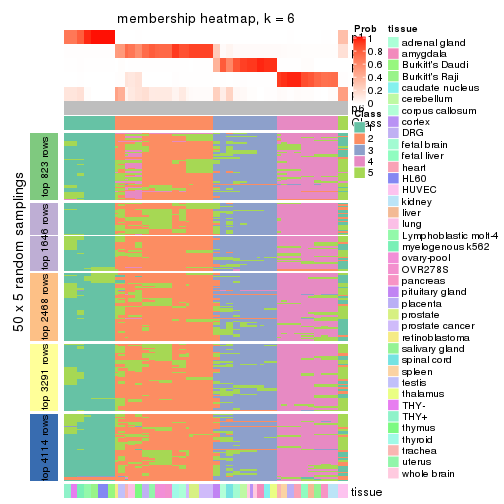</p>

</div>
</div>

As soon as we have had the classes for columns, we can look for signatures
which are significantly different between classes which can be candidate marks
for certain classes. Following are the heatmaps for signatures.


Signature heatmaps where rows are scaled:


<script>
$( function() {
	$( '#tabs-CV-kmeans-get-signatures' ).tabs();
} );
</script>
<div id='tabs-CV-kmeans-get-signatures'>
<ul>
<li><a href='#tab-CV-kmeans-get-signatures-1'>k = 2</a></li>
<li><a href='#tab-CV-kmeans-get-signatures-2'>k = 3</a></li>
<li><a href='#tab-CV-kmeans-get-signatures-3'>k = 4</a></li>
<li><a href='#tab-CV-kmeans-get-signatures-4'>k = 5</a></li>
<li><a href='#tab-CV-kmeans-get-signatures-5'>k = 6</a></li>
</ul>
<div id='tab-CV-kmeans-get-signatures-1'>
<pre><code class="r">get_signatures(res, k = 2)
</code></pre>

<p></p>

</div>
<div id='tab-CV-kmeans-get-signatures-2'>
<pre><code class="r">get_signatures(res, k = 3)
</code></pre>

<p></p>

</div>
<div id='tab-CV-kmeans-get-signatures-3'>
<pre><code class="r">get_signatures(res, k = 4)
</code></pre>

<p></p>

</div>
<div id='tab-CV-kmeans-get-signatures-4'>
<pre><code class="r">get_signatures(res, k = 5)
</code></pre>

<p></p>

</div>
<div id='tab-CV-kmeans-get-signatures-5'>
<pre><code class="r">get_signatures(res, k = 6)
</code></pre>

<p></p>

</div>
</div>


Signature heatmaps where rows are not scaled:


<script>
$( function() {
	$( '#tabs-CV-kmeans-get-signatures-no-scale' ).tabs();
} );
</script>
<div id='tabs-CV-kmeans-get-signatures-no-scale'>
<ul>
<li><a href='#tab-CV-kmeans-get-signatures-no-scale-1'>k = 2</a></li>
<li><a href='#tab-CV-kmeans-get-signatures-no-scale-2'>k = 3</a></li>
<li><a href='#tab-CV-kmeans-get-signatures-no-scale-3'>k = 4</a></li>
<li><a href='#tab-CV-kmeans-get-signatures-no-scale-4'>k = 5</a></li>
<li><a href='#tab-CV-kmeans-get-signatures-no-scale-5'>k = 6</a></li>
</ul>
<div id='tab-CV-kmeans-get-signatures-no-scale-1'>
<pre><code class="r">get_signatures(res, k = 2, scale_rows = FALSE)
</code></pre>

<p></p>

</div>
<div id='tab-CV-kmeans-get-signatures-no-scale-2'>
<pre><code class="r">get_signatures(res, k = 3, scale_rows = FALSE)
</code></pre>

<p></p>

</div>
<div id='tab-CV-kmeans-get-signatures-no-scale-3'>
<pre><code class="r">get_signatures(res, k = 4, scale_rows = FALSE)
</code></pre>

<p></p>

</div>
<div id='tab-CV-kmeans-get-signatures-no-scale-4'>
<pre><code class="r">get_signatures(res, k = 5, scale_rows = FALSE)
</code></pre>

<p></p>

</div>
<div id='tab-CV-kmeans-get-signatures-no-scale-5'>
<pre><code class="r">get_signatures(res, k = 6, scale_rows = FALSE)
</code></pre>

<p></p>

</div>
</div>


Compare the overlap of signatures from different k:

```r
compare_signatures(res)
```


`get_signature()` returns a data frame invisibly. TO get the list of signatures, the function
call should be assigned to a variable explicitly. In following code, if `plot` argument is set
to `FALSE`, no heatmap is plotted while only the differential analysis is performed.

```r
# code only for demonstration
tb = get_signature(res, k = ..., plot = FALSE)
```

An example of the output of `tb` is:

```
#>   which_row         fdr    mean_1    mean_2 scaled_mean_1 scaled_mean_2 km
#> 1        38 0.042760348  8.373488  9.131774    -0.5533452     0.5164555  1
#> 2        40 0.018707592  7.106213  8.469186    -0.6173731     0.5762149  1
#> 3        55 0.019134737 10.221463 11.207825    -0.6159697     0.5749050  1
#> 4        59 0.006059896  5.921854  7.869574    -0.6899429     0.6439467  1
#> 5        60 0.018055526  8.928898 10.211722    -0.6204761     0.5791110  1
#> 6        98 0.009384629 15.714769 14.887706     0.6635654    -0.6193277  2
...
```

The columns in `tb` are:

1. `which_row`: row indices corresponding to the input matrix.
2. `fdr`: FDR for the differential test. 
3. `mean_x`: The mean value in group x.
4. `scaled_mean_x`: The mean value in group x after rows are scaled.
5. `km`: Row groups if k-means clustering is applied to rows.


UMAP plot which shows how samples are separated.


<script>
$( function() {
	$( '#tabs-CV-kmeans-dimension-reduction' ).tabs();
} );
</script>
<div id='tabs-CV-kmeans-dimension-reduction'>
<ul>
<li><a href='#tab-CV-kmeans-dimension-reduction-1'>k = 2</a></li>
<li><a href='#tab-CV-kmeans-dimension-reduction-2'>k = 3</a></li>
<li><a href='#tab-CV-kmeans-dimension-reduction-3'>k = 4</a></li>
<li><a href='#tab-CV-kmeans-dimension-reduction-4'>k = 5</a></li>
<li><a href='#tab-CV-kmeans-dimension-reduction-5'>k = 6</a></li>
</ul>
<div id='tab-CV-kmeans-dimension-reduction-1'>
<pre><code class="r">dimension_reduction(res, k = 2, method = &quot;UMAP&quot;)
</code></pre>

<p></p>

</div>
<div id='tab-CV-kmeans-dimension-reduction-2'>
<pre><code class="r">dimension_reduction(res, k = 3, method = &quot;UMAP&quot;)
</code></pre>

<p></p>

</div>
<div id='tab-CV-kmeans-dimension-reduction-3'>
<pre><code class="r">dimension_reduction(res, k = 4, method = &quot;UMAP&quot;)
</code></pre>

<p></p>

</div>
<div id='tab-CV-kmeans-dimension-reduction-4'>
<pre><code class="r">dimension_reduction(res, k = 5, method = &quot;UMAP&quot;)
</code></pre>

<p></p>

</div>
<div id='tab-CV-kmeans-dimension-reduction-5'>
<pre><code class="r">dimension_reduction(res, k = 6, method = &quot;UMAP&quot;)
</code></pre>

<p></p>

</div>
</div>


Following heatmap shows how subgroups are split when increasing `k`:

```r
collect_classes(res)
```

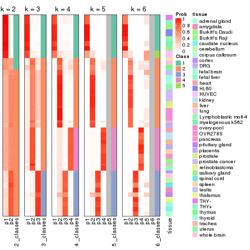


Test correlation between subgroups and known annotations. If the known
annotation is numeric, one-way ANOVA test is applied, and if the known
annotation is discrete, chi-squared contingency table test is applied.

```r
test_to_known_factors(res)
```

```
#>            n tissue(p) k
#> CV:kmeans 61  1.95e-04 2
#> CV:kmeans 84  6.67e-09 3
#> CV:kmeans 84  5.71e-12 4
#> CV:kmeans 82  8.86e-12 5
#> CV:kmeans 77  6.70e-15 6
```


If matrix rows can be associated to genes, consider to use `GO_Enrichment(res,
...)` to perform function enrichment for the signature genes.


 

---------------------------------------------------


### CV:skmeans*


The object with results only for a single top-value method and a single partition method 
can be extracted as:

```r
res = res_list["CV", "skmeans"]
# you can also extract it by
# res = res_list["CV:skmeans"]
```

A summary of `res` and all the functions that can be applied to it:

```r
res
```

```
#> A 'ConsensusPartition' object with k = 2, 3, 4, 5, 6.
#>   On a matrix with 8229 rows and 84 columns.
#>   Top rows (823, 1646, 2468, 3291, 4114) are extracted by 'CV' method.
#>   Subgroups are detected by 'skmeans' method.
#>   Performed in total 1250 partitions by row resampling.
#>   Best k for subgroups seems to be 5.
#> 
#> Following methods can be applied to this 'ConsensusPartition' object:
#>  [1] "cola_report"             "collect_classes"         "collect_plots"          
#>  [4] "collect_stats"           "colnames"                "compare_signatures"     
#>  [7] "consensus_heatmap"       "dimension_reduction"     "functional_enrichment"  
#> [10] "get_anno_col"            "get_anno"                "get_classes"            
#> [13] "get_consensus"           "get_matrix"              "get_membership"         
#> [16] "get_param"               "get_signatures"          "get_stats"              
#> [19] "is_best_k"               "is_stable_k"             "membership_heatmap"     
#> [22] "ncol"                    "nrow"                    "plot_ecdf"              
#> [25] "rownames"                "select_partition_number" "show"                   
#> [28] "suggest_best_k"          "test_to_known_factors"
```

`collect_plots()` function collects all the plots made from `res` for all `k` (number of partitions)
into one single page to provide an easy and fast comparison between different `k`.

```r
collect_plots(res)
```


The plots are:

- The first row: a plot of the ECDF (Empirical cumulative distribution
  function) curves of the consensus matrix for each `k` and the heatmap of
  predicted classes for each `k`.
- The second row: heatmaps of the consensus matrix for each `k`.
- The third row: heatmaps of the membership matrix for each `k`.
- The fouth row: heatmaps of the signatures for each `k`.

All the plots in panels can be made by individual functions and they are
plotted later in this section.

`select_partition_number()` produces several plots showing different
statistics for choosing "optimized" `k`. There are following statistics:

- ECDF curves of the consensus matrix for each `k`;
- 1-PAC. [The PAC
  score](https://en.wikipedia.org/wiki/Consensus_clustering#Over-interpretation_potential_of_consensus_clustering)
  measures the proportion of the ambiguous subgrouping.
- Mean silhouette score.
- Concordance. The mean probability of fiting the consensus class ids in all
  partitions.
- Area increased. Denote $A_k$ as the area under the ECDF curve for current
  `k`, the area increased is defined as $A_k - A_{k-1}$.
- Rand index. The percent of pairs of samples that are both in a same cluster
  or both are not in a same cluster in the partition of k and k-1.
- Jaccard index. The ratio of pairs of samples are both in a same cluster in
  the partition of k and k-1 and the pairs of samples are both in a same
  cluster in the partition k or k-1.

The detailed explanations of these statistics can be found in [the cola
vignette](http://bioconductor.org/packages/devel/bioc/vignettes/cola/inst/doc/cola.html#toc_13).

Generally speaking, lower PAC score, higher mean silhouette score or higher
concordance corresponds to better partition. Rand index and Jaccard index
measure how similar the current partition is compared to partition with `k-1`.
If they are too similar, we won't accept `k` is better than `k-1`.

```r
select_partition_number(res)
```


The numeric values for all these statistics can be obtained by `get_stats()`.

```r
get_stats(res)
```

```
#>   k 1-PAC mean_silhouette concordance area_increased  Rand Jaccard
#> 2 2 1.000           0.980       0.991         0.5064 0.494   0.494
#> 3 3 0.589           0.604       0.776         0.2736 0.572   0.319
#> 4 4 0.964           0.967       0.985         0.1718 0.865   0.621
#> 5 5 0.910           0.810       0.899         0.0470 0.983   0.930
#> 6 6 0.858           0.761       0.780         0.0377 0.930   0.704
```

`suggest_best_k()` suggests the best $k$ based on these statistics. The rules are as follows:

- All $k$ with Jaccard index larger than 0.95 are removed because the increase of
  the partition number does not provides enough extra information. If all $k$ are removed,
  the best $k$ is assigned by `NA`.
- For $k$ with 1-PAC larger than 0.9, the maximal $k$ is taken as the "best k". Other $k$ is called "optional k".
- If it does not fit the second rule. The $k$ with the highest vote of highest
  1-PAC, mean silhouette and concordance is taken as the "best k".

```r
suggest_best_k(res)
```

```
#> [1] 5
#> attr(,"optional")
#> [1] 2 4
```

There is also optional best $k$ = 2 4 that is worth to check.

Following shows the table of the partitions (You need to click the **show/hide
code output** link to see it). The membership matrix (columns with name `p*`)
is inferred by
[`clue::cl_consensus()`](https://www.rdocumentation.org/link/cl_consensus?package=clue)
function with the `SE` method. Basically the value in the membership matrix
represents the probability to belong to a certain group. The finall class
label for an item is determined with the group with highest probability it
belongs to.

In `get_classes()` function, the entropy is calculated from the membership
matrix and the silhouette score is calculated from the consensus matrix.


<script>
$( function() {
	$( '#tabs-CV-skmeans-get-classes' ).tabs();
} );
</script>
<div id='tabs-CV-skmeans-get-classes'>
<ul>
<li><a href='#tab-CV-skmeans-get-classes-1'>k = 2</a></li>
<li><a href='#tab-CV-skmeans-get-classes-2'>k = 3</a></li>
<li><a href='#tab-CV-skmeans-get-classes-3'>k = 4</a></li>
<li><a href='#tab-CV-skmeans-get-classes-4'>k = 5</a></li>
<li><a href='#tab-CV-skmeans-get-classes-5'>k = 6</a></li>
</ul>

<div id='tab-CV-skmeans-get-classes-1'>
<p><a id='tab-CV-skmeans-get-classes-1-a' style='color:#0366d6' href='#'>show/hide code output</a></p>
<pre><code class="r">cbind(get_classes(res, k = 2), get_membership(res, k = 2))
</code></pre>

<pre><code>#&gt;         class entropy silhouette    p1    p2
#&gt; GSM2819     1  0.0000      0.985 1.000 0.000
#&gt; GSM2820     2  0.0000      0.996 0.000 1.000
#&gt; GSM2822     1  0.0000      0.985 1.000 0.000
#&gt; GSM2832     1  0.0000      0.985 1.000 0.000
#&gt; GSM2823     2  0.0000      0.996 0.000 1.000
#&gt; GSM2824     2  0.0000      0.996 0.000 1.000
#&gt; GSM2825     1  0.0000      0.985 1.000 0.000
#&gt; GSM2826     1  0.0000      0.985 1.000 0.000
#&gt; GSM2829     1  0.0000      0.985 1.000 0.000
#&gt; GSM2856     1  0.0000      0.985 1.000 0.000
#&gt; GSM2830     1  0.0000      0.985 1.000 0.000
#&gt; GSM2843     1  0.0000      0.985 1.000 0.000
#&gt; GSM2871     1  0.0000      0.985 1.000 0.000
#&gt; GSM2831     1  0.0000      0.985 1.000 0.000
#&gt; GSM2844     1  0.0000      0.985 1.000 0.000
#&gt; GSM2833     1  0.0000      0.985 1.000 0.000
#&gt; GSM2846     1  0.0000      0.985 1.000 0.000
#&gt; GSM2835     1  0.0000      0.985 1.000 0.000
#&gt; GSM2858     1  0.0000      0.985 1.000 0.000
#&gt; GSM2836     2  0.0672      0.996 0.008 0.992
#&gt; GSM2848     2  0.0672      0.996 0.008 0.992
#&gt; GSM2828     2  0.0000      0.996 0.000 1.000
#&gt; GSM2837     2  0.0000      0.996 0.000 1.000
#&gt; GSM2839     1  0.0672      0.984 0.992 0.008
#&gt; GSM2841     1  0.0672      0.984 0.992 0.008
#&gt; GSM2827     2  0.0672      0.996 0.008 0.992
#&gt; GSM2842     2  0.0672      0.996 0.008 0.992
#&gt; GSM2845     1  0.0000      0.985 1.000 0.000
#&gt; GSM2872     1  0.0000      0.985 1.000 0.000
#&gt; GSM2834     1  0.0000      0.985 1.000 0.000
#&gt; GSM2847     1  0.0000      0.985 1.000 0.000
#&gt; GSM2849     2  0.0000      0.996 0.000 1.000
#&gt; GSM2850     2  0.0000      0.996 0.000 1.000
#&gt; GSM2838     2  0.0672      0.996 0.008 0.992
#&gt; GSM2853     2  0.0672      0.996 0.008 0.992
#&gt; GSM2852     2  0.0000      0.996 0.000 1.000
#&gt; GSM2855     2  0.0000      0.996 0.000 1.000
#&gt; GSM2840     1  0.0672      0.984 0.992 0.008
#&gt; GSM2857     1  0.0672      0.984 0.992 0.008
#&gt; GSM2859     2  0.0672      0.996 0.008 0.992
#&gt; GSM2860     2  0.0672      0.996 0.008 0.992
#&gt; GSM2861     2  0.0672      0.996 0.008 0.992
#&gt; GSM2862     2  0.0672      0.996 0.008 0.992
#&gt; GSM2863     2  0.0672      0.996 0.008 0.992
#&gt; GSM2864     2  0.0672      0.996 0.008 0.992
#&gt; GSM2865     2  0.0672      0.996 0.008 0.992
#&gt; GSM2866     2  0.0672      0.996 0.008 0.992
#&gt; GSM2868     2  0.0672      0.996 0.008 0.992
#&gt; GSM2869     2  0.0672      0.996 0.008 0.992
#&gt; GSM2851     2  0.0672      0.996 0.008 0.992
#&gt; GSM2867     2  0.0672      0.996 0.008 0.992
#&gt; GSM2870     2  0.0672      0.996 0.008 0.992
#&gt; GSM2854     1  0.0000      0.985 1.000 0.000
#&gt; GSM2873     1  0.9970      0.108 0.532 0.468
#&gt; GSM2874     2  0.0000      0.996 0.000 1.000
#&gt; GSM2884     2  0.0000      0.996 0.000 1.000
#&gt; GSM2875     1  0.0672      0.984 0.992 0.008
#&gt; GSM2890     1  0.0672      0.984 0.992 0.008
#&gt; GSM2877     1  0.0672      0.984 0.992 0.008
#&gt; GSM2892     1  0.0672      0.984 0.992 0.008
#&gt; GSM2902     1  0.0672      0.984 0.992 0.008
#&gt; GSM2878     1  0.0672      0.984 0.992 0.008
#&gt; GSM2901     1  0.0672      0.984 0.992 0.008
#&gt; GSM2879     2  0.0000      0.996 0.000 1.000
#&gt; GSM2898     2  0.0000      0.996 0.000 1.000
#&gt; GSM2881     2  0.0000      0.996 0.000 1.000
#&gt; GSM2897     2  0.0000      0.996 0.000 1.000
#&gt; GSM2882     1  0.0000      0.985 1.000 0.000
#&gt; GSM2894     1  0.0000      0.985 1.000 0.000
#&gt; GSM2883     2  0.0000      0.996 0.000 1.000
#&gt; GSM2895     2  0.0000      0.996 0.000 1.000
#&gt; GSM2885     2  0.0000      0.996 0.000 1.000
#&gt; GSM2886     2  0.0000      0.996 0.000 1.000
#&gt; GSM2887     2  0.0000      0.996 0.000 1.000
#&gt; GSM2896     2  0.0000      0.996 0.000 1.000
#&gt; GSM2888     2  0.0672      0.996 0.008 0.992
#&gt; GSM2889     2  0.0672      0.996 0.008 0.992
#&gt; GSM2876     1  0.0672      0.984 0.992 0.008
#&gt; GSM2891     1  0.0672      0.984 0.992 0.008
#&gt; GSM2880     1  0.0672      0.984 0.992 0.008
#&gt; GSM2893     1  0.0672      0.984 0.992 0.008
#&gt; GSM2821     1  0.0672      0.984 0.992 0.008
#&gt; GSM2900     1  0.0672      0.984 0.992 0.008
#&gt; GSM2903     1  0.0672      0.984 0.992 0.008
</code></pre>

<script>
$('#tab-CV-skmeans-get-classes-1-a').parent().next().next().hide();
$('#tab-CV-skmeans-get-classes-1-a').click(function(){
  $('#tab-CV-skmeans-get-classes-1-a').parent().next().next().toggle();
  return(false);
});
</script>
</div>

<div id='tab-CV-skmeans-get-classes-2'>
<p><a id='tab-CV-skmeans-get-classes-2-a' style='color:#0366d6' href='#'>show/hide code output</a></p>
<pre><code class="r">cbind(get_classes(res, k = 3), get_membership(res, k = 3))
</code></pre>

<pre><code>#&gt;         class entropy silhouette    p1    p2    p3
#&gt; GSM2819     1  0.6215      0.267 0.572 0.428 0.000
#&gt; GSM2820     3  0.5905      0.628 0.000 0.352 0.648
#&gt; GSM2822     2  0.6252      0.556 0.008 0.648 0.344
#&gt; GSM2832     2  0.6252      0.556 0.008 0.648 0.344
#&gt; GSM2823     1  0.5954      0.748 0.792 0.116 0.092
#&gt; GSM2824     1  0.5954      0.748 0.792 0.116 0.092
#&gt; GSM2825     1  0.1643      0.921 0.956 0.044 0.000
#&gt; GSM2826     1  0.1643      0.921 0.956 0.044 0.000
#&gt; GSM2829     2  0.9241      0.471 0.164 0.484 0.352
#&gt; GSM2856     2  0.9241      0.471 0.164 0.484 0.352
#&gt; GSM2830     2  0.9241      0.471 0.164 0.484 0.352
#&gt; GSM2843     2  0.9241      0.471 0.164 0.484 0.352
#&gt; GSM2871     2  0.9241      0.471 0.164 0.484 0.352
#&gt; GSM2831     3  0.9993     -0.266 0.324 0.324 0.352
#&gt; GSM2844     3  0.9993     -0.266 0.324 0.324 0.352
#&gt; GSM2833     2  0.9241      0.471 0.164 0.484 0.352
#&gt; GSM2846     2  0.9241      0.471 0.164 0.484 0.352
#&gt; GSM2835     3  0.9989     -0.253 0.336 0.312 0.352
#&gt; GSM2858     3  0.9989     -0.253 0.336 0.312 0.352
#&gt; GSM2836     2  0.0000      0.686 0.000 1.000 0.000
#&gt; GSM2848     2  0.0000      0.686 0.000 1.000 0.000
#&gt; GSM2828     3  0.5905      0.628 0.000 0.352 0.648
#&gt; GSM2837     3  0.5905      0.628 0.000 0.352 0.648
#&gt; GSM2839     1  0.0000      0.949 1.000 0.000 0.000
#&gt; GSM2841     1  0.0000      0.949 1.000 0.000 0.000
#&gt; GSM2827     2  0.0000      0.686 0.000 1.000 0.000
#&gt; GSM2842     2  0.0000      0.686 0.000 1.000 0.000
#&gt; GSM2845     3  0.9992     -0.272 0.320 0.328 0.352
#&gt; GSM2872     3  0.9992     -0.272 0.320 0.328 0.352
#&gt; GSM2834     2  0.9241      0.471 0.164 0.484 0.352
#&gt; GSM2847     2  0.9241      0.471 0.164 0.484 0.352
#&gt; GSM2849     3  0.5905      0.628 0.000 0.352 0.648
#&gt; GSM2850     3  0.5905      0.628 0.000 0.352 0.648
#&gt; GSM2838     2  0.0000      0.686 0.000 1.000 0.000
#&gt; GSM2853     2  0.0000      0.686 0.000 1.000 0.000
#&gt; GSM2852     3  0.5905      0.628 0.000 0.352 0.648
#&gt; GSM2855     3  0.5905      0.628 0.000 0.352 0.648
#&gt; GSM2840     1  0.0000      0.949 1.000 0.000 0.000
#&gt; GSM2857     1  0.0000      0.949 1.000 0.000 0.000
#&gt; GSM2859     2  0.0000      0.686 0.000 1.000 0.000
#&gt; GSM2860     2  0.0000      0.686 0.000 1.000 0.000
#&gt; GSM2861     2  0.0000      0.686 0.000 1.000 0.000
#&gt; GSM2862     2  0.0000      0.686 0.000 1.000 0.000
#&gt; GSM2863     2  0.0000      0.686 0.000 1.000 0.000
#&gt; GSM2864     2  0.0000      0.686 0.000 1.000 0.000
#&gt; GSM2865     2  0.0000      0.686 0.000 1.000 0.000
#&gt; GSM2866     2  0.0000      0.686 0.000 1.000 0.000
#&gt; GSM2868     2  0.0000      0.686 0.000 1.000 0.000
#&gt; GSM2869     2  0.0000      0.686 0.000 1.000 0.000
#&gt; GSM2851     2  0.0000      0.686 0.000 1.000 0.000
#&gt; GSM2867     2  0.0000      0.686 0.000 1.000 0.000
#&gt; GSM2870     2  0.0000      0.686 0.000 1.000 0.000
#&gt; GSM2854     2  0.7462      0.535 0.048 0.600 0.352
#&gt; GSM2873     2  0.5905      0.555 0.000 0.648 0.352
#&gt; GSM2874     3  0.5905      0.628 0.000 0.352 0.648
#&gt; GSM2884     3  0.5905      0.628 0.000 0.352 0.648
#&gt; GSM2875     1  0.0000      0.949 1.000 0.000 0.000
#&gt; GSM2890     1  0.0000      0.949 1.000 0.000 0.000
#&gt; GSM2877     1  0.0000      0.949 1.000 0.000 0.000
#&gt; GSM2892     1  0.0000      0.949 1.000 0.000 0.000
#&gt; GSM2902     1  0.0000      0.949 1.000 0.000 0.000
#&gt; GSM2878     1  0.0000      0.949 1.000 0.000 0.000
#&gt; GSM2901     1  0.0000      0.949 1.000 0.000 0.000
#&gt; GSM2879     3  0.5905      0.628 0.000 0.352 0.648
#&gt; GSM2898     3  0.5905      0.628 0.000 0.352 0.648
#&gt; GSM2881     3  0.5905      0.628 0.000 0.352 0.648
#&gt; GSM2897     3  0.5905      0.628 0.000 0.352 0.648
#&gt; GSM2882     3  0.9986     -0.250 0.340 0.308 0.352
#&gt; GSM2894     3  0.9986     -0.250 0.340 0.308 0.352
#&gt; GSM2883     3  0.5905      0.628 0.000 0.352 0.648
#&gt; GSM2895     3  0.5905      0.628 0.000 0.352 0.648
#&gt; GSM2885     3  0.5905      0.628 0.000 0.352 0.648
#&gt; GSM2886     3  0.5905      0.628 0.000 0.352 0.648
#&gt; GSM2887     3  0.5905      0.628 0.000 0.352 0.648
#&gt; GSM2896     3  0.5905      0.628 0.000 0.352 0.648
#&gt; GSM2888     2  0.4235      0.362 0.000 0.824 0.176
#&gt; GSM2889     2  0.4235      0.362 0.000 0.824 0.176
#&gt; GSM2876     1  0.0000      0.949 1.000 0.000 0.000
#&gt; GSM2891     1  0.0000      0.949 1.000 0.000 0.000
#&gt; GSM2880     1  0.0000      0.949 1.000 0.000 0.000
#&gt; GSM2893     1  0.0000      0.949 1.000 0.000 0.000
#&gt; GSM2821     1  0.0892      0.937 0.980 0.020 0.000
#&gt; GSM2900     1  0.0892      0.937 0.980 0.020 0.000
#&gt; GSM2903     1  0.0892      0.937 0.980 0.020 0.000
</code></pre>

<script>
$('#tab-CV-skmeans-get-classes-2-a').parent().next().next().hide();
$('#tab-CV-skmeans-get-classes-2-a').click(function(){
  $('#tab-CV-skmeans-get-classes-2-a').parent().next().next().toggle();
  return(false);
});
</script>
</div>

<div id='tab-CV-skmeans-get-classes-3'>
<p><a id='tab-CV-skmeans-get-classes-3-a' style='color:#0366d6' href='#'>show/hide code output</a></p>
<pre><code class="r">cbind(get_classes(res, k = 4), get_membership(res, k = 4))
</code></pre>

<pre><code>#&gt;         class entropy silhouette    p1    p2 p3    p4
#&gt; GSM2819     1  0.4790      0.415 0.620 0.380  0 0.000
#&gt; GSM2820     3  0.0000      1.000 0.000 0.000  1 0.000
#&gt; GSM2822     2  0.2973      0.841 0.000 0.856  0 0.144
#&gt; GSM2832     2  0.2973      0.841 0.000 0.856  0 0.144
#&gt; GSM2823     1  0.0592      0.950 0.984 0.016  0 0.000
#&gt; GSM2824     1  0.0592      0.950 0.984 0.016  0 0.000
#&gt; GSM2825     1  0.4638      0.742 0.776 0.044  0 0.180
#&gt; GSM2826     1  0.4638      0.742 0.776 0.044  0 0.180
#&gt; GSM2829     4  0.0000      1.000 0.000 0.000  0 1.000
#&gt; GSM2856     4  0.0000      1.000 0.000 0.000  0 1.000
#&gt; GSM2830     4  0.0000      1.000 0.000 0.000  0 1.000
#&gt; GSM2843     4  0.0000      1.000 0.000 0.000  0 1.000
#&gt; GSM2871     4  0.0000      1.000 0.000 0.000  0 1.000
#&gt; GSM2831     4  0.0000      1.000 0.000 0.000  0 1.000
#&gt; GSM2844     4  0.0000      1.000 0.000 0.000  0 1.000
#&gt; GSM2833     4  0.0000      1.000 0.000 0.000  0 1.000
#&gt; GSM2846     4  0.0000      1.000 0.000 0.000  0 1.000
#&gt; GSM2835     4  0.0000      1.000 0.000 0.000  0 1.000
#&gt; GSM2858     4  0.0000      1.000 0.000 0.000  0 1.000
#&gt; GSM2836     2  0.0000      0.980 0.000 1.000  0 0.000
#&gt; GSM2848     2  0.0000      0.980 0.000 1.000  0 0.000
#&gt; GSM2828     3  0.0000      1.000 0.000 0.000  1 0.000
#&gt; GSM2837     3  0.0000      1.000 0.000 0.000  1 0.000
#&gt; GSM2839     1  0.0000      0.961 1.000 0.000  0 0.000
#&gt; GSM2841     1  0.0000      0.961 1.000 0.000  0 0.000
#&gt; GSM2827     2  0.0000      0.980 0.000 1.000  0 0.000
#&gt; GSM2842     2  0.0000      0.980 0.000 1.000  0 0.000
#&gt; GSM2845     4  0.0000      1.000 0.000 0.000  0 1.000
#&gt; GSM2872     4  0.0000      1.000 0.000 0.000  0 1.000
#&gt; GSM2834     4  0.0000      1.000 0.000 0.000  0 1.000
#&gt; GSM2847     4  0.0000      1.000 0.000 0.000  0 1.000
#&gt; GSM2849     3  0.0000      1.000 0.000 0.000  1 0.000
#&gt; GSM2850     3  0.0000      1.000 0.000 0.000  1 0.000
#&gt; GSM2838     2  0.0000      0.980 0.000 1.000  0 0.000
#&gt; GSM2853     2  0.0000      0.980 0.000 1.000  0 0.000
#&gt; GSM2852     3  0.0000      1.000 0.000 0.000  1 0.000
#&gt; GSM2855     3  0.0000      1.000 0.000 0.000  1 0.000
#&gt; GSM2840     1  0.0000      0.961 1.000 0.000  0 0.000
#&gt; GSM2857     1  0.0000      0.961 1.000 0.000  0 0.000
#&gt; GSM2859     2  0.0000      0.980 0.000 1.000  0 0.000
#&gt; GSM2860     2  0.0000      0.980 0.000 1.000  0 0.000
#&gt; GSM2861     2  0.0000      0.980 0.000 1.000  0 0.000
#&gt; GSM2862     2  0.0000      0.980 0.000 1.000  0 0.000
#&gt; GSM2863     2  0.0000      0.980 0.000 1.000  0 0.000
#&gt; GSM2864     2  0.0000      0.980 0.000 1.000  0 0.000
#&gt; GSM2865     2  0.0000      0.980 0.000 1.000  0 0.000
#&gt; GSM2866     2  0.0000      0.980 0.000 1.000  0 0.000
#&gt; GSM2868     2  0.0000      0.980 0.000 1.000  0 0.000
#&gt; GSM2869     2  0.0000      0.980 0.000 1.000  0 0.000
#&gt; GSM2851     2  0.0000      0.980 0.000 1.000  0 0.000
#&gt; GSM2867     2  0.0000      0.980 0.000 1.000  0 0.000
#&gt; GSM2870     2  0.0000      0.980 0.000 1.000  0 0.000
#&gt; GSM2854     4  0.0000      1.000 0.000 0.000  0 1.000
#&gt; GSM2873     2  0.2973      0.841 0.000 0.856  0 0.144
#&gt; GSM2874     3  0.0000      1.000 0.000 0.000  1 0.000
#&gt; GSM2884     3  0.0000      1.000 0.000 0.000  1 0.000
#&gt; GSM2875     1  0.0000      0.961 1.000 0.000  0 0.000
#&gt; GSM2890     1  0.0000      0.961 1.000 0.000  0 0.000
#&gt; GSM2877     1  0.0000      0.961 1.000 0.000  0 0.000
#&gt; GSM2892     1  0.0000      0.961 1.000 0.000  0 0.000
#&gt; GSM2902     1  0.0000      0.961 1.000 0.000  0 0.000
#&gt; GSM2878     1  0.0000      0.961 1.000 0.000  0 0.000
#&gt; GSM2901     1  0.0000      0.961 1.000 0.000  0 0.000
#&gt; GSM2879     3  0.0000      1.000 0.000 0.000  1 0.000
#&gt; GSM2898     3  0.0000      1.000 0.000 0.000  1 0.000
#&gt; GSM2881     3  0.0000      1.000 0.000 0.000  1 0.000
#&gt; GSM2897     3  0.0000      1.000 0.000 0.000  1 0.000
#&gt; GSM2882     4  0.0000      1.000 0.000 0.000  0 1.000
#&gt; GSM2894     4  0.0000      1.000 0.000 0.000  0 1.000
#&gt; GSM2883     3  0.0000      1.000 0.000 0.000  1 0.000
#&gt; GSM2895     3  0.0000      1.000 0.000 0.000  1 0.000
#&gt; GSM2885     3  0.0000      1.000 0.000 0.000  1 0.000
#&gt; GSM2886     3  0.0000      1.000 0.000 0.000  1 0.000
#&gt; GSM2887     3  0.0000      1.000 0.000 0.000  1 0.000
#&gt; GSM2896     3  0.0000      1.000 0.000 0.000  1 0.000
#&gt; GSM2888     2  0.0000      0.980 0.000 1.000  0 0.000
#&gt; GSM2889     2  0.0000      0.980 0.000 1.000  0 0.000
#&gt; GSM2876     1  0.0000      0.961 1.000 0.000  0 0.000
#&gt; GSM2891     1  0.0000      0.961 1.000 0.000  0 0.000
#&gt; GSM2880     1  0.0000      0.961 1.000 0.000  0 0.000
#&gt; GSM2893     1  0.0000      0.961 1.000 0.000  0 0.000
#&gt; GSM2821     1  0.0000      0.961 1.000 0.000  0 0.000
#&gt; GSM2900     1  0.0000      0.961 1.000 0.000  0 0.000
#&gt; GSM2903     1  0.0000      0.961 1.000 0.000  0 0.000
</code></pre>

<script>
$('#tab-CV-skmeans-get-classes-3-a').parent().next().next().hide();
$('#tab-CV-skmeans-get-classes-3-a').click(function(){
  $('#tab-CV-skmeans-get-classes-3-a').parent().next().next().toggle();
  return(false);
});
</script>
</div>

<div id='tab-CV-skmeans-get-classes-4'>
<p><a id='tab-CV-skmeans-get-classes-4-a' style='color:#0366d6' href='#'>show/hide code output</a></p>
<pre><code class="r">cbind(get_classes(res, k = 5), get_membership(res, k = 5))
</code></pre>

<pre><code>#&gt;         class entropy silhouette    p1    p2    p3    p4    p5
#&gt; GSM2819     5  0.6319      0.646 0.216 0.256 0.000 0.000 0.528
#&gt; GSM2820     3  0.0000      1.000 0.000 0.000 1.000 0.000 0.000
#&gt; GSM2822     2  0.5151      0.641 0.000 0.560 0.000 0.044 0.396
#&gt; GSM2832     2  0.5151      0.641 0.000 0.560 0.000 0.044 0.396
#&gt; GSM2823     5  0.5795      0.772 0.412 0.092 0.000 0.000 0.496
#&gt; GSM2824     5  0.5795      0.772 0.412 0.092 0.000 0.000 0.496
#&gt; GSM2825     1  0.5494      0.276 0.556 0.012 0.000 0.044 0.388
#&gt; GSM2826     1  0.5494      0.276 0.556 0.012 0.000 0.044 0.388
#&gt; GSM2829     4  0.1608      0.952 0.000 0.000 0.000 0.928 0.072
#&gt; GSM2856     4  0.1608      0.952 0.000 0.000 0.000 0.928 0.072
#&gt; GSM2830     4  0.0162      0.967 0.000 0.000 0.000 0.996 0.004
#&gt; GSM2843     4  0.0162      0.967 0.000 0.000 0.000 0.996 0.004
#&gt; GSM2871     4  0.0162      0.967 0.000 0.000 0.000 0.996 0.004
#&gt; GSM2831     4  0.0000      0.968 0.000 0.000 0.000 1.000 0.000
#&gt; GSM2844     4  0.0000      0.968 0.000 0.000 0.000 1.000 0.000
#&gt; GSM2833     4  0.1544      0.954 0.000 0.000 0.000 0.932 0.068
#&gt; GSM2846     4  0.1544      0.954 0.000 0.000 0.000 0.932 0.068
#&gt; GSM2835     4  0.1732      0.948 0.000 0.000 0.000 0.920 0.080
#&gt; GSM2858     4  0.1732      0.948 0.000 0.000 0.000 0.920 0.080
#&gt; GSM2836     2  0.3684      0.825 0.000 0.720 0.000 0.000 0.280
#&gt; GSM2848     2  0.3684      0.825 0.000 0.720 0.000 0.000 0.280
#&gt; GSM2828     3  0.0000      1.000 0.000 0.000 1.000 0.000 0.000
#&gt; GSM2837     3  0.0000      1.000 0.000 0.000 1.000 0.000 0.000
#&gt; GSM2839     1  0.1851      0.723 0.912 0.000 0.000 0.000 0.088
#&gt; GSM2841     1  0.1851      0.723 0.912 0.000 0.000 0.000 0.088
#&gt; GSM2827     2  0.1341      0.824 0.000 0.944 0.000 0.000 0.056
#&gt; GSM2842     2  0.1197      0.821 0.000 0.952 0.000 0.000 0.048
#&gt; GSM2845     4  0.0162      0.967 0.000 0.000 0.000 0.996 0.004
#&gt; GSM2872     4  0.0162      0.967 0.000 0.000 0.000 0.996 0.004
#&gt; GSM2834     4  0.0510      0.968 0.000 0.000 0.000 0.984 0.016
#&gt; GSM2847     4  0.0510      0.968 0.000 0.000 0.000 0.984 0.016
#&gt; GSM2849     3  0.0000      1.000 0.000 0.000 1.000 0.000 0.000
#&gt; GSM2850     3  0.0000      1.000 0.000 0.000 1.000 0.000 0.000
#&gt; GSM2838     2  0.0000      0.827 0.000 1.000 0.000 0.000 0.000
#&gt; GSM2853     2  0.0000      0.827 0.000 1.000 0.000 0.000 0.000
#&gt; GSM2852     3  0.0000      1.000 0.000 0.000 1.000 0.000 0.000
#&gt; GSM2855     3  0.0000      1.000 0.000 0.000 1.000 0.000 0.000
#&gt; GSM2840     1  0.1851      0.723 0.912 0.000 0.000 0.000 0.088
#&gt; GSM2857     1  0.1851      0.723 0.912 0.000 0.000 0.000 0.088
#&gt; GSM2859     2  0.3452      0.834 0.000 0.756 0.000 0.000 0.244
#&gt; GSM2860     2  0.3452      0.834 0.000 0.756 0.000 0.000 0.244
#&gt; GSM2861     2  0.3177      0.837 0.000 0.792 0.000 0.000 0.208
#&gt; GSM2862     2  0.3452      0.834 0.000 0.756 0.000 0.000 0.244
#&gt; GSM2863     2  0.3452      0.834 0.000 0.756 0.000 0.000 0.244
#&gt; GSM2864     2  0.3452      0.834 0.000 0.756 0.000 0.000 0.244
#&gt; GSM2865     2  0.3452      0.834 0.000 0.756 0.000 0.000 0.244
#&gt; GSM2866     2  0.3452      0.834 0.000 0.756 0.000 0.000 0.244
#&gt; GSM2868     2  0.0290      0.824 0.000 0.992 0.000 0.000 0.008
#&gt; GSM2869     2  0.0290      0.824 0.000 0.992 0.000 0.000 0.008
#&gt; GSM2851     2  0.0162      0.826 0.000 0.996 0.000 0.000 0.004
#&gt; GSM2867     2  0.0290      0.824 0.000 0.992 0.000 0.000 0.008
#&gt; GSM2870     2  0.0162      0.826 0.000 0.996 0.000 0.000 0.004
#&gt; GSM2854     4  0.2074      0.934 0.000 0.000 0.000 0.896 0.104
#&gt; GSM2873     2  0.5176      0.693 0.000 0.572 0.000 0.048 0.380
#&gt; GSM2874     3  0.0000      1.000 0.000 0.000 1.000 0.000 0.000
#&gt; GSM2884     3  0.0000      1.000 0.000 0.000 1.000 0.000 0.000
#&gt; GSM2875     1  0.0000      0.769 1.000 0.000 0.000 0.000 0.000
#&gt; GSM2890     1  0.0000      0.769 1.000 0.000 0.000 0.000 0.000
#&gt; GSM2877     1  0.0000      0.769 1.000 0.000 0.000 0.000 0.000
#&gt; GSM2892     1  0.0000      0.769 1.000 0.000 0.000 0.000 0.000
#&gt; GSM2902     1  0.0000      0.769 1.000 0.000 0.000 0.000 0.000
#&gt; GSM2878     1  0.0000      0.769 1.000 0.000 0.000 0.000 0.000
#&gt; GSM2901     1  0.0000      0.769 1.000 0.000 0.000 0.000 0.000
#&gt; GSM2879     3  0.0162      0.997 0.000 0.000 0.996 0.000 0.004
#&gt; GSM2898     3  0.0162      0.997 0.000 0.000 0.996 0.000 0.004
#&gt; GSM2881     3  0.0000      1.000 0.000 0.000 1.000 0.000 0.000
#&gt; GSM2897     3  0.0000      1.000 0.000 0.000 1.000 0.000 0.000
#&gt; GSM2882     4  0.0000      0.968 0.000 0.000 0.000 1.000 0.000
#&gt; GSM2894     4  0.0000      0.968 0.000 0.000 0.000 1.000 0.000
#&gt; GSM2883     3  0.0000      1.000 0.000 0.000 1.000 0.000 0.000
#&gt; GSM2895     3  0.0000      1.000 0.000 0.000 1.000 0.000 0.000
#&gt; GSM2885     3  0.0000      1.000 0.000 0.000 1.000 0.000 0.000
#&gt; GSM2886     3  0.0000      1.000 0.000 0.000 1.000 0.000 0.000
#&gt; GSM2887     3  0.0000      1.000 0.000 0.000 1.000 0.000 0.000
#&gt; GSM2896     3  0.0000      1.000 0.000 0.000 1.000 0.000 0.000
#&gt; GSM2888     2  0.0963      0.823 0.000 0.964 0.000 0.000 0.036
#&gt; GSM2889     2  0.0963      0.823 0.000 0.964 0.000 0.000 0.036
#&gt; GSM2876     1  0.0000      0.769 1.000 0.000 0.000 0.000 0.000
#&gt; GSM2891     1  0.0000      0.769 1.000 0.000 0.000 0.000 0.000
#&gt; GSM2880     1  0.0000      0.769 1.000 0.000 0.000 0.000 0.000
#&gt; GSM2893     1  0.0000      0.769 1.000 0.000 0.000 0.000 0.000
#&gt; GSM2821     1  0.4306     -0.574 0.508 0.000 0.000 0.000 0.492
#&gt; GSM2900     1  0.4306     -0.574 0.508 0.000 0.000 0.000 0.492
#&gt; GSM2903     1  0.4306     -0.574 0.508 0.000 0.000 0.000 0.492
</code></pre>

<script>
$('#tab-CV-skmeans-get-classes-4-a').parent().next().next().hide();
$('#tab-CV-skmeans-get-classes-4-a').click(function(){
  $('#tab-CV-skmeans-get-classes-4-a').parent().next().next().toggle();
  return(false);
});
</script>
</div>

<div id='tab-CV-skmeans-get-classes-5'>
<p><a id='tab-CV-skmeans-get-classes-5-a' style='color:#0366d6' href='#'>show/hide code output</a></p>
<pre><code class="r">cbind(get_classes(res, k = 6), get_membership(res, k = 6))
</code></pre>

<pre><code>#&gt;         class entropy silhouette    p1    p2    p3    p4    p5    p6
#&gt; GSM2819     5  0.7329    -0.0845 0.128 0.192 0.000 0.000 0.352 0.328
#&gt; GSM2820     3  0.0000     0.9912 0.000 0.000 1.000 0.000 0.000 0.000
#&gt; GSM2822     6  0.6178     0.5092 0.000 0.280 0.000 0.016 0.220 0.484
#&gt; GSM2832     6  0.6178     0.5092 0.000 0.280 0.000 0.016 0.220 0.484
#&gt; GSM2823     5  0.7260    -0.1046 0.192 0.120 0.000 0.000 0.384 0.304
#&gt; GSM2824     5  0.7260    -0.1046 0.192 0.120 0.000 0.000 0.384 0.304
#&gt; GSM2825     6  0.4648     0.4147 0.276 0.004 0.000 0.016 0.036 0.668
#&gt; GSM2826     6  0.4648     0.4147 0.276 0.004 0.000 0.016 0.036 0.668
#&gt; GSM2829     4  0.2730     0.8709 0.000 0.000 0.000 0.836 0.012 0.152
#&gt; GSM2856     4  0.2730     0.8709 0.000 0.000 0.000 0.836 0.012 0.152
#&gt; GSM2830     4  0.0520     0.9115 0.000 0.000 0.000 0.984 0.008 0.008
#&gt; GSM2843     4  0.0520     0.9115 0.000 0.000 0.000 0.984 0.008 0.008
#&gt; GSM2871     4  0.0520     0.9115 0.000 0.000 0.000 0.984 0.008 0.008
#&gt; GSM2831     4  0.0000     0.9141 0.000 0.000 0.000 1.000 0.000 0.000
#&gt; GSM2844     4  0.0000     0.9141 0.000 0.000 0.000 1.000 0.000 0.000
#&gt; GSM2833     4  0.2768     0.8684 0.000 0.000 0.000 0.832 0.012 0.156
#&gt; GSM2846     4  0.2768     0.8684 0.000 0.000 0.000 0.832 0.012 0.156
#&gt; GSM2835     4  0.2948     0.8479 0.000 0.000 0.000 0.804 0.008 0.188
#&gt; GSM2858     4  0.2948     0.8479 0.000 0.000 0.000 0.804 0.008 0.188
#&gt; GSM2836     5  0.4948     0.4658 0.000 0.360 0.000 0.000 0.564 0.076
#&gt; GSM2848     5  0.4948     0.4658 0.000 0.360 0.000 0.000 0.564 0.076
#&gt; GSM2828     3  0.0000     0.9912 0.000 0.000 1.000 0.000 0.000 0.000
#&gt; GSM2837     3  0.0000     0.9912 0.000 0.000 1.000 0.000 0.000 0.000
#&gt; GSM2839     1  0.3023     0.6732 0.784 0.000 0.000 0.000 0.004 0.212
#&gt; GSM2841     1  0.3023     0.6732 0.784 0.000 0.000 0.000 0.004 0.212
#&gt; GSM2827     2  0.3611     0.7727 0.000 0.796 0.000 0.000 0.108 0.096
#&gt; GSM2842     2  0.3167     0.8017 0.000 0.832 0.000 0.000 0.072 0.096
#&gt; GSM2845     4  0.0520     0.9115 0.000 0.000 0.000 0.984 0.008 0.008
#&gt; GSM2872     4  0.0520     0.9115 0.000 0.000 0.000 0.984 0.008 0.008
#&gt; GSM2834     4  0.1225     0.9111 0.000 0.000 0.000 0.952 0.012 0.036
#&gt; GSM2847     4  0.1225     0.9111 0.000 0.000 0.000 0.952 0.012 0.036
#&gt; GSM2849     3  0.0000     0.9912 0.000 0.000 1.000 0.000 0.000 0.000
#&gt; GSM2850     3  0.0000     0.9912 0.000 0.000 1.000 0.000 0.000 0.000
#&gt; GSM2838     2  0.0790     0.8999 0.000 0.968 0.000 0.000 0.032 0.000
#&gt; GSM2853     2  0.0790     0.8999 0.000 0.968 0.000 0.000 0.032 0.000
#&gt; GSM2852     3  0.0692     0.9777 0.000 0.000 0.976 0.000 0.004 0.020
#&gt; GSM2855     3  0.0692     0.9777 0.000 0.000 0.976 0.000 0.004 0.020
#&gt; GSM2840     1  0.3023     0.6732 0.784 0.000 0.000 0.000 0.004 0.212
#&gt; GSM2857     1  0.3023     0.6732 0.784 0.000 0.000 0.000 0.004 0.212
#&gt; GSM2859     5  0.3804     0.5664 0.000 0.424 0.000 0.000 0.576 0.000
#&gt; GSM2860     5  0.3804     0.5664 0.000 0.424 0.000 0.000 0.576 0.000
#&gt; GSM2861     5  0.3838     0.5253 0.000 0.448 0.000 0.000 0.552 0.000
#&gt; GSM2862     5  0.3804     0.5664 0.000 0.424 0.000 0.000 0.576 0.000
#&gt; GSM2863     5  0.3804     0.5664 0.000 0.424 0.000 0.000 0.576 0.000
#&gt; GSM2864     5  0.3804     0.5664 0.000 0.424 0.000 0.000 0.576 0.000
#&gt; GSM2865     5  0.3804     0.5664 0.000 0.424 0.000 0.000 0.576 0.000
#&gt; GSM2866     5  0.3804     0.5664 0.000 0.424 0.000 0.000 0.576 0.000
#&gt; GSM2868     2  0.0000     0.9194 0.000 1.000 0.000 0.000 0.000 0.000
#&gt; GSM2869     2  0.0000     0.9194 0.000 1.000 0.000 0.000 0.000 0.000
#&gt; GSM2851     2  0.0000     0.9194 0.000 1.000 0.000 0.000 0.000 0.000
#&gt; GSM2867     2  0.0000     0.9194 0.000 1.000 0.000 0.000 0.000 0.000
#&gt; GSM2870     2  0.0000     0.9194 0.000 1.000 0.000 0.000 0.000 0.000
#&gt; GSM2854     4  0.3487     0.8041 0.000 0.000 0.000 0.756 0.020 0.224
#&gt; GSM2873     6  0.6433     0.3057 0.000 0.196 0.000 0.028 0.364 0.412
#&gt; GSM2874     3  0.0000     0.9912 0.000 0.000 1.000 0.000 0.000 0.000
#&gt; GSM2884     3  0.0000     0.9912 0.000 0.000 1.000 0.000 0.000 0.000
#&gt; GSM2875     1  0.0000     0.8086 1.000 0.000 0.000 0.000 0.000 0.000
#&gt; GSM2890     1  0.0000     0.8086 1.000 0.000 0.000 0.000 0.000 0.000
#&gt; GSM2877     1  0.0000     0.8086 1.000 0.000 0.000 0.000 0.000 0.000
#&gt; GSM2892     1  0.0000     0.8086 1.000 0.000 0.000 0.000 0.000 0.000
#&gt; GSM2902     1  0.0000     0.8086 1.000 0.000 0.000 0.000 0.000 0.000
#&gt; GSM2878     1  0.0000     0.8086 1.000 0.000 0.000 0.000 0.000 0.000
#&gt; GSM2901     1  0.0000     0.8086 1.000 0.000 0.000 0.000 0.000 0.000
#&gt; GSM2879     3  0.1434     0.9476 0.000 0.000 0.940 0.000 0.048 0.012
#&gt; GSM2898     3  0.1434     0.9476 0.000 0.000 0.940 0.000 0.048 0.012
#&gt; GSM2881     3  0.0000     0.9912 0.000 0.000 1.000 0.000 0.000 0.000
#&gt; GSM2897     3  0.0000     0.9912 0.000 0.000 1.000 0.000 0.000 0.000
#&gt; GSM2882     4  0.0000     0.9141 0.000 0.000 0.000 1.000 0.000 0.000
#&gt; GSM2894     4  0.0000     0.9141 0.000 0.000 0.000 1.000 0.000 0.000
#&gt; GSM2883     3  0.0000     0.9912 0.000 0.000 1.000 0.000 0.000 0.000
#&gt; GSM2895     3  0.0000     0.9912 0.000 0.000 1.000 0.000 0.000 0.000
#&gt; GSM2885     3  0.0000     0.9912 0.000 0.000 1.000 0.000 0.000 0.000
#&gt; GSM2886     3  0.0000     0.9912 0.000 0.000 1.000 0.000 0.000 0.000
#&gt; GSM2887     3  0.0146     0.9895 0.000 0.000 0.996 0.000 0.000 0.004
#&gt; GSM2896     3  0.0146     0.9895 0.000 0.000 0.996 0.000 0.000 0.004
#&gt; GSM2888     2  0.2325     0.8800 0.000 0.892 0.000 0.000 0.048 0.060
#&gt; GSM2889     2  0.2325     0.8800 0.000 0.892 0.000 0.000 0.048 0.060
#&gt; GSM2876     1  0.0146     0.8068 0.996 0.000 0.000 0.000 0.000 0.004
#&gt; GSM2891     1  0.0146     0.8068 0.996 0.000 0.000 0.000 0.000 0.004
#&gt; GSM2880     1  0.0000     0.8086 1.000 0.000 0.000 0.000 0.000 0.000
#&gt; GSM2893     1  0.0000     0.8086 1.000 0.000 0.000 0.000 0.000 0.000
#&gt; GSM2821     1  0.6123     0.2086 0.352 0.000 0.000 0.000 0.340 0.308
#&gt; GSM2900     1  0.6123     0.2086 0.352 0.000 0.000 0.000 0.340 0.308
#&gt; GSM2903     1  0.6123     0.2086 0.352 0.000 0.000 0.000 0.340 0.308
</code></pre>

<script>
$('#tab-CV-skmeans-get-classes-5-a').parent().next().next().hide();
$('#tab-CV-skmeans-get-classes-5-a').click(function(){
  $('#tab-CV-skmeans-get-classes-5-a').parent().next().next().toggle();
  return(false);
});
</script>
</div>
</div>

Heatmaps for the consensus matrix. It visualizes the probability of two
samples to be in a same group.


<script>
$( function() {
	$( '#tabs-CV-skmeans-consensus-heatmap' ).tabs();
} );
</script>
<div id='tabs-CV-skmeans-consensus-heatmap'>
<ul>
<li><a href='#tab-CV-skmeans-consensus-heatmap-1'>k = 2</a></li>
<li><a href='#tab-CV-skmeans-consensus-heatmap-2'>k = 3</a></li>
<li><a href='#tab-CV-skmeans-consensus-heatmap-3'>k = 4</a></li>
<li><a href='#tab-CV-skmeans-consensus-heatmap-4'>k = 5</a></li>
<li><a href='#tab-CV-skmeans-consensus-heatmap-5'>k = 6</a></li>
</ul>
<div id='tab-CV-skmeans-consensus-heatmap-1'>
<pre><code class="r">consensus_heatmap(res, k = 2)
</code></pre>

<p></p>

</div>
<div id='tab-CV-skmeans-consensus-heatmap-2'>
<pre><code class="r">consensus_heatmap(res, k = 3)
</code></pre>

<p></p>

</div>
<div id='tab-CV-skmeans-consensus-heatmap-3'>
<pre><code class="r">consensus_heatmap(res, k = 4)
</code></pre>

<p></p>

</div>
<div id='tab-CV-skmeans-consensus-heatmap-4'>
<pre><code class="r">consensus_heatmap(res, k = 5)
</code></pre>

<p></p>

</div>
<div id='tab-CV-skmeans-consensus-heatmap-5'>
<pre><code class="r">consensus_heatmap(res, k = 6)
</code></pre>

<p></p>

</div>
</div>

Heatmaps for the membership of samples in all partitions to see how consistent they are:


<script>
$( function() {
	$( '#tabs-CV-skmeans-membership-heatmap' ).tabs();
} );
</script>
<div id='tabs-CV-skmeans-membership-heatmap'>
<ul>
<li><a href='#tab-CV-skmeans-membership-heatmap-1'>k = 2</a></li>
<li><a href='#tab-CV-skmeans-membership-heatmap-2'>k = 3</a></li>
<li><a href='#tab-CV-skmeans-membership-heatmap-3'>k = 4</a></li>
<li><a href='#tab-CV-skmeans-membership-heatmap-4'>k = 5</a></li>
<li><a href='#tab-CV-skmeans-membership-heatmap-5'>k = 6</a></li>
</ul>
<div id='tab-CV-skmeans-membership-heatmap-1'>
<pre><code class="r">membership_heatmap(res, k = 2)
</code></pre>

<p></p>

</div>
<div id='tab-CV-skmeans-membership-heatmap-2'>
<pre><code class="r">membership_heatmap(res, k = 3)
</code></pre>

<p></p>

</div>
<div id='tab-CV-skmeans-membership-heatmap-3'>
<pre><code class="r">membership_heatmap(res, k = 4)
</code></pre>

<p></p>

</div>
<div id='tab-CV-skmeans-membership-heatmap-4'>
<pre><code class="r">membership_heatmap(res, k = 5)
</code></pre>

<p></p>

</div>
<div id='tab-CV-skmeans-membership-heatmap-5'>
<pre><code class="r">membership_heatmap(res, k = 6)
</code></pre>

<p></p>

</div>
</div>

As soon as we have had the classes for columns, we can look for signatures
which are significantly different between classes which can be candidate marks
for certain classes. Following are the heatmaps for signatures.


Signature heatmaps where rows are scaled:


<script>
$( function() {
	$( '#tabs-CV-skmeans-get-signatures' ).tabs();
} );
</script>
<div id='tabs-CV-skmeans-get-signatures'>
<ul>
<li><a href='#tab-CV-skmeans-get-signatures-1'>k = 2</a></li>
<li><a href='#tab-CV-skmeans-get-signatures-2'>k = 3</a></li>
<li><a href='#tab-CV-skmeans-get-signatures-3'>k = 4</a></li>
<li><a href='#tab-CV-skmeans-get-signatures-4'>k = 5</a></li>
<li><a href='#tab-CV-skmeans-get-signatures-5'>k = 6</a></li>
</ul>
<div id='tab-CV-skmeans-get-signatures-1'>
<pre><code class="r">get_signatures(res, k = 2)
</code></pre>

<p></p>

</div>
<div id='tab-CV-skmeans-get-signatures-2'>
<pre><code class="r">get_signatures(res, k = 3)
</code></pre>

<p></p>

</div>
<div id='tab-CV-skmeans-get-signatures-3'>
<pre><code class="r">get_signatures(res, k = 4)
</code></pre>

<p></p>

</div>
<div id='tab-CV-skmeans-get-signatures-4'>
<pre><code class="r">get_signatures(res, k = 5)
</code></pre>

<p></p>

</div>
<div id='tab-CV-skmeans-get-signatures-5'>
<pre><code class="r">get_signatures(res, k = 6)
</code></pre>

<p></p>

</div>
</div>


Signature heatmaps where rows are not scaled:


<script>
$( function() {
	$( '#tabs-CV-skmeans-get-signatures-no-scale' ).tabs();
} );
</script>
<div id='tabs-CV-skmeans-get-signatures-no-scale'>
<ul>
<li><a href='#tab-CV-skmeans-get-signatures-no-scale-1'>k = 2</a></li>
<li><a href='#tab-CV-skmeans-get-signatures-no-scale-2'>k = 3</a></li>
<li><a href='#tab-CV-skmeans-get-signatures-no-scale-3'>k = 4</a></li>
<li><a href='#tab-CV-skmeans-get-signatures-no-scale-4'>k = 5</a></li>
<li><a href='#tab-CV-skmeans-get-signatures-no-scale-5'>k = 6</a></li>
</ul>
<div id='tab-CV-skmeans-get-signatures-no-scale-1'>
<pre><code class="r">get_signatures(res, k = 2, scale_rows = FALSE)
</code></pre>

<p></p>

</div>
<div id='tab-CV-skmeans-get-signatures-no-scale-2'>
<pre><code class="r">get_signatures(res, k = 3, scale_rows = FALSE)
</code></pre>

<p></p>

</div>
<div id='tab-CV-skmeans-get-signatures-no-scale-3'>
<pre><code class="r">get_signatures(res, k = 4, scale_rows = FALSE)
</code></pre>

<p></p>

</div>
<div id='tab-CV-skmeans-get-signatures-no-scale-4'>
<pre><code class="r">get_signatures(res, k = 5, scale_rows = FALSE)
</code></pre>

<p></p>

</div>
<div id='tab-CV-skmeans-get-signatures-no-scale-5'>
<pre><code class="r">get_signatures(res, k = 6, scale_rows = FALSE)
</code></pre>

<p></p>

</div>
</div>


Compare the overlap of signatures from different k:

```r
compare_signatures(res)
```


`get_signature()` returns a data frame invisibly. TO get the list of signatures, the function
call should be assigned to a variable explicitly. In following code, if `plot` argument is set
to `FALSE`, no heatmap is plotted while only the differential analysis is performed.

```r
# code only for demonstration
tb = get_signature(res, k = ..., plot = FALSE)
```

An example of the output of `tb` is:

```
#>   which_row         fdr    mean_1    mean_2 scaled_mean_1 scaled_mean_2 km
#> 1        38 0.042760348  8.373488  9.131774    -0.5533452     0.5164555  1
#> 2        40 0.018707592  7.106213  8.469186    -0.6173731     0.5762149  1
#> 3        55 0.019134737 10.221463 11.207825    -0.6159697     0.5749050  1
#> 4        59 0.006059896  5.921854  7.869574    -0.6899429     0.6439467  1
#> 5        60 0.018055526  8.928898 10.211722    -0.6204761     0.5791110  1
#> 6        98 0.009384629 15.714769 14.887706     0.6635654    -0.6193277  2
...
```

The columns in `tb` are:

1. `which_row`: row indices corresponding to the input matrix.
2. `fdr`: FDR for the differential test. 
3. `mean_x`: The mean value in group x.
4. `scaled_mean_x`: The mean value in group x after rows are scaled.
5. `km`: Row groups if k-means clustering is applied to rows.


UMAP plot which shows how samples are separated.


<script>
$( function() {
	$( '#tabs-CV-skmeans-dimension-reduction' ).tabs();
} );
</script>
<div id='tabs-CV-skmeans-dimension-reduction'>
<ul>
<li><a href='#tab-CV-skmeans-dimension-reduction-1'>k = 2</a></li>
<li><a href='#tab-CV-skmeans-dimension-reduction-2'>k = 3</a></li>
<li><a href='#tab-CV-skmeans-dimension-reduction-3'>k = 4</a></li>
<li><a href='#tab-CV-skmeans-dimension-reduction-4'>k = 5</a></li>
<li><a href='#tab-CV-skmeans-dimension-reduction-5'>k = 6</a></li>
</ul>
<div id='tab-CV-skmeans-dimension-reduction-1'>
<pre><code class="r">dimension_reduction(res, k = 2, method = &quot;UMAP&quot;)
</code></pre>

<p></p>

</div>
<div id='tab-CV-skmeans-dimension-reduction-2'>
<pre><code class="r">dimension_reduction(res, k = 3, method = &quot;UMAP&quot;)
</code></pre>

<p></p>

</div>
<div id='tab-CV-skmeans-dimension-reduction-3'>
<pre><code class="r">dimension_reduction(res, k = 4, method = &quot;UMAP&quot;)
</code></pre>

<p></p>

</div>
<div id='tab-CV-skmeans-dimension-reduction-4'>
<pre><code class="r">dimension_reduction(res, k = 5, method = &quot;UMAP&quot;)
</code></pre>

<p></p>

</div>
<div id='tab-CV-skmeans-dimension-reduction-5'>
<pre><code class="r">dimension_reduction(res, k = 6, method = &quot;UMAP&quot;)
</code></pre>

<p>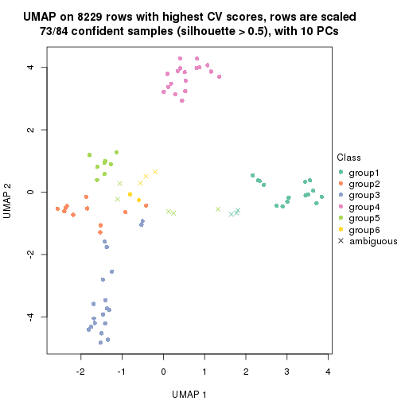</p>

</div>
</div>


Following heatmap shows how subgroups are split when increasing `k`:

```r
collect_classes(res)
```


Test correlation between subgroups and known annotations. If the known
annotation is numeric, one-way ANOVA test is applied, and if the known
annotation is discrete, chi-squared contingency table test is applied.

```r
test_to_known_factors(res)
```

```
#>             n tissue(p) k
#> CV:skmeans 83  3.39e-05 2
#> CV:skmeans 64  1.46e-07 3
#> CV:skmeans 83  4.22e-12 4
#> CV:skmeans 79  1.87e-14 5
#> CV:skmeans 73  3.70e-17 6
```


If matrix rows can be associated to genes, consider to use `GO_Enrichment(res,
...)` to perform function enrichment for the signature genes.


 

---------------------------------------------------


### CV:pam*


The object with results only for a single top-value method and a single partition method 
can be extracted as:

```r
res = res_list["CV", "pam"]
# you can also extract it by
# res = res_list["CV:pam"]
```

A summary of `res` and all the functions that can be applied to it:

```r
res
```

```
#> A 'ConsensusPartition' object with k = 2, 3, 4, 5, 6.
#>   On a matrix with 8229 rows and 84 columns.
#>   Top rows (823, 1646, 2468, 3291, 4114) are extracted by 'CV' method.
#>   Subgroups are detected by 'pam' method.
#>   Performed in total 1250 partitions by row resampling.
#>   Best k for subgroups seems to be 4.
#> 
#> Following methods can be applied to this 'ConsensusPartition' object:
#>  [1] "cola_report"             "collect_classes"         "collect_plots"          
#>  [4] "collect_stats"           "colnames"                "compare_signatures"     
#>  [7] "consensus_heatmap"       "dimension_reduction"     "functional_enrichment"  
#> [10] "get_anno_col"            "get_anno"                "get_classes"            
#> [13] "get_consensus"           "get_matrix"              "get_membership"         
#> [16] "get_param"               "get_signatures"          "get_stats"              
#> [19] "is_best_k"               "is_stable_k"             "membership_heatmap"     
#> [22] "ncol"                    "nrow"                    "plot_ecdf"              
#> [25] "rownames"                "select_partition_number" "show"                   
#> [28] "suggest_best_k"          "test_to_known_factors"
```

`collect_plots()` function collects all the plots made from `res` for all `k` (number of partitions)
into one single page to provide an easy and fast comparison between different `k`.

```r
collect_plots(res)
```

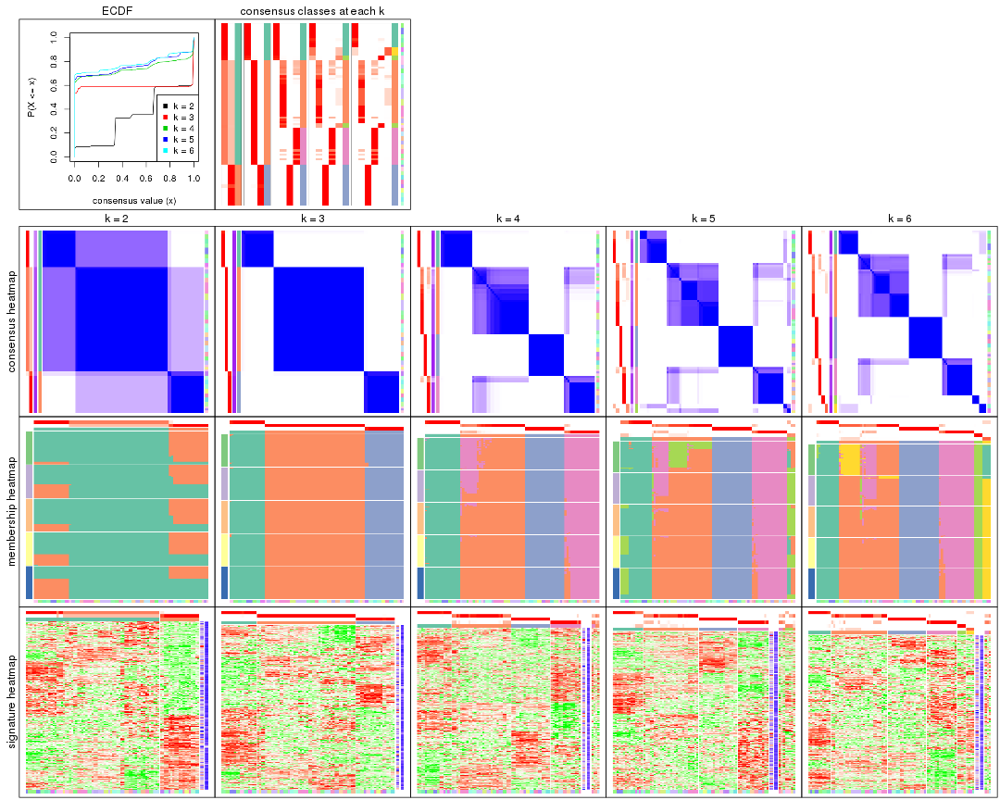

The plots are:

- The first row: a plot of the ECDF (Empirical cumulative distribution
  function) curves of the consensus matrix for each `k` and the heatmap of
  predicted classes for each `k`.
- The second row: heatmaps of the consensus matrix for each `k`.
- The third row: heatmaps of the membership matrix for each `k`.
- The fouth row: heatmaps of the signatures for each `k`.

All the plots in panels can be made by individual functions and they are
plotted later in this section.

`select_partition_number()` produces several plots showing different
statistics for choosing "optimized" `k`. There are following statistics:

- ECDF curves of the consensus matrix for each `k`;
- 1-PAC. [The PAC
  score](https://en.wikipedia.org/wiki/Consensus_clustering#Over-interpretation_potential_of_consensus_clustering)
  measures the proportion of the ambiguous subgrouping.
- Mean silhouette score.
- Concordance. The mean probability of fiting the consensus class ids in all
  partitions.
- Area increased. Denote $A_k$ as the area under the ECDF curve for current
  `k`, the area increased is defined as $A_k - A_{k-1}$.
- Rand index. The percent of pairs of samples that are both in a same cluster
  or both are not in a same cluster in the partition of k and k-1.
- Jaccard index. The ratio of pairs of samples are both in a same cluster in
  the partition of k and k-1 and the pairs of samples are both in a same
  cluster in the partition k or k-1.

The detailed explanations of these statistics can be found in [the cola
vignette](http://bioconductor.org/packages/devel/bioc/vignettes/cola/inst/doc/cola.html#toc_13).

Generally speaking, lower PAC score, higher mean silhouette score or higher
concordance corresponds to better partition. Rand index and Jaccard index
measure how similar the current partition is compared to partition with `k-1`.
If they are too similar, we won't accept `k` is better than `k-1`.

```r
select_partition_number(res)
```


The numeric values for all these statistics can be obtained by `get_stats()`.

```r
get_stats(res)
```

```
#>   k 1-PAC mean_silhouette concordance area_increased  Rand Jaccard
#> 2 2 0.485           0.834       0.851         0.3419 0.646   0.646
#> 3 3 1.000           0.996       0.999         0.7189 0.766   0.637
#> 4 4 0.904           0.884       0.948         0.2603 0.849   0.633
#> 5 5 0.828           0.806       0.890         0.0326 0.974   0.899
#> 6 6 0.878           0.869       0.917         0.0243 0.987   0.947
```

`suggest_best_k()` suggests the best $k$ based on these statistics. The rules are as follows:

- All $k$ with Jaccard index larger than 0.95 are removed because the increase of
  the partition number does not provides enough extra information. If all $k$ are removed,
  the best $k$ is assigned by `NA`.
- For $k$ with 1-PAC larger than 0.9, the maximal $k$ is taken as the "best k". Other $k$ is called "optional k".
- If it does not fit the second rule. The $k$ with the highest vote of highest
  1-PAC, mean silhouette and concordance is taken as the "best k".

```r
suggest_best_k(res)
```

```
#> [1] 4
#> attr(,"optional")
#> [1] 3
```

There is also optional best $k$ = 3 that is worth to check.

Following shows the table of the partitions (You need to click the **show/hide
code output** link to see it). The membership matrix (columns with name `p*`)
is inferred by
[`clue::cl_consensus()`](https://www.rdocumentation.org/link/cl_consensus?package=clue)
function with the `SE` method. Basically the value in the membership matrix
represents the probability to belong to a certain group. The finall class
label for an item is determined with the group with highest probability it
belongs to.

In `get_classes()` function, the entropy is calculated from the membership
matrix and the silhouette score is calculated from the consensus matrix.


<script>
$( function() {
	$( '#tabs-CV-pam-get-classes' ).tabs();
} );
</script>
<div id='tabs-CV-pam-get-classes'>
<ul>
<li><a href='#tab-CV-pam-get-classes-1'>k = 2</a></li>
<li><a href='#tab-CV-pam-get-classes-2'>k = 3</a></li>
<li><a href='#tab-CV-pam-get-classes-3'>k = 4</a></li>
<li><a href='#tab-CV-pam-get-classes-4'>k = 5</a></li>
<li><a href='#tab-CV-pam-get-classes-5'>k = 6</a></li>
</ul>

<div id='tab-CV-pam-get-classes-1'>
<p><a id='tab-CV-pam-get-classes-1-a' style='color:#0366d6' href='#'>show/hide code output</a></p>
<pre><code class="r">cbind(get_classes(res, k = 2), get_membership(res, k = 2))
</code></pre>

<pre><code>#&gt;         class entropy silhouette    p1    p2
#&gt; GSM2819     1  0.9248      0.859 0.660 0.340
#&gt; GSM2820     2  0.0000      0.978 0.000 1.000
#&gt; GSM2822     1  0.9248      0.859 0.660 0.340
#&gt; GSM2832     1  0.9248      0.859 0.660 0.340
#&gt; GSM2823     1  0.9248      0.859 0.660 0.340
#&gt; GSM2824     1  0.9248      0.859 0.660 0.340
#&gt; GSM2825     1  0.9248      0.859 0.660 0.340
#&gt; GSM2826     1  0.9248      0.859 0.660 0.340
#&gt; GSM2829     1  0.9248      0.859 0.660 0.340
#&gt; GSM2856     1  0.9248      0.859 0.660 0.340
#&gt; GSM2830     1  0.9248      0.859 0.660 0.340
#&gt; GSM2843     1  0.9248      0.859 0.660 0.340
#&gt; GSM2871     1  0.9248      0.859 0.660 0.340
#&gt; GSM2831     1  0.9248      0.859 0.660 0.340
#&gt; GSM2844     1  0.9248      0.859 0.660 0.340
#&gt; GSM2833     1  0.9248      0.859 0.660 0.340
#&gt; GSM2846     1  0.9248      0.859 0.660 0.340
#&gt; GSM2835     1  0.9248      0.859 0.660 0.340
#&gt; GSM2858     1  0.9248      0.859 0.660 0.340
#&gt; GSM2836     1  0.9248      0.859 0.660 0.340
#&gt; GSM2848     1  0.9248      0.859 0.660 0.340
#&gt; GSM2828     2  0.0000      0.978 0.000 1.000
#&gt; GSM2837     2  0.0000      0.978 0.000 1.000
#&gt; GSM2839     1  0.0000      0.625 1.000 0.000
#&gt; GSM2841     1  0.0000      0.625 1.000 0.000
#&gt; GSM2827     1  0.9248      0.859 0.660 0.340
#&gt; GSM2842     1  0.9248      0.859 0.660 0.340
#&gt; GSM2845     1  0.9248      0.859 0.660 0.340
#&gt; GSM2872     1  0.9248      0.859 0.660 0.340
#&gt; GSM2834     1  0.9248      0.859 0.660 0.340
#&gt; GSM2847     1  0.9248      0.859 0.660 0.340
#&gt; GSM2849     2  0.0000      0.978 0.000 1.000
#&gt; GSM2850     2  0.0000      0.978 0.000 1.000
#&gt; GSM2838     1  0.9248      0.859 0.660 0.340
#&gt; GSM2853     1  0.9248      0.859 0.660 0.340
#&gt; GSM2852     2  0.0000      0.978 0.000 1.000
#&gt; GSM2855     2  0.0000      0.978 0.000 1.000
#&gt; GSM2840     1  0.0000      0.625 1.000 0.000
#&gt; GSM2857     1  0.0000      0.625 1.000 0.000
#&gt; GSM2859     1  0.9248      0.859 0.660 0.340
#&gt; GSM2860     1  0.9248      0.859 0.660 0.340
#&gt; GSM2861     1  0.9248      0.859 0.660 0.340
#&gt; GSM2862     1  0.9248      0.859 0.660 0.340
#&gt; GSM2863     1  0.9248      0.859 0.660 0.340
#&gt; GSM2864     1  0.9248      0.859 0.660 0.340
#&gt; GSM2865     1  0.9248      0.859 0.660 0.340
#&gt; GSM2866     1  0.9248      0.859 0.660 0.340
#&gt; GSM2868     1  0.9248      0.859 0.660 0.340
#&gt; GSM2869     1  0.9248      0.859 0.660 0.340
#&gt; GSM2851     1  0.9248      0.859 0.660 0.340
#&gt; GSM2867     1  0.9248      0.859 0.660 0.340
#&gt; GSM2870     1  0.9248      0.859 0.660 0.340
#&gt; GSM2854     1  0.9248      0.859 0.660 0.340
#&gt; GSM2873     1  0.9248      0.859 0.660 0.340
#&gt; GSM2874     2  0.0000      0.978 0.000 1.000
#&gt; GSM2884     2  0.0000      0.978 0.000 1.000
#&gt; GSM2875     1  0.0000      0.625 1.000 0.000
#&gt; GSM2890     1  0.0000      0.625 1.000 0.000
#&gt; GSM2877     1  0.0000      0.625 1.000 0.000
#&gt; GSM2892     1  0.0000      0.625 1.000 0.000
#&gt; GSM2902     1  0.0000      0.625 1.000 0.000
#&gt; GSM2878     1  0.0000      0.625 1.000 0.000
#&gt; GSM2901     1  0.0000      0.625 1.000 0.000
#&gt; GSM2879     2  0.5519      0.778 0.128 0.872
#&gt; GSM2898     2  0.5737      0.761 0.136 0.864
#&gt; GSM2881     2  0.0000      0.978 0.000 1.000
#&gt; GSM2897     2  0.0000      0.978 0.000 1.000
#&gt; GSM2882     1  0.9248      0.859 0.660 0.340
#&gt; GSM2894     1  0.9248      0.859 0.660 0.340
#&gt; GSM2883     2  0.0000      0.978 0.000 1.000
#&gt; GSM2895     2  0.0000      0.978 0.000 1.000
#&gt; GSM2885     2  0.0000      0.978 0.000 1.000
#&gt; GSM2886     2  0.0000      0.978 0.000 1.000
#&gt; GSM2887     2  0.0000      0.978 0.000 1.000
#&gt; GSM2896     2  0.0000      0.978 0.000 1.000
#&gt; GSM2888     1  0.9248      0.859 0.660 0.340
#&gt; GSM2889     1  0.9248      0.859 0.660 0.340
#&gt; GSM2876     1  0.0000      0.625 1.000 0.000
#&gt; GSM2891     1  0.0000      0.625 1.000 0.000
#&gt; GSM2880     1  0.0000      0.625 1.000 0.000
#&gt; GSM2893     1  0.0000      0.625 1.000 0.000
#&gt; GSM2821     1  0.9129      0.851 0.672 0.328
#&gt; GSM2900     1  0.0376      0.627 0.996 0.004
#&gt; GSM2903     1  0.0672      0.630 0.992 0.008
</code></pre>

<script>
$('#tab-CV-pam-get-classes-1-a').parent().next().next().hide();
$('#tab-CV-pam-get-classes-1-a').click(function(){
  $('#tab-CV-pam-get-classes-1-a').parent().next().next().toggle();
  return(false);
});
</script>
</div>

<div id='tab-CV-pam-get-classes-2'>
<p><a id='tab-CV-pam-get-classes-2-a' style='color:#0366d6' href='#'>show/hide code output</a></p>
<pre><code class="r">cbind(get_classes(res, k = 3), get_membership(res, k = 3))
</code></pre>

<pre><code>#&gt;         class entropy silhouette    p1    p2    p3
#&gt; GSM2819     2  0.0000      1.000 0.000 1.000 0.000
#&gt; GSM2820     3  0.0000      0.996 0.000 0.000 1.000
#&gt; GSM2822     2  0.0000      1.000 0.000 1.000 0.000
#&gt; GSM2832     2  0.0000      1.000 0.000 1.000 0.000
#&gt; GSM2823     2  0.0000      1.000 0.000 1.000 0.000
#&gt; GSM2824     2  0.0000      1.000 0.000 1.000 0.000
#&gt; GSM2825     2  0.0000      1.000 0.000 1.000 0.000
#&gt; GSM2826     2  0.0000      1.000 0.000 1.000 0.000
#&gt; GSM2829     2  0.0000      1.000 0.000 1.000 0.000
#&gt; GSM2856     2  0.0000      1.000 0.000 1.000 0.000
#&gt; GSM2830     2  0.0000      1.000 0.000 1.000 0.000
#&gt; GSM2843     2  0.0000      1.000 0.000 1.000 0.000
#&gt; GSM2871     2  0.0000      1.000 0.000 1.000 0.000
#&gt; GSM2831     2  0.0000      1.000 0.000 1.000 0.000
#&gt; GSM2844     2  0.0000      1.000 0.000 1.000 0.000
#&gt; GSM2833     2  0.0000      1.000 0.000 1.000 0.000
#&gt; GSM2846     2  0.0000      1.000 0.000 1.000 0.000
#&gt; GSM2835     2  0.0000      1.000 0.000 1.000 0.000
#&gt; GSM2858     2  0.0000      1.000 0.000 1.000 0.000
#&gt; GSM2836     2  0.0000      1.000 0.000 1.000 0.000
#&gt; GSM2848     2  0.0000      1.000 0.000 1.000 0.000
#&gt; GSM2828     3  0.0000      0.996 0.000 0.000 1.000
#&gt; GSM2837     3  0.0000      0.996 0.000 0.000 1.000
#&gt; GSM2839     1  0.0000      0.995 1.000 0.000 0.000
#&gt; GSM2841     1  0.0000      0.995 1.000 0.000 0.000
#&gt; GSM2827     2  0.0000      1.000 0.000 1.000 0.000
#&gt; GSM2842     2  0.0000      1.000 0.000 1.000 0.000
#&gt; GSM2845     2  0.0000      1.000 0.000 1.000 0.000
#&gt; GSM2872     2  0.0000      1.000 0.000 1.000 0.000
#&gt; GSM2834     2  0.0000      1.000 0.000 1.000 0.000
#&gt; GSM2847     2  0.0000      1.000 0.000 1.000 0.000
#&gt; GSM2849     3  0.0000      0.996 0.000 0.000 1.000
#&gt; GSM2850     3  0.0000      0.996 0.000 0.000 1.000
#&gt; GSM2838     2  0.0000      1.000 0.000 1.000 0.000
#&gt; GSM2853     2  0.0000      1.000 0.000 1.000 0.000
#&gt; GSM2852     3  0.0000      0.996 0.000 0.000 1.000
#&gt; GSM2855     3  0.0000      0.996 0.000 0.000 1.000
#&gt; GSM2840     1  0.0000      0.995 1.000 0.000 0.000
#&gt; GSM2857     1  0.0000      0.995 1.000 0.000 0.000
#&gt; GSM2859     2  0.0000      1.000 0.000 1.000 0.000
#&gt; GSM2860     2  0.0000      1.000 0.000 1.000 0.000
#&gt; GSM2861     2  0.0000      1.000 0.000 1.000 0.000
#&gt; GSM2862     2  0.0000      1.000 0.000 1.000 0.000
#&gt; GSM2863     2  0.0000      1.000 0.000 1.000 0.000
#&gt; GSM2864     2  0.0000      1.000 0.000 1.000 0.000
#&gt; GSM2865     2  0.0000      1.000 0.000 1.000 0.000
#&gt; GSM2866     2  0.0000      1.000 0.000 1.000 0.000
#&gt; GSM2868     2  0.0000      1.000 0.000 1.000 0.000
#&gt; GSM2869     2  0.0000      1.000 0.000 1.000 0.000
#&gt; GSM2851     2  0.0000      1.000 0.000 1.000 0.000
#&gt; GSM2867     2  0.0000      1.000 0.000 1.000 0.000
#&gt; GSM2870     2  0.0000      1.000 0.000 1.000 0.000
#&gt; GSM2854     2  0.0000      1.000 0.000 1.000 0.000
#&gt; GSM2873     2  0.0000      1.000 0.000 1.000 0.000
#&gt; GSM2874     3  0.0000      0.996 0.000 0.000 1.000
#&gt; GSM2884     3  0.0000      0.996 0.000 0.000 1.000
#&gt; GSM2875     1  0.0000      0.995 1.000 0.000 0.000
#&gt; GSM2890     1  0.0000      0.995 1.000 0.000 0.000
#&gt; GSM2877     1  0.0000      0.995 1.000 0.000 0.000
#&gt; GSM2892     1  0.0000      0.995 1.000 0.000 0.000
#&gt; GSM2902     1  0.0000      0.995 1.000 0.000 0.000
#&gt; GSM2878     1  0.0000      0.995 1.000 0.000 0.000
#&gt; GSM2901     1  0.0000      0.995 1.000 0.000 0.000
#&gt; GSM2879     3  0.1163      0.963 0.000 0.028 0.972
#&gt; GSM2898     3  0.1163      0.963 0.000 0.028 0.972
#&gt; GSM2881     3  0.0000      0.996 0.000 0.000 1.000
#&gt; GSM2897     3  0.0000      0.996 0.000 0.000 1.000
#&gt; GSM2882     2  0.0000      1.000 0.000 1.000 0.000
#&gt; GSM2894     2  0.0000      1.000 0.000 1.000 0.000
#&gt; GSM2883     3  0.0000      0.996 0.000 0.000 1.000
#&gt; GSM2895     3  0.0000      0.996 0.000 0.000 1.000
#&gt; GSM2885     3  0.0000      0.996 0.000 0.000 1.000
#&gt; GSM2886     3  0.0000      0.996 0.000 0.000 1.000
#&gt; GSM2887     3  0.0000      0.996 0.000 0.000 1.000
#&gt; GSM2896     3  0.0000      0.996 0.000 0.000 1.000
#&gt; GSM2888     2  0.0000      1.000 0.000 1.000 0.000
#&gt; GSM2889     2  0.0000      1.000 0.000 1.000 0.000
#&gt; GSM2876     1  0.0000      0.995 1.000 0.000 0.000
#&gt; GSM2891     1  0.0000      0.995 1.000 0.000 0.000
#&gt; GSM2880     1  0.0000      0.995 1.000 0.000 0.000
#&gt; GSM2893     1  0.0000      0.995 1.000 0.000 0.000
#&gt; GSM2821     2  0.0000      1.000 0.000 1.000 0.000
#&gt; GSM2900     1  0.0747      0.977 0.984 0.016 0.000
#&gt; GSM2903     1  0.1643      0.941 0.956 0.044 0.000
</code></pre>

<script>
$('#tab-CV-pam-get-classes-2-a').parent().next().next().hide();
$('#tab-CV-pam-get-classes-2-a').click(function(){
  $('#tab-CV-pam-get-classes-2-a').parent().next().next().toggle();
  return(false);
});
</script>
</div>

<div id='tab-CV-pam-get-classes-3'>
<p><a id='tab-CV-pam-get-classes-3-a' style='color:#0366d6' href='#'>show/hide code output</a></p>
<pre><code class="r">cbind(get_classes(res, k = 4), get_membership(res, k = 4))
</code></pre>

<pre><code>#&gt;         class entropy silhouette    p1    p2 p3    p4
#&gt; GSM2819     2  0.3024      0.785 0.000 0.852  0 0.148
#&gt; GSM2820     3  0.0000      1.000 0.000 0.000  1 0.000
#&gt; GSM2822     2  0.4761      0.522 0.000 0.628  0 0.372
#&gt; GSM2832     2  0.4776      0.515 0.000 0.624  0 0.376
#&gt; GSM2823     2  0.4679      0.556 0.000 0.648  0 0.352
#&gt; GSM2824     2  0.4454      0.619 0.000 0.692  0 0.308
#&gt; GSM2825     2  0.4790      0.507 0.000 0.620  0 0.380
#&gt; GSM2826     2  0.4713      0.543 0.000 0.640  0 0.360
#&gt; GSM2829     4  0.0000      0.934 0.000 0.000  0 1.000
#&gt; GSM2856     4  0.0000      0.934 0.000 0.000  0 1.000
#&gt; GSM2830     4  0.0000      0.934 0.000 0.000  0 1.000
#&gt; GSM2843     4  0.0000      0.934 0.000 0.000  0 1.000
#&gt; GSM2871     2  0.4994      0.225 0.000 0.520  0 0.480
#&gt; GSM2831     4  0.0000      0.934 0.000 0.000  0 1.000
#&gt; GSM2844     4  0.0000      0.934 0.000 0.000  0 1.000
#&gt; GSM2833     4  0.0000      0.934 0.000 0.000  0 1.000
#&gt; GSM2846     4  0.0000      0.934 0.000 0.000  0 1.000
#&gt; GSM2835     4  0.0000      0.934 0.000 0.000  0 1.000
#&gt; GSM2858     4  0.0000      0.934 0.000 0.000  0 1.000
#&gt; GSM2836     2  0.0707      0.865 0.000 0.980  0 0.020
#&gt; GSM2848     2  0.2647      0.809 0.000 0.880  0 0.120
#&gt; GSM2828     3  0.0000      1.000 0.000 0.000  1 0.000
#&gt; GSM2837     3  0.0000      1.000 0.000 0.000  1 0.000
#&gt; GSM2839     1  0.0000      0.996 1.000 0.000  0 0.000
#&gt; GSM2841     1  0.0000      0.996 1.000 0.000  0 0.000
#&gt; GSM2827     2  0.0817      0.864 0.000 0.976  0 0.024
#&gt; GSM2842     2  0.0817      0.864 0.000 0.976  0 0.024
#&gt; GSM2845     4  0.4605      0.396 0.000 0.336  0 0.664
#&gt; GSM2872     4  0.0000      0.934 0.000 0.000  0 1.000
#&gt; GSM2834     4  0.3688      0.679 0.000 0.208  0 0.792
#&gt; GSM2847     4  0.0000      0.934 0.000 0.000  0 1.000
#&gt; GSM2849     3  0.0000      1.000 0.000 0.000  1 0.000
#&gt; GSM2850     3  0.0000      1.000 0.000 0.000  1 0.000
#&gt; GSM2838     2  0.0000      0.869 0.000 1.000  0 0.000
#&gt; GSM2853     2  0.0000      0.869 0.000 1.000  0 0.000
#&gt; GSM2852     3  0.0000      1.000 0.000 0.000  1 0.000
#&gt; GSM2855     3  0.0000      1.000 0.000 0.000  1 0.000
#&gt; GSM2840     1  0.0000      0.996 1.000 0.000  0 0.000
#&gt; GSM2857     1  0.0000      0.996 1.000 0.000  0 0.000
#&gt; GSM2859     2  0.0000      0.869 0.000 1.000  0 0.000
#&gt; GSM2860     2  0.0000      0.869 0.000 1.000  0 0.000
#&gt; GSM2861     2  0.0000      0.869 0.000 1.000  0 0.000
#&gt; GSM2862     2  0.0000      0.869 0.000 1.000  0 0.000
#&gt; GSM2863     2  0.0000      0.869 0.000 1.000  0 0.000
#&gt; GSM2864     2  0.0000      0.869 0.000 1.000  0 0.000
#&gt; GSM2865     2  0.0000      0.869 0.000 1.000  0 0.000
#&gt; GSM2866     2  0.0000      0.869 0.000 1.000  0 0.000
#&gt; GSM2868     2  0.0000      0.869 0.000 1.000  0 0.000
#&gt; GSM2869     2  0.0000      0.869 0.000 1.000  0 0.000
#&gt; GSM2851     2  0.0000      0.869 0.000 1.000  0 0.000
#&gt; GSM2867     2  0.0000      0.869 0.000 1.000  0 0.000
#&gt; GSM2870     2  0.0000      0.869 0.000 1.000  0 0.000
#&gt; GSM2854     4  0.4477      0.466 0.000 0.312  0 0.688
#&gt; GSM2873     2  0.4804      0.499 0.000 0.616  0 0.384
#&gt; GSM2874     3  0.0000      1.000 0.000 0.000  1 0.000
#&gt; GSM2884     3  0.0000      1.000 0.000 0.000  1 0.000
#&gt; GSM2875     1  0.0000      0.996 1.000 0.000  0 0.000
#&gt; GSM2890     1  0.0000      0.996 1.000 0.000  0 0.000
#&gt; GSM2877     1  0.0000      0.996 1.000 0.000  0 0.000
#&gt; GSM2892     1  0.0000      0.996 1.000 0.000  0 0.000
#&gt; GSM2902     1  0.0000      0.996 1.000 0.000  0 0.000
#&gt; GSM2878     1  0.0000      0.996 1.000 0.000  0 0.000
#&gt; GSM2901     1  0.0000      0.996 1.000 0.000  0 0.000
#&gt; GSM2879     3  0.0000      1.000 0.000 0.000  1 0.000
#&gt; GSM2898     3  0.0000      1.000 0.000 0.000  1 0.000
#&gt; GSM2881     3  0.0000      1.000 0.000 0.000  1 0.000
#&gt; GSM2897     3  0.0000      1.000 0.000 0.000  1 0.000
#&gt; GSM2882     4  0.0000      0.934 0.000 0.000  0 1.000
#&gt; GSM2894     4  0.0000      0.934 0.000 0.000  0 1.000
#&gt; GSM2883     3  0.0000      1.000 0.000 0.000  1 0.000
#&gt; GSM2895     3  0.0000      1.000 0.000 0.000  1 0.000
#&gt; GSM2885     3  0.0000      1.000 0.000 0.000  1 0.000
#&gt; GSM2886     3  0.0000      1.000 0.000 0.000  1 0.000
#&gt; GSM2887     3  0.0000      1.000 0.000 0.000  1 0.000
#&gt; GSM2896     3  0.0000      1.000 0.000 0.000  1 0.000
#&gt; GSM2888     2  0.1557      0.850 0.000 0.944  0 0.056
#&gt; GSM2889     2  0.0188      0.869 0.000 0.996  0 0.004
#&gt; GSM2876     1  0.0000      0.996 1.000 0.000  0 0.000
#&gt; GSM2891     1  0.0000      0.996 1.000 0.000  0 0.000
#&gt; GSM2880     1  0.0000      0.996 1.000 0.000  0 0.000
#&gt; GSM2893     1  0.0000      0.996 1.000 0.000  0 0.000
#&gt; GSM2821     2  0.1302      0.856 0.000 0.956  0 0.044
#&gt; GSM2900     1  0.0657      0.982 0.984 0.012  0 0.004
#&gt; GSM2903     1  0.1356      0.956 0.960 0.032  0 0.008
</code></pre>

<script>
$('#tab-CV-pam-get-classes-3-a').parent().next().next().hide();
$('#tab-CV-pam-get-classes-3-a').click(function(){
  $('#tab-CV-pam-get-classes-3-a').parent().next().next().toggle();
  return(false);
});
</script>
</div>

<div id='tab-CV-pam-get-classes-4'>
<p><a id='tab-CV-pam-get-classes-4-a' style='color:#0366d6' href='#'>show/hide code output</a></p>
<pre><code class="r">cbind(get_classes(res, k = 5), get_membership(res, k = 5))
</code></pre>

<pre><code>#&gt;         class entropy silhouette    p1    p2 p3    p4    p5
#&gt; GSM2819     5  0.4256      0.411 0.000 0.436  0 0.000 0.564
#&gt; GSM2820     3  0.0000      1.000 0.000 0.000  1 0.000 0.000
#&gt; GSM2822     2  0.4088      0.531 0.000 0.632  0 0.368 0.000
#&gt; GSM2832     2  0.4101      0.524 0.000 0.628  0 0.372 0.000
#&gt; GSM2823     2  0.3861      0.588 0.000 0.712  0 0.284 0.004
#&gt; GSM2824     2  0.5158      0.439 0.000 0.676  0 0.100 0.224
#&gt; GSM2825     2  0.4114      0.517 0.000 0.624  0 0.376 0.000
#&gt; GSM2826     2  0.4045      0.545 0.000 0.644  0 0.356 0.000
#&gt; GSM2829     4  0.0000      0.921 0.000 0.000  0 1.000 0.000
#&gt; GSM2856     4  0.0000      0.921 0.000 0.000  0 1.000 0.000
#&gt; GSM2830     4  0.0000      0.921 0.000 0.000  0 1.000 0.000
#&gt; GSM2843     4  0.0000      0.921 0.000 0.000  0 1.000 0.000
#&gt; GSM2871     2  0.4448      0.230 0.000 0.516  0 0.480 0.004
#&gt; GSM2831     4  0.0000      0.921 0.000 0.000  0 1.000 0.000
#&gt; GSM2844     4  0.0000      0.921 0.000 0.000  0 1.000 0.000
#&gt; GSM2833     4  0.0000      0.921 0.000 0.000  0 1.000 0.000
#&gt; GSM2846     4  0.0000      0.921 0.000 0.000  0 1.000 0.000
#&gt; GSM2835     4  0.0000      0.921 0.000 0.000  0 1.000 0.000
#&gt; GSM2858     4  0.0000      0.921 0.000 0.000  0 1.000 0.000
#&gt; GSM2836     2  0.2669      0.781 0.000 0.876  0 0.020 0.104
#&gt; GSM2848     2  0.2540      0.767 0.000 0.888  0 0.088 0.024
#&gt; GSM2828     3  0.0000      1.000 0.000 0.000  1 0.000 0.000
#&gt; GSM2837     3  0.0000      1.000 0.000 0.000  1 0.000 0.000
#&gt; GSM2839     1  0.3876      0.689 0.684 0.000  0 0.000 0.316
#&gt; GSM2841     1  0.3876      0.689 0.684 0.000  0 0.000 0.316
#&gt; GSM2827     2  0.0000      0.790 0.000 1.000  0 0.000 0.000
#&gt; GSM2842     2  0.0290      0.789 0.000 0.992  0 0.008 0.000
#&gt; GSM2845     4  0.3966      0.383 0.000 0.336  0 0.664 0.000
#&gt; GSM2872     4  0.0000      0.921 0.000 0.000  0 1.000 0.000
#&gt; GSM2834     4  0.3177      0.665 0.000 0.208  0 0.792 0.000
#&gt; GSM2847     4  0.0000      0.921 0.000 0.000  0 1.000 0.000
#&gt; GSM2849     3  0.0000      1.000 0.000 0.000  1 0.000 0.000
#&gt; GSM2850     3  0.0000      1.000 0.000 0.000  1 0.000 0.000
#&gt; GSM2838     2  0.0000      0.790 0.000 1.000  0 0.000 0.000
#&gt; GSM2853     2  0.0000      0.790 0.000 1.000  0 0.000 0.000
#&gt; GSM2852     3  0.0000      1.000 0.000 0.000  1 0.000 0.000
#&gt; GSM2855     3  0.0000      1.000 0.000 0.000  1 0.000 0.000
#&gt; GSM2840     1  0.3876      0.689 0.684 0.000  0 0.000 0.316
#&gt; GSM2857     1  0.3876      0.689 0.684 0.000  0 0.000 0.316
#&gt; GSM2859     2  0.2280      0.780 0.000 0.880  0 0.000 0.120
#&gt; GSM2860     2  0.2280      0.780 0.000 0.880  0 0.000 0.120
#&gt; GSM2861     2  0.2280      0.780 0.000 0.880  0 0.000 0.120
#&gt; GSM2862     2  0.2280      0.780 0.000 0.880  0 0.000 0.120
#&gt; GSM2863     2  0.2280      0.780 0.000 0.880  0 0.000 0.120
#&gt; GSM2864     2  0.2280      0.780 0.000 0.880  0 0.000 0.120
#&gt; GSM2865     2  0.2280      0.780 0.000 0.880  0 0.000 0.120
#&gt; GSM2866     2  0.2280      0.780 0.000 0.880  0 0.000 0.120
#&gt; GSM2868     2  0.0000      0.790 0.000 1.000  0 0.000 0.000
#&gt; GSM2869     2  0.0000      0.790 0.000 1.000  0 0.000 0.000
#&gt; GSM2851     2  0.0000      0.790 0.000 1.000  0 0.000 0.000
#&gt; GSM2867     2  0.0000      0.790 0.000 1.000  0 0.000 0.000
#&gt; GSM2870     2  0.0000      0.790 0.000 1.000  0 0.000 0.000
#&gt; GSM2854     4  0.3876      0.448 0.000 0.316  0 0.684 0.000
#&gt; GSM2873     2  0.4126      0.508 0.000 0.620  0 0.380 0.000
#&gt; GSM2874     3  0.0000      1.000 0.000 0.000  1 0.000 0.000
#&gt; GSM2884     3  0.0000      1.000 0.000 0.000  1 0.000 0.000
#&gt; GSM2875     1  0.0000      0.890 1.000 0.000  0 0.000 0.000
#&gt; GSM2890     1  0.0000      0.890 1.000 0.000  0 0.000 0.000
#&gt; GSM2877     1  0.0000      0.890 1.000 0.000  0 0.000 0.000
#&gt; GSM2892     1  0.0000      0.890 1.000 0.000  0 0.000 0.000
#&gt; GSM2902     1  0.0000      0.890 1.000 0.000  0 0.000 0.000
#&gt; GSM2878     1  0.0000      0.890 1.000 0.000  0 0.000 0.000
#&gt; GSM2901     1  0.0000      0.890 1.000 0.000  0 0.000 0.000
#&gt; GSM2879     3  0.0000      1.000 0.000 0.000  1 0.000 0.000
#&gt; GSM2898     3  0.0000      1.000 0.000 0.000  1 0.000 0.000
#&gt; GSM2881     3  0.0000      1.000 0.000 0.000  1 0.000 0.000
#&gt; GSM2897     3  0.0000      1.000 0.000 0.000  1 0.000 0.000
#&gt; GSM2882     4  0.0000      0.921 0.000 0.000  0 1.000 0.000
#&gt; GSM2894     4  0.0000      0.921 0.000 0.000  0 1.000 0.000
#&gt; GSM2883     3  0.0000      1.000 0.000 0.000  1 0.000 0.000
#&gt; GSM2895     3  0.0000      1.000 0.000 0.000  1 0.000 0.000
#&gt; GSM2885     3  0.0000      1.000 0.000 0.000  1 0.000 0.000
#&gt; GSM2886     3  0.0000      1.000 0.000 0.000  1 0.000 0.000
#&gt; GSM2887     3  0.0000      1.000 0.000 0.000  1 0.000 0.000
#&gt; GSM2896     3  0.0000      1.000 0.000 0.000  1 0.000 0.000
#&gt; GSM2888     2  0.0404      0.788 0.000 0.988  0 0.012 0.000
#&gt; GSM2889     2  0.0000      0.790 0.000 1.000  0 0.000 0.000
#&gt; GSM2876     1  0.1121      0.855 0.956 0.000  0 0.000 0.044
#&gt; GSM2891     1  0.0404      0.883 0.988 0.000  0 0.000 0.012
#&gt; GSM2880     1  0.0000      0.890 1.000 0.000  0 0.000 0.000
#&gt; GSM2893     1  0.0000      0.890 1.000 0.000  0 0.000 0.000
#&gt; GSM2821     5  0.4242      0.425 0.000 0.428  0 0.000 0.572
#&gt; GSM2900     5  0.4331      0.302 0.400 0.004  0 0.000 0.596
#&gt; GSM2903     5  0.4770      0.336 0.384 0.012  0 0.008 0.596
</code></pre>

<script>
$('#tab-CV-pam-get-classes-4-a').parent().next().next().hide();
$('#tab-CV-pam-get-classes-4-a').click(function(){
  $('#tab-CV-pam-get-classes-4-a').parent().next().next().toggle();
  return(false);
});
</script>
</div>

<div id='tab-CV-pam-get-classes-5'>
<p><a id='tab-CV-pam-get-classes-5-a' style='color:#0366d6' href='#'>show/hide code output</a></p>
<pre><code class="r">cbind(get_classes(res, k = 6), get_membership(res, k = 6))
</code></pre>

<pre><code>#&gt;         class entropy silhouette    p1    p2 p3    p4    p5    p6
#&gt; GSM2819     5  0.0260      0.987 0.000 0.008  0 0.000 0.992 0.000
#&gt; GSM2820     3  0.0000      1.000 0.000 0.000  1 0.000 0.000 0.000
#&gt; GSM2822     2  0.3911      0.537 0.000 0.624  0 0.368 0.000 0.008
#&gt; GSM2832     2  0.3923      0.530 0.000 0.620  0 0.372 0.000 0.008
#&gt; GSM2823     2  0.3855      0.644 0.000 0.704  0 0.276 0.004 0.016
#&gt; GSM2824     2  0.4361      0.603 0.000 0.700  0 0.060 0.236 0.004
#&gt; GSM2825     2  0.3695      0.523 0.000 0.624  0 0.376 0.000 0.000
#&gt; GSM2826     2  0.3874      0.557 0.000 0.636  0 0.356 0.000 0.008
#&gt; GSM2829     4  0.0000      0.921 0.000 0.000  0 1.000 0.000 0.000
#&gt; GSM2856     4  0.0000      0.921 0.000 0.000  0 1.000 0.000 0.000
#&gt; GSM2830     4  0.0000      0.921 0.000 0.000  0 1.000 0.000 0.000
#&gt; GSM2843     4  0.0000      0.921 0.000 0.000  0 1.000 0.000 0.000
#&gt; GSM2871     2  0.4183      0.242 0.000 0.508  0 0.480 0.000 0.012
#&gt; GSM2831     4  0.0000      0.921 0.000 0.000  0 1.000 0.000 0.000
#&gt; GSM2844     4  0.0000      0.921 0.000 0.000  0 1.000 0.000 0.000
#&gt; GSM2833     4  0.0000      0.921 0.000 0.000  0 1.000 0.000 0.000
#&gt; GSM2846     4  0.0000      0.921 0.000 0.000  0 1.000 0.000 0.000
#&gt; GSM2835     4  0.0000      0.921 0.000 0.000  0 1.000 0.000 0.000
#&gt; GSM2858     4  0.0000      0.921 0.000 0.000  0 1.000 0.000 0.000
#&gt; GSM2836     2  0.3284      0.794 0.000 0.784  0 0.020 0.000 0.196
#&gt; GSM2848     2  0.3123      0.799 0.000 0.836  0 0.088 0.000 0.076
#&gt; GSM2828     3  0.0000      1.000 0.000 0.000  1 0.000 0.000 0.000
#&gt; GSM2837     3  0.0000      1.000 0.000 0.000  1 0.000 0.000 0.000
#&gt; GSM2839     6  0.3133      1.000 0.212 0.000  0 0.000 0.008 0.780
#&gt; GSM2841     6  0.3133      1.000 0.212 0.000  0 0.000 0.008 0.780
#&gt; GSM2827     2  0.0363      0.807 0.000 0.988  0 0.000 0.000 0.012
#&gt; GSM2842     2  0.0146      0.807 0.000 0.996  0 0.000 0.000 0.004
#&gt; GSM2845     4  0.3563      0.374 0.000 0.336  0 0.664 0.000 0.000
#&gt; GSM2872     4  0.0000      0.921 0.000 0.000  0 1.000 0.000 0.000
#&gt; GSM2834     4  0.2854      0.668 0.000 0.208  0 0.792 0.000 0.000
#&gt; GSM2847     4  0.0000      0.921 0.000 0.000  0 1.000 0.000 0.000
#&gt; GSM2849     3  0.0000      1.000 0.000 0.000  1 0.000 0.000 0.000
#&gt; GSM2850     3  0.0000      1.000 0.000 0.000  1 0.000 0.000 0.000
#&gt; GSM2838     2  0.0146      0.807 0.000 0.996  0 0.000 0.000 0.004
#&gt; GSM2853     2  0.0146      0.807 0.000 0.996  0 0.000 0.000 0.004
#&gt; GSM2852     3  0.0000      1.000 0.000 0.000  1 0.000 0.000 0.000
#&gt; GSM2855     3  0.0000      1.000 0.000 0.000  1 0.000 0.000 0.000
#&gt; GSM2840     6  0.3133      1.000 0.212 0.000  0 0.000 0.008 0.780
#&gt; GSM2857     6  0.3133      1.000 0.212 0.000  0 0.000 0.008 0.780
#&gt; GSM2859     2  0.2912      0.792 0.000 0.784  0 0.000 0.000 0.216
#&gt; GSM2860     2  0.2912      0.792 0.000 0.784  0 0.000 0.000 0.216
#&gt; GSM2861     2  0.2912      0.792 0.000 0.784  0 0.000 0.000 0.216
#&gt; GSM2862     2  0.2912      0.792 0.000 0.784  0 0.000 0.000 0.216
#&gt; GSM2863     2  0.2912      0.792 0.000 0.784  0 0.000 0.000 0.216
#&gt; GSM2864     2  0.2912      0.792 0.000 0.784  0 0.000 0.000 0.216
#&gt; GSM2865     2  0.2912      0.792 0.000 0.784  0 0.000 0.000 0.216
#&gt; GSM2866     2  0.2912      0.792 0.000 0.784  0 0.000 0.000 0.216
#&gt; GSM2868     2  0.0146      0.807 0.000 0.996  0 0.000 0.000 0.004
#&gt; GSM2869     2  0.0146      0.807 0.000 0.996  0 0.000 0.000 0.004
#&gt; GSM2851     2  0.0146      0.807 0.000 0.996  0 0.000 0.000 0.004
#&gt; GSM2867     2  0.0146      0.807 0.000 0.996  0 0.000 0.000 0.004
#&gt; GSM2870     2  0.0146      0.807 0.000 0.996  0 0.000 0.000 0.004
#&gt; GSM2854     4  0.3601      0.443 0.000 0.312  0 0.684 0.000 0.004
#&gt; GSM2873     2  0.3945      0.514 0.000 0.612  0 0.380 0.000 0.008
#&gt; GSM2874     3  0.0000      1.000 0.000 0.000  1 0.000 0.000 0.000
#&gt; GSM2884     3  0.0000      1.000 0.000 0.000  1 0.000 0.000 0.000
#&gt; GSM2875     1  0.0000      0.984 1.000 0.000  0 0.000 0.000 0.000
#&gt; GSM2890     1  0.0000      0.984 1.000 0.000  0 0.000 0.000 0.000
#&gt; GSM2877     1  0.0000      0.984 1.000 0.000  0 0.000 0.000 0.000
#&gt; GSM2892     1  0.0000      0.984 1.000 0.000  0 0.000 0.000 0.000
#&gt; GSM2902     1  0.0000      0.984 1.000 0.000  0 0.000 0.000 0.000
#&gt; GSM2878     1  0.0000      0.984 1.000 0.000  0 0.000 0.000 0.000
#&gt; GSM2901     1  0.0000      0.984 1.000 0.000  0 0.000 0.000 0.000
#&gt; GSM2879     3  0.0000      1.000 0.000 0.000  1 0.000 0.000 0.000
#&gt; GSM2898     3  0.0000      1.000 0.000 0.000  1 0.000 0.000 0.000
#&gt; GSM2881     3  0.0000      1.000 0.000 0.000  1 0.000 0.000 0.000
#&gt; GSM2897     3  0.0000      1.000 0.000 0.000  1 0.000 0.000 0.000
#&gt; GSM2882     4  0.0000      0.921 0.000 0.000  0 1.000 0.000 0.000
#&gt; GSM2894     4  0.0000      0.921 0.000 0.000  0 1.000 0.000 0.000
#&gt; GSM2883     3  0.0000      1.000 0.000 0.000  1 0.000 0.000 0.000
#&gt; GSM2895     3  0.0000      1.000 0.000 0.000  1 0.000 0.000 0.000
#&gt; GSM2885     3  0.0000      1.000 0.000 0.000  1 0.000 0.000 0.000
#&gt; GSM2886     3  0.0000      1.000 0.000 0.000  1 0.000 0.000 0.000
#&gt; GSM2887     3  0.0000      1.000 0.000 0.000  1 0.000 0.000 0.000
#&gt; GSM2896     3  0.0000      1.000 0.000 0.000  1 0.000 0.000 0.000
#&gt; GSM2888     2  0.0146      0.807 0.000 0.996  0 0.000 0.000 0.004
#&gt; GSM2889     2  0.0146      0.807 0.000 0.996  0 0.000 0.000 0.004
#&gt; GSM2876     1  0.1714      0.875 0.908 0.000  0 0.000 0.092 0.000
#&gt; GSM2891     1  0.0632      0.961 0.976 0.000  0 0.000 0.024 0.000
#&gt; GSM2880     1  0.0000      0.984 1.000 0.000  0 0.000 0.000 0.000
#&gt; GSM2893     1  0.0000      0.984 1.000 0.000  0 0.000 0.000 0.000
#&gt; GSM2821     5  0.0000      0.996 0.000 0.000  0 0.000 1.000 0.000
#&gt; GSM2900     5  0.0000      0.996 0.000 0.000  0 0.000 1.000 0.000
#&gt; GSM2903     5  0.0000      0.996 0.000 0.000  0 0.000 1.000 0.000
</code></pre>

<script>
$('#tab-CV-pam-get-classes-5-a').parent().next().next().hide();
$('#tab-CV-pam-get-classes-5-a').click(function(){
  $('#tab-CV-pam-get-classes-5-a').parent().next().next().toggle();
  return(false);
});
</script>
</div>
</div>

Heatmaps for the consensus matrix. It visualizes the probability of two
samples to be in a same group.


<script>
$( function() {
	$( '#tabs-CV-pam-consensus-heatmap' ).tabs();
} );
</script>
<div id='tabs-CV-pam-consensus-heatmap'>
<ul>
<li><a href='#tab-CV-pam-consensus-heatmap-1'>k = 2</a></li>
<li><a href='#tab-CV-pam-consensus-heatmap-2'>k = 3</a></li>
<li><a href='#tab-CV-pam-consensus-heatmap-3'>k = 4</a></li>
<li><a href='#tab-CV-pam-consensus-heatmap-4'>k = 5</a></li>
<li><a href='#tab-CV-pam-consensus-heatmap-5'>k = 6</a></li>
</ul>
<div id='tab-CV-pam-consensus-heatmap-1'>
<pre><code class="r">consensus_heatmap(res, k = 2)
</code></pre>

<p></p>

</div>
<div id='tab-CV-pam-consensus-heatmap-2'>
<pre><code class="r">consensus_heatmap(res, k = 3)
</code></pre>

<p></p>

</div>
<div id='tab-CV-pam-consensus-heatmap-3'>
<pre><code class="r">consensus_heatmap(res, k = 4)
</code></pre>

<p></p>

</div>
<div id='tab-CV-pam-consensus-heatmap-4'>
<pre><code class="r">consensus_heatmap(res, k = 5)
</code></pre>

<p></p>

</div>
<div id='tab-CV-pam-consensus-heatmap-5'>
<pre><code class="r">consensus_heatmap(res, k = 6)
</code></pre>

<p></p>

</div>
</div>

Heatmaps for the membership of samples in all partitions to see how consistent they are:


<script>
$( function() {
	$( '#tabs-CV-pam-membership-heatmap' ).tabs();
} );
</script>
<div id='tabs-CV-pam-membership-heatmap'>
<ul>
<li><a href='#tab-CV-pam-membership-heatmap-1'>k = 2</a></li>
<li><a href='#tab-CV-pam-membership-heatmap-2'>k = 3</a></li>
<li><a href='#tab-CV-pam-membership-heatmap-3'>k = 4</a></li>
<li><a href='#tab-CV-pam-membership-heatmap-4'>k = 5</a></li>
<li><a href='#tab-CV-pam-membership-heatmap-5'>k = 6</a></li>
</ul>
<div id='tab-CV-pam-membership-heatmap-1'>
<pre><code class="r">membership_heatmap(res, k = 2)
</code></pre>

<p></p>

</div>
<div id='tab-CV-pam-membership-heatmap-2'>
<pre><code class="r">membership_heatmap(res, k = 3)
</code></pre>

<p></p>

</div>
<div id='tab-CV-pam-membership-heatmap-3'>
<pre><code class="r">membership_heatmap(res, k = 4)
</code></pre>

<p></p>

</div>
<div id='tab-CV-pam-membership-heatmap-4'>
<pre><code class="r">membership_heatmap(res, k = 5)
</code></pre>

<p></p>

</div>
<div id='tab-CV-pam-membership-heatmap-5'>
<pre><code class="r">membership_heatmap(res, k = 6)
</code></pre>

<p></p>

</div>
</div>

As soon as we have had the classes for columns, we can look for signatures
which are significantly different between classes which can be candidate marks
for certain classes. Following are the heatmaps for signatures.


Signature heatmaps where rows are scaled:


<script>
$( function() {
	$( '#tabs-CV-pam-get-signatures' ).tabs();
} );
</script>
<div id='tabs-CV-pam-get-signatures'>
<ul>
<li><a href='#tab-CV-pam-get-signatures-1'>k = 2</a></li>
<li><a href='#tab-CV-pam-get-signatures-2'>k = 3</a></li>
<li><a href='#tab-CV-pam-get-signatures-3'>k = 4</a></li>
<li><a href='#tab-CV-pam-get-signatures-4'>k = 5</a></li>
<li><a href='#tab-CV-pam-get-signatures-5'>k = 6</a></li>
</ul>
<div id='tab-CV-pam-get-signatures-1'>
<pre><code class="r">get_signatures(res, k = 2)
</code></pre>

<p></p>

</div>
<div id='tab-CV-pam-get-signatures-2'>
<pre><code class="r">get_signatures(res, k = 3)
</code></pre>

<p></p>

</div>
<div id='tab-CV-pam-get-signatures-3'>
<pre><code class="r">get_signatures(res, k = 4)
</code></pre>

<p></p>

</div>
<div id='tab-CV-pam-get-signatures-4'>
<pre><code class="r">get_signatures(res, k = 5)
</code></pre>

<p></p>

</div>
<div id='tab-CV-pam-get-signatures-5'>
<pre><code class="r">get_signatures(res, k = 6)
</code></pre>

<p></p>

</div>
</div>


Signature heatmaps where rows are not scaled:


<script>
$( function() {
	$( '#tabs-CV-pam-get-signatures-no-scale' ).tabs();
} );
</script>
<div id='tabs-CV-pam-get-signatures-no-scale'>
<ul>
<li><a href='#tab-CV-pam-get-signatures-no-scale-1'>k = 2</a></li>
<li><a href='#tab-CV-pam-get-signatures-no-scale-2'>k = 3</a></li>
<li><a href='#tab-CV-pam-get-signatures-no-scale-3'>k = 4</a></li>
<li><a href='#tab-CV-pam-get-signatures-no-scale-4'>k = 5</a></li>
<li><a href='#tab-CV-pam-get-signatures-no-scale-5'>k = 6</a></li>
</ul>
<div id='tab-CV-pam-get-signatures-no-scale-1'>
<pre><code class="r">get_signatures(res, k = 2, scale_rows = FALSE)
</code></pre>

<p></p>

</div>
<div id='tab-CV-pam-get-signatures-no-scale-2'>
<pre><code class="r">get_signatures(res, k = 3, scale_rows = FALSE)
</code></pre>

<p></p>

</div>
<div id='tab-CV-pam-get-signatures-no-scale-3'>
<pre><code class="r">get_signatures(res, k = 4, scale_rows = FALSE)
</code></pre>

<p></p>

</div>
<div id='tab-CV-pam-get-signatures-no-scale-4'>
<pre><code class="r">get_signatures(res, k = 5, scale_rows = FALSE)
</code></pre>

<p></p>

</div>
<div id='tab-CV-pam-get-signatures-no-scale-5'>
<pre><code class="r">get_signatures(res, k = 6, scale_rows = FALSE)
</code></pre>

<p></p>

</div>
</div>


Compare the overlap of signatures from different k:

```r
compare_signatures(res)
```


`get_signature()` returns a data frame invisibly. TO get the list of signatures, the function
call should be assigned to a variable explicitly. In following code, if `plot` argument is set
to `FALSE`, no heatmap is plotted while only the differential analysis is performed.

```r
# code only for demonstration
tb = get_signature(res, k = ..., plot = FALSE)
```

An example of the output of `tb` is:

```
#>   which_row         fdr    mean_1    mean_2 scaled_mean_1 scaled_mean_2 km
#> 1        38 0.042760348  8.373488  9.131774    -0.5533452     0.5164555  1
#> 2        40 0.018707592  7.106213  8.469186    -0.6173731     0.5762149  1
#> 3        55 0.019134737 10.221463 11.207825    -0.6159697     0.5749050  1
#> 4        59 0.006059896  5.921854  7.869574    -0.6899429     0.6439467  1
#> 5        60 0.018055526  8.928898 10.211722    -0.6204761     0.5791110  1
#> 6        98 0.009384629 15.714769 14.887706     0.6635654    -0.6193277  2
...
```

The columns in `tb` are:

1. `which_row`: row indices corresponding to the input matrix.
2. `fdr`: FDR for the differential test. 
3. `mean_x`: The mean value in group x.
4. `scaled_mean_x`: The mean value in group x after rows are scaled.
5. `km`: Row groups if k-means clustering is applied to rows.


UMAP plot which shows how samples are separated.


<script>
$( function() {
	$( '#tabs-CV-pam-dimension-reduction' ).tabs();
} );
</script>
<div id='tabs-CV-pam-dimension-reduction'>
<ul>
<li><a href='#tab-CV-pam-dimension-reduction-1'>k = 2</a></li>
<li><a href='#tab-CV-pam-dimension-reduction-2'>k = 3</a></li>
<li><a href='#tab-CV-pam-dimension-reduction-3'>k = 4</a></li>
<li><a href='#tab-CV-pam-dimension-reduction-4'>k = 5</a></li>
<li><a href='#tab-CV-pam-dimension-reduction-5'>k = 6</a></li>
</ul>
<div id='tab-CV-pam-dimension-reduction-1'>
<pre><code class="r">dimension_reduction(res, k = 2, method = &quot;UMAP&quot;)
</code></pre>

<p></p>

</div>
<div id='tab-CV-pam-dimension-reduction-2'>
<pre><code class="r">dimension_reduction(res, k = 3, method = &quot;UMAP&quot;)
</code></pre>

<p></p>

</div>
<div id='tab-CV-pam-dimension-reduction-3'>
<pre><code class="r">dimension_reduction(res, k = 4, method = &quot;UMAP&quot;)
</code></pre>

<p></p>

</div>
<div id='tab-CV-pam-dimension-reduction-4'>
<pre><code class="r">dimension_reduction(res, k = 5, method = &quot;UMAP&quot;)
</code></pre>

<p></p>

</div>
<div id='tab-CV-pam-dimension-reduction-5'>
<pre><code class="r">dimension_reduction(res, k = 6, method = &quot;UMAP&quot;)
</code></pre>

<p></p>

</div>
</div>


Following heatmap shows how subgroups are split when increasing `k`:

```r
collect_classes(res)
```


Test correlation between subgroups and known annotations. If the known
annotation is numeric, one-way ANOVA test is applied, and if the known
annotation is discrete, chi-squared contingency table test is applied.

```r
test_to_known_factors(res)
```

```
#>         n tissue(p) k
#> CV:pam 84  2.53e-05 2
#> CV:pam 84  2.34e-08 3
#> CV:pam 80  6.57e-11 4
#> CV:pam 76  1.38e-10 5
#> CV:pam 81  1.23e-17 6
```


If matrix rows can be associated to genes, consider to use `GO_Enrichment(res,
...)` to perform function enrichment for the signature genes.


 

---------------------------------------------------


### CV:mclust**


The object with results only for a single top-value method and a single partition method 
can be extracted as:

```r
res = res_list["CV", "mclust"]
# you can also extract it by
# res = res_list["CV:mclust"]
```

A summary of `res` and all the functions that can be applied to it:

```r
res
```

```
#> A 'ConsensusPartition' object with k = 2, 3, 4, 5, 6.
#>   On a matrix with 8229 rows and 84 columns.
#>   Top rows (823, 1646, 2468, 3291, 4114) are extracted by 'CV' method.
#>   Subgroups are detected by 'mclust' method.
#>   Performed in total 1250 partitions by row resampling.
#>   Best k for subgroups seems to be 3.
#> 
#> Following methods can be applied to this 'ConsensusPartition' object:
#>  [1] "cola_report"             "collect_classes"         "collect_plots"          
#>  [4] "collect_stats"           "colnames"                "compare_signatures"     
#>  [7] "consensus_heatmap"       "dimension_reduction"     "functional_enrichment"  
#> [10] "get_anno_col"            "get_anno"                "get_classes"            
#> [13] "get_consensus"           "get_matrix"              "get_membership"         
#> [16] "get_param"               "get_signatures"          "get_stats"              
#> [19] "is_best_k"               "is_stable_k"             "membership_heatmap"     
#> [22] "ncol"                    "nrow"                    "plot_ecdf"              
#> [25] "rownames"                "select_partition_number" "show"                   
#> [28] "suggest_best_k"          "test_to_known_factors"
```

`collect_plots()` function collects all the plots made from `res` for all `k` (number of partitions)
into one single page to provide an easy and fast comparison between different `k`.

```r
collect_plots(res)
```


The plots are:

- The first row: a plot of the ECDF (Empirical cumulative distribution
  function) curves of the consensus matrix for each `k` and the heatmap of
  predicted classes for each `k`.
- The second row: heatmaps of the consensus matrix for each `k`.
- The third row: heatmaps of the membership matrix for each `k`.
- The fouth row: heatmaps of the signatures for each `k`.

All the plots in panels can be made by individual functions and they are
plotted later in this section.

`select_partition_number()` produces several plots showing different
statistics for choosing "optimized" `k`. There are following statistics:

- ECDF curves of the consensus matrix for each `k`;
- 1-PAC. [The PAC
  score](https://en.wikipedia.org/wiki/Consensus_clustering#Over-interpretation_potential_of_consensus_clustering)
  measures the proportion of the ambiguous subgrouping.
- Mean silhouette score.
- Concordance. The mean probability of fiting the consensus class ids in all
  partitions.
- Area increased. Denote $A_k$ as the area under the ECDF curve for current
  `k`, the area increased is defined as $A_k - A_{k-1}$.
- Rand index. The percent of pairs of samples that are both in a same cluster
  or both are not in a same cluster in the partition of k and k-1.
- Jaccard index. The ratio of pairs of samples are both in a same cluster in
  the partition of k and k-1 and the pairs of samples are both in a same
  cluster in the partition k or k-1.

The detailed explanations of these statistics can be found in [the cola
vignette](http://bioconductor.org/packages/devel/bioc/vignettes/cola/inst/doc/cola.html#toc_13).

Generally speaking, lower PAC score, higher mean silhouette score or higher
concordance corresponds to better partition. Rand index and Jaccard index
measure how similar the current partition is compared to partition with `k-1`.
If they are too similar, we won't accept `k` is better than `k-1`.

```r
select_partition_number(res)
```


The numeric values for all these statistics can be obtained by `get_stats()`.

```r
get_stats(res)
```

```
#>   k 1-PAC mean_silhouette concordance area_increased  Rand Jaccard
#> 2 2 0.220           0.484       0.677         0.5035 0.620   0.620
#> 3 3 0.958           0.900       0.957         0.2795 0.690   0.519
#> 4 4 0.783           0.859       0.915         0.1531 0.818   0.533
#> 5 5 0.813           0.780       0.889         0.0654 0.882   0.572
#> 6 6 0.840           0.778       0.869         0.0398 0.940   0.715
```

`suggest_best_k()` suggests the best $k$ based on these statistics. The rules are as follows:

- All $k$ with Jaccard index larger than 0.95 are removed because the increase of
  the partition number does not provides enough extra information. If all $k$ are removed,
  the best $k$ is assigned by `NA`.
- For $k$ with 1-PAC larger than 0.9, the maximal $k$ is taken as the "best k". Other $k$ is called "optional k".
- If it does not fit the second rule. The $k$ with the highest vote of highest
  1-PAC, mean silhouette and concordance is taken as the "best k".

```r
suggest_best_k(res)
```

```
#> [1] 3
```


Following shows the table of the partitions (You need to click the **show/hide
code output** link to see it). The membership matrix (columns with name `p*`)
is inferred by
[`clue::cl_consensus()`](https://www.rdocumentation.org/link/cl_consensus?package=clue)
function with the `SE` method. Basically the value in the membership matrix
represents the probability to belong to a certain group. The finall class
label for an item is determined with the group with highest probability it
belongs to.

In `get_classes()` function, the entropy is calculated from the membership
matrix and the silhouette score is calculated from the consensus matrix.


<script>
$( function() {
	$( '#tabs-CV-mclust-get-classes' ).tabs();
} );
</script>
<div id='tabs-CV-mclust-get-classes'>
<ul>
<li><a href='#tab-CV-mclust-get-classes-1'>k = 2</a></li>
<li><a href='#tab-CV-mclust-get-classes-2'>k = 3</a></li>
<li><a href='#tab-CV-mclust-get-classes-3'>k = 4</a></li>
<li><a href='#tab-CV-mclust-get-classes-4'>k = 5</a></li>
<li><a href='#tab-CV-mclust-get-classes-5'>k = 6</a></li>
</ul>

<div id='tab-CV-mclust-get-classes-1'>
<p><a id='tab-CV-mclust-get-classes-1-a' style='color:#0366d6' href='#'>show/hide code output</a></p>
<pre><code class="r">cbind(get_classes(res, k = 2), get_membership(res, k = 2))
</code></pre>

<pre><code>#&gt;         class entropy silhouette    p1    p2
#&gt; GSM2819     1   0.625      0.463 0.844 0.156
#&gt; GSM2820     2   0.000      0.944 0.000 1.000
#&gt; GSM2822     1   0.469      0.492 0.900 0.100
#&gt; GSM2832     1   0.469      0.492 0.900 0.100
#&gt; GSM2823     2   0.866      0.385 0.288 0.712
#&gt; GSM2824     2   0.866      0.385 0.288 0.712
#&gt; GSM2825     1   0.430      0.467 0.912 0.088
#&gt; GSM2826     1   0.430      0.467 0.912 0.088
#&gt; GSM2829     1   0.850      0.431 0.724 0.276
#&gt; GSM2856     1   0.850      0.431 0.724 0.276
#&gt; GSM2830     1   0.850      0.431 0.724 0.276
#&gt; GSM2843     1   0.850      0.431 0.724 0.276
#&gt; GSM2871     1   0.850      0.431 0.724 0.276
#&gt; GSM2831     1   0.850      0.431 0.724 0.276
#&gt; GSM2844     1   0.850      0.431 0.724 0.276
#&gt; GSM2833     1   0.850      0.431 0.724 0.276
#&gt; GSM2846     1   0.850      0.431 0.724 0.276
#&gt; GSM2835     1   0.850      0.431 0.724 0.276
#&gt; GSM2858     1   0.850      0.431 0.724 0.276
#&gt; GSM2836     1   0.861      0.434 0.716 0.284
#&gt; GSM2848     1   0.861      0.434 0.716 0.284
#&gt; GSM2828     2   0.000      0.944 0.000 1.000
#&gt; GSM2837     2   0.000      0.944 0.000 1.000
#&gt; GSM2839     1   0.980      0.148 0.584 0.416
#&gt; GSM2841     1   0.980      0.148 0.584 0.416
#&gt; GSM2827     1   0.952      0.369 0.628 0.372
#&gt; GSM2842     1   0.909      0.412 0.676 0.324
#&gt; GSM2845     1   0.850      0.431 0.724 0.276
#&gt; GSM2872     1   0.850      0.431 0.724 0.276
#&gt; GSM2834     1   0.850      0.431 0.724 0.276
#&gt; GSM2847     1   0.850      0.431 0.724 0.276
#&gt; GSM2849     2   0.000      0.944 0.000 1.000
#&gt; GSM2850     2   0.000      0.944 0.000 1.000
#&gt; GSM2838     1   0.886      0.421 0.696 0.304
#&gt; GSM2853     1   0.886      0.421 0.696 0.304
#&gt; GSM2852     2   0.000      0.944 0.000 1.000
#&gt; GSM2855     2   0.000      0.944 0.000 1.000
#&gt; GSM2840     1   0.980      0.148 0.584 0.416
#&gt; GSM2857     1   0.980      0.148 0.584 0.416
#&gt; GSM2859     1   0.886      0.421 0.696 0.304
#&gt; GSM2860     1   0.886      0.421 0.696 0.304
#&gt; GSM2861     1   0.886      0.421 0.696 0.304
#&gt; GSM2862     1   0.886      0.421 0.696 0.304
#&gt; GSM2863     1   0.886      0.421 0.696 0.304
#&gt; GSM2864     1   0.886      0.421 0.696 0.304
#&gt; GSM2865     1   0.886      0.421 0.696 0.304
#&gt; GSM2866     1   0.886      0.421 0.696 0.304
#&gt; GSM2868     1   0.886      0.421 0.696 0.304
#&gt; GSM2869     1   0.886      0.421 0.696 0.304
#&gt; GSM2851     1   0.886      0.421 0.696 0.304
#&gt; GSM2867     1   0.886      0.421 0.696 0.304
#&gt; GSM2870     1   0.886      0.421 0.696 0.304
#&gt; GSM2854     1   0.850      0.431 0.724 0.276
#&gt; GSM2873     1   0.141      0.490 0.980 0.020
#&gt; GSM2874     2   0.000      0.944 0.000 1.000
#&gt; GSM2884     2   0.000      0.944 0.000 1.000
#&gt; GSM2875     1   0.980      0.148 0.584 0.416
#&gt; GSM2890     1   0.980      0.148 0.584 0.416
#&gt; GSM2877     1   0.980      0.148 0.584 0.416
#&gt; GSM2892     1   0.980      0.148 0.584 0.416
#&gt; GSM2902     1   0.980      0.148 0.584 0.416
#&gt; GSM2878     1   0.980      0.148 0.584 0.416
#&gt; GSM2901     1   0.980      0.148 0.584 0.416
#&gt; GSM2879     2   0.000      0.944 0.000 1.000
#&gt; GSM2898     2   0.000      0.944 0.000 1.000
#&gt; GSM2881     2   0.000      0.944 0.000 1.000
#&gt; GSM2897     2   0.000      0.944 0.000 1.000
#&gt; GSM2882     1   0.850      0.431 0.724 0.276
#&gt; GSM2894     1   0.850      0.431 0.724 0.276
#&gt; GSM2883     2   0.000      0.944 0.000 1.000
#&gt; GSM2895     2   0.000      0.944 0.000 1.000
#&gt; GSM2885     2   0.000      0.944 0.000 1.000
#&gt; GSM2886     2   0.000      0.944 0.000 1.000
#&gt; GSM2887     2   0.000      0.944 0.000 1.000
#&gt; GSM2896     2   0.000      0.944 0.000 1.000
#&gt; GSM2888     1   0.943      0.365 0.640 0.360
#&gt; GSM2889     1   0.946      0.360 0.636 0.364
#&gt; GSM2876     1   0.980      0.148 0.584 0.416
#&gt; GSM2891     1   0.980      0.148 0.584 0.416
#&gt; GSM2880     1   0.980      0.148 0.584 0.416
#&gt; GSM2893     1   0.980      0.148 0.584 0.416
#&gt; GSM2821     1   0.980      0.148 0.584 0.416
#&gt; GSM2900     1   0.980      0.148 0.584 0.416
#&gt; GSM2903     1   0.980      0.148 0.584 0.416
</code></pre>

<script>
$('#tab-CV-mclust-get-classes-1-a').parent().next().next().hide();
$('#tab-CV-mclust-get-classes-1-a').click(function(){
  $('#tab-CV-mclust-get-classes-1-a').parent().next().next().toggle();
  return(false);
});
</script>
</div>

<div id='tab-CV-mclust-get-classes-2'>
<p><a id='tab-CV-mclust-get-classes-2-a' style='color:#0366d6' href='#'>show/hide code output</a></p>
<pre><code class="r">cbind(get_classes(res, k = 3), get_membership(res, k = 3))
</code></pre>

<pre><code>#&gt;         class entropy silhouette    p1    p2    p3
#&gt; GSM2819     1  0.0237     0.9491 0.996 0.004 0.000
#&gt; GSM2820     3  0.0237     0.9443 0.004 0.000 0.996
#&gt; GSM2822     2  0.6308     0.0551 0.492 0.508 0.000
#&gt; GSM2832     2  0.5650     0.5527 0.312 0.688 0.000
#&gt; GSM2823     1  0.6386     0.3334 0.584 0.004 0.412
#&gt; GSM2824     1  0.6386     0.3334 0.584 0.004 0.412
#&gt; GSM2825     1  0.2261     0.8855 0.932 0.068 0.000
#&gt; GSM2826     1  0.2356     0.8839 0.928 0.072 0.000
#&gt; GSM2829     2  0.0424     0.9579 0.008 0.992 0.000
#&gt; GSM2856     2  0.0424     0.9579 0.008 0.992 0.000
#&gt; GSM2830     2  0.0424     0.9579 0.008 0.992 0.000
#&gt; GSM2843     2  0.0424     0.9579 0.008 0.992 0.000
#&gt; GSM2871     2  0.0424     0.9579 0.008 0.992 0.000
#&gt; GSM2831     2  0.0424     0.9579 0.008 0.992 0.000
#&gt; GSM2844     2  0.0424     0.9579 0.008 0.992 0.000
#&gt; GSM2833     2  0.0424     0.9579 0.008 0.992 0.000
#&gt; GSM2846     2  0.0424     0.9579 0.008 0.992 0.000
#&gt; GSM2835     2  0.0424     0.9579 0.008 0.992 0.000
#&gt; GSM2858     2  0.0424     0.9579 0.008 0.992 0.000
#&gt; GSM2836     2  0.0237     0.9559 0.000 0.996 0.004
#&gt; GSM2848     2  0.0237     0.9559 0.000 0.996 0.004
#&gt; GSM2828     3  0.0237     0.9443 0.004 0.000 0.996
#&gt; GSM2837     3  0.0237     0.9443 0.004 0.000 0.996
#&gt; GSM2839     1  0.0000     0.9529 1.000 0.000 0.000
#&gt; GSM2841     1  0.0000     0.9529 1.000 0.000 0.000
#&gt; GSM2827     2  0.0237     0.9566 0.004 0.996 0.000
#&gt; GSM2842     2  0.0237     0.9566 0.004 0.996 0.000
#&gt; GSM2845     2  0.0424     0.9579 0.008 0.992 0.000
#&gt; GSM2872     2  0.0424     0.9579 0.008 0.992 0.000
#&gt; GSM2834     2  0.0424     0.9579 0.008 0.992 0.000
#&gt; GSM2847     2  0.0424     0.9579 0.008 0.992 0.000
#&gt; GSM2849     3  0.0237     0.9443 0.004 0.000 0.996
#&gt; GSM2850     3  0.0237     0.9443 0.004 0.000 0.996
#&gt; GSM2838     2  0.1163     0.9478 0.000 0.972 0.028
#&gt; GSM2853     2  0.0424     0.9554 0.000 0.992 0.008
#&gt; GSM2852     3  0.0661     0.9408 0.004 0.008 0.988
#&gt; GSM2855     3  0.0661     0.9408 0.004 0.008 0.988
#&gt; GSM2840     1  0.0000     0.9529 1.000 0.000 0.000
#&gt; GSM2857     1  0.0000     0.9529 1.000 0.000 0.000
#&gt; GSM2859     2  0.0892     0.9516 0.000 0.980 0.020
#&gt; GSM2860     2  0.1860     0.9327 0.000 0.948 0.052
#&gt; GSM2861     2  0.3349     0.8737 0.004 0.888 0.108
#&gt; GSM2862     2  0.1860     0.9327 0.000 0.948 0.052
#&gt; GSM2863     2  0.0592     0.9544 0.000 0.988 0.012
#&gt; GSM2864     2  0.1411     0.9436 0.000 0.964 0.036
#&gt; GSM2865     2  0.0892     0.9517 0.000 0.980 0.020
#&gt; GSM2866     2  0.0237     0.9566 0.004 0.996 0.000
#&gt; GSM2868     2  0.3528     0.8873 0.016 0.892 0.092
#&gt; GSM2869     2  0.1529     0.9411 0.000 0.960 0.040
#&gt; GSM2851     2  0.1411     0.9435 0.000 0.964 0.036
#&gt; GSM2867     2  0.2749     0.9174 0.012 0.924 0.064
#&gt; GSM2870     2  0.2537     0.9095 0.000 0.920 0.080
#&gt; GSM2854     2  0.0424     0.9579 0.008 0.992 0.000
#&gt; GSM2873     2  0.0237     0.9572 0.004 0.996 0.000
#&gt; GSM2874     3  0.0237     0.9443 0.004 0.000 0.996
#&gt; GSM2884     3  0.0237     0.9443 0.004 0.000 0.996
#&gt; GSM2875     1  0.0000     0.9529 1.000 0.000 0.000
#&gt; GSM2890     1  0.0000     0.9529 1.000 0.000 0.000
#&gt; GSM2877     1  0.0000     0.9529 1.000 0.000 0.000
#&gt; GSM2892     1  0.0000     0.9529 1.000 0.000 0.000
#&gt; GSM2902     1  0.0000     0.9529 1.000 0.000 0.000
#&gt; GSM2878     1  0.0000     0.9529 1.000 0.000 0.000
#&gt; GSM2901     1  0.0000     0.9529 1.000 0.000 0.000
#&gt; GSM2879     3  0.0661     0.9408 0.004 0.008 0.988
#&gt; GSM2898     3  0.0661     0.9408 0.004 0.008 0.988
#&gt; GSM2881     3  0.0237     0.9443 0.004 0.000 0.996
#&gt; GSM2897     3  0.0237     0.9443 0.004 0.000 0.996
#&gt; GSM2882     2  0.0424     0.9579 0.008 0.992 0.000
#&gt; GSM2894     2  0.0424     0.9579 0.008 0.992 0.000
#&gt; GSM2883     3  0.0237     0.9443 0.004 0.000 0.996
#&gt; GSM2895     3  0.0237     0.9443 0.004 0.000 0.996
#&gt; GSM2885     3  0.0237     0.9443 0.004 0.000 0.996
#&gt; GSM2886     3  0.0237     0.9443 0.004 0.000 0.996
#&gt; GSM2887     3  0.0475     0.9429 0.004 0.004 0.992
#&gt; GSM2896     3  0.0475     0.9429 0.004 0.004 0.992
#&gt; GSM2888     3  0.6421     0.2599 0.004 0.424 0.572
#&gt; GSM2889     3  0.6421     0.2599 0.004 0.424 0.572
#&gt; GSM2876     1  0.0000     0.9529 1.000 0.000 0.000
#&gt; GSM2891     1  0.0000     0.9529 1.000 0.000 0.000
#&gt; GSM2880     1  0.0000     0.9529 1.000 0.000 0.000
#&gt; GSM2893     1  0.0000     0.9529 1.000 0.000 0.000
#&gt; GSM2821     1  0.0000     0.9529 1.000 0.000 0.000
#&gt; GSM2900     1  0.0000     0.9529 1.000 0.000 0.000
#&gt; GSM2903     1  0.0000     0.9529 1.000 0.000 0.000
</code></pre>

<script>
$('#tab-CV-mclust-get-classes-2-a').parent().next().next().hide();
$('#tab-CV-mclust-get-classes-2-a').click(function(){
  $('#tab-CV-mclust-get-classes-2-a').parent().next().next().toggle();
  return(false);
});
</script>
</div>

<div id='tab-CV-mclust-get-classes-3'>
<p><a id='tab-CV-mclust-get-classes-3-a' style='color:#0366d6' href='#'>show/hide code output</a></p>
<pre><code class="r">cbind(get_classes(res, k = 4), get_membership(res, k = 4))
</code></pre>

<pre><code>#&gt;         class entropy silhouette    p1    p2    p3    p4
#&gt; GSM2819     1   0.228      0.897 0.904 0.096 0.000 0.000
#&gt; GSM2820     3   0.000      0.826 0.000 0.000 1.000 0.000
#&gt; GSM2822     1   0.447      0.778 0.784 0.036 0.000 0.180
#&gt; GSM2832     1   0.451      0.773 0.780 0.036 0.000 0.184
#&gt; GSM2823     3   0.744      0.343 0.172 0.384 0.444 0.000
#&gt; GSM2824     3   0.744      0.343 0.172 0.384 0.444 0.000
#&gt; GSM2825     1   0.280      0.875 0.884 0.008 0.000 0.108
#&gt; GSM2826     1   0.280      0.875 0.884 0.008 0.000 0.108
#&gt; GSM2829     4   0.000      1.000 0.000 0.000 0.000 1.000
#&gt; GSM2856     4   0.000      1.000 0.000 0.000 0.000 1.000
#&gt; GSM2830     4   0.000      1.000 0.000 0.000 0.000 1.000
#&gt; GSM2843     4   0.000      1.000 0.000 0.000 0.000 1.000
#&gt; GSM2871     4   0.000      1.000 0.000 0.000 0.000 1.000
#&gt; GSM2831     4   0.000      1.000 0.000 0.000 0.000 1.000
#&gt; GSM2844     4   0.000      1.000 0.000 0.000 0.000 1.000
#&gt; GSM2833     4   0.000      1.000 0.000 0.000 0.000 1.000
#&gt; GSM2846     4   0.000      1.000 0.000 0.000 0.000 1.000
#&gt; GSM2835     4   0.000      1.000 0.000 0.000 0.000 1.000
#&gt; GSM2858     4   0.000      1.000 0.000 0.000 0.000 1.000
#&gt; GSM2836     2   0.542      0.778 0.148 0.740 0.000 0.112
#&gt; GSM2848     2   0.542      0.778 0.148 0.740 0.000 0.112
#&gt; GSM2828     3   0.000      0.826 0.000 0.000 1.000 0.000
#&gt; GSM2837     3   0.000      0.826 0.000 0.000 1.000 0.000
#&gt; GSM2839     1   0.000      0.951 1.000 0.000 0.000 0.000
#&gt; GSM2841     1   0.000      0.951 1.000 0.000 0.000 0.000
#&gt; GSM2827     2   0.557      0.770 0.148 0.728 0.000 0.124
#&gt; GSM2842     2   0.547      0.776 0.148 0.736 0.000 0.116
#&gt; GSM2845     4   0.000      1.000 0.000 0.000 0.000 1.000
#&gt; GSM2872     4   0.000      1.000 0.000 0.000 0.000 1.000
#&gt; GSM2834     4   0.000      1.000 0.000 0.000 0.000 1.000
#&gt; GSM2847     4   0.000      1.000 0.000 0.000 0.000 1.000
#&gt; GSM2849     3   0.000      0.826 0.000 0.000 1.000 0.000
#&gt; GSM2850     3   0.000      0.826 0.000 0.000 1.000 0.000
#&gt; GSM2838     2   0.112      0.895 0.000 0.964 0.000 0.036
#&gt; GSM2853     2   0.121      0.894 0.000 0.960 0.000 0.040
#&gt; GSM2852     3   0.734      0.390 0.164 0.360 0.476 0.000
#&gt; GSM2855     3   0.734      0.390 0.164 0.360 0.476 0.000
#&gt; GSM2840     1   0.000      0.951 1.000 0.000 0.000 0.000
#&gt; GSM2857     1   0.000      0.951 1.000 0.000 0.000 0.000
#&gt; GSM2859     2   0.139      0.891 0.000 0.952 0.000 0.048
#&gt; GSM2860     2   0.112      0.895 0.000 0.964 0.000 0.036
#&gt; GSM2861     2   0.139      0.891 0.000 0.952 0.000 0.048
#&gt; GSM2862     2   0.112      0.895 0.000 0.964 0.000 0.036
#&gt; GSM2863     2   0.112      0.895 0.000 0.964 0.000 0.036
#&gt; GSM2864     2   0.112      0.895 0.000 0.964 0.000 0.036
#&gt; GSM2865     2   0.112      0.895 0.000 0.964 0.000 0.036
#&gt; GSM2866     2   0.309      0.865 0.060 0.888 0.000 0.052
#&gt; GSM2868     2   0.112      0.895 0.000 0.964 0.000 0.036
#&gt; GSM2869     2   0.112      0.895 0.000 0.964 0.000 0.036
#&gt; GSM2851     2   0.102      0.893 0.000 0.968 0.000 0.032
#&gt; GSM2867     2   0.102      0.893 0.000 0.968 0.000 0.032
#&gt; GSM2870     2   0.112      0.895 0.000 0.964 0.000 0.036
#&gt; GSM2854     4   0.000      1.000 0.000 0.000 0.000 1.000
#&gt; GSM2873     2   0.724      0.379 0.148 0.476 0.000 0.376
#&gt; GSM2874     3   0.000      0.826 0.000 0.000 1.000 0.000
#&gt; GSM2884     3   0.000      0.826 0.000 0.000 1.000 0.000
#&gt; GSM2875     1   0.000      0.951 1.000 0.000 0.000 0.000
#&gt; GSM2890     1   0.000      0.951 1.000 0.000 0.000 0.000
#&gt; GSM2877     1   0.000      0.951 1.000 0.000 0.000 0.000
#&gt; GSM2892     1   0.000      0.951 1.000 0.000 0.000 0.000
#&gt; GSM2902     1   0.000      0.951 1.000 0.000 0.000 0.000
#&gt; GSM2878     1   0.000      0.951 1.000 0.000 0.000 0.000
#&gt; GSM2901     1   0.000      0.951 1.000 0.000 0.000 0.000
#&gt; GSM2879     3   0.698      0.551 0.164 0.264 0.572 0.000
#&gt; GSM2898     3   0.698      0.551 0.164 0.264 0.572 0.000
#&gt; GSM2881     3   0.000      0.826 0.000 0.000 1.000 0.000
#&gt; GSM2897     3   0.000      0.826 0.000 0.000 1.000 0.000
#&gt; GSM2882     4   0.000      1.000 0.000 0.000 0.000 1.000
#&gt; GSM2894     4   0.000      1.000 0.000 0.000 0.000 1.000
#&gt; GSM2883     3   0.512      0.705 0.164 0.080 0.756 0.000
#&gt; GSM2895     3   0.512      0.705 0.164 0.080 0.756 0.000
#&gt; GSM2885     3   0.000      0.826 0.000 0.000 1.000 0.000
#&gt; GSM2886     3   0.000      0.826 0.000 0.000 1.000 0.000
#&gt; GSM2887     3   0.000      0.826 0.000 0.000 1.000 0.000
#&gt; GSM2896     3   0.000      0.826 0.000 0.000 1.000 0.000
#&gt; GSM2888     2   0.508      0.721 0.148 0.780 0.056 0.016
#&gt; GSM2889     2   0.508      0.721 0.148 0.780 0.056 0.016
#&gt; GSM2876     1   0.000      0.951 1.000 0.000 0.000 0.000
#&gt; GSM2891     1   0.000      0.951 1.000 0.000 0.000 0.000
#&gt; GSM2880     1   0.000      0.951 1.000 0.000 0.000 0.000
#&gt; GSM2893     1   0.000      0.951 1.000 0.000 0.000 0.000
#&gt; GSM2821     1   0.208      0.905 0.916 0.084 0.000 0.000
#&gt; GSM2900     1   0.208      0.905 0.916 0.084 0.000 0.000
#&gt; GSM2903     1   0.208      0.905 0.916 0.084 0.000 0.000
</code></pre>

<script>
$('#tab-CV-mclust-get-classes-3-a').parent().next().next().hide();
$('#tab-CV-mclust-get-classes-3-a').click(function(){
  $('#tab-CV-mclust-get-classes-3-a').parent().next().next().toggle();
  return(false);
});
</script>
</div>

<div id='tab-CV-mclust-get-classes-4'>
<p><a id='tab-CV-mclust-get-classes-4-a' style='color:#0366d6' href='#'>show/hide code output</a></p>
<pre><code class="r">cbind(get_classes(res, k = 5), get_membership(res, k = 5))
</code></pre>

<pre><code>#&gt;         class entropy silhouette    p1    p2    p3    p4    p5
#&gt; GSM2819     5  0.5038     0.6389 0.132 0.164 0.000 0.000 0.704
#&gt; GSM2820     3  0.0000     0.9501 0.000 0.000 1.000 0.000 0.000
#&gt; GSM2822     5  0.7069     0.4641 0.076 0.340 0.000 0.096 0.488
#&gt; GSM2832     5  0.7069     0.4641 0.076 0.340 0.000 0.096 0.488
#&gt; GSM2823     5  0.0404     0.6698 0.012 0.000 0.000 0.000 0.988
#&gt; GSM2824     5  0.0404     0.6698 0.012 0.000 0.000 0.000 0.988
#&gt; GSM2825     5  0.6819     0.6051 0.152 0.164 0.000 0.084 0.600
#&gt; GSM2826     5  0.6819     0.6051 0.152 0.164 0.000 0.084 0.600
#&gt; GSM2829     4  0.0000     0.9937 0.000 0.000 0.000 1.000 0.000
#&gt; GSM2856     4  0.0000     0.9937 0.000 0.000 0.000 1.000 0.000
#&gt; GSM2830     4  0.0000     0.9937 0.000 0.000 0.000 1.000 0.000
#&gt; GSM2843     4  0.0000     0.9937 0.000 0.000 0.000 1.000 0.000
#&gt; GSM2871     4  0.0000     0.9937 0.000 0.000 0.000 1.000 0.000
#&gt; GSM2831     4  0.0000     0.9937 0.000 0.000 0.000 1.000 0.000
#&gt; GSM2844     4  0.0000     0.9937 0.000 0.000 0.000 1.000 0.000
#&gt; GSM2833     4  0.0162     0.9901 0.000 0.004 0.000 0.996 0.000
#&gt; GSM2846     4  0.0162     0.9901 0.000 0.004 0.000 0.996 0.000
#&gt; GSM2835     4  0.0000     0.9937 0.000 0.000 0.000 1.000 0.000
#&gt; GSM2858     4  0.0000     0.9937 0.000 0.000 0.000 1.000 0.000
#&gt; GSM2836     2  0.5646    -0.1210 0.000 0.520 0.000 0.080 0.400
#&gt; GSM2848     2  0.5562    -0.1277 0.000 0.520 0.000 0.072 0.408
#&gt; GSM2828     3  0.0000     0.9501 0.000 0.000 1.000 0.000 0.000
#&gt; GSM2837     3  0.0000     0.9501 0.000 0.000 1.000 0.000 0.000
#&gt; GSM2839     1  0.3885     0.7481 0.724 0.008 0.000 0.000 0.268
#&gt; GSM2841     1  0.3885     0.7481 0.724 0.008 0.000 0.000 0.268
#&gt; GSM2827     5  0.5867     0.3665 0.000 0.404 0.000 0.100 0.496
#&gt; GSM2842     5  0.5867     0.3665 0.000 0.404 0.000 0.100 0.496
#&gt; GSM2845     4  0.0000     0.9937 0.000 0.000 0.000 1.000 0.000
#&gt; GSM2872     4  0.0000     0.9937 0.000 0.000 0.000 1.000 0.000
#&gt; GSM2834     4  0.0000     0.9937 0.000 0.000 0.000 1.000 0.000
#&gt; GSM2847     4  0.0000     0.9937 0.000 0.000 0.000 1.000 0.000
#&gt; GSM2849     3  0.0000     0.9501 0.000 0.000 1.000 0.000 0.000
#&gt; GSM2850     3  0.0000     0.9501 0.000 0.000 1.000 0.000 0.000
#&gt; GSM2838     2  0.0000     0.8588 0.000 1.000 0.000 0.000 0.000
#&gt; GSM2853     2  0.0404     0.8536 0.000 0.988 0.000 0.000 0.012
#&gt; GSM2852     5  0.3452     0.5550 0.000 0.000 0.244 0.000 0.756
#&gt; GSM2855     5  0.3452     0.5550 0.000 0.000 0.244 0.000 0.756
#&gt; GSM2840     1  0.3885     0.7481 0.724 0.008 0.000 0.000 0.268
#&gt; GSM2857     1  0.3885     0.7481 0.724 0.008 0.000 0.000 0.268
#&gt; GSM2859     2  0.0162     0.8566 0.000 0.996 0.000 0.004 0.000
#&gt; GSM2860     2  0.0000     0.8588 0.000 1.000 0.000 0.000 0.000
#&gt; GSM2861     2  0.3010     0.6641 0.000 0.824 0.000 0.004 0.172
#&gt; GSM2862     2  0.0000     0.8588 0.000 1.000 0.000 0.000 0.000
#&gt; GSM2863     2  0.0000     0.8588 0.000 1.000 0.000 0.000 0.000
#&gt; GSM2864     2  0.0000     0.8588 0.000 1.000 0.000 0.000 0.000
#&gt; GSM2865     2  0.0000     0.8588 0.000 1.000 0.000 0.000 0.000
#&gt; GSM2866     2  0.5500     0.0265 0.000 0.552 0.000 0.072 0.376
#&gt; GSM2868     2  0.1341     0.8150 0.000 0.944 0.000 0.000 0.056
#&gt; GSM2869     2  0.0000     0.8588 0.000 1.000 0.000 0.000 0.000
#&gt; GSM2851     2  0.0000     0.8588 0.000 1.000 0.000 0.000 0.000
#&gt; GSM2867     2  0.0703     0.8444 0.000 0.976 0.000 0.000 0.024
#&gt; GSM2870     2  0.0000     0.8588 0.000 1.000 0.000 0.000 0.000
#&gt; GSM2854     4  0.2266     0.8943 0.008 0.016 0.000 0.912 0.064
#&gt; GSM2873     5  0.7073     0.2787 0.012 0.348 0.000 0.260 0.380
#&gt; GSM2874     3  0.0000     0.9501 0.000 0.000 1.000 0.000 0.000
#&gt; GSM2884     3  0.0000     0.9501 0.000 0.000 1.000 0.000 0.000
#&gt; GSM2875     1  0.0000     0.8591 1.000 0.000 0.000 0.000 0.000
#&gt; GSM2890     1  0.0000     0.8591 1.000 0.000 0.000 0.000 0.000
#&gt; GSM2877     1  0.0000     0.8591 1.000 0.000 0.000 0.000 0.000
#&gt; GSM2892     1  0.0000     0.8591 1.000 0.000 0.000 0.000 0.000
#&gt; GSM2902     1  0.0000     0.8591 1.000 0.000 0.000 0.000 0.000
#&gt; GSM2878     1  0.0000     0.8591 1.000 0.000 0.000 0.000 0.000
#&gt; GSM2901     1  0.0000     0.8591 1.000 0.000 0.000 0.000 0.000
#&gt; GSM2879     5  0.1270     0.6692 0.000 0.000 0.052 0.000 0.948
#&gt; GSM2898     5  0.1270     0.6692 0.000 0.000 0.052 0.000 0.948
#&gt; GSM2881     3  0.0000     0.9501 0.000 0.000 1.000 0.000 0.000
#&gt; GSM2897     3  0.0000     0.9501 0.000 0.000 1.000 0.000 0.000
#&gt; GSM2882     4  0.0000     0.9937 0.000 0.000 0.000 1.000 0.000
#&gt; GSM2894     4  0.0000     0.9937 0.000 0.000 0.000 1.000 0.000
#&gt; GSM2883     3  0.3816     0.5436 0.000 0.000 0.696 0.000 0.304
#&gt; GSM2895     3  0.3816     0.5436 0.000 0.000 0.696 0.000 0.304
#&gt; GSM2885     3  0.0000     0.9501 0.000 0.000 1.000 0.000 0.000
#&gt; GSM2886     3  0.0000     0.9501 0.000 0.000 1.000 0.000 0.000
#&gt; GSM2887     3  0.0000     0.9501 0.000 0.000 1.000 0.000 0.000
#&gt; GSM2896     3  0.0000     0.9501 0.000 0.000 1.000 0.000 0.000
#&gt; GSM2888     5  0.4491     0.4815 0.000 0.364 0.004 0.008 0.624
#&gt; GSM2889     5  0.4491     0.4815 0.000 0.364 0.004 0.008 0.624
#&gt; GSM2876     1  0.3612     0.7514 0.732 0.000 0.000 0.000 0.268
#&gt; GSM2891     1  0.3612     0.7514 0.732 0.000 0.000 0.000 0.268
#&gt; GSM2880     1  0.1121     0.8474 0.956 0.000 0.000 0.000 0.044
#&gt; GSM2893     1  0.0000     0.8591 1.000 0.000 0.000 0.000 0.000
#&gt; GSM2821     5  0.1331     0.6619 0.040 0.008 0.000 0.000 0.952
#&gt; GSM2900     5  0.1331     0.6619 0.040 0.008 0.000 0.000 0.952
#&gt; GSM2903     5  0.1331     0.6619 0.040 0.008 0.000 0.000 0.952
</code></pre>

<script>
$('#tab-CV-mclust-get-classes-4-a').parent().next().next().hide();
$('#tab-CV-mclust-get-classes-4-a').click(function(){
  $('#tab-CV-mclust-get-classes-4-a').parent().next().next().toggle();
  return(false);
});
</script>
</div>

<div id='tab-CV-mclust-get-classes-5'>
<p><a id='tab-CV-mclust-get-classes-5-a' style='color:#0366d6' href='#'>show/hide code output</a></p>
<pre><code class="r">cbind(get_classes(res, k = 6), get_membership(res, k = 6))
</code></pre>

<pre><code>#&gt;         class entropy silhouette    p1    p2    p3    p4    p5    p6
#&gt; GSM2819     6  0.4387      0.533 0.004 0.020 0.000 0.000 0.404 0.572
#&gt; GSM2820     3  0.0146      0.921 0.000 0.000 0.996 0.000 0.000 0.004
#&gt; GSM2822     6  0.4130      0.708 0.000 0.164 0.000 0.016 0.060 0.760
#&gt; GSM2832     6  0.4073      0.709 0.000 0.164 0.000 0.016 0.056 0.764
#&gt; GSM2823     6  0.3727      0.516 0.000 0.000 0.000 0.000 0.388 0.612
#&gt; GSM2824     6  0.3737      0.515 0.000 0.000 0.000 0.000 0.392 0.608
#&gt; GSM2825     6  0.5198      0.513 0.048 0.020 0.000 0.020 0.260 0.652
#&gt; GSM2826     6  0.5177      0.516 0.048 0.020 0.000 0.020 0.256 0.656
#&gt; GSM2829     4  0.0260      0.971 0.000 0.000 0.000 0.992 0.000 0.008
#&gt; GSM2856     4  0.0260      0.971 0.000 0.000 0.000 0.992 0.000 0.008
#&gt; GSM2830     4  0.0260      0.971 0.000 0.000 0.000 0.992 0.000 0.008
#&gt; GSM2843     4  0.0146      0.970 0.000 0.000 0.000 0.996 0.000 0.004
#&gt; GSM2871     4  0.0858      0.950 0.000 0.000 0.000 0.968 0.004 0.028
#&gt; GSM2831     4  0.0146      0.971 0.000 0.000 0.000 0.996 0.000 0.004
#&gt; GSM2844     4  0.0146      0.971 0.000 0.000 0.000 0.996 0.000 0.004
#&gt; GSM2833     4  0.0603      0.964 0.000 0.000 0.000 0.980 0.004 0.016
#&gt; GSM2846     4  0.0508      0.966 0.000 0.000 0.000 0.984 0.004 0.012
#&gt; GSM2835     4  0.0405      0.968 0.000 0.000 0.000 0.988 0.008 0.004
#&gt; GSM2858     4  0.0405      0.968 0.000 0.000 0.000 0.988 0.008 0.004
#&gt; GSM2836     6  0.3559      0.693 0.000 0.240 0.000 0.004 0.012 0.744
#&gt; GSM2848     6  0.3596      0.700 0.000 0.232 0.000 0.004 0.016 0.748
#&gt; GSM2828     3  0.0000      0.923 0.000 0.000 1.000 0.000 0.000 0.000
#&gt; GSM2837     3  0.0000      0.923 0.000 0.000 1.000 0.000 0.000 0.000
#&gt; GSM2839     5  0.3390      0.543 0.296 0.000 0.000 0.000 0.704 0.000
#&gt; GSM2841     5  0.3390      0.543 0.296 0.000 0.000 0.000 0.704 0.000
#&gt; GSM2827     6  0.3231      0.709 0.000 0.200 0.000 0.016 0.000 0.784
#&gt; GSM2842     6  0.3231      0.709 0.000 0.200 0.000 0.016 0.000 0.784
#&gt; GSM2845     4  0.0146      0.970 0.000 0.000 0.000 0.996 0.004 0.000
#&gt; GSM2872     4  0.0146      0.970 0.000 0.000 0.000 0.996 0.004 0.000
#&gt; GSM2834     4  0.0291      0.969 0.000 0.000 0.000 0.992 0.004 0.004
#&gt; GSM2847     4  0.0291      0.971 0.000 0.000 0.000 0.992 0.004 0.004
#&gt; GSM2849     3  0.0000      0.923 0.000 0.000 1.000 0.000 0.000 0.000
#&gt; GSM2850     3  0.0000      0.923 0.000 0.000 1.000 0.000 0.000 0.000
#&gt; GSM2838     2  0.0000      0.942 0.000 1.000 0.000 0.000 0.000 0.000
#&gt; GSM2853     2  0.1204      0.899 0.000 0.944 0.000 0.000 0.000 0.056
#&gt; GSM2852     6  0.2805      0.605 0.000 0.004 0.000 0.000 0.184 0.812
#&gt; GSM2855     6  0.2805      0.605 0.000 0.004 0.000 0.000 0.184 0.812
#&gt; GSM2840     5  0.3175      0.558 0.256 0.000 0.000 0.000 0.744 0.000
#&gt; GSM2857     5  0.3175      0.558 0.256 0.000 0.000 0.000 0.744 0.000
#&gt; GSM2859     2  0.0260      0.937 0.000 0.992 0.000 0.000 0.000 0.008
#&gt; GSM2860     2  0.0000      0.942 0.000 1.000 0.000 0.000 0.000 0.000
#&gt; GSM2861     2  0.2300      0.788 0.000 0.856 0.000 0.000 0.000 0.144
#&gt; GSM2862     2  0.0000      0.942 0.000 1.000 0.000 0.000 0.000 0.000
#&gt; GSM2863     2  0.0000      0.942 0.000 1.000 0.000 0.000 0.000 0.000
#&gt; GSM2864     2  0.0000      0.942 0.000 1.000 0.000 0.000 0.000 0.000
#&gt; GSM2865     2  0.0000      0.942 0.000 1.000 0.000 0.000 0.000 0.000
#&gt; GSM2866     6  0.4124      0.573 0.000 0.332 0.000 0.008 0.012 0.648
#&gt; GSM2868     2  0.3448      0.461 0.000 0.716 0.000 0.000 0.004 0.280
#&gt; GSM2869     2  0.0000      0.942 0.000 1.000 0.000 0.000 0.000 0.000
#&gt; GSM2851     2  0.0000      0.942 0.000 1.000 0.000 0.000 0.000 0.000
#&gt; GSM2867     2  0.1610      0.867 0.000 0.916 0.000 0.000 0.000 0.084
#&gt; GSM2870     2  0.0000      0.942 0.000 1.000 0.000 0.000 0.000 0.000
#&gt; GSM2854     4  0.3741      0.533 0.000 0.000 0.000 0.672 0.008 0.320
#&gt; GSM2873     6  0.5198      0.606 0.000 0.200 0.000 0.140 0.012 0.648
#&gt; GSM2874     3  0.0000      0.923 0.000 0.000 1.000 0.000 0.000 0.000
#&gt; GSM2884     3  0.0000      0.923 0.000 0.000 1.000 0.000 0.000 0.000
#&gt; GSM2875     1  0.0000      0.991 1.000 0.000 0.000 0.000 0.000 0.000
#&gt; GSM2890     1  0.0000      0.991 1.000 0.000 0.000 0.000 0.000 0.000
#&gt; GSM2877     1  0.0000      0.991 1.000 0.000 0.000 0.000 0.000 0.000
#&gt; GSM2892     1  0.0000      0.991 1.000 0.000 0.000 0.000 0.000 0.000
#&gt; GSM2902     1  0.0000      0.991 1.000 0.000 0.000 0.000 0.000 0.000
#&gt; GSM2878     1  0.0458      0.982 0.984 0.000 0.000 0.000 0.016 0.000
#&gt; GSM2901     1  0.0458      0.982 0.984 0.000 0.000 0.000 0.016 0.000
#&gt; GSM2879     6  0.2882      0.603 0.000 0.000 0.008 0.000 0.180 0.812
#&gt; GSM2898     6  0.2882      0.603 0.000 0.000 0.008 0.000 0.180 0.812
#&gt; GSM2881     3  0.0000      0.923 0.000 0.000 1.000 0.000 0.000 0.000
#&gt; GSM2897     3  0.0000      0.923 0.000 0.000 1.000 0.000 0.000 0.000
#&gt; GSM2882     4  0.0405      0.968 0.000 0.000 0.000 0.988 0.008 0.004
#&gt; GSM2894     4  0.0405      0.968 0.000 0.000 0.000 0.988 0.008 0.004
#&gt; GSM2883     3  0.5480      0.486 0.000 0.000 0.564 0.000 0.184 0.252
#&gt; GSM2895     3  0.5461      0.491 0.000 0.000 0.568 0.000 0.184 0.248
#&gt; GSM2885     3  0.0000      0.923 0.000 0.000 1.000 0.000 0.000 0.000
#&gt; GSM2886     3  0.0000      0.923 0.000 0.000 1.000 0.000 0.000 0.000
#&gt; GSM2887     3  0.2146      0.856 0.000 0.000 0.880 0.000 0.004 0.116
#&gt; GSM2896     3  0.2006      0.863 0.000 0.000 0.892 0.000 0.004 0.104
#&gt; GSM2888     6  0.4628      0.708 0.000 0.204 0.000 0.000 0.112 0.684
#&gt; GSM2889     6  0.4628      0.708 0.000 0.204 0.000 0.000 0.112 0.684
#&gt; GSM2876     5  0.3446      0.530 0.308 0.000 0.000 0.000 0.692 0.000
#&gt; GSM2891     5  0.3446      0.530 0.308 0.000 0.000 0.000 0.692 0.000
#&gt; GSM2880     1  0.0547      0.976 0.980 0.000 0.000 0.000 0.020 0.000
#&gt; GSM2893     1  0.0146      0.990 0.996 0.000 0.000 0.000 0.004 0.000
#&gt; GSM2821     5  0.3847     -0.367 0.000 0.000 0.000 0.000 0.544 0.456
#&gt; GSM2900     5  0.3789     -0.269 0.000 0.000 0.000 0.000 0.584 0.416
#&gt; GSM2903     5  0.3789     -0.269 0.000 0.000 0.000 0.000 0.584 0.416
</code></pre>

<script>
$('#tab-CV-mclust-get-classes-5-a').parent().next().next().hide();
$('#tab-CV-mclust-get-classes-5-a').click(function(){
  $('#tab-CV-mclust-get-classes-5-a').parent().next().next().toggle();
  return(false);
});
</script>
</div>
</div>

Heatmaps for the consensus matrix. It visualizes the probability of two
samples to be in a same group.


<script>
$( function() {
	$( '#tabs-CV-mclust-consensus-heatmap' ).tabs();
} );
</script>
<div id='tabs-CV-mclust-consensus-heatmap'>
<ul>
<li><a href='#tab-CV-mclust-consensus-heatmap-1'>k = 2</a></li>
<li><a href='#tab-CV-mclust-consensus-heatmap-2'>k = 3</a></li>
<li><a href='#tab-CV-mclust-consensus-heatmap-3'>k = 4</a></li>
<li><a href='#tab-CV-mclust-consensus-heatmap-4'>k = 5</a></li>
<li><a href='#tab-CV-mclust-consensus-heatmap-5'>k = 6</a></li>
</ul>
<div id='tab-CV-mclust-consensus-heatmap-1'>
<pre><code class="r">consensus_heatmap(res, k = 2)
</code></pre>

<p></p>

</div>
<div id='tab-CV-mclust-consensus-heatmap-2'>
<pre><code class="r">consensus_heatmap(res, k = 3)
</code></pre>

<p></p>

</div>
<div id='tab-CV-mclust-consensus-heatmap-3'>
<pre><code class="r">consensus_heatmap(res, k = 4)
</code></pre>

<p></p>

</div>
<div id='tab-CV-mclust-consensus-heatmap-4'>
<pre><code class="r">consensus_heatmap(res, k = 5)
</code></pre>

<p></p>

</div>
<div id='tab-CV-mclust-consensus-heatmap-5'>
<pre><code class="r">consensus_heatmap(res, k = 6)
</code></pre>

<p></p>

</div>
</div>

Heatmaps for the membership of samples in all partitions to see how consistent they are:


<script>
$( function() {
	$( '#tabs-CV-mclust-membership-heatmap' ).tabs();
} );
</script>
<div id='tabs-CV-mclust-membership-heatmap'>
<ul>
<li><a href='#tab-CV-mclust-membership-heatmap-1'>k = 2</a></li>
<li><a href='#tab-CV-mclust-membership-heatmap-2'>k = 3</a></li>
<li><a href='#tab-CV-mclust-membership-heatmap-3'>k = 4</a></li>
<li><a href='#tab-CV-mclust-membership-heatmap-4'>k = 5</a></li>
<li><a href='#tab-CV-mclust-membership-heatmap-5'>k = 6</a></li>
</ul>
<div id='tab-CV-mclust-membership-heatmap-1'>
<pre><code class="r">membership_heatmap(res, k = 2)
</code></pre>

<p></p>

</div>
<div id='tab-CV-mclust-membership-heatmap-2'>
<pre><code class="r">membership_heatmap(res, k = 3)
</code></pre>

<p></p>

</div>
<div id='tab-CV-mclust-membership-heatmap-3'>
<pre><code class="r">membership_heatmap(res, k = 4)
</code></pre>

<p></p>

</div>
<div id='tab-CV-mclust-membership-heatmap-4'>
<pre><code class="r">membership_heatmap(res, k = 5)
</code></pre>

<p></p>

</div>
<div id='tab-CV-mclust-membership-heatmap-5'>
<pre><code class="r">membership_heatmap(res, k = 6)
</code></pre>

<p></p>

</div>
</div>

As soon as we have had the classes for columns, we can look for signatures
which are significantly different between classes which can be candidate marks
for certain classes. Following are the heatmaps for signatures.


Signature heatmaps where rows are scaled:


<script>
$( function() {
	$( '#tabs-CV-mclust-get-signatures' ).tabs();
} );
</script>
<div id='tabs-CV-mclust-get-signatures'>
<ul>
<li><a href='#tab-CV-mclust-get-signatures-1'>k = 2</a></li>
<li><a href='#tab-CV-mclust-get-signatures-2'>k = 3</a></li>
<li><a href='#tab-CV-mclust-get-signatures-3'>k = 4</a></li>
<li><a href='#tab-CV-mclust-get-signatures-4'>k = 5</a></li>
<li><a href='#tab-CV-mclust-get-signatures-5'>k = 6</a></li>
</ul>
<div id='tab-CV-mclust-get-signatures-1'>
<pre><code class="r">get_signatures(res, k = 2)
</code></pre>

<p></p>

</div>
<div id='tab-CV-mclust-get-signatures-2'>
<pre><code class="r">get_signatures(res, k = 3)
</code></pre>

<p></p>

</div>
<div id='tab-CV-mclust-get-signatures-3'>
<pre><code class="r">get_signatures(res, k = 4)
</code></pre>

<p></p>

</div>
<div id='tab-CV-mclust-get-signatures-4'>
<pre><code class="r">get_signatures(res, k = 5)
</code></pre>

<p></p>

</div>
<div id='tab-CV-mclust-get-signatures-5'>
<pre><code class="r">get_signatures(res, k = 6)
</code></pre>

<p></p>

</div>
</div>


Signature heatmaps where rows are not scaled:


<script>
$( function() {
	$( '#tabs-CV-mclust-get-signatures-no-scale' ).tabs();
} );
</script>
<div id='tabs-CV-mclust-get-signatures-no-scale'>
<ul>
<li><a href='#tab-CV-mclust-get-signatures-no-scale-1'>k = 2</a></li>
<li><a href='#tab-CV-mclust-get-signatures-no-scale-2'>k = 3</a></li>
<li><a href='#tab-CV-mclust-get-signatures-no-scale-3'>k = 4</a></li>
<li><a href='#tab-CV-mclust-get-signatures-no-scale-4'>k = 5</a></li>
<li><a href='#tab-CV-mclust-get-signatures-no-scale-5'>k = 6</a></li>
</ul>
<div id='tab-CV-mclust-get-signatures-no-scale-1'>
<pre><code class="r">get_signatures(res, k = 2, scale_rows = FALSE)
</code></pre>

<p></p>

</div>
<div id='tab-CV-mclust-get-signatures-no-scale-2'>
<pre><code class="r">get_signatures(res, k = 3, scale_rows = FALSE)
</code></pre>

<p></p>

</div>
<div id='tab-CV-mclust-get-signatures-no-scale-3'>
<pre><code class="r">get_signatures(res, k = 4, scale_rows = FALSE)
</code></pre>

<p></p>

</div>
<div id='tab-CV-mclust-get-signatures-no-scale-4'>
<pre><code class="r">get_signatures(res, k = 5, scale_rows = FALSE)
</code></pre>

<p></p>

</div>
<div id='tab-CV-mclust-get-signatures-no-scale-5'>
<pre><code class="r">get_signatures(res, k = 6, scale_rows = FALSE)
</code></pre>

<p></p>

</div>
</div>


Compare the overlap of signatures from different k:

```r
compare_signatures(res)
```


`get_signature()` returns a data frame invisibly. TO get the list of signatures, the function
call should be assigned to a variable explicitly. In following code, if `plot` argument is set
to `FALSE`, no heatmap is plotted while only the differential analysis is performed.

```r
# code only for demonstration
tb = get_signature(res, k = ..., plot = FALSE)
```

An example of the output of `tb` is:

```
#>   which_row         fdr    mean_1    mean_2 scaled_mean_1 scaled_mean_2 km
#> 1        38 0.042760348  8.373488  9.131774    -0.5533452     0.5164555  1
#> 2        40 0.018707592  7.106213  8.469186    -0.6173731     0.5762149  1
#> 3        55 0.019134737 10.221463 11.207825    -0.6159697     0.5749050  1
#> 4        59 0.006059896  5.921854  7.869574    -0.6899429     0.6439467  1
#> 5        60 0.018055526  8.928898 10.211722    -0.6204761     0.5791110  1
#> 6        98 0.009384629 15.714769 14.887706     0.6635654    -0.6193277  2
...
```

The columns in `tb` are:

1. `which_row`: row indices corresponding to the input matrix.
2. `fdr`: FDR for the differential test. 
3. `mean_x`: The mean value in group x.
4. `scaled_mean_x`: The mean value in group x after rows are scaled.
5. `km`: Row groups if k-means clustering is applied to rows.


UMAP plot which shows how samples are separated.


<script>
$( function() {
	$( '#tabs-CV-mclust-dimension-reduction' ).tabs();
} );
</script>
<div id='tabs-CV-mclust-dimension-reduction'>
<ul>
<li><a href='#tab-CV-mclust-dimension-reduction-1'>k = 2</a></li>
<li><a href='#tab-CV-mclust-dimension-reduction-2'>k = 3</a></li>
<li><a href='#tab-CV-mclust-dimension-reduction-3'>k = 4</a></li>
<li><a href='#tab-CV-mclust-dimension-reduction-4'>k = 5</a></li>
<li><a href='#tab-CV-mclust-dimension-reduction-5'>k = 6</a></li>
</ul>
<div id='tab-CV-mclust-dimension-reduction-1'>
<pre><code class="r">dimension_reduction(res, k = 2, method = &quot;UMAP&quot;)
</code></pre>

<p></p>

</div>
<div id='tab-CV-mclust-dimension-reduction-2'>
<pre><code class="r">dimension_reduction(res, k = 3, method = &quot;UMAP&quot;)
</code></pre>

<p></p>

</div>
<div id='tab-CV-mclust-dimension-reduction-3'>
<pre><code class="r">dimension_reduction(res, k = 4, method = &quot;UMAP&quot;)
</code></pre>

<p></p>

</div>
<div id='tab-CV-mclust-dimension-reduction-4'>
<pre><code class="r">dimension_reduction(res, k = 5, method = &quot;UMAP&quot;)
</code></pre>

<p></p>

</div>
<div id='tab-CV-mclust-dimension-reduction-5'>
<pre><code class="r">dimension_reduction(res, k = 6, method = &quot;UMAP&quot;)
</code></pre>

<p></p>

</div>
</div>


Following heatmap shows how subgroups are split when increasing `k`:

```r
collect_classes(res)
```


Test correlation between subgroups and known annotations. If the known
annotation is numeric, one-way ANOVA test is applied, and if the known
annotation is discrete, chi-squared contingency table test is applied.

```r
test_to_known_factors(res)
```

```
#>            n tissue(p) k
#> CV:mclust 19        NA 2
#> CV:mclust 79  2.19e-08 3
#> CV:mclust 79  1.16e-11 4
#> CV:mclust 74  6.72e-14 5
#> CV:mclust 78  2.87e-16 6
```


If matrix rows can be associated to genes, consider to use `GO_Enrichment(res,
...)` to perform function enrichment for the signature genes.


 

---------------------------------------------------


### CV:NMF**


The object with results only for a single top-value method and a single partition method 
can be extracted as:

```r
res = res_list["CV", "NMF"]
# you can also extract it by
# res = res_list["CV:NMF"]
```

A summary of `res` and all the functions that can be applied to it:

```r
res
```

```
#> A 'ConsensusPartition' object with k = 2, 3, 4, 5, 6.
#>   On a matrix with 8229 rows and 84 columns.
#>   Top rows (823, 1646, 2468, 3291, 4114) are extracted by 'CV' method.
#>   Subgroups are detected by 'NMF' method.
#>   Performed in total 1250 partitions by row resampling.
#>   Best k for subgroups seems to be 4.
#> 
#> Following methods can be applied to this 'ConsensusPartition' object:
#>  [1] "cola_report"             "collect_classes"         "collect_plots"          
#>  [4] "collect_stats"           "colnames"                "compare_signatures"     
#>  [7] "consensus_heatmap"       "dimension_reduction"     "functional_enrichment"  
#> [10] "get_anno_col"            "get_anno"                "get_classes"            
#> [13] "get_consensus"           "get_matrix"              "get_membership"         
#> [16] "get_param"               "get_signatures"          "get_stats"              
#> [19] "is_best_k"               "is_stable_k"             "membership_heatmap"     
#> [22] "ncol"                    "nrow"                    "plot_ecdf"              
#> [25] "rownames"                "select_partition_number" "show"                   
#> [28] "suggest_best_k"          "test_to_known_factors"
```

`collect_plots()` function collects all the plots made from `res` for all `k` (number of partitions)
into one single page to provide an easy and fast comparison between different `k`.

```r
collect_plots(res)
```


The plots are:

- The first row: a plot of the ECDF (Empirical cumulative distribution
  function) curves of the consensus matrix for each `k` and the heatmap of
  predicted classes for each `k`.
- The second row: heatmaps of the consensus matrix for each `k`.
- The third row: heatmaps of the membership matrix for each `k`.
- The fouth row: heatmaps of the signatures for each `k`.

All the plots in panels can be made by individual functions and they are
plotted later in this section.

`select_partition_number()` produces several plots showing different
statistics for choosing "optimized" `k`. There are following statistics:

- ECDF curves of the consensus matrix for each `k`;
- 1-PAC. [The PAC
  score](https://en.wikipedia.org/wiki/Consensus_clustering#Over-interpretation_potential_of_consensus_clustering)
  measures the proportion of the ambiguous subgrouping.
- Mean silhouette score.
- Concordance. The mean probability of fiting the consensus class ids in all
  partitions.
- Area increased. Denote $A_k$ as the area under the ECDF curve for current
  `k`, the area increased is defined as $A_k - A_{k-1}$.
- Rand index. The percent of pairs of samples that are both in a same cluster
  or both are not in a same cluster in the partition of k and k-1.
- Jaccard index. The ratio of pairs of samples are both in a same cluster in
  the partition of k and k-1 and the pairs of samples are both in a same
  cluster in the partition k or k-1.

The detailed explanations of these statistics can be found in [the cola
vignette](http://bioconductor.org/packages/devel/bioc/vignettes/cola/inst/doc/cola.html#toc_13).

Generally speaking, lower PAC score, higher mean silhouette score or higher
concordance corresponds to better partition. Rand index and Jaccard index
measure how similar the current partition is compared to partition with `k-1`.
If they are too similar, we won't accept `k` is better than `k-1`.

```r
select_partition_number(res)
```


The numeric values for all these statistics can be obtained by `get_stats()`.

```r
get_stats(res)
```

```
#>   k 1-PAC mean_silhouette concordance area_increased  Rand Jaccard
#> 2 2 0.910           0.917       0.960         0.4559 0.550   0.550
#> 3 3 0.778           0.887       0.939         0.3772 0.616   0.419
#> 4 4 0.974           0.925       0.967         0.1987 0.861   0.640
#> 5 5 0.852           0.743       0.822         0.0499 0.943   0.780
#> 6 6 0.869           0.738       0.859         0.0371 0.949   0.771
```

`suggest_best_k()` suggests the best $k$ based on these statistics. The rules are as follows:

- All $k$ with Jaccard index larger than 0.95 are removed because the increase of
  the partition number does not provides enough extra information. If all $k$ are removed,
  the best $k$ is assigned by `NA`.
- For $k$ with 1-PAC larger than 0.9, the maximal $k$ is taken as the "best k". Other $k$ is called "optional k".
- If it does not fit the second rule. The $k$ with the highest vote of highest
  1-PAC, mean silhouette and concordance is taken as the "best k".

```r
suggest_best_k(res)
```

```
#> [1] 4
#> attr(,"optional")
#> [1] 2
```

There is also optional best $k$ = 2 that is worth to check.

Following shows the table of the partitions (You need to click the **show/hide
code output** link to see it). The membership matrix (columns with name `p*`)
is inferred by
[`clue::cl_consensus()`](https://www.rdocumentation.org/link/cl_consensus?package=clue)
function with the `SE` method. Basically the value in the membership matrix
represents the probability to belong to a certain group. The finall class
label for an item is determined with the group with highest probability it
belongs to.

In `get_classes()` function, the entropy is calculated from the membership
matrix and the silhouette score is calculated from the consensus matrix.


<script>
$( function() {
	$( '#tabs-CV-NMF-get-classes' ).tabs();
} );
</script>
<div id='tabs-CV-NMF-get-classes'>
<ul>
<li><a href='#tab-CV-NMF-get-classes-1'>k = 2</a></li>
<li><a href='#tab-CV-NMF-get-classes-2'>k = 3</a></li>
<li><a href='#tab-CV-NMF-get-classes-3'>k = 4</a></li>
<li><a href='#tab-CV-NMF-get-classes-4'>k = 5</a></li>
<li><a href='#tab-CV-NMF-get-classes-5'>k = 6</a></li>
</ul>

<div id='tab-CV-NMF-get-classes-1'>
<p><a id='tab-CV-NMF-get-classes-1-a' style='color:#0366d6' href='#'>show/hide code output</a></p>
<pre><code class="r">cbind(get_classes(res, k = 2), get_membership(res, k = 2))
</code></pre>

<pre><code>#&gt;         class entropy silhouette    p1    p2
#&gt; GSM2819     1  0.6887      0.774 0.816 0.184
#&gt; GSM2820     2  0.1184      0.951 0.016 0.984
#&gt; GSM2822     2  0.9963      0.157 0.464 0.536
#&gt; GSM2832     2  0.5842      0.844 0.140 0.860
#&gt; GSM2823     2  0.8327      0.650 0.264 0.736
#&gt; GSM2824     2  0.9970      0.149 0.468 0.532
#&gt; GSM2825     1  0.1184      0.960 0.984 0.016
#&gt; GSM2826     1  0.1184      0.960 0.984 0.016
#&gt; GSM2829     2  0.1633      0.954 0.024 0.976
#&gt; GSM2856     2  0.2043      0.949 0.032 0.968
#&gt; GSM2830     2  0.1633      0.954 0.024 0.976
#&gt; GSM2843     2  0.1414      0.955 0.020 0.980
#&gt; GSM2871     2  0.1414      0.955 0.020 0.980
#&gt; GSM2831     1  0.5519      0.851 0.872 0.128
#&gt; GSM2844     1  0.2948      0.932 0.948 0.052
#&gt; GSM2833     2  0.8144      0.683 0.252 0.748
#&gt; GSM2846     2  0.4939      0.880 0.108 0.892
#&gt; GSM2835     1  0.0938      0.962 0.988 0.012
#&gt; GSM2858     1  0.1184      0.960 0.984 0.016
#&gt; GSM2836     2  0.1184      0.956 0.016 0.984
#&gt; GSM2848     2  0.1184      0.956 0.016 0.984
#&gt; GSM2828     2  0.1184      0.951 0.016 0.984
#&gt; GSM2837     2  0.1184      0.951 0.016 0.984
#&gt; GSM2839     1  0.0000      0.967 1.000 0.000
#&gt; GSM2841     1  0.0000      0.967 1.000 0.000
#&gt; GSM2827     2  0.1184      0.956 0.016 0.984
#&gt; GSM2842     2  0.0938      0.956 0.012 0.988
#&gt; GSM2845     2  0.2603      0.941 0.044 0.956
#&gt; GSM2872     1  0.9754      0.286 0.592 0.408
#&gt; GSM2834     2  0.1633      0.954 0.024 0.976
#&gt; GSM2847     2  0.2603      0.941 0.044 0.956
#&gt; GSM2849     2  0.1184      0.951 0.016 0.984
#&gt; GSM2850     2  0.1184      0.951 0.016 0.984
#&gt; GSM2838     2  0.1184      0.956 0.016 0.984
#&gt; GSM2853     2  0.1184      0.956 0.016 0.984
#&gt; GSM2852     2  0.0376      0.954 0.004 0.996
#&gt; GSM2855     2  0.0376      0.954 0.004 0.996
#&gt; GSM2840     1  0.0000      0.967 1.000 0.000
#&gt; GSM2857     1  0.0000      0.967 1.000 0.000
#&gt; GSM2859     2  0.1414      0.955 0.020 0.980
#&gt; GSM2860     2  0.1184      0.956 0.016 0.984
#&gt; GSM2861     2  0.0672      0.956 0.008 0.992
#&gt; GSM2862     2  0.0672      0.956 0.008 0.992
#&gt; GSM2863     2  0.1184      0.956 0.016 0.984
#&gt; GSM2864     2  0.1184      0.956 0.016 0.984
#&gt; GSM2865     2  0.1184      0.956 0.016 0.984
#&gt; GSM2866     2  0.1414      0.955 0.020 0.980
#&gt; GSM2868     2  0.0938      0.956 0.012 0.988
#&gt; GSM2869     2  0.1184      0.956 0.016 0.984
#&gt; GSM2851     2  0.1184      0.956 0.016 0.984
#&gt; GSM2867     2  0.1184      0.956 0.016 0.984
#&gt; GSM2870     2  0.1184      0.956 0.016 0.984
#&gt; GSM2854     2  0.1843      0.952 0.028 0.972
#&gt; GSM2873     2  0.1414      0.955 0.020 0.980
#&gt; GSM2874     2  0.1184      0.951 0.016 0.984
#&gt; GSM2884     2  0.1184      0.951 0.016 0.984
#&gt; GSM2875     1  0.0000      0.967 1.000 0.000
#&gt; GSM2890     1  0.0000      0.967 1.000 0.000
#&gt; GSM2877     1  0.0000      0.967 1.000 0.000
#&gt; GSM2892     1  0.0000      0.967 1.000 0.000
#&gt; GSM2902     1  0.0000      0.967 1.000 0.000
#&gt; GSM2878     1  0.0000      0.967 1.000 0.000
#&gt; GSM2901     1  0.0000      0.967 1.000 0.000
#&gt; GSM2879     2  0.0672      0.953 0.008 0.992
#&gt; GSM2898     2  0.0376      0.954 0.004 0.996
#&gt; GSM2881     2  0.1184      0.951 0.016 0.984
#&gt; GSM2897     2  0.1184      0.951 0.016 0.984
#&gt; GSM2882     1  0.0938      0.962 0.988 0.012
#&gt; GSM2894     1  0.0938      0.962 0.988 0.012
#&gt; GSM2883     2  0.1184      0.951 0.016 0.984
#&gt; GSM2895     2  0.1184      0.951 0.016 0.984
#&gt; GSM2885     2  0.1184      0.951 0.016 0.984
#&gt; GSM2886     2  0.1184      0.951 0.016 0.984
#&gt; GSM2887     2  0.0938      0.952 0.012 0.988
#&gt; GSM2896     2  0.0938      0.952 0.012 0.988
#&gt; GSM2888     2  0.0000      0.953 0.000 1.000
#&gt; GSM2889     2  0.0000      0.953 0.000 1.000
#&gt; GSM2876     1  0.0000      0.967 1.000 0.000
#&gt; GSM2891     1  0.0000      0.967 1.000 0.000
#&gt; GSM2880     1  0.0000      0.967 1.000 0.000
#&gt; GSM2893     1  0.0000      0.967 1.000 0.000
#&gt; GSM2821     1  0.0672      0.964 0.992 0.008
#&gt; GSM2900     1  0.0000      0.967 1.000 0.000
#&gt; GSM2903     1  0.0000      0.967 1.000 0.000
</code></pre>

<script>
$('#tab-CV-NMF-get-classes-1-a').parent().next().next().hide();
$('#tab-CV-NMF-get-classes-1-a').click(function(){
  $('#tab-CV-NMF-get-classes-1-a').parent().next().next().toggle();
  return(false);
});
</script>
</div>

<div id='tab-CV-NMF-get-classes-2'>
<p><a id='tab-CV-NMF-get-classes-2-a' style='color:#0366d6' href='#'>show/hide code output</a></p>
<pre><code class="r">cbind(get_classes(res, k = 3), get_membership(res, k = 3))
</code></pre>

<pre><code>#&gt;         class entropy silhouette    p1    p2    p3
#&gt; GSM2819     2  0.0237      0.898 0.004 0.996 0.000
#&gt; GSM2820     3  0.0000      1.000 0.000 0.000 1.000
#&gt; GSM2822     2  0.0000      0.898 0.000 1.000 0.000
#&gt; GSM2832     2  0.0000      0.898 0.000 1.000 0.000
#&gt; GSM2823     1  0.9236      0.379 0.532 0.248 0.220
#&gt; GSM2824     1  0.6158      0.700 0.760 0.188 0.052
#&gt; GSM2825     2  0.6026      0.443 0.376 0.624 0.000
#&gt; GSM2826     2  0.6062      0.424 0.384 0.616 0.000
#&gt; GSM2829     2  0.0000      0.898 0.000 1.000 0.000
#&gt; GSM2856     2  0.0000      0.898 0.000 1.000 0.000
#&gt; GSM2830     2  0.0000      0.898 0.000 1.000 0.000
#&gt; GSM2843     2  0.0000      0.898 0.000 1.000 0.000
#&gt; GSM2871     2  0.0000      0.898 0.000 1.000 0.000
#&gt; GSM2831     2  0.0000      0.898 0.000 1.000 0.000
#&gt; GSM2844     2  0.0237      0.897 0.004 0.996 0.000
#&gt; GSM2833     2  0.0000      0.898 0.000 1.000 0.000
#&gt; GSM2846     2  0.0000      0.898 0.000 1.000 0.000
#&gt; GSM2835     2  0.1964      0.867 0.056 0.944 0.000
#&gt; GSM2858     2  0.0892      0.890 0.020 0.980 0.000
#&gt; GSM2836     2  0.3340      0.864 0.000 0.880 0.120
#&gt; GSM2848     2  0.2625      0.882 0.000 0.916 0.084
#&gt; GSM2828     3  0.0000      1.000 0.000 0.000 1.000
#&gt; GSM2837     3  0.0000      1.000 0.000 0.000 1.000
#&gt; GSM2839     1  0.0000      0.961 1.000 0.000 0.000
#&gt; GSM2841     1  0.0000      0.961 1.000 0.000 0.000
#&gt; GSM2827     2  0.2537      0.884 0.000 0.920 0.080
#&gt; GSM2842     2  0.4346      0.816 0.000 0.816 0.184
#&gt; GSM2845     2  0.0000      0.898 0.000 1.000 0.000
#&gt; GSM2872     2  0.0000      0.898 0.000 1.000 0.000
#&gt; GSM2834     2  0.0000      0.898 0.000 1.000 0.000
#&gt; GSM2847     2  0.0000      0.898 0.000 1.000 0.000
#&gt; GSM2849     3  0.0000      1.000 0.000 0.000 1.000
#&gt; GSM2850     3  0.0000      1.000 0.000 0.000 1.000
#&gt; GSM2838     2  0.1289      0.895 0.000 0.968 0.032
#&gt; GSM2853     2  0.0747      0.897 0.000 0.984 0.016
#&gt; GSM2852     3  0.0000      1.000 0.000 0.000 1.000
#&gt; GSM2855     3  0.0000      1.000 0.000 0.000 1.000
#&gt; GSM2840     1  0.0000      0.961 1.000 0.000 0.000
#&gt; GSM2857     1  0.0000      0.961 1.000 0.000 0.000
#&gt; GSM2859     2  0.3192      0.869 0.000 0.888 0.112
#&gt; GSM2860     2  0.2711      0.880 0.000 0.912 0.088
#&gt; GSM2861     2  0.4555      0.800 0.000 0.800 0.200
#&gt; GSM2862     2  0.2537      0.883 0.000 0.920 0.080
#&gt; GSM2863     2  0.2959      0.875 0.000 0.900 0.100
#&gt; GSM2864     2  0.4121      0.829 0.000 0.832 0.168
#&gt; GSM2865     2  0.3038      0.874 0.000 0.896 0.104
#&gt; GSM2866     2  0.0000      0.898 0.000 1.000 0.000
#&gt; GSM2868     2  0.6079      0.524 0.000 0.612 0.388
#&gt; GSM2869     2  0.5216      0.732 0.000 0.740 0.260
#&gt; GSM2851     2  0.3192      0.869 0.000 0.888 0.112
#&gt; GSM2867     2  0.5529      0.683 0.000 0.704 0.296
#&gt; GSM2870     2  0.3551      0.857 0.000 0.868 0.132
#&gt; GSM2854     2  0.0000      0.898 0.000 1.000 0.000
#&gt; GSM2873     2  0.0000      0.898 0.000 1.000 0.000
#&gt; GSM2874     3  0.0000      1.000 0.000 0.000 1.000
#&gt; GSM2884     3  0.0000      1.000 0.000 0.000 1.000
#&gt; GSM2875     1  0.0000      0.961 1.000 0.000 0.000
#&gt; GSM2890     1  0.0000      0.961 1.000 0.000 0.000
#&gt; GSM2877     1  0.0000      0.961 1.000 0.000 0.000
#&gt; GSM2892     1  0.0000      0.961 1.000 0.000 0.000
#&gt; GSM2902     1  0.0000      0.961 1.000 0.000 0.000
#&gt; GSM2878     1  0.0000      0.961 1.000 0.000 0.000
#&gt; GSM2901     1  0.0000      0.961 1.000 0.000 0.000
#&gt; GSM2879     3  0.0000      1.000 0.000 0.000 1.000
#&gt; GSM2898     3  0.0000      1.000 0.000 0.000 1.000
#&gt; GSM2881     3  0.0000      1.000 0.000 0.000 1.000
#&gt; GSM2897     3  0.0000      1.000 0.000 0.000 1.000
#&gt; GSM2882     2  0.3116      0.823 0.108 0.892 0.000
#&gt; GSM2894     2  0.2625      0.845 0.084 0.916 0.000
#&gt; GSM2883     3  0.0000      1.000 0.000 0.000 1.000
#&gt; GSM2895     3  0.0000      1.000 0.000 0.000 1.000
#&gt; GSM2885     3  0.0000      1.000 0.000 0.000 1.000
#&gt; GSM2886     3  0.0000      1.000 0.000 0.000 1.000
#&gt; GSM2887     3  0.0000      1.000 0.000 0.000 1.000
#&gt; GSM2896     3  0.0000      1.000 0.000 0.000 1.000
#&gt; GSM2888     2  0.6180      0.463 0.000 0.584 0.416
#&gt; GSM2889     2  0.6215      0.435 0.000 0.572 0.428
#&gt; GSM2876     1  0.0000      0.961 1.000 0.000 0.000
#&gt; GSM2891     1  0.0000      0.961 1.000 0.000 0.000
#&gt; GSM2880     1  0.0000      0.961 1.000 0.000 0.000
#&gt; GSM2893     1  0.0000      0.961 1.000 0.000 0.000
#&gt; GSM2821     1  0.0592      0.949 0.988 0.012 0.000
#&gt; GSM2900     1  0.0000      0.961 1.000 0.000 0.000
#&gt; GSM2903     1  0.0000      0.961 1.000 0.000 0.000
</code></pre>

<script>
$('#tab-CV-NMF-get-classes-2-a').parent().next().next().hide();
$('#tab-CV-NMF-get-classes-2-a').click(function(){
  $('#tab-CV-NMF-get-classes-2-a').parent().next().next().toggle();
  return(false);
});
</script>
</div>

<div id='tab-CV-NMF-get-classes-3'>
<p><a id='tab-CV-NMF-get-classes-3-a' style='color:#0366d6' href='#'>show/hide code output</a></p>
<pre><code class="r">cbind(get_classes(res, k = 4), get_membership(res, k = 4))
</code></pre>

<pre><code>#&gt;         class entropy silhouette    p1    p2    p3    p4
#&gt; GSM2819     2  0.0188      0.932 0.000 0.996 0.000 0.004
#&gt; GSM2820     3  0.0000      0.999 0.000 0.000 1.000 0.000
#&gt; GSM2822     2  0.3400      0.773 0.000 0.820 0.000 0.180
#&gt; GSM2832     2  0.3528      0.759 0.000 0.808 0.000 0.192
#&gt; GSM2823     1  0.5080      0.304 0.576 0.420 0.004 0.000
#&gt; GSM2824     1  0.4804      0.402 0.616 0.384 0.000 0.000
#&gt; GSM2825     2  0.7790      0.140 0.340 0.408 0.000 0.252
#&gt; GSM2826     2  0.7322      0.433 0.224 0.532 0.000 0.244
#&gt; GSM2829     4  0.0000      0.995 0.000 0.000 0.000 1.000
#&gt; GSM2856     4  0.0000      0.995 0.000 0.000 0.000 1.000
#&gt; GSM2830     4  0.0000      0.995 0.000 0.000 0.000 1.000
#&gt; GSM2843     4  0.0000      0.995 0.000 0.000 0.000 1.000
#&gt; GSM2871     4  0.0336      0.988 0.000 0.008 0.000 0.992
#&gt; GSM2831     4  0.0000      0.995 0.000 0.000 0.000 1.000
#&gt; GSM2844     4  0.0000      0.995 0.000 0.000 0.000 1.000
#&gt; GSM2833     4  0.0000      0.995 0.000 0.000 0.000 1.000
#&gt; GSM2846     4  0.0000      0.995 0.000 0.000 0.000 1.000
#&gt; GSM2835     4  0.0000      0.995 0.000 0.000 0.000 1.000
#&gt; GSM2858     4  0.0000      0.995 0.000 0.000 0.000 1.000
#&gt; GSM2836     2  0.0188      0.932 0.000 0.996 0.000 0.004
#&gt; GSM2848     2  0.0188      0.932 0.000 0.996 0.000 0.004
#&gt; GSM2828     3  0.0000      0.999 0.000 0.000 1.000 0.000
#&gt; GSM2837     3  0.0000      0.999 0.000 0.000 1.000 0.000
#&gt; GSM2839     1  0.0000      0.951 1.000 0.000 0.000 0.000
#&gt; GSM2841     1  0.0000      0.951 1.000 0.000 0.000 0.000
#&gt; GSM2827     2  0.0817      0.920 0.000 0.976 0.000 0.024
#&gt; GSM2842     2  0.0592      0.925 0.000 0.984 0.000 0.016
#&gt; GSM2845     4  0.0000      0.995 0.000 0.000 0.000 1.000
#&gt; GSM2872     4  0.0000      0.995 0.000 0.000 0.000 1.000
#&gt; GSM2834     4  0.0336      0.988 0.000 0.008 0.000 0.992
#&gt; GSM2847     4  0.0000      0.995 0.000 0.000 0.000 1.000
#&gt; GSM2849     3  0.0000      0.999 0.000 0.000 1.000 0.000
#&gt; GSM2850     3  0.0000      0.999 0.000 0.000 1.000 0.000
#&gt; GSM2838     2  0.0188      0.932 0.000 0.996 0.000 0.004
#&gt; GSM2853     2  0.0188      0.932 0.000 0.996 0.000 0.004
#&gt; GSM2852     3  0.0336      0.993 0.000 0.008 0.992 0.000
#&gt; GSM2855     3  0.0188      0.997 0.000 0.004 0.996 0.000
#&gt; GSM2840     1  0.0188      0.949 0.996 0.000 0.000 0.004
#&gt; GSM2857     1  0.0000      0.951 1.000 0.000 0.000 0.000
#&gt; GSM2859     2  0.0000      0.931 0.000 1.000 0.000 0.000
#&gt; GSM2860     2  0.0188      0.932 0.000 0.996 0.000 0.004
#&gt; GSM2861     2  0.0000      0.931 0.000 1.000 0.000 0.000
#&gt; GSM2862     2  0.0188      0.932 0.000 0.996 0.000 0.004
#&gt; GSM2863     2  0.0188      0.932 0.000 0.996 0.000 0.004
#&gt; GSM2864     2  0.0000      0.931 0.000 1.000 0.000 0.000
#&gt; GSM2865     2  0.0188      0.932 0.000 0.996 0.000 0.004
#&gt; GSM2866     2  0.0188      0.932 0.000 0.996 0.000 0.004
#&gt; GSM2868     2  0.0000      0.931 0.000 1.000 0.000 0.000
#&gt; GSM2869     2  0.0000      0.931 0.000 1.000 0.000 0.000
#&gt; GSM2851     2  0.0000      0.931 0.000 1.000 0.000 0.000
#&gt; GSM2867     2  0.0000      0.931 0.000 1.000 0.000 0.000
#&gt; GSM2870     2  0.0000      0.931 0.000 1.000 0.000 0.000
#&gt; GSM2854     4  0.1792      0.922 0.000 0.068 0.000 0.932
#&gt; GSM2873     2  0.4406      0.601 0.000 0.700 0.000 0.300
#&gt; GSM2874     3  0.0000      0.999 0.000 0.000 1.000 0.000
#&gt; GSM2884     3  0.0000      0.999 0.000 0.000 1.000 0.000
#&gt; GSM2875     1  0.0000      0.951 1.000 0.000 0.000 0.000
#&gt; GSM2890     1  0.0000      0.951 1.000 0.000 0.000 0.000
#&gt; GSM2877     1  0.0000      0.951 1.000 0.000 0.000 0.000
#&gt; GSM2892     1  0.0000      0.951 1.000 0.000 0.000 0.000
#&gt; GSM2902     1  0.0000      0.951 1.000 0.000 0.000 0.000
#&gt; GSM2878     1  0.0000      0.951 1.000 0.000 0.000 0.000
#&gt; GSM2901     1  0.0000      0.951 1.000 0.000 0.000 0.000
#&gt; GSM2879     3  0.0188      0.997 0.000 0.004 0.996 0.000
#&gt; GSM2898     3  0.0336      0.993 0.000 0.008 0.992 0.000
#&gt; GSM2881     3  0.0000      0.999 0.000 0.000 1.000 0.000
#&gt; GSM2897     3  0.0000      0.999 0.000 0.000 1.000 0.000
#&gt; GSM2882     4  0.0000      0.995 0.000 0.000 0.000 1.000
#&gt; GSM2894     4  0.0000      0.995 0.000 0.000 0.000 1.000
#&gt; GSM2883     3  0.0000      0.999 0.000 0.000 1.000 0.000
#&gt; GSM2895     3  0.0000      0.999 0.000 0.000 1.000 0.000
#&gt; GSM2885     3  0.0000      0.999 0.000 0.000 1.000 0.000
#&gt; GSM2886     3  0.0000      0.999 0.000 0.000 1.000 0.000
#&gt; GSM2887     3  0.0000      0.999 0.000 0.000 1.000 0.000
#&gt; GSM2896     3  0.0000      0.999 0.000 0.000 1.000 0.000
#&gt; GSM2888     2  0.0336      0.927 0.000 0.992 0.008 0.000
#&gt; GSM2889     2  0.0336      0.927 0.000 0.992 0.008 0.000
#&gt; GSM2876     1  0.0000      0.951 1.000 0.000 0.000 0.000
#&gt; GSM2891     1  0.0000      0.951 1.000 0.000 0.000 0.000
#&gt; GSM2880     1  0.0000      0.951 1.000 0.000 0.000 0.000
#&gt; GSM2893     1  0.0000      0.951 1.000 0.000 0.000 0.000
#&gt; GSM2821     1  0.1389      0.913 0.952 0.048 0.000 0.000
#&gt; GSM2900     1  0.0188      0.949 0.996 0.004 0.000 0.000
#&gt; GSM2903     1  0.0000      0.951 1.000 0.000 0.000 0.000
</code></pre>

<script>
$('#tab-CV-NMF-get-classes-3-a').parent().next().next().hide();
$('#tab-CV-NMF-get-classes-3-a').click(function(){
  $('#tab-CV-NMF-get-classes-3-a').parent().next().next().toggle();
  return(false);
});
</script>
</div>

<div id='tab-CV-NMF-get-classes-4'>
<p><a id='tab-CV-NMF-get-classes-4-a' style='color:#0366d6' href='#'>show/hide code output</a></p>
<pre><code class="r">cbind(get_classes(res, k = 5), get_membership(res, k = 5))
</code></pre>

<pre><code>#&gt;         class entropy silhouette    p1    p2    p3    p4    p5
#&gt; GSM2819     5  0.5071    -0.3167 0.012 0.440 0.000 0.016 0.532
#&gt; GSM2820     3  0.0000     0.9978 0.000 0.000 1.000 0.000 0.000
#&gt; GSM2822     2  0.6725     0.6402 0.104 0.608 0.000 0.100 0.188
#&gt; GSM2832     2  0.6319     0.6670 0.076 0.648 0.000 0.108 0.168
#&gt; GSM2823     5  0.5673     0.4117 0.156 0.216 0.000 0.000 0.628
#&gt; GSM2824     5  0.5218     0.4356 0.136 0.180 0.000 0.000 0.684
#&gt; GSM2825     1  0.6803     0.0893 0.604 0.176 0.000 0.120 0.100
#&gt; GSM2826     1  0.7166     0.0386 0.536 0.256 0.000 0.112 0.096
#&gt; GSM2829     4  0.0963     0.9568 0.000 0.000 0.000 0.964 0.036
#&gt; GSM2856     4  0.1043     0.9558 0.000 0.000 0.000 0.960 0.040
#&gt; GSM2830     4  0.0451     0.9589 0.000 0.000 0.004 0.988 0.008
#&gt; GSM2843     4  0.0579     0.9587 0.000 0.008 0.000 0.984 0.008
#&gt; GSM2871     4  0.1211     0.9516 0.000 0.024 0.000 0.960 0.016
#&gt; GSM2831     4  0.0451     0.9602 0.004 0.000 0.000 0.988 0.008
#&gt; GSM2844     4  0.0566     0.9601 0.004 0.000 0.000 0.984 0.012
#&gt; GSM2833     4  0.2349     0.9402 0.012 0.004 0.000 0.900 0.084
#&gt; GSM2846     4  0.2331     0.9381 0.020 0.000 0.000 0.900 0.080
#&gt; GSM2835     4  0.2632     0.9261 0.040 0.000 0.000 0.888 0.072
#&gt; GSM2858     4  0.2989     0.9116 0.060 0.000 0.000 0.868 0.072
#&gt; GSM2836     2  0.0693     0.8630 0.000 0.980 0.000 0.012 0.008
#&gt; GSM2848     2  0.0771     0.8699 0.000 0.976 0.000 0.004 0.020
#&gt; GSM2828     3  0.0000     0.9978 0.000 0.000 1.000 0.000 0.000
#&gt; GSM2837     3  0.0000     0.9978 0.000 0.000 1.000 0.000 0.000
#&gt; GSM2839     1  0.1638     0.3579 0.932 0.000 0.000 0.004 0.064
#&gt; GSM2841     1  0.1831     0.3591 0.920 0.000 0.000 0.004 0.076
#&gt; GSM2827     2  0.2136     0.8709 0.000 0.904 0.000 0.008 0.088
#&gt; GSM2842     2  0.2127     0.8676 0.000 0.892 0.000 0.000 0.108
#&gt; GSM2845     4  0.0566     0.9594 0.004 0.000 0.000 0.984 0.012
#&gt; GSM2872     4  0.0510     0.9589 0.000 0.000 0.000 0.984 0.016
#&gt; GSM2834     4  0.2284     0.9241 0.004 0.056 0.000 0.912 0.028
#&gt; GSM2847     4  0.1074     0.9574 0.004 0.012 0.000 0.968 0.016
#&gt; GSM2849     3  0.0000     0.9978 0.000 0.000 1.000 0.000 0.000
#&gt; GSM2850     3  0.0000     0.9978 0.000 0.000 1.000 0.000 0.000
#&gt; GSM2838     2  0.2605     0.8539 0.000 0.852 0.000 0.000 0.148
#&gt; GSM2853     2  0.2891     0.8441 0.000 0.824 0.000 0.000 0.176
#&gt; GSM2852     3  0.0162     0.9952 0.004 0.000 0.996 0.000 0.000
#&gt; GSM2855     3  0.0162     0.9952 0.004 0.000 0.996 0.000 0.000
#&gt; GSM2840     1  0.1597     0.3379 0.940 0.000 0.000 0.012 0.048
#&gt; GSM2857     1  0.1484     0.3451 0.944 0.000 0.000 0.008 0.048
#&gt; GSM2859     2  0.0000     0.8697 0.000 1.000 0.000 0.000 0.000
#&gt; GSM2860     2  0.0000     0.8697 0.000 1.000 0.000 0.000 0.000
#&gt; GSM2861     2  0.1121     0.8723 0.000 0.956 0.000 0.000 0.044
#&gt; GSM2862     2  0.0000     0.8697 0.000 1.000 0.000 0.000 0.000
#&gt; GSM2863     2  0.0000     0.8697 0.000 1.000 0.000 0.000 0.000
#&gt; GSM2864     2  0.0162     0.8689 0.000 0.996 0.000 0.000 0.004
#&gt; GSM2865     2  0.0000     0.8697 0.000 1.000 0.000 0.000 0.000
#&gt; GSM2866     2  0.0451     0.8658 0.000 0.988 0.000 0.004 0.008
#&gt; GSM2868     2  0.4475     0.7419 0.032 0.692 0.000 0.000 0.276
#&gt; GSM2869     2  0.3988     0.7814 0.016 0.732 0.000 0.000 0.252
#&gt; GSM2851     2  0.3231     0.8327 0.004 0.800 0.000 0.000 0.196
#&gt; GSM2867     2  0.4404     0.7552 0.032 0.704 0.000 0.000 0.264
#&gt; GSM2870     2  0.3551     0.8140 0.008 0.772 0.000 0.000 0.220
#&gt; GSM2854     4  0.1978     0.9447 0.004 0.024 0.000 0.928 0.044
#&gt; GSM2873     2  0.3273     0.7694 0.004 0.848 0.000 0.112 0.036
#&gt; GSM2874     3  0.0000     0.9978 0.000 0.000 1.000 0.000 0.000
#&gt; GSM2884     3  0.0000     0.9978 0.000 0.000 1.000 0.000 0.000
#&gt; GSM2875     1  0.4268     0.4196 0.556 0.000 0.000 0.000 0.444
#&gt; GSM2890     1  0.4268     0.4196 0.556 0.000 0.000 0.000 0.444
#&gt; GSM2877     1  0.4262     0.4219 0.560 0.000 0.000 0.000 0.440
#&gt; GSM2892     1  0.4268     0.4196 0.556 0.000 0.000 0.000 0.444
#&gt; GSM2902     1  0.4268     0.4196 0.556 0.000 0.000 0.000 0.444
#&gt; GSM2878     1  0.4278     0.4067 0.548 0.000 0.000 0.000 0.452
#&gt; GSM2901     1  0.4283     0.3972 0.544 0.000 0.000 0.000 0.456
#&gt; GSM2879     3  0.0566     0.9849 0.004 0.012 0.984 0.000 0.000
#&gt; GSM2898     3  0.0566     0.9842 0.004 0.012 0.984 0.000 0.000
#&gt; GSM2881     3  0.0000     0.9978 0.000 0.000 1.000 0.000 0.000
#&gt; GSM2897     3  0.0000     0.9978 0.000 0.000 1.000 0.000 0.000
#&gt; GSM2882     4  0.0955     0.9570 0.004 0.000 0.000 0.968 0.028
#&gt; GSM2894     4  0.1251     0.9557 0.008 0.000 0.000 0.956 0.036
#&gt; GSM2883     3  0.0000     0.9978 0.000 0.000 1.000 0.000 0.000
#&gt; GSM2895     3  0.0000     0.9978 0.000 0.000 1.000 0.000 0.000
#&gt; GSM2885     3  0.0000     0.9978 0.000 0.000 1.000 0.000 0.000
#&gt; GSM2886     3  0.0000     0.9978 0.000 0.000 1.000 0.000 0.000
#&gt; GSM2887     3  0.0000     0.9978 0.000 0.000 1.000 0.000 0.000
#&gt; GSM2896     3  0.0000     0.9978 0.000 0.000 1.000 0.000 0.000
#&gt; GSM2888     2  0.3243     0.8487 0.004 0.812 0.000 0.004 0.180
#&gt; GSM2889     2  0.3243     0.8487 0.004 0.812 0.000 0.004 0.180
#&gt; GSM2876     5  0.4273    -0.2485 0.448 0.000 0.000 0.000 0.552
#&gt; GSM2891     5  0.4256    -0.2189 0.436 0.000 0.000 0.000 0.564
#&gt; GSM2880     1  0.4262     0.4219 0.560 0.000 0.000 0.000 0.440
#&gt; GSM2893     1  0.4262     0.4219 0.560 0.000 0.000 0.000 0.440
#&gt; GSM2821     5  0.2969     0.4420 0.128 0.020 0.000 0.000 0.852
#&gt; GSM2900     5  0.3427     0.4114 0.192 0.012 0.000 0.000 0.796
#&gt; GSM2903     5  0.3439     0.4083 0.188 0.008 0.000 0.004 0.800
</code></pre>

<script>
$('#tab-CV-NMF-get-classes-4-a').parent().next().next().hide();
$('#tab-CV-NMF-get-classes-4-a').click(function(){
  $('#tab-CV-NMF-get-classes-4-a').parent().next().next().toggle();
  return(false);
});
</script>
</div>

<div id='tab-CV-NMF-get-classes-5'>
<p><a id='tab-CV-NMF-get-classes-5-a' style='color:#0366d6' href='#'>show/hide code output</a></p>
<pre><code class="r">cbind(get_classes(res, k = 6), get_membership(res, k = 6))
</code></pre>

<pre><code>#&gt;         class entropy silhouette    p1    p2    p3    p4    p5    p6
#&gt; GSM2819     5  0.2077     0.5081 0.032 0.032 0.000 0.012 0.920 0.004
#&gt; GSM2820     3  0.0000     0.9941 0.000 0.000 1.000 0.000 0.000 0.000
#&gt; GSM2822     6  0.5543    -0.0406 0.000 0.364 0.000 0.008 0.112 0.516
#&gt; GSM2832     6  0.5558    -0.1249 0.000 0.396 0.000 0.008 0.108 0.488
#&gt; GSM2823     1  0.4985    -0.3263 0.472 0.056 0.000 0.000 0.468 0.004
#&gt; GSM2824     5  0.4775     0.1844 0.456 0.040 0.000 0.000 0.500 0.004
#&gt; GSM2825     6  0.2519     0.5444 0.068 0.044 0.000 0.000 0.004 0.884
#&gt; GSM2826     6  0.2766     0.5363 0.060 0.060 0.000 0.000 0.008 0.872
#&gt; GSM2829     4  0.1745     0.8940 0.000 0.000 0.000 0.920 0.012 0.068
#&gt; GSM2856     4  0.2218     0.8775 0.000 0.000 0.000 0.884 0.012 0.104
#&gt; GSM2830     4  0.0291     0.9121 0.000 0.000 0.000 0.992 0.004 0.004
#&gt; GSM2843     4  0.0291     0.9121 0.000 0.000 0.000 0.992 0.004 0.004
#&gt; GSM2871     4  0.0881     0.9080 0.000 0.012 0.000 0.972 0.008 0.008
#&gt; GSM2831     4  0.0146     0.9127 0.000 0.000 0.000 0.996 0.004 0.000
#&gt; GSM2844     4  0.0146     0.9127 0.000 0.000 0.000 0.996 0.004 0.000
#&gt; GSM2833     4  0.3268     0.8502 0.000 0.000 0.000 0.824 0.100 0.076
#&gt; GSM2846     4  0.3277     0.8520 0.000 0.000 0.000 0.824 0.084 0.092
#&gt; GSM2835     4  0.4165     0.6795 0.000 0.000 0.000 0.672 0.036 0.292
#&gt; GSM2858     4  0.4551     0.5925 0.000 0.000 0.000 0.608 0.048 0.344
#&gt; GSM2836     2  0.0508     0.7732 0.000 0.984 0.000 0.000 0.004 0.012
#&gt; GSM2848     2  0.0508     0.7752 0.000 0.984 0.000 0.000 0.012 0.004
#&gt; GSM2828     3  0.0000     0.9941 0.000 0.000 1.000 0.000 0.000 0.000
#&gt; GSM2837     3  0.0000     0.9941 0.000 0.000 1.000 0.000 0.000 0.000
#&gt; GSM2839     6  0.4893     0.4886 0.340 0.000 0.000 0.000 0.076 0.584
#&gt; GSM2841     6  0.4950     0.4815 0.344 0.000 0.000 0.000 0.080 0.576
#&gt; GSM2827     2  0.3272     0.7439 0.000 0.824 0.000 0.004 0.124 0.048
#&gt; GSM2842     2  0.4074     0.7166 0.000 0.748 0.000 0.000 0.160 0.092
#&gt; GSM2845     4  0.0551     0.9110 0.000 0.004 0.000 0.984 0.004 0.008
#&gt; GSM2872     4  0.0551     0.9118 0.000 0.004 0.000 0.984 0.008 0.004
#&gt; GSM2834     4  0.1793     0.8865 0.000 0.048 0.000 0.928 0.012 0.012
#&gt; GSM2847     4  0.0984     0.9086 0.000 0.012 0.000 0.968 0.008 0.012
#&gt; GSM2849     3  0.0000     0.9941 0.000 0.000 1.000 0.000 0.000 0.000
#&gt; GSM2850     3  0.0000     0.9941 0.000 0.000 1.000 0.000 0.000 0.000
#&gt; GSM2838     2  0.4548     0.6687 0.000 0.672 0.000 0.000 0.248 0.080
#&gt; GSM2853     2  0.4969     0.6288 0.000 0.616 0.000 0.000 0.280 0.104
#&gt; GSM2852     3  0.0000     0.9941 0.000 0.000 1.000 0.000 0.000 0.000
#&gt; GSM2855     3  0.0000     0.9941 0.000 0.000 1.000 0.000 0.000 0.000
#&gt; GSM2840     6  0.4507     0.5515 0.268 0.000 0.000 0.000 0.068 0.664
#&gt; GSM2857     6  0.4682     0.5403 0.284 0.000 0.000 0.000 0.076 0.640
#&gt; GSM2859     2  0.0622     0.7740 0.000 0.980 0.000 0.000 0.008 0.012
#&gt; GSM2860     2  0.0508     0.7732 0.000 0.984 0.000 0.000 0.004 0.012
#&gt; GSM2861     2  0.1196     0.7743 0.000 0.952 0.000 0.000 0.040 0.008
#&gt; GSM2862     2  0.0508     0.7732 0.000 0.984 0.000 0.000 0.004 0.012
#&gt; GSM2863     2  0.0508     0.7732 0.000 0.984 0.000 0.000 0.004 0.012
#&gt; GSM2864     2  0.0508     0.7732 0.000 0.984 0.000 0.000 0.004 0.012
#&gt; GSM2865     2  0.0508     0.7732 0.000 0.984 0.000 0.000 0.004 0.012
#&gt; GSM2866     2  0.0717     0.7730 0.000 0.976 0.000 0.000 0.008 0.016
#&gt; GSM2868     5  0.4991    -0.4428 0.000 0.456 0.000 0.000 0.476 0.068
#&gt; GSM2869     2  0.5181     0.4067 0.000 0.484 0.000 0.000 0.428 0.088
#&gt; GSM2851     2  0.5197     0.5621 0.000 0.560 0.000 0.000 0.332 0.108
#&gt; GSM2867     2  0.5105     0.3987 0.000 0.488 0.000 0.000 0.432 0.080
#&gt; GSM2870     2  0.5152     0.5144 0.000 0.532 0.000 0.000 0.376 0.092
#&gt; GSM2854     4  0.2958     0.8637 0.000 0.012 0.000 0.852 0.028 0.108
#&gt; GSM2873     2  0.1785     0.7524 0.000 0.928 0.000 0.016 0.008 0.048
#&gt; GSM2874     3  0.0000     0.9941 0.000 0.000 1.000 0.000 0.000 0.000
#&gt; GSM2884     3  0.0000     0.9941 0.000 0.000 1.000 0.000 0.000 0.000
#&gt; GSM2875     1  0.0000     0.8625 1.000 0.000 0.000 0.000 0.000 0.000
#&gt; GSM2890     1  0.0000     0.8625 1.000 0.000 0.000 0.000 0.000 0.000
#&gt; GSM2877     1  0.0000     0.8625 1.000 0.000 0.000 0.000 0.000 0.000
#&gt; GSM2892     1  0.0000     0.8625 1.000 0.000 0.000 0.000 0.000 0.000
#&gt; GSM2902     1  0.0000     0.8625 1.000 0.000 0.000 0.000 0.000 0.000
#&gt; GSM2878     1  0.0405     0.8590 0.988 0.000 0.000 0.000 0.008 0.004
#&gt; GSM2901     1  0.0508     0.8570 0.984 0.000 0.000 0.000 0.012 0.004
#&gt; GSM2879     3  0.1219     0.9409 0.000 0.048 0.948 0.000 0.004 0.000
#&gt; GSM2898     3  0.1010     0.9542 0.000 0.036 0.960 0.000 0.004 0.000
#&gt; GSM2881     3  0.0000     0.9941 0.000 0.000 1.000 0.000 0.000 0.000
#&gt; GSM2897     3  0.0000     0.9941 0.000 0.000 1.000 0.000 0.000 0.000
#&gt; GSM2882     4  0.0458     0.9122 0.000 0.000 0.000 0.984 0.016 0.000
#&gt; GSM2894     4  0.1074     0.9085 0.000 0.000 0.000 0.960 0.028 0.012
#&gt; GSM2883     3  0.0000     0.9941 0.000 0.000 1.000 0.000 0.000 0.000
#&gt; GSM2895     3  0.0000     0.9941 0.000 0.000 1.000 0.000 0.000 0.000
#&gt; GSM2885     3  0.0000     0.9941 0.000 0.000 1.000 0.000 0.000 0.000
#&gt; GSM2886     3  0.0000     0.9941 0.000 0.000 1.000 0.000 0.000 0.000
#&gt; GSM2887     3  0.0000     0.9941 0.000 0.000 1.000 0.000 0.000 0.000
#&gt; GSM2896     3  0.0000     0.9941 0.000 0.000 1.000 0.000 0.000 0.000
#&gt; GSM2888     2  0.5557     0.5434 0.000 0.552 0.000 0.000 0.200 0.248
#&gt; GSM2889     2  0.5619     0.5484 0.000 0.560 0.004 0.000 0.188 0.248
#&gt; GSM2876     1  0.3360     0.5562 0.732 0.000 0.000 0.000 0.264 0.004
#&gt; GSM2891     1  0.3534     0.5302 0.716 0.000 0.000 0.000 0.276 0.008
#&gt; GSM2880     1  0.0458     0.8525 0.984 0.000 0.000 0.000 0.000 0.016
#&gt; GSM2893     1  0.0547     0.8493 0.980 0.000 0.000 0.000 0.000 0.020
#&gt; GSM2821     5  0.3056     0.5833 0.184 0.000 0.000 0.004 0.804 0.008
#&gt; GSM2900     5  0.3586     0.5439 0.280 0.000 0.000 0.004 0.712 0.004
#&gt; GSM2903     5  0.3606     0.5410 0.284 0.000 0.000 0.004 0.708 0.004
</code></pre>

<script>
$('#tab-CV-NMF-get-classes-5-a').parent().next().next().hide();
$('#tab-CV-NMF-get-classes-5-a').click(function(){
  $('#tab-CV-NMF-get-classes-5-a').parent().next().next().toggle();
  return(false);
});
</script>
</div>
</div>

Heatmaps for the consensus matrix. It visualizes the probability of two
samples to be in a same group.


<script>
$( function() {
	$( '#tabs-CV-NMF-consensus-heatmap' ).tabs();
} );
</script>
<div id='tabs-CV-NMF-consensus-heatmap'>
<ul>
<li><a href='#tab-CV-NMF-consensus-heatmap-1'>k = 2</a></li>
<li><a href='#tab-CV-NMF-consensus-heatmap-2'>k = 3</a></li>
<li><a href='#tab-CV-NMF-consensus-heatmap-3'>k = 4</a></li>
<li><a href='#tab-CV-NMF-consensus-heatmap-4'>k = 5</a></li>
<li><a href='#tab-CV-NMF-consensus-heatmap-5'>k = 6</a></li>
</ul>
<div id='tab-CV-NMF-consensus-heatmap-1'>
<pre><code class="r">consensus_heatmap(res, k = 2)
</code></pre>

<p></p>

</div>
<div id='tab-CV-NMF-consensus-heatmap-2'>
<pre><code class="r">consensus_heatmap(res, k = 3)
</code></pre>

<p></p>

</div>
<div id='tab-CV-NMF-consensus-heatmap-3'>
<pre><code class="r">consensus_heatmap(res, k = 4)
</code></pre>

<p></p>

</div>
<div id='tab-CV-NMF-consensus-heatmap-4'>
<pre><code class="r">consensus_heatmap(res, k = 5)
</code></pre>

<p></p>

</div>
<div id='tab-CV-NMF-consensus-heatmap-5'>
<pre><code class="r">consensus_heatmap(res, k = 6)
</code></pre>

<p></p>

</div>
</div>

Heatmaps for the membership of samples in all partitions to see how consistent they are:


<script>
$( function() {
	$( '#tabs-CV-NMF-membership-heatmap' ).tabs();
} );
</script>
<div id='tabs-CV-NMF-membership-heatmap'>
<ul>
<li><a href='#tab-CV-NMF-membership-heatmap-1'>k = 2</a></li>
<li><a href='#tab-CV-NMF-membership-heatmap-2'>k = 3</a></li>
<li><a href='#tab-CV-NMF-membership-heatmap-3'>k = 4</a></li>
<li><a href='#tab-CV-NMF-membership-heatmap-4'>k = 5</a></li>
<li><a href='#tab-CV-NMF-membership-heatmap-5'>k = 6</a></li>
</ul>
<div id='tab-CV-NMF-membership-heatmap-1'>
<pre><code class="r">membership_heatmap(res, k = 2)
</code></pre>

<p></p>

</div>
<div id='tab-CV-NMF-membership-heatmap-2'>
<pre><code class="r">membership_heatmap(res, k = 3)
</code></pre>

<p></p>

</div>
<div id='tab-CV-NMF-membership-heatmap-3'>
<pre><code class="r">membership_heatmap(res, k = 4)
</code></pre>

<p></p>

</div>
<div id='tab-CV-NMF-membership-heatmap-4'>
<pre><code class="r">membership_heatmap(res, k = 5)
</code></pre>

<p></p>

</div>
<div id='tab-CV-NMF-membership-heatmap-5'>
<pre><code class="r">membership_heatmap(res, k = 6)
</code></pre>

<p></p>

</div>
</div>

As soon as we have had the classes for columns, we can look for signatures
which are significantly different between classes which can be candidate marks
for certain classes. Following are the heatmaps for signatures.


Signature heatmaps where rows are scaled:


<script>
$( function() {
	$( '#tabs-CV-NMF-get-signatures' ).tabs();
} );
</script>
<div id='tabs-CV-NMF-get-signatures'>
<ul>
<li><a href='#tab-CV-NMF-get-signatures-1'>k = 2</a></li>
<li><a href='#tab-CV-NMF-get-signatures-2'>k = 3</a></li>
<li><a href='#tab-CV-NMF-get-signatures-3'>k = 4</a></li>
<li><a href='#tab-CV-NMF-get-signatures-4'>k = 5</a></li>
<li><a href='#tab-CV-NMF-get-signatures-5'>k = 6</a></li>
</ul>
<div id='tab-CV-NMF-get-signatures-1'>
<pre><code class="r">get_signatures(res, k = 2)
</code></pre>

<p></p>

</div>
<div id='tab-CV-NMF-get-signatures-2'>
<pre><code class="r">get_signatures(res, k = 3)
</code></pre>

<p></p>

</div>
<div id='tab-CV-NMF-get-signatures-3'>
<pre><code class="r">get_signatures(res, k = 4)
</code></pre>

<p></p>

</div>
<div id='tab-CV-NMF-get-signatures-4'>
<pre><code class="r">get_signatures(res, k = 5)
</code></pre>

<p></p>

</div>
<div id='tab-CV-NMF-get-signatures-5'>
<pre><code class="r">get_signatures(res, k = 6)
</code></pre>

<p></p>

</div>
</div>


Signature heatmaps where rows are not scaled:


<script>
$( function() {
	$( '#tabs-CV-NMF-get-signatures-no-scale' ).tabs();
} );
</script>
<div id='tabs-CV-NMF-get-signatures-no-scale'>
<ul>
<li><a href='#tab-CV-NMF-get-signatures-no-scale-1'>k = 2</a></li>
<li><a href='#tab-CV-NMF-get-signatures-no-scale-2'>k = 3</a></li>
<li><a href='#tab-CV-NMF-get-signatures-no-scale-3'>k = 4</a></li>
<li><a href='#tab-CV-NMF-get-signatures-no-scale-4'>k = 5</a></li>
<li><a href='#tab-CV-NMF-get-signatures-no-scale-5'>k = 6</a></li>
</ul>
<div id='tab-CV-NMF-get-signatures-no-scale-1'>
<pre><code class="r">get_signatures(res, k = 2, scale_rows = FALSE)
</code></pre>

<p></p>

</div>
<div id='tab-CV-NMF-get-signatures-no-scale-2'>
<pre><code class="r">get_signatures(res, k = 3, scale_rows = FALSE)
</code></pre>

<p></p>

</div>
<div id='tab-CV-NMF-get-signatures-no-scale-3'>
<pre><code class="r">get_signatures(res, k = 4, scale_rows = FALSE)
</code></pre>

<p></p>

</div>
<div id='tab-CV-NMF-get-signatures-no-scale-4'>
<pre><code class="r">get_signatures(res, k = 5, scale_rows = FALSE)
</code></pre>

<p></p>

</div>
<div id='tab-CV-NMF-get-signatures-no-scale-5'>
<pre><code class="r">get_signatures(res, k = 6, scale_rows = FALSE)
</code></pre>

<p></p>

</div>
</div>


Compare the overlap of signatures from different k:

```r
compare_signatures(res)
```


`get_signature()` returns a data frame invisibly. TO get the list of signatures, the function
call should be assigned to a variable explicitly. In following code, if `plot` argument is set
to `FALSE`, no heatmap is plotted while only the differential analysis is performed.

```r
# code only for demonstration
tb = get_signature(res, k = ..., plot = FALSE)
```

An example of the output of `tb` is:

```
#>   which_row         fdr    mean_1    mean_2 scaled_mean_1 scaled_mean_2 km
#> 1        38 0.042760348  8.373488  9.131774    -0.5533452     0.5164555  1
#> 2        40 0.018707592  7.106213  8.469186    -0.6173731     0.5762149  1
#> 3        55 0.019134737 10.221463 11.207825    -0.6159697     0.5749050  1
#> 4        59 0.006059896  5.921854  7.869574    -0.6899429     0.6439467  1
#> 5        60 0.018055526  8.928898 10.211722    -0.6204761     0.5791110  1
#> 6        98 0.009384629 15.714769 14.887706     0.6635654    -0.6193277  2
...
```

The columns in `tb` are:

1. `which_row`: row indices corresponding to the input matrix.
2. `fdr`: FDR for the differential test. 
3. `mean_x`: The mean value in group x.
4. `scaled_mean_x`: The mean value in group x after rows are scaled.
5. `km`: Row groups if k-means clustering is applied to rows.


UMAP plot which shows how samples are separated.


<script>
$( function() {
	$( '#tabs-CV-NMF-dimension-reduction' ).tabs();
} );
</script>
<div id='tabs-CV-NMF-dimension-reduction'>
<ul>
<li><a href='#tab-CV-NMF-dimension-reduction-1'>k = 2</a></li>
<li><a href='#tab-CV-NMF-dimension-reduction-2'>k = 3</a></li>
<li><a href='#tab-CV-NMF-dimension-reduction-3'>k = 4</a></li>
<li><a href='#tab-CV-NMF-dimension-reduction-4'>k = 5</a></li>
<li><a href='#tab-CV-NMF-dimension-reduction-5'>k = 6</a></li>
</ul>
<div id='tab-CV-NMF-dimension-reduction-1'>
<pre><code class="r">dimension_reduction(res, k = 2, method = &quot;UMAP&quot;)
</code></pre>

<p></p>

</div>
<div id='tab-CV-NMF-dimension-reduction-2'>
<pre><code class="r">dimension_reduction(res, k = 3, method = &quot;UMAP&quot;)
</code></pre>

<p></p>

</div>
<div id='tab-CV-NMF-dimension-reduction-3'>
<pre><code class="r">dimension_reduction(res, k = 4, method = &quot;UMAP&quot;)
</code></pre>

<p></p>

</div>
<div id='tab-CV-NMF-dimension-reduction-4'>
<pre><code class="r">dimension_reduction(res, k = 5, method = &quot;UMAP&quot;)
</code></pre>

<p></p>

</div>
<div id='tab-CV-NMF-dimension-reduction-5'>
<pre><code class="r">dimension_reduction(res, k = 6, method = &quot;UMAP&quot;)
</code></pre>

<p></p>

</div>
</div>


Following heatmap shows how subgroups are split when increasing `k`:

```r
collect_classes(res)
```


Test correlation between subgroups and known annotations. If the known
annotation is numeric, one-way ANOVA test is applied, and if the known
annotation is discrete, chi-squared contingency table test is applied.

```r
test_to_known_factors(res)
```

```
#>         n tissue(p) k
#> CV:NMF 81  6.04e-05 2
#> CV:NMF 79  2.19e-08 3
#> CV:NMF 80  1.46e-11 4
#> CV:NMF 61  8.46e-07 5
#> CV:NMF 75  5.30e-17 6
```


If matrix rows can be associated to genes, consider to use `GO_Enrichment(res,
...)` to perform function enrichment for the signature genes.


 

---------------------------------------------------


### MAD:hclust*


The object with results only for a single top-value method and a single partition method 
can be extracted as:

```r
res = res_list["MAD", "hclust"]
# you can also extract it by
# res = res_list["MAD:hclust"]
```

A summary of `res` and all the functions that can be applied to it:

```r
res
```

```
#> A 'ConsensusPartition' object with k = 2, 3, 4, 5, 6.
#>   On a matrix with 8229 rows and 84 columns.
#>   Top rows (823, 1646, 2468, 3291, 4114) are extracted by 'MAD' method.
#>   Subgroups are detected by 'hclust' method.
#>   Performed in total 1250 partitions by row resampling.
#>   Best k for subgroups seems to be 6.
#> 
#> Following methods can be applied to this 'ConsensusPartition' object:
#>  [1] "cola_report"             "collect_classes"         "collect_plots"          
#>  [4] "collect_stats"           "colnames"                "compare_signatures"     
#>  [7] "consensus_heatmap"       "dimension_reduction"     "functional_enrichment"  
#> [10] "get_anno_col"            "get_anno"                "get_classes"            
#> [13] "get_consensus"           "get_matrix"              "get_membership"         
#> [16] "get_param"               "get_signatures"          "get_stats"              
#> [19] "is_best_k"               "is_stable_k"             "membership_heatmap"     
#> [22] "ncol"                    "nrow"                    "plot_ecdf"              
#> [25] "rownames"                "select_partition_number" "show"                   
#> [28] "suggest_best_k"          "test_to_known_factors"
```

`collect_plots()` function collects all the plots made from `res` for all `k` (number of partitions)
into one single page to provide an easy and fast comparison between different `k`.

```r
collect_plots(res)
```


The plots are:

- The first row: a plot of the ECDF (Empirical cumulative distribution
  function) curves of the consensus matrix for each `k` and the heatmap of
  predicted classes for each `k`.
- The second row: heatmaps of the consensus matrix for each `k`.
- The third row: heatmaps of the membership matrix for each `k`.
- The fouth row: heatmaps of the signatures for each `k`.

All the plots in panels can be made by individual functions and they are
plotted later in this section.

`select_partition_number()` produces several plots showing different
statistics for choosing "optimized" `k`. There are following statistics:

- ECDF curves of the consensus matrix for each `k`;
- 1-PAC. [The PAC
  score](https://en.wikipedia.org/wiki/Consensus_clustering#Over-interpretation_potential_of_consensus_clustering)
  measures the proportion of the ambiguous subgrouping.
- Mean silhouette score.
- Concordance. The mean probability of fiting the consensus class ids in all
  partitions.
- Area increased. Denote $A_k$ as the area under the ECDF curve for current
  `k`, the area increased is defined as $A_k - A_{k-1}$.
- Rand index. The percent of pairs of samples that are both in a same cluster
  or both are not in a same cluster in the partition of k and k-1.
- Jaccard index. The ratio of pairs of samples are both in a same cluster in
  the partition of k and k-1 and the pairs of samples are both in a same
  cluster in the partition k or k-1.

The detailed explanations of these statistics can be found in [the cola
vignette](http://bioconductor.org/packages/devel/bioc/vignettes/cola/inst/doc/cola.html#toc_13).

Generally speaking, lower PAC score, higher mean silhouette score or higher
concordance corresponds to better partition. Rand index and Jaccard index
measure how similar the current partition is compared to partition with `k-1`.
If they are too similar, we won't accept `k` is better than `k-1`.

```r
select_partition_number(res)
```


The numeric values for all these statistics can be obtained by `get_stats()`.

```r
get_stats(res)
```

```
#>   k 1-PAC mean_silhouette concordance area_increased  Rand Jaccard
#> 2 2 0.280           0.598       0.791         0.3981 0.703   0.703
#> 3 3 0.657           0.816       0.821         0.3915 0.727   0.612
#> 4 4 0.914           0.954       0.973         0.3046 0.849   0.650
#> 5 5 0.889           0.902       0.945         0.0539 0.964   0.873
#> 6 6 0.935           0.884       0.903         0.0427 0.955   0.819
```

`suggest_best_k()` suggests the best $k$ based on these statistics. The rules are as follows:

- All $k$ with Jaccard index larger than 0.95 are removed because the increase of
  the partition number does not provides enough extra information. If all $k$ are removed,
  the best $k$ is assigned by `NA`.
- For $k$ with 1-PAC larger than 0.9, the maximal $k$ is taken as the "best k". Other $k$ is called "optional k".
- If it does not fit the second rule. The $k$ with the highest vote of highest
  1-PAC, mean silhouette and concordance is taken as the "best k".

```r
suggest_best_k(res)
```

```
#> [1] 6
#> attr(,"optional")
#> [1] 4
```

There is also optional best $k$ = 4 that is worth to check.

Following shows the table of the partitions (You need to click the **show/hide
code output** link to see it). The membership matrix (columns with name `p*`)
is inferred by
[`clue::cl_consensus()`](https://www.rdocumentation.org/link/cl_consensus?package=clue)
function with the `SE` method. Basically the value in the membership matrix
represents the probability to belong to a certain group. The finall class
label for an item is determined with the group with highest probability it
belongs to.

In `get_classes()` function, the entropy is calculated from the membership
matrix and the silhouette score is calculated from the consensus matrix.


<script>
$( function() {
	$( '#tabs-MAD-hclust-get-classes' ).tabs();
} );
</script>
<div id='tabs-MAD-hclust-get-classes'>
<ul>
<li><a href='#tab-MAD-hclust-get-classes-1'>k = 2</a></li>
<li><a href='#tab-MAD-hclust-get-classes-2'>k = 3</a></li>
<li><a href='#tab-MAD-hclust-get-classes-3'>k = 4</a></li>
<li><a href='#tab-MAD-hclust-get-classes-4'>k = 5</a></li>
<li><a href='#tab-MAD-hclust-get-classes-5'>k = 6</a></li>
</ul>

<div id='tab-MAD-hclust-get-classes-1'>
<p><a id='tab-MAD-hclust-get-classes-1-a' style='color:#0366d6' href='#'>show/hide code output</a></p>
<pre><code class="r">cbind(get_classes(res, k = 2), get_membership(res, k = 2))
</code></pre>

<pre><code>#&gt;         class entropy silhouette    p1    p2
#&gt; GSM2819     2  0.8267      0.695 0.260 0.740
#&gt; GSM2820     2  0.9850      0.540 0.428 0.572
#&gt; GSM2822     2  0.8267      0.695 0.260 0.740
#&gt; GSM2832     2  0.8267      0.695 0.260 0.740
#&gt; GSM2823     2  0.8267      0.695 0.260 0.740
#&gt; GSM2824     2  0.8267      0.695 0.260 0.740
#&gt; GSM2825     2  0.9170      0.641 0.332 0.668
#&gt; GSM2826     2  0.9170      0.641 0.332 0.668
#&gt; GSM2829     2  0.8909      0.148 0.308 0.692
#&gt; GSM2856     2  0.8909      0.148 0.308 0.692
#&gt; GSM2830     2  0.8909      0.148 0.308 0.692
#&gt; GSM2843     2  0.8909      0.148 0.308 0.692
#&gt; GSM2871     2  0.8909      0.148 0.308 0.692
#&gt; GSM2831     2  0.8909      0.148 0.308 0.692
#&gt; GSM2844     2  0.8909      0.148 0.308 0.692
#&gt; GSM2833     2  0.8909      0.148 0.308 0.692
#&gt; GSM2846     2  0.8909      0.148 0.308 0.692
#&gt; GSM2835     2  0.8909      0.148 0.308 0.692
#&gt; GSM2858     2  0.8909      0.148 0.308 0.692
#&gt; GSM2836     2  0.8267      0.695 0.260 0.740
#&gt; GSM2848     2  0.8267      0.695 0.260 0.740
#&gt; GSM2828     2  0.9850      0.540 0.428 0.572
#&gt; GSM2837     2  0.9850      0.540 0.428 0.572
#&gt; GSM2839     1  0.0938      1.000 0.988 0.012
#&gt; GSM2841     1  0.0938      1.000 0.988 0.012
#&gt; GSM2827     2  0.8267      0.695 0.260 0.740
#&gt; GSM2842     2  0.8267      0.695 0.260 0.740
#&gt; GSM2845     2  0.8909      0.148 0.308 0.692
#&gt; GSM2872     2  0.8909      0.148 0.308 0.692
#&gt; GSM2834     2  0.8909      0.148 0.308 0.692
#&gt; GSM2847     2  0.8909      0.148 0.308 0.692
#&gt; GSM2849     2  0.9850      0.540 0.428 0.572
#&gt; GSM2850     2  0.9850      0.540 0.428 0.572
#&gt; GSM2838     2  0.8267      0.695 0.260 0.740
#&gt; GSM2853     2  0.8267      0.695 0.260 0.740
#&gt; GSM2852     2  0.8327      0.692 0.264 0.736
#&gt; GSM2855     2  0.8327      0.692 0.264 0.736
#&gt; GSM2840     1  0.0938      1.000 0.988 0.012
#&gt; GSM2857     1  0.0938      1.000 0.988 0.012
#&gt; GSM2859     2  0.8267      0.695 0.260 0.740
#&gt; GSM2860     2  0.8267      0.695 0.260 0.740
#&gt; GSM2861     2  0.8267      0.695 0.260 0.740
#&gt; GSM2862     2  0.8267      0.695 0.260 0.740
#&gt; GSM2863     2  0.8267      0.695 0.260 0.740
#&gt; GSM2864     2  0.8267      0.695 0.260 0.740
#&gt; GSM2865     2  0.8267      0.695 0.260 0.740
#&gt; GSM2866     2  0.8267      0.695 0.260 0.740
#&gt; GSM2868     2  0.8267      0.695 0.260 0.740
#&gt; GSM2869     2  0.8267      0.695 0.260 0.740
#&gt; GSM2851     2  0.8267      0.695 0.260 0.740
#&gt; GSM2867     2  0.8267      0.695 0.260 0.740
#&gt; GSM2870     2  0.8267      0.695 0.260 0.740
#&gt; GSM2854     2  0.8386      0.203 0.268 0.732
#&gt; GSM2873     2  0.8386      0.203 0.268 0.732
#&gt; GSM2874     2  0.9850      0.540 0.428 0.572
#&gt; GSM2884     2  0.9850      0.540 0.428 0.572
#&gt; GSM2875     1  0.0938      1.000 0.988 0.012
#&gt; GSM2890     1  0.0938      1.000 0.988 0.012
#&gt; GSM2877     1  0.0938      1.000 0.988 0.012
#&gt; GSM2892     1  0.0938      1.000 0.988 0.012
#&gt; GSM2902     1  0.0938      1.000 0.988 0.012
#&gt; GSM2878     1  0.0938      1.000 0.988 0.012
#&gt; GSM2901     1  0.0938      1.000 0.988 0.012
#&gt; GSM2879     2  0.8267      0.695 0.260 0.740
#&gt; GSM2898     2  0.8267      0.695 0.260 0.740
#&gt; GSM2881     2  0.9850      0.540 0.428 0.572
#&gt; GSM2897     2  0.9850      0.540 0.428 0.572
#&gt; GSM2882     2  0.8909      0.148 0.308 0.692
#&gt; GSM2894     2  0.8909      0.148 0.308 0.692
#&gt; GSM2883     2  0.9850      0.540 0.428 0.572
#&gt; GSM2895     2  0.9850      0.540 0.428 0.572
#&gt; GSM2885     2  0.9850      0.540 0.428 0.572
#&gt; GSM2886     2  0.9850      0.540 0.428 0.572
#&gt; GSM2887     2  0.9850      0.540 0.428 0.572
#&gt; GSM2896     2  0.9850      0.540 0.428 0.572
#&gt; GSM2888     2  0.8267      0.695 0.260 0.740
#&gt; GSM2889     2  0.8267      0.695 0.260 0.740
#&gt; GSM2876     1  0.0938      1.000 0.988 0.012
#&gt; GSM2891     1  0.0938      1.000 0.988 0.012
#&gt; GSM2880     1  0.0938      1.000 0.988 0.012
#&gt; GSM2893     1  0.0938      1.000 0.988 0.012
#&gt; GSM2821     2  0.8267      0.695 0.260 0.740
#&gt; GSM2900     2  0.8267      0.695 0.260 0.740
#&gt; GSM2903     2  0.8267      0.695 0.260 0.740
</code></pre>

<script>
$('#tab-MAD-hclust-get-classes-1-a').parent().next().next().hide();
$('#tab-MAD-hclust-get-classes-1-a').click(function(){
  $('#tab-MAD-hclust-get-classes-1-a').parent().next().next().toggle();
  return(false);
});
</script>
</div>

<div id='tab-MAD-hclust-get-classes-2'>
<p><a id='tab-MAD-hclust-get-classes-2-a' style='color:#0366d6' href='#'>show/hide code output</a></p>
<pre><code class="r">cbind(get_classes(res, k = 3), get_membership(res, k = 3))
</code></pre>

<pre><code>#&gt;         class entropy silhouette    p1    p2    p3
#&gt; GSM2819     3   0.622      0.757 0.432 0.000 0.568
#&gt; GSM2820     3   0.000      0.568 0.000 0.000 1.000
#&gt; GSM2822     3   0.622      0.757 0.432 0.000 0.568
#&gt; GSM2832     3   0.622      0.757 0.432 0.000 0.568
#&gt; GSM2823     3   0.619      0.754 0.420 0.000 0.580
#&gt; GSM2824     3   0.619      0.754 0.420 0.000 0.580
#&gt; GSM2825     3   0.788      0.689 0.392 0.060 0.548
#&gt; GSM2826     3   0.788      0.689 0.392 0.060 0.548
#&gt; GSM2829     2   0.622      0.990 0.432 0.568 0.000
#&gt; GSM2856     2   0.622      0.990 0.432 0.568 0.000
#&gt; GSM2830     2   0.622      0.990 0.432 0.568 0.000
#&gt; GSM2843     2   0.622      0.990 0.432 0.568 0.000
#&gt; GSM2871     2   0.622      0.990 0.432 0.568 0.000
#&gt; GSM2831     2   0.622      0.990 0.432 0.568 0.000
#&gt; GSM2844     2   0.622      0.990 0.432 0.568 0.000
#&gt; GSM2833     2   0.622      0.990 0.432 0.568 0.000
#&gt; GSM2846     2   0.622      0.990 0.432 0.568 0.000
#&gt; GSM2835     2   0.622      0.990 0.432 0.568 0.000
#&gt; GSM2858     2   0.622      0.990 0.432 0.568 0.000
#&gt; GSM2836     3   0.622      0.757 0.432 0.000 0.568
#&gt; GSM2848     3   0.622      0.757 0.432 0.000 0.568
#&gt; GSM2828     3   0.000      0.568 0.000 0.000 1.000
#&gt; GSM2837     3   0.000      0.568 0.000 0.000 1.000
#&gt; GSM2839     1   0.622      1.000 0.568 0.432 0.000
#&gt; GSM2841     1   0.622      1.000 0.568 0.432 0.000
#&gt; GSM2827     3   0.622      0.757 0.432 0.000 0.568
#&gt; GSM2842     3   0.622      0.757 0.432 0.000 0.568
#&gt; GSM2845     2   0.622      0.990 0.432 0.568 0.000
#&gt; GSM2872     2   0.622      0.990 0.432 0.568 0.000
#&gt; GSM2834     2   0.622      0.990 0.432 0.568 0.000
#&gt; GSM2847     2   0.622      0.990 0.432 0.568 0.000
#&gt; GSM2849     3   0.000      0.568 0.000 0.000 1.000
#&gt; GSM2850     3   0.000      0.568 0.000 0.000 1.000
#&gt; GSM2838     3   0.622      0.757 0.432 0.000 0.568
#&gt; GSM2853     3   0.622      0.757 0.432 0.000 0.568
#&gt; GSM2852     3   0.617      0.750 0.412 0.000 0.588
#&gt; GSM2855     3   0.617      0.750 0.412 0.000 0.588
#&gt; GSM2840     1   0.622      1.000 0.568 0.432 0.000
#&gt; GSM2857     1   0.622      1.000 0.568 0.432 0.000
#&gt; GSM2859     3   0.622      0.757 0.432 0.000 0.568
#&gt; GSM2860     3   0.622      0.757 0.432 0.000 0.568
#&gt; GSM2861     3   0.622      0.757 0.432 0.000 0.568
#&gt; GSM2862     3   0.622      0.757 0.432 0.000 0.568
#&gt; GSM2863     3   0.622      0.757 0.432 0.000 0.568
#&gt; GSM2864     3   0.622      0.757 0.432 0.000 0.568
#&gt; GSM2865     3   0.622      0.757 0.432 0.000 0.568
#&gt; GSM2866     3   0.622      0.757 0.432 0.000 0.568
#&gt; GSM2868     3   0.622      0.757 0.432 0.000 0.568
#&gt; GSM2869     3   0.622      0.757 0.432 0.000 0.568
#&gt; GSM2851     3   0.622      0.757 0.432 0.000 0.568
#&gt; GSM2867     3   0.622      0.757 0.432 0.000 0.568
#&gt; GSM2870     3   0.622      0.757 0.432 0.000 0.568
#&gt; GSM2854     2   0.789      0.906 0.432 0.512 0.056
#&gt; GSM2873     2   0.789      0.906 0.432 0.512 0.056
#&gt; GSM2874     3   0.000      0.568 0.000 0.000 1.000
#&gt; GSM2884     3   0.000      0.568 0.000 0.000 1.000
#&gt; GSM2875     1   0.622      1.000 0.568 0.432 0.000
#&gt; GSM2890     1   0.622      1.000 0.568 0.432 0.000
#&gt; GSM2877     1   0.622      1.000 0.568 0.432 0.000
#&gt; GSM2892     1   0.622      1.000 0.568 0.432 0.000
#&gt; GSM2902     1   0.622      1.000 0.568 0.432 0.000
#&gt; GSM2878     1   0.622      1.000 0.568 0.432 0.000
#&gt; GSM2901     1   0.622      1.000 0.568 0.432 0.000
#&gt; GSM2879     3   0.620      0.755 0.424 0.000 0.576
#&gt; GSM2898     3   0.620      0.755 0.424 0.000 0.576
#&gt; GSM2881     3   0.000      0.568 0.000 0.000 1.000
#&gt; GSM2897     3   0.000      0.568 0.000 0.000 1.000
#&gt; GSM2882     2   0.622      0.990 0.432 0.568 0.000
#&gt; GSM2894     2   0.622      0.990 0.432 0.568 0.000
#&gt; GSM2883     3   0.000      0.568 0.000 0.000 1.000
#&gt; GSM2895     3   0.000      0.568 0.000 0.000 1.000
#&gt; GSM2885     3   0.000      0.568 0.000 0.000 1.000
#&gt; GSM2886     3   0.000      0.568 0.000 0.000 1.000
#&gt; GSM2887     3   0.000      0.568 0.000 0.000 1.000
#&gt; GSM2896     3   0.000      0.568 0.000 0.000 1.000
#&gt; GSM2888     3   0.622      0.757 0.432 0.000 0.568
#&gt; GSM2889     3   0.622      0.757 0.432 0.000 0.568
#&gt; GSM2876     1   0.622      1.000 0.568 0.432 0.000
#&gt; GSM2891     1   0.622      1.000 0.568 0.432 0.000
#&gt; GSM2880     1   0.622      1.000 0.568 0.432 0.000
#&gt; GSM2893     1   0.622      1.000 0.568 0.432 0.000
#&gt; GSM2821     3   0.622      0.757 0.432 0.000 0.568
#&gt; GSM2900     3   0.622      0.757 0.432 0.000 0.568
#&gt; GSM2903     3   0.622      0.757 0.432 0.000 0.568
</code></pre>

<script>
$('#tab-MAD-hclust-get-classes-2-a').parent().next().next().hide();
$('#tab-MAD-hclust-get-classes-2-a').click(function(){
  $('#tab-MAD-hclust-get-classes-2-a').parent().next().next().toggle();
  return(false);
});
</script>
</div>

<div id='tab-MAD-hclust-get-classes-3'>
<p><a id='tab-MAD-hclust-get-classes-3-a' style='color:#0366d6' href='#'>show/hide code output</a></p>
<pre><code class="r">cbind(get_classes(res, k = 4), get_membership(res, k = 4))
</code></pre>

<pre><code>#&gt;         class entropy silhouette   p1    p2    p3    p4
#&gt; GSM2819     2  0.2973      0.861 0.00 0.856 0.000 0.144
#&gt; GSM2820     3  0.0000      1.000 0.00 0.000 1.000 0.000
#&gt; GSM2822     2  0.3486      0.803 0.00 0.812 0.000 0.188
#&gt; GSM2832     2  0.3486      0.803 0.00 0.812 0.000 0.188
#&gt; GSM2823     2  0.1059      0.942 0.00 0.972 0.012 0.016
#&gt; GSM2824     2  0.1059      0.942 0.00 0.972 0.012 0.016
#&gt; GSM2825     2  0.5593      0.701 0.08 0.708 0.000 0.212
#&gt; GSM2826     2  0.5593      0.701 0.08 0.708 0.000 0.212
#&gt; GSM2829     4  0.0336      0.973 0.00 0.008 0.000 0.992
#&gt; GSM2856     4  0.0336      0.973 0.00 0.008 0.000 0.992
#&gt; GSM2830     4  0.0592      0.972 0.00 0.016 0.000 0.984
#&gt; GSM2843     4  0.0592      0.972 0.00 0.016 0.000 0.984
#&gt; GSM2871     4  0.0592      0.972 0.00 0.016 0.000 0.984
#&gt; GSM2831     4  0.0336      0.973 0.00 0.008 0.000 0.992
#&gt; GSM2844     4  0.0336      0.973 0.00 0.008 0.000 0.992
#&gt; GSM2833     4  0.0336      0.973 0.00 0.008 0.000 0.992
#&gt; GSM2846     4  0.0336      0.973 0.00 0.008 0.000 0.992
#&gt; GSM2835     4  0.0336      0.973 0.00 0.008 0.000 0.992
#&gt; GSM2858     4  0.0336      0.973 0.00 0.008 0.000 0.992
#&gt; GSM2836     2  0.0336      0.949 0.00 0.992 0.000 0.008
#&gt; GSM2848     2  0.0336      0.949 0.00 0.992 0.000 0.008
#&gt; GSM2828     3  0.0000      1.000 0.00 0.000 1.000 0.000
#&gt; GSM2837     3  0.0000      1.000 0.00 0.000 1.000 0.000
#&gt; GSM2839     1  0.0000      1.000 1.00 0.000 0.000 0.000
#&gt; GSM2841     1  0.0000      1.000 1.00 0.000 0.000 0.000
#&gt; GSM2827     2  0.0336      0.949 0.00 0.992 0.000 0.008
#&gt; GSM2842     2  0.0336      0.949 0.00 0.992 0.000 0.008
#&gt; GSM2845     4  0.0592      0.972 0.00 0.016 0.000 0.984
#&gt; GSM2872     4  0.0592      0.972 0.00 0.016 0.000 0.984
#&gt; GSM2834     4  0.0592      0.972 0.00 0.016 0.000 0.984
#&gt; GSM2847     4  0.0592      0.972 0.00 0.016 0.000 0.984
#&gt; GSM2849     3  0.0000      1.000 0.00 0.000 1.000 0.000
#&gt; GSM2850     3  0.0000      1.000 0.00 0.000 1.000 0.000
#&gt; GSM2838     2  0.0000      0.951 0.00 1.000 0.000 0.000
#&gt; GSM2853     2  0.0000      0.951 0.00 1.000 0.000 0.000
#&gt; GSM2852     2  0.1302      0.925 0.00 0.956 0.044 0.000
#&gt; GSM2855     2  0.1302      0.925 0.00 0.956 0.044 0.000
#&gt; GSM2840     1  0.0000      1.000 1.00 0.000 0.000 0.000
#&gt; GSM2857     1  0.0000      1.000 1.00 0.000 0.000 0.000
#&gt; GSM2859     2  0.0000      0.951 0.00 1.000 0.000 0.000
#&gt; GSM2860     2  0.0000      0.951 0.00 1.000 0.000 0.000
#&gt; GSM2861     2  0.0000      0.951 0.00 1.000 0.000 0.000
#&gt; GSM2862     2  0.0000      0.951 0.00 1.000 0.000 0.000
#&gt; GSM2863     2  0.0000      0.951 0.00 1.000 0.000 0.000
#&gt; GSM2864     2  0.0000      0.951 0.00 1.000 0.000 0.000
#&gt; GSM2865     2  0.0000      0.951 0.00 1.000 0.000 0.000
#&gt; GSM2866     2  0.0000      0.951 0.00 1.000 0.000 0.000
#&gt; GSM2868     2  0.0000      0.951 0.00 1.000 0.000 0.000
#&gt; GSM2869     2  0.0000      0.951 0.00 1.000 0.000 0.000
#&gt; GSM2851     2  0.0000      0.951 0.00 1.000 0.000 0.000
#&gt; GSM2867     2  0.0000      0.951 0.00 1.000 0.000 0.000
#&gt; GSM2870     2  0.0000      0.951 0.00 1.000 0.000 0.000
#&gt; GSM2854     4  0.3400      0.795 0.00 0.180 0.000 0.820
#&gt; GSM2873     4  0.3400      0.795 0.00 0.180 0.000 0.820
#&gt; GSM2874     3  0.0000      1.000 0.00 0.000 1.000 0.000
#&gt; GSM2884     3  0.0000      1.000 0.00 0.000 1.000 0.000
#&gt; GSM2875     1  0.0000      1.000 1.00 0.000 0.000 0.000
#&gt; GSM2890     1  0.0000      1.000 1.00 0.000 0.000 0.000
#&gt; GSM2877     1  0.0000      1.000 1.00 0.000 0.000 0.000
#&gt; GSM2892     1  0.0000      1.000 1.00 0.000 0.000 0.000
#&gt; GSM2902     1  0.0000      1.000 1.00 0.000 0.000 0.000
#&gt; GSM2878     1  0.0000      1.000 1.00 0.000 0.000 0.000
#&gt; GSM2901     1  0.0000      1.000 1.00 0.000 0.000 0.000
#&gt; GSM2879     2  0.0336      0.948 0.00 0.992 0.008 0.000
#&gt; GSM2898     2  0.0336      0.948 0.00 0.992 0.008 0.000
#&gt; GSM2881     3  0.0000      1.000 0.00 0.000 1.000 0.000
#&gt; GSM2897     3  0.0000      1.000 0.00 0.000 1.000 0.000
#&gt; GSM2882     4  0.0336      0.973 0.00 0.008 0.000 0.992
#&gt; GSM2894     4  0.0336      0.973 0.00 0.008 0.000 0.992
#&gt; GSM2883     3  0.0000      1.000 0.00 0.000 1.000 0.000
#&gt; GSM2895     3  0.0000      1.000 0.00 0.000 1.000 0.000
#&gt; GSM2885     3  0.0000      1.000 0.00 0.000 1.000 0.000
#&gt; GSM2886     3  0.0000      1.000 0.00 0.000 1.000 0.000
#&gt; GSM2887     3  0.0000      1.000 0.00 0.000 1.000 0.000
#&gt; GSM2896     3  0.0000      1.000 0.00 0.000 1.000 0.000
#&gt; GSM2888     2  0.0000      0.951 0.00 1.000 0.000 0.000
#&gt; GSM2889     2  0.0000      0.951 0.00 1.000 0.000 0.000
#&gt; GSM2876     1  0.0000      1.000 1.00 0.000 0.000 0.000
#&gt; GSM2891     1  0.0000      1.000 1.00 0.000 0.000 0.000
#&gt; GSM2880     1  0.0000      1.000 1.00 0.000 0.000 0.000
#&gt; GSM2893     1  0.0000      1.000 1.00 0.000 0.000 0.000
#&gt; GSM2821     2  0.2973      0.861 0.00 0.856 0.000 0.144
#&gt; GSM2900     2  0.2973      0.861 0.00 0.856 0.000 0.144
#&gt; GSM2903     2  0.2973      0.861 0.00 0.856 0.000 0.144
</code></pre>

<script>
$('#tab-MAD-hclust-get-classes-3-a').parent().next().next().hide();
$('#tab-MAD-hclust-get-classes-3-a').click(function(){
  $('#tab-MAD-hclust-get-classes-3-a').parent().next().next().toggle();
  return(false);
});
</script>
</div>

<div id='tab-MAD-hclust-get-classes-4'>
<p><a id='tab-MAD-hclust-get-classes-4-a' style='color:#0366d6' href='#'>show/hide code output</a></p>
<pre><code class="r">cbind(get_classes(res, k = 5), get_membership(res, k = 5))
</code></pre>

<pre><code>#&gt;         class entropy silhouette   p1    p2    p3    p4    p5
#&gt; GSM2819     5   0.285      1.000 0.00 0.172 0.000 0.000 0.828
#&gt; GSM2820     3   0.000      1.000 0.00 0.000 1.000 0.000 0.000
#&gt; GSM2822     2   0.356      0.655 0.00 0.788 0.000 0.196 0.016
#&gt; GSM2832     2   0.356      0.655 0.00 0.788 0.000 0.196 0.016
#&gt; GSM2823     2   0.462      0.149 0.00 0.612 0.012 0.004 0.372
#&gt; GSM2824     2   0.462      0.149 0.00 0.612 0.012 0.004 0.372
#&gt; GSM2825     2   0.535      0.507 0.08 0.684 0.000 0.220 0.016
#&gt; GSM2826     2   0.535      0.507 0.08 0.684 0.000 0.220 0.016
#&gt; GSM2829     4   0.000      0.898 0.00 0.000 0.000 1.000 0.000
#&gt; GSM2856     4   0.000      0.898 0.00 0.000 0.000 1.000 0.000
#&gt; GSM2830     4   0.313      0.876 0.00 0.008 0.000 0.820 0.172
#&gt; GSM2843     4   0.313      0.876 0.00 0.008 0.000 0.820 0.172
#&gt; GSM2871     4   0.313      0.876 0.00 0.008 0.000 0.820 0.172
#&gt; GSM2831     4   0.000      0.898 0.00 0.000 0.000 1.000 0.000
#&gt; GSM2844     4   0.000      0.898 0.00 0.000 0.000 1.000 0.000
#&gt; GSM2833     4   0.000      0.898 0.00 0.000 0.000 1.000 0.000
#&gt; GSM2846     4   0.000      0.898 0.00 0.000 0.000 1.000 0.000
#&gt; GSM2835     4   0.000      0.898 0.00 0.000 0.000 1.000 0.000
#&gt; GSM2858     4   0.000      0.898 0.00 0.000 0.000 1.000 0.000
#&gt; GSM2836     2   0.029      0.908 0.00 0.992 0.000 0.008 0.000
#&gt; GSM2848     2   0.029      0.908 0.00 0.992 0.000 0.008 0.000
#&gt; GSM2828     3   0.000      1.000 0.00 0.000 1.000 0.000 0.000
#&gt; GSM2837     3   0.000      1.000 0.00 0.000 1.000 0.000 0.000
#&gt; GSM2839     1   0.000      1.000 1.00 0.000 0.000 0.000 0.000
#&gt; GSM2841     1   0.000      1.000 1.00 0.000 0.000 0.000 0.000
#&gt; GSM2827     2   0.029      0.908 0.00 0.992 0.000 0.008 0.000
#&gt; GSM2842     2   0.029      0.908 0.00 0.992 0.000 0.008 0.000
#&gt; GSM2845     4   0.313      0.876 0.00 0.008 0.000 0.820 0.172
#&gt; GSM2872     4   0.313      0.876 0.00 0.008 0.000 0.820 0.172
#&gt; GSM2834     4   0.313      0.876 0.00 0.008 0.000 0.820 0.172
#&gt; GSM2847     4   0.313      0.876 0.00 0.008 0.000 0.820 0.172
#&gt; GSM2849     3   0.000      1.000 0.00 0.000 1.000 0.000 0.000
#&gt; GSM2850     3   0.000      1.000 0.00 0.000 1.000 0.000 0.000
#&gt; GSM2838     2   0.000      0.912 0.00 1.000 0.000 0.000 0.000
#&gt; GSM2853     2   0.000      0.912 0.00 1.000 0.000 0.000 0.000
#&gt; GSM2852     2   0.112      0.872 0.00 0.956 0.044 0.000 0.000
#&gt; GSM2855     2   0.112      0.872 0.00 0.956 0.044 0.000 0.000
#&gt; GSM2840     1   0.000      1.000 1.00 0.000 0.000 0.000 0.000
#&gt; GSM2857     1   0.000      1.000 1.00 0.000 0.000 0.000 0.000
#&gt; GSM2859     2   0.000      0.912 0.00 1.000 0.000 0.000 0.000
#&gt; GSM2860     2   0.000      0.912 0.00 1.000 0.000 0.000 0.000
#&gt; GSM2861     2   0.000      0.912 0.00 1.000 0.000 0.000 0.000
#&gt; GSM2862     2   0.000      0.912 0.00 1.000 0.000 0.000 0.000
#&gt; GSM2863     2   0.000      0.912 0.00 1.000 0.000 0.000 0.000
#&gt; GSM2864     2   0.000      0.912 0.00 1.000 0.000 0.000 0.000
#&gt; GSM2865     2   0.000      0.912 0.00 1.000 0.000 0.000 0.000
#&gt; GSM2866     2   0.000      0.912 0.00 1.000 0.000 0.000 0.000
#&gt; GSM2868     2   0.000      0.912 0.00 1.000 0.000 0.000 0.000
#&gt; GSM2869     2   0.000      0.912 0.00 1.000 0.000 0.000 0.000
#&gt; GSM2851     2   0.000      0.912 0.00 1.000 0.000 0.000 0.000
#&gt; GSM2867     2   0.000      0.912 0.00 1.000 0.000 0.000 0.000
#&gt; GSM2870     2   0.000      0.912 0.00 1.000 0.000 0.000 0.000
#&gt; GSM2854     4   0.545      0.681 0.00 0.172 0.000 0.660 0.168
#&gt; GSM2873     4   0.545      0.681 0.00 0.172 0.000 0.660 0.168
#&gt; GSM2874     3   0.000      1.000 0.00 0.000 1.000 0.000 0.000
#&gt; GSM2884     3   0.000      1.000 0.00 0.000 1.000 0.000 0.000
#&gt; GSM2875     1   0.000      1.000 1.00 0.000 0.000 0.000 0.000
#&gt; GSM2890     1   0.000      1.000 1.00 0.000 0.000 0.000 0.000
#&gt; GSM2877     1   0.000      1.000 1.00 0.000 0.000 0.000 0.000
#&gt; GSM2892     1   0.000      1.000 1.00 0.000 0.000 0.000 0.000
#&gt; GSM2902     1   0.000      1.000 1.00 0.000 0.000 0.000 0.000
#&gt; GSM2878     1   0.000      1.000 1.00 0.000 0.000 0.000 0.000
#&gt; GSM2901     1   0.000      1.000 1.00 0.000 0.000 0.000 0.000
#&gt; GSM2879     2   0.029      0.907 0.00 0.992 0.008 0.000 0.000
#&gt; GSM2898     2   0.029      0.907 0.00 0.992 0.008 0.000 0.000
#&gt; GSM2881     3   0.000      1.000 0.00 0.000 1.000 0.000 0.000
#&gt; GSM2897     3   0.000      1.000 0.00 0.000 1.000 0.000 0.000
#&gt; GSM2882     4   0.000      0.898 0.00 0.000 0.000 1.000 0.000
#&gt; GSM2894     4   0.000      0.898 0.00 0.000 0.000 1.000 0.000
#&gt; GSM2883     3   0.000      1.000 0.00 0.000 1.000 0.000 0.000
#&gt; GSM2895     3   0.000      1.000 0.00 0.000 1.000 0.000 0.000
#&gt; GSM2885     3   0.000      1.000 0.00 0.000 1.000 0.000 0.000
#&gt; GSM2886     3   0.000      1.000 0.00 0.000 1.000 0.000 0.000
#&gt; GSM2887     3   0.000      1.000 0.00 0.000 1.000 0.000 0.000
#&gt; GSM2896     3   0.000      1.000 0.00 0.000 1.000 0.000 0.000
#&gt; GSM2888     2   0.000      0.912 0.00 1.000 0.000 0.000 0.000
#&gt; GSM2889     2   0.000      0.912 0.00 1.000 0.000 0.000 0.000
#&gt; GSM2876     1   0.000      1.000 1.00 0.000 0.000 0.000 0.000
#&gt; GSM2891     1   0.000      1.000 1.00 0.000 0.000 0.000 0.000
#&gt; GSM2880     1   0.000      1.000 1.00 0.000 0.000 0.000 0.000
#&gt; GSM2893     1   0.000      1.000 1.00 0.000 0.000 0.000 0.000
#&gt; GSM2821     5   0.285      1.000 0.00 0.172 0.000 0.000 0.828
#&gt; GSM2900     5   0.285      1.000 0.00 0.172 0.000 0.000 0.828
#&gt; GSM2903     5   0.285      1.000 0.00 0.172 0.000 0.000 0.828
</code></pre>

<script>
$('#tab-MAD-hclust-get-classes-4-a').parent().next().next().hide();
$('#tab-MAD-hclust-get-classes-4-a').click(function(){
  $('#tab-MAD-hclust-get-classes-4-a').parent().next().next().toggle();
  return(false);
});
</script>
</div>

<div id='tab-MAD-hclust-get-classes-5'>
<p><a id='tab-MAD-hclust-get-classes-5-a' style='color:#0366d6' href='#'>show/hide code output</a></p>
<pre><code class="r">cbind(get_classes(res, k = 6), get_membership(res, k = 6))
</code></pre>

<pre><code>#&gt;         class entropy silhouette    p1    p2    p3    p4    p5    p6
#&gt; GSM2819     5  0.0000      0.746 0.000 0.000 0.000 0.000 1.000 0.000
#&gt; GSM2820     3  0.0000      1.000 0.000 0.000 1.000 0.000 0.000 0.000
#&gt; GSM2822     2  0.4920      0.452 0.000 0.580 0.000 0.064 0.004 0.352
#&gt; GSM2832     2  0.4920      0.452 0.000 0.580 0.000 0.064 0.004 0.352
#&gt; GSM2823     5  0.5265      0.385 0.000 0.404 0.008 0.000 0.512 0.076
#&gt; GSM2824     5  0.5265      0.385 0.000 0.404 0.008 0.000 0.512 0.076
#&gt; GSM2825     2  0.5649      0.296 0.016 0.488 0.000 0.084 0.004 0.408
#&gt; GSM2826     2  0.5649      0.296 0.016 0.488 0.000 0.084 0.004 0.408
#&gt; GSM2829     4  0.0000      1.000 0.000 0.000 0.000 1.000 0.000 0.000
#&gt; GSM2856     4  0.0000      1.000 0.000 0.000 0.000 1.000 0.000 0.000
#&gt; GSM2830     6  0.3868      0.841 0.000 0.000 0.000 0.492 0.000 0.508
#&gt; GSM2843     6  0.3868      0.841 0.000 0.000 0.000 0.492 0.000 0.508
#&gt; GSM2871     6  0.3868      0.841 0.000 0.000 0.000 0.492 0.000 0.508
#&gt; GSM2831     4  0.0000      1.000 0.000 0.000 0.000 1.000 0.000 0.000
#&gt; GSM2844     4  0.0000      1.000 0.000 0.000 0.000 1.000 0.000 0.000
#&gt; GSM2833     4  0.0000      1.000 0.000 0.000 0.000 1.000 0.000 0.000
#&gt; GSM2846     4  0.0000      1.000 0.000 0.000 0.000 1.000 0.000 0.000
#&gt; GSM2835     4  0.0000      1.000 0.000 0.000 0.000 1.000 0.000 0.000
#&gt; GSM2858     4  0.0000      1.000 0.000 0.000 0.000 1.000 0.000 0.000
#&gt; GSM2836     2  0.1075      0.894 0.000 0.952 0.000 0.000 0.000 0.048
#&gt; GSM2848     2  0.1075      0.894 0.000 0.952 0.000 0.000 0.000 0.048
#&gt; GSM2828     3  0.0000      1.000 0.000 0.000 1.000 0.000 0.000 0.000
#&gt; GSM2837     3  0.0000      1.000 0.000 0.000 1.000 0.000 0.000 0.000
#&gt; GSM2839     1  0.1327      0.953 0.936 0.000 0.000 0.000 0.000 0.064
#&gt; GSM2841     1  0.1327      0.953 0.936 0.000 0.000 0.000 0.000 0.064
#&gt; GSM2827     2  0.1075      0.894 0.000 0.952 0.000 0.000 0.000 0.048
#&gt; GSM2842     2  0.1075      0.894 0.000 0.952 0.000 0.000 0.000 0.048
#&gt; GSM2845     6  0.3868      0.841 0.000 0.000 0.000 0.492 0.000 0.508
#&gt; GSM2872     6  0.3868      0.841 0.000 0.000 0.000 0.492 0.000 0.508
#&gt; GSM2834     6  0.3868      0.841 0.000 0.000 0.000 0.492 0.000 0.508
#&gt; GSM2847     6  0.3868      0.841 0.000 0.000 0.000 0.492 0.000 0.508
#&gt; GSM2849     3  0.0000      1.000 0.000 0.000 1.000 0.000 0.000 0.000
#&gt; GSM2850     3  0.0000      1.000 0.000 0.000 1.000 0.000 0.000 0.000
#&gt; GSM2838     2  0.0146      0.902 0.000 0.996 0.000 0.000 0.000 0.004
#&gt; GSM2853     2  0.0146      0.902 0.000 0.996 0.000 0.000 0.000 0.004
#&gt; GSM2852     2  0.1633      0.871 0.000 0.932 0.044 0.000 0.000 0.024
#&gt; GSM2855     2  0.1633      0.871 0.000 0.932 0.044 0.000 0.000 0.024
#&gt; GSM2840     1  0.1327      0.953 0.936 0.000 0.000 0.000 0.000 0.064
#&gt; GSM2857     1  0.1327      0.953 0.936 0.000 0.000 0.000 0.000 0.064
#&gt; GSM2859     2  0.0458      0.901 0.000 0.984 0.000 0.000 0.000 0.016
#&gt; GSM2860     2  0.0458      0.901 0.000 0.984 0.000 0.000 0.000 0.016
#&gt; GSM2861     2  0.0458      0.901 0.000 0.984 0.000 0.000 0.000 0.016
#&gt; GSM2862     2  0.0458      0.901 0.000 0.984 0.000 0.000 0.000 0.016
#&gt; GSM2863     2  0.0458      0.901 0.000 0.984 0.000 0.000 0.000 0.016
#&gt; GSM2864     2  0.0458      0.901 0.000 0.984 0.000 0.000 0.000 0.016
#&gt; GSM2865     2  0.0458      0.901 0.000 0.984 0.000 0.000 0.000 0.016
#&gt; GSM2866     2  0.0458      0.901 0.000 0.984 0.000 0.000 0.000 0.016
#&gt; GSM2868     2  0.0547      0.899 0.000 0.980 0.000 0.000 0.000 0.020
#&gt; GSM2869     2  0.0547      0.899 0.000 0.980 0.000 0.000 0.000 0.020
#&gt; GSM2851     2  0.0547      0.900 0.000 0.980 0.000 0.000 0.000 0.020
#&gt; GSM2867     2  0.0547      0.899 0.000 0.980 0.000 0.000 0.000 0.020
#&gt; GSM2870     2  0.0547      0.900 0.000 0.980 0.000 0.000 0.000 0.020
#&gt; GSM2854     6  0.4968      0.559 0.000 0.120 0.000 0.248 0.000 0.632
#&gt; GSM2873     6  0.4968      0.559 0.000 0.120 0.000 0.248 0.000 0.632
#&gt; GSM2874     3  0.0000      1.000 0.000 0.000 1.000 0.000 0.000 0.000
#&gt; GSM2884     3  0.0000      1.000 0.000 0.000 1.000 0.000 0.000 0.000
#&gt; GSM2875     1  0.0000      0.983 1.000 0.000 0.000 0.000 0.000 0.000
#&gt; GSM2890     1  0.0000      0.983 1.000 0.000 0.000 0.000 0.000 0.000
#&gt; GSM2877     1  0.0000      0.983 1.000 0.000 0.000 0.000 0.000 0.000
#&gt; GSM2892     1  0.0000      0.983 1.000 0.000 0.000 0.000 0.000 0.000
#&gt; GSM2902     1  0.0000      0.983 1.000 0.000 0.000 0.000 0.000 0.000
#&gt; GSM2878     1  0.0000      0.983 1.000 0.000 0.000 0.000 0.000 0.000
#&gt; GSM2901     1  0.0000      0.983 1.000 0.000 0.000 0.000 0.000 0.000
#&gt; GSM2879     2  0.1471      0.881 0.000 0.932 0.004 0.000 0.000 0.064
#&gt; GSM2898     2  0.1471      0.881 0.000 0.932 0.004 0.000 0.000 0.064
#&gt; GSM2881     3  0.0000      1.000 0.000 0.000 1.000 0.000 0.000 0.000
#&gt; GSM2897     3  0.0000      1.000 0.000 0.000 1.000 0.000 0.000 0.000
#&gt; GSM2882     4  0.0000      1.000 0.000 0.000 0.000 1.000 0.000 0.000
#&gt; GSM2894     4  0.0000      1.000 0.000 0.000 0.000 1.000 0.000 0.000
#&gt; GSM2883     3  0.0000      1.000 0.000 0.000 1.000 0.000 0.000 0.000
#&gt; GSM2895     3  0.0000      1.000 0.000 0.000 1.000 0.000 0.000 0.000
#&gt; GSM2885     3  0.0000      1.000 0.000 0.000 1.000 0.000 0.000 0.000
#&gt; GSM2886     3  0.0000      1.000 0.000 0.000 1.000 0.000 0.000 0.000
#&gt; GSM2887     3  0.0000      1.000 0.000 0.000 1.000 0.000 0.000 0.000
#&gt; GSM2896     3  0.0000      1.000 0.000 0.000 1.000 0.000 0.000 0.000
#&gt; GSM2888     2  0.0632      0.899 0.000 0.976 0.000 0.000 0.000 0.024
#&gt; GSM2889     2  0.0632      0.899 0.000 0.976 0.000 0.000 0.000 0.024
#&gt; GSM2876     1  0.0000      0.983 1.000 0.000 0.000 0.000 0.000 0.000
#&gt; GSM2891     1  0.0000      0.983 1.000 0.000 0.000 0.000 0.000 0.000
#&gt; GSM2880     1  0.0000      0.983 1.000 0.000 0.000 0.000 0.000 0.000
#&gt; GSM2893     1  0.0000      0.983 1.000 0.000 0.000 0.000 0.000 0.000
#&gt; GSM2821     5  0.0000      0.746 0.000 0.000 0.000 0.000 1.000 0.000
#&gt; GSM2900     5  0.0000      0.746 0.000 0.000 0.000 0.000 1.000 0.000
#&gt; GSM2903     5  0.0000      0.746 0.000 0.000 0.000 0.000 1.000 0.000
</code></pre>

<script>
$('#tab-MAD-hclust-get-classes-5-a').parent().next().next().hide();
$('#tab-MAD-hclust-get-classes-5-a').click(function(){
  $('#tab-MAD-hclust-get-classes-5-a').parent().next().next().toggle();
  return(false);
});
</script>
</div>
</div>

Heatmaps for the consensus matrix. It visualizes the probability of two
samples to be in a same group.


<script>
$( function() {
	$( '#tabs-MAD-hclust-consensus-heatmap' ).tabs();
} );
</script>
<div id='tabs-MAD-hclust-consensus-heatmap'>
<ul>
<li><a href='#tab-MAD-hclust-consensus-heatmap-1'>k = 2</a></li>
<li><a href='#tab-MAD-hclust-consensus-heatmap-2'>k = 3</a></li>
<li><a href='#tab-MAD-hclust-consensus-heatmap-3'>k = 4</a></li>
<li><a href='#tab-MAD-hclust-consensus-heatmap-4'>k = 5</a></li>
<li><a href='#tab-MAD-hclust-consensus-heatmap-5'>k = 6</a></li>
</ul>
<div id='tab-MAD-hclust-consensus-heatmap-1'>
<pre><code class="r">consensus_heatmap(res, k = 2)
</code></pre>

<p></p>

</div>
<div id='tab-MAD-hclust-consensus-heatmap-2'>
<pre><code class="r">consensus_heatmap(res, k = 3)
</code></pre>

<p></p>

</div>
<div id='tab-MAD-hclust-consensus-heatmap-3'>
<pre><code class="r">consensus_heatmap(res, k = 4)
</code></pre>

<p></p>

</div>
<div id='tab-MAD-hclust-consensus-heatmap-4'>
<pre><code class="r">consensus_heatmap(res, k = 5)
</code></pre>

<p></p>

</div>
<div id='tab-MAD-hclust-consensus-heatmap-5'>
<pre><code class="r">consensus_heatmap(res, k = 6)
</code></pre>

<p></p>

</div>
</div>

Heatmaps for the membership of samples in all partitions to see how consistent they are:


<script>
$( function() {
	$( '#tabs-MAD-hclust-membership-heatmap' ).tabs();
} );
</script>
<div id='tabs-MAD-hclust-membership-heatmap'>
<ul>
<li><a href='#tab-MAD-hclust-membership-heatmap-1'>k = 2</a></li>
<li><a href='#tab-MAD-hclust-membership-heatmap-2'>k = 3</a></li>
<li><a href='#tab-MAD-hclust-membership-heatmap-3'>k = 4</a></li>
<li><a href='#tab-MAD-hclust-membership-heatmap-4'>k = 5</a></li>
<li><a href='#tab-MAD-hclust-membership-heatmap-5'>k = 6</a></li>
</ul>
<div id='tab-MAD-hclust-membership-heatmap-1'>
<pre><code class="r">membership_heatmap(res, k = 2)
</code></pre>

<p></p>

</div>
<div id='tab-MAD-hclust-membership-heatmap-2'>
<pre><code class="r">membership_heatmap(res, k = 3)
</code></pre>

<p></p>

</div>
<div id='tab-MAD-hclust-membership-heatmap-3'>
<pre><code class="r">membership_heatmap(res, k = 4)
</code></pre>

<p></p>

</div>
<div id='tab-MAD-hclust-membership-heatmap-4'>
<pre><code class="r">membership_heatmap(res, k = 5)
</code></pre>

<p></p>

</div>
<div id='tab-MAD-hclust-membership-heatmap-5'>
<pre><code class="r">membership_heatmap(res, k = 6)
</code></pre>

<p></p>

</div>
</div>

As soon as we have had the classes for columns, we can look for signatures
which are significantly different between classes which can be candidate marks
for certain classes. Following are the heatmaps for signatures.


Signature heatmaps where rows are scaled:


<script>
$( function() {
	$( '#tabs-MAD-hclust-get-signatures' ).tabs();
} );
</script>
<div id='tabs-MAD-hclust-get-signatures'>
<ul>
<li><a href='#tab-MAD-hclust-get-signatures-1'>k = 2</a></li>
<li><a href='#tab-MAD-hclust-get-signatures-2'>k = 3</a></li>
<li><a href='#tab-MAD-hclust-get-signatures-3'>k = 4</a></li>
<li><a href='#tab-MAD-hclust-get-signatures-4'>k = 5</a></li>
<li><a href='#tab-MAD-hclust-get-signatures-5'>k = 6</a></li>
</ul>
<div id='tab-MAD-hclust-get-signatures-1'>
<pre><code class="r">get_signatures(res, k = 2)
</code></pre>

<p></p>

</div>
<div id='tab-MAD-hclust-get-signatures-2'>
<pre><code class="r">get_signatures(res, k = 3)
</code></pre>

<p></p>

</div>
<div id='tab-MAD-hclust-get-signatures-3'>
<pre><code class="r">get_signatures(res, k = 4)
</code></pre>

<p></p>

</div>
<div id='tab-MAD-hclust-get-signatures-4'>
<pre><code class="r">get_signatures(res, k = 5)
</code></pre>

<p></p>

</div>
<div id='tab-MAD-hclust-get-signatures-5'>
<pre><code class="r">get_signatures(res, k = 6)
</code></pre>

<p></p>

</div>
</div>


Signature heatmaps where rows are not scaled:


<script>
$( function() {
	$( '#tabs-MAD-hclust-get-signatures-no-scale' ).tabs();
} );
</script>
<div id='tabs-MAD-hclust-get-signatures-no-scale'>
<ul>
<li><a href='#tab-MAD-hclust-get-signatures-no-scale-1'>k = 2</a></li>
<li><a href='#tab-MAD-hclust-get-signatures-no-scale-2'>k = 3</a></li>
<li><a href='#tab-MAD-hclust-get-signatures-no-scale-3'>k = 4</a></li>
<li><a href='#tab-MAD-hclust-get-signatures-no-scale-4'>k = 5</a></li>
<li><a href='#tab-MAD-hclust-get-signatures-no-scale-5'>k = 6</a></li>
</ul>
<div id='tab-MAD-hclust-get-signatures-no-scale-1'>
<pre><code class="r">get_signatures(res, k = 2, scale_rows = FALSE)
</code></pre>

<p></p>

</div>
<div id='tab-MAD-hclust-get-signatures-no-scale-2'>
<pre><code class="r">get_signatures(res, k = 3, scale_rows = FALSE)
</code></pre>

<p></p>

</div>
<div id='tab-MAD-hclust-get-signatures-no-scale-3'>
<pre><code class="r">get_signatures(res, k = 4, scale_rows = FALSE)
</code></pre>

<p></p>

</div>
<div id='tab-MAD-hclust-get-signatures-no-scale-4'>
<pre><code class="r">get_signatures(res, k = 5, scale_rows = FALSE)
</code></pre>

<p></p>

</div>
<div id='tab-MAD-hclust-get-signatures-no-scale-5'>
<pre><code class="r">get_signatures(res, k = 6, scale_rows = FALSE)
</code></pre>

<p></p>

</div>
</div>


Compare the overlap of signatures from different k:

```r
compare_signatures(res)
```


`get_signature()` returns a data frame invisibly. TO get the list of signatures, the function
call should be assigned to a variable explicitly. In following code, if `plot` argument is set
to `FALSE`, no heatmap is plotted while only the differential analysis is performed.

```r
# code only for demonstration
tb = get_signature(res, k = ..., plot = FALSE)
```

An example of the output of `tb` is:

```
#>   which_row         fdr    mean_1    mean_2 scaled_mean_1 scaled_mean_2 km
#> 1        38 0.042760348  8.373488  9.131774    -0.5533452     0.5164555  1
#> 2        40 0.018707592  7.106213  8.469186    -0.6173731     0.5762149  1
#> 3        55 0.019134737 10.221463 11.207825    -0.6159697     0.5749050  1
#> 4        59 0.006059896  5.921854  7.869574    -0.6899429     0.6439467  1
#> 5        60 0.018055526  8.928898 10.211722    -0.6204761     0.5791110  1
#> 6        98 0.009384629 15.714769 14.887706     0.6635654    -0.6193277  2
...
```

The columns in `tb` are:

1. `which_row`: row indices corresponding to the input matrix.
2. `fdr`: FDR for the differential test. 
3. `mean_x`: The mean value in group x.
4. `scaled_mean_x`: The mean value in group x after rows are scaled.
5. `km`: Row groups if k-means clustering is applied to rows.


UMAP plot which shows how samples are separated.


<script>
$( function() {
	$( '#tabs-MAD-hclust-dimension-reduction' ).tabs();
} );
</script>
<div id='tabs-MAD-hclust-dimension-reduction'>
<ul>
<li><a href='#tab-MAD-hclust-dimension-reduction-1'>k = 2</a></li>
<li><a href='#tab-MAD-hclust-dimension-reduction-2'>k = 3</a></li>
<li><a href='#tab-MAD-hclust-dimension-reduction-3'>k = 4</a></li>
<li><a href='#tab-MAD-hclust-dimension-reduction-4'>k = 5</a></li>
<li><a href='#tab-MAD-hclust-dimension-reduction-5'>k = 6</a></li>
</ul>
<div id='tab-MAD-hclust-dimension-reduction-1'>
<pre><code class="r">dimension_reduction(res, k = 2, method = &quot;UMAP&quot;)
</code></pre>

<p></p>

</div>
<div id='tab-MAD-hclust-dimension-reduction-2'>
<pre><code class="r">dimension_reduction(res, k = 3, method = &quot;UMAP&quot;)
</code></pre>

<p></p>

</div>
<div id='tab-MAD-hclust-dimension-reduction-3'>
<pre><code class="r">dimension_reduction(res, k = 4, method = &quot;UMAP&quot;)
</code></pre>

<p></p>

</div>
<div id='tab-MAD-hclust-dimension-reduction-4'>
<pre><code class="r">dimension_reduction(res, k = 5, method = &quot;UMAP&quot;)
</code></pre>

<p></p>

</div>
<div id='tab-MAD-hclust-dimension-reduction-5'>
<pre><code class="r">dimension_reduction(res, k = 6, method = &quot;UMAP&quot;)
</code></pre>

<p></p>

</div>
</div>


Following heatmap shows how subgroups are split when increasing `k`:

```r
collect_classes(res)
```


Test correlation between subgroups and known annotations. If the known
annotation is numeric, one-way ANOVA test is applied, and if the known
annotation is discrete, chi-squared contingency table test is applied.

```r
test_to_known_factors(res)
```

```
#>             n tissue(p) k
#> MAD:hclust 65  1.42e-04 2
#> MAD:hclust 84  6.67e-09 3
#> MAD:hclust 84  1.99e-12 4
#> MAD:hclust 82  1.15e-15 5
#> MAD:hclust 78  1.99e-18 6
```


If matrix rows can be associated to genes, consider to use `GO_Enrichment(res,
...)` to perform function enrichment for the signature genes.


 

---------------------------------------------------


### MAD:kmeans


The object with results only for a single top-value method and a single partition method 
can be extracted as:

```r
res = res_list["MAD", "kmeans"]
# you can also extract it by
# res = res_list["MAD:kmeans"]
```

A summary of `res` and all the functions that can be applied to it:

```r
res
```

```
#> A 'ConsensusPartition' object with k = 2, 3, 4, 5, 6.
#>   On a matrix with 8229 rows and 84 columns.
#>   Top rows (823, 1646, 2468, 3291, 4114) are extracted by 'MAD' method.
#>   Subgroups are detected by 'kmeans' method.
#>   Performed in total 1250 partitions by row resampling.
#>   Best k for subgroups seems to be 4.
#> 
#> Following methods can be applied to this 'ConsensusPartition' object:
#>  [1] "cola_report"             "collect_classes"         "collect_plots"          
#>  [4] "collect_stats"           "colnames"                "compare_signatures"     
#>  [7] "consensus_heatmap"       "dimension_reduction"     "functional_enrichment"  
#> [10] "get_anno_col"            "get_anno"                "get_classes"            
#> [13] "get_consensus"           "get_matrix"              "get_membership"         
#> [16] "get_param"               "get_signatures"          "get_stats"              
#> [19] "is_best_k"               "is_stable_k"             "membership_heatmap"     
#> [22] "ncol"                    "nrow"                    "plot_ecdf"              
#> [25] "rownames"                "select_partition_number" "show"                   
#> [28] "suggest_best_k"          "test_to_known_factors"
```

`collect_plots()` function collects all the plots made from `res` for all `k` (number of partitions)
into one single page to provide an easy and fast comparison between different `k`.

```r
collect_plots(res)
```


The plots are:

- The first row: a plot of the ECDF (Empirical cumulative distribution
  function) curves of the consensus matrix for each `k` and the heatmap of
  predicted classes for each `k`.
- The second row: heatmaps of the consensus matrix for each `k`.
- The third row: heatmaps of the membership matrix for each `k`.
- The fouth row: heatmaps of the signatures for each `k`.

All the plots in panels can be made by individual functions and they are
plotted later in this section.

`select_partition_number()` produces several plots showing different
statistics for choosing "optimized" `k`. There are following statistics:

- ECDF curves of the consensus matrix for each `k`;
- 1-PAC. [The PAC
  score](https://en.wikipedia.org/wiki/Consensus_clustering#Over-interpretation_potential_of_consensus_clustering)
  measures the proportion of the ambiguous subgrouping.
- Mean silhouette score.
- Concordance. The mean probability of fiting the consensus class ids in all
  partitions.
- Area increased. Denote $A_k$ as the area under the ECDF curve for current
  `k`, the area increased is defined as $A_k - A_{k-1}$.
- Rand index. The percent of pairs of samples that are both in a same cluster
  or both are not in a same cluster in the partition of k and k-1.
- Jaccard index. The ratio of pairs of samples are both in a same cluster in
  the partition of k and k-1 and the pairs of samples are both in a same
  cluster in the partition k or k-1.

The detailed explanations of these statistics can be found in [the cola
vignette](http://bioconductor.org/packages/devel/bioc/vignettes/cola/inst/doc/cola.html#toc_13).

Generally speaking, lower PAC score, higher mean silhouette score or higher
concordance corresponds to better partition. Rand index and Jaccard index
measure how similar the current partition is compared to partition with `k-1`.
If they are too similar, we won't accept `k` is better than `k-1`.

```r
select_partition_number(res)
```


The numeric values for all these statistics can be obtained by `get_stats()`.

```r
get_stats(res)
```

```
#>   k 1-PAC mean_silhouette concordance area_increased  Rand Jaccard
#> 2 2 0.189           0.502       0.686         0.3992 0.508   0.508
#> 3 3 0.478           0.636       0.634         0.5109 0.641   0.408
#> 4 4 0.603           0.896       0.853         0.1630 0.899   0.711
#> 5 5 0.806           0.831       0.852         0.0904 0.987   0.949
#> 6 6 0.776           0.728       0.816         0.0494 0.991   0.963
```

`suggest_best_k()` suggests the best $k$ based on these statistics. The rules are as follows:

- All $k$ with Jaccard index larger than 0.95 are removed because the increase of
  the partition number does not provides enough extra information. If all $k$ are removed,
  the best $k$ is assigned by `NA`.
- For $k$ with 1-PAC larger than 0.9, the maximal $k$ is taken as the "best k". Other $k$ is called "optional k".
- If it does not fit the second rule. The $k$ with the highest vote of highest
  1-PAC, mean silhouette and concordance is taken as the "best k".

```r
suggest_best_k(res)
```

```
#> [1] 4
```


Following shows the table of the partitions (You need to click the **show/hide
code output** link to see it). The membership matrix (columns with name `p*`)
is inferred by
[`clue::cl_consensus()`](https://www.rdocumentation.org/link/cl_consensus?package=clue)
function with the `SE` method. Basically the value in the membership matrix
represents the probability to belong to a certain group. The finall class
label for an item is determined with the group with highest probability it
belongs to.

In `get_classes()` function, the entropy is calculated from the membership
matrix and the silhouette score is calculated from the consensus matrix.


<script>
$( function() {
	$( '#tabs-MAD-kmeans-get-classes' ).tabs();
} );
</script>
<div id='tabs-MAD-kmeans-get-classes'>
<ul>
<li><a href='#tab-MAD-kmeans-get-classes-1'>k = 2</a></li>
<li><a href='#tab-MAD-kmeans-get-classes-2'>k = 3</a></li>
<li><a href='#tab-MAD-kmeans-get-classes-3'>k = 4</a></li>
<li><a href='#tab-MAD-kmeans-get-classes-4'>k = 5</a></li>
<li><a href='#tab-MAD-kmeans-get-classes-5'>k = 6</a></li>
</ul>

<div id='tab-MAD-kmeans-get-classes-1'>
<p><a id='tab-MAD-kmeans-get-classes-1-a' style='color:#0366d6' href='#'>show/hide code output</a></p>
<pre><code class="r">cbind(get_classes(res, k = 2), get_membership(res, k = 2))
</code></pre>

<pre><code>#&gt;         class entropy silhouette    p1    p2
#&gt; GSM2819     2  0.5737     0.6684 0.136 0.864
#&gt; GSM2820     1  0.9850     0.1594 0.572 0.428
#&gt; GSM2822     2  0.4939     0.6811 0.108 0.892
#&gt; GSM2832     2  0.4939     0.6811 0.108 0.892
#&gt; GSM2823     2  0.9732     0.4737 0.404 0.596
#&gt; GSM2824     2  0.9732     0.4737 0.404 0.596
#&gt; GSM2825     2  0.5629     0.6679 0.132 0.868
#&gt; GSM2826     2  0.5629     0.6679 0.132 0.868
#&gt; GSM2829     2  0.2948     0.6594 0.052 0.948
#&gt; GSM2856     2  0.2948     0.6594 0.052 0.948
#&gt; GSM2830     2  0.2423     0.6692 0.040 0.960
#&gt; GSM2843     2  0.2423     0.6692 0.040 0.960
#&gt; GSM2871     2  0.2423     0.6692 0.040 0.960
#&gt; GSM2831     2  0.2948     0.6594 0.052 0.948
#&gt; GSM2844     2  0.2948     0.6594 0.052 0.948
#&gt; GSM2833     2  0.2236     0.6656 0.036 0.964
#&gt; GSM2846     2  0.2236     0.6656 0.036 0.964
#&gt; GSM2835     2  0.2948     0.6594 0.052 0.948
#&gt; GSM2858     2  0.2948     0.6594 0.052 0.948
#&gt; GSM2836     2  0.8207     0.7190 0.256 0.744
#&gt; GSM2848     2  0.8207     0.7190 0.256 0.744
#&gt; GSM2828     1  0.9850     0.1594 0.572 0.428
#&gt; GSM2837     1  0.9850     0.1594 0.572 0.428
#&gt; GSM2839     1  0.9608     0.4033 0.616 0.384
#&gt; GSM2841     1  0.9608     0.4033 0.616 0.384
#&gt; GSM2827     2  0.7950     0.7155 0.240 0.760
#&gt; GSM2842     2  0.7950     0.7155 0.240 0.760
#&gt; GSM2845     2  0.2423     0.6692 0.040 0.960
#&gt; GSM2872     2  0.2948     0.6594 0.052 0.948
#&gt; GSM2834     2  0.2043     0.6723 0.032 0.968
#&gt; GSM2847     2  0.2423     0.6692 0.040 0.960
#&gt; GSM2849     1  0.9850     0.1594 0.572 0.428
#&gt; GSM2850     1  0.9850     0.1594 0.572 0.428
#&gt; GSM2838     2  0.8327     0.7139 0.264 0.736
#&gt; GSM2853     2  0.8327     0.7139 0.264 0.736
#&gt; GSM2852     2  0.9909     0.1615 0.444 0.556
#&gt; GSM2855     2  0.9909     0.1615 0.444 0.556
#&gt; GSM2840     1  0.9608     0.4033 0.616 0.384
#&gt; GSM2857     1  0.9608     0.4033 0.616 0.384
#&gt; GSM2859     2  0.8207     0.7190 0.256 0.744
#&gt; GSM2860     2  0.8207     0.7190 0.256 0.744
#&gt; GSM2861     2  0.8327     0.7139 0.264 0.736
#&gt; GSM2862     2  0.8207     0.7190 0.256 0.744
#&gt; GSM2863     2  0.8207     0.7190 0.256 0.744
#&gt; GSM2864     2  0.8207     0.7190 0.256 0.744
#&gt; GSM2865     2  0.8207     0.7190 0.256 0.744
#&gt; GSM2866     2  0.8207     0.7190 0.256 0.744
#&gt; GSM2868     2  0.8327     0.7139 0.264 0.736
#&gt; GSM2869     2  0.8327     0.7139 0.264 0.736
#&gt; GSM2851     2  0.8327     0.7139 0.264 0.736
#&gt; GSM2867     2  0.8327     0.7139 0.264 0.736
#&gt; GSM2870     2  0.8327     0.7139 0.264 0.736
#&gt; GSM2854     2  0.0672     0.6754 0.008 0.992
#&gt; GSM2873     2  0.6712     0.7191 0.176 0.824
#&gt; GSM2874     1  0.9850     0.1594 0.572 0.428
#&gt; GSM2884     1  0.9850     0.1594 0.572 0.428
#&gt; GSM2875     1  0.9248     0.4385 0.660 0.340
#&gt; GSM2890     1  0.9248     0.4385 0.660 0.340
#&gt; GSM2877     1  0.9248     0.4385 0.660 0.340
#&gt; GSM2892     1  0.9248     0.4385 0.660 0.340
#&gt; GSM2902     1  0.9248     0.4385 0.660 0.340
#&gt; GSM2878     1  0.9248     0.4385 0.660 0.340
#&gt; GSM2901     1  0.9248     0.4385 0.660 0.340
#&gt; GSM2879     1  0.9922     0.0169 0.552 0.448
#&gt; GSM2898     1  0.9922     0.0169 0.552 0.448
#&gt; GSM2881     1  0.9850     0.1594 0.572 0.428
#&gt; GSM2897     1  0.9850     0.1594 0.572 0.428
#&gt; GSM2882     2  0.2948     0.6594 0.052 0.948
#&gt; GSM2894     2  0.2948     0.6594 0.052 0.948
#&gt; GSM2883     1  0.9850     0.1594 0.572 0.428
#&gt; GSM2895     1  0.9850     0.1594 0.572 0.428
#&gt; GSM2885     1  0.9850     0.1594 0.572 0.428
#&gt; GSM2886     1  0.9850     0.1594 0.572 0.428
#&gt; GSM2887     1  0.9850     0.1594 0.572 0.428
#&gt; GSM2896     1  0.9850     0.1594 0.572 0.428
#&gt; GSM2888     2  0.8081     0.7079 0.248 0.752
#&gt; GSM2889     2  0.8081     0.7079 0.248 0.752
#&gt; GSM2876     1  0.9323     0.4333 0.652 0.348
#&gt; GSM2891     1  0.9323     0.4333 0.652 0.348
#&gt; GSM2880     1  0.9248     0.4385 0.660 0.340
#&gt; GSM2893     1  0.9248     0.4385 0.660 0.340
#&gt; GSM2821     1  0.9954     0.3111 0.540 0.460
#&gt; GSM2900     1  0.9954     0.3111 0.540 0.460
#&gt; GSM2903     1  0.9954     0.3111 0.540 0.460
</code></pre>

<script>
$('#tab-MAD-kmeans-get-classes-1-a').parent().next().next().hide();
$('#tab-MAD-kmeans-get-classes-1-a').click(function(){
  $('#tab-MAD-kmeans-get-classes-1-a').parent().next().next().toggle();
  return(false);
});
</script>
</div>

<div id='tab-MAD-kmeans-get-classes-2'>
<p><a id='tab-MAD-kmeans-get-classes-2-a' style='color:#0366d6' href='#'>show/hide code output</a></p>
<pre><code class="r">cbind(get_classes(res, k = 3), get_membership(res, k = 3))
</code></pre>

<pre><code>#&gt;         class entropy silhouette    p1    p2    p3
#&gt; GSM2819     2  0.5681     0.6216 0.236 0.748 0.016
#&gt; GSM2820     3  0.5982     0.9617 0.004 0.328 0.668
#&gt; GSM2822     2  0.4121     0.7251 0.168 0.832 0.000
#&gt; GSM2832     2  0.4121     0.7251 0.168 0.832 0.000
#&gt; GSM2823     2  0.3888     0.7889 0.048 0.888 0.064
#&gt; GSM2824     2  0.3888     0.7889 0.048 0.888 0.064
#&gt; GSM2825     2  0.7300     0.4360 0.272 0.664 0.064
#&gt; GSM2826     2  0.7300     0.4360 0.272 0.664 0.064
#&gt; GSM2829     1  0.7715     0.1688 0.524 0.428 0.048
#&gt; GSM2856     1  0.7715     0.1688 0.524 0.428 0.048
#&gt; GSM2830     1  0.7715     0.1688 0.524 0.428 0.048
#&gt; GSM2843     1  0.7722     0.1574 0.520 0.432 0.048
#&gt; GSM2871     1  0.7758     0.0441 0.484 0.468 0.048
#&gt; GSM2831     1  0.7715     0.1688 0.524 0.428 0.048
#&gt; GSM2844     1  0.7715     0.1688 0.524 0.428 0.048
#&gt; GSM2833     1  0.7715     0.1688 0.524 0.428 0.048
#&gt; GSM2846     1  0.7715     0.1688 0.524 0.428 0.048
#&gt; GSM2835     1  0.7715     0.1688 0.524 0.428 0.048
#&gt; GSM2858     1  0.7715     0.1688 0.524 0.428 0.048
#&gt; GSM2836     2  0.0892     0.8792 0.020 0.980 0.000
#&gt; GSM2848     2  0.0892     0.8792 0.020 0.980 0.000
#&gt; GSM2828     3  0.5982     0.9617 0.004 0.328 0.668
#&gt; GSM2837     3  0.5982     0.9617 0.004 0.328 0.668
#&gt; GSM2839     1  0.7613     0.5110 0.620 0.064 0.316
#&gt; GSM2841     1  0.7613     0.5110 0.620 0.064 0.316
#&gt; GSM2827     2  0.0892     0.8792 0.020 0.980 0.000
#&gt; GSM2842     2  0.0892     0.8792 0.020 0.980 0.000
#&gt; GSM2845     1  0.7715     0.1688 0.524 0.428 0.048
#&gt; GSM2872     1  0.7715     0.1688 0.524 0.428 0.048
#&gt; GSM2834     1  0.7715     0.1688 0.524 0.428 0.048
#&gt; GSM2847     1  0.7715     0.1688 0.524 0.428 0.048
#&gt; GSM2849     3  0.5982     0.9617 0.004 0.328 0.668
#&gt; GSM2850     3  0.5982     0.9617 0.004 0.328 0.668
#&gt; GSM2838     2  0.0000     0.8833 0.000 1.000 0.000
#&gt; GSM2853     2  0.0000     0.8833 0.000 1.000 0.000
#&gt; GSM2852     3  0.6154     0.8824 0.000 0.408 0.592
#&gt; GSM2855     3  0.6154     0.8824 0.000 0.408 0.592
#&gt; GSM2840     1  0.7613     0.5110 0.620 0.064 0.316
#&gt; GSM2857     1  0.7613     0.5110 0.620 0.064 0.316
#&gt; GSM2859     2  0.0424     0.8822 0.008 0.992 0.000
#&gt; GSM2860     2  0.0000     0.8833 0.000 1.000 0.000
#&gt; GSM2861     2  0.0000     0.8833 0.000 1.000 0.000
#&gt; GSM2862     2  0.0000     0.8833 0.000 1.000 0.000
#&gt; GSM2863     2  0.0000     0.8833 0.000 1.000 0.000
#&gt; GSM2864     2  0.0000     0.8833 0.000 1.000 0.000
#&gt; GSM2865     2  0.0000     0.8833 0.000 1.000 0.000
#&gt; GSM2866     2  0.0892     0.8792 0.020 0.980 0.000
#&gt; GSM2868     2  0.0000     0.8833 0.000 1.000 0.000
#&gt; GSM2869     2  0.0000     0.8833 0.000 1.000 0.000
#&gt; GSM2851     2  0.0000     0.8833 0.000 1.000 0.000
#&gt; GSM2867     2  0.0000     0.8833 0.000 1.000 0.000
#&gt; GSM2870     2  0.0000     0.8833 0.000 1.000 0.000
#&gt; GSM2854     2  0.6836     0.2050 0.412 0.572 0.016
#&gt; GSM2873     2  0.4235     0.7105 0.176 0.824 0.000
#&gt; GSM2874     3  0.5982     0.9617 0.004 0.328 0.668
#&gt; GSM2884     3  0.5982     0.9617 0.004 0.328 0.668
#&gt; GSM2875     1  0.7571     0.5008 0.592 0.052 0.356
#&gt; GSM2890     1  0.7571     0.5008 0.592 0.052 0.356
#&gt; GSM2877     1  0.7571     0.5008 0.592 0.052 0.356
#&gt; GSM2892     1  0.7571     0.5008 0.592 0.052 0.356
#&gt; GSM2902     1  0.7571     0.5008 0.592 0.052 0.356
#&gt; GSM2878     1  0.7552     0.5008 0.596 0.052 0.352
#&gt; GSM2901     1  0.7552     0.5008 0.596 0.052 0.352
#&gt; GSM2879     3  0.6299     0.7765 0.000 0.476 0.524
#&gt; GSM2898     3  0.6299     0.7765 0.000 0.476 0.524
#&gt; GSM2881     3  0.5760     0.9614 0.000 0.328 0.672
#&gt; GSM2897     3  0.5760     0.9614 0.000 0.328 0.672
#&gt; GSM2882     1  0.7715     0.1688 0.524 0.428 0.048
#&gt; GSM2894     1  0.7715     0.1688 0.524 0.428 0.048
#&gt; GSM2883     3  0.6008     0.9606 0.004 0.332 0.664
#&gt; GSM2895     3  0.6008     0.9606 0.004 0.332 0.664
#&gt; GSM2885     3  0.5760     0.9614 0.000 0.328 0.672
#&gt; GSM2886     3  0.5760     0.9614 0.000 0.328 0.672
#&gt; GSM2887     3  0.5785     0.9602 0.000 0.332 0.668
#&gt; GSM2896     3  0.5785     0.9602 0.000 0.332 0.668
#&gt; GSM2888     2  0.0000     0.8833 0.000 1.000 0.000
#&gt; GSM2889     2  0.0000     0.8833 0.000 1.000 0.000
#&gt; GSM2876     1  0.7448     0.5075 0.616 0.052 0.332
#&gt; GSM2891     1  0.7448     0.5075 0.616 0.052 0.332
#&gt; GSM2880     1  0.7571     0.5008 0.592 0.052 0.356
#&gt; GSM2893     1  0.7571     0.5008 0.592 0.052 0.356
#&gt; GSM2821     1  0.9184     0.4655 0.528 0.188 0.284
#&gt; GSM2900     1  0.9145     0.4682 0.532 0.184 0.284
#&gt; GSM2903     1  0.9145     0.4682 0.532 0.184 0.284
</code></pre>

<script>
$('#tab-MAD-kmeans-get-classes-2-a').parent().next().next().hide();
$('#tab-MAD-kmeans-get-classes-2-a').click(function(){
  $('#tab-MAD-kmeans-get-classes-2-a').parent().next().next().toggle();
  return(false);
});
</script>
</div>

<div id='tab-MAD-kmeans-get-classes-3'>
<p><a id='tab-MAD-kmeans-get-classes-3-a' style='color:#0366d6' href='#'>show/hide code output</a></p>
<pre><code class="r">cbind(get_classes(res, k = 4), get_membership(res, k = 4))
</code></pre>

<pre><code>#&gt;         class entropy silhouette    p1    p2    p3    p4
#&gt; GSM2819     2  0.4932      0.783 0.012 0.792 0.068 0.128
#&gt; GSM2820     3  0.3272      0.937 0.008 0.128 0.860 0.004
#&gt; GSM2822     2  0.3889      0.812 0.004 0.844 0.040 0.112
#&gt; GSM2832     2  0.3889      0.812 0.004 0.844 0.040 0.112
#&gt; GSM2823     2  0.3552      0.841 0.000 0.848 0.024 0.128
#&gt; GSM2824     2  0.3552      0.841 0.000 0.848 0.024 0.128
#&gt; GSM2825     2  0.5967      0.602 0.028 0.708 0.052 0.212
#&gt; GSM2826     2  0.5967      0.602 0.028 0.708 0.052 0.212
#&gt; GSM2829     4  0.4898      0.982 0.024 0.184 0.020 0.772
#&gt; GSM2856     4  0.4898      0.982 0.024 0.184 0.020 0.772
#&gt; GSM2830     4  0.5281      0.980 0.036 0.184 0.024 0.756
#&gt; GSM2843     4  0.5232      0.979 0.032 0.188 0.024 0.756
#&gt; GSM2871     4  0.5369      0.973 0.032 0.192 0.028 0.748
#&gt; GSM2831     4  0.4673      0.983 0.024 0.184 0.012 0.780
#&gt; GSM2844     4  0.4673      0.983 0.024 0.184 0.012 0.780
#&gt; GSM2833     4  0.5098      0.979 0.024 0.184 0.028 0.764
#&gt; GSM2846     4  0.5098      0.979 0.024 0.184 0.028 0.764
#&gt; GSM2835     4  0.5015      0.975 0.024 0.176 0.028 0.772
#&gt; GSM2858     4  0.5015      0.975 0.024 0.176 0.028 0.772
#&gt; GSM2836     2  0.1118      0.915 0.000 0.964 0.000 0.036
#&gt; GSM2848     2  0.1118      0.915 0.000 0.964 0.000 0.036
#&gt; GSM2828     3  0.3272      0.937 0.008 0.128 0.860 0.004
#&gt; GSM2837     3  0.3272      0.937 0.008 0.128 0.860 0.004
#&gt; GSM2839     1  0.4161      0.894 0.852 0.032 0.056 0.060
#&gt; GSM2841     1  0.4161      0.894 0.852 0.032 0.056 0.060
#&gt; GSM2827     2  0.0921      0.920 0.000 0.972 0.000 0.028
#&gt; GSM2842     2  0.0921      0.920 0.000 0.972 0.000 0.028
#&gt; GSM2845     4  0.5378      0.979 0.036 0.184 0.028 0.752
#&gt; GSM2872     4  0.5378      0.979 0.036 0.184 0.028 0.752
#&gt; GSM2834     4  0.5139      0.980 0.028 0.188 0.024 0.760
#&gt; GSM2847     4  0.5192      0.981 0.032 0.184 0.024 0.760
#&gt; GSM2849     3  0.3272      0.937 0.008 0.128 0.860 0.004
#&gt; GSM2850     3  0.3272      0.937 0.008 0.128 0.860 0.004
#&gt; GSM2838     2  0.0188      0.928 0.000 0.996 0.004 0.000
#&gt; GSM2853     2  0.0188      0.928 0.000 0.996 0.004 0.000
#&gt; GSM2852     3  0.4764      0.912 0.008 0.136 0.796 0.060
#&gt; GSM2855     3  0.4764      0.912 0.008 0.136 0.796 0.060
#&gt; GSM2840     1  0.4161      0.894 0.852 0.032 0.056 0.060
#&gt; GSM2857     1  0.4161      0.894 0.852 0.032 0.056 0.060
#&gt; GSM2859     2  0.0000      0.928 0.000 1.000 0.000 0.000
#&gt; GSM2860     2  0.0000      0.928 0.000 1.000 0.000 0.000
#&gt; GSM2861     2  0.0188      0.928 0.000 0.996 0.004 0.000
#&gt; GSM2862     2  0.0000      0.928 0.000 1.000 0.000 0.000
#&gt; GSM2863     2  0.0000      0.928 0.000 1.000 0.000 0.000
#&gt; GSM2864     2  0.0000      0.928 0.000 1.000 0.000 0.000
#&gt; GSM2865     2  0.0000      0.928 0.000 1.000 0.000 0.000
#&gt; GSM2866     2  0.0804      0.922 0.000 0.980 0.012 0.008
#&gt; GSM2868     2  0.0564      0.927 0.004 0.988 0.004 0.004
#&gt; GSM2869     2  0.0564      0.927 0.004 0.988 0.004 0.004
#&gt; GSM2851     2  0.0564      0.927 0.004 0.988 0.004 0.004
#&gt; GSM2867     2  0.0564      0.927 0.004 0.988 0.004 0.004
#&gt; GSM2870     2  0.0564      0.927 0.004 0.988 0.004 0.004
#&gt; GSM2854     4  0.4754      0.943 0.004 0.220 0.024 0.752
#&gt; GSM2873     2  0.3325      0.823 0.000 0.864 0.024 0.112
#&gt; GSM2874     3  0.3415      0.937 0.008 0.128 0.856 0.008
#&gt; GSM2884     3  0.3415      0.937 0.008 0.128 0.856 0.008
#&gt; GSM2875     1  0.1953      0.911 0.944 0.032 0.012 0.012
#&gt; GSM2890     1  0.1953      0.911 0.944 0.032 0.012 0.012
#&gt; GSM2877     1  0.1953      0.911 0.944 0.032 0.012 0.012
#&gt; GSM2892     1  0.1953      0.911 0.944 0.032 0.012 0.012
#&gt; GSM2902     1  0.1953      0.911 0.944 0.032 0.012 0.012
#&gt; GSM2878     1  0.1543      0.911 0.956 0.032 0.008 0.004
#&gt; GSM2901     1  0.1543      0.911 0.956 0.032 0.008 0.004
#&gt; GSM2879     3  0.6542      0.422 0.000 0.428 0.496 0.076
#&gt; GSM2898     3  0.6542      0.422 0.000 0.428 0.496 0.076
#&gt; GSM2881     3  0.3272      0.937 0.004 0.128 0.860 0.008
#&gt; GSM2897     3  0.3272      0.937 0.004 0.128 0.860 0.008
#&gt; GSM2882     4  0.4673      0.983 0.024 0.184 0.012 0.780
#&gt; GSM2894     4  0.4673      0.983 0.024 0.184 0.012 0.780
#&gt; GSM2883     3  0.4903      0.916 0.016 0.128 0.796 0.060
#&gt; GSM2895     3  0.4903      0.916 0.016 0.128 0.796 0.060
#&gt; GSM2885     3  0.3272      0.937 0.004 0.128 0.860 0.008
#&gt; GSM2886     3  0.3272      0.937 0.004 0.128 0.860 0.008
#&gt; GSM2887     3  0.3932      0.932 0.004 0.128 0.836 0.032
#&gt; GSM2896     3  0.3932      0.932 0.004 0.128 0.836 0.032
#&gt; GSM2888     2  0.1443      0.909 0.004 0.960 0.008 0.028
#&gt; GSM2889     2  0.1443      0.909 0.004 0.960 0.008 0.028
#&gt; GSM2876     1  0.3921      0.894 0.864 0.032 0.048 0.056
#&gt; GSM2891     1  0.3921      0.894 0.864 0.032 0.048 0.056
#&gt; GSM2880     1  0.1953      0.911 0.944 0.032 0.012 0.012
#&gt; GSM2893     1  0.1953      0.911 0.944 0.032 0.012 0.012
#&gt; GSM2821     1  0.8064      0.640 0.568 0.216 0.068 0.148
#&gt; GSM2900     1  0.8064      0.640 0.568 0.216 0.068 0.148
#&gt; GSM2903     1  0.8064      0.640 0.568 0.216 0.068 0.148
</code></pre>

<script>
$('#tab-MAD-kmeans-get-classes-3-a').parent().next().next().hide();
$('#tab-MAD-kmeans-get-classes-3-a').click(function(){
  $('#tab-MAD-kmeans-get-classes-3-a').parent().next().next().toggle();
  return(false);
});
</script>
</div>

<div id='tab-MAD-kmeans-get-classes-4'>
<p><a id='tab-MAD-kmeans-get-classes-4-a' style='color:#0366d6' href='#'>show/hide code output</a></p>
<pre><code class="r">cbind(get_classes(res, k = 5), get_membership(res, k = 5))
</code></pre>

<pre><code>#&gt;         class entropy silhouette    p1    p2    p3    p4    p5
#&gt; GSM2819     2  0.5012      0.388 0.000 0.600 0.004 0.032 0.364
#&gt; GSM2820     3  0.2053      0.904 0.000 0.048 0.924 0.004 0.024
#&gt; GSM2822     2  0.4764      0.695 0.000 0.756 0.016 0.088 0.140
#&gt; GSM2832     2  0.4764      0.695 0.000 0.756 0.016 0.088 0.140
#&gt; GSM2823     2  0.5041      0.514 0.004 0.636 0.000 0.044 0.316
#&gt; GSM2824     2  0.5041      0.514 0.004 0.636 0.000 0.044 0.316
#&gt; GSM2825     2  0.6362      0.418 0.000 0.584 0.016 0.204 0.196
#&gt; GSM2826     2  0.6362      0.418 0.000 0.584 0.016 0.204 0.196
#&gt; GSM2829     4  0.2772      0.943 0.000 0.052 0.012 0.892 0.044
#&gt; GSM2856     4  0.2772      0.943 0.000 0.052 0.012 0.892 0.044
#&gt; GSM2830     4  0.3046      0.943 0.000 0.052 0.020 0.880 0.048
#&gt; GSM2843     4  0.3046      0.943 0.000 0.052 0.020 0.880 0.048
#&gt; GSM2871     4  0.3254      0.938 0.000 0.052 0.020 0.868 0.060
#&gt; GSM2831     4  0.1591      0.951 0.000 0.052 0.004 0.940 0.004
#&gt; GSM2844     4  0.1591      0.951 0.000 0.052 0.004 0.940 0.004
#&gt; GSM2833     4  0.2987      0.940 0.000 0.052 0.012 0.880 0.056
#&gt; GSM2846     4  0.2987      0.940 0.000 0.052 0.012 0.880 0.056
#&gt; GSM2835     4  0.2983      0.937 0.000 0.048 0.012 0.880 0.060
#&gt; GSM2858     4  0.2983      0.937 0.000 0.048 0.012 0.880 0.060
#&gt; GSM2836     2  0.1661      0.822 0.000 0.940 0.000 0.036 0.024
#&gt; GSM2848     2  0.1661      0.822 0.000 0.940 0.000 0.036 0.024
#&gt; GSM2828     3  0.2053      0.904 0.000 0.048 0.924 0.004 0.024
#&gt; GSM2837     3  0.2053      0.904 0.000 0.048 0.924 0.004 0.024
#&gt; GSM2839     1  0.4463      0.721 0.764 0.004 0.024 0.024 0.184
#&gt; GSM2841     1  0.4463      0.721 0.764 0.004 0.024 0.024 0.184
#&gt; GSM2827     2  0.2036      0.823 0.000 0.920 0.000 0.024 0.056
#&gt; GSM2842     2  0.2036      0.823 0.000 0.920 0.000 0.024 0.056
#&gt; GSM2845     4  0.3248      0.937 0.000 0.048 0.020 0.868 0.064
#&gt; GSM2872     4  0.3248      0.937 0.000 0.048 0.020 0.868 0.064
#&gt; GSM2834     4  0.3117      0.943 0.000 0.052 0.020 0.876 0.052
#&gt; GSM2847     4  0.3117      0.943 0.000 0.052 0.020 0.876 0.052
#&gt; GSM2849     3  0.2053      0.904 0.000 0.048 0.924 0.004 0.024
#&gt; GSM2850     3  0.2053      0.904 0.000 0.048 0.924 0.004 0.024
#&gt; GSM2838     2  0.2329      0.818 0.000 0.876 0.000 0.000 0.124
#&gt; GSM2853     2  0.2329      0.818 0.000 0.876 0.000 0.000 0.124
#&gt; GSM2852     3  0.4272      0.846 0.000 0.060 0.780 0.008 0.152
#&gt; GSM2855     3  0.4272      0.846 0.000 0.060 0.780 0.008 0.152
#&gt; GSM2840     1  0.4463      0.721 0.764 0.004 0.024 0.024 0.184
#&gt; GSM2857     1  0.4463      0.721 0.764 0.004 0.024 0.024 0.184
#&gt; GSM2859     2  0.0510      0.835 0.000 0.984 0.000 0.000 0.016
#&gt; GSM2860     2  0.0510      0.835 0.000 0.984 0.000 0.000 0.016
#&gt; GSM2861     2  0.1270      0.833 0.000 0.948 0.000 0.000 0.052
#&gt; GSM2862     2  0.0510      0.835 0.000 0.984 0.000 0.000 0.016
#&gt; GSM2863     2  0.0510      0.835 0.000 0.984 0.000 0.000 0.016
#&gt; GSM2864     2  0.0510      0.835 0.000 0.984 0.000 0.000 0.016
#&gt; GSM2865     2  0.0510      0.835 0.000 0.984 0.000 0.000 0.016
#&gt; GSM2866     2  0.0609      0.835 0.000 0.980 0.000 0.000 0.020
#&gt; GSM2868     2  0.2377      0.816 0.000 0.872 0.000 0.000 0.128
#&gt; GSM2869     2  0.2377      0.816 0.000 0.872 0.000 0.000 0.128
#&gt; GSM2851     2  0.2329      0.818 0.000 0.876 0.000 0.000 0.124
#&gt; GSM2867     2  0.2377      0.816 0.000 0.872 0.000 0.000 0.128
#&gt; GSM2870     2  0.2377      0.816 0.000 0.872 0.000 0.000 0.128
#&gt; GSM2854     4  0.3388      0.936 0.000 0.056 0.020 0.860 0.064
#&gt; GSM2873     2  0.3495      0.762 0.000 0.852 0.020 0.080 0.048
#&gt; GSM2874     3  0.1805      0.905 0.004 0.048 0.936 0.004 0.008
#&gt; GSM2884     3  0.1679      0.905 0.004 0.048 0.940 0.004 0.004
#&gt; GSM2875     1  0.0162      0.869 0.996 0.004 0.000 0.000 0.000
#&gt; GSM2890     1  0.0162      0.869 0.996 0.004 0.000 0.000 0.000
#&gt; GSM2877     1  0.0162      0.869 0.996 0.004 0.000 0.000 0.000
#&gt; GSM2892     1  0.0162      0.869 0.996 0.004 0.000 0.000 0.000
#&gt; GSM2902     1  0.0162      0.869 0.996 0.004 0.000 0.000 0.000
#&gt; GSM2878     1  0.0775      0.865 0.980 0.004 0.004 0.004 0.008
#&gt; GSM2901     1  0.0775      0.865 0.980 0.004 0.004 0.004 0.008
#&gt; GSM2879     3  0.6545      0.403 0.000 0.344 0.484 0.008 0.164
#&gt; GSM2898     3  0.6545      0.403 0.000 0.344 0.484 0.008 0.164
#&gt; GSM2881     3  0.2120      0.905 0.004 0.048 0.924 0.004 0.020
#&gt; GSM2897     3  0.2120      0.905 0.004 0.048 0.924 0.004 0.020
#&gt; GSM2882     4  0.1430      0.951 0.000 0.052 0.004 0.944 0.000
#&gt; GSM2894     4  0.1430      0.951 0.000 0.052 0.004 0.944 0.000
#&gt; GSM2883     3  0.3514      0.880 0.000 0.048 0.848 0.016 0.088
#&gt; GSM2895     3  0.3514      0.880 0.000 0.048 0.848 0.016 0.088
#&gt; GSM2885     3  0.2120      0.905 0.004 0.048 0.924 0.004 0.020
#&gt; GSM2886     3  0.2120      0.905 0.004 0.048 0.924 0.004 0.020
#&gt; GSM2887     3  0.3395      0.889 0.004 0.048 0.860 0.012 0.076
#&gt; GSM2896     3  0.3395      0.889 0.004 0.048 0.860 0.012 0.076
#&gt; GSM2888     2  0.2563      0.815 0.000 0.872 0.000 0.008 0.120
#&gt; GSM2889     2  0.2563      0.815 0.000 0.872 0.000 0.008 0.120
#&gt; GSM2876     1  0.3088      0.734 0.828 0.004 0.000 0.004 0.164
#&gt; GSM2891     1  0.3088      0.734 0.828 0.004 0.000 0.004 0.164
#&gt; GSM2880     1  0.0162      0.869 0.996 0.004 0.000 0.000 0.000
#&gt; GSM2893     1  0.0162      0.869 0.996 0.004 0.000 0.000 0.000
#&gt; GSM2821     5  0.7293      1.000 0.372 0.196 0.000 0.036 0.396
#&gt; GSM2900     5  0.7293      1.000 0.372 0.196 0.000 0.036 0.396
#&gt; GSM2903     5  0.7293      1.000 0.372 0.196 0.000 0.036 0.396
</code></pre>

<script>
$('#tab-MAD-kmeans-get-classes-4-a').parent().next().next().hide();
$('#tab-MAD-kmeans-get-classes-4-a').click(function(){
  $('#tab-MAD-kmeans-get-classes-4-a').parent().next().next().toggle();
  return(false);
});
</script>
</div>

<div id='tab-MAD-kmeans-get-classes-5'>
<p><a id='tab-MAD-kmeans-get-classes-5-a' style='color:#0366d6' href='#'>show/hide code output</a></p>
<pre><code class="r">cbind(get_classes(res, k = 6), get_membership(res, k = 6))
</code></pre>

<pre><code>#&gt;         class entropy silhouette    p1    p2    p3    p4    p5 p6
#&gt; GSM2819     5  0.5298    -0.0733 0.000 0.420 0.000 0.020 0.504 NA
#&gt; GSM2820     3  0.2195     0.8581 0.000 0.012 0.904 0.000 0.068 NA
#&gt; GSM2822     2  0.5401     0.5638 0.000 0.688 0.004 0.068 0.140 NA
#&gt; GSM2832     2  0.5401     0.5638 0.000 0.688 0.004 0.068 0.140 NA
#&gt; GSM2823     2  0.6606     0.0157 0.008 0.416 0.004 0.016 0.352 NA
#&gt; GSM2824     2  0.6606     0.0157 0.008 0.416 0.004 0.016 0.352 NA
#&gt; GSM2825     2  0.6952     0.2332 0.000 0.488 0.000 0.136 0.216 NA
#&gt; GSM2826     2  0.6952     0.2332 0.000 0.488 0.000 0.136 0.216 NA
#&gt; GSM2829     4  0.2010     0.8751 0.000 0.004 0.004 0.920 0.036 NA
#&gt; GSM2856     4  0.2010     0.8751 0.000 0.004 0.004 0.920 0.036 NA
#&gt; GSM2830     4  0.2955     0.8573 0.000 0.008 0.000 0.816 0.004 NA
#&gt; GSM2843     4  0.2955     0.8573 0.000 0.008 0.000 0.816 0.004 NA
#&gt; GSM2871     4  0.3198     0.8485 0.000 0.008 0.000 0.796 0.008 NA
#&gt; GSM2831     4  0.0870     0.8852 0.000 0.004 0.000 0.972 0.012 NA
#&gt; GSM2844     4  0.0870     0.8852 0.000 0.004 0.000 0.972 0.012 NA
#&gt; GSM2833     4  0.2483     0.8669 0.000 0.004 0.004 0.892 0.056 NA
#&gt; GSM2846     4  0.2483     0.8669 0.000 0.004 0.004 0.892 0.056 NA
#&gt; GSM2835     4  0.2856     0.8555 0.000 0.004 0.004 0.868 0.060 NA
#&gt; GSM2858     4  0.2856     0.8555 0.000 0.004 0.004 0.868 0.060 NA
#&gt; GSM2836     2  0.2898     0.7028 0.000 0.868 0.000 0.020 0.040 NA
#&gt; GSM2848     2  0.2898     0.7028 0.000 0.868 0.000 0.020 0.040 NA
#&gt; GSM2828     3  0.2195     0.8581 0.000 0.012 0.904 0.000 0.068 NA
#&gt; GSM2837     3  0.2195     0.8581 0.000 0.012 0.904 0.000 0.068 NA
#&gt; GSM2839     1  0.4857     0.6817 0.668 0.000 0.000 0.004 0.212 NA
#&gt; GSM2841     1  0.4857     0.6817 0.668 0.000 0.000 0.004 0.212 NA
#&gt; GSM2827     2  0.3583     0.6966 0.000 0.800 0.000 0.008 0.048 NA
#&gt; GSM2842     2  0.3583     0.6966 0.000 0.800 0.000 0.008 0.048 NA
#&gt; GSM2845     4  0.3404     0.8480 0.000 0.008 0.004 0.792 0.012 NA
#&gt; GSM2872     4  0.3404     0.8480 0.000 0.008 0.004 0.792 0.012 NA
#&gt; GSM2834     4  0.3065     0.8562 0.000 0.008 0.000 0.812 0.008 NA
#&gt; GSM2847     4  0.3065     0.8562 0.000 0.008 0.000 0.812 0.008 NA
#&gt; GSM2849     3  0.2395     0.8569 0.000 0.012 0.892 0.000 0.076 NA
#&gt; GSM2850     3  0.2395     0.8569 0.000 0.012 0.892 0.000 0.076 NA
#&gt; GSM2838     2  0.3695     0.6934 0.000 0.772 0.000 0.004 0.040 NA
#&gt; GSM2853     2  0.3695     0.6934 0.000 0.772 0.000 0.004 0.040 NA
#&gt; GSM2852     3  0.4375     0.7396 0.000 0.020 0.700 0.000 0.032 NA
#&gt; GSM2855     3  0.4375     0.7396 0.000 0.020 0.700 0.000 0.032 NA
#&gt; GSM2840     1  0.4857     0.6817 0.668 0.000 0.000 0.004 0.212 NA
#&gt; GSM2857     1  0.4857     0.6817 0.668 0.000 0.000 0.004 0.212 NA
#&gt; GSM2859     2  0.1334     0.7293 0.000 0.948 0.000 0.000 0.032 NA
#&gt; GSM2860     2  0.1334     0.7293 0.000 0.948 0.000 0.000 0.032 NA
#&gt; GSM2861     2  0.2046     0.7287 0.000 0.908 0.000 0.000 0.032 NA
#&gt; GSM2862     2  0.1334     0.7293 0.000 0.948 0.000 0.000 0.032 NA
#&gt; GSM2863     2  0.1334     0.7293 0.000 0.948 0.000 0.000 0.032 NA
#&gt; GSM2864     2  0.1334     0.7293 0.000 0.948 0.000 0.000 0.032 NA
#&gt; GSM2865     2  0.1334     0.7293 0.000 0.948 0.000 0.000 0.032 NA
#&gt; GSM2866     2  0.1334     0.7293 0.000 0.948 0.000 0.000 0.032 NA
#&gt; GSM2868     2  0.4059     0.6760 0.000 0.732 0.000 0.004 0.048 NA
#&gt; GSM2869     2  0.4059     0.6760 0.000 0.732 0.000 0.004 0.048 NA
#&gt; GSM2851     2  0.3969     0.6790 0.000 0.740 0.000 0.004 0.044 NA
#&gt; GSM2867     2  0.4059     0.6760 0.000 0.732 0.000 0.004 0.048 NA
#&gt; GSM2870     2  0.3969     0.6790 0.000 0.740 0.000 0.004 0.044 NA
#&gt; GSM2854     4  0.2907     0.8635 0.000 0.008 0.004 0.868 0.056 NA
#&gt; GSM2873     2  0.3830     0.6667 0.000 0.816 0.004 0.056 0.040 NA
#&gt; GSM2874     3  0.1225     0.8601 0.000 0.012 0.952 0.000 0.036 NA
#&gt; GSM2884     3  0.0993     0.8607 0.000 0.012 0.964 0.000 0.024 NA
#&gt; GSM2875     1  0.0146     0.8492 0.996 0.000 0.000 0.004 0.000 NA
#&gt; GSM2890     1  0.0146     0.8492 0.996 0.000 0.000 0.004 0.000 NA
#&gt; GSM2877     1  0.0146     0.8492 0.996 0.000 0.000 0.004 0.000 NA
#&gt; GSM2892     1  0.0146     0.8492 0.996 0.000 0.000 0.004 0.000 NA
#&gt; GSM2902     1  0.0146     0.8492 0.996 0.000 0.000 0.004 0.000 NA
#&gt; GSM2878     1  0.1312     0.8421 0.956 0.000 0.004 0.008 0.012 NA
#&gt; GSM2901     1  0.1312     0.8421 0.956 0.000 0.004 0.008 0.012 NA
#&gt; GSM2879     3  0.7351     0.1691 0.000 0.288 0.388 0.004 0.108 NA
#&gt; GSM2898     3  0.7351     0.1691 0.000 0.288 0.388 0.004 0.108 NA
#&gt; GSM2881     3  0.0725     0.8608 0.000 0.012 0.976 0.000 0.000 NA
#&gt; GSM2897     3  0.0725     0.8608 0.000 0.012 0.976 0.000 0.000 NA
#&gt; GSM2882     4  0.0748     0.8850 0.000 0.004 0.000 0.976 0.016 NA
#&gt; GSM2894     4  0.0748     0.8850 0.000 0.004 0.000 0.976 0.016 NA
#&gt; GSM2883     3  0.3767     0.8226 0.004 0.012 0.808 0.000 0.092 NA
#&gt; GSM2895     3  0.3767     0.8226 0.004 0.012 0.808 0.000 0.092 NA
#&gt; GSM2885     3  0.0725     0.8608 0.000 0.012 0.976 0.000 0.000 NA
#&gt; GSM2886     3  0.0725     0.8608 0.000 0.012 0.976 0.000 0.000 NA
#&gt; GSM2887     3  0.2518     0.8373 0.000 0.012 0.880 0.000 0.016 NA
#&gt; GSM2896     3  0.2518     0.8373 0.000 0.012 0.880 0.000 0.016 NA
#&gt; GSM2888     2  0.3997     0.6882 0.000 0.736 0.000 0.004 0.044 NA
#&gt; GSM2889     2  0.3997     0.6882 0.000 0.736 0.000 0.004 0.044 NA
#&gt; GSM2876     1  0.3777     0.7265 0.776 0.000 0.000 0.004 0.164 NA
#&gt; GSM2891     1  0.3777     0.7265 0.776 0.000 0.000 0.004 0.164 NA
#&gt; GSM2880     1  0.0146     0.8492 0.996 0.000 0.000 0.004 0.000 NA
#&gt; GSM2893     1  0.0146     0.8492 0.996 0.000 0.000 0.004 0.000 NA
#&gt; GSM2821     5  0.5703     0.7141 0.316 0.108 0.000 0.024 0.552 NA
#&gt; GSM2900     5  0.5703     0.7141 0.316 0.108 0.000 0.024 0.552 NA
#&gt; GSM2903     5  0.5703     0.7141 0.316 0.108 0.000 0.024 0.552 NA
</code></pre>

<script>
$('#tab-MAD-kmeans-get-classes-5-a').parent().next().next().hide();
$('#tab-MAD-kmeans-get-classes-5-a').click(function(){
  $('#tab-MAD-kmeans-get-classes-5-a').parent().next().next().toggle();
  return(false);
});
</script>
</div>
</div>

Heatmaps for the consensus matrix. It visualizes the probability of two
samples to be in a same group.


<script>
$( function() {
	$( '#tabs-MAD-kmeans-consensus-heatmap' ).tabs();
} );
</script>
<div id='tabs-MAD-kmeans-consensus-heatmap'>
<ul>
<li><a href='#tab-MAD-kmeans-consensus-heatmap-1'>k = 2</a></li>
<li><a href='#tab-MAD-kmeans-consensus-heatmap-2'>k = 3</a></li>
<li><a href='#tab-MAD-kmeans-consensus-heatmap-3'>k = 4</a></li>
<li><a href='#tab-MAD-kmeans-consensus-heatmap-4'>k = 5</a></li>
<li><a href='#tab-MAD-kmeans-consensus-heatmap-5'>k = 6</a></li>
</ul>
<div id='tab-MAD-kmeans-consensus-heatmap-1'>
<pre><code class="r">consensus_heatmap(res, k = 2)
</code></pre>

<p></p>

</div>
<div id='tab-MAD-kmeans-consensus-heatmap-2'>
<pre><code class="r">consensus_heatmap(res, k = 3)
</code></pre>

<p></p>

</div>
<div id='tab-MAD-kmeans-consensus-heatmap-3'>
<pre><code class="r">consensus_heatmap(res, k = 4)
</code></pre>

<p></p>

</div>
<div id='tab-MAD-kmeans-consensus-heatmap-4'>
<pre><code class="r">consensus_heatmap(res, k = 5)
</code></pre>

<p></p>

</div>
<div id='tab-MAD-kmeans-consensus-heatmap-5'>
<pre><code class="r">consensus_heatmap(res, k = 6)
</code></pre>

<p></p>

</div>
</div>

Heatmaps for the membership of samples in all partitions to see how consistent they are:


<script>
$( function() {
	$( '#tabs-MAD-kmeans-membership-heatmap' ).tabs();
} );
</script>
<div id='tabs-MAD-kmeans-membership-heatmap'>
<ul>
<li><a href='#tab-MAD-kmeans-membership-heatmap-1'>k = 2</a></li>
<li><a href='#tab-MAD-kmeans-membership-heatmap-2'>k = 3</a></li>
<li><a href='#tab-MAD-kmeans-membership-heatmap-3'>k = 4</a></li>
<li><a href='#tab-MAD-kmeans-membership-heatmap-4'>k = 5</a></li>
<li><a href='#tab-MAD-kmeans-membership-heatmap-5'>k = 6</a></li>
</ul>
<div id='tab-MAD-kmeans-membership-heatmap-1'>
<pre><code class="r">membership_heatmap(res, k = 2)
</code></pre>

<p></p>

</div>
<div id='tab-MAD-kmeans-membership-heatmap-2'>
<pre><code class="r">membership_heatmap(res, k = 3)
</code></pre>

<p></p>

</div>
<div id='tab-MAD-kmeans-membership-heatmap-3'>
<pre><code class="r">membership_heatmap(res, k = 4)
</code></pre>

<p></p>

</div>
<div id='tab-MAD-kmeans-membership-heatmap-4'>
<pre><code class="r">membership_heatmap(res, k = 5)
</code></pre>

<p></p>

</div>
<div id='tab-MAD-kmeans-membership-heatmap-5'>
<pre><code class="r">membership_heatmap(res, k = 6)
</code></pre>

<p></p>

</div>
</div>

As soon as we have had the classes for columns, we can look for signatures
which are significantly different between classes which can be candidate marks
for certain classes. Following are the heatmaps for signatures.


Signature heatmaps where rows are scaled:


<script>
$( function() {
	$( '#tabs-MAD-kmeans-get-signatures' ).tabs();
} );
</script>
<div id='tabs-MAD-kmeans-get-signatures'>
<ul>
<li><a href='#tab-MAD-kmeans-get-signatures-1'>k = 2</a></li>
<li><a href='#tab-MAD-kmeans-get-signatures-2'>k = 3</a></li>
<li><a href='#tab-MAD-kmeans-get-signatures-3'>k = 4</a></li>
<li><a href='#tab-MAD-kmeans-get-signatures-4'>k = 5</a></li>
<li><a href='#tab-MAD-kmeans-get-signatures-5'>k = 6</a></li>
</ul>
<div id='tab-MAD-kmeans-get-signatures-1'>
<pre><code class="r">get_signatures(res, k = 2)
</code></pre>

<p></p>

</div>
<div id='tab-MAD-kmeans-get-signatures-2'>
<pre><code class="r">get_signatures(res, k = 3)
</code></pre>

<p>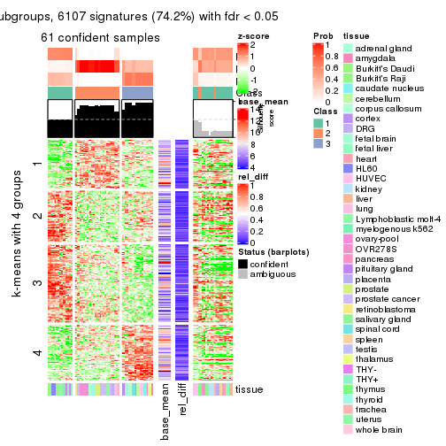</p>

</div>
<div id='tab-MAD-kmeans-get-signatures-3'>
<pre><code class="r">get_signatures(res, k = 4)
</code></pre>

<p></p>

</div>
<div id='tab-MAD-kmeans-get-signatures-4'>
<pre><code class="r">get_signatures(res, k = 5)
</code></pre>

<p></p>

</div>
<div id='tab-MAD-kmeans-get-signatures-5'>
<pre><code class="r">get_signatures(res, k = 6)
</code></pre>

<p></p>

</div>
</div>


Signature heatmaps where rows are not scaled:


<script>
$( function() {
	$( '#tabs-MAD-kmeans-get-signatures-no-scale' ).tabs();
} );
</script>
<div id='tabs-MAD-kmeans-get-signatures-no-scale'>
<ul>
<li><a href='#tab-MAD-kmeans-get-signatures-no-scale-1'>k = 2</a></li>
<li><a href='#tab-MAD-kmeans-get-signatures-no-scale-2'>k = 3</a></li>
<li><a href='#tab-MAD-kmeans-get-signatures-no-scale-3'>k = 4</a></li>
<li><a href='#tab-MAD-kmeans-get-signatures-no-scale-4'>k = 5</a></li>
<li><a href='#tab-MAD-kmeans-get-signatures-no-scale-5'>k = 6</a></li>
</ul>
<div id='tab-MAD-kmeans-get-signatures-no-scale-1'>
<pre><code class="r">get_signatures(res, k = 2, scale_rows = FALSE)
</code></pre>

<p></p>

</div>
<div id='tab-MAD-kmeans-get-signatures-no-scale-2'>
<pre><code class="r">get_signatures(res, k = 3, scale_rows = FALSE)
</code></pre>

<p></p>

</div>
<div id='tab-MAD-kmeans-get-signatures-no-scale-3'>
<pre><code class="r">get_signatures(res, k = 4, scale_rows = FALSE)
</code></pre>

<p></p>

</div>
<div id='tab-MAD-kmeans-get-signatures-no-scale-4'>
<pre><code class="r">get_signatures(res, k = 5, scale_rows = FALSE)
</code></pre>

<p></p>

</div>
<div id='tab-MAD-kmeans-get-signatures-no-scale-5'>
<pre><code class="r">get_signatures(res, k = 6, scale_rows = FALSE)
</code></pre>

<p></p>

</div>
</div>


Compare the overlap of signatures from different k:

```r
compare_signatures(res)
```


`get_signature()` returns a data frame invisibly. TO get the list of signatures, the function
call should be assigned to a variable explicitly. In following code, if `plot` argument is set
to `FALSE`, no heatmap is plotted while only the differential analysis is performed.

```r
# code only for demonstration
tb = get_signature(res, k = ..., plot = FALSE)
```

An example of the output of `tb` is:

```
#>   which_row         fdr    mean_1    mean_2 scaled_mean_1 scaled_mean_2 km
#> 1        38 0.042760348  8.373488  9.131774    -0.5533452     0.5164555  1
#> 2        40 0.018707592  7.106213  8.469186    -0.6173731     0.5762149  1
#> 3        55 0.019134737 10.221463 11.207825    -0.6159697     0.5749050  1
#> 4        59 0.006059896  5.921854  7.869574    -0.6899429     0.6439467  1
#> 5        60 0.018055526  8.928898 10.211722    -0.6204761     0.5791110  1
#> 6        98 0.009384629 15.714769 14.887706     0.6635654    -0.6193277  2
...
```

The columns in `tb` are:

1. `which_row`: row indices corresponding to the input matrix.
2. `fdr`: FDR for the differential test. 
3. `mean_x`: The mean value in group x.
4. `scaled_mean_x`: The mean value in group x after rows are scaled.
5. `km`: Row groups if k-means clustering is applied to rows.


UMAP plot which shows how samples are separated.


<script>
$( function() {
	$( '#tabs-MAD-kmeans-dimension-reduction' ).tabs();
} );
</script>
<div id='tabs-MAD-kmeans-dimension-reduction'>
<ul>
<li><a href='#tab-MAD-kmeans-dimension-reduction-1'>k = 2</a></li>
<li><a href='#tab-MAD-kmeans-dimension-reduction-2'>k = 3</a></li>
<li><a href='#tab-MAD-kmeans-dimension-reduction-3'>k = 4</a></li>
<li><a href='#tab-MAD-kmeans-dimension-reduction-4'>k = 5</a></li>
<li><a href='#tab-MAD-kmeans-dimension-reduction-5'>k = 6</a></li>
</ul>
<div id='tab-MAD-kmeans-dimension-reduction-1'>
<pre><code class="r">dimension_reduction(res, k = 2, method = &quot;UMAP&quot;)
</code></pre>

<p></p>

</div>
<div id='tab-MAD-kmeans-dimension-reduction-2'>
<pre><code class="r">dimension_reduction(res, k = 3, method = &quot;UMAP&quot;)
</code></pre>

<p></p>

</div>
<div id='tab-MAD-kmeans-dimension-reduction-3'>
<pre><code class="r">dimension_reduction(res, k = 4, method = &quot;UMAP&quot;)
</code></pre>

<p></p>

</div>
<div id='tab-MAD-kmeans-dimension-reduction-4'>
<pre><code class="r">dimension_reduction(res, k = 5, method = &quot;UMAP&quot;)
</code></pre>

<p></p>

</div>
<div id='tab-MAD-kmeans-dimension-reduction-5'>
<pre><code class="r">dimension_reduction(res, k = 6, method = &quot;UMAP&quot;)
</code></pre>

<p>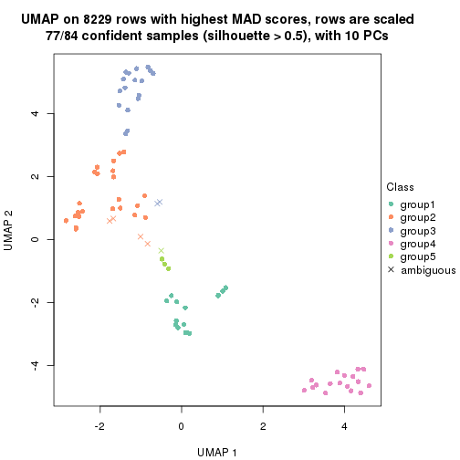</p>

</div>
</div>


Following heatmap shows how subgroups are split when increasing `k`:

```r
collect_classes(res)
```


Test correlation between subgroups and known annotations. If the known
annotation is numeric, one-way ANOVA test is applied, and if the known
annotation is discrete, chi-squared contingency table test is applied.

```r
test_to_known_factors(res)
```

```
#>             n tissue(p) k
#> MAD:kmeans 45        NA 2
#> MAD:kmeans 61  8.31e-07 3
#> MAD:kmeans 82  8.86e-12 4
#> MAD:kmeans 79  3.61e-15 5
#> MAD:kmeans 77  6.70e-15 6
```


If matrix rows can be associated to genes, consider to use `GO_Enrichment(res,
...)` to perform function enrichment for the signature genes.


 

---------------------------------------------------


### MAD:skmeans*


The object with results only for a single top-value method and a single partition method 
can be extracted as:

```r
res = res_list["MAD", "skmeans"]
# you can also extract it by
# res = res_list["MAD:skmeans"]
```

A summary of `res` and all the functions that can be applied to it:

```r
res
```

```
#> A 'ConsensusPartition' object with k = 2, 3, 4, 5, 6.
#>   On a matrix with 8229 rows and 84 columns.
#>   Top rows (823, 1646, 2468, 3291, 4114) are extracted by 'MAD' method.
#>   Subgroups are detected by 'skmeans' method.
#>   Performed in total 1250 partitions by row resampling.
#>   Best k for subgroups seems to be 5.
#> 
#> Following methods can be applied to this 'ConsensusPartition' object:
#>  [1] "cola_report"             "collect_classes"         "collect_plots"          
#>  [4] "collect_stats"           "colnames"                "compare_signatures"     
#>  [7] "consensus_heatmap"       "dimension_reduction"     "functional_enrichment"  
#> [10] "get_anno_col"            "get_anno"                "get_classes"            
#> [13] "get_consensus"           "get_matrix"              "get_membership"         
#> [16] "get_param"               "get_signatures"          "get_stats"              
#> [19] "is_best_k"               "is_stable_k"             "membership_heatmap"     
#> [22] "ncol"                    "nrow"                    "plot_ecdf"              
#> [25] "rownames"                "select_partition_number" "show"                   
#> [28] "suggest_best_k"          "test_to_known_factors"
```

`collect_plots()` function collects all the plots made from `res` for all `k` (number of partitions)
into one single page to provide an easy and fast comparison between different `k`.

```r
collect_plots(res)
```


The plots are:

- The first row: a plot of the ECDF (Empirical cumulative distribution
  function) curves of the consensus matrix for each `k` and the heatmap of
  predicted classes for each `k`.
- The second row: heatmaps of the consensus matrix for each `k`.
- The third row: heatmaps of the membership matrix for each `k`.
- The fouth row: heatmaps of the signatures for each `k`.

All the plots in panels can be made by individual functions and they are
plotted later in this section.

`select_partition_number()` produces several plots showing different
statistics for choosing "optimized" `k`. There are following statistics:

- ECDF curves of the consensus matrix for each `k`;
- 1-PAC. [The PAC
  score](https://en.wikipedia.org/wiki/Consensus_clustering#Over-interpretation_potential_of_consensus_clustering)
  measures the proportion of the ambiguous subgrouping.
- Mean silhouette score.
- Concordance. The mean probability of fiting the consensus class ids in all
  partitions.
- Area increased. Denote $A_k$ as the area under the ECDF curve for current
  `k`, the area increased is defined as $A_k - A_{k-1}$.
- Rand index. The percent of pairs of samples that are both in a same cluster
  or both are not in a same cluster in the partition of k and k-1.
- Jaccard index. The ratio of pairs of samples are both in a same cluster in
  the partition of k and k-1 and the pairs of samples are both in a same
  cluster in the partition k or k-1.

The detailed explanations of these statistics can be found in [the cola
vignette](http://bioconductor.org/packages/devel/bioc/vignettes/cola/inst/doc/cola.html#toc_13).

Generally speaking, lower PAC score, higher mean silhouette score or higher
concordance corresponds to better partition. Rand index and Jaccard index
measure how similar the current partition is compared to partition with `k-1`.
If they are too similar, we won't accept `k` is better than `k-1`.

```r
select_partition_number(res)
```


The numeric values for all these statistics can be obtained by `get_stats()`.

```r
get_stats(res)
```

```
#>   k 1-PAC mean_silhouette concordance area_increased  Rand Jaccard
#> 2 2 0.494           0.926       0.943         0.5056 0.494   0.494
#> 3 3 0.564           0.699       0.859         0.2831 0.687   0.453
#> 4 4 1.000           0.968       0.912         0.1639 0.837   0.563
#> 5 5 0.916           0.893       0.896         0.0471 0.971   0.880
#> 6 6 0.871           0.799       0.836         0.0380 0.943   0.744
```

`suggest_best_k()` suggests the best $k$ based on these statistics. The rules are as follows:

- All $k$ with Jaccard index larger than 0.95 are removed because the increase of
  the partition number does not provides enough extra information. If all $k$ are removed,
  the best $k$ is assigned by `NA`.
- For $k$ with 1-PAC larger than 0.9, the maximal $k$ is taken as the "best k". Other $k$ is called "optional k".
- If it does not fit the second rule. The $k$ with the highest vote of highest
  1-PAC, mean silhouette and concordance is taken as the "best k".

```r
suggest_best_k(res)
```

```
#> [1] 5
#> attr(,"optional")
#> [1] 4
```

There is also optional best $k$ = 4 that is worth to check.

Following shows the table of the partitions (You need to click the **show/hide
code output** link to see it). The membership matrix (columns with name `p*`)
is inferred by
[`clue::cl_consensus()`](https://www.rdocumentation.org/link/cl_consensus?package=clue)
function with the `SE` method. Basically the value in the membership matrix
represents the probability to belong to a certain group. The finall class
label for an item is determined with the group with highest probability it
belongs to.

In `get_classes()` function, the entropy is calculated from the membership
matrix and the silhouette score is calculated from the consensus matrix.


<script>
$( function() {
	$( '#tabs-MAD-skmeans-get-classes' ).tabs();
} );
</script>
<div id='tabs-MAD-skmeans-get-classes'>
<ul>
<li><a href='#tab-MAD-skmeans-get-classes-1'>k = 2</a></li>
<li><a href='#tab-MAD-skmeans-get-classes-2'>k = 3</a></li>
<li><a href='#tab-MAD-skmeans-get-classes-3'>k = 4</a></li>
<li><a href='#tab-MAD-skmeans-get-classes-4'>k = 5</a></li>
<li><a href='#tab-MAD-skmeans-get-classes-5'>k = 6</a></li>
</ul>

<div id='tab-MAD-skmeans-get-classes-1'>
<p><a id='tab-MAD-skmeans-get-classes-1-a' style='color:#0366d6' href='#'>show/hide code output</a></p>
<pre><code class="r">cbind(get_classes(res, k = 2), get_membership(res, k = 2))
</code></pre>

<pre><code>#&gt;         class entropy silhouette    p1    p2
#&gt; GSM2819     1   0.494      0.937 0.892 0.108
#&gt; GSM2820     2   0.494      0.931 0.108 0.892
#&gt; GSM2822     1   0.494      0.937 0.892 0.108
#&gt; GSM2832     1   0.494      0.937 0.892 0.108
#&gt; GSM2823     2   0.494      0.931 0.108 0.892
#&gt; GSM2824     2   0.494      0.931 0.108 0.892
#&gt; GSM2825     1   0.494      0.937 0.892 0.108
#&gt; GSM2826     1   0.494      0.937 0.892 0.108
#&gt; GSM2829     1   0.494      0.937 0.892 0.108
#&gt; GSM2856     1   0.494      0.937 0.892 0.108
#&gt; GSM2830     1   0.494      0.937 0.892 0.108
#&gt; GSM2843     1   0.494      0.937 0.892 0.108
#&gt; GSM2871     1   0.494      0.937 0.892 0.108
#&gt; GSM2831     1   0.494      0.937 0.892 0.108
#&gt; GSM2844     1   0.494      0.937 0.892 0.108
#&gt; GSM2833     1   0.494      0.937 0.892 0.108
#&gt; GSM2846     1   0.494      0.937 0.892 0.108
#&gt; GSM2835     1   0.494      0.937 0.892 0.108
#&gt; GSM2858     1   0.494      0.937 0.892 0.108
#&gt; GSM2836     2   0.000      0.943 0.000 1.000
#&gt; GSM2848     2   0.000      0.943 0.000 1.000
#&gt; GSM2828     2   0.494      0.931 0.108 0.892
#&gt; GSM2837     2   0.494      0.931 0.108 0.892
#&gt; GSM2839     1   0.000      0.921 1.000 0.000
#&gt; GSM2841     1   0.000      0.921 1.000 0.000
#&gt; GSM2827     2   0.000      0.943 0.000 1.000
#&gt; GSM2842     2   0.000      0.943 0.000 1.000
#&gt; GSM2845     1   0.494      0.937 0.892 0.108
#&gt; GSM2872     1   0.494      0.937 0.892 0.108
#&gt; GSM2834     1   0.494      0.937 0.892 0.108
#&gt; GSM2847     1   0.494      0.937 0.892 0.108
#&gt; GSM2849     2   0.494      0.931 0.108 0.892
#&gt; GSM2850     2   0.494      0.931 0.108 0.892
#&gt; GSM2838     2   0.000      0.943 0.000 1.000
#&gt; GSM2853     2   0.000      0.943 0.000 1.000
#&gt; GSM2852     2   0.000      0.943 0.000 1.000
#&gt; GSM2855     2   0.000      0.943 0.000 1.000
#&gt; GSM2840     1   0.000      0.921 1.000 0.000
#&gt; GSM2857     1   0.000      0.921 1.000 0.000
#&gt; GSM2859     2   0.000      0.943 0.000 1.000
#&gt; GSM2860     2   0.000      0.943 0.000 1.000
#&gt; GSM2861     2   0.000      0.943 0.000 1.000
#&gt; GSM2862     2   0.000      0.943 0.000 1.000
#&gt; GSM2863     2   0.000      0.943 0.000 1.000
#&gt; GSM2864     2   0.000      0.943 0.000 1.000
#&gt; GSM2865     2   0.000      0.943 0.000 1.000
#&gt; GSM2866     2   0.000      0.943 0.000 1.000
#&gt; GSM2868     2   0.000      0.943 0.000 1.000
#&gt; GSM2869     2   0.000      0.943 0.000 1.000
#&gt; GSM2851     2   0.000      0.943 0.000 1.000
#&gt; GSM2867     2   0.000      0.943 0.000 1.000
#&gt; GSM2870     2   0.000      0.943 0.000 1.000
#&gt; GSM2854     1   0.494      0.937 0.892 0.108
#&gt; GSM2873     1   0.998      0.293 0.524 0.476
#&gt; GSM2874     2   0.494      0.931 0.108 0.892
#&gt; GSM2884     2   0.494      0.931 0.108 0.892
#&gt; GSM2875     1   0.000      0.921 1.000 0.000
#&gt; GSM2890     1   0.000      0.921 1.000 0.000
#&gt; GSM2877     1   0.000      0.921 1.000 0.000
#&gt; GSM2892     1   0.000      0.921 1.000 0.000
#&gt; GSM2902     1   0.000      0.921 1.000 0.000
#&gt; GSM2878     1   0.000      0.921 1.000 0.000
#&gt; GSM2901     1   0.000      0.921 1.000 0.000
#&gt; GSM2879     2   0.494      0.931 0.108 0.892
#&gt; GSM2898     2   0.494      0.931 0.108 0.892
#&gt; GSM2881     2   0.494      0.931 0.108 0.892
#&gt; GSM2897     2   0.494      0.931 0.108 0.892
#&gt; GSM2882     1   0.494      0.937 0.892 0.108
#&gt; GSM2894     1   0.494      0.937 0.892 0.108
#&gt; GSM2883     2   0.494      0.931 0.108 0.892
#&gt; GSM2895     2   0.494      0.931 0.108 0.892
#&gt; GSM2885     2   0.494      0.931 0.108 0.892
#&gt; GSM2886     2   0.494      0.931 0.108 0.892
#&gt; GSM2887     2   0.494      0.931 0.108 0.892
#&gt; GSM2896     2   0.494      0.931 0.108 0.892
#&gt; GSM2888     2   0.000      0.943 0.000 1.000
#&gt; GSM2889     2   0.000      0.943 0.000 1.000
#&gt; GSM2876     1   0.000      0.921 1.000 0.000
#&gt; GSM2891     1   0.000      0.921 1.000 0.000
#&gt; GSM2880     1   0.000      0.921 1.000 0.000
#&gt; GSM2893     1   0.000      0.921 1.000 0.000
#&gt; GSM2821     1   0.000      0.921 1.000 0.000
#&gt; GSM2900     1   0.000      0.921 1.000 0.000
#&gt; GSM2903     1   0.000      0.921 1.000 0.000
</code></pre>

<script>
$('#tab-MAD-skmeans-get-classes-1-a').parent().next().next().hide();
$('#tab-MAD-skmeans-get-classes-1-a').click(function(){
  $('#tab-MAD-skmeans-get-classes-1-a').parent().next().next().toggle();
  return(false);
});
</script>
</div>

<div id='tab-MAD-skmeans-get-classes-2'>
<p><a id='tab-MAD-skmeans-get-classes-2-a' style='color:#0366d6' href='#'>show/hide code output</a></p>
<pre><code class="r">cbind(get_classes(res, k = 3), get_membership(res, k = 3))
</code></pre>

<pre><code>#&gt;         class entropy silhouette    p1    p2    p3
#&gt; GSM2819     1  0.6267      0.111 0.548 0.452 0.000
#&gt; GSM2820     3  0.0000      0.958 0.000 0.000 1.000
#&gt; GSM2822     2  0.0237      0.712 0.004 0.996 0.000
#&gt; GSM2832     2  0.0237      0.712 0.004 0.996 0.000
#&gt; GSM2823     3  0.6045      0.471 0.380 0.000 0.620
#&gt; GSM2824     3  0.6045      0.471 0.380 0.000 0.620
#&gt; GSM2825     1  0.5254      0.511 0.736 0.264 0.000
#&gt; GSM2826     1  0.5254      0.511 0.736 0.264 0.000
#&gt; GSM2829     2  0.6140      0.127 0.404 0.596 0.000
#&gt; GSM2856     2  0.6140      0.127 0.404 0.596 0.000
#&gt; GSM2830     2  0.6140      0.127 0.404 0.596 0.000
#&gt; GSM2843     2  0.6140      0.127 0.404 0.596 0.000
#&gt; GSM2871     2  0.5882      0.250 0.348 0.652 0.000
#&gt; GSM2831     1  0.6192      0.414 0.580 0.420 0.000
#&gt; GSM2844     1  0.6192      0.414 0.580 0.420 0.000
#&gt; GSM2833     2  0.6140      0.127 0.404 0.596 0.000
#&gt; GSM2846     2  0.6140      0.127 0.404 0.596 0.000
#&gt; GSM2835     1  0.6168      0.429 0.588 0.412 0.000
#&gt; GSM2858     1  0.6168      0.429 0.588 0.412 0.000
#&gt; GSM2836     2  0.3686      0.794 0.000 0.860 0.140
#&gt; GSM2848     2  0.3686      0.794 0.000 0.860 0.140
#&gt; GSM2828     3  0.0000      0.958 0.000 0.000 1.000
#&gt; GSM2837     3  0.0000      0.958 0.000 0.000 1.000
#&gt; GSM2839     1  0.0000      0.809 1.000 0.000 0.000
#&gt; GSM2841     1  0.0000      0.809 1.000 0.000 0.000
#&gt; GSM2827     2  0.3686      0.794 0.000 0.860 0.140
#&gt; GSM2842     2  0.3686      0.794 0.000 0.860 0.140
#&gt; GSM2845     1  0.6286      0.300 0.536 0.464 0.000
#&gt; GSM2872     1  0.6204      0.405 0.576 0.424 0.000
#&gt; GSM2834     2  0.6140      0.127 0.404 0.596 0.000
#&gt; GSM2847     2  0.6140      0.127 0.404 0.596 0.000
#&gt; GSM2849     3  0.0000      0.958 0.000 0.000 1.000
#&gt; GSM2850     3  0.0000      0.958 0.000 0.000 1.000
#&gt; GSM2838     2  0.3686      0.794 0.000 0.860 0.140
#&gt; GSM2853     2  0.3686      0.794 0.000 0.860 0.140
#&gt; GSM2852     3  0.0000      0.958 0.000 0.000 1.000
#&gt; GSM2855     3  0.0000      0.958 0.000 0.000 1.000
#&gt; GSM2840     1  0.0000      0.809 1.000 0.000 0.000
#&gt; GSM2857     1  0.0000      0.809 1.000 0.000 0.000
#&gt; GSM2859     2  0.3686      0.794 0.000 0.860 0.140
#&gt; GSM2860     2  0.3686      0.794 0.000 0.860 0.140
#&gt; GSM2861     2  0.3686      0.794 0.000 0.860 0.140
#&gt; GSM2862     2  0.3686      0.794 0.000 0.860 0.140
#&gt; GSM2863     2  0.3686      0.794 0.000 0.860 0.140
#&gt; GSM2864     2  0.3686      0.794 0.000 0.860 0.140
#&gt; GSM2865     2  0.3686      0.794 0.000 0.860 0.140
#&gt; GSM2866     2  0.3686      0.794 0.000 0.860 0.140
#&gt; GSM2868     2  0.3686      0.794 0.000 0.860 0.140
#&gt; GSM2869     2  0.3686      0.794 0.000 0.860 0.140
#&gt; GSM2851     2  0.3686      0.794 0.000 0.860 0.140
#&gt; GSM2867     2  0.3686      0.794 0.000 0.860 0.140
#&gt; GSM2870     2  0.3686      0.794 0.000 0.860 0.140
#&gt; GSM2854     2  0.2356      0.659 0.072 0.928 0.000
#&gt; GSM2873     2  0.0000      0.711 0.000 1.000 0.000
#&gt; GSM2874     3  0.0000      0.958 0.000 0.000 1.000
#&gt; GSM2884     3  0.0000      0.958 0.000 0.000 1.000
#&gt; GSM2875     1  0.0000      0.809 1.000 0.000 0.000
#&gt; GSM2890     1  0.0000      0.809 1.000 0.000 0.000
#&gt; GSM2877     1  0.0000      0.809 1.000 0.000 0.000
#&gt; GSM2892     1  0.0000      0.809 1.000 0.000 0.000
#&gt; GSM2902     1  0.0000      0.809 1.000 0.000 0.000
#&gt; GSM2878     1  0.0000      0.809 1.000 0.000 0.000
#&gt; GSM2901     1  0.0000      0.809 1.000 0.000 0.000
#&gt; GSM2879     3  0.0000      0.958 0.000 0.000 1.000
#&gt; GSM2898     3  0.0000      0.958 0.000 0.000 1.000
#&gt; GSM2881     3  0.0000      0.958 0.000 0.000 1.000
#&gt; GSM2897     3  0.0000      0.958 0.000 0.000 1.000
#&gt; GSM2882     1  0.6180      0.422 0.584 0.416 0.000
#&gt; GSM2894     1  0.6180      0.422 0.584 0.416 0.000
#&gt; GSM2883     3  0.0000      0.958 0.000 0.000 1.000
#&gt; GSM2895     3  0.0000      0.958 0.000 0.000 1.000
#&gt; GSM2885     3  0.0000      0.958 0.000 0.000 1.000
#&gt; GSM2886     3  0.0000      0.958 0.000 0.000 1.000
#&gt; GSM2887     3  0.0000      0.958 0.000 0.000 1.000
#&gt; GSM2896     3  0.0000      0.958 0.000 0.000 1.000
#&gt; GSM2888     2  0.4605      0.727 0.000 0.796 0.204
#&gt; GSM2889     2  0.4605      0.727 0.000 0.796 0.204
#&gt; GSM2876     1  0.0000      0.809 1.000 0.000 0.000
#&gt; GSM2891     1  0.0000      0.809 1.000 0.000 0.000
#&gt; GSM2880     1  0.0000      0.809 1.000 0.000 0.000
#&gt; GSM2893     1  0.0000      0.809 1.000 0.000 0.000
#&gt; GSM2821     1  0.0000      0.809 1.000 0.000 0.000
#&gt; GSM2900     1  0.0000      0.809 1.000 0.000 0.000
#&gt; GSM2903     1  0.0000      0.809 1.000 0.000 0.000
</code></pre>

<script>
$('#tab-MAD-skmeans-get-classes-2-a').parent().next().next().hide();
$('#tab-MAD-skmeans-get-classes-2-a').click(function(){
  $('#tab-MAD-skmeans-get-classes-2-a').parent().next().next().toggle();
  return(false);
});
</script>
</div>

<div id='tab-MAD-skmeans-get-classes-3'>
<p><a id='tab-MAD-skmeans-get-classes-3-a' style='color:#0366d6' href='#'>show/hide code output</a></p>
<pre><code class="r">cbind(get_classes(res, k = 4), get_membership(res, k = 4))
</code></pre>

<pre><code>#&gt;         class entropy silhouette    p1    p2    p3   p4
#&gt; GSM2819     1   0.492      0.295 0.576 0.424 0.000 0.00
#&gt; GSM2820     3   0.000      1.000 0.000 0.000 1.000 0.00
#&gt; GSM2822     2   0.000      1.000 0.000 1.000 0.000 0.00
#&gt; GSM2832     2   0.000      1.000 0.000 1.000 0.000 0.00
#&gt; GSM2823     1   0.344      0.768 0.816 0.000 0.184 0.00
#&gt; GSM2824     1   0.344      0.768 0.816 0.000 0.184 0.00
#&gt; GSM2825     1   0.455      0.752 0.780 0.180 0.000 0.04
#&gt; GSM2826     1   0.455      0.752 0.780 0.180 0.000 0.04
#&gt; GSM2829     4   0.000      1.000 0.000 0.000 0.000 1.00
#&gt; GSM2856     4   0.000      1.000 0.000 0.000 0.000 1.00
#&gt; GSM2830     4   0.000      1.000 0.000 0.000 0.000 1.00
#&gt; GSM2843     4   0.000      1.000 0.000 0.000 0.000 1.00
#&gt; GSM2871     4   0.000      1.000 0.000 0.000 0.000 1.00
#&gt; GSM2831     4   0.000      1.000 0.000 0.000 0.000 1.00
#&gt; GSM2844     4   0.000      1.000 0.000 0.000 0.000 1.00
#&gt; GSM2833     4   0.000      1.000 0.000 0.000 0.000 1.00
#&gt; GSM2846     4   0.000      1.000 0.000 0.000 0.000 1.00
#&gt; GSM2835     4   0.000      1.000 0.000 0.000 0.000 1.00
#&gt; GSM2858     4   0.000      1.000 0.000 0.000 0.000 1.00
#&gt; GSM2836     2   0.000      1.000 0.000 1.000 0.000 0.00
#&gt; GSM2848     2   0.000      1.000 0.000 1.000 0.000 0.00
#&gt; GSM2828     3   0.000      1.000 0.000 0.000 1.000 0.00
#&gt; GSM2837     3   0.000      1.000 0.000 0.000 1.000 0.00
#&gt; GSM2839     1   0.000      0.942 1.000 0.000 0.000 0.00
#&gt; GSM2841     1   0.000      0.942 1.000 0.000 0.000 0.00
#&gt; GSM2827     2   0.000      1.000 0.000 1.000 0.000 0.00
#&gt; GSM2842     2   0.000      1.000 0.000 1.000 0.000 0.00
#&gt; GSM2845     4   0.000      1.000 0.000 0.000 0.000 1.00
#&gt; GSM2872     4   0.000      1.000 0.000 0.000 0.000 1.00
#&gt; GSM2834     4   0.000      1.000 0.000 0.000 0.000 1.00
#&gt; GSM2847     4   0.000      1.000 0.000 0.000 0.000 1.00
#&gt; GSM2849     3   0.000      1.000 0.000 0.000 1.000 0.00
#&gt; GSM2850     3   0.000      1.000 0.000 0.000 1.000 0.00
#&gt; GSM2838     2   0.000      1.000 0.000 1.000 0.000 0.00
#&gt; GSM2853     2   0.000      1.000 0.000 1.000 0.000 0.00
#&gt; GSM2852     3   0.000      1.000 0.000 0.000 1.000 0.00
#&gt; GSM2855     3   0.000      1.000 0.000 0.000 1.000 0.00
#&gt; GSM2840     1   0.000      0.942 1.000 0.000 0.000 0.00
#&gt; GSM2857     1   0.000      0.942 1.000 0.000 0.000 0.00
#&gt; GSM2859     2   0.000      1.000 0.000 1.000 0.000 0.00
#&gt; GSM2860     2   0.000      1.000 0.000 1.000 0.000 0.00
#&gt; GSM2861     2   0.000      1.000 0.000 1.000 0.000 0.00
#&gt; GSM2862     2   0.000      1.000 0.000 1.000 0.000 0.00
#&gt; GSM2863     2   0.000      1.000 0.000 1.000 0.000 0.00
#&gt; GSM2864     2   0.000      1.000 0.000 1.000 0.000 0.00
#&gt; GSM2865     2   0.000      1.000 0.000 1.000 0.000 0.00
#&gt; GSM2866     2   0.000      1.000 0.000 1.000 0.000 0.00
#&gt; GSM2868     2   0.000      1.000 0.000 1.000 0.000 0.00
#&gt; GSM2869     2   0.000      1.000 0.000 1.000 0.000 0.00
#&gt; GSM2851     2   0.000      1.000 0.000 1.000 0.000 0.00
#&gt; GSM2867     2   0.000      1.000 0.000 1.000 0.000 0.00
#&gt; GSM2870     2   0.000      1.000 0.000 1.000 0.000 0.00
#&gt; GSM2854     4   0.000      1.000 0.000 0.000 0.000 1.00
#&gt; GSM2873     2   0.000      1.000 0.000 1.000 0.000 0.00
#&gt; GSM2874     3   0.000      1.000 0.000 0.000 1.000 0.00
#&gt; GSM2884     3   0.000      1.000 0.000 0.000 1.000 0.00
#&gt; GSM2875     1   0.000      0.942 1.000 0.000 0.000 0.00
#&gt; GSM2890     1   0.000      0.942 1.000 0.000 0.000 0.00
#&gt; GSM2877     1   0.000      0.942 1.000 0.000 0.000 0.00
#&gt; GSM2892     1   0.000      0.942 1.000 0.000 0.000 0.00
#&gt; GSM2902     1   0.000      0.942 1.000 0.000 0.000 0.00
#&gt; GSM2878     1   0.000      0.942 1.000 0.000 0.000 0.00
#&gt; GSM2901     1   0.000      0.942 1.000 0.000 0.000 0.00
#&gt; GSM2879     3   0.000      1.000 0.000 0.000 1.000 0.00
#&gt; GSM2898     3   0.000      1.000 0.000 0.000 1.000 0.00
#&gt; GSM2881     3   0.000      1.000 0.000 0.000 1.000 0.00
#&gt; GSM2897     3   0.000      1.000 0.000 0.000 1.000 0.00
#&gt; GSM2882     4   0.000      1.000 0.000 0.000 0.000 1.00
#&gt; GSM2894     4   0.000      1.000 0.000 0.000 0.000 1.00
#&gt; GSM2883     3   0.000      1.000 0.000 0.000 1.000 0.00
#&gt; GSM2895     3   0.000      1.000 0.000 0.000 1.000 0.00
#&gt; GSM2885     3   0.000      1.000 0.000 0.000 1.000 0.00
#&gt; GSM2886     3   0.000      1.000 0.000 0.000 1.000 0.00
#&gt; GSM2887     3   0.000      1.000 0.000 0.000 1.000 0.00
#&gt; GSM2896     3   0.000      1.000 0.000 0.000 1.000 0.00
#&gt; GSM2888     2   0.000      1.000 0.000 1.000 0.000 0.00
#&gt; GSM2889     2   0.000      1.000 0.000 1.000 0.000 0.00
#&gt; GSM2876     1   0.000      0.942 1.000 0.000 0.000 0.00
#&gt; GSM2891     1   0.000      0.942 1.000 0.000 0.000 0.00
#&gt; GSM2880     1   0.000      0.942 1.000 0.000 0.000 0.00
#&gt; GSM2893     1   0.000      0.942 1.000 0.000 0.000 0.00
#&gt; GSM2821     1   0.000      0.942 1.000 0.000 0.000 0.00
#&gt; GSM2900     1   0.000      0.942 1.000 0.000 0.000 0.00
#&gt; GSM2903     1   0.000      0.942 1.000 0.000 0.000 0.00
</code></pre>

<script>
$('#tab-MAD-skmeans-get-classes-3-a').parent().next().next().hide();
$('#tab-MAD-skmeans-get-classes-3-a').click(function(){
  $('#tab-MAD-skmeans-get-classes-3-a').parent().next().next().toggle();
  return(false);
});
</script>
</div>

<div id='tab-MAD-skmeans-get-classes-4'>
<p><a id='tab-MAD-skmeans-get-classes-4-a' style='color:#0366d6' href='#'>show/hide code output</a></p>
<pre><code class="r">cbind(get_classes(res, k = 5), get_membership(res, k = 5))
</code></pre>

<pre><code>#&gt;         class entropy silhouette    p1    p2    p3    p4    p5
#&gt; GSM2819     5  0.5158      0.632 0.224 0.100 0.000 0.000 0.676
#&gt; GSM2820     3  0.0000      0.999 0.000 0.000 1.000 0.000 0.000
#&gt; GSM2822     2  0.3707      0.741 0.000 0.716 0.000 0.000 0.284
#&gt; GSM2832     2  0.3707      0.741 0.000 0.716 0.000 0.000 0.284
#&gt; GSM2823     5  0.5510      0.804 0.380 0.000 0.072 0.000 0.548
#&gt; GSM2824     5  0.5510      0.804 0.380 0.000 0.072 0.000 0.548
#&gt; GSM2825     1  0.5975      0.363 0.572 0.124 0.000 0.004 0.300
#&gt; GSM2826     1  0.5975      0.363 0.572 0.124 0.000 0.004 0.300
#&gt; GSM2829     4  0.1341      0.963 0.000 0.000 0.000 0.944 0.056
#&gt; GSM2856     4  0.1341      0.963 0.000 0.000 0.000 0.944 0.056
#&gt; GSM2830     4  0.0000      0.976 0.000 0.000 0.000 1.000 0.000
#&gt; GSM2843     4  0.0000      0.976 0.000 0.000 0.000 1.000 0.000
#&gt; GSM2871     4  0.0000      0.976 0.000 0.000 0.000 1.000 0.000
#&gt; GSM2831     4  0.0000      0.976 0.000 0.000 0.000 1.000 0.000
#&gt; GSM2844     4  0.0000      0.976 0.000 0.000 0.000 1.000 0.000
#&gt; GSM2833     4  0.1341      0.963 0.000 0.000 0.000 0.944 0.056
#&gt; GSM2846     4  0.1341      0.963 0.000 0.000 0.000 0.944 0.056
#&gt; GSM2835     4  0.1410      0.961 0.000 0.000 0.000 0.940 0.060
#&gt; GSM2858     4  0.1410      0.961 0.000 0.000 0.000 0.940 0.060
#&gt; GSM2836     2  0.1270      0.854 0.000 0.948 0.000 0.000 0.052
#&gt; GSM2848     2  0.1270      0.854 0.000 0.948 0.000 0.000 0.052
#&gt; GSM2828     3  0.0000      0.999 0.000 0.000 1.000 0.000 0.000
#&gt; GSM2837     3  0.0000      0.999 0.000 0.000 1.000 0.000 0.000
#&gt; GSM2839     1  0.2127      0.802 0.892 0.000 0.000 0.000 0.108
#&gt; GSM2841     1  0.2127      0.802 0.892 0.000 0.000 0.000 0.108
#&gt; GSM2827     2  0.3452      0.868 0.000 0.756 0.000 0.000 0.244
#&gt; GSM2842     2  0.3452      0.868 0.000 0.756 0.000 0.000 0.244
#&gt; GSM2845     4  0.0162      0.975 0.000 0.000 0.000 0.996 0.004
#&gt; GSM2872     4  0.0162      0.975 0.000 0.000 0.000 0.996 0.004
#&gt; GSM2834     4  0.0162      0.975 0.000 0.000 0.000 0.996 0.004
#&gt; GSM2847     4  0.0162      0.975 0.000 0.000 0.000 0.996 0.004
#&gt; GSM2849     3  0.0000      0.999 0.000 0.000 1.000 0.000 0.000
#&gt; GSM2850     3  0.0000      0.999 0.000 0.000 1.000 0.000 0.000
#&gt; GSM2838     2  0.3274      0.872 0.000 0.780 0.000 0.000 0.220
#&gt; GSM2853     2  0.3274      0.872 0.000 0.780 0.000 0.000 0.220
#&gt; GSM2852     3  0.0000      0.999 0.000 0.000 1.000 0.000 0.000
#&gt; GSM2855     3  0.0000      0.999 0.000 0.000 1.000 0.000 0.000
#&gt; GSM2840     1  0.2127      0.802 0.892 0.000 0.000 0.000 0.108
#&gt; GSM2857     1  0.2127      0.802 0.892 0.000 0.000 0.000 0.108
#&gt; GSM2859     2  0.0000      0.870 0.000 1.000 0.000 0.000 0.000
#&gt; GSM2860     2  0.0000      0.870 0.000 1.000 0.000 0.000 0.000
#&gt; GSM2861     2  0.1965      0.874 0.000 0.904 0.000 0.000 0.096
#&gt; GSM2862     2  0.0000      0.870 0.000 1.000 0.000 0.000 0.000
#&gt; GSM2863     2  0.0000      0.870 0.000 1.000 0.000 0.000 0.000
#&gt; GSM2864     2  0.0000      0.870 0.000 1.000 0.000 0.000 0.000
#&gt; GSM2865     2  0.0000      0.870 0.000 1.000 0.000 0.000 0.000
#&gt; GSM2866     2  0.0000      0.870 0.000 1.000 0.000 0.000 0.000
#&gt; GSM2868     2  0.3242      0.872 0.000 0.784 0.000 0.000 0.216
#&gt; GSM2869     2  0.3242      0.872 0.000 0.784 0.000 0.000 0.216
#&gt; GSM2851     2  0.3274      0.872 0.000 0.780 0.000 0.000 0.220
#&gt; GSM2867     2  0.3242      0.872 0.000 0.784 0.000 0.000 0.216
#&gt; GSM2870     2  0.3274      0.872 0.000 0.780 0.000 0.000 0.220
#&gt; GSM2854     4  0.1732      0.948 0.000 0.000 0.000 0.920 0.080
#&gt; GSM2873     2  0.2605      0.801 0.000 0.852 0.000 0.000 0.148
#&gt; GSM2874     3  0.0000      0.999 0.000 0.000 1.000 0.000 0.000
#&gt; GSM2884     3  0.0000      0.999 0.000 0.000 1.000 0.000 0.000
#&gt; GSM2875     1  0.0000      0.864 1.000 0.000 0.000 0.000 0.000
#&gt; GSM2890     1  0.0000      0.864 1.000 0.000 0.000 0.000 0.000
#&gt; GSM2877     1  0.0000      0.864 1.000 0.000 0.000 0.000 0.000
#&gt; GSM2892     1  0.0000      0.864 1.000 0.000 0.000 0.000 0.000
#&gt; GSM2902     1  0.0000      0.864 1.000 0.000 0.000 0.000 0.000
#&gt; GSM2878     1  0.0000      0.864 1.000 0.000 0.000 0.000 0.000
#&gt; GSM2901     1  0.0000      0.864 1.000 0.000 0.000 0.000 0.000
#&gt; GSM2879     3  0.0290      0.993 0.000 0.000 0.992 0.000 0.008
#&gt; GSM2898     3  0.0290      0.993 0.000 0.000 0.992 0.000 0.008
#&gt; GSM2881     3  0.0000      0.999 0.000 0.000 1.000 0.000 0.000
#&gt; GSM2897     3  0.0000      0.999 0.000 0.000 1.000 0.000 0.000
#&gt; GSM2882     4  0.0000      0.976 0.000 0.000 0.000 1.000 0.000
#&gt; GSM2894     4  0.0000      0.976 0.000 0.000 0.000 1.000 0.000
#&gt; GSM2883     3  0.0000      0.999 0.000 0.000 1.000 0.000 0.000
#&gt; GSM2895     3  0.0000      0.999 0.000 0.000 1.000 0.000 0.000
#&gt; GSM2885     3  0.0000      0.999 0.000 0.000 1.000 0.000 0.000
#&gt; GSM2886     3  0.0000      0.999 0.000 0.000 1.000 0.000 0.000
#&gt; GSM2887     3  0.0000      0.999 0.000 0.000 1.000 0.000 0.000
#&gt; GSM2896     3  0.0000      0.999 0.000 0.000 1.000 0.000 0.000
#&gt; GSM2888     2  0.3305      0.873 0.000 0.776 0.000 0.000 0.224
#&gt; GSM2889     2  0.3305      0.873 0.000 0.776 0.000 0.000 0.224
#&gt; GSM2876     1  0.0290      0.855 0.992 0.000 0.000 0.000 0.008
#&gt; GSM2891     1  0.0290      0.855 0.992 0.000 0.000 0.000 0.008
#&gt; GSM2880     1  0.0000      0.864 1.000 0.000 0.000 0.000 0.000
#&gt; GSM2893     1  0.0000      0.864 1.000 0.000 0.000 0.000 0.000
#&gt; GSM2821     5  0.4287      0.809 0.460 0.000 0.000 0.000 0.540
#&gt; GSM2900     5  0.4287      0.809 0.460 0.000 0.000 0.000 0.540
#&gt; GSM2903     5  0.4287      0.809 0.460 0.000 0.000 0.000 0.540
</code></pre>

<script>
$('#tab-MAD-skmeans-get-classes-4-a').parent().next().next().hide();
$('#tab-MAD-skmeans-get-classes-4-a').click(function(){
  $('#tab-MAD-skmeans-get-classes-4-a').parent().next().next().toggle();
  return(false);
});
</script>
</div>

<div id='tab-MAD-skmeans-get-classes-5'>
<p><a id='tab-MAD-skmeans-get-classes-5-a' style='color:#0366d6' href='#'>show/hide code output</a></p>
<pre><code class="r">cbind(get_classes(res, k = 6), get_membership(res, k = 6))
</code></pre>

<pre><code>#&gt;         class entropy silhouette    p1    p2    p3    p4    p5    p6
#&gt; GSM2819     5  0.5341     0.7312 0.140 0.136 0.000 0.000 0.676 0.048
#&gt; GSM2820     3  0.0000     0.9872 0.000 0.000 1.000 0.000 0.000 0.000
#&gt; GSM2822     2  0.5972    -0.0427 0.000 0.452 0.000 0.004 0.200 0.344
#&gt; GSM2832     2  0.5972    -0.0427 0.000 0.452 0.000 0.004 0.200 0.344
#&gt; GSM2823     5  0.4839     0.8125 0.228 0.072 0.020 0.000 0.680 0.000
#&gt; GSM2824     5  0.4839     0.8125 0.228 0.072 0.020 0.000 0.680 0.000
#&gt; GSM2825     2  0.7446    -0.1377 0.244 0.396 0.000 0.008 0.244 0.108
#&gt; GSM2826     2  0.7446    -0.1377 0.244 0.396 0.000 0.008 0.244 0.108
#&gt; GSM2829     4  0.1921     0.9249 0.000 0.052 0.000 0.916 0.032 0.000
#&gt; GSM2856     4  0.1921     0.9249 0.000 0.052 0.000 0.916 0.032 0.000
#&gt; GSM2830     4  0.1092     0.9368 0.000 0.020 0.000 0.960 0.020 0.000
#&gt; GSM2843     4  0.1092     0.9368 0.000 0.020 0.000 0.960 0.020 0.000
#&gt; GSM2871     4  0.1176     0.9357 0.000 0.024 0.000 0.956 0.020 0.000
#&gt; GSM2831     4  0.0146     0.9399 0.000 0.000 0.000 0.996 0.004 0.000
#&gt; GSM2844     4  0.0146     0.9399 0.000 0.000 0.000 0.996 0.004 0.000
#&gt; GSM2833     4  0.2308     0.9152 0.000 0.068 0.000 0.892 0.040 0.000
#&gt; GSM2846     4  0.2308     0.9152 0.000 0.068 0.000 0.892 0.040 0.000
#&gt; GSM2835     4  0.2442     0.9112 0.000 0.068 0.000 0.884 0.048 0.000
#&gt; GSM2858     4  0.2442     0.9112 0.000 0.068 0.000 0.884 0.048 0.000
#&gt; GSM2836     6  0.3042     0.7294 0.000 0.128 0.000 0.004 0.032 0.836
#&gt; GSM2848     6  0.3155     0.7260 0.000 0.132 0.000 0.004 0.036 0.828
#&gt; GSM2828     3  0.0000     0.9872 0.000 0.000 1.000 0.000 0.000 0.000
#&gt; GSM2837     3  0.0000     0.9872 0.000 0.000 1.000 0.000 0.000 0.000
#&gt; GSM2839     1  0.4237     0.7066 0.736 0.144 0.000 0.000 0.120 0.000
#&gt; GSM2841     1  0.4237     0.7066 0.736 0.144 0.000 0.000 0.120 0.000
#&gt; GSM2827     2  0.5044     0.3898 0.000 0.536 0.000 0.000 0.080 0.384
#&gt; GSM2842     2  0.4905     0.4455 0.000 0.580 0.000 0.000 0.076 0.344
#&gt; GSM2845     4  0.1176     0.9357 0.000 0.024 0.000 0.956 0.020 0.000
#&gt; GSM2872     4  0.1176     0.9357 0.000 0.024 0.000 0.956 0.020 0.000
#&gt; GSM2834     4  0.1261     0.9366 0.000 0.024 0.000 0.952 0.024 0.000
#&gt; GSM2847     4  0.1261     0.9366 0.000 0.024 0.000 0.952 0.024 0.000
#&gt; GSM2849     3  0.0000     0.9872 0.000 0.000 1.000 0.000 0.000 0.000
#&gt; GSM2850     3  0.0000     0.9872 0.000 0.000 1.000 0.000 0.000 0.000
#&gt; GSM2838     2  0.3843     0.5745 0.000 0.548 0.000 0.000 0.000 0.452
#&gt; GSM2853     2  0.3843     0.5745 0.000 0.548 0.000 0.000 0.000 0.452
#&gt; GSM2852     3  0.0146     0.9846 0.000 0.000 0.996 0.000 0.004 0.000
#&gt; GSM2855     3  0.0146     0.9846 0.000 0.000 0.996 0.000 0.004 0.000
#&gt; GSM2840     1  0.4237     0.7066 0.736 0.144 0.000 0.000 0.120 0.000
#&gt; GSM2857     1  0.4237     0.7066 0.736 0.144 0.000 0.000 0.120 0.000
#&gt; GSM2859     6  0.0000     0.8714 0.000 0.000 0.000 0.000 0.000 1.000
#&gt; GSM2860     6  0.0000     0.8714 0.000 0.000 0.000 0.000 0.000 1.000
#&gt; GSM2861     6  0.1610     0.7267 0.000 0.084 0.000 0.000 0.000 0.916
#&gt; GSM2862     6  0.0000     0.8714 0.000 0.000 0.000 0.000 0.000 1.000
#&gt; GSM2863     6  0.0000     0.8714 0.000 0.000 0.000 0.000 0.000 1.000
#&gt; GSM2864     6  0.0000     0.8714 0.000 0.000 0.000 0.000 0.000 1.000
#&gt; GSM2865     6  0.0000     0.8714 0.000 0.000 0.000 0.000 0.000 1.000
#&gt; GSM2866     6  0.0000     0.8714 0.000 0.000 0.000 0.000 0.000 1.000
#&gt; GSM2868     2  0.3843     0.5745 0.000 0.548 0.000 0.000 0.000 0.452
#&gt; GSM2869     2  0.3843     0.5745 0.000 0.548 0.000 0.000 0.000 0.452
#&gt; GSM2851     2  0.3843     0.5745 0.000 0.548 0.000 0.000 0.000 0.452
#&gt; GSM2867     2  0.3843     0.5745 0.000 0.548 0.000 0.000 0.000 0.452
#&gt; GSM2870     2  0.3843     0.5745 0.000 0.548 0.000 0.000 0.000 0.452
#&gt; GSM2854     4  0.3123     0.8705 0.000 0.112 0.000 0.832 0.056 0.000
#&gt; GSM2873     6  0.4796     0.4559 0.000 0.260 0.000 0.004 0.084 0.652
#&gt; GSM2874     3  0.0000     0.9872 0.000 0.000 1.000 0.000 0.000 0.000
#&gt; GSM2884     3  0.0000     0.9872 0.000 0.000 1.000 0.000 0.000 0.000
#&gt; GSM2875     1  0.0000     0.8961 1.000 0.000 0.000 0.000 0.000 0.000
#&gt; GSM2890     1  0.0000     0.8961 1.000 0.000 0.000 0.000 0.000 0.000
#&gt; GSM2877     1  0.0000     0.8961 1.000 0.000 0.000 0.000 0.000 0.000
#&gt; GSM2892     1  0.0000     0.8961 1.000 0.000 0.000 0.000 0.000 0.000
#&gt; GSM2902     1  0.0000     0.8961 1.000 0.000 0.000 0.000 0.000 0.000
#&gt; GSM2878     1  0.0000     0.8961 1.000 0.000 0.000 0.000 0.000 0.000
#&gt; GSM2901     1  0.0000     0.8961 1.000 0.000 0.000 0.000 0.000 0.000
#&gt; GSM2879     3  0.2361     0.8860 0.000 0.028 0.884 0.000 0.088 0.000
#&gt; GSM2898     3  0.2361     0.8860 0.000 0.028 0.884 0.000 0.088 0.000
#&gt; GSM2881     3  0.0000     0.9872 0.000 0.000 1.000 0.000 0.000 0.000
#&gt; GSM2897     3  0.0000     0.9872 0.000 0.000 1.000 0.000 0.000 0.000
#&gt; GSM2882     4  0.0291     0.9400 0.000 0.004 0.000 0.992 0.004 0.000
#&gt; GSM2894     4  0.0291     0.9400 0.000 0.004 0.000 0.992 0.004 0.000
#&gt; GSM2883     3  0.0000     0.9872 0.000 0.000 1.000 0.000 0.000 0.000
#&gt; GSM2895     3  0.0000     0.9872 0.000 0.000 1.000 0.000 0.000 0.000
#&gt; GSM2885     3  0.0000     0.9872 0.000 0.000 1.000 0.000 0.000 0.000
#&gt; GSM2886     3  0.0000     0.9872 0.000 0.000 1.000 0.000 0.000 0.000
#&gt; GSM2887     3  0.0000     0.9872 0.000 0.000 1.000 0.000 0.000 0.000
#&gt; GSM2896     3  0.0000     0.9872 0.000 0.000 1.000 0.000 0.000 0.000
#&gt; GSM2888     2  0.4157     0.5611 0.000 0.544 0.000 0.000 0.012 0.444
#&gt; GSM2889     2  0.4157     0.5611 0.000 0.544 0.000 0.000 0.012 0.444
#&gt; GSM2876     1  0.0260     0.8911 0.992 0.000 0.000 0.000 0.008 0.000
#&gt; GSM2891     1  0.0260     0.8911 0.992 0.000 0.000 0.000 0.008 0.000
#&gt; GSM2880     1  0.0000     0.8961 1.000 0.000 0.000 0.000 0.000 0.000
#&gt; GSM2893     1  0.0000     0.8961 1.000 0.000 0.000 0.000 0.000 0.000
#&gt; GSM2821     5  0.3547     0.8237 0.332 0.000 0.000 0.000 0.668 0.000
#&gt; GSM2900     5  0.3547     0.8237 0.332 0.000 0.000 0.000 0.668 0.000
#&gt; GSM2903     5  0.3547     0.8237 0.332 0.000 0.000 0.000 0.668 0.000
</code></pre>

<script>
$('#tab-MAD-skmeans-get-classes-5-a').parent().next().next().hide();
$('#tab-MAD-skmeans-get-classes-5-a').click(function(){
  $('#tab-MAD-skmeans-get-classes-5-a').parent().next().next().toggle();
  return(false);
});
</script>
</div>
</div>

Heatmaps for the consensus matrix. It visualizes the probability of two
samples to be in a same group.


<script>
$( function() {
	$( '#tabs-MAD-skmeans-consensus-heatmap' ).tabs();
} );
</script>
<div id='tabs-MAD-skmeans-consensus-heatmap'>
<ul>
<li><a href='#tab-MAD-skmeans-consensus-heatmap-1'>k = 2</a></li>
<li><a href='#tab-MAD-skmeans-consensus-heatmap-2'>k = 3</a></li>
<li><a href='#tab-MAD-skmeans-consensus-heatmap-3'>k = 4</a></li>
<li><a href='#tab-MAD-skmeans-consensus-heatmap-4'>k = 5</a></li>
<li><a href='#tab-MAD-skmeans-consensus-heatmap-5'>k = 6</a></li>
</ul>
<div id='tab-MAD-skmeans-consensus-heatmap-1'>
<pre><code class="r">consensus_heatmap(res, k = 2)
</code></pre>

<p></p>

</div>
<div id='tab-MAD-skmeans-consensus-heatmap-2'>
<pre><code class="r">consensus_heatmap(res, k = 3)
</code></pre>

<p></p>

</div>
<div id='tab-MAD-skmeans-consensus-heatmap-3'>
<pre><code class="r">consensus_heatmap(res, k = 4)
</code></pre>

<p></p>

</div>
<div id='tab-MAD-skmeans-consensus-heatmap-4'>
<pre><code class="r">consensus_heatmap(res, k = 5)
</code></pre>

<p></p>

</div>
<div id='tab-MAD-skmeans-consensus-heatmap-5'>
<pre><code class="r">consensus_heatmap(res, k = 6)
</code></pre>

<p></p>

</div>
</div>

Heatmaps for the membership of samples in all partitions to see how consistent they are:


<script>
$( function() {
	$( '#tabs-MAD-skmeans-membership-heatmap' ).tabs();
} );
</script>
<div id='tabs-MAD-skmeans-membership-heatmap'>
<ul>
<li><a href='#tab-MAD-skmeans-membership-heatmap-1'>k = 2</a></li>
<li><a href='#tab-MAD-skmeans-membership-heatmap-2'>k = 3</a></li>
<li><a href='#tab-MAD-skmeans-membership-heatmap-3'>k = 4</a></li>
<li><a href='#tab-MAD-skmeans-membership-heatmap-4'>k = 5</a></li>
<li><a href='#tab-MAD-skmeans-membership-heatmap-5'>k = 6</a></li>
</ul>
<div id='tab-MAD-skmeans-membership-heatmap-1'>
<pre><code class="r">membership_heatmap(res, k = 2)
</code></pre>

<p></p>

</div>
<div id='tab-MAD-skmeans-membership-heatmap-2'>
<pre><code class="r">membership_heatmap(res, k = 3)
</code></pre>

<p></p>

</div>
<div id='tab-MAD-skmeans-membership-heatmap-3'>
<pre><code class="r">membership_heatmap(res, k = 4)
</code></pre>

<p>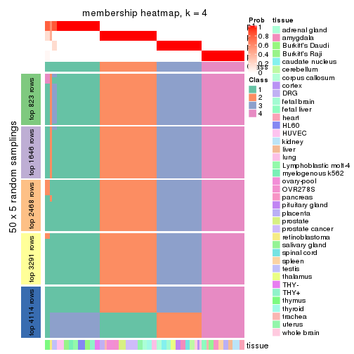</p>

</div>
<div id='tab-MAD-skmeans-membership-heatmap-4'>
<pre><code class="r">membership_heatmap(res, k = 5)
</code></pre>

<p></p>

</div>
<div id='tab-MAD-skmeans-membership-heatmap-5'>
<pre><code class="r">membership_heatmap(res, k = 6)
</code></pre>

<p>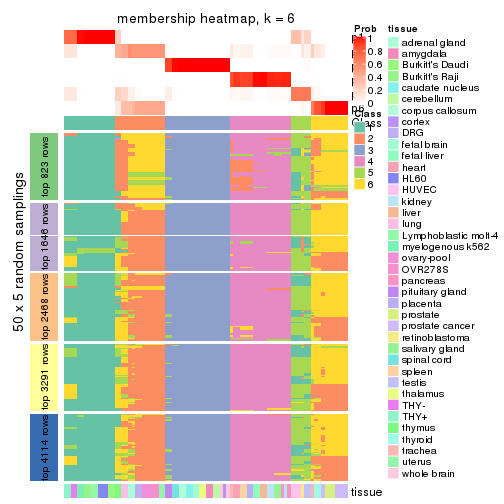</p>

</div>
</div>

As soon as we have had the classes for columns, we can look for signatures
which are significantly different between classes which can be candidate marks
for certain classes. Following are the heatmaps for signatures.


Signature heatmaps where rows are scaled:


<script>
$( function() {
	$( '#tabs-MAD-skmeans-get-signatures' ).tabs();
} );
</script>
<div id='tabs-MAD-skmeans-get-signatures'>
<ul>
<li><a href='#tab-MAD-skmeans-get-signatures-1'>k = 2</a></li>
<li><a href='#tab-MAD-skmeans-get-signatures-2'>k = 3</a></li>
<li><a href='#tab-MAD-skmeans-get-signatures-3'>k = 4</a></li>
<li><a href='#tab-MAD-skmeans-get-signatures-4'>k = 5</a></li>
<li><a href='#tab-MAD-skmeans-get-signatures-5'>k = 6</a></li>
</ul>
<div id='tab-MAD-skmeans-get-signatures-1'>
<pre><code class="r">get_signatures(res, k = 2)
</code></pre>

<p></p>

</div>
<div id='tab-MAD-skmeans-get-signatures-2'>
<pre><code class="r">get_signatures(res, k = 3)
</code></pre>

<p></p>

</div>
<div id='tab-MAD-skmeans-get-signatures-3'>
<pre><code class="r">get_signatures(res, k = 4)
</code></pre>

<p></p>

</div>
<div id='tab-MAD-skmeans-get-signatures-4'>
<pre><code class="r">get_signatures(res, k = 5)
</code></pre>

<p></p>

</div>
<div id='tab-MAD-skmeans-get-signatures-5'>
<pre><code class="r">get_signatures(res, k = 6)
</code></pre>

<p></p>

</div>
</div>


Signature heatmaps where rows are not scaled:


<script>
$( function() {
	$( '#tabs-MAD-skmeans-get-signatures-no-scale' ).tabs();
} );
</script>
<div id='tabs-MAD-skmeans-get-signatures-no-scale'>
<ul>
<li><a href='#tab-MAD-skmeans-get-signatures-no-scale-1'>k = 2</a></li>
<li><a href='#tab-MAD-skmeans-get-signatures-no-scale-2'>k = 3</a></li>
<li><a href='#tab-MAD-skmeans-get-signatures-no-scale-3'>k = 4</a></li>
<li><a href='#tab-MAD-skmeans-get-signatures-no-scale-4'>k = 5</a></li>
<li><a href='#tab-MAD-skmeans-get-signatures-no-scale-5'>k = 6</a></li>
</ul>
<div id='tab-MAD-skmeans-get-signatures-no-scale-1'>
<pre><code class="r">get_signatures(res, k = 2, scale_rows = FALSE)
</code></pre>

<p></p>

</div>
<div id='tab-MAD-skmeans-get-signatures-no-scale-2'>
<pre><code class="r">get_signatures(res, k = 3, scale_rows = FALSE)
</code></pre>

<p>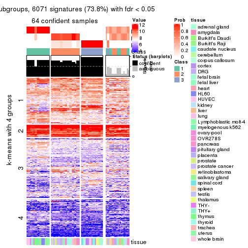</p>

</div>
<div id='tab-MAD-skmeans-get-signatures-no-scale-3'>
<pre><code class="r">get_signatures(res, k = 4, scale_rows = FALSE)
</code></pre>

<p></p>

</div>
<div id='tab-MAD-skmeans-get-signatures-no-scale-4'>
<pre><code class="r">get_signatures(res, k = 5, scale_rows = FALSE)
</code></pre>

<p></p>

</div>
<div id='tab-MAD-skmeans-get-signatures-no-scale-5'>
<pre><code class="r">get_signatures(res, k = 6, scale_rows = FALSE)
</code></pre>

<p></p>

</div>
</div>


Compare the overlap of signatures from different k:

```r
compare_signatures(res)
```


`get_signature()` returns a data frame invisibly. TO get the list of signatures, the function
call should be assigned to a variable explicitly. In following code, if `plot` argument is set
to `FALSE`, no heatmap is plotted while only the differential analysis is performed.

```r
# code only for demonstration
tb = get_signature(res, k = ..., plot = FALSE)
```

An example of the output of `tb` is:

```
#>   which_row         fdr    mean_1    mean_2 scaled_mean_1 scaled_mean_2 km
#> 1        38 0.042760348  8.373488  9.131774    -0.5533452     0.5164555  1
#> 2        40 0.018707592  7.106213  8.469186    -0.6173731     0.5762149  1
#> 3        55 0.019134737 10.221463 11.207825    -0.6159697     0.5749050  1
#> 4        59 0.006059896  5.921854  7.869574    -0.6899429     0.6439467  1
#> 5        60 0.018055526  8.928898 10.211722    -0.6204761     0.5791110  1
#> 6        98 0.009384629 15.714769 14.887706     0.6635654    -0.6193277  2
...
```

The columns in `tb` are:

1. `which_row`: row indices corresponding to the input matrix.
2. `fdr`: FDR for the differential test. 
3. `mean_x`: The mean value in group x.
4. `scaled_mean_x`: The mean value in group x after rows are scaled.
5. `km`: Row groups if k-means clustering is applied to rows.


UMAP plot which shows how samples are separated.


<script>
$( function() {
	$( '#tabs-MAD-skmeans-dimension-reduction' ).tabs();
} );
</script>
<div id='tabs-MAD-skmeans-dimension-reduction'>
<ul>
<li><a href='#tab-MAD-skmeans-dimension-reduction-1'>k = 2</a></li>
<li><a href='#tab-MAD-skmeans-dimension-reduction-2'>k = 3</a></li>
<li><a href='#tab-MAD-skmeans-dimension-reduction-3'>k = 4</a></li>
<li><a href='#tab-MAD-skmeans-dimension-reduction-4'>k = 5</a></li>
<li><a href='#tab-MAD-skmeans-dimension-reduction-5'>k = 6</a></li>
</ul>
<div id='tab-MAD-skmeans-dimension-reduction-1'>
<pre><code class="r">dimension_reduction(res, k = 2, method = &quot;UMAP&quot;)
</code></pre>

<p></p>

</div>
<div id='tab-MAD-skmeans-dimension-reduction-2'>
<pre><code class="r">dimension_reduction(res, k = 3, method = &quot;UMAP&quot;)
</code></pre>

<p></p>

</div>
<div id='tab-MAD-skmeans-dimension-reduction-3'>
<pre><code class="r">dimension_reduction(res, k = 4, method = &quot;UMAP&quot;)
</code></pre>

<p></p>

</div>
<div id='tab-MAD-skmeans-dimension-reduction-4'>
<pre><code class="r">dimension_reduction(res, k = 5, method = &quot;UMAP&quot;)
</code></pre>

<p></p>

</div>
<div id='tab-MAD-skmeans-dimension-reduction-5'>
<pre><code class="r">dimension_reduction(res, k = 6, method = &quot;UMAP&quot;)
</code></pre>

<p></p>

</div>
</div>


Following heatmap shows how subgroups are split when increasing `k`:

```r
collect_classes(res)
```


Test correlation between subgroups and known annotations. If the known
annotation is numeric, one-way ANOVA test is applied, and if the known
annotation is discrete, chi-squared contingency table test is applied.

```r
test_to_known_factors(res)
```

```
#>              n tissue(p) k
#> MAD:skmeans 83  3.39e-05 2
#> MAD:skmeans 64  1.46e-07 3
#> MAD:skmeans 83  4.22e-12 4
#> MAD:skmeans 82  3.49e-15 5
#> MAD:skmeans 77  8.02e-18 6
```


If matrix rows can be associated to genes, consider to use `GO_Enrichment(res,
...)` to perform function enrichment for the signature genes.


 

---------------------------------------------------


### MAD:pam*


The object with results only for a single top-value method and a single partition method 
can be extracted as:

```r
res = res_list["MAD", "pam"]
# you can also extract it by
# res = res_list["MAD:pam"]
```

A summary of `res` and all the functions that can be applied to it:

```r
res
```

```
#> A 'ConsensusPartition' object with k = 2, 3, 4, 5, 6.
#>   On a matrix with 8229 rows and 84 columns.
#>   Top rows (823, 1646, 2468, 3291, 4114) are extracted by 'MAD' method.
#>   Subgroups are detected by 'pam' method.
#>   Performed in total 1250 partitions by row resampling.
#>   Best k for subgroups seems to be 5.
#> 
#> Following methods can be applied to this 'ConsensusPartition' object:
#>  [1] "cola_report"             "collect_classes"         "collect_plots"          
#>  [4] "collect_stats"           "colnames"                "compare_signatures"     
#>  [7] "consensus_heatmap"       "dimension_reduction"     "functional_enrichment"  
#> [10] "get_anno_col"            "get_anno"                "get_classes"            
#> [13] "get_consensus"           "get_matrix"              "get_membership"         
#> [16] "get_param"               "get_signatures"          "get_stats"              
#> [19] "is_best_k"               "is_stable_k"             "membership_heatmap"     
#> [22] "ncol"                    "nrow"                    "plot_ecdf"              
#> [25] "rownames"                "select_partition_number" "show"                   
#> [28] "suggest_best_k"          "test_to_known_factors"
```

`collect_plots()` function collects all the plots made from `res` for all `k` (number of partitions)
into one single page to provide an easy and fast comparison between different `k`.

```r
collect_plots(res)
```


The plots are:

- The first row: a plot of the ECDF (Empirical cumulative distribution
  function) curves of the consensus matrix for each `k` and the heatmap of
  predicted classes for each `k`.
- The second row: heatmaps of the consensus matrix for each `k`.
- The third row: heatmaps of the membership matrix for each `k`.
- The fouth row: heatmaps of the signatures for each `k`.

All the plots in panels can be made by individual functions and they are
plotted later in this section.

`select_partition_number()` produces several plots showing different
statistics for choosing "optimized" `k`. There are following statistics:

- ECDF curves of the consensus matrix for each `k`;
- 1-PAC. [The PAC
  score](https://en.wikipedia.org/wiki/Consensus_clustering#Over-interpretation_potential_of_consensus_clustering)
  measures the proportion of the ambiguous subgrouping.
- Mean silhouette score.
- Concordance. The mean probability of fiting the consensus class ids in all
  partitions.
- Area increased. Denote $A_k$ as the area under the ECDF curve for current
  `k`, the area increased is defined as $A_k - A_{k-1}$.
- Rand index. The percent of pairs of samples that are both in a same cluster
  or both are not in a same cluster in the partition of k and k-1.
- Jaccard index. The ratio of pairs of samples are both in a same cluster in
  the partition of k and k-1 and the pairs of samples are both in a same
  cluster in the partition k or k-1.

The detailed explanations of these statistics can be found in [the cola
vignette](http://bioconductor.org/packages/devel/bioc/vignettes/cola/inst/doc/cola.html#toc_13).

Generally speaking, lower PAC score, higher mean silhouette score or higher
concordance corresponds to better partition. Rand index and Jaccard index
measure how similar the current partition is compared to partition with `k-1`.
If they are too similar, we won't accept `k` is better than `k-1`.

```r
select_partition_number(res)
```


The numeric values for all these statistics can be obtained by `get_stats()`.

```r
get_stats(res)
```

```
#>   k 1-PAC mean_silhouette concordance area_increased  Rand Jaccard
#> 2 2 0.491           0.806       0.827         0.3457 0.646   0.646
#> 3 3 1.000           0.984       0.994         0.7006 0.766   0.637
#> 4 4 0.862           0.805       0.930         0.2623 0.837   0.605
#> 5 5 0.925           0.831       0.932         0.0346 0.917   0.707
#> 6 6 0.876           0.820       0.914         0.0199 0.987   0.946
```

`suggest_best_k()` suggests the best $k$ based on these statistics. The rules are as follows:

- All $k$ with Jaccard index larger than 0.95 are removed because the increase of
  the partition number does not provides enough extra information. If all $k$ are removed,
  the best $k$ is assigned by `NA`.
- For $k$ with 1-PAC larger than 0.9, the maximal $k$ is taken as the "best k". Other $k$ is called "optional k".
- If it does not fit the second rule. The $k$ with the highest vote of highest
  1-PAC, mean silhouette and concordance is taken as the "best k".

```r
suggest_best_k(res)
```

```
#> [1] 5
#> attr(,"optional")
#> [1] 3
```

There is also optional best $k$ = 3 that is worth to check.

Following shows the table of the partitions (You need to click the **show/hide
code output** link to see it). The membership matrix (columns with name `p*`)
is inferred by
[`clue::cl_consensus()`](https://www.rdocumentation.org/link/cl_consensus?package=clue)
function with the `SE` method. Basically the value in the membership matrix
represents the probability to belong to a certain group. The finall class
label for an item is determined with the group with highest probability it
belongs to.

In `get_classes()` function, the entropy is calculated from the membership
matrix and the silhouette score is calculated from the consensus matrix.


<script>
$( function() {
	$( '#tabs-MAD-pam-get-classes' ).tabs();
} );
</script>
<div id='tabs-MAD-pam-get-classes'>
<ul>
<li><a href='#tab-MAD-pam-get-classes-1'>k = 2</a></li>
<li><a href='#tab-MAD-pam-get-classes-2'>k = 3</a></li>
<li><a href='#tab-MAD-pam-get-classes-3'>k = 4</a></li>
<li><a href='#tab-MAD-pam-get-classes-4'>k = 5</a></li>
<li><a href='#tab-MAD-pam-get-classes-5'>k = 6</a></li>
</ul>

<div id='tab-MAD-pam-get-classes-1'>
<p><a id='tab-MAD-pam-get-classes-1-a' style='color:#0366d6' href='#'>show/hide code output</a></p>
<pre><code class="r">cbind(get_classes(res, k = 2), get_membership(res, k = 2))
</code></pre>

<pre><code>#&gt;         class entropy silhouette    p1    p2
#&gt; GSM2819     1  0.9710      0.820 0.600 0.400
#&gt; GSM2820     2  0.0000      0.999 0.000 1.000
#&gt; GSM2822     1  0.9710      0.820 0.600 0.400
#&gt; GSM2832     1  0.9710      0.820 0.600 0.400
#&gt; GSM2823     1  0.9710      0.820 0.600 0.400
#&gt; GSM2824     1  0.9710      0.820 0.600 0.400
#&gt; GSM2825     1  0.9686      0.817 0.604 0.396
#&gt; GSM2826     1  0.9686      0.817 0.604 0.396
#&gt; GSM2829     1  0.9710      0.820 0.600 0.400
#&gt; GSM2856     1  0.9710      0.820 0.600 0.400
#&gt; GSM2830     1  0.9710      0.820 0.600 0.400
#&gt; GSM2843     1  0.9710      0.820 0.600 0.400
#&gt; GSM2871     1  0.9710      0.820 0.600 0.400
#&gt; GSM2831     1  0.9710      0.820 0.600 0.400
#&gt; GSM2844     1  0.9710      0.820 0.600 0.400
#&gt; GSM2833     1  0.9710      0.820 0.600 0.400
#&gt; GSM2846     1  0.9710      0.820 0.600 0.400
#&gt; GSM2835     1  0.9710      0.820 0.600 0.400
#&gt; GSM2858     1  0.9710      0.820 0.600 0.400
#&gt; GSM2836     1  0.9710      0.820 0.600 0.400
#&gt; GSM2848     1  0.9710      0.820 0.600 0.400
#&gt; GSM2828     2  0.0000      0.999 0.000 1.000
#&gt; GSM2837     2  0.0000      0.999 0.000 1.000
#&gt; GSM2839     1  0.0000      0.560 1.000 0.000
#&gt; GSM2841     1  0.0000      0.560 1.000 0.000
#&gt; GSM2827     1  0.9710      0.820 0.600 0.400
#&gt; GSM2842     1  0.9710      0.820 0.600 0.400
#&gt; GSM2845     1  0.9710      0.820 0.600 0.400
#&gt; GSM2872     1  0.9710      0.820 0.600 0.400
#&gt; GSM2834     1  0.9710      0.820 0.600 0.400
#&gt; GSM2847     1  0.9710      0.820 0.600 0.400
#&gt; GSM2849     2  0.0000      0.999 0.000 1.000
#&gt; GSM2850     2  0.0000      0.999 0.000 1.000
#&gt; GSM2838     1  0.9710      0.820 0.600 0.400
#&gt; GSM2853     1  0.9710      0.820 0.600 0.400
#&gt; GSM2852     2  0.0000      0.999 0.000 1.000
#&gt; GSM2855     2  0.0000      0.999 0.000 1.000
#&gt; GSM2840     1  0.0000      0.560 1.000 0.000
#&gt; GSM2857     1  0.0000      0.560 1.000 0.000
#&gt; GSM2859     1  0.9710      0.820 0.600 0.400
#&gt; GSM2860     1  0.9710      0.820 0.600 0.400
#&gt; GSM2861     1  0.9710      0.820 0.600 0.400
#&gt; GSM2862     1  0.9710      0.820 0.600 0.400
#&gt; GSM2863     1  0.9710      0.820 0.600 0.400
#&gt; GSM2864     1  0.9710      0.820 0.600 0.400
#&gt; GSM2865     1  0.9710      0.820 0.600 0.400
#&gt; GSM2866     1  0.9710      0.820 0.600 0.400
#&gt; GSM2868     1  0.9710      0.820 0.600 0.400
#&gt; GSM2869     1  0.9710      0.820 0.600 0.400
#&gt; GSM2851     1  0.9710      0.820 0.600 0.400
#&gt; GSM2867     1  0.9710      0.820 0.600 0.400
#&gt; GSM2870     1  0.9710      0.820 0.600 0.400
#&gt; GSM2854     1  0.9710      0.820 0.600 0.400
#&gt; GSM2873     1  0.9710      0.820 0.600 0.400
#&gt; GSM2874     2  0.0000      0.999 0.000 1.000
#&gt; GSM2884     2  0.0000      0.999 0.000 1.000
#&gt; GSM2875     1  0.0000      0.560 1.000 0.000
#&gt; GSM2890     1  0.0000      0.560 1.000 0.000
#&gt; GSM2877     1  0.0000      0.560 1.000 0.000
#&gt; GSM2892     1  0.0000      0.560 1.000 0.000
#&gt; GSM2902     1  0.0000      0.560 1.000 0.000
#&gt; GSM2878     1  0.0000      0.560 1.000 0.000
#&gt; GSM2901     1  0.0000      0.560 1.000 0.000
#&gt; GSM2879     2  0.0376      0.993 0.004 0.996
#&gt; GSM2898     2  0.0938      0.981 0.012 0.988
#&gt; GSM2881     2  0.0000      0.999 0.000 1.000
#&gt; GSM2897     2  0.0000      0.999 0.000 1.000
#&gt; GSM2882     1  0.9710      0.820 0.600 0.400
#&gt; GSM2894     1  0.9710      0.820 0.600 0.400
#&gt; GSM2883     2  0.0000      0.999 0.000 1.000
#&gt; GSM2895     2  0.0000      0.999 0.000 1.000
#&gt; GSM2885     2  0.0000      0.999 0.000 1.000
#&gt; GSM2886     2  0.0000      0.999 0.000 1.000
#&gt; GSM2887     2  0.0000      0.999 0.000 1.000
#&gt; GSM2896     2  0.0000      0.999 0.000 1.000
#&gt; GSM2888     1  0.9710      0.820 0.600 0.400
#&gt; GSM2889     1  0.9710      0.820 0.600 0.400
#&gt; GSM2876     1  0.0000      0.560 1.000 0.000
#&gt; GSM2891     1  0.0000      0.560 1.000 0.000
#&gt; GSM2880     1  0.0000      0.560 1.000 0.000
#&gt; GSM2893     1  0.0000      0.560 1.000 0.000
#&gt; GSM2821     1  0.8016      0.702 0.756 0.244
#&gt; GSM2900     1  0.0672      0.564 0.992 0.008
#&gt; GSM2903     1  0.0938      0.566 0.988 0.012
</code></pre>

<script>
$('#tab-MAD-pam-get-classes-1-a').parent().next().next().hide();
$('#tab-MAD-pam-get-classes-1-a').click(function(){
  $('#tab-MAD-pam-get-classes-1-a').parent().next().next().toggle();
  return(false);
});
</script>
</div>

<div id='tab-MAD-pam-get-classes-2'>
<p><a id='tab-MAD-pam-get-classes-2-a' style='color:#0366d6' href='#'>show/hide code output</a></p>
<pre><code class="r">cbind(get_classes(res, k = 3), get_membership(res, k = 3))
</code></pre>

<pre><code>#&gt;         class entropy silhouette    p1    p2 p3
#&gt; GSM2819     2   0.000      0.995 0.000 1.000  0
#&gt; GSM2820     3   0.000      1.000 0.000 0.000  1
#&gt; GSM2822     2   0.000      0.995 0.000 1.000  0
#&gt; GSM2832     2   0.000      0.995 0.000 1.000  0
#&gt; GSM2823     2   0.000      0.995 0.000 1.000  0
#&gt; GSM2824     2   0.000      0.995 0.000 1.000  0
#&gt; GSM2825     2   0.000      0.995 0.000 1.000  0
#&gt; GSM2826     2   0.000      0.995 0.000 1.000  0
#&gt; GSM2829     2   0.000      0.995 0.000 1.000  0
#&gt; GSM2856     2   0.000      0.995 0.000 1.000  0
#&gt; GSM2830     2   0.000      0.995 0.000 1.000  0
#&gt; GSM2843     2   0.000      0.995 0.000 1.000  0
#&gt; GSM2871     2   0.000      0.995 0.000 1.000  0
#&gt; GSM2831     2   0.000      0.995 0.000 1.000  0
#&gt; GSM2844     2   0.000      0.995 0.000 1.000  0
#&gt; GSM2833     2   0.000      0.995 0.000 1.000  0
#&gt; GSM2846     2   0.000      0.995 0.000 1.000  0
#&gt; GSM2835     2   0.000      0.995 0.000 1.000  0
#&gt; GSM2858     2   0.000      0.995 0.000 1.000  0
#&gt; GSM2836     2   0.000      0.995 0.000 1.000  0
#&gt; GSM2848     2   0.000      0.995 0.000 1.000  0
#&gt; GSM2828     3   0.000      1.000 0.000 0.000  1
#&gt; GSM2837     3   0.000      1.000 0.000 0.000  1
#&gt; GSM2839     1   0.000      0.974 1.000 0.000  0
#&gt; GSM2841     1   0.000      0.974 1.000 0.000  0
#&gt; GSM2827     2   0.000      0.995 0.000 1.000  0
#&gt; GSM2842     2   0.000      0.995 0.000 1.000  0
#&gt; GSM2845     2   0.000      0.995 0.000 1.000  0
#&gt; GSM2872     2   0.000      0.995 0.000 1.000  0
#&gt; GSM2834     2   0.000      0.995 0.000 1.000  0
#&gt; GSM2847     2   0.000      0.995 0.000 1.000  0
#&gt; GSM2849     3   0.000      1.000 0.000 0.000  1
#&gt; GSM2850     3   0.000      1.000 0.000 0.000  1
#&gt; GSM2838     2   0.000      0.995 0.000 1.000  0
#&gt; GSM2853     2   0.000      0.995 0.000 1.000  0
#&gt; GSM2852     3   0.000      1.000 0.000 0.000  1
#&gt; GSM2855     3   0.000      1.000 0.000 0.000  1
#&gt; GSM2840     1   0.000      0.974 1.000 0.000  0
#&gt; GSM2857     1   0.000      0.974 1.000 0.000  0
#&gt; GSM2859     2   0.000      0.995 0.000 1.000  0
#&gt; GSM2860     2   0.000      0.995 0.000 1.000  0
#&gt; GSM2861     2   0.000      0.995 0.000 1.000  0
#&gt; GSM2862     2   0.000      0.995 0.000 1.000  0
#&gt; GSM2863     2   0.000      0.995 0.000 1.000  0
#&gt; GSM2864     2   0.000      0.995 0.000 1.000  0
#&gt; GSM2865     2   0.000      0.995 0.000 1.000  0
#&gt; GSM2866     2   0.000      0.995 0.000 1.000  0
#&gt; GSM2868     2   0.000      0.995 0.000 1.000  0
#&gt; GSM2869     2   0.000      0.995 0.000 1.000  0
#&gt; GSM2851     2   0.000      0.995 0.000 1.000  0
#&gt; GSM2867     2   0.000      0.995 0.000 1.000  0
#&gt; GSM2870     2   0.000      0.995 0.000 1.000  0
#&gt; GSM2854     2   0.000      0.995 0.000 1.000  0
#&gt; GSM2873     2   0.000      0.995 0.000 1.000  0
#&gt; GSM2874     3   0.000      1.000 0.000 0.000  1
#&gt; GSM2884     3   0.000      1.000 0.000 0.000  1
#&gt; GSM2875     1   0.000      0.974 1.000 0.000  0
#&gt; GSM2890     1   0.000      0.974 1.000 0.000  0
#&gt; GSM2877     1   0.000      0.974 1.000 0.000  0
#&gt; GSM2892     1   0.000      0.974 1.000 0.000  0
#&gt; GSM2902     1   0.000      0.974 1.000 0.000  0
#&gt; GSM2878     1   0.000      0.974 1.000 0.000  0
#&gt; GSM2901     1   0.000      0.974 1.000 0.000  0
#&gt; GSM2879     3   0.000      1.000 0.000 0.000  1
#&gt; GSM2898     3   0.000      1.000 0.000 0.000  1
#&gt; GSM2881     3   0.000      1.000 0.000 0.000  1
#&gt; GSM2897     3   0.000      1.000 0.000 0.000  1
#&gt; GSM2882     2   0.000      0.995 0.000 1.000  0
#&gt; GSM2894     2   0.000      0.995 0.000 1.000  0
#&gt; GSM2883     3   0.000      1.000 0.000 0.000  1
#&gt; GSM2895     3   0.000      1.000 0.000 0.000  1
#&gt; GSM2885     3   0.000      1.000 0.000 0.000  1
#&gt; GSM2886     3   0.000      1.000 0.000 0.000  1
#&gt; GSM2887     3   0.000      1.000 0.000 0.000  1
#&gt; GSM2896     3   0.000      1.000 0.000 0.000  1
#&gt; GSM2888     2   0.000      0.995 0.000 1.000  0
#&gt; GSM2889     2   0.000      0.995 0.000 1.000  0
#&gt; GSM2876     1   0.000      0.974 1.000 0.000  0
#&gt; GSM2891     1   0.000      0.974 1.000 0.000  0
#&gt; GSM2880     1   0.000      0.974 1.000 0.000  0
#&gt; GSM2893     1   0.000      0.974 1.000 0.000  0
#&gt; GSM2821     2   0.484      0.702 0.224 0.776  0
#&gt; GSM2900     1   0.348      0.828 0.872 0.128  0
#&gt; GSM2903     1   0.424      0.765 0.824 0.176  0
</code></pre>

<script>
$('#tab-MAD-pam-get-classes-2-a').parent().next().next().hide();
$('#tab-MAD-pam-get-classes-2-a').click(function(){
  $('#tab-MAD-pam-get-classes-2-a').parent().next().next().toggle();
  return(false);
});
</script>
</div>

<div id='tab-MAD-pam-get-classes-3'>
<p><a id='tab-MAD-pam-get-classes-3-a' style='color:#0366d6' href='#'>show/hide code output</a></p>
<pre><code class="r">cbind(get_classes(res, k = 4), get_membership(res, k = 4))
</code></pre>

<pre><code>#&gt;         class entropy silhouette    p1    p2 p3    p4
#&gt; GSM2819     2  0.2704     0.7654 0.000 0.876  0 0.124
#&gt; GSM2820     3  0.0000     1.0000 0.000 0.000  1 0.000
#&gt; GSM2822     4  0.5000     0.0517 0.000 0.496  0 0.504
#&gt; GSM2832     2  0.5000    -0.1150 0.000 0.500  0 0.500
#&gt; GSM2823     4  0.5000     0.0517 0.000 0.496  0 0.504
#&gt; GSM2824     2  0.4992    -0.0271 0.000 0.524  0 0.476
#&gt; GSM2825     4  0.5000     0.0517 0.000 0.496  0 0.504
#&gt; GSM2826     2  0.5000    -0.1008 0.000 0.504  0 0.496
#&gt; GSM2829     4  0.0000     0.8289 0.000 0.000  0 1.000
#&gt; GSM2856     4  0.0000     0.8289 0.000 0.000  0 1.000
#&gt; GSM2830     4  0.0000     0.8289 0.000 0.000  0 1.000
#&gt; GSM2843     4  0.0000     0.8289 0.000 0.000  0 1.000
#&gt; GSM2871     2  0.4992    -0.0236 0.000 0.524  0 0.476
#&gt; GSM2831     4  0.0000     0.8289 0.000 0.000  0 1.000
#&gt; GSM2844     4  0.0000     0.8289 0.000 0.000  0 1.000
#&gt; GSM2833     4  0.0000     0.8289 0.000 0.000  0 1.000
#&gt; GSM2846     4  0.0000     0.8289 0.000 0.000  0 1.000
#&gt; GSM2835     4  0.0000     0.8289 0.000 0.000  0 1.000
#&gt; GSM2858     4  0.0000     0.8289 0.000 0.000  0 1.000
#&gt; GSM2836     2  0.2081     0.8041 0.000 0.916  0 0.084
#&gt; GSM2848     2  0.3266     0.7100 0.000 0.832  0 0.168
#&gt; GSM2828     3  0.0000     1.0000 0.000 0.000  1 0.000
#&gt; GSM2837     3  0.0000     1.0000 0.000 0.000  1 0.000
#&gt; GSM2839     1  0.0000     0.9777 1.000 0.000  0 0.000
#&gt; GSM2841     1  0.0000     0.9777 1.000 0.000  0 0.000
#&gt; GSM2827     2  0.0000     0.8699 0.000 1.000  0 0.000
#&gt; GSM2842     2  0.0188     0.8676 0.000 0.996  0 0.004
#&gt; GSM2845     4  0.4679     0.4225 0.000 0.352  0 0.648
#&gt; GSM2872     4  0.0000     0.8289 0.000 0.000  0 1.000
#&gt; GSM2834     4  0.4761     0.3827 0.000 0.372  0 0.628
#&gt; GSM2847     4  0.0000     0.8289 0.000 0.000  0 1.000
#&gt; GSM2849     3  0.0000     1.0000 0.000 0.000  1 0.000
#&gt; GSM2850     3  0.0000     1.0000 0.000 0.000  1 0.000
#&gt; GSM2838     2  0.0000     0.8699 0.000 1.000  0 0.000
#&gt; GSM2853     2  0.0000     0.8699 0.000 1.000  0 0.000
#&gt; GSM2852     3  0.0000     1.0000 0.000 0.000  1 0.000
#&gt; GSM2855     3  0.0000     1.0000 0.000 0.000  1 0.000
#&gt; GSM2840     1  0.0000     0.9777 1.000 0.000  0 0.000
#&gt; GSM2857     1  0.0000     0.9777 1.000 0.000  0 0.000
#&gt; GSM2859     2  0.0000     0.8699 0.000 1.000  0 0.000
#&gt; GSM2860     2  0.0000     0.8699 0.000 1.000  0 0.000
#&gt; GSM2861     2  0.0000     0.8699 0.000 1.000  0 0.000
#&gt; GSM2862     2  0.0000     0.8699 0.000 1.000  0 0.000
#&gt; GSM2863     2  0.0000     0.8699 0.000 1.000  0 0.000
#&gt; GSM2864     2  0.0000     0.8699 0.000 1.000  0 0.000
#&gt; GSM2865     2  0.0000     0.8699 0.000 1.000  0 0.000
#&gt; GSM2866     2  0.0000     0.8699 0.000 1.000  0 0.000
#&gt; GSM2868     2  0.0000     0.8699 0.000 1.000  0 0.000
#&gt; GSM2869     2  0.0000     0.8699 0.000 1.000  0 0.000
#&gt; GSM2851     2  0.0000     0.8699 0.000 1.000  0 0.000
#&gt; GSM2867     2  0.0000     0.8699 0.000 1.000  0 0.000
#&gt; GSM2870     2  0.0000     0.8699 0.000 1.000  0 0.000
#&gt; GSM2854     4  0.1389     0.7966 0.000 0.048  0 0.952
#&gt; GSM2873     4  0.5000     0.0517 0.000 0.496  0 0.504
#&gt; GSM2874     3  0.0000     1.0000 0.000 0.000  1 0.000
#&gt; GSM2884     3  0.0000     1.0000 0.000 0.000  1 0.000
#&gt; GSM2875     1  0.0000     0.9777 1.000 0.000  0 0.000
#&gt; GSM2890     1  0.0000     0.9777 1.000 0.000  0 0.000
#&gt; GSM2877     1  0.0000     0.9777 1.000 0.000  0 0.000
#&gt; GSM2892     1  0.0000     0.9777 1.000 0.000  0 0.000
#&gt; GSM2902     1  0.0000     0.9777 1.000 0.000  0 0.000
#&gt; GSM2878     1  0.0000     0.9777 1.000 0.000  0 0.000
#&gt; GSM2901     1  0.0000     0.9777 1.000 0.000  0 0.000
#&gt; GSM2879     3  0.0000     1.0000 0.000 0.000  1 0.000
#&gt; GSM2898     3  0.0000     1.0000 0.000 0.000  1 0.000
#&gt; GSM2881     3  0.0000     1.0000 0.000 0.000  1 0.000
#&gt; GSM2897     3  0.0000     1.0000 0.000 0.000  1 0.000
#&gt; GSM2882     4  0.0000     0.8289 0.000 0.000  0 1.000
#&gt; GSM2894     4  0.0000     0.8289 0.000 0.000  0 1.000
#&gt; GSM2883     3  0.0000     1.0000 0.000 0.000  1 0.000
#&gt; GSM2895     3  0.0000     1.0000 0.000 0.000  1 0.000
#&gt; GSM2885     3  0.0000     1.0000 0.000 0.000  1 0.000
#&gt; GSM2886     3  0.0000     1.0000 0.000 0.000  1 0.000
#&gt; GSM2887     3  0.0000     1.0000 0.000 0.000  1 0.000
#&gt; GSM2896     3  0.0000     1.0000 0.000 0.000  1 0.000
#&gt; GSM2888     2  0.0188     0.8676 0.000 0.996  0 0.004
#&gt; GSM2889     2  0.0000     0.8699 0.000 1.000  0 0.000
#&gt; GSM2876     1  0.0000     0.9777 1.000 0.000  0 0.000
#&gt; GSM2891     1  0.0000     0.9777 1.000 0.000  0 0.000
#&gt; GSM2880     1  0.0000     0.9777 1.000 0.000  0 0.000
#&gt; GSM2893     1  0.0000     0.9777 1.000 0.000  0 0.000
#&gt; GSM2821     2  0.7010     0.3863 0.184 0.576  0 0.240
#&gt; GSM2900     1  0.4259     0.8129 0.816 0.128  0 0.056
#&gt; GSM2903     1  0.4410     0.7885 0.808 0.064  0 0.128
</code></pre>

<script>
$('#tab-MAD-pam-get-classes-3-a').parent().next().next().hide();
$('#tab-MAD-pam-get-classes-3-a').click(function(){
  $('#tab-MAD-pam-get-classes-3-a').parent().next().next().toggle();
  return(false);
});
</script>
</div>

<div id='tab-MAD-pam-get-classes-4'>
<p><a id='tab-MAD-pam-get-classes-4-a' style='color:#0366d6' href='#'>show/hide code output</a></p>
<pre><code class="r">cbind(get_classes(res, k = 5), get_membership(res, k = 5))
</code></pre>

<pre><code>#&gt;         class entropy silhouette    p1    p2 p3    p4    p5
#&gt; GSM2819     5  0.1741      0.920 0.000 0.040  0 0.024 0.936
#&gt; GSM2820     3  0.0000      1.000 0.000 0.000  1 0.000 0.000
#&gt; GSM2822     2  0.4304      0.191 0.000 0.516  0 0.484 0.000
#&gt; GSM2832     2  0.4302      0.202 0.000 0.520  0 0.480 0.000
#&gt; GSM2823     2  0.4560      0.175 0.000 0.508  0 0.484 0.008
#&gt; GSM2824     4  0.6779      0.113 0.000 0.300  0 0.392 0.308
#&gt; GSM2825     2  0.4304      0.191 0.000 0.516  0 0.484 0.000
#&gt; GSM2826     2  0.4300      0.212 0.000 0.524  0 0.476 0.000
#&gt; GSM2829     4  0.0000      0.896 0.000 0.000  0 1.000 0.000
#&gt; GSM2856     4  0.0000      0.896 0.000 0.000  0 1.000 0.000
#&gt; GSM2830     4  0.0000      0.896 0.000 0.000  0 1.000 0.000
#&gt; GSM2843     4  0.0000      0.896 0.000 0.000  0 1.000 0.000
#&gt; GSM2871     2  0.4294      0.227 0.000 0.532  0 0.468 0.000
#&gt; GSM2831     4  0.0000      0.896 0.000 0.000  0 1.000 0.000
#&gt; GSM2844     4  0.0000      0.896 0.000 0.000  0 1.000 0.000
#&gt; GSM2833     4  0.0000      0.896 0.000 0.000  0 1.000 0.000
#&gt; GSM2846     4  0.0000      0.896 0.000 0.000  0 1.000 0.000
#&gt; GSM2835     4  0.0000      0.896 0.000 0.000  0 1.000 0.000
#&gt; GSM2858     4  0.0000      0.896 0.000 0.000  0 1.000 0.000
#&gt; GSM2836     2  0.1792      0.773 0.000 0.916  0 0.084 0.000
#&gt; GSM2848     2  0.2690      0.718 0.000 0.844  0 0.156 0.000
#&gt; GSM2828     3  0.0000      1.000 0.000 0.000  1 0.000 0.000
#&gt; GSM2837     3  0.0000      1.000 0.000 0.000  1 0.000 0.000
#&gt; GSM2839     1  0.1478      0.957 0.936 0.000  0 0.000 0.064
#&gt; GSM2841     1  0.1478      0.957 0.936 0.000  0 0.000 0.064
#&gt; GSM2827     2  0.0162      0.819 0.000 0.996  0 0.000 0.004
#&gt; GSM2842     2  0.0771      0.818 0.000 0.976  0 0.004 0.020
#&gt; GSM2845     4  0.4015      0.341 0.000 0.348  0 0.652 0.000
#&gt; GSM2872     4  0.0000      0.896 0.000 0.000  0 1.000 0.000
#&gt; GSM2834     4  0.4138      0.229 0.000 0.384  0 0.616 0.000
#&gt; GSM2847     4  0.0000      0.896 0.000 0.000  0 1.000 0.000
#&gt; GSM2849     3  0.0000      1.000 0.000 0.000  1 0.000 0.000
#&gt; GSM2850     3  0.0000      1.000 0.000 0.000  1 0.000 0.000
#&gt; GSM2838     2  0.0609      0.818 0.000 0.980  0 0.000 0.020
#&gt; GSM2853     2  0.0609      0.818 0.000 0.980  0 0.000 0.020
#&gt; GSM2852     3  0.0000      1.000 0.000 0.000  1 0.000 0.000
#&gt; GSM2855     3  0.0000      1.000 0.000 0.000  1 0.000 0.000
#&gt; GSM2840     1  0.1478      0.957 0.936 0.000  0 0.000 0.064
#&gt; GSM2857     1  0.1478      0.957 0.936 0.000  0 0.000 0.064
#&gt; GSM2859     2  0.0000      0.818 0.000 1.000  0 0.000 0.000
#&gt; GSM2860     2  0.0000      0.818 0.000 1.000  0 0.000 0.000
#&gt; GSM2861     2  0.0000      0.818 0.000 1.000  0 0.000 0.000
#&gt; GSM2862     2  0.0000      0.818 0.000 1.000  0 0.000 0.000
#&gt; GSM2863     2  0.0000      0.818 0.000 1.000  0 0.000 0.000
#&gt; GSM2864     2  0.0000      0.818 0.000 1.000  0 0.000 0.000
#&gt; GSM2865     2  0.0000      0.818 0.000 1.000  0 0.000 0.000
#&gt; GSM2866     2  0.0000      0.818 0.000 1.000  0 0.000 0.000
#&gt; GSM2868     2  0.0609      0.818 0.000 0.980  0 0.000 0.020
#&gt; GSM2869     2  0.0609      0.818 0.000 0.980  0 0.000 0.020
#&gt; GSM2851     2  0.0609      0.818 0.000 0.980  0 0.000 0.020
#&gt; GSM2867     2  0.0609      0.818 0.000 0.980  0 0.000 0.020
#&gt; GSM2870     2  0.0609      0.818 0.000 0.980  0 0.000 0.020
#&gt; GSM2854     4  0.1197      0.850 0.000 0.048  0 0.952 0.000
#&gt; GSM2873     2  0.4304      0.191 0.000 0.516  0 0.484 0.000
#&gt; GSM2874     3  0.0000      1.000 0.000 0.000  1 0.000 0.000
#&gt; GSM2884     3  0.0000      1.000 0.000 0.000  1 0.000 0.000
#&gt; GSM2875     1  0.0000      0.972 1.000 0.000  0 0.000 0.000
#&gt; GSM2890     1  0.0000      0.972 1.000 0.000  0 0.000 0.000
#&gt; GSM2877     1  0.0000      0.972 1.000 0.000  0 0.000 0.000
#&gt; GSM2892     1  0.0000      0.972 1.000 0.000  0 0.000 0.000
#&gt; GSM2902     1  0.0000      0.972 1.000 0.000  0 0.000 0.000
#&gt; GSM2878     1  0.0000      0.972 1.000 0.000  0 0.000 0.000
#&gt; GSM2901     1  0.0000      0.972 1.000 0.000  0 0.000 0.000
#&gt; GSM2879     3  0.0000      1.000 0.000 0.000  1 0.000 0.000
#&gt; GSM2898     3  0.0000      1.000 0.000 0.000  1 0.000 0.000
#&gt; GSM2881     3  0.0000      1.000 0.000 0.000  1 0.000 0.000
#&gt; GSM2897     3  0.0000      1.000 0.000 0.000  1 0.000 0.000
#&gt; GSM2882     4  0.0000      0.896 0.000 0.000  0 1.000 0.000
#&gt; GSM2894     4  0.0000      0.896 0.000 0.000  0 1.000 0.000
#&gt; GSM2883     3  0.0000      1.000 0.000 0.000  1 0.000 0.000
#&gt; GSM2895     3  0.0000      1.000 0.000 0.000  1 0.000 0.000
#&gt; GSM2885     3  0.0000      1.000 0.000 0.000  1 0.000 0.000
#&gt; GSM2886     3  0.0000      1.000 0.000 0.000  1 0.000 0.000
#&gt; GSM2887     3  0.0000      1.000 0.000 0.000  1 0.000 0.000
#&gt; GSM2896     3  0.0000      1.000 0.000 0.000  1 0.000 0.000
#&gt; GSM2888     2  0.0771      0.818 0.000 0.976  0 0.004 0.020
#&gt; GSM2889     2  0.0609      0.818 0.000 0.980  0 0.000 0.020
#&gt; GSM2876     1  0.1478      0.957 0.936 0.000  0 0.000 0.064
#&gt; GSM2891     1  0.1478      0.957 0.936 0.000  0 0.000 0.064
#&gt; GSM2880     1  0.0000      0.972 1.000 0.000  0 0.000 0.000
#&gt; GSM2893     1  0.0000      0.972 1.000 0.000  0 0.000 0.000
#&gt; GSM2821     5  0.0000      0.962 0.000 0.000  0 0.000 1.000
#&gt; GSM2900     5  0.0510      0.964 0.016 0.000  0 0.000 0.984
#&gt; GSM2903     5  0.0510      0.964 0.016 0.000  0 0.000 0.984
</code></pre>

<script>
$('#tab-MAD-pam-get-classes-4-a').parent().next().next().hide();
$('#tab-MAD-pam-get-classes-4-a').click(function(){
  $('#tab-MAD-pam-get-classes-4-a').parent().next().next().toggle();
  return(false);
});
</script>
</div>

<div id='tab-MAD-pam-get-classes-5'>
<p><a id='tab-MAD-pam-get-classes-5-a' style='color:#0366d6' href='#'>show/hide code output</a></p>
<pre><code class="r">cbind(get_classes(res, k = 6), get_membership(res, k = 6))
</code></pre>

<pre><code>#&gt;         class entropy silhouette    p1    p2    p3    p4    p5    p6
#&gt; GSM2819     5  0.0363     0.9824 0.000 0.012 0.000 0.000 0.988 0.000
#&gt; GSM2820     3  0.0000     0.9995 0.000 0.000 1.000 0.000 0.000 0.000
#&gt; GSM2822     2  0.3997     0.2049 0.000 0.508 0.000 0.488 0.000 0.004
#&gt; GSM2832     2  0.3866     0.2160 0.000 0.516 0.000 0.484 0.000 0.000
#&gt; GSM2823     2  0.4097     0.1912 0.000 0.504 0.000 0.488 0.008 0.000
#&gt; GSM2824     4  0.6317     0.0319 0.000 0.308 0.000 0.376 0.308 0.008
#&gt; GSM2825     2  0.4184     0.1844 0.000 0.500 0.000 0.488 0.000 0.012
#&gt; GSM2826     2  0.4183     0.2080 0.000 0.508 0.000 0.480 0.000 0.012
#&gt; GSM2829     4  0.0000     0.8958 0.000 0.000 0.000 1.000 0.000 0.000
#&gt; GSM2856     4  0.0000     0.8958 0.000 0.000 0.000 1.000 0.000 0.000
#&gt; GSM2830     4  0.0000     0.8958 0.000 0.000 0.000 1.000 0.000 0.000
#&gt; GSM2843     4  0.0000     0.8958 0.000 0.000 0.000 1.000 0.000 0.000
#&gt; GSM2871     2  0.4175     0.2547 0.000 0.524 0.000 0.464 0.000 0.012
#&gt; GSM2831     4  0.0000     0.8958 0.000 0.000 0.000 1.000 0.000 0.000
#&gt; GSM2844     4  0.0000     0.8958 0.000 0.000 0.000 1.000 0.000 0.000
#&gt; GSM2833     4  0.0000     0.8958 0.000 0.000 0.000 1.000 0.000 0.000
#&gt; GSM2846     4  0.0000     0.8958 0.000 0.000 0.000 1.000 0.000 0.000
#&gt; GSM2835     4  0.0000     0.8958 0.000 0.000 0.000 1.000 0.000 0.000
#&gt; GSM2858     4  0.0000     0.8958 0.000 0.000 0.000 1.000 0.000 0.000
#&gt; GSM2836     2  0.3372     0.7582 0.000 0.816 0.000 0.084 0.000 0.100
#&gt; GSM2848     2  0.3920     0.7162 0.000 0.764 0.000 0.148 0.000 0.088
#&gt; GSM2828     3  0.0000     0.9995 0.000 0.000 1.000 0.000 0.000 0.000
#&gt; GSM2837     3  0.0000     0.9995 0.000 0.000 1.000 0.000 0.000 0.000
#&gt; GSM2839     6  0.2346     1.0000 0.124 0.000 0.000 0.000 0.008 0.868
#&gt; GSM2841     6  0.2346     1.0000 0.124 0.000 0.000 0.000 0.008 0.868
#&gt; GSM2827     2  0.1663     0.7853 0.000 0.912 0.000 0.000 0.000 0.088
#&gt; GSM2842     2  0.0405     0.7843 0.000 0.988 0.000 0.004 0.000 0.008
#&gt; GSM2845     4  0.3620     0.3050 0.000 0.352 0.000 0.648 0.000 0.000
#&gt; GSM2872     4  0.0000     0.8958 0.000 0.000 0.000 1.000 0.000 0.000
#&gt; GSM2834     4  0.3717     0.1959 0.000 0.384 0.000 0.616 0.000 0.000
#&gt; GSM2847     4  0.0000     0.8958 0.000 0.000 0.000 1.000 0.000 0.000
#&gt; GSM2849     3  0.0000     0.9995 0.000 0.000 1.000 0.000 0.000 0.000
#&gt; GSM2850     3  0.0000     0.9995 0.000 0.000 1.000 0.000 0.000 0.000
#&gt; GSM2838     2  0.0363     0.7837 0.000 0.988 0.000 0.000 0.000 0.012
#&gt; GSM2853     2  0.0363     0.7837 0.000 0.988 0.000 0.000 0.000 0.012
#&gt; GSM2852     3  0.0260     0.9907 0.000 0.008 0.992 0.000 0.000 0.000
#&gt; GSM2855     3  0.0000     0.9995 0.000 0.000 1.000 0.000 0.000 0.000
#&gt; GSM2840     6  0.2346     1.0000 0.124 0.000 0.000 0.000 0.008 0.868
#&gt; GSM2857     6  0.2346     1.0000 0.124 0.000 0.000 0.000 0.008 0.868
#&gt; GSM2859     2  0.2048     0.7832 0.000 0.880 0.000 0.000 0.000 0.120
#&gt; GSM2860     2  0.2048     0.7832 0.000 0.880 0.000 0.000 0.000 0.120
#&gt; GSM2861     2  0.2048     0.7832 0.000 0.880 0.000 0.000 0.000 0.120
#&gt; GSM2862     2  0.2048     0.7832 0.000 0.880 0.000 0.000 0.000 0.120
#&gt; GSM2863     2  0.2048     0.7832 0.000 0.880 0.000 0.000 0.000 0.120
#&gt; GSM2864     2  0.2048     0.7832 0.000 0.880 0.000 0.000 0.000 0.120
#&gt; GSM2865     2  0.2048     0.7832 0.000 0.880 0.000 0.000 0.000 0.120
#&gt; GSM2866     2  0.2048     0.7832 0.000 0.880 0.000 0.000 0.000 0.120
#&gt; GSM2868     2  0.0363     0.7837 0.000 0.988 0.000 0.000 0.000 0.012
#&gt; GSM2869     2  0.0363     0.7837 0.000 0.988 0.000 0.000 0.000 0.012
#&gt; GSM2851     2  0.0363     0.7837 0.000 0.988 0.000 0.000 0.000 0.012
#&gt; GSM2867     2  0.0363     0.7837 0.000 0.988 0.000 0.000 0.000 0.012
#&gt; GSM2870     2  0.0363     0.7837 0.000 0.988 0.000 0.000 0.000 0.012
#&gt; GSM2854     4  0.1075     0.8510 0.000 0.048 0.000 0.952 0.000 0.000
#&gt; GSM2873     2  0.3867     0.2051 0.000 0.512 0.000 0.488 0.000 0.000
#&gt; GSM2874     3  0.0000     0.9995 0.000 0.000 1.000 0.000 0.000 0.000
#&gt; GSM2884     3  0.0000     0.9995 0.000 0.000 1.000 0.000 0.000 0.000
#&gt; GSM2875     1  0.0000     0.9605 1.000 0.000 0.000 0.000 0.000 0.000
#&gt; GSM2890     1  0.0000     0.9605 1.000 0.000 0.000 0.000 0.000 0.000
#&gt; GSM2877     1  0.0000     0.9605 1.000 0.000 0.000 0.000 0.000 0.000
#&gt; GSM2892     1  0.0000     0.9605 1.000 0.000 0.000 0.000 0.000 0.000
#&gt; GSM2902     1  0.0000     0.9605 1.000 0.000 0.000 0.000 0.000 0.000
#&gt; GSM2878     1  0.0000     0.9605 1.000 0.000 0.000 0.000 0.000 0.000
#&gt; GSM2901     1  0.0000     0.9605 1.000 0.000 0.000 0.000 0.000 0.000
#&gt; GSM2879     3  0.0000     0.9995 0.000 0.000 1.000 0.000 0.000 0.000
#&gt; GSM2898     3  0.0000     0.9995 0.000 0.000 1.000 0.000 0.000 0.000
#&gt; GSM2881     3  0.0000     0.9995 0.000 0.000 1.000 0.000 0.000 0.000
#&gt; GSM2897     3  0.0000     0.9995 0.000 0.000 1.000 0.000 0.000 0.000
#&gt; GSM2882     4  0.0000     0.8958 0.000 0.000 0.000 1.000 0.000 0.000
#&gt; GSM2894     4  0.0000     0.8958 0.000 0.000 0.000 1.000 0.000 0.000
#&gt; GSM2883     3  0.0000     0.9995 0.000 0.000 1.000 0.000 0.000 0.000
#&gt; GSM2895     3  0.0000     0.9995 0.000 0.000 1.000 0.000 0.000 0.000
#&gt; GSM2885     3  0.0000     0.9995 0.000 0.000 1.000 0.000 0.000 0.000
#&gt; GSM2886     3  0.0000     0.9995 0.000 0.000 1.000 0.000 0.000 0.000
#&gt; GSM2887     3  0.0000     0.9995 0.000 0.000 1.000 0.000 0.000 0.000
#&gt; GSM2896     3  0.0000     0.9995 0.000 0.000 1.000 0.000 0.000 0.000
#&gt; GSM2888     2  0.0363     0.7837 0.000 0.988 0.000 0.000 0.000 0.012
#&gt; GSM2889     2  0.0363     0.7837 0.000 0.988 0.000 0.000 0.000 0.012
#&gt; GSM2876     1  0.2669     0.7919 0.836 0.000 0.000 0.000 0.008 0.156
#&gt; GSM2891     1  0.2706     0.7865 0.832 0.000 0.000 0.000 0.008 0.160
#&gt; GSM2880     1  0.0000     0.9605 1.000 0.000 0.000 0.000 0.000 0.000
#&gt; GSM2893     1  0.0000     0.9605 1.000 0.000 0.000 0.000 0.000 0.000
#&gt; GSM2821     5  0.0000     0.9941 0.000 0.000 0.000 0.000 1.000 0.000
#&gt; GSM2900     5  0.0000     0.9941 0.000 0.000 0.000 0.000 1.000 0.000
#&gt; GSM2903     5  0.0000     0.9941 0.000 0.000 0.000 0.000 1.000 0.000
</code></pre>

<script>
$('#tab-MAD-pam-get-classes-5-a').parent().next().next().hide();
$('#tab-MAD-pam-get-classes-5-a').click(function(){
  $('#tab-MAD-pam-get-classes-5-a').parent().next().next().toggle();
  return(false);
});
</script>
</div>
</div>

Heatmaps for the consensus matrix. It visualizes the probability of two
samples to be in a same group.


<script>
$( function() {
	$( '#tabs-MAD-pam-consensus-heatmap' ).tabs();
} );
</script>
<div id='tabs-MAD-pam-consensus-heatmap'>
<ul>
<li><a href='#tab-MAD-pam-consensus-heatmap-1'>k = 2</a></li>
<li><a href='#tab-MAD-pam-consensus-heatmap-2'>k = 3</a></li>
<li><a href='#tab-MAD-pam-consensus-heatmap-3'>k = 4</a></li>
<li><a href='#tab-MAD-pam-consensus-heatmap-4'>k = 5</a></li>
<li><a href='#tab-MAD-pam-consensus-heatmap-5'>k = 6</a></li>
</ul>
<div id='tab-MAD-pam-consensus-heatmap-1'>
<pre><code class="r">consensus_heatmap(res, k = 2)
</code></pre>

<p></p>

</div>
<div id='tab-MAD-pam-consensus-heatmap-2'>
<pre><code class="r">consensus_heatmap(res, k = 3)
</code></pre>

<p></p>

</div>
<div id='tab-MAD-pam-consensus-heatmap-3'>
<pre><code class="r">consensus_heatmap(res, k = 4)
</code></pre>

<p></p>

</div>
<div id='tab-MAD-pam-consensus-heatmap-4'>
<pre><code class="r">consensus_heatmap(res, k = 5)
</code></pre>

<p></p>

</div>
<div id='tab-MAD-pam-consensus-heatmap-5'>
<pre><code class="r">consensus_heatmap(res, k = 6)
</code></pre>

<p></p>

</div>
</div>

Heatmaps for the membership of samples in all partitions to see how consistent they are:


<script>
$( function() {
	$( '#tabs-MAD-pam-membership-heatmap' ).tabs();
} );
</script>
<div id='tabs-MAD-pam-membership-heatmap'>
<ul>
<li><a href='#tab-MAD-pam-membership-heatmap-1'>k = 2</a></li>
<li><a href='#tab-MAD-pam-membership-heatmap-2'>k = 3</a></li>
<li><a href='#tab-MAD-pam-membership-heatmap-3'>k = 4</a></li>
<li><a href='#tab-MAD-pam-membership-heatmap-4'>k = 5</a></li>
<li><a href='#tab-MAD-pam-membership-heatmap-5'>k = 6</a></li>
</ul>
<div id='tab-MAD-pam-membership-heatmap-1'>
<pre><code class="r">membership_heatmap(res, k = 2)
</code></pre>

<p></p>

</div>
<div id='tab-MAD-pam-membership-heatmap-2'>
<pre><code class="r">membership_heatmap(res, k = 3)
</code></pre>

<p></p>

</div>
<div id='tab-MAD-pam-membership-heatmap-3'>
<pre><code class="r">membership_heatmap(res, k = 4)
</code></pre>

<p></p>

</div>
<div id='tab-MAD-pam-membership-heatmap-4'>
<pre><code class="r">membership_heatmap(res, k = 5)
</code></pre>

<p></p>

</div>
<div id='tab-MAD-pam-membership-heatmap-5'>
<pre><code class="r">membership_heatmap(res, k = 6)
</code></pre>

<p></p>

</div>
</div>

As soon as we have had the classes for columns, we can look for signatures
which are significantly different between classes which can be candidate marks
for certain classes. Following are the heatmaps for signatures.


Signature heatmaps where rows are scaled:


<script>
$( function() {
	$( '#tabs-MAD-pam-get-signatures' ).tabs();
} );
</script>
<div id='tabs-MAD-pam-get-signatures'>
<ul>
<li><a href='#tab-MAD-pam-get-signatures-1'>k = 2</a></li>
<li><a href='#tab-MAD-pam-get-signatures-2'>k = 3</a></li>
<li><a href='#tab-MAD-pam-get-signatures-3'>k = 4</a></li>
<li><a href='#tab-MAD-pam-get-signatures-4'>k = 5</a></li>
<li><a href='#tab-MAD-pam-get-signatures-5'>k = 6</a></li>
</ul>
<div id='tab-MAD-pam-get-signatures-1'>
<pre><code class="r">get_signatures(res, k = 2)
</code></pre>

<p></p>

</div>
<div id='tab-MAD-pam-get-signatures-2'>
<pre><code class="r">get_signatures(res, k = 3)
</code></pre>

<p></p>

</div>
<div id='tab-MAD-pam-get-signatures-3'>
<pre><code class="r">get_signatures(res, k = 4)
</code></pre>

<p></p>

</div>
<div id='tab-MAD-pam-get-signatures-4'>
<pre><code class="r">get_signatures(res, k = 5)
</code></pre>

<p></p>

</div>
<div id='tab-MAD-pam-get-signatures-5'>
<pre><code class="r">get_signatures(res, k = 6)
</code></pre>

<p></p>

</div>
</div>


Signature heatmaps where rows are not scaled:


<script>
$( function() {
	$( '#tabs-MAD-pam-get-signatures-no-scale' ).tabs();
} );
</script>
<div id='tabs-MAD-pam-get-signatures-no-scale'>
<ul>
<li><a href='#tab-MAD-pam-get-signatures-no-scale-1'>k = 2</a></li>
<li><a href='#tab-MAD-pam-get-signatures-no-scale-2'>k = 3</a></li>
<li><a href='#tab-MAD-pam-get-signatures-no-scale-3'>k = 4</a></li>
<li><a href='#tab-MAD-pam-get-signatures-no-scale-4'>k = 5</a></li>
<li><a href='#tab-MAD-pam-get-signatures-no-scale-5'>k = 6</a></li>
</ul>
<div id='tab-MAD-pam-get-signatures-no-scale-1'>
<pre><code class="r">get_signatures(res, k = 2, scale_rows = FALSE)
</code></pre>

<p></p>

</div>
<div id='tab-MAD-pam-get-signatures-no-scale-2'>
<pre><code class="r">get_signatures(res, k = 3, scale_rows = FALSE)
</code></pre>

<p></p>

</div>
<div id='tab-MAD-pam-get-signatures-no-scale-3'>
<pre><code class="r">get_signatures(res, k = 4, scale_rows = FALSE)
</code></pre>

<p></p>

</div>
<div id='tab-MAD-pam-get-signatures-no-scale-4'>
<pre><code class="r">get_signatures(res, k = 5, scale_rows = FALSE)
</code></pre>

<p>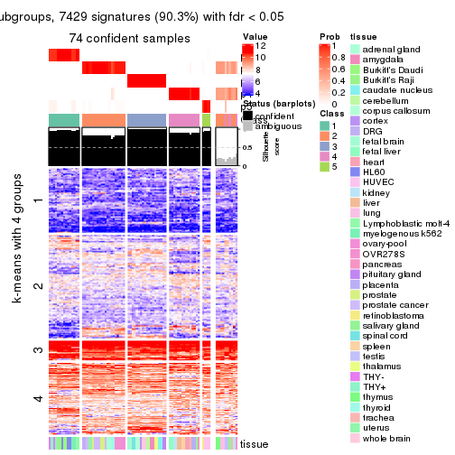</p>

</div>
<div id='tab-MAD-pam-get-signatures-no-scale-5'>
<pre><code class="r">get_signatures(res, k = 6, scale_rows = FALSE)
</code></pre>

<p></p>

</div>
</div>


Compare the overlap of signatures from different k:

```r
compare_signatures(res)
```


`get_signature()` returns a data frame invisibly. TO get the list of signatures, the function
call should be assigned to a variable explicitly. In following code, if `plot` argument is set
to `FALSE`, no heatmap is plotted while only the differential analysis is performed.

```r
# code only for demonstration
tb = get_signature(res, k = ..., plot = FALSE)
```

An example of the output of `tb` is:

```
#>   which_row         fdr    mean_1    mean_2 scaled_mean_1 scaled_mean_2 km
#> 1        38 0.042760348  8.373488  9.131774    -0.5533452     0.5164555  1
#> 2        40 0.018707592  7.106213  8.469186    -0.6173731     0.5762149  1
#> 3        55 0.019134737 10.221463 11.207825    -0.6159697     0.5749050  1
#> 4        59 0.006059896  5.921854  7.869574    -0.6899429     0.6439467  1
#> 5        60 0.018055526  8.928898 10.211722    -0.6204761     0.5791110  1
#> 6        98 0.009384629 15.714769 14.887706     0.6635654    -0.6193277  2
...
```

The columns in `tb` are:

1. `which_row`: row indices corresponding to the input matrix.
2. `fdr`: FDR for the differential test. 
3. `mean_x`: The mean value in group x.
4. `scaled_mean_x`: The mean value in group x after rows are scaled.
5. `km`: Row groups if k-means clustering is applied to rows.


UMAP plot which shows how samples are separated.


<script>
$( function() {
	$( '#tabs-MAD-pam-dimension-reduction' ).tabs();
} );
</script>
<div id='tabs-MAD-pam-dimension-reduction'>
<ul>
<li><a href='#tab-MAD-pam-dimension-reduction-1'>k = 2</a></li>
<li><a href='#tab-MAD-pam-dimension-reduction-2'>k = 3</a></li>
<li><a href='#tab-MAD-pam-dimension-reduction-3'>k = 4</a></li>
<li><a href='#tab-MAD-pam-dimension-reduction-4'>k = 5</a></li>
<li><a href='#tab-MAD-pam-dimension-reduction-5'>k = 6</a></li>
</ul>
<div id='tab-MAD-pam-dimension-reduction-1'>
<pre><code class="r">dimension_reduction(res, k = 2, method = &quot;UMAP&quot;)
</code></pre>

<p></p>

</div>
<div id='tab-MAD-pam-dimension-reduction-2'>
<pre><code class="r">dimension_reduction(res, k = 3, method = &quot;UMAP&quot;)
</code></pre>

<p></p>

</div>
<div id='tab-MAD-pam-dimension-reduction-3'>
<pre><code class="r">dimension_reduction(res, k = 4, method = &quot;UMAP&quot;)
</code></pre>

<p></p>

</div>
<div id='tab-MAD-pam-dimension-reduction-4'>
<pre><code class="r">dimension_reduction(res, k = 5, method = &quot;UMAP&quot;)
</code></pre>

<p></p>

</div>
<div id='tab-MAD-pam-dimension-reduction-5'>
<pre><code class="r">dimension_reduction(res, k = 6, method = &quot;UMAP&quot;)
</code></pre>

<p></p>

</div>
</div>


Following heatmap shows how subgroups are split when increasing `k`:

```r
collect_classes(res)
```


Test correlation between subgroups and known annotations. If the known
annotation is numeric, one-way ANOVA test is applied, and if the known
annotation is discrete, chi-squared contingency table test is applied.

```r
test_to_known_factors(res)
```

```
#>          n tissue(p) k
#> MAD:pam 84  2.53e-05 2
#> MAD:pam 84  2.34e-08 3
#> MAD:pam 73  4.97e-10 4
#> MAD:pam 74  3.22e-13 5
#> MAD:pam 74  4.81e-16 6
```


If matrix rows can be associated to genes, consider to use `GO_Enrichment(res,
...)` to perform function enrichment for the signature genes.


 

---------------------------------------------------


### MAD:mclust**


The object with results only for a single top-value method and a single partition method 
can be extracted as:

```r
res = res_list["MAD", "mclust"]
# you can also extract it by
# res = res_list["MAD:mclust"]
```

A summary of `res` and all the functions that can be applied to it:

```r
res
```

```
#> A 'ConsensusPartition' object with k = 2, 3, 4, 5, 6.
#>   On a matrix with 8229 rows and 84 columns.
#>   Top rows (823, 1646, 2468, 3291, 4114) are extracted by 'MAD' method.
#>   Subgroups are detected by 'mclust' method.
#>   Performed in total 1250 partitions by row resampling.
#>   Best k for subgroups seems to be 3.
#> 
#> Following methods can be applied to this 'ConsensusPartition' object:
#>  [1] "cola_report"             "collect_classes"         "collect_plots"          
#>  [4] "collect_stats"           "colnames"                "compare_signatures"     
#>  [7] "consensus_heatmap"       "dimension_reduction"     "functional_enrichment"  
#> [10] "get_anno_col"            "get_anno"                "get_classes"            
#> [13] "get_consensus"           "get_matrix"              "get_membership"         
#> [16] "get_param"               "get_signatures"          "get_stats"              
#> [19] "is_best_k"               "is_stable_k"             "membership_heatmap"     
#> [22] "ncol"                    "nrow"                    "plot_ecdf"              
#> [25] "rownames"                "select_partition_number" "show"                   
#> [28] "suggest_best_k"          "test_to_known_factors"
```

`collect_plots()` function collects all the plots made from `res` for all `k` (number of partitions)
into one single page to provide an easy and fast comparison between different `k`.

```r
collect_plots(res)
```


The plots are:

- The first row: a plot of the ECDF (Empirical cumulative distribution
  function) curves of the consensus matrix for each `k` and the heatmap of
  predicted classes for each `k`.
- The second row: heatmaps of the consensus matrix for each `k`.
- The third row: heatmaps of the membership matrix for each `k`.
- The fouth row: heatmaps of the signatures for each `k`.

All the plots in panels can be made by individual functions and they are
plotted later in this section.

`select_partition_number()` produces several plots showing different
statistics for choosing "optimized" `k`. There are following statistics:

- ECDF curves of the consensus matrix for each `k`;
- 1-PAC. [The PAC
  score](https://en.wikipedia.org/wiki/Consensus_clustering#Over-interpretation_potential_of_consensus_clustering)
  measures the proportion of the ambiguous subgrouping.
- Mean silhouette score.
- Concordance. The mean probability of fiting the consensus class ids in all
  partitions.
- Area increased. Denote $A_k$ as the area under the ECDF curve for current
  `k`, the area increased is defined as $A_k - A_{k-1}$.
- Rand index. The percent of pairs of samples that are both in a same cluster
  or both are not in a same cluster in the partition of k and k-1.
- Jaccard index. The ratio of pairs of samples are both in a same cluster in
  the partition of k and k-1 and the pairs of samples are both in a same
  cluster in the partition k or k-1.

The detailed explanations of these statistics can be found in [the cola
vignette](http://bioconductor.org/packages/devel/bioc/vignettes/cola/inst/doc/cola.html#toc_13).

Generally speaking, lower PAC score, higher mean silhouette score or higher
concordance corresponds to better partition. Rand index and Jaccard index
measure how similar the current partition is compared to partition with `k-1`.
If they are too similar, we won't accept `k` is better than `k-1`.

```r
select_partition_number(res)
```

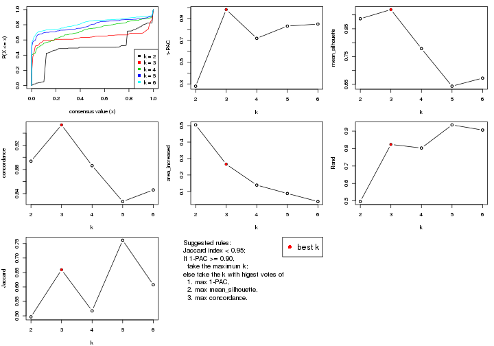

The numeric values for all these statistics can be obtained by `get_stats()`.

```r
get_stats(res)
```

```
#>   k 1-PAC mean_silhouette concordance area_increased  Rand Jaccard
#> 2 2 0.279           0.886       0.894         0.5045 0.497   0.497
#> 3 3 0.981           0.919       0.954         0.2655 0.824   0.659
#> 4 4 0.718           0.779       0.886         0.1384 0.803   0.517
#> 5 5 0.830           0.643       0.827         0.0875 0.936   0.761
#> 6 6 0.849           0.672       0.846         0.0387 0.906   0.607
```

`suggest_best_k()` suggests the best $k$ based on these statistics. The rules are as follows:

- All $k$ with Jaccard index larger than 0.95 are removed because the increase of
  the partition number does not provides enough extra information. If all $k$ are removed,
  the best $k$ is assigned by `NA`.
- For $k$ with 1-PAC larger than 0.9, the maximal $k$ is taken as the "best k". Other $k$ is called "optional k".
- If it does not fit the second rule. The $k$ with the highest vote of highest
  1-PAC, mean silhouette and concordance is taken as the "best k".

```r
suggest_best_k(res)
```

```
#> [1] 3
```


Following shows the table of the partitions (You need to click the **show/hide
code output** link to see it). The membership matrix (columns with name `p*`)
is inferred by
[`clue::cl_consensus()`](https://www.rdocumentation.org/link/cl_consensus?package=clue)
function with the `SE` method. Basically the value in the membership matrix
represents the probability to belong to a certain group. The finall class
label for an item is determined with the group with highest probability it
belongs to.

In `get_classes()` function, the entropy is calculated from the membership
matrix and the silhouette score is calculated from the consensus matrix.


<script>
$( function() {
	$( '#tabs-MAD-mclust-get-classes' ).tabs();
} );
</script>
<div id='tabs-MAD-mclust-get-classes'>
<ul>
<li><a href='#tab-MAD-mclust-get-classes-1'>k = 2</a></li>
<li><a href='#tab-MAD-mclust-get-classes-2'>k = 3</a></li>
<li><a href='#tab-MAD-mclust-get-classes-3'>k = 4</a></li>
<li><a href='#tab-MAD-mclust-get-classes-4'>k = 5</a></li>
<li><a href='#tab-MAD-mclust-get-classes-5'>k = 6</a></li>
</ul>

<div id='tab-MAD-mclust-get-classes-1'>
<p><a id='tab-MAD-mclust-get-classes-1-a' style='color:#0366d6' href='#'>show/hide code output</a></p>
<pre><code class="r">cbind(get_classes(res, k = 2), get_membership(res, k = 2))
</code></pre>

<pre><code>#&gt;         class entropy silhouette    p1    p2
#&gt; GSM2819     1  0.7674      0.815 0.776 0.224
#&gt; GSM2820     2  0.5178      0.897 0.116 0.884
#&gt; GSM2822     1  0.5629      0.877 0.868 0.132
#&gt; GSM2832     1  0.5629      0.877 0.868 0.132
#&gt; GSM2823     2  0.0376      0.867 0.004 0.996
#&gt; GSM2824     2  0.0376      0.867 0.004 0.996
#&gt; GSM2825     1  0.8555      0.711 0.720 0.280
#&gt; GSM2826     1  0.8555      0.711 0.720 0.280
#&gt; GSM2829     1  0.0000      0.893 1.000 0.000
#&gt; GSM2856     1  0.0000      0.893 1.000 0.000
#&gt; GSM2830     1  0.0000      0.893 1.000 0.000
#&gt; GSM2843     1  0.0000      0.893 1.000 0.000
#&gt; GSM2871     1  0.0000      0.893 1.000 0.000
#&gt; GSM2831     1  0.0000      0.893 1.000 0.000
#&gt; GSM2844     1  0.0000      0.893 1.000 0.000
#&gt; GSM2833     1  0.0000      0.893 1.000 0.000
#&gt; GSM2846     1  0.0000      0.893 1.000 0.000
#&gt; GSM2835     1  0.0000      0.893 1.000 0.000
#&gt; GSM2858     1  0.0000      0.893 1.000 0.000
#&gt; GSM2836     1  0.6048      0.883 0.852 0.148
#&gt; GSM2848     1  0.6247      0.885 0.844 0.156
#&gt; GSM2828     2  0.5178      0.897 0.116 0.884
#&gt; GSM2837     2  0.5178      0.897 0.116 0.884
#&gt; GSM2839     2  0.4815      0.891 0.104 0.896
#&gt; GSM2841     2  0.4815      0.891 0.104 0.896
#&gt; GSM2827     1  0.2948      0.890 0.948 0.052
#&gt; GSM2842     1  0.4690      0.894 0.900 0.100
#&gt; GSM2845     1  0.0000      0.893 1.000 0.000
#&gt; GSM2872     1  0.0000      0.893 1.000 0.000
#&gt; GSM2834     1  0.0000      0.893 1.000 0.000
#&gt; GSM2847     1  0.0000      0.893 1.000 0.000
#&gt; GSM2849     2  0.5178      0.897 0.116 0.884
#&gt; GSM2850     2  0.5178      0.897 0.116 0.884
#&gt; GSM2838     1  0.7602      0.889 0.780 0.220
#&gt; GSM2853     1  0.7602      0.889 0.780 0.220
#&gt; GSM2852     2  0.5178      0.897 0.116 0.884
#&gt; GSM2855     2  0.5178      0.897 0.116 0.884
#&gt; GSM2840     2  0.4815      0.891 0.104 0.896
#&gt; GSM2857     2  0.4815      0.891 0.104 0.896
#&gt; GSM2859     1  0.7602      0.889 0.780 0.220
#&gt; GSM2860     1  0.7602      0.889 0.780 0.220
#&gt; GSM2861     1  0.7602      0.889 0.780 0.220
#&gt; GSM2862     1  0.7602      0.889 0.780 0.220
#&gt; GSM2863     1  0.7602      0.889 0.780 0.220
#&gt; GSM2864     1  0.7602      0.889 0.780 0.220
#&gt; GSM2865     1  0.7602      0.889 0.780 0.220
#&gt; GSM2866     1  0.7602      0.889 0.780 0.220
#&gt; GSM2868     1  0.7602      0.889 0.780 0.220
#&gt; GSM2869     1  0.7602      0.889 0.780 0.220
#&gt; GSM2851     1  0.7602      0.889 0.780 0.220
#&gt; GSM2867     1  0.7602      0.889 0.780 0.220
#&gt; GSM2870     1  0.7602      0.889 0.780 0.220
#&gt; GSM2854     1  0.0000      0.893 1.000 0.000
#&gt; GSM2873     1  0.3114      0.890 0.944 0.056
#&gt; GSM2874     2  0.5178      0.897 0.116 0.884
#&gt; GSM2884     2  0.5178      0.897 0.116 0.884
#&gt; GSM2875     2  0.4815      0.891 0.104 0.896
#&gt; GSM2890     2  0.4815      0.891 0.104 0.896
#&gt; GSM2877     2  0.4815      0.891 0.104 0.896
#&gt; GSM2892     2  0.4815      0.891 0.104 0.896
#&gt; GSM2902     2  0.4815      0.891 0.104 0.896
#&gt; GSM2878     2  0.4815      0.891 0.104 0.896
#&gt; GSM2901     2  0.4815      0.891 0.104 0.896
#&gt; GSM2879     2  0.5178      0.897 0.116 0.884
#&gt; GSM2898     2  0.5178      0.897 0.116 0.884
#&gt; GSM2881     2  0.5178      0.897 0.116 0.884
#&gt; GSM2897     2  0.5178      0.897 0.116 0.884
#&gt; GSM2882     1  0.0000      0.893 1.000 0.000
#&gt; GSM2894     1  0.0000      0.893 1.000 0.000
#&gt; GSM2883     2  0.5178      0.897 0.116 0.884
#&gt; GSM2895     2  0.5178      0.897 0.116 0.884
#&gt; GSM2885     2  0.5178      0.897 0.116 0.884
#&gt; GSM2886     2  0.5178      0.897 0.116 0.884
#&gt; GSM2887     2  0.5178      0.897 0.116 0.884
#&gt; GSM2896     2  0.5178      0.897 0.116 0.884
#&gt; GSM2888     1  0.7602      0.889 0.780 0.220
#&gt; GSM2889     1  0.7602      0.889 0.780 0.220
#&gt; GSM2876     2  0.4815      0.891 0.104 0.896
#&gt; GSM2891     2  0.4815      0.891 0.104 0.896
#&gt; GSM2880     2  0.4815      0.891 0.104 0.896
#&gt; GSM2893     2  0.4815      0.891 0.104 0.896
#&gt; GSM2821     2  0.4815      0.891 0.104 0.896
#&gt; GSM2900     2  0.4815      0.891 0.104 0.896
#&gt; GSM2903     2  0.4815      0.891 0.104 0.896
</code></pre>

<script>
$('#tab-MAD-mclust-get-classes-1-a').parent().next().next().hide();
$('#tab-MAD-mclust-get-classes-1-a').click(function(){
  $('#tab-MAD-mclust-get-classes-1-a').parent().next().next().toggle();
  return(false);
});
</script>
</div>

<div id='tab-MAD-mclust-get-classes-2'>
<p><a id='tab-MAD-mclust-get-classes-2-a' style='color:#0366d6' href='#'>show/hide code output</a></p>
<pre><code class="r">cbind(get_classes(res, k = 3), get_membership(res, k = 3))
</code></pre>

<pre><code>#&gt;         class entropy silhouette    p1    p2    p3
#&gt; GSM2819     1  0.1860     0.9149 0.948 0.052 0.000
#&gt; GSM2820     3  0.1031     0.9402 0.024 0.000 0.976
#&gt; GSM2822     1  0.6008     0.4148 0.628 0.372 0.000
#&gt; GSM2832     2  0.6302     0.0193 0.480 0.520 0.000
#&gt; GSM2823     3  0.6330     0.4748 0.396 0.004 0.600
#&gt; GSM2824     3  0.6330     0.4748 0.396 0.004 0.600
#&gt; GSM2825     1  0.2165     0.9041 0.936 0.064 0.000
#&gt; GSM2826     1  0.2165     0.9041 0.936 0.064 0.000
#&gt; GSM2829     2  0.0983     0.9632 0.004 0.980 0.016
#&gt; GSM2856     2  0.0983     0.9632 0.004 0.980 0.016
#&gt; GSM2830     2  0.0983     0.9632 0.004 0.980 0.016
#&gt; GSM2843     2  0.0983     0.9632 0.004 0.980 0.016
#&gt; GSM2871     2  0.0983     0.9632 0.004 0.980 0.016
#&gt; GSM2831     2  0.0983     0.9632 0.004 0.980 0.016
#&gt; GSM2844     2  0.0983     0.9632 0.004 0.980 0.016
#&gt; GSM2833     2  0.0983     0.9632 0.004 0.980 0.016
#&gt; GSM2846     2  0.0983     0.9632 0.004 0.980 0.016
#&gt; GSM2835     2  0.0983     0.9632 0.004 0.980 0.016
#&gt; GSM2858     2  0.0983     0.9632 0.004 0.980 0.016
#&gt; GSM2836     2  0.0475     0.9620 0.004 0.992 0.004
#&gt; GSM2848     2  0.0475     0.9620 0.004 0.992 0.004
#&gt; GSM2828     3  0.1031     0.9402 0.024 0.000 0.976
#&gt; GSM2837     3  0.1031     0.9402 0.024 0.000 0.976
#&gt; GSM2839     1  0.0000     0.9630 1.000 0.000 0.000
#&gt; GSM2841     1  0.0000     0.9630 1.000 0.000 0.000
#&gt; GSM2827     2  0.0892     0.9573 0.020 0.980 0.000
#&gt; GSM2842     2  0.0892     0.9573 0.020 0.980 0.000
#&gt; GSM2845     2  0.0983     0.9632 0.004 0.980 0.016
#&gt; GSM2872     2  0.0983     0.9632 0.004 0.980 0.016
#&gt; GSM2834     2  0.0983     0.9632 0.004 0.980 0.016
#&gt; GSM2847     2  0.0983     0.9632 0.004 0.980 0.016
#&gt; GSM2849     3  0.1031     0.9402 0.024 0.000 0.976
#&gt; GSM2850     3  0.1031     0.9402 0.024 0.000 0.976
#&gt; GSM2838     2  0.0848     0.9613 0.008 0.984 0.008
#&gt; GSM2853     2  0.1015     0.9601 0.012 0.980 0.008
#&gt; GSM2852     3  0.3670     0.9079 0.092 0.020 0.888
#&gt; GSM2855     3  0.3670     0.9079 0.092 0.020 0.888
#&gt; GSM2840     1  0.0000     0.9630 1.000 0.000 0.000
#&gt; GSM2857     1  0.0000     0.9630 1.000 0.000 0.000
#&gt; GSM2859     2  0.0848     0.9613 0.008 0.984 0.008
#&gt; GSM2860     2  0.0848     0.9613 0.008 0.984 0.008
#&gt; GSM2861     2  0.1170     0.9589 0.008 0.976 0.016
#&gt; GSM2862     2  0.0848     0.9613 0.008 0.984 0.008
#&gt; GSM2863     2  0.0848     0.9613 0.008 0.984 0.008
#&gt; GSM2864     2  0.0848     0.9613 0.008 0.984 0.008
#&gt; GSM2865     2  0.0848     0.9613 0.008 0.984 0.008
#&gt; GSM2866     2  0.0848     0.9613 0.008 0.984 0.008
#&gt; GSM2868     2  0.2229     0.9367 0.012 0.944 0.044
#&gt; GSM2869     2  0.0848     0.9613 0.008 0.984 0.008
#&gt; GSM2851     2  0.0848     0.9613 0.008 0.984 0.008
#&gt; GSM2867     2  0.1182     0.9589 0.012 0.976 0.012
#&gt; GSM2870     2  0.1015     0.9604 0.008 0.980 0.012
#&gt; GSM2854     2  0.0983     0.9632 0.004 0.980 0.016
#&gt; GSM2873     2  0.0424     0.9615 0.008 0.992 0.000
#&gt; GSM2874     3  0.1031     0.9402 0.024 0.000 0.976
#&gt; GSM2884     3  0.1031     0.9402 0.024 0.000 0.976
#&gt; GSM2875     1  0.0237     0.9630 0.996 0.000 0.004
#&gt; GSM2890     1  0.0237     0.9630 0.996 0.000 0.004
#&gt; GSM2877     1  0.0237     0.9630 0.996 0.000 0.004
#&gt; GSM2892     1  0.0237     0.9630 0.996 0.000 0.004
#&gt; GSM2902     1  0.0237     0.9630 0.996 0.000 0.004
#&gt; GSM2878     1  0.0237     0.9630 0.996 0.000 0.004
#&gt; GSM2901     1  0.0237     0.9630 0.996 0.000 0.004
#&gt; GSM2879     3  0.3112     0.9121 0.096 0.004 0.900
#&gt; GSM2898     3  0.3112     0.9121 0.096 0.004 0.900
#&gt; GSM2881     3  0.1031     0.9402 0.024 0.000 0.976
#&gt; GSM2897     3  0.1031     0.9402 0.024 0.000 0.976
#&gt; GSM2882     2  0.0983     0.9632 0.004 0.980 0.016
#&gt; GSM2894     2  0.0983     0.9632 0.004 0.980 0.016
#&gt; GSM2883     3  0.2625     0.9188 0.084 0.000 0.916
#&gt; GSM2895     3  0.2625     0.9188 0.084 0.000 0.916
#&gt; GSM2885     3  0.1031     0.9402 0.024 0.000 0.976
#&gt; GSM2886     3  0.1031     0.9402 0.024 0.000 0.976
#&gt; GSM2887     3  0.1163     0.9389 0.028 0.000 0.972
#&gt; GSM2896     3  0.1163     0.9389 0.028 0.000 0.972
#&gt; GSM2888     2  0.4700     0.7681 0.008 0.812 0.180
#&gt; GSM2889     2  0.4755     0.7623 0.008 0.808 0.184
#&gt; GSM2876     1  0.0000     0.9630 1.000 0.000 0.000
#&gt; GSM2891     1  0.0000     0.9630 1.000 0.000 0.000
#&gt; GSM2880     1  0.0237     0.9630 0.996 0.000 0.004
#&gt; GSM2893     1  0.0237     0.9630 0.996 0.000 0.004
#&gt; GSM2821     1  0.0000     0.9630 1.000 0.000 0.000
#&gt; GSM2900     1  0.0000     0.9630 1.000 0.000 0.000
#&gt; GSM2903     1  0.0000     0.9630 1.000 0.000 0.000
</code></pre>

<script>
$('#tab-MAD-mclust-get-classes-2-a').parent().next().next().hide();
$('#tab-MAD-mclust-get-classes-2-a').click(function(){
  $('#tab-MAD-mclust-get-classes-2-a').parent().next().next().toggle();
  return(false);
});
</script>
</div>

<div id='tab-MAD-mclust-get-classes-3'>
<p><a id='tab-MAD-mclust-get-classes-3-a' style='color:#0366d6' href='#'>show/hide code output</a></p>
<pre><code class="r">cbind(get_classes(res, k = 4), get_membership(res, k = 4))
</code></pre>

<pre><code>#&gt;         class entropy silhouette    p1    p2    p3    p4
#&gt; GSM2819     1  0.4214     0.7095 0.780 0.204 0.000 0.016
#&gt; GSM2820     3  0.0000     0.8777 0.000 0.000 1.000 0.000
#&gt; GSM2822     1  0.6156     0.3521 0.592 0.344 0.000 0.064
#&gt; GSM2832     1  0.6263     0.3107 0.576 0.356 0.000 0.068
#&gt; GSM2823     1  0.5873     0.6090 0.668 0.256 0.076 0.000
#&gt; GSM2824     1  0.5873     0.6090 0.668 0.256 0.076 0.000
#&gt; GSM2825     1  0.3610     0.7180 0.800 0.200 0.000 0.000
#&gt; GSM2826     1  0.3610     0.7180 0.800 0.200 0.000 0.000
#&gt; GSM2829     4  0.0000     0.9978 0.000 0.000 0.000 1.000
#&gt; GSM2856     4  0.0000     0.9978 0.000 0.000 0.000 1.000
#&gt; GSM2830     4  0.0000     0.9978 0.000 0.000 0.000 1.000
#&gt; GSM2843     4  0.0000     0.9978 0.000 0.000 0.000 1.000
#&gt; GSM2871     4  0.0000     0.9978 0.000 0.000 0.000 1.000
#&gt; GSM2831     4  0.0000     0.9978 0.000 0.000 0.000 1.000
#&gt; GSM2844     4  0.0000     0.9978 0.000 0.000 0.000 1.000
#&gt; GSM2833     4  0.0000     0.9978 0.000 0.000 0.000 1.000
#&gt; GSM2846     4  0.0000     0.9978 0.000 0.000 0.000 1.000
#&gt; GSM2835     4  0.0000     0.9978 0.000 0.000 0.000 1.000
#&gt; GSM2858     4  0.0000     0.9978 0.000 0.000 0.000 1.000
#&gt; GSM2836     2  0.5383     0.7351 0.160 0.740 0.000 0.100
#&gt; GSM2848     2  0.5339     0.7395 0.156 0.744 0.000 0.100
#&gt; GSM2828     3  0.0000     0.8777 0.000 0.000 1.000 0.000
#&gt; GSM2837     3  0.0000     0.8777 0.000 0.000 1.000 0.000
#&gt; GSM2839     1  0.0000     0.8100 1.000 0.000 0.000 0.000
#&gt; GSM2841     1  0.0000     0.8100 1.000 0.000 0.000 0.000
#&gt; GSM2827     2  0.7121     0.4482 0.300 0.540 0.000 0.160
#&gt; GSM2842     2  0.6792     0.5341 0.272 0.588 0.000 0.140
#&gt; GSM2845     4  0.0000     0.9978 0.000 0.000 0.000 1.000
#&gt; GSM2872     4  0.0000     0.9978 0.000 0.000 0.000 1.000
#&gt; GSM2834     4  0.0000     0.9978 0.000 0.000 0.000 1.000
#&gt; GSM2847     4  0.0000     0.9978 0.000 0.000 0.000 1.000
#&gt; GSM2849     3  0.0000     0.8777 0.000 0.000 1.000 0.000
#&gt; GSM2850     3  0.0000     0.8777 0.000 0.000 1.000 0.000
#&gt; GSM2838     2  0.1118     0.8674 0.000 0.964 0.000 0.036
#&gt; GSM2853     2  0.1305     0.8671 0.004 0.960 0.000 0.036
#&gt; GSM2852     1  0.7722     0.2812 0.428 0.336 0.236 0.000
#&gt; GSM2855     1  0.7722     0.2812 0.428 0.336 0.236 0.000
#&gt; GSM2840     1  0.0000     0.8100 1.000 0.000 0.000 0.000
#&gt; GSM2857     1  0.0000     0.8100 1.000 0.000 0.000 0.000
#&gt; GSM2859     2  0.1792     0.8590 0.000 0.932 0.000 0.068
#&gt; GSM2860     2  0.1118     0.8674 0.000 0.964 0.000 0.036
#&gt; GSM2861     2  0.2549     0.8554 0.024 0.916 0.004 0.056
#&gt; GSM2862     2  0.1118     0.8674 0.000 0.964 0.000 0.036
#&gt; GSM2863     2  0.1211     0.8688 0.000 0.960 0.000 0.040
#&gt; GSM2864     2  0.1211     0.8688 0.000 0.960 0.000 0.040
#&gt; GSM2865     2  0.1211     0.8688 0.000 0.960 0.000 0.040
#&gt; GSM2866     2  0.3082     0.8433 0.032 0.884 0.000 0.084
#&gt; GSM2868     2  0.1211     0.8688 0.000 0.960 0.000 0.040
#&gt; GSM2869     2  0.1211     0.8688 0.000 0.960 0.000 0.040
#&gt; GSM2851     2  0.1302     0.8683 0.000 0.956 0.000 0.044
#&gt; GSM2867     2  0.1211     0.8688 0.000 0.960 0.000 0.040
#&gt; GSM2870     2  0.1302     0.8683 0.000 0.956 0.000 0.044
#&gt; GSM2854     4  0.1022     0.9614 0.000 0.032 0.000 0.968
#&gt; GSM2873     2  0.7421     0.4463 0.268 0.512 0.000 0.220
#&gt; GSM2874     3  0.0000     0.8777 0.000 0.000 1.000 0.000
#&gt; GSM2884     3  0.0000     0.8777 0.000 0.000 1.000 0.000
#&gt; GSM2875     1  0.0592     0.8092 0.984 0.016 0.000 0.000
#&gt; GSM2890     1  0.0592     0.8092 0.984 0.016 0.000 0.000
#&gt; GSM2877     1  0.0592     0.8092 0.984 0.016 0.000 0.000
#&gt; GSM2892     1  0.0592     0.8092 0.984 0.016 0.000 0.000
#&gt; GSM2902     1  0.0592     0.8092 0.984 0.016 0.000 0.000
#&gt; GSM2878     1  0.0592     0.8092 0.984 0.016 0.000 0.000
#&gt; GSM2901     1  0.0592     0.8092 0.984 0.016 0.000 0.000
#&gt; GSM2879     1  0.7711     0.2377 0.428 0.232 0.340 0.000
#&gt; GSM2898     1  0.7711     0.2377 0.428 0.232 0.340 0.000
#&gt; GSM2881     3  0.0000     0.8777 0.000 0.000 1.000 0.000
#&gt; GSM2897     3  0.0000     0.8777 0.000 0.000 1.000 0.000
#&gt; GSM2882     4  0.0000     0.9978 0.000 0.000 0.000 1.000
#&gt; GSM2894     4  0.0000     0.9978 0.000 0.000 0.000 1.000
#&gt; GSM2883     3  0.7210    -0.0782 0.404 0.140 0.456 0.000
#&gt; GSM2895     3  0.7210    -0.0782 0.404 0.140 0.456 0.000
#&gt; GSM2885     3  0.0000     0.8777 0.000 0.000 1.000 0.000
#&gt; GSM2886     3  0.0000     0.8777 0.000 0.000 1.000 0.000
#&gt; GSM2887     3  0.3626     0.6983 0.184 0.004 0.812 0.000
#&gt; GSM2896     3  0.3626     0.6983 0.184 0.004 0.812 0.000
#&gt; GSM2888     2  0.5992     0.5834 0.264 0.672 0.016 0.048
#&gt; GSM2889     2  0.6044     0.5676 0.272 0.664 0.016 0.048
#&gt; GSM2876     1  0.0000     0.8100 1.000 0.000 0.000 0.000
#&gt; GSM2891     1  0.0000     0.8100 1.000 0.000 0.000 0.000
#&gt; GSM2880     1  0.0469     0.8093 0.988 0.012 0.000 0.000
#&gt; GSM2893     1  0.0592     0.8092 0.984 0.016 0.000 0.000
#&gt; GSM2821     1  0.2345     0.7841 0.900 0.100 0.000 0.000
#&gt; GSM2900     1  0.2345     0.7841 0.900 0.100 0.000 0.000
#&gt; GSM2903     1  0.2345     0.7841 0.900 0.100 0.000 0.000
</code></pre>

<script>
$('#tab-MAD-mclust-get-classes-3-a').parent().next().next().hide();
$('#tab-MAD-mclust-get-classes-3-a').click(function(){
  $('#tab-MAD-mclust-get-classes-3-a').parent().next().next().toggle();
  return(false);
});
</script>
</div>

<div id='tab-MAD-mclust-get-classes-4'>
<p><a id='tab-MAD-mclust-get-classes-4-a' style='color:#0366d6' href='#'>show/hide code output</a></p>
<pre><code class="r">cbind(get_classes(res, k = 5), get_membership(res, k = 5))
</code></pre>

<pre><code>#&gt;         class entropy silhouette    p1    p2    p3    p4    p5
#&gt; GSM2819     1  0.6808     -0.437 0.368 0.308 0.000 0.000 0.324
#&gt; GSM2820     3  0.0000      0.953 0.000 0.000 1.000 0.000 0.000
#&gt; GSM2822     2  0.6909      0.299 0.224 0.448 0.000 0.012 0.316
#&gt; GSM2832     2  0.6909      0.299 0.224 0.448 0.000 0.012 0.316
#&gt; GSM2823     5  0.4300      0.898 0.476 0.000 0.000 0.000 0.524
#&gt; GSM2824     5  0.4300      0.898 0.476 0.000 0.000 0.000 0.524
#&gt; GSM2825     1  0.6939     -0.437 0.368 0.300 0.000 0.004 0.328
#&gt; GSM2826     1  0.6942     -0.438 0.364 0.300 0.000 0.004 0.332
#&gt; GSM2829     4  0.4294      0.996 0.000 0.000 0.000 0.532 0.468
#&gt; GSM2856     4  0.4294      0.996 0.000 0.000 0.000 0.532 0.468
#&gt; GSM2830     4  0.4294      0.996 0.000 0.000 0.000 0.532 0.468
#&gt; GSM2843     4  0.4294      0.996 0.000 0.000 0.000 0.532 0.468
#&gt; GSM2871     4  0.4546      0.988 0.008 0.000 0.000 0.532 0.460
#&gt; GSM2831     4  0.4294      0.996 0.000 0.000 0.000 0.532 0.468
#&gt; GSM2844     4  0.4294      0.996 0.000 0.000 0.000 0.532 0.468
#&gt; GSM2833     4  0.4294      0.996 0.000 0.000 0.000 0.532 0.468
#&gt; GSM2846     4  0.4294      0.996 0.000 0.000 0.000 0.532 0.468
#&gt; GSM2835     4  0.4294      0.996 0.000 0.000 0.000 0.532 0.468
#&gt; GSM2858     4  0.4294      0.996 0.000 0.000 0.000 0.532 0.468
#&gt; GSM2836     2  0.6643      0.413 0.196 0.516 0.000 0.012 0.276
#&gt; GSM2848     2  0.6603      0.424 0.192 0.524 0.000 0.012 0.272
#&gt; GSM2828     3  0.0000      0.953 0.000 0.000 1.000 0.000 0.000
#&gt; GSM2837     3  0.0000      0.953 0.000 0.000 1.000 0.000 0.000
#&gt; GSM2839     1  0.0162      0.294 0.996 0.004 0.000 0.000 0.000
#&gt; GSM2841     1  0.0162      0.294 0.996 0.004 0.000 0.000 0.000
#&gt; GSM2827     2  0.6824      0.332 0.204 0.464 0.000 0.012 0.320
#&gt; GSM2842     2  0.6814      0.340 0.204 0.468 0.000 0.012 0.316
#&gt; GSM2845     4  0.4294      0.996 0.000 0.000 0.000 0.532 0.468
#&gt; GSM2872     4  0.4294      0.996 0.000 0.000 0.000 0.532 0.468
#&gt; GSM2834     4  0.4294      0.996 0.000 0.000 0.000 0.532 0.468
#&gt; GSM2847     4  0.4294      0.996 0.000 0.000 0.000 0.532 0.468
#&gt; GSM2849     3  0.0000      0.953 0.000 0.000 1.000 0.000 0.000
#&gt; GSM2850     3  0.0000      0.953 0.000 0.000 1.000 0.000 0.000
#&gt; GSM2838     2  0.0000      0.745 0.000 1.000 0.000 0.000 0.000
#&gt; GSM2853     2  0.0000      0.745 0.000 1.000 0.000 0.000 0.000
#&gt; GSM2852     5  0.5889      0.893 0.428 0.000 0.100 0.000 0.472
#&gt; GSM2855     5  0.5889      0.893 0.428 0.000 0.100 0.000 0.472
#&gt; GSM2840     1  0.0162      0.294 0.996 0.004 0.000 0.000 0.000
#&gt; GSM2857     1  0.0162      0.294 0.996 0.004 0.000 0.000 0.000
#&gt; GSM2859     2  0.0912      0.740 0.000 0.972 0.000 0.012 0.016
#&gt; GSM2860     2  0.0000      0.745 0.000 1.000 0.000 0.000 0.000
#&gt; GSM2861     2  0.2472      0.726 0.036 0.908 0.000 0.012 0.044
#&gt; GSM2862     2  0.0000      0.745 0.000 1.000 0.000 0.000 0.000
#&gt; GSM2863     2  0.0000      0.745 0.000 1.000 0.000 0.000 0.000
#&gt; GSM2864     2  0.0000      0.745 0.000 1.000 0.000 0.000 0.000
#&gt; GSM2865     2  0.0000      0.745 0.000 1.000 0.000 0.000 0.000
#&gt; GSM2866     2  0.3556      0.697 0.036 0.836 0.000 0.012 0.116
#&gt; GSM2868     2  0.2293      0.717 0.016 0.900 0.000 0.000 0.084
#&gt; GSM2869     2  0.0000      0.745 0.000 1.000 0.000 0.000 0.000
#&gt; GSM2851     2  0.0290      0.745 0.000 0.992 0.000 0.000 0.008
#&gt; GSM2867     2  0.1364      0.737 0.012 0.952 0.000 0.000 0.036
#&gt; GSM2870     2  0.0290      0.745 0.000 0.992 0.000 0.000 0.008
#&gt; GSM2854     4  0.5097      0.947 0.012 0.016 0.000 0.496 0.476
#&gt; GSM2873     2  0.7440      0.369 0.160 0.472 0.000 0.072 0.296
#&gt; GSM2874     3  0.0000      0.953 0.000 0.000 1.000 0.000 0.000
#&gt; GSM2884     3  0.0000      0.953 0.000 0.000 1.000 0.000 0.000
#&gt; GSM2875     1  0.4294      0.540 0.532 0.000 0.000 0.468 0.000
#&gt; GSM2890     1  0.4294      0.540 0.532 0.000 0.000 0.468 0.000
#&gt; GSM2877     1  0.4294      0.540 0.532 0.000 0.000 0.468 0.000
#&gt; GSM2892     1  0.4294      0.540 0.532 0.000 0.000 0.468 0.000
#&gt; GSM2902     1  0.4294      0.540 0.532 0.000 0.000 0.468 0.000
#&gt; GSM2878     1  0.4291      0.539 0.536 0.000 0.000 0.464 0.000
#&gt; GSM2901     1  0.4291      0.539 0.536 0.000 0.000 0.464 0.000
#&gt; GSM2879     5  0.5143      0.928 0.428 0.000 0.040 0.000 0.532
#&gt; GSM2898     5  0.5143      0.928 0.428 0.000 0.040 0.000 0.532
#&gt; GSM2881     3  0.0000      0.953 0.000 0.000 1.000 0.000 0.000
#&gt; GSM2897     3  0.0000      0.953 0.000 0.000 1.000 0.000 0.000
#&gt; GSM2882     4  0.4294      0.996 0.000 0.000 0.000 0.532 0.468
#&gt; GSM2894     4  0.4294      0.996 0.000 0.000 0.000 0.532 0.468
#&gt; GSM2883     3  0.4618      0.591 0.068 0.000 0.724 0.000 0.208
#&gt; GSM2895     3  0.4649      0.584 0.068 0.000 0.720 0.000 0.212
#&gt; GSM2885     3  0.0000      0.953 0.000 0.000 1.000 0.000 0.000
#&gt; GSM2886     3  0.0000      0.953 0.000 0.000 1.000 0.000 0.000
#&gt; GSM2887     3  0.0162      0.951 0.000 0.000 0.996 0.000 0.004
#&gt; GSM2896     3  0.0162      0.951 0.000 0.000 0.996 0.000 0.004
#&gt; GSM2888     2  0.7036      0.339 0.200 0.468 0.008 0.012 0.312
#&gt; GSM2889     2  0.7036      0.339 0.200 0.468 0.008 0.012 0.312
#&gt; GSM2876     1  0.0000      0.296 1.000 0.000 0.000 0.000 0.000
#&gt; GSM2891     1  0.0000      0.296 1.000 0.000 0.000 0.000 0.000
#&gt; GSM2880     1  0.4283      0.537 0.544 0.000 0.000 0.456 0.000
#&gt; GSM2893     1  0.4294      0.540 0.532 0.000 0.000 0.468 0.000
#&gt; GSM2821     1  0.4522     -0.786 0.552 0.008 0.000 0.000 0.440
#&gt; GSM2900     1  0.4522     -0.786 0.552 0.008 0.000 0.000 0.440
#&gt; GSM2903     1  0.4522     -0.786 0.552 0.008 0.000 0.000 0.440
</code></pre>

<script>
$('#tab-MAD-mclust-get-classes-4-a').parent().next().next().hide();
$('#tab-MAD-mclust-get-classes-4-a').click(function(){
  $('#tab-MAD-mclust-get-classes-4-a').parent().next().next().toggle();
  return(false);
});
</script>
</div>

<div id='tab-MAD-mclust-get-classes-5'>
<p><a id='tab-MAD-mclust-get-classes-5-a' style='color:#0366d6' href='#'>show/hide code output</a></p>
<pre><code class="r">cbind(get_classes(res, k = 6), get_membership(res, k = 6))
</code></pre>

<pre><code>#&gt;         class entropy silhouette    p1    p2    p3    p4    p5    p6
#&gt; GSM2819     5  0.5198    -0.1387 0.016 0.052 0.000 0.000 0.476 0.456
#&gt; GSM2820     3  0.0000     0.9569 0.000 0.000 1.000 0.000 0.000 0.000
#&gt; GSM2822     5  0.6477     0.3207 0.000 0.272 0.000 0.020 0.404 0.304
#&gt; GSM2832     5  0.6477     0.3207 0.000 0.272 0.000 0.020 0.404 0.304
#&gt; GSM2823     5  0.3804    -0.0816 0.000 0.000 0.000 0.000 0.576 0.424
#&gt; GSM2824     5  0.3828    -0.0953 0.000 0.000 0.000 0.000 0.560 0.440
#&gt; GSM2825     6  0.5569     0.1273 0.056 0.040 0.000 0.000 0.384 0.520
#&gt; GSM2826     6  0.5569     0.1273 0.056 0.040 0.000 0.000 0.384 0.520
#&gt; GSM2829     4  0.0000     0.9893 0.000 0.000 0.000 1.000 0.000 0.000
#&gt; GSM2856     4  0.0000     0.9893 0.000 0.000 0.000 1.000 0.000 0.000
#&gt; GSM2830     4  0.0000     0.9893 0.000 0.000 0.000 1.000 0.000 0.000
#&gt; GSM2843     4  0.0000     0.9893 0.000 0.000 0.000 1.000 0.000 0.000
#&gt; GSM2871     4  0.0260     0.9818 0.000 0.000 0.000 0.992 0.008 0.000
#&gt; GSM2831     4  0.0000     0.9893 0.000 0.000 0.000 1.000 0.000 0.000
#&gt; GSM2844     4  0.0000     0.9893 0.000 0.000 0.000 1.000 0.000 0.000
#&gt; GSM2833     4  0.0146     0.9870 0.000 0.000 0.000 0.996 0.000 0.004
#&gt; GSM2846     4  0.0146     0.9870 0.000 0.000 0.000 0.996 0.000 0.004
#&gt; GSM2835     4  0.0000     0.9893 0.000 0.000 0.000 1.000 0.000 0.000
#&gt; GSM2858     4  0.0000     0.9893 0.000 0.000 0.000 1.000 0.000 0.000
#&gt; GSM2836     2  0.6358    -0.1794 0.000 0.408 0.000 0.032 0.396 0.164
#&gt; GSM2848     2  0.6371    -0.1599 0.000 0.416 0.000 0.036 0.392 0.156
#&gt; GSM2828     3  0.0000     0.9569 0.000 0.000 1.000 0.000 0.000 0.000
#&gt; GSM2837     3  0.0000     0.9569 0.000 0.000 1.000 0.000 0.000 0.000
#&gt; GSM2839     6  0.3076     0.6007 0.240 0.000 0.000 0.000 0.000 0.760
#&gt; GSM2841     6  0.3076     0.6007 0.240 0.000 0.000 0.000 0.000 0.760
#&gt; GSM2827     5  0.6373     0.1308 0.000 0.380 0.000 0.048 0.440 0.132
#&gt; GSM2842     5  0.6373     0.1308 0.000 0.380 0.000 0.048 0.440 0.132
#&gt; GSM2845     4  0.0000     0.9893 0.000 0.000 0.000 1.000 0.000 0.000
#&gt; GSM2872     4  0.0000     0.9893 0.000 0.000 0.000 1.000 0.000 0.000
#&gt; GSM2834     4  0.0000     0.9893 0.000 0.000 0.000 1.000 0.000 0.000
#&gt; GSM2847     4  0.0000     0.9893 0.000 0.000 0.000 1.000 0.000 0.000
#&gt; GSM2849     3  0.0000     0.9569 0.000 0.000 1.000 0.000 0.000 0.000
#&gt; GSM2850     3  0.0000     0.9569 0.000 0.000 1.000 0.000 0.000 0.000
#&gt; GSM2838     2  0.0000     0.8184 0.000 1.000 0.000 0.000 0.000 0.000
#&gt; GSM2853     2  0.0000     0.8184 0.000 1.000 0.000 0.000 0.000 0.000
#&gt; GSM2852     5  0.1572     0.3897 0.000 0.000 0.028 0.000 0.936 0.036
#&gt; GSM2855     5  0.1572     0.3897 0.000 0.000 0.028 0.000 0.936 0.036
#&gt; GSM2840     6  0.3076     0.6007 0.240 0.000 0.000 0.000 0.000 0.760
#&gt; GSM2857     6  0.3076     0.6007 0.240 0.000 0.000 0.000 0.000 0.760
#&gt; GSM2859     2  0.0806     0.8030 0.000 0.972 0.000 0.020 0.008 0.000
#&gt; GSM2860     2  0.0000     0.8184 0.000 1.000 0.000 0.000 0.000 0.000
#&gt; GSM2861     2  0.2339     0.7543 0.000 0.896 0.000 0.020 0.072 0.012
#&gt; GSM2862     2  0.0000     0.8184 0.000 1.000 0.000 0.000 0.000 0.000
#&gt; GSM2863     2  0.0000     0.8184 0.000 1.000 0.000 0.000 0.000 0.000
#&gt; GSM2864     2  0.0000     0.8184 0.000 1.000 0.000 0.000 0.000 0.000
#&gt; GSM2865     2  0.0000     0.8184 0.000 1.000 0.000 0.000 0.000 0.000
#&gt; GSM2866     2  0.3724     0.6269 0.000 0.780 0.000 0.020 0.176 0.024
#&gt; GSM2868     2  0.2996     0.5564 0.000 0.772 0.000 0.000 0.228 0.000
#&gt; GSM2869     2  0.0000     0.8184 0.000 1.000 0.000 0.000 0.000 0.000
#&gt; GSM2851     2  0.0000     0.8184 0.000 1.000 0.000 0.000 0.000 0.000
#&gt; GSM2867     2  0.1267     0.7776 0.000 0.940 0.000 0.000 0.060 0.000
#&gt; GSM2870     2  0.0000     0.8184 0.000 1.000 0.000 0.000 0.000 0.000
#&gt; GSM2854     4  0.2860     0.8103 0.000 0.000 0.000 0.852 0.100 0.048
#&gt; GSM2873     2  0.7061    -0.1564 0.000 0.380 0.000 0.120 0.360 0.140
#&gt; GSM2874     3  0.0000     0.9569 0.000 0.000 1.000 0.000 0.000 0.000
#&gt; GSM2884     3  0.0000     0.9569 0.000 0.000 1.000 0.000 0.000 0.000
#&gt; GSM2875     1  0.0000     0.9914 1.000 0.000 0.000 0.000 0.000 0.000
#&gt; GSM2890     1  0.0000     0.9914 1.000 0.000 0.000 0.000 0.000 0.000
#&gt; GSM2877     1  0.0000     0.9914 1.000 0.000 0.000 0.000 0.000 0.000
#&gt; GSM2892     1  0.0000     0.9914 1.000 0.000 0.000 0.000 0.000 0.000
#&gt; GSM2902     1  0.0000     0.9914 1.000 0.000 0.000 0.000 0.000 0.000
#&gt; GSM2878     1  0.0260     0.9872 0.992 0.000 0.000 0.000 0.000 0.008
#&gt; GSM2901     1  0.0260     0.9872 0.992 0.000 0.000 0.000 0.000 0.008
#&gt; GSM2879     5  0.1492     0.3900 0.000 0.000 0.024 0.000 0.940 0.036
#&gt; GSM2898     5  0.1492     0.3900 0.000 0.000 0.024 0.000 0.940 0.036
#&gt; GSM2881     3  0.0000     0.9569 0.000 0.000 1.000 0.000 0.000 0.000
#&gt; GSM2897     3  0.0000     0.9569 0.000 0.000 1.000 0.000 0.000 0.000
#&gt; GSM2882     4  0.0000     0.9893 0.000 0.000 0.000 1.000 0.000 0.000
#&gt; GSM2894     4  0.0000     0.9893 0.000 0.000 0.000 1.000 0.000 0.000
#&gt; GSM2883     5  0.4039    -0.1392 0.000 0.000 0.424 0.000 0.568 0.008
#&gt; GSM2895     5  0.3993    -0.0901 0.000 0.000 0.400 0.000 0.592 0.008
#&gt; GSM2885     3  0.0000     0.9569 0.000 0.000 1.000 0.000 0.000 0.000
#&gt; GSM2886     3  0.0000     0.9569 0.000 0.000 1.000 0.000 0.000 0.000
#&gt; GSM2887     3  0.3198     0.7195 0.000 0.000 0.740 0.000 0.260 0.000
#&gt; GSM2896     3  0.3175     0.7241 0.000 0.000 0.744 0.000 0.256 0.000
#&gt; GSM2888     5  0.5343     0.1267 0.000 0.440 0.004 0.020 0.488 0.048
#&gt; GSM2889     5  0.5343     0.1267 0.000 0.440 0.004 0.020 0.488 0.048
#&gt; GSM2876     6  0.3371     0.5425 0.292 0.000 0.000 0.000 0.000 0.708
#&gt; GSM2891     6  0.3351     0.5472 0.288 0.000 0.000 0.000 0.000 0.712
#&gt; GSM2880     1  0.0865     0.9488 0.964 0.000 0.000 0.000 0.000 0.036
#&gt; GSM2893     1  0.0000     0.9914 1.000 0.000 0.000 0.000 0.000 0.000
#&gt; GSM2821     6  0.4245     0.2974 0.016 0.004 0.000 0.000 0.376 0.604
#&gt; GSM2900     6  0.4234     0.3044 0.016 0.004 0.000 0.000 0.372 0.608
#&gt; GSM2903     6  0.4234     0.3044 0.016 0.004 0.000 0.000 0.372 0.608
</code></pre>

<script>
$('#tab-MAD-mclust-get-classes-5-a').parent().next().next().hide();
$('#tab-MAD-mclust-get-classes-5-a').click(function(){
  $('#tab-MAD-mclust-get-classes-5-a').parent().next().next().toggle();
  return(false);
});
</script>
</div>
</div>

Heatmaps for the consensus matrix. It visualizes the probability of two
samples to be in a same group.


<script>
$( function() {
	$( '#tabs-MAD-mclust-consensus-heatmap' ).tabs();
} );
</script>
<div id='tabs-MAD-mclust-consensus-heatmap'>
<ul>
<li><a href='#tab-MAD-mclust-consensus-heatmap-1'>k = 2</a></li>
<li><a href='#tab-MAD-mclust-consensus-heatmap-2'>k = 3</a></li>
<li><a href='#tab-MAD-mclust-consensus-heatmap-3'>k = 4</a></li>
<li><a href='#tab-MAD-mclust-consensus-heatmap-4'>k = 5</a></li>
<li><a href='#tab-MAD-mclust-consensus-heatmap-5'>k = 6</a></li>
</ul>
<div id='tab-MAD-mclust-consensus-heatmap-1'>
<pre><code class="r">consensus_heatmap(res, k = 2)
</code></pre>

<p></p>

</div>
<div id='tab-MAD-mclust-consensus-heatmap-2'>
<pre><code class="r">consensus_heatmap(res, k = 3)
</code></pre>

<p></p>

</div>
<div id='tab-MAD-mclust-consensus-heatmap-3'>
<pre><code class="r">consensus_heatmap(res, k = 4)
</code></pre>

<p></p>

</div>
<div id='tab-MAD-mclust-consensus-heatmap-4'>
<pre><code class="r">consensus_heatmap(res, k = 5)
</code></pre>

<p>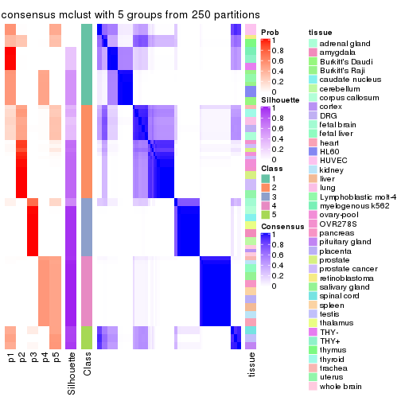</p>

</div>
<div id='tab-MAD-mclust-consensus-heatmap-5'>
<pre><code class="r">consensus_heatmap(res, k = 6)
</code></pre>

<p></p>

</div>
</div>

Heatmaps for the membership of samples in all partitions to see how consistent they are:


<script>
$( function() {
	$( '#tabs-MAD-mclust-membership-heatmap' ).tabs();
} );
</script>
<div id='tabs-MAD-mclust-membership-heatmap'>
<ul>
<li><a href='#tab-MAD-mclust-membership-heatmap-1'>k = 2</a></li>
<li><a href='#tab-MAD-mclust-membership-heatmap-2'>k = 3</a></li>
<li><a href='#tab-MAD-mclust-membership-heatmap-3'>k = 4</a></li>
<li><a href='#tab-MAD-mclust-membership-heatmap-4'>k = 5</a></li>
<li><a href='#tab-MAD-mclust-membership-heatmap-5'>k = 6</a></li>
</ul>
<div id='tab-MAD-mclust-membership-heatmap-1'>
<pre><code class="r">membership_heatmap(res, k = 2)
</code></pre>

<p></p>

</div>
<div id='tab-MAD-mclust-membership-heatmap-2'>
<pre><code class="r">membership_heatmap(res, k = 3)
</code></pre>

<p></p>

</div>
<div id='tab-MAD-mclust-membership-heatmap-3'>
<pre><code class="r">membership_heatmap(res, k = 4)
</code></pre>

<p></p>

</div>
<div id='tab-MAD-mclust-membership-heatmap-4'>
<pre><code class="r">membership_heatmap(res, k = 5)
</code></pre>

<p></p>

</div>
<div id='tab-MAD-mclust-membership-heatmap-5'>
<pre><code class="r">membership_heatmap(res, k = 6)
</code></pre>

<p></p>

</div>
</div>

As soon as we have had the classes for columns, we can look for signatures
which are significantly different between classes which can be candidate marks
for certain classes. Following are the heatmaps for signatures.


Signature heatmaps where rows are scaled:


<script>
$( function() {
	$( '#tabs-MAD-mclust-get-signatures' ).tabs();
} );
</script>
<div id='tabs-MAD-mclust-get-signatures'>
<ul>
<li><a href='#tab-MAD-mclust-get-signatures-1'>k = 2</a></li>
<li><a href='#tab-MAD-mclust-get-signatures-2'>k = 3</a></li>
<li><a href='#tab-MAD-mclust-get-signatures-3'>k = 4</a></li>
<li><a href='#tab-MAD-mclust-get-signatures-4'>k = 5</a></li>
<li><a href='#tab-MAD-mclust-get-signatures-5'>k = 6</a></li>
</ul>
<div id='tab-MAD-mclust-get-signatures-1'>
<pre><code class="r">get_signatures(res, k = 2)
</code></pre>

<p></p>

</div>
<div id='tab-MAD-mclust-get-signatures-2'>
<pre><code class="r">get_signatures(res, k = 3)
</code></pre>

<p></p>

</div>
<div id='tab-MAD-mclust-get-signatures-3'>
<pre><code class="r">get_signatures(res, k = 4)
</code></pre>

<p></p>

</div>
<div id='tab-MAD-mclust-get-signatures-4'>
<pre><code class="r">get_signatures(res, k = 5)
</code></pre>

<p></p>

</div>
<div id='tab-MAD-mclust-get-signatures-5'>
<pre><code class="r">get_signatures(res, k = 6)
</code></pre>

<p></p>

</div>
</div>


Signature heatmaps where rows are not scaled:


<script>
$( function() {
	$( '#tabs-MAD-mclust-get-signatures-no-scale' ).tabs();
} );
</script>
<div id='tabs-MAD-mclust-get-signatures-no-scale'>
<ul>
<li><a href='#tab-MAD-mclust-get-signatures-no-scale-1'>k = 2</a></li>
<li><a href='#tab-MAD-mclust-get-signatures-no-scale-2'>k = 3</a></li>
<li><a href='#tab-MAD-mclust-get-signatures-no-scale-3'>k = 4</a></li>
<li><a href='#tab-MAD-mclust-get-signatures-no-scale-4'>k = 5</a></li>
<li><a href='#tab-MAD-mclust-get-signatures-no-scale-5'>k = 6</a></li>
</ul>
<div id='tab-MAD-mclust-get-signatures-no-scale-1'>
<pre><code class="r">get_signatures(res, k = 2, scale_rows = FALSE)
</code></pre>

<p>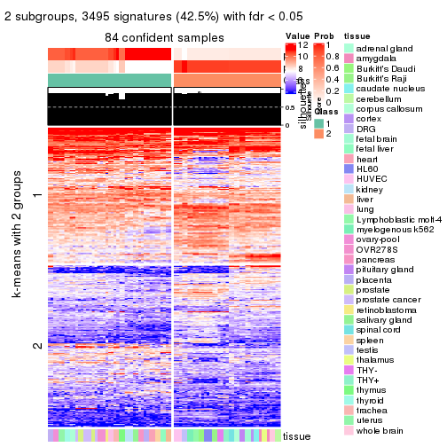</p>

</div>
<div id='tab-MAD-mclust-get-signatures-no-scale-2'>
<pre><code class="r">get_signatures(res, k = 3, scale_rows = FALSE)
</code></pre>

<p></p>

</div>
<div id='tab-MAD-mclust-get-signatures-no-scale-3'>
<pre><code class="r">get_signatures(res, k = 4, scale_rows = FALSE)
</code></pre>

<p></p>

</div>
<div id='tab-MAD-mclust-get-signatures-no-scale-4'>
<pre><code class="r">get_signatures(res, k = 5, scale_rows = FALSE)
</code></pre>

<p></p>

</div>
<div id='tab-MAD-mclust-get-signatures-no-scale-5'>
<pre><code class="r">get_signatures(res, k = 6, scale_rows = FALSE)
</code></pre>

<p></p>

</div>
</div>


Compare the overlap of signatures from different k:

```r
compare_signatures(res)
```


`get_signature()` returns a data frame invisibly. TO get the list of signatures, the function
call should be assigned to a variable explicitly. In following code, if `plot` argument is set
to `FALSE`, no heatmap is plotted while only the differential analysis is performed.

```r
# code only for demonstration
tb = get_signature(res, k = ..., plot = FALSE)
```

An example of the output of `tb` is:

```
#>   which_row         fdr    mean_1    mean_2 scaled_mean_1 scaled_mean_2 km
#> 1        38 0.042760348  8.373488  9.131774    -0.5533452     0.5164555  1
#> 2        40 0.018707592  7.106213  8.469186    -0.6173731     0.5762149  1
#> 3        55 0.019134737 10.221463 11.207825    -0.6159697     0.5749050  1
#> 4        59 0.006059896  5.921854  7.869574    -0.6899429     0.6439467  1
#> 5        60 0.018055526  8.928898 10.211722    -0.6204761     0.5791110  1
#> 6        98 0.009384629 15.714769 14.887706     0.6635654    -0.6193277  2
...
```

The columns in `tb` are:

1. `which_row`: row indices corresponding to the input matrix.
2. `fdr`: FDR for the differential test. 
3. `mean_x`: The mean value in group x.
4. `scaled_mean_x`: The mean value in group x after rows are scaled.
5. `km`: Row groups if k-means clustering is applied to rows.


UMAP plot which shows how samples are separated.


<script>
$( function() {
	$( '#tabs-MAD-mclust-dimension-reduction' ).tabs();
} );
</script>
<div id='tabs-MAD-mclust-dimension-reduction'>
<ul>
<li><a href='#tab-MAD-mclust-dimension-reduction-1'>k = 2</a></li>
<li><a href='#tab-MAD-mclust-dimension-reduction-2'>k = 3</a></li>
<li><a href='#tab-MAD-mclust-dimension-reduction-3'>k = 4</a></li>
<li><a href='#tab-MAD-mclust-dimension-reduction-4'>k = 5</a></li>
<li><a href='#tab-MAD-mclust-dimension-reduction-5'>k = 6</a></li>
</ul>
<div id='tab-MAD-mclust-dimension-reduction-1'>
<pre><code class="r">dimension_reduction(res, k = 2, method = &quot;UMAP&quot;)
</code></pre>

<p></p>

</div>
<div id='tab-MAD-mclust-dimension-reduction-2'>
<pre><code class="r">dimension_reduction(res, k = 3, method = &quot;UMAP&quot;)
</code></pre>

<p></p>

</div>
<div id='tab-MAD-mclust-dimension-reduction-3'>
<pre><code class="r">dimension_reduction(res, k = 4, method = &quot;UMAP&quot;)
</code></pre>

<p></p>

</div>
<div id='tab-MAD-mclust-dimension-reduction-4'>
<pre><code class="r">dimension_reduction(res, k = 5, method = &quot;UMAP&quot;)
</code></pre>

<p></p>

</div>
<div id='tab-MAD-mclust-dimension-reduction-5'>
<pre><code class="r">dimension_reduction(res, k = 6, method = &quot;UMAP&quot;)
</code></pre>

<p></p>

</div>
</div>


Following heatmap shows how subgroups are split when increasing `k`:

```r
collect_classes(res)
```


Test correlation between subgroups and known annotations. If the known
annotation is numeric, one-way ANOVA test is applied, and if the known
annotation is discrete, chi-squared contingency table test is applied.

```r
test_to_known_factors(res)
```

```
#>             n tissue(p) k
#> MAD:mclust 84  2.53e-05 2
#> MAD:mclust 80  1.24e-08 3
#> MAD:mclust 74  6.77e-11 4
#> MAD:mclust 63  8.71e-13 5
#> MAD:mclust 61  1.60e-12 6
```


If matrix rows can be associated to genes, consider to use `GO_Enrichment(res,
...)` to perform function enrichment for the signature genes.


 

---------------------------------------------------


### MAD:NMF*


The object with results only for a single top-value method and a single partition method 
can be extracted as:

```r
res = res_list["MAD", "NMF"]
# you can also extract it by
# res = res_list["MAD:NMF"]
```

A summary of `res` and all the functions that can be applied to it:

```r
res
```

```
#> A 'ConsensusPartition' object with k = 2, 3, 4, 5, 6.
#>   On a matrix with 8229 rows and 84 columns.
#>   Top rows (823, 1646, 2468, 3291, 4114) are extracted by 'MAD' method.
#>   Subgroups are detected by 'NMF' method.
#>   Performed in total 1250 partitions by row resampling.
#>   Best k for subgroups seems to be 4.
#> 
#> Following methods can be applied to this 'ConsensusPartition' object:
#>  [1] "cola_report"             "collect_classes"         "collect_plots"          
#>  [4] "collect_stats"           "colnames"                "compare_signatures"     
#>  [7] "consensus_heatmap"       "dimension_reduction"     "functional_enrichment"  
#> [10] "get_anno_col"            "get_anno"                "get_classes"            
#> [13] "get_consensus"           "get_matrix"              "get_membership"         
#> [16] "get_param"               "get_signatures"          "get_stats"              
#> [19] "is_best_k"               "is_stable_k"             "membership_heatmap"     
#> [22] "ncol"                    "nrow"                    "plot_ecdf"              
#> [25] "rownames"                "select_partition_number" "show"                   
#> [28] "suggest_best_k"          "test_to_known_factors"
```

`collect_plots()` function collects all the plots made from `res` for all `k` (number of partitions)
into one single page to provide an easy and fast comparison between different `k`.

```r
collect_plots(res)
```


The plots are:

- The first row: a plot of the ECDF (Empirical cumulative distribution
  function) curves of the consensus matrix for each `k` and the heatmap of
  predicted classes for each `k`.
- The second row: heatmaps of the consensus matrix for each `k`.
- The third row: heatmaps of the membership matrix for each `k`.
- The fouth row: heatmaps of the signatures for each `k`.

All the plots in panels can be made by individual functions and they are
plotted later in this section.

`select_partition_number()` produces several plots showing different
statistics for choosing "optimized" `k`. There are following statistics:

- ECDF curves of the consensus matrix for each `k`;
- 1-PAC. [The PAC
  score](https://en.wikipedia.org/wiki/Consensus_clustering#Over-interpretation_potential_of_consensus_clustering)
  measures the proportion of the ambiguous subgrouping.
- Mean silhouette score.
- Concordance. The mean probability of fiting the consensus class ids in all
  partitions.
- Area increased. Denote $A_k$ as the area under the ECDF curve for current
  `k`, the area increased is defined as $A_k - A_{k-1}$.
- Rand index. The percent of pairs of samples that are both in a same cluster
  or both are not in a same cluster in the partition of k and k-1.
- Jaccard index. The ratio of pairs of samples are both in a same cluster in
  the partition of k and k-1 and the pairs of samples are both in a same
  cluster in the partition k or k-1.

The detailed explanations of these statistics can be found in [the cola
vignette](http://bioconductor.org/packages/devel/bioc/vignettes/cola/inst/doc/cola.html#toc_13).

Generally speaking, lower PAC score, higher mean silhouette score or higher
concordance corresponds to better partition. Rand index and Jaccard index
measure how similar the current partition is compared to partition with `k-1`.
If they are too similar, we won't accept `k` is better than `k-1`.

```r
select_partition_number(res)
```


The numeric values for all these statistics can be obtained by `get_stats()`.

```r
get_stats(res)
```

```
#>   k 1-PAC mean_silhouette concordance area_increased  Rand Jaccard
#> 2 2 0.861           0.883       0.937         0.4465 0.550   0.550
#> 3 3 0.945           0.932       0.969         0.3872 0.626   0.430
#> 4 4 0.941           0.926       0.963         0.2123 0.850   0.618
#> 5 5 0.888           0.799       0.893         0.0473 0.977   0.908
#> 6 6 0.858           0.785       0.872         0.0392 0.955   0.807
```

`suggest_best_k()` suggests the best $k$ based on these statistics. The rules are as follows:

- All $k$ with Jaccard index larger than 0.95 are removed because the increase of
  the partition number does not provides enough extra information. If all $k$ are removed,
  the best $k$ is assigned by `NA`.
- For $k$ with 1-PAC larger than 0.9, the maximal $k$ is taken as the "best k". Other $k$ is called "optional k".
- If it does not fit the second rule. The $k$ with the highest vote of highest
  1-PAC, mean silhouette and concordance is taken as the "best k".

```r
suggest_best_k(res)
```

```
#> [1] 4
#> attr(,"optional")
#> [1] 3
```

There is also optional best $k$ = 3 that is worth to check.

Following shows the table of the partitions (You need to click the **show/hide
code output** link to see it). The membership matrix (columns with name `p*`)
is inferred by
[`clue::cl_consensus()`](https://www.rdocumentation.org/link/cl_consensus?package=clue)
function with the `SE` method. Basically the value in the membership matrix
represents the probability to belong to a certain group. The finall class
label for an item is determined with the group with highest probability it
belongs to.

In `get_classes()` function, the entropy is calculated from the membership
matrix and the silhouette score is calculated from the consensus matrix.


<script>
$( function() {
	$( '#tabs-MAD-NMF-get-classes' ).tabs();
} );
</script>
<div id='tabs-MAD-NMF-get-classes'>
<ul>
<li><a href='#tab-MAD-NMF-get-classes-1'>k = 2</a></li>
<li><a href='#tab-MAD-NMF-get-classes-2'>k = 3</a></li>
<li><a href='#tab-MAD-NMF-get-classes-3'>k = 4</a></li>
<li><a href='#tab-MAD-NMF-get-classes-4'>k = 5</a></li>
<li><a href='#tab-MAD-NMF-get-classes-5'>k = 6</a></li>
</ul>

<div id='tab-MAD-NMF-get-classes-1'>
<p><a id='tab-MAD-NMF-get-classes-1-a' style='color:#0366d6' href='#'>show/hide code output</a></p>
<pre><code class="r">cbind(get_classes(res, k = 2), get_membership(res, k = 2))
</code></pre>

<pre><code>#&gt;         class entropy silhouette    p1    p2
#&gt; GSM2819     1  0.8499      0.594 0.724 0.276
#&gt; GSM2820     2  0.0000      0.923 0.000 1.000
#&gt; GSM2822     1  0.7745      0.680 0.772 0.228
#&gt; GSM2832     2  0.9963      0.219 0.464 0.536
#&gt; GSM2823     2  0.6438      0.778 0.164 0.836
#&gt; GSM2824     2  0.8661      0.571 0.288 0.712
#&gt; GSM2825     1  0.0000      0.943 1.000 0.000
#&gt; GSM2826     1  0.0000      0.943 1.000 0.000
#&gt; GSM2829     2  0.4022      0.927 0.080 0.920
#&gt; GSM2856     2  0.4431      0.919 0.092 0.908
#&gt; GSM2830     2  0.3733      0.931 0.072 0.928
#&gt; GSM2843     2  0.3274      0.933 0.060 0.940
#&gt; GSM2871     2  0.2778      0.931 0.048 0.952
#&gt; GSM2831     1  0.9427      0.397 0.640 0.360
#&gt; GSM2844     1  0.9635      0.315 0.612 0.388
#&gt; GSM2833     2  0.9795      0.369 0.416 0.584
#&gt; GSM2846     2  0.6531      0.842 0.168 0.832
#&gt; GSM2835     1  0.0000      0.943 1.000 0.000
#&gt; GSM2858     1  0.0000      0.943 1.000 0.000
#&gt; GSM2836     2  0.3584      0.933 0.068 0.932
#&gt; GSM2848     2  0.3584      0.933 0.068 0.932
#&gt; GSM2828     2  0.0000      0.923 0.000 1.000
#&gt; GSM2837     2  0.0000      0.923 0.000 1.000
#&gt; GSM2839     1  0.0000      0.943 1.000 0.000
#&gt; GSM2841     1  0.0000      0.943 1.000 0.000
#&gt; GSM2827     2  0.3584      0.933 0.068 0.932
#&gt; GSM2842     2  0.3584      0.933 0.068 0.932
#&gt; GSM2845     2  0.4298      0.922 0.088 0.912
#&gt; GSM2872     2  0.9460      0.507 0.364 0.636
#&gt; GSM2834     2  0.4431      0.919 0.092 0.908
#&gt; GSM2847     2  0.4022      0.927 0.080 0.920
#&gt; GSM2849     2  0.0000      0.923 0.000 1.000
#&gt; GSM2850     2  0.0000      0.923 0.000 1.000
#&gt; GSM2838     2  0.3584      0.933 0.068 0.932
#&gt; GSM2853     2  0.3584      0.933 0.068 0.932
#&gt; GSM2852     2  0.0000      0.923 0.000 1.000
#&gt; GSM2855     2  0.0000      0.923 0.000 1.000
#&gt; GSM2840     1  0.0000      0.943 1.000 0.000
#&gt; GSM2857     1  0.0000      0.943 1.000 0.000
#&gt; GSM2859     2  0.3733      0.931 0.072 0.928
#&gt; GSM2860     2  0.3584      0.933 0.068 0.932
#&gt; GSM2861     2  0.3431      0.933 0.064 0.936
#&gt; GSM2862     2  0.3584      0.933 0.068 0.932
#&gt; GSM2863     2  0.3584      0.933 0.068 0.932
#&gt; GSM2864     2  0.3584      0.933 0.068 0.932
#&gt; GSM2865     2  0.3584      0.933 0.068 0.932
#&gt; GSM2866     2  0.3733      0.931 0.072 0.928
#&gt; GSM2868     2  0.3584      0.933 0.068 0.932
#&gt; GSM2869     2  0.3584      0.933 0.068 0.932
#&gt; GSM2851     2  0.3584      0.933 0.068 0.932
#&gt; GSM2867     2  0.3584      0.933 0.068 0.932
#&gt; GSM2870     2  0.3584      0.933 0.068 0.932
#&gt; GSM2854     2  0.4022      0.927 0.080 0.920
#&gt; GSM2873     2  0.3733      0.931 0.072 0.928
#&gt; GSM2874     2  0.0000      0.923 0.000 1.000
#&gt; GSM2884     2  0.0000      0.923 0.000 1.000
#&gt; GSM2875     1  0.0000      0.943 1.000 0.000
#&gt; GSM2890     1  0.0000      0.943 1.000 0.000
#&gt; GSM2877     1  0.0000      0.943 1.000 0.000
#&gt; GSM2892     1  0.0000      0.943 1.000 0.000
#&gt; GSM2902     1  0.0000      0.943 1.000 0.000
#&gt; GSM2878     1  0.0000      0.943 1.000 0.000
#&gt; GSM2901     1  0.0000      0.943 1.000 0.000
#&gt; GSM2879     2  0.0000      0.923 0.000 1.000
#&gt; GSM2898     2  0.0000      0.923 0.000 1.000
#&gt; GSM2881     2  0.0000      0.923 0.000 1.000
#&gt; GSM2897     2  0.0000      0.923 0.000 1.000
#&gt; GSM2882     1  0.2603      0.908 0.956 0.044
#&gt; GSM2894     1  0.3274      0.894 0.940 0.060
#&gt; GSM2883     2  0.0000      0.923 0.000 1.000
#&gt; GSM2895     2  0.0000      0.923 0.000 1.000
#&gt; GSM2885     2  0.0000      0.923 0.000 1.000
#&gt; GSM2886     2  0.0000      0.923 0.000 1.000
#&gt; GSM2887     2  0.0000      0.923 0.000 1.000
#&gt; GSM2896     2  0.0000      0.923 0.000 1.000
#&gt; GSM2888     2  0.0376      0.924 0.004 0.996
#&gt; GSM2889     2  0.0000      0.923 0.000 1.000
#&gt; GSM2876     1  0.0000      0.943 1.000 0.000
#&gt; GSM2891     1  0.0000      0.943 1.000 0.000
#&gt; GSM2880     1  0.0000      0.943 1.000 0.000
#&gt; GSM2893     1  0.0000      0.943 1.000 0.000
#&gt; GSM2821     1  0.0000      0.943 1.000 0.000
#&gt; GSM2900     1  0.0000      0.943 1.000 0.000
#&gt; GSM2903     1  0.0000      0.943 1.000 0.000
</code></pre>

<script>
$('#tab-MAD-NMF-get-classes-1-a').parent().next().next().hide();
$('#tab-MAD-NMF-get-classes-1-a').click(function(){
  $('#tab-MAD-NMF-get-classes-1-a').parent().next().next().toggle();
  return(false);
});
</script>
</div>

<div id='tab-MAD-NMF-get-classes-2'>
<p><a id='tab-MAD-NMF-get-classes-2-a' style='color:#0366d6' href='#'>show/hide code output</a></p>
<pre><code class="r">cbind(get_classes(res, k = 3), get_membership(res, k = 3))
</code></pre>

<pre><code>#&gt;         class entropy silhouette    p1    p2    p3
#&gt; GSM2819     2  0.0000      0.964 0.000 1.000 0.000
#&gt; GSM2820     3  0.0000      0.977 0.000 0.000 1.000
#&gt; GSM2822     2  0.0000      0.964 0.000 1.000 0.000
#&gt; GSM2832     2  0.0000      0.964 0.000 1.000 0.000
#&gt; GSM2823     3  0.7905      0.260 0.376 0.064 0.560
#&gt; GSM2824     1  0.8238      0.426 0.596 0.104 0.300
#&gt; GSM2825     2  0.4702      0.738 0.212 0.788 0.000
#&gt; GSM2826     2  0.4974      0.704 0.236 0.764 0.000
#&gt; GSM2829     2  0.0000      0.964 0.000 1.000 0.000
#&gt; GSM2856     2  0.0000      0.964 0.000 1.000 0.000
#&gt; GSM2830     2  0.0000      0.964 0.000 1.000 0.000
#&gt; GSM2843     2  0.0000      0.964 0.000 1.000 0.000
#&gt; GSM2871     2  0.0000      0.964 0.000 1.000 0.000
#&gt; GSM2831     2  0.0000      0.964 0.000 1.000 0.000
#&gt; GSM2844     2  0.0000      0.964 0.000 1.000 0.000
#&gt; GSM2833     2  0.0000      0.964 0.000 1.000 0.000
#&gt; GSM2846     2  0.0000      0.964 0.000 1.000 0.000
#&gt; GSM2835     2  0.0000      0.964 0.000 1.000 0.000
#&gt; GSM2858     2  0.0000      0.964 0.000 1.000 0.000
#&gt; GSM2836     2  0.0237      0.962 0.000 0.996 0.004
#&gt; GSM2848     2  0.0237      0.962 0.000 0.996 0.004
#&gt; GSM2828     3  0.0000      0.977 0.000 0.000 1.000
#&gt; GSM2837     3  0.0000      0.977 0.000 0.000 1.000
#&gt; GSM2839     1  0.0000      0.968 1.000 0.000 0.000
#&gt; GSM2841     1  0.0000      0.968 1.000 0.000 0.000
#&gt; GSM2827     2  0.0592      0.958 0.000 0.988 0.012
#&gt; GSM2842     2  0.1289      0.946 0.000 0.968 0.032
#&gt; GSM2845     2  0.0000      0.964 0.000 1.000 0.000
#&gt; GSM2872     2  0.0000      0.964 0.000 1.000 0.000
#&gt; GSM2834     2  0.0000      0.964 0.000 1.000 0.000
#&gt; GSM2847     2  0.0000      0.964 0.000 1.000 0.000
#&gt; GSM2849     3  0.0000      0.977 0.000 0.000 1.000
#&gt; GSM2850     3  0.0000      0.977 0.000 0.000 1.000
#&gt; GSM2838     2  0.0000      0.964 0.000 1.000 0.000
#&gt; GSM2853     2  0.0000      0.964 0.000 1.000 0.000
#&gt; GSM2852     3  0.0000      0.977 0.000 0.000 1.000
#&gt; GSM2855     3  0.0000      0.977 0.000 0.000 1.000
#&gt; GSM2840     1  0.0000      0.968 1.000 0.000 0.000
#&gt; GSM2857     1  0.0000      0.968 1.000 0.000 0.000
#&gt; GSM2859     2  0.0000      0.964 0.000 1.000 0.000
#&gt; GSM2860     2  0.0237      0.962 0.000 0.996 0.004
#&gt; GSM2861     2  0.2165      0.921 0.000 0.936 0.064
#&gt; GSM2862     2  0.0000      0.964 0.000 1.000 0.000
#&gt; GSM2863     2  0.1031      0.951 0.000 0.976 0.024
#&gt; GSM2864     2  0.1411      0.943 0.000 0.964 0.036
#&gt; GSM2865     2  0.0237      0.962 0.000 0.996 0.004
#&gt; GSM2866     2  0.0000      0.964 0.000 1.000 0.000
#&gt; GSM2868     2  0.4555      0.774 0.000 0.800 0.200
#&gt; GSM2869     2  0.1860      0.931 0.000 0.948 0.052
#&gt; GSM2851     2  0.0000      0.964 0.000 1.000 0.000
#&gt; GSM2867     2  0.3116      0.881 0.000 0.892 0.108
#&gt; GSM2870     2  0.0000      0.964 0.000 1.000 0.000
#&gt; GSM2854     2  0.0000      0.964 0.000 1.000 0.000
#&gt; GSM2873     2  0.0000      0.964 0.000 1.000 0.000
#&gt; GSM2874     3  0.0000      0.977 0.000 0.000 1.000
#&gt; GSM2884     3  0.0000      0.977 0.000 0.000 1.000
#&gt; GSM2875     1  0.0000      0.968 1.000 0.000 0.000
#&gt; GSM2890     1  0.0000      0.968 1.000 0.000 0.000
#&gt; GSM2877     1  0.0000      0.968 1.000 0.000 0.000
#&gt; GSM2892     1  0.0000      0.968 1.000 0.000 0.000
#&gt; GSM2902     1  0.0000      0.968 1.000 0.000 0.000
#&gt; GSM2878     1  0.0000      0.968 1.000 0.000 0.000
#&gt; GSM2901     1  0.0000      0.968 1.000 0.000 0.000
#&gt; GSM2879     3  0.0000      0.977 0.000 0.000 1.000
#&gt; GSM2898     3  0.0000      0.977 0.000 0.000 1.000
#&gt; GSM2881     3  0.0000      0.977 0.000 0.000 1.000
#&gt; GSM2897     3  0.0000      0.977 0.000 0.000 1.000
#&gt; GSM2882     2  0.0000      0.964 0.000 1.000 0.000
#&gt; GSM2894     2  0.0000      0.964 0.000 1.000 0.000
#&gt; GSM2883     3  0.0000      0.977 0.000 0.000 1.000
#&gt; GSM2895     3  0.0000      0.977 0.000 0.000 1.000
#&gt; GSM2885     3  0.0000      0.977 0.000 0.000 1.000
#&gt; GSM2886     3  0.0000      0.977 0.000 0.000 1.000
#&gt; GSM2887     3  0.0000      0.977 0.000 0.000 1.000
#&gt; GSM2896     3  0.0000      0.977 0.000 0.000 1.000
#&gt; GSM2888     2  0.5529      0.625 0.000 0.704 0.296
#&gt; GSM2889     2  0.5560      0.617 0.000 0.700 0.300
#&gt; GSM2876     1  0.0000      0.968 1.000 0.000 0.000
#&gt; GSM2891     1  0.0000      0.968 1.000 0.000 0.000
#&gt; GSM2880     1  0.0000      0.968 1.000 0.000 0.000
#&gt; GSM2893     1  0.0000      0.968 1.000 0.000 0.000
#&gt; GSM2821     1  0.2878      0.861 0.904 0.096 0.000
#&gt; GSM2900     1  0.0747      0.954 0.984 0.016 0.000
#&gt; GSM2903     1  0.1163      0.942 0.972 0.028 0.000
</code></pre>

<script>
$('#tab-MAD-NMF-get-classes-2-a').parent().next().next().hide();
$('#tab-MAD-NMF-get-classes-2-a').click(function(){
  $('#tab-MAD-NMF-get-classes-2-a').parent().next().next().toggle();
  return(false);
});
</script>
</div>

<div id='tab-MAD-NMF-get-classes-3'>
<p><a id='tab-MAD-NMF-get-classes-3-a' style='color:#0366d6' href='#'>show/hide code output</a></p>
<pre><code class="r">cbind(get_classes(res, k = 4), get_membership(res, k = 4))
</code></pre>

<pre><code>#&gt;         class entropy silhouette    p1    p2    p3    p4
#&gt; GSM2819     2  0.1118      0.928 0.000 0.964 0.000 0.036
#&gt; GSM2820     3  0.0000      0.995 0.000 0.000 1.000 0.000
#&gt; GSM2822     2  0.2647      0.868 0.000 0.880 0.000 0.120
#&gt; GSM2832     2  0.3123      0.832 0.000 0.844 0.000 0.156
#&gt; GSM2823     1  0.6038      0.304 0.532 0.424 0.044 0.000
#&gt; GSM2824     1  0.5581      0.264 0.532 0.448 0.020 0.000
#&gt; GSM2825     2  0.6585      0.605 0.180 0.632 0.000 0.188
#&gt; GSM2826     2  0.6393      0.624 0.188 0.652 0.000 0.160
#&gt; GSM2829     4  0.0000      0.997 0.000 0.000 0.000 1.000
#&gt; GSM2856     4  0.0000      0.997 0.000 0.000 0.000 1.000
#&gt; GSM2830     4  0.0000      0.997 0.000 0.000 0.000 1.000
#&gt; GSM2843     4  0.0188      0.994 0.000 0.004 0.000 0.996
#&gt; GSM2871     4  0.0188      0.994 0.000 0.004 0.000 0.996
#&gt; GSM2831     4  0.0000      0.997 0.000 0.000 0.000 1.000
#&gt; GSM2844     4  0.0000      0.997 0.000 0.000 0.000 1.000
#&gt; GSM2833     4  0.0000      0.997 0.000 0.000 0.000 1.000
#&gt; GSM2846     4  0.0000      0.997 0.000 0.000 0.000 1.000
#&gt; GSM2835     4  0.0000      0.997 0.000 0.000 0.000 1.000
#&gt; GSM2858     4  0.0000      0.997 0.000 0.000 0.000 1.000
#&gt; GSM2836     2  0.1716      0.910 0.000 0.936 0.000 0.064
#&gt; GSM2848     2  0.1792      0.908 0.000 0.932 0.000 0.068
#&gt; GSM2828     3  0.0000      0.995 0.000 0.000 1.000 0.000
#&gt; GSM2837     3  0.0000      0.995 0.000 0.000 1.000 0.000
#&gt; GSM2839     1  0.0188      0.925 0.996 0.000 0.000 0.004
#&gt; GSM2841     1  0.0000      0.925 1.000 0.000 0.000 0.000
#&gt; GSM2827     2  0.1302      0.924 0.000 0.956 0.000 0.044
#&gt; GSM2842     2  0.1022      0.929 0.000 0.968 0.000 0.032
#&gt; GSM2845     4  0.0000      0.997 0.000 0.000 0.000 1.000
#&gt; GSM2872     4  0.0000      0.997 0.000 0.000 0.000 1.000
#&gt; GSM2834     4  0.0188      0.994 0.000 0.004 0.000 0.996
#&gt; GSM2847     4  0.0000      0.997 0.000 0.000 0.000 1.000
#&gt; GSM2849     3  0.0000      0.995 0.000 0.000 1.000 0.000
#&gt; GSM2850     3  0.0000      0.995 0.000 0.000 1.000 0.000
#&gt; GSM2838     2  0.0188      0.939 0.000 0.996 0.000 0.004
#&gt; GSM2853     2  0.0188      0.939 0.000 0.996 0.000 0.004
#&gt; GSM2852     3  0.0707      0.982 0.000 0.020 0.980 0.000
#&gt; GSM2855     3  0.0592      0.985 0.000 0.016 0.984 0.000
#&gt; GSM2840     1  0.0188      0.925 0.996 0.000 0.000 0.004
#&gt; GSM2857     1  0.0188      0.925 0.996 0.000 0.000 0.004
#&gt; GSM2859     2  0.0000      0.939 0.000 1.000 0.000 0.000
#&gt; GSM2860     2  0.0188      0.939 0.000 0.996 0.000 0.004
#&gt; GSM2861     2  0.0000      0.939 0.000 1.000 0.000 0.000
#&gt; GSM2862     2  0.0188      0.939 0.000 0.996 0.000 0.004
#&gt; GSM2863     2  0.0000      0.939 0.000 1.000 0.000 0.000
#&gt; GSM2864     2  0.0000      0.939 0.000 1.000 0.000 0.000
#&gt; GSM2865     2  0.0000      0.939 0.000 1.000 0.000 0.000
#&gt; GSM2866     2  0.0336      0.938 0.000 0.992 0.000 0.008
#&gt; GSM2868     2  0.0000      0.939 0.000 1.000 0.000 0.000
#&gt; GSM2869     2  0.0000      0.939 0.000 1.000 0.000 0.000
#&gt; GSM2851     2  0.0000      0.939 0.000 1.000 0.000 0.000
#&gt; GSM2867     2  0.0000      0.939 0.000 1.000 0.000 0.000
#&gt; GSM2870     2  0.0000      0.939 0.000 1.000 0.000 0.000
#&gt; GSM2854     4  0.0921      0.969 0.000 0.028 0.000 0.972
#&gt; GSM2873     2  0.4477      0.610 0.000 0.688 0.000 0.312
#&gt; GSM2874     3  0.0000      0.995 0.000 0.000 1.000 0.000
#&gt; GSM2884     3  0.0000      0.995 0.000 0.000 1.000 0.000
#&gt; GSM2875     1  0.0188      0.925 0.996 0.000 0.000 0.004
#&gt; GSM2890     1  0.0000      0.925 1.000 0.000 0.000 0.000
#&gt; GSM2877     1  0.0188      0.925 0.996 0.000 0.000 0.004
#&gt; GSM2892     1  0.0000      0.925 1.000 0.000 0.000 0.000
#&gt; GSM2902     1  0.0000      0.925 1.000 0.000 0.000 0.000
#&gt; GSM2878     1  0.0000      0.925 1.000 0.000 0.000 0.000
#&gt; GSM2901     1  0.0000      0.925 1.000 0.000 0.000 0.000
#&gt; GSM2879     3  0.0707      0.982 0.000 0.020 0.980 0.000
#&gt; GSM2898     3  0.1211      0.963 0.000 0.040 0.960 0.000
#&gt; GSM2881     3  0.0000      0.995 0.000 0.000 1.000 0.000
#&gt; GSM2897     3  0.0000      0.995 0.000 0.000 1.000 0.000
#&gt; GSM2882     4  0.0000      0.997 0.000 0.000 0.000 1.000
#&gt; GSM2894     4  0.0000      0.997 0.000 0.000 0.000 1.000
#&gt; GSM2883     3  0.0000      0.995 0.000 0.000 1.000 0.000
#&gt; GSM2895     3  0.0188      0.993 0.000 0.004 0.996 0.000
#&gt; GSM2885     3  0.0000      0.995 0.000 0.000 1.000 0.000
#&gt; GSM2886     3  0.0000      0.995 0.000 0.000 1.000 0.000
#&gt; GSM2887     3  0.0000      0.995 0.000 0.000 1.000 0.000
#&gt; GSM2896     3  0.0000      0.995 0.000 0.000 1.000 0.000
#&gt; GSM2888     2  0.0000      0.939 0.000 1.000 0.000 0.000
#&gt; GSM2889     2  0.0000      0.939 0.000 1.000 0.000 0.000
#&gt; GSM2876     1  0.0000      0.925 1.000 0.000 0.000 0.000
#&gt; GSM2891     1  0.0000      0.925 1.000 0.000 0.000 0.000
#&gt; GSM2880     1  0.0188      0.925 0.996 0.000 0.000 0.004
#&gt; GSM2893     1  0.0188      0.925 0.996 0.000 0.000 0.004
#&gt; GSM2821     1  0.3311      0.794 0.828 0.172 0.000 0.000
#&gt; GSM2900     1  0.2647      0.847 0.880 0.120 0.000 0.000
#&gt; GSM2903     1  0.2704      0.843 0.876 0.124 0.000 0.000
</code></pre>

<script>
$('#tab-MAD-NMF-get-classes-3-a').parent().next().next().hide();
$('#tab-MAD-NMF-get-classes-3-a').click(function(){
  $('#tab-MAD-NMF-get-classes-3-a').parent().next().next().toggle();
  return(false);
});
</script>
</div>

<div id='tab-MAD-NMF-get-classes-4'>
<p><a id='tab-MAD-NMF-get-classes-4-a' style='color:#0366d6' href='#'>show/hide code output</a></p>
<pre><code class="r">cbind(get_classes(res, k = 5), get_membership(res, k = 5))
</code></pre>

<pre><code>#&gt;         class entropy silhouette    p1    p2    p3    p4    p5
#&gt; GSM2819     5  0.4581     0.3447 0.032 0.268 0.000 0.004 0.696
#&gt; GSM2820     3  0.0000     0.9942 0.000 0.000 1.000 0.000 0.000
#&gt; GSM2822     2  0.4221     0.7381 0.000 0.732 0.000 0.032 0.236
#&gt; GSM2832     2  0.4587     0.7180 0.000 0.728 0.000 0.068 0.204
#&gt; GSM2823     1  0.7270    -0.2101 0.504 0.260 0.060 0.000 0.176
#&gt; GSM2824     1  0.6843    -0.2553 0.496 0.260 0.016 0.000 0.228
#&gt; GSM2825     2  0.7750    -0.0862 0.244 0.360 0.000 0.060 0.336
#&gt; GSM2826     2  0.7666    -0.0816 0.248 0.364 0.000 0.052 0.336
#&gt; GSM2829     4  0.0510     0.9626 0.000 0.000 0.000 0.984 0.016
#&gt; GSM2856     4  0.0510     0.9626 0.000 0.000 0.000 0.984 0.016
#&gt; GSM2830     4  0.0000     0.9630 0.000 0.000 0.000 1.000 0.000
#&gt; GSM2843     4  0.0000     0.9630 0.000 0.000 0.000 1.000 0.000
#&gt; GSM2871     4  0.0898     0.9533 0.000 0.020 0.000 0.972 0.008
#&gt; GSM2831     4  0.0162     0.9631 0.000 0.000 0.000 0.996 0.004
#&gt; GSM2844     4  0.0162     0.9631 0.000 0.000 0.000 0.996 0.004
#&gt; GSM2833     4  0.2471     0.9001 0.000 0.000 0.000 0.864 0.136
#&gt; GSM2846     4  0.2329     0.9091 0.000 0.000 0.000 0.876 0.124
#&gt; GSM2835     4  0.2280     0.9095 0.000 0.000 0.000 0.880 0.120
#&gt; GSM2858     4  0.2536     0.9005 0.004 0.000 0.000 0.868 0.128
#&gt; GSM2836     2  0.0693     0.8534 0.000 0.980 0.000 0.008 0.012
#&gt; GSM2848     2  0.0451     0.8559 0.000 0.988 0.000 0.004 0.008
#&gt; GSM2828     3  0.0000     0.9942 0.000 0.000 1.000 0.000 0.000
#&gt; GSM2837     3  0.0000     0.9942 0.000 0.000 1.000 0.000 0.000
#&gt; GSM2839     1  0.3796     0.5461 0.700 0.000 0.000 0.000 0.300
#&gt; GSM2841     1  0.3906     0.5479 0.704 0.004 0.000 0.000 0.292
#&gt; GSM2827     2  0.0912     0.8567 0.000 0.972 0.000 0.012 0.016
#&gt; GSM2842     2  0.0955     0.8592 0.000 0.968 0.000 0.004 0.028
#&gt; GSM2845     4  0.0162     0.9627 0.000 0.004 0.000 0.996 0.000
#&gt; GSM2872     4  0.0162     0.9627 0.000 0.004 0.000 0.996 0.000
#&gt; GSM2834     4  0.0898     0.9532 0.000 0.020 0.000 0.972 0.008
#&gt; GSM2847     4  0.0451     0.9607 0.000 0.008 0.000 0.988 0.004
#&gt; GSM2849     3  0.0000     0.9942 0.000 0.000 1.000 0.000 0.000
#&gt; GSM2850     3  0.0000     0.9942 0.000 0.000 1.000 0.000 0.000
#&gt; GSM2838     2  0.2648     0.8269 0.000 0.848 0.000 0.000 0.152
#&gt; GSM2853     2  0.2773     0.8215 0.000 0.836 0.000 0.000 0.164
#&gt; GSM2852     3  0.0162     0.9910 0.000 0.004 0.996 0.000 0.000
#&gt; GSM2855     3  0.0162     0.9910 0.000 0.004 0.996 0.000 0.000
#&gt; GSM2840     1  0.4302     0.4979 0.648 0.004 0.000 0.004 0.344
#&gt; GSM2857     1  0.4268     0.5003 0.648 0.008 0.000 0.000 0.344
#&gt; GSM2859     2  0.0162     0.8576 0.000 0.996 0.000 0.000 0.004
#&gt; GSM2860     2  0.0000     0.8583 0.000 1.000 0.000 0.000 0.000
#&gt; GSM2861     2  0.0880     0.8579 0.000 0.968 0.000 0.000 0.032
#&gt; GSM2862     2  0.0000     0.8583 0.000 1.000 0.000 0.000 0.000
#&gt; GSM2863     2  0.0162     0.8576 0.000 0.996 0.000 0.000 0.004
#&gt; GSM2864     2  0.0290     0.8567 0.000 0.992 0.000 0.000 0.008
#&gt; GSM2865     2  0.0162     0.8576 0.000 0.996 0.000 0.000 0.004
#&gt; GSM2866     2  0.0000     0.8583 0.000 1.000 0.000 0.000 0.000
#&gt; GSM2868     2  0.3003     0.8048 0.000 0.812 0.000 0.000 0.188
#&gt; GSM2869     2  0.2929     0.8111 0.000 0.820 0.000 0.000 0.180
#&gt; GSM2851     2  0.2605     0.8279 0.000 0.852 0.000 0.000 0.148
#&gt; GSM2867     2  0.2966     0.8094 0.000 0.816 0.000 0.000 0.184
#&gt; GSM2870     2  0.2852     0.8159 0.000 0.828 0.000 0.000 0.172
#&gt; GSM2854     4  0.1012     0.9546 0.000 0.020 0.000 0.968 0.012
#&gt; GSM2873     2  0.2069     0.8072 0.000 0.912 0.000 0.076 0.012
#&gt; GSM2874     3  0.0000     0.9942 0.000 0.000 1.000 0.000 0.000
#&gt; GSM2884     3  0.0000     0.9942 0.000 0.000 1.000 0.000 0.000
#&gt; GSM2875     1  0.0000     0.7296 1.000 0.000 0.000 0.000 0.000
#&gt; GSM2890     1  0.0000     0.7296 1.000 0.000 0.000 0.000 0.000
#&gt; GSM2877     1  0.0000     0.7296 1.000 0.000 0.000 0.000 0.000
#&gt; GSM2892     1  0.0000     0.7296 1.000 0.000 0.000 0.000 0.000
#&gt; GSM2902     1  0.0000     0.7296 1.000 0.000 0.000 0.000 0.000
#&gt; GSM2878     1  0.0162     0.7276 0.996 0.000 0.000 0.000 0.004
#&gt; GSM2901     1  0.0404     0.7232 0.988 0.000 0.000 0.000 0.012
#&gt; GSM2879     3  0.1282     0.9486 0.000 0.044 0.952 0.000 0.004
#&gt; GSM2898     3  0.0963     0.9599 0.000 0.036 0.964 0.000 0.000
#&gt; GSM2881     3  0.0000     0.9942 0.000 0.000 1.000 0.000 0.000
#&gt; GSM2897     3  0.0000     0.9942 0.000 0.000 1.000 0.000 0.000
#&gt; GSM2882     4  0.0880     0.9589 0.000 0.000 0.000 0.968 0.032
#&gt; GSM2894     4  0.0963     0.9578 0.000 0.000 0.000 0.964 0.036
#&gt; GSM2883     3  0.0000     0.9942 0.000 0.000 1.000 0.000 0.000
#&gt; GSM2895     3  0.0000     0.9942 0.000 0.000 1.000 0.000 0.000
#&gt; GSM2885     3  0.0000     0.9942 0.000 0.000 1.000 0.000 0.000
#&gt; GSM2886     3  0.0000     0.9942 0.000 0.000 1.000 0.000 0.000
#&gt; GSM2887     3  0.0000     0.9942 0.000 0.000 1.000 0.000 0.000
#&gt; GSM2896     3  0.0000     0.9942 0.000 0.000 1.000 0.000 0.000
#&gt; GSM2888     2  0.1965     0.8459 0.000 0.904 0.000 0.000 0.096
#&gt; GSM2889     2  0.1851     0.8478 0.000 0.912 0.000 0.000 0.088
#&gt; GSM2876     1  0.3177     0.4583 0.792 0.000 0.000 0.000 0.208
#&gt; GSM2891     1  0.3305     0.4246 0.776 0.000 0.000 0.000 0.224
#&gt; GSM2880     1  0.0000     0.7296 1.000 0.000 0.000 0.000 0.000
#&gt; GSM2893     1  0.0000     0.7296 1.000 0.000 0.000 0.000 0.000
#&gt; GSM2821     5  0.4341     0.6771 0.364 0.008 0.000 0.000 0.628
#&gt; GSM2900     5  0.4464     0.6669 0.408 0.008 0.000 0.000 0.584
#&gt; GSM2903     5  0.4464     0.6669 0.408 0.008 0.000 0.000 0.584
</code></pre>

<script>
$('#tab-MAD-NMF-get-classes-4-a').parent().next().next().hide();
$('#tab-MAD-NMF-get-classes-4-a').click(function(){
  $('#tab-MAD-NMF-get-classes-4-a').parent().next().next().toggle();
  return(false);
});
</script>
</div>

<div id='tab-MAD-NMF-get-classes-5'>
<p><a id='tab-MAD-NMF-get-classes-5-a' style='color:#0366d6' href='#'>show/hide code output</a></p>
<pre><code class="r">cbind(get_classes(res, k = 6), get_membership(res, k = 6))
</code></pre>

<pre><code>#&gt;         class entropy silhouette    p1    p2    p3    p4    p5    p6
#&gt; GSM2819     5  0.1995     0.7049 0.036 0.024 0.000 0.004 0.924 0.012
#&gt; GSM2820     3  0.0000     0.9847 0.000 0.000 1.000 0.000 0.000 0.000
#&gt; GSM2822     6  0.5781     0.0379 0.000 0.336 0.000 0.016 0.128 0.520
#&gt; GSM2832     6  0.6019    -0.1554 0.000 0.396 0.000 0.024 0.128 0.452
#&gt; GSM2823     1  0.5651    -0.0750 0.512 0.088 0.016 0.000 0.380 0.004
#&gt; GSM2824     1  0.5355    -0.2421 0.468 0.060 0.008 0.000 0.456 0.008
#&gt; GSM2825     6  0.3058     0.6265 0.136 0.016 0.000 0.004 0.008 0.836
#&gt; GSM2826     6  0.3043     0.6282 0.140 0.020 0.000 0.000 0.008 0.832
#&gt; GSM2829     4  0.1649     0.8968 0.000 0.000 0.000 0.932 0.032 0.036
#&gt; GSM2856     4  0.1995     0.8913 0.000 0.000 0.000 0.912 0.036 0.052
#&gt; GSM2830     4  0.0146     0.9030 0.000 0.000 0.000 0.996 0.004 0.000
#&gt; GSM2843     4  0.0405     0.9028 0.000 0.008 0.000 0.988 0.004 0.000
#&gt; GSM2871     4  0.1850     0.8787 0.000 0.052 0.000 0.924 0.008 0.016
#&gt; GSM2831     4  0.0260     0.9036 0.000 0.000 0.000 0.992 0.000 0.008
#&gt; GSM2844     4  0.0146     0.9034 0.000 0.000 0.000 0.996 0.000 0.004
#&gt; GSM2833     4  0.4171     0.7743 0.004 0.000 0.000 0.736 0.192 0.068
#&gt; GSM2846     4  0.3877     0.8001 0.000 0.000 0.000 0.764 0.160 0.076
#&gt; GSM2835     4  0.4513     0.7377 0.004 0.000 0.000 0.700 0.084 0.212
#&gt; GSM2858     4  0.4790     0.6712 0.004 0.000 0.000 0.648 0.080 0.268
#&gt; GSM2836     2  0.0665     0.8141 0.000 0.980 0.000 0.008 0.004 0.008
#&gt; GSM2848     2  0.0665     0.8179 0.000 0.980 0.000 0.008 0.004 0.008
#&gt; GSM2828     3  0.0000     0.9847 0.000 0.000 1.000 0.000 0.000 0.000
#&gt; GSM2837     3  0.0000     0.9847 0.000 0.000 1.000 0.000 0.000 0.000
#&gt; GSM2839     6  0.4118     0.5987 0.312 0.000 0.000 0.000 0.028 0.660
#&gt; GSM2841     6  0.3969     0.5976 0.312 0.000 0.000 0.000 0.020 0.668
#&gt; GSM2827     2  0.1851     0.8232 0.000 0.928 0.000 0.012 0.024 0.036
#&gt; GSM2842     2  0.2994     0.8171 0.000 0.852 0.000 0.004 0.080 0.064
#&gt; GSM2845     4  0.1577     0.8890 0.000 0.036 0.000 0.940 0.008 0.016
#&gt; GSM2872     4  0.1149     0.8962 0.000 0.024 0.000 0.960 0.008 0.008
#&gt; GSM2834     4  0.2418     0.8477 0.000 0.092 0.000 0.884 0.008 0.016
#&gt; GSM2847     4  0.1307     0.8934 0.000 0.032 0.000 0.952 0.008 0.008
#&gt; GSM2849     3  0.0000     0.9847 0.000 0.000 1.000 0.000 0.000 0.000
#&gt; GSM2850     3  0.0000     0.9847 0.000 0.000 1.000 0.000 0.000 0.000
#&gt; GSM2838     2  0.4641     0.7578 0.000 0.668 0.000 0.000 0.240 0.092
#&gt; GSM2853     2  0.5020     0.7320 0.000 0.628 0.000 0.000 0.244 0.128
#&gt; GSM2852     3  0.0000     0.9847 0.000 0.000 1.000 0.000 0.000 0.000
#&gt; GSM2855     3  0.0000     0.9847 0.000 0.000 1.000 0.000 0.000 0.000
#&gt; GSM2840     6  0.3758     0.6473 0.232 0.000 0.000 0.004 0.024 0.740
#&gt; GSM2857     6  0.3956     0.6443 0.252 0.000 0.000 0.004 0.028 0.716
#&gt; GSM2859     2  0.0767     0.8207 0.000 0.976 0.000 0.004 0.012 0.008
#&gt; GSM2860     2  0.0508     0.8233 0.000 0.984 0.000 0.000 0.012 0.004
#&gt; GSM2861     2  0.2680     0.8172 0.000 0.860 0.000 0.000 0.108 0.032
#&gt; GSM2862     2  0.0653     0.8170 0.000 0.980 0.000 0.004 0.004 0.012
#&gt; GSM2863     2  0.0665     0.8176 0.000 0.980 0.000 0.004 0.008 0.008
#&gt; GSM2864     2  0.0551     0.8155 0.000 0.984 0.000 0.004 0.004 0.008
#&gt; GSM2865     2  0.0405     0.8171 0.000 0.988 0.000 0.004 0.000 0.008
#&gt; GSM2866     2  0.0622     0.8226 0.000 0.980 0.000 0.000 0.012 0.008
#&gt; GSM2868     2  0.4686     0.7478 0.000 0.660 0.000 0.000 0.248 0.092
#&gt; GSM2869     2  0.4793     0.7442 0.000 0.648 0.000 0.000 0.252 0.100
#&gt; GSM2851     2  0.4855     0.7407 0.000 0.640 0.000 0.000 0.256 0.104
#&gt; GSM2867     2  0.4699     0.7537 0.000 0.668 0.000 0.000 0.228 0.104
#&gt; GSM2870     2  0.4914     0.7324 0.000 0.628 0.000 0.000 0.268 0.104
#&gt; GSM2854     4  0.2257     0.8902 0.000 0.008 0.000 0.904 0.040 0.048
#&gt; GSM2873     2  0.1442     0.7985 0.000 0.944 0.000 0.040 0.004 0.012
#&gt; GSM2874     3  0.0000     0.9847 0.000 0.000 1.000 0.000 0.000 0.000
#&gt; GSM2884     3  0.0000     0.9847 0.000 0.000 1.000 0.000 0.000 0.000
#&gt; GSM2875     1  0.0000     0.8116 1.000 0.000 0.000 0.000 0.000 0.000
#&gt; GSM2890     1  0.0146     0.8114 0.996 0.000 0.000 0.000 0.000 0.004
#&gt; GSM2877     1  0.0000     0.8116 1.000 0.000 0.000 0.000 0.000 0.000
#&gt; GSM2892     1  0.0146     0.8114 0.996 0.000 0.000 0.000 0.000 0.004
#&gt; GSM2902     1  0.0146     0.8114 0.996 0.000 0.000 0.000 0.000 0.004
#&gt; GSM2878     1  0.0146     0.8103 0.996 0.000 0.000 0.000 0.004 0.000
#&gt; GSM2901     1  0.0260     0.8088 0.992 0.000 0.000 0.000 0.008 0.000
#&gt; GSM2879     3  0.2553     0.8192 0.000 0.144 0.848 0.000 0.000 0.008
#&gt; GSM2898     3  0.1714     0.8887 0.000 0.092 0.908 0.000 0.000 0.000
#&gt; GSM2881     3  0.0000     0.9847 0.000 0.000 1.000 0.000 0.000 0.000
#&gt; GSM2897     3  0.0000     0.9847 0.000 0.000 1.000 0.000 0.000 0.000
#&gt; GSM2882     4  0.0909     0.9033 0.000 0.000 0.000 0.968 0.020 0.012
#&gt; GSM2894     4  0.1176     0.9025 0.000 0.000 0.000 0.956 0.024 0.020
#&gt; GSM2883     3  0.0000     0.9847 0.000 0.000 1.000 0.000 0.000 0.000
#&gt; GSM2895     3  0.0000     0.9847 0.000 0.000 1.000 0.000 0.000 0.000
#&gt; GSM2885     3  0.0000     0.9847 0.000 0.000 1.000 0.000 0.000 0.000
#&gt; GSM2886     3  0.0000     0.9847 0.000 0.000 1.000 0.000 0.000 0.000
#&gt; GSM2887     3  0.0000     0.9847 0.000 0.000 1.000 0.000 0.000 0.000
#&gt; GSM2896     3  0.0000     0.9847 0.000 0.000 1.000 0.000 0.000 0.000
#&gt; GSM2888     2  0.4980     0.7324 0.000 0.648 0.000 0.000 0.184 0.168
#&gt; GSM2889     2  0.5008     0.7300 0.000 0.644 0.000 0.000 0.188 0.168
#&gt; GSM2876     1  0.3634     0.4451 0.696 0.000 0.000 0.000 0.296 0.008
#&gt; GSM2891     1  0.3672     0.4297 0.688 0.000 0.000 0.000 0.304 0.008
#&gt; GSM2880     1  0.0405     0.8067 0.988 0.000 0.000 0.000 0.004 0.008
#&gt; GSM2893     1  0.0405     0.8067 0.988 0.000 0.000 0.000 0.004 0.008
#&gt; GSM2821     5  0.2902     0.8550 0.196 0.000 0.000 0.000 0.800 0.004
#&gt; GSM2900     5  0.3240     0.8307 0.244 0.000 0.000 0.000 0.752 0.004
#&gt; GSM2903     5  0.3136     0.8508 0.228 0.000 0.000 0.000 0.768 0.004
</code></pre>

<script>
$('#tab-MAD-NMF-get-classes-5-a').parent().next().next().hide();
$('#tab-MAD-NMF-get-classes-5-a').click(function(){
  $('#tab-MAD-NMF-get-classes-5-a').parent().next().next().toggle();
  return(false);
});
</script>
</div>
</div>

Heatmaps for the consensus matrix. It visualizes the probability of two
samples to be in a same group.


<script>
$( function() {
	$( '#tabs-MAD-NMF-consensus-heatmap' ).tabs();
} );
</script>
<div id='tabs-MAD-NMF-consensus-heatmap'>
<ul>
<li><a href='#tab-MAD-NMF-consensus-heatmap-1'>k = 2</a></li>
<li><a href='#tab-MAD-NMF-consensus-heatmap-2'>k = 3</a></li>
<li><a href='#tab-MAD-NMF-consensus-heatmap-3'>k = 4</a></li>
<li><a href='#tab-MAD-NMF-consensus-heatmap-4'>k = 5</a></li>
<li><a href='#tab-MAD-NMF-consensus-heatmap-5'>k = 6</a></li>
</ul>
<div id='tab-MAD-NMF-consensus-heatmap-1'>
<pre><code class="r">consensus_heatmap(res, k = 2)
</code></pre>

<p></p>

</div>
<div id='tab-MAD-NMF-consensus-heatmap-2'>
<pre><code class="r">consensus_heatmap(res, k = 3)
</code></pre>

<p></p>

</div>
<div id='tab-MAD-NMF-consensus-heatmap-3'>
<pre><code class="r">consensus_heatmap(res, k = 4)
</code></pre>

<p></p>

</div>
<div id='tab-MAD-NMF-consensus-heatmap-4'>
<pre><code class="r">consensus_heatmap(res, k = 5)
</code></pre>

<p></p>

</div>
<div id='tab-MAD-NMF-consensus-heatmap-5'>
<pre><code class="r">consensus_heatmap(res, k = 6)
</code></pre>

<p></p>

</div>
</div>

Heatmaps for the membership of samples in all partitions to see how consistent they are:


<script>
$( function() {
	$( '#tabs-MAD-NMF-membership-heatmap' ).tabs();
} );
</script>
<div id='tabs-MAD-NMF-membership-heatmap'>
<ul>
<li><a href='#tab-MAD-NMF-membership-heatmap-1'>k = 2</a></li>
<li><a href='#tab-MAD-NMF-membership-heatmap-2'>k = 3</a></li>
<li><a href='#tab-MAD-NMF-membership-heatmap-3'>k = 4</a></li>
<li><a href='#tab-MAD-NMF-membership-heatmap-4'>k = 5</a></li>
<li><a href='#tab-MAD-NMF-membership-heatmap-5'>k = 6</a></li>
</ul>
<div id='tab-MAD-NMF-membership-heatmap-1'>
<pre><code class="r">membership_heatmap(res, k = 2)
</code></pre>

<p></p>

</div>
<div id='tab-MAD-NMF-membership-heatmap-2'>
<pre><code class="r">membership_heatmap(res, k = 3)
</code></pre>

<p></p>

</div>
<div id='tab-MAD-NMF-membership-heatmap-3'>
<pre><code class="r">membership_heatmap(res, k = 4)
</code></pre>

<p></p>

</div>
<div id='tab-MAD-NMF-membership-heatmap-4'>
<pre><code class="r">membership_heatmap(res, k = 5)
</code></pre>

<p>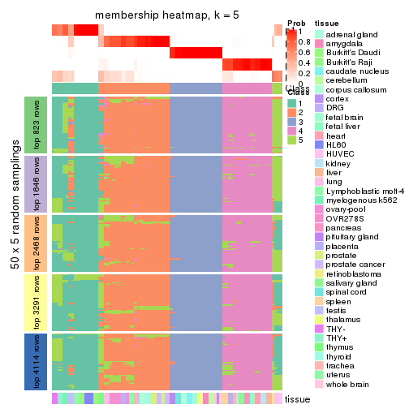</p>

</div>
<div id='tab-MAD-NMF-membership-heatmap-5'>
<pre><code class="r">membership_heatmap(res, k = 6)
</code></pre>

<p></p>

</div>
</div>

As soon as we have had the classes for columns, we can look for signatures
which are significantly different between classes which can be candidate marks
for certain classes. Following are the heatmaps for signatures.


Signature heatmaps where rows are scaled:


<script>
$( function() {
	$( '#tabs-MAD-NMF-get-signatures' ).tabs();
} );
</script>
<div id='tabs-MAD-NMF-get-signatures'>
<ul>
<li><a href='#tab-MAD-NMF-get-signatures-1'>k = 2</a></li>
<li><a href='#tab-MAD-NMF-get-signatures-2'>k = 3</a></li>
<li><a href='#tab-MAD-NMF-get-signatures-3'>k = 4</a></li>
<li><a href='#tab-MAD-NMF-get-signatures-4'>k = 5</a></li>
<li><a href='#tab-MAD-NMF-get-signatures-5'>k = 6</a></li>
</ul>
<div id='tab-MAD-NMF-get-signatures-1'>
<pre><code class="r">get_signatures(res, k = 2)
</code></pre>

<p></p>

</div>
<div id='tab-MAD-NMF-get-signatures-2'>
<pre><code class="r">get_signatures(res, k = 3)
</code></pre>

<p></p>

</div>
<div id='tab-MAD-NMF-get-signatures-3'>
<pre><code class="r">get_signatures(res, k = 4)
</code></pre>

<p></p>

</div>
<div id='tab-MAD-NMF-get-signatures-4'>
<pre><code class="r">get_signatures(res, k = 5)
</code></pre>

<p></p>

</div>
<div id='tab-MAD-NMF-get-signatures-5'>
<pre><code class="r">get_signatures(res, k = 6)
</code></pre>

<p></p>

</div>
</div>


Signature heatmaps where rows are not scaled:


<script>
$( function() {
	$( '#tabs-MAD-NMF-get-signatures-no-scale' ).tabs();
} );
</script>
<div id='tabs-MAD-NMF-get-signatures-no-scale'>
<ul>
<li><a href='#tab-MAD-NMF-get-signatures-no-scale-1'>k = 2</a></li>
<li><a href='#tab-MAD-NMF-get-signatures-no-scale-2'>k = 3</a></li>
<li><a href='#tab-MAD-NMF-get-signatures-no-scale-3'>k = 4</a></li>
<li><a href='#tab-MAD-NMF-get-signatures-no-scale-4'>k = 5</a></li>
<li><a href='#tab-MAD-NMF-get-signatures-no-scale-5'>k = 6</a></li>
</ul>
<div id='tab-MAD-NMF-get-signatures-no-scale-1'>
<pre><code class="r">get_signatures(res, k = 2, scale_rows = FALSE)
</code></pre>

<p></p>

</div>
<div id='tab-MAD-NMF-get-signatures-no-scale-2'>
<pre><code class="r">get_signatures(res, k = 3, scale_rows = FALSE)
</code></pre>

<p></p>

</div>
<div id='tab-MAD-NMF-get-signatures-no-scale-3'>
<pre><code class="r">get_signatures(res, k = 4, scale_rows = FALSE)
</code></pre>

<p>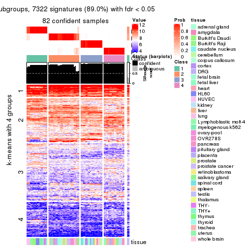</p>

</div>
<div id='tab-MAD-NMF-get-signatures-no-scale-4'>
<pre><code class="r">get_signatures(res, k = 5, scale_rows = FALSE)
</code></pre>

<p></p>

</div>
<div id='tab-MAD-NMF-get-signatures-no-scale-5'>
<pre><code class="r">get_signatures(res, k = 6, scale_rows = FALSE)
</code></pre>

<p></p>

</div>
</div>


Compare the overlap of signatures from different k:

```r
compare_signatures(res)
```

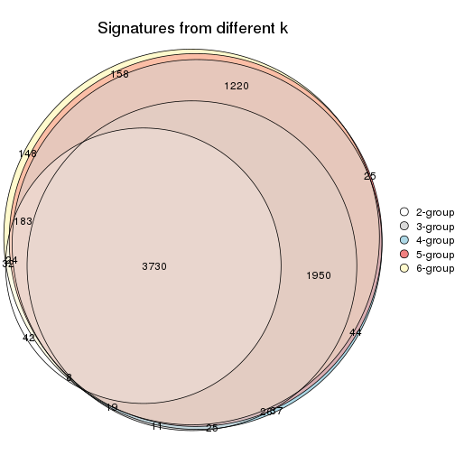

`get_signature()` returns a data frame invisibly. TO get the list of signatures, the function
call should be assigned to a variable explicitly. In following code, if `plot` argument is set
to `FALSE`, no heatmap is plotted while only the differential analysis is performed.

```r
# code only for demonstration
tb = get_signature(res, k = ..., plot = FALSE)
```

An example of the output of `tb` is:

```
#>   which_row         fdr    mean_1    mean_2 scaled_mean_1 scaled_mean_2 km
#> 1        38 0.042760348  8.373488  9.131774    -0.5533452     0.5164555  1
#> 2        40 0.018707592  7.106213  8.469186    -0.6173731     0.5762149  1
#> 3        55 0.019134737 10.221463 11.207825    -0.6159697     0.5749050  1
#> 4        59 0.006059896  5.921854  7.869574    -0.6899429     0.6439467  1
#> 5        60 0.018055526  8.928898 10.211722    -0.6204761     0.5791110  1
#> 6        98 0.009384629 15.714769 14.887706     0.6635654    -0.6193277  2
...
```

The columns in `tb` are:

1. `which_row`: row indices corresponding to the input matrix.
2. `fdr`: FDR for the differential test. 
3. `mean_x`: The mean value in group x.
4. `scaled_mean_x`: The mean value in group x after rows are scaled.
5. `km`: Row groups if k-means clustering is applied to rows.


UMAP plot which shows how samples are separated.


<script>
$( function() {
	$( '#tabs-MAD-NMF-dimension-reduction' ).tabs();
} );
</script>
<div id='tabs-MAD-NMF-dimension-reduction'>
<ul>
<li><a href='#tab-MAD-NMF-dimension-reduction-1'>k = 2</a></li>
<li><a href='#tab-MAD-NMF-dimension-reduction-2'>k = 3</a></li>
<li><a href='#tab-MAD-NMF-dimension-reduction-3'>k = 4</a></li>
<li><a href='#tab-MAD-NMF-dimension-reduction-4'>k = 5</a></li>
<li><a href='#tab-MAD-NMF-dimension-reduction-5'>k = 6</a></li>
</ul>
<div id='tab-MAD-NMF-dimension-reduction-1'>
<pre><code class="r">dimension_reduction(res, k = 2, method = &quot;UMAP&quot;)
</code></pre>

<p></p>

</div>
<div id='tab-MAD-NMF-dimension-reduction-2'>
<pre><code class="r">dimension_reduction(res, k = 3, method = &quot;UMAP&quot;)
</code></pre>

<p></p>

</div>
<div id='tab-MAD-NMF-dimension-reduction-3'>
<pre><code class="r">dimension_reduction(res, k = 4, method = &quot;UMAP&quot;)
</code></pre>

<p></p>

</div>
<div id='tab-MAD-NMF-dimension-reduction-4'>
<pre><code class="r">dimension_reduction(res, k = 5, method = &quot;UMAP&quot;)
</code></pre>

<p></p>

</div>
<div id='tab-MAD-NMF-dimension-reduction-5'>
<pre><code class="r">dimension_reduction(res, k = 6, method = &quot;UMAP&quot;)
</code></pre>

<p></p>

</div>
</div>


Following heatmap shows how subgroups are split when increasing `k`:

```r
collect_classes(res)
```


Test correlation between subgroups and known annotations. If the known
annotation is numeric, one-way ANOVA test is applied, and if the known
annotation is discrete, chi-squared contingency table test is applied.

```r
test_to_known_factors(res)
```

```
#>          n tissue(p) k
#> MAD:NMF 80  5.31e-05 2
#> MAD:NMF 82  9.10e-09 3
#> MAD:NMF 82  9.12e-12 4
#> MAD:NMF 76  2.03e-14 5
#> MAD:NMF 78  5.97e-18 6
```


If matrix rows can be associated to genes, consider to use `GO_Enrichment(res,
...)` to perform function enrichment for the signature genes.


 

---------------------------------------------------


### ATC:hclust**


The object with results only for a single top-value method and a single partition method 
can be extracted as:

```r
res = res_list["ATC", "hclust"]
# you can also extract it by
# res = res_list["ATC:hclust"]
```

A summary of `res` and all the functions that can be applied to it:

```r
res
```

```
#> A 'ConsensusPartition' object with k = 2, 3, 4, 5, 6.
#>   On a matrix with 8229 rows and 84 columns.
#>   Top rows (823, 1646, 2468, 3291, 4114) are extracted by 'ATC' method.
#>   Subgroups are detected by 'hclust' method.
#>   Performed in total 1250 partitions by row resampling.
#>   Best k for subgroups seems to be 2.
#> 
#> Following methods can be applied to this 'ConsensusPartition' object:
#>  [1] "cola_report"             "collect_classes"         "collect_plots"          
#>  [4] "collect_stats"           "colnames"                "compare_signatures"     
#>  [7] "consensus_heatmap"       "dimension_reduction"     "functional_enrichment"  
#> [10] "get_anno_col"            "get_anno"                "get_classes"            
#> [13] "get_consensus"           "get_matrix"              "get_membership"         
#> [16] "get_param"               "get_signatures"          "get_stats"              
#> [19] "is_best_k"               "is_stable_k"             "membership_heatmap"     
#> [22] "ncol"                    "nrow"                    "plot_ecdf"              
#> [25] "rownames"                "select_partition_number" "show"                   
#> [28] "suggest_best_k"          "test_to_known_factors"
```

`collect_plots()` function collects all the plots made from `res` for all `k` (number of partitions)
into one single page to provide an easy and fast comparison between different `k`.

```r
collect_plots(res)
```


The plots are:

- The first row: a plot of the ECDF (Empirical cumulative distribution
  function) curves of the consensus matrix for each `k` and the heatmap of
  predicted classes for each `k`.
- The second row: heatmaps of the consensus matrix for each `k`.
- The third row: heatmaps of the membership matrix for each `k`.
- The fouth row: heatmaps of the signatures for each `k`.

All the plots in panels can be made by individual functions and they are
plotted later in this section.

`select_partition_number()` produces several plots showing different
statistics for choosing "optimized" `k`. There are following statistics:

- ECDF curves of the consensus matrix for each `k`;
- 1-PAC. [The PAC
  score](https://en.wikipedia.org/wiki/Consensus_clustering#Over-interpretation_potential_of_consensus_clustering)
  measures the proportion of the ambiguous subgrouping.
- Mean silhouette score.
- Concordance. The mean probability of fiting the consensus class ids in all
  partitions.
- Area increased. Denote $A_k$ as the area under the ECDF curve for current
  `k`, the area increased is defined as $A_k - A_{k-1}$.
- Rand index. The percent of pairs of samples that are both in a same cluster
  or both are not in a same cluster in the partition of k and k-1.
- Jaccard index. The ratio of pairs of samples are both in a same cluster in
  the partition of k and k-1 and the pairs of samples are both in a same
  cluster in the partition k or k-1.

The detailed explanations of these statistics can be found in [the cola
vignette](http://bioconductor.org/packages/devel/bioc/vignettes/cola/inst/doc/cola.html#toc_13).

Generally speaking, lower PAC score, higher mean silhouette score or higher
concordance corresponds to better partition. Rand index and Jaccard index
measure how similar the current partition is compared to partition with `k-1`.
If they are too similar, we won't accept `k` is better than `k-1`.

```r
select_partition_number(res)
```


The numeric values for all these statistics can be obtained by `get_stats()`.

```r
get_stats(res)
```

```
#>   k 1-PAC mean_silhouette concordance area_increased  Rand Jaccard
#> 2 2 1.000           0.987       0.995         0.3467 0.659   0.659
#> 3 3 0.626           0.483       0.769         0.7001 0.673   0.508
#> 4 4 0.869           0.921       0.961         0.2415 0.757   0.435
#> 5 5 0.866           0.894       0.941         0.0371 0.977   0.916
#> 6 6 0.874           0.867       0.936         0.0490 0.952   0.808
```

`suggest_best_k()` suggests the best $k$ based on these statistics. The rules are as follows:

- All $k$ with Jaccard index larger than 0.95 are removed because the increase of
  the partition number does not provides enough extra information. If all $k$ are removed,
  the best $k$ is assigned by `NA`.
- For $k$ with 1-PAC larger than 0.9, the maximal $k$ is taken as the "best k". Other $k$ is called "optional k".
- If it does not fit the second rule. The $k$ with the highest vote of highest
  1-PAC, mean silhouette and concordance is taken as the "best k".

```r
suggest_best_k(res)
```

```
#> [1] 2
```


Following shows the table of the partitions (You need to click the **show/hide
code output** link to see it). The membership matrix (columns with name `p*`)
is inferred by
[`clue::cl_consensus()`](https://www.rdocumentation.org/link/cl_consensus?package=clue)
function with the `SE` method. Basically the value in the membership matrix
represents the probability to belong to a certain group. The finall class
label for an item is determined with the group with highest probability it
belongs to.

In `get_classes()` function, the entropy is calculated from the membership
matrix and the silhouette score is calculated from the consensus matrix.


<script>
$( function() {
	$( '#tabs-ATC-hclust-get-classes' ).tabs();
} );
</script>
<div id='tabs-ATC-hclust-get-classes'>
<ul>
<li><a href='#tab-ATC-hclust-get-classes-1'>k = 2</a></li>
<li><a href='#tab-ATC-hclust-get-classes-2'>k = 3</a></li>
<li><a href='#tab-ATC-hclust-get-classes-3'>k = 4</a></li>
<li><a href='#tab-ATC-hclust-get-classes-4'>k = 5</a></li>
<li><a href='#tab-ATC-hclust-get-classes-5'>k = 6</a></li>
</ul>

<div id='tab-ATC-hclust-get-classes-1'>
<p><a id='tab-ATC-hclust-get-classes-1-a' style='color:#0366d6' href='#'>show/hide code output</a></p>
<pre><code class="r">cbind(get_classes(res, k = 2), get_membership(res, k = 2))
</code></pre>

<pre><code>#&gt;         class entropy silhouette    p1    p2
#&gt; GSM2819     2  0.0376      0.990 0.004 0.996
#&gt; GSM2820     2  0.0000      0.994 0.000 1.000
#&gt; GSM2822     2  0.0000      0.994 0.000 1.000
#&gt; GSM2832     2  0.0000      0.994 0.000 1.000
#&gt; GSM2823     2  0.0000      0.994 0.000 1.000
#&gt; GSM2824     2  0.0000      0.994 0.000 1.000
#&gt; GSM2825     2  0.0000      0.994 0.000 1.000
#&gt; GSM2826     2  0.0000      0.994 0.000 1.000
#&gt; GSM2829     1  0.0000      1.000 1.000 0.000
#&gt; GSM2856     1  0.0000      1.000 1.000 0.000
#&gt; GSM2830     1  0.0000      1.000 1.000 0.000
#&gt; GSM2843     1  0.0000      1.000 1.000 0.000
#&gt; GSM2871     1  0.0000      1.000 1.000 0.000
#&gt; GSM2831     1  0.0000      1.000 1.000 0.000
#&gt; GSM2844     1  0.0000      1.000 1.000 0.000
#&gt; GSM2833     1  0.0000      1.000 1.000 0.000
#&gt; GSM2846     1  0.0000      1.000 1.000 0.000
#&gt; GSM2835     1  0.0000      1.000 1.000 0.000
#&gt; GSM2858     1  0.0000      1.000 1.000 0.000
#&gt; GSM2836     2  0.0000      0.994 0.000 1.000
#&gt; GSM2848     2  0.0000      0.994 0.000 1.000
#&gt; GSM2828     2  0.0000      0.994 0.000 1.000
#&gt; GSM2837     2  0.0000      0.994 0.000 1.000
#&gt; GSM2839     2  0.0000      0.994 0.000 1.000
#&gt; GSM2841     2  0.0000      0.994 0.000 1.000
#&gt; GSM2827     2  0.0000      0.994 0.000 1.000
#&gt; GSM2842     2  0.0000      0.994 0.000 1.000
#&gt; GSM2845     1  0.0000      1.000 1.000 0.000
#&gt; GSM2872     1  0.0000      1.000 1.000 0.000
#&gt; GSM2834     1  0.0000      1.000 1.000 0.000
#&gt; GSM2847     1  0.0000      1.000 1.000 0.000
#&gt; GSM2849     2  0.0000      0.994 0.000 1.000
#&gt; GSM2850     2  0.0000      0.994 0.000 1.000
#&gt; GSM2838     2  0.0000      0.994 0.000 1.000
#&gt; GSM2853     2  0.0000      0.994 0.000 1.000
#&gt; GSM2852     2  0.0000      0.994 0.000 1.000
#&gt; GSM2855     2  0.0000      0.994 0.000 1.000
#&gt; GSM2840     2  0.0000      0.994 0.000 1.000
#&gt; GSM2857     2  0.0000      0.994 0.000 1.000
#&gt; GSM2859     2  0.0000      0.994 0.000 1.000
#&gt; GSM2860     2  0.0000      0.994 0.000 1.000
#&gt; GSM2861     2  0.0000      0.994 0.000 1.000
#&gt; GSM2862     2  0.0000      0.994 0.000 1.000
#&gt; GSM2863     2  0.0000      0.994 0.000 1.000
#&gt; GSM2864     2  0.0000      0.994 0.000 1.000
#&gt; GSM2865     2  0.0000      0.994 0.000 1.000
#&gt; GSM2866     2  0.0000      0.994 0.000 1.000
#&gt; GSM2868     2  0.0000      0.994 0.000 1.000
#&gt; GSM2869     2  0.0000      0.994 0.000 1.000
#&gt; GSM2851     2  0.0000      0.994 0.000 1.000
#&gt; GSM2867     2  0.0000      0.994 0.000 1.000
#&gt; GSM2870     2  0.0000      0.994 0.000 1.000
#&gt; GSM2854     1  0.0672      0.992 0.992 0.008
#&gt; GSM2873     2  0.9661      0.355 0.392 0.608
#&gt; GSM2874     2  0.0000      0.994 0.000 1.000
#&gt; GSM2884     2  0.0000      0.994 0.000 1.000
#&gt; GSM2875     2  0.0000      0.994 0.000 1.000
#&gt; GSM2890     2  0.0000      0.994 0.000 1.000
#&gt; GSM2877     2  0.0000      0.994 0.000 1.000
#&gt; GSM2892     2  0.0000      0.994 0.000 1.000
#&gt; GSM2902     2  0.0000      0.994 0.000 1.000
#&gt; GSM2878     2  0.0000      0.994 0.000 1.000
#&gt; GSM2901     2  0.0000      0.994 0.000 1.000
#&gt; GSM2879     2  0.0000      0.994 0.000 1.000
#&gt; GSM2898     2  0.0000      0.994 0.000 1.000
#&gt; GSM2881     2  0.0000      0.994 0.000 1.000
#&gt; GSM2897     2  0.0000      0.994 0.000 1.000
#&gt; GSM2882     1  0.0000      1.000 1.000 0.000
#&gt; GSM2894     1  0.0000      1.000 1.000 0.000
#&gt; GSM2883     2  0.0000      0.994 0.000 1.000
#&gt; GSM2895     2  0.0000      0.994 0.000 1.000
#&gt; GSM2885     2  0.0000      0.994 0.000 1.000
#&gt; GSM2886     2  0.0000      0.994 0.000 1.000
#&gt; GSM2887     2  0.0000      0.994 0.000 1.000
#&gt; GSM2896     2  0.0000      0.994 0.000 1.000
#&gt; GSM2888     2  0.0000      0.994 0.000 1.000
#&gt; GSM2889     2  0.0000      0.994 0.000 1.000
#&gt; GSM2876     2  0.0000      0.994 0.000 1.000
#&gt; GSM2891     2  0.0000      0.994 0.000 1.000
#&gt; GSM2880     2  0.0000      0.994 0.000 1.000
#&gt; GSM2893     2  0.0000      0.994 0.000 1.000
#&gt; GSM2821     2  0.0000      0.994 0.000 1.000
#&gt; GSM2900     2  0.0000      0.994 0.000 1.000
#&gt; GSM2903     2  0.0000      0.994 0.000 1.000
</code></pre>

<script>
$('#tab-ATC-hclust-get-classes-1-a').parent().next().next().hide();
$('#tab-ATC-hclust-get-classes-1-a').click(function(){
  $('#tab-ATC-hclust-get-classes-1-a').parent().next().next().toggle();
  return(false);
});
</script>
</div>

<div id='tab-ATC-hclust-get-classes-2'>
<p><a id='tab-ATC-hclust-get-classes-2-a' style='color:#0366d6' href='#'>show/hide code output</a></p>
<pre><code class="r">cbind(get_classes(res, k = 3), get_membership(res, k = 3))
</code></pre>

<pre><code>#&gt;         class entropy silhouette    p1    p2    p3
#&gt; GSM2819     1  0.6345      0.311 0.596 0.004 0.400
#&gt; GSM2820     3  0.0000      0.652 0.000 0.000 1.000
#&gt; GSM2822     1  0.6299      0.181 0.524 0.000 0.476
#&gt; GSM2832     1  0.6299      0.181 0.524 0.000 0.476
#&gt; GSM2823     1  0.6286      0.208 0.536 0.000 0.464
#&gt; GSM2824     1  0.6286      0.208 0.536 0.000 0.464
#&gt; GSM2825     1  0.6295      0.191 0.528 0.000 0.472
#&gt; GSM2826     1  0.6295      0.191 0.528 0.000 0.472
#&gt; GSM2829     2  0.0000      0.963 0.000 1.000 0.000
#&gt; GSM2856     2  0.0000      0.963 0.000 1.000 0.000
#&gt; GSM2830     2  0.0000      0.963 0.000 1.000 0.000
#&gt; GSM2843     2  0.0000      0.963 0.000 1.000 0.000
#&gt; GSM2871     2  0.0000      0.963 0.000 1.000 0.000
#&gt; GSM2831     2  0.0000      0.963 0.000 1.000 0.000
#&gt; GSM2844     2  0.0000      0.963 0.000 1.000 0.000
#&gt; GSM2833     2  0.0000      0.963 0.000 1.000 0.000
#&gt; GSM2846     2  0.0000      0.963 0.000 1.000 0.000
#&gt; GSM2835     2  0.0000      0.963 0.000 1.000 0.000
#&gt; GSM2858     2  0.0000      0.963 0.000 1.000 0.000
#&gt; GSM2836     3  0.6309     -0.160 0.500 0.000 0.500
#&gt; GSM2848     1  0.6309      0.106 0.500 0.000 0.500
#&gt; GSM2828     3  0.0000      0.652 0.000 0.000 1.000
#&gt; GSM2837     3  0.0000      0.652 0.000 0.000 1.000
#&gt; GSM2839     1  0.0000      0.605 1.000 0.000 0.000
#&gt; GSM2841     1  0.0000      0.605 1.000 0.000 0.000
#&gt; GSM2827     1  0.6309      0.106 0.500 0.000 0.500
#&gt; GSM2842     3  0.6309     -0.160 0.500 0.000 0.500
#&gt; GSM2845     2  0.0000      0.963 0.000 1.000 0.000
#&gt; GSM2872     2  0.0000      0.963 0.000 1.000 0.000
#&gt; GSM2834     2  0.0000      0.963 0.000 1.000 0.000
#&gt; GSM2847     2  0.0000      0.963 0.000 1.000 0.000
#&gt; GSM2849     3  0.0000      0.652 0.000 0.000 1.000
#&gt; GSM2850     3  0.0000      0.652 0.000 0.000 1.000
#&gt; GSM2838     3  0.6309     -0.160 0.500 0.000 0.500
#&gt; GSM2853     1  0.6309      0.106 0.500 0.000 0.500
#&gt; GSM2852     3  0.0000      0.652 0.000 0.000 1.000
#&gt; GSM2855     3  0.0000      0.652 0.000 0.000 1.000
#&gt; GSM2840     1  0.0000      0.605 1.000 0.000 0.000
#&gt; GSM2857     1  0.0000      0.605 1.000 0.000 0.000
#&gt; GSM2859     1  0.6309      0.106 0.500 0.000 0.500
#&gt; GSM2860     3  0.6309     -0.160 0.500 0.000 0.500
#&gt; GSM2861     3  0.6309     -0.160 0.500 0.000 0.500
#&gt; GSM2862     1  0.6309      0.106 0.500 0.000 0.500
#&gt; GSM2863     3  0.6309     -0.160 0.500 0.000 0.500
#&gt; GSM2864     1  0.6309      0.106 0.500 0.000 0.500
#&gt; GSM2865     3  0.6309     -0.160 0.500 0.000 0.500
#&gt; GSM2866     3  0.6309     -0.160 0.500 0.000 0.500
#&gt; GSM2868     1  0.6309      0.106 0.500 0.000 0.500
#&gt; GSM2869     3  0.6309     -0.160 0.500 0.000 0.500
#&gt; GSM2851     3  0.6309     -0.160 0.500 0.000 0.500
#&gt; GSM2867     3  0.6309     -0.160 0.500 0.000 0.500
#&gt; GSM2870     1  0.6309      0.106 0.500 0.000 0.500
#&gt; GSM2854     2  0.0424      0.955 0.000 0.992 0.008
#&gt; GSM2873     2  0.9883     -0.301 0.344 0.392 0.264
#&gt; GSM2874     3  0.0000      0.652 0.000 0.000 1.000
#&gt; GSM2884     3  0.0000      0.652 0.000 0.000 1.000
#&gt; GSM2875     1  0.0000      0.605 1.000 0.000 0.000
#&gt; GSM2890     1  0.0000      0.605 1.000 0.000 0.000
#&gt; GSM2877     1  0.0000      0.605 1.000 0.000 0.000
#&gt; GSM2892     1  0.0000      0.605 1.000 0.000 0.000
#&gt; GSM2902     1  0.0000      0.605 1.000 0.000 0.000
#&gt; GSM2878     1  0.0000      0.605 1.000 0.000 0.000
#&gt; GSM2901     1  0.0000      0.605 1.000 0.000 0.000
#&gt; GSM2879     3  0.4605      0.489 0.204 0.000 0.796
#&gt; GSM2898     3  0.4605      0.489 0.204 0.000 0.796
#&gt; GSM2881     3  0.0000      0.652 0.000 0.000 1.000
#&gt; GSM2897     3  0.0000      0.652 0.000 0.000 1.000
#&gt; GSM2882     2  0.0000      0.963 0.000 1.000 0.000
#&gt; GSM2894     2  0.0000      0.963 0.000 1.000 0.000
#&gt; GSM2883     3  0.0000      0.652 0.000 0.000 1.000
#&gt; GSM2895     3  0.0000      0.652 0.000 0.000 1.000
#&gt; GSM2885     3  0.0000      0.652 0.000 0.000 1.000
#&gt; GSM2886     3  0.0000      0.652 0.000 0.000 1.000
#&gt; GSM2887     3  0.0000      0.652 0.000 0.000 1.000
#&gt; GSM2896     3  0.0000      0.652 0.000 0.000 1.000
#&gt; GSM2888     3  0.6008      0.203 0.372 0.000 0.628
#&gt; GSM2889     3  0.6008      0.203 0.372 0.000 0.628
#&gt; GSM2876     1  0.0000      0.605 1.000 0.000 0.000
#&gt; GSM2891     1  0.0000      0.605 1.000 0.000 0.000
#&gt; GSM2880     1  0.0000      0.605 1.000 0.000 0.000
#&gt; GSM2893     1  0.0000      0.605 1.000 0.000 0.000
#&gt; GSM2821     1  0.5291      0.471 0.732 0.000 0.268
#&gt; GSM2900     1  0.5291      0.471 0.732 0.000 0.268
#&gt; GSM2903     1  0.5291      0.471 0.732 0.000 0.268
</code></pre>

<script>
$('#tab-ATC-hclust-get-classes-2-a').parent().next().next().hide();
$('#tab-ATC-hclust-get-classes-2-a').click(function(){
  $('#tab-ATC-hclust-get-classes-2-a').parent().next().next().toggle();
  return(false);
});
</script>
</div>

<div id='tab-ATC-hclust-get-classes-3'>
<p><a id='tab-ATC-hclust-get-classes-3-a' style='color:#0366d6' href='#'>show/hide code output</a></p>
<pre><code class="r">cbind(get_classes(res, k = 4), get_membership(res, k = 4))
</code></pre>

<pre><code>#&gt;         class entropy silhouette    p1    p2    p3    p4
#&gt; GSM2819     2  0.2466      0.856 0.096 0.900 0.004 0.000
#&gt; GSM2820     3  0.0188      0.947 0.000 0.004 0.996 0.000
#&gt; GSM2822     2  0.0817      0.910 0.024 0.976 0.000 0.000
#&gt; GSM2832     2  0.0817      0.910 0.024 0.976 0.000 0.000
#&gt; GSM2823     2  0.1118      0.905 0.036 0.964 0.000 0.000
#&gt; GSM2824     2  0.1118      0.905 0.036 0.964 0.000 0.000
#&gt; GSM2825     2  0.0921      0.909 0.028 0.972 0.000 0.000
#&gt; GSM2826     2  0.0921      0.909 0.028 0.972 0.000 0.000
#&gt; GSM2829     4  0.0000      0.998 0.000 0.000 0.000 1.000
#&gt; GSM2856     4  0.0000      0.998 0.000 0.000 0.000 1.000
#&gt; GSM2830     4  0.0188      0.998 0.000 0.000 0.004 0.996
#&gt; GSM2843     4  0.0188      0.998 0.000 0.000 0.004 0.996
#&gt; GSM2871     4  0.0188      0.998 0.000 0.000 0.004 0.996
#&gt; GSM2831     4  0.0000      0.998 0.000 0.000 0.000 1.000
#&gt; GSM2844     4  0.0000      0.998 0.000 0.000 0.000 1.000
#&gt; GSM2833     4  0.0000      0.998 0.000 0.000 0.000 1.000
#&gt; GSM2846     4  0.0000      0.998 0.000 0.000 0.000 1.000
#&gt; GSM2835     4  0.0000      0.998 0.000 0.000 0.000 1.000
#&gt; GSM2858     4  0.0000      0.998 0.000 0.000 0.000 1.000
#&gt; GSM2836     2  0.0000      0.919 0.000 1.000 0.000 0.000
#&gt; GSM2848     2  0.0000      0.919 0.000 1.000 0.000 0.000
#&gt; GSM2828     3  0.0188      0.947 0.000 0.004 0.996 0.000
#&gt; GSM2837     3  0.0188      0.947 0.000 0.004 0.996 0.000
#&gt; GSM2839     1  0.0000      1.000 1.000 0.000 0.000 0.000
#&gt; GSM2841     1  0.0000      1.000 1.000 0.000 0.000 0.000
#&gt; GSM2827     2  0.0000      0.919 0.000 1.000 0.000 0.000
#&gt; GSM2842     2  0.0000      0.919 0.000 1.000 0.000 0.000
#&gt; GSM2845     4  0.0188      0.998 0.000 0.000 0.004 0.996
#&gt; GSM2872     4  0.0188      0.998 0.000 0.000 0.004 0.996
#&gt; GSM2834     4  0.0188      0.998 0.000 0.000 0.004 0.996
#&gt; GSM2847     4  0.0188      0.998 0.000 0.000 0.004 0.996
#&gt; GSM2849     3  0.0188      0.947 0.000 0.004 0.996 0.000
#&gt; GSM2850     3  0.0188      0.947 0.000 0.004 0.996 0.000
#&gt; GSM2838     2  0.0000      0.919 0.000 1.000 0.000 0.000
#&gt; GSM2853     2  0.0000      0.919 0.000 1.000 0.000 0.000
#&gt; GSM2852     3  0.2589      0.903 0.000 0.116 0.884 0.000
#&gt; GSM2855     3  0.2589      0.903 0.000 0.116 0.884 0.000
#&gt; GSM2840     1  0.0000      1.000 1.000 0.000 0.000 0.000
#&gt; GSM2857     1  0.0000      1.000 1.000 0.000 0.000 0.000
#&gt; GSM2859     2  0.0000      0.919 0.000 1.000 0.000 0.000
#&gt; GSM2860     2  0.0000      0.919 0.000 1.000 0.000 0.000
#&gt; GSM2861     2  0.0000      0.919 0.000 1.000 0.000 0.000
#&gt; GSM2862     2  0.0000      0.919 0.000 1.000 0.000 0.000
#&gt; GSM2863     2  0.0000      0.919 0.000 1.000 0.000 0.000
#&gt; GSM2864     2  0.0000      0.919 0.000 1.000 0.000 0.000
#&gt; GSM2865     2  0.0000      0.919 0.000 1.000 0.000 0.000
#&gt; GSM2866     2  0.0000      0.919 0.000 1.000 0.000 0.000
#&gt; GSM2868     2  0.0000      0.919 0.000 1.000 0.000 0.000
#&gt; GSM2869     2  0.0000      0.919 0.000 1.000 0.000 0.000
#&gt; GSM2851     2  0.0000      0.919 0.000 1.000 0.000 0.000
#&gt; GSM2867     2  0.0000      0.919 0.000 1.000 0.000 0.000
#&gt; GSM2870     2  0.0000      0.919 0.000 1.000 0.000 0.000
#&gt; GSM2854     4  0.0524      0.990 0.000 0.008 0.004 0.988
#&gt; GSM2873     2  0.4991      0.342 0.000 0.608 0.004 0.388
#&gt; GSM2874     3  0.0188      0.947 0.000 0.004 0.996 0.000
#&gt; GSM2884     3  0.0188      0.947 0.000 0.004 0.996 0.000
#&gt; GSM2875     1  0.0000      1.000 1.000 0.000 0.000 0.000
#&gt; GSM2890     1  0.0000      1.000 1.000 0.000 0.000 0.000
#&gt; GSM2877     1  0.0000      1.000 1.000 0.000 0.000 0.000
#&gt; GSM2892     1  0.0000      1.000 1.000 0.000 0.000 0.000
#&gt; GSM2902     1  0.0000      1.000 1.000 0.000 0.000 0.000
#&gt; GSM2878     1  0.0000      1.000 1.000 0.000 0.000 0.000
#&gt; GSM2901     1  0.0000      1.000 1.000 0.000 0.000 0.000
#&gt; GSM2879     2  0.4713      0.416 0.000 0.640 0.360 0.000
#&gt; GSM2898     2  0.4713      0.416 0.000 0.640 0.360 0.000
#&gt; GSM2881     3  0.0188      0.947 0.000 0.004 0.996 0.000
#&gt; GSM2897     3  0.0188      0.947 0.000 0.004 0.996 0.000
#&gt; GSM2882     4  0.0000      0.998 0.000 0.000 0.000 1.000
#&gt; GSM2894     4  0.0000      0.998 0.000 0.000 0.000 1.000
#&gt; GSM2883     3  0.2921      0.881 0.000 0.140 0.860 0.000
#&gt; GSM2895     3  0.2921      0.881 0.000 0.140 0.860 0.000
#&gt; GSM2885     3  0.0188      0.947 0.000 0.004 0.996 0.000
#&gt; GSM2886     3  0.0188      0.947 0.000 0.004 0.996 0.000
#&gt; GSM2887     3  0.2589      0.903 0.000 0.116 0.884 0.000
#&gt; GSM2896     3  0.2589      0.903 0.000 0.116 0.884 0.000
#&gt; GSM2888     2  0.3400      0.751 0.000 0.820 0.180 0.000
#&gt; GSM2889     2  0.3400      0.751 0.000 0.820 0.180 0.000
#&gt; GSM2876     1  0.0000      1.000 1.000 0.000 0.000 0.000
#&gt; GSM2891     1  0.0000      1.000 1.000 0.000 0.000 0.000
#&gt; GSM2880     1  0.0000      1.000 1.000 0.000 0.000 0.000
#&gt; GSM2893     1  0.0000      1.000 1.000 0.000 0.000 0.000
#&gt; GSM2821     2  0.3907      0.716 0.232 0.768 0.000 0.000
#&gt; GSM2900     2  0.3907      0.716 0.232 0.768 0.000 0.000
#&gt; GSM2903     2  0.3907      0.716 0.232 0.768 0.000 0.000
</code></pre>

<script>
$('#tab-ATC-hclust-get-classes-3-a').parent().next().next().hide();
$('#tab-ATC-hclust-get-classes-3-a').click(function(){
  $('#tab-ATC-hclust-get-classes-3-a').parent().next().next().toggle();
  return(false);
});
</script>
</div>

<div id='tab-ATC-hclust-get-classes-4'>
<p><a id='tab-ATC-hclust-get-classes-4-a' style='color:#0366d6' href='#'>show/hide code output</a></p>
<pre><code class="r">cbind(get_classes(res, k = 5), get_membership(res, k = 5))
</code></pre>

<pre><code>#&gt;         class entropy silhouette    p1    p2    p3    p4    p5
#&gt; GSM2819     2   0.306      0.836 0.068 0.864 0.000 0.000 0.068
#&gt; GSM2820     3   0.000      0.942 0.000 0.000 1.000 0.000 0.000
#&gt; GSM2822     2   0.141      0.889 0.000 0.940 0.000 0.000 0.060
#&gt; GSM2832     2   0.141      0.889 0.000 0.940 0.000 0.000 0.060
#&gt; GSM2823     2   0.181      0.884 0.012 0.928 0.000 0.000 0.060
#&gt; GSM2824     2   0.181      0.884 0.012 0.928 0.000 0.000 0.060
#&gt; GSM2825     2   0.148      0.887 0.000 0.936 0.000 0.000 0.064
#&gt; GSM2826     2   0.148      0.887 0.000 0.936 0.000 0.000 0.064
#&gt; GSM2829     4   0.000      0.914 0.000 0.000 0.000 1.000 0.000
#&gt; GSM2856     4   0.000      0.914 0.000 0.000 0.000 1.000 0.000
#&gt; GSM2830     5   0.167      0.989 0.000 0.000 0.000 0.076 0.924
#&gt; GSM2843     5   0.167      0.989 0.000 0.000 0.000 0.076 0.924
#&gt; GSM2871     5   0.154      0.993 0.000 0.000 0.000 0.068 0.932
#&gt; GSM2831     4   0.000      0.914 0.000 0.000 0.000 1.000 0.000
#&gt; GSM2844     4   0.000      0.914 0.000 0.000 0.000 1.000 0.000
#&gt; GSM2833     4   0.000      0.914 0.000 0.000 0.000 1.000 0.000
#&gt; GSM2846     4   0.000      0.914 0.000 0.000 0.000 1.000 0.000
#&gt; GSM2835     4   0.000      0.914 0.000 0.000 0.000 1.000 0.000
#&gt; GSM2858     4   0.000      0.914 0.000 0.000 0.000 1.000 0.000
#&gt; GSM2836     2   0.000      0.910 0.000 1.000 0.000 0.000 0.000
#&gt; GSM2848     2   0.000      0.910 0.000 1.000 0.000 0.000 0.000
#&gt; GSM2828     3   0.000      0.942 0.000 0.000 1.000 0.000 0.000
#&gt; GSM2837     3   0.000      0.942 0.000 0.000 1.000 0.000 0.000
#&gt; GSM2839     1   0.000      1.000 1.000 0.000 0.000 0.000 0.000
#&gt; GSM2841     1   0.000      1.000 1.000 0.000 0.000 0.000 0.000
#&gt; GSM2827     2   0.000      0.910 0.000 1.000 0.000 0.000 0.000
#&gt; GSM2842     2   0.000      0.910 0.000 1.000 0.000 0.000 0.000
#&gt; GSM2845     5   0.154      0.993 0.000 0.000 0.000 0.068 0.932
#&gt; GSM2872     5   0.154      0.993 0.000 0.000 0.000 0.068 0.932
#&gt; GSM2834     5   0.154      0.993 0.000 0.000 0.000 0.068 0.932
#&gt; GSM2847     5   0.154      0.993 0.000 0.000 0.000 0.068 0.932
#&gt; GSM2849     3   0.000      0.942 0.000 0.000 1.000 0.000 0.000
#&gt; GSM2850     3   0.000      0.942 0.000 0.000 1.000 0.000 0.000
#&gt; GSM2838     2   0.000      0.910 0.000 1.000 0.000 0.000 0.000
#&gt; GSM2853     2   0.000      0.910 0.000 1.000 0.000 0.000 0.000
#&gt; GSM2852     3   0.218      0.893 0.000 0.112 0.888 0.000 0.000
#&gt; GSM2855     3   0.218      0.893 0.000 0.112 0.888 0.000 0.000
#&gt; GSM2840     1   0.000      1.000 1.000 0.000 0.000 0.000 0.000
#&gt; GSM2857     1   0.000      1.000 1.000 0.000 0.000 0.000 0.000
#&gt; GSM2859     2   0.000      0.910 0.000 1.000 0.000 0.000 0.000
#&gt; GSM2860     2   0.000      0.910 0.000 1.000 0.000 0.000 0.000
#&gt; GSM2861     2   0.000      0.910 0.000 1.000 0.000 0.000 0.000
#&gt; GSM2862     2   0.000      0.910 0.000 1.000 0.000 0.000 0.000
#&gt; GSM2863     2   0.000      0.910 0.000 1.000 0.000 0.000 0.000
#&gt; GSM2864     2   0.000      0.910 0.000 1.000 0.000 0.000 0.000
#&gt; GSM2865     2   0.000      0.910 0.000 1.000 0.000 0.000 0.000
#&gt; GSM2866     2   0.000      0.910 0.000 1.000 0.000 0.000 0.000
#&gt; GSM2868     2   0.000      0.910 0.000 1.000 0.000 0.000 0.000
#&gt; GSM2869     2   0.000      0.910 0.000 1.000 0.000 0.000 0.000
#&gt; GSM2851     2   0.000      0.910 0.000 1.000 0.000 0.000 0.000
#&gt; GSM2867     2   0.000      0.910 0.000 1.000 0.000 0.000 0.000
#&gt; GSM2870     2   0.000      0.910 0.000 1.000 0.000 0.000 0.000
#&gt; GSM2854     5   0.195      0.972 0.000 0.004 0.000 0.084 0.912
#&gt; GSM2873     2   0.421      0.318 0.000 0.588 0.000 0.000 0.412
#&gt; GSM2874     3   0.000      0.942 0.000 0.000 1.000 0.000 0.000
#&gt; GSM2884     3   0.000      0.942 0.000 0.000 1.000 0.000 0.000
#&gt; GSM2875     1   0.000      1.000 1.000 0.000 0.000 0.000 0.000
#&gt; GSM2890     1   0.000      1.000 1.000 0.000 0.000 0.000 0.000
#&gt; GSM2877     1   0.000      1.000 1.000 0.000 0.000 0.000 0.000
#&gt; GSM2892     1   0.000      1.000 1.000 0.000 0.000 0.000 0.000
#&gt; GSM2902     1   0.000      1.000 1.000 0.000 0.000 0.000 0.000
#&gt; GSM2878     1   0.000      1.000 1.000 0.000 0.000 0.000 0.000
#&gt; GSM2901     1   0.000      1.000 1.000 0.000 0.000 0.000 0.000
#&gt; GSM2879     2   0.406      0.417 0.000 0.640 0.360 0.000 0.000
#&gt; GSM2898     2   0.406      0.417 0.000 0.640 0.360 0.000 0.000
#&gt; GSM2881     3   0.000      0.942 0.000 0.000 1.000 0.000 0.000
#&gt; GSM2897     3   0.000      0.942 0.000 0.000 1.000 0.000 0.000
#&gt; GSM2882     4   0.400      0.484 0.000 0.000 0.000 0.656 0.344
#&gt; GSM2894     4   0.400      0.484 0.000 0.000 0.000 0.656 0.344
#&gt; GSM2883     3   0.247      0.868 0.000 0.136 0.864 0.000 0.000
#&gt; GSM2895     3   0.247      0.868 0.000 0.136 0.864 0.000 0.000
#&gt; GSM2885     3   0.000      0.942 0.000 0.000 1.000 0.000 0.000
#&gt; GSM2886     3   0.000      0.942 0.000 0.000 1.000 0.000 0.000
#&gt; GSM2887     3   0.218      0.893 0.000 0.112 0.888 0.000 0.000
#&gt; GSM2896     3   0.218      0.893 0.000 0.112 0.888 0.000 0.000
#&gt; GSM2888     2   0.293      0.750 0.000 0.820 0.180 0.000 0.000
#&gt; GSM2889     2   0.293      0.750 0.000 0.820 0.180 0.000 0.000
#&gt; GSM2876     1   0.000      1.000 1.000 0.000 0.000 0.000 0.000
#&gt; GSM2891     1   0.000      1.000 1.000 0.000 0.000 0.000 0.000
#&gt; GSM2880     1   0.000      1.000 1.000 0.000 0.000 0.000 0.000
#&gt; GSM2893     1   0.000      1.000 1.000 0.000 0.000 0.000 0.000
#&gt; GSM2821     2   0.447      0.711 0.204 0.736 0.000 0.000 0.060
#&gt; GSM2900     2   0.447      0.711 0.204 0.736 0.000 0.000 0.060
#&gt; GSM2903     2   0.447      0.711 0.204 0.736 0.000 0.000 0.060
</code></pre>

<script>
$('#tab-ATC-hclust-get-classes-4-a').parent().next().next().hide();
$('#tab-ATC-hclust-get-classes-4-a').click(function(){
  $('#tab-ATC-hclust-get-classes-4-a').parent().next().next().toggle();
  return(false);
});
</script>
</div>

<div id='tab-ATC-hclust-get-classes-5'>
<p><a id='tab-ATC-hclust-get-classes-5-a' style='color:#0366d6' href='#'>show/hide code output</a></p>
<pre><code class="r">cbind(get_classes(res, k = 6), get_membership(res, k = 6))
</code></pre>

<pre><code>#&gt;         class entropy silhouette    p1    p2    p3    p4    p5    p6
#&gt; GSM2819     5  0.2320      0.701 0.000 0.132 0.000 0.000 0.864 0.004
#&gt; GSM2820     3  0.0000      0.908 0.000 0.000 1.000 0.000 0.000 0.000
#&gt; GSM2822     2  0.1444      0.849 0.000 0.928 0.000 0.000 0.072 0.000
#&gt; GSM2832     2  0.1444      0.849 0.000 0.928 0.000 0.000 0.072 0.000
#&gt; GSM2823     5  0.3727      0.517 0.000 0.388 0.000 0.000 0.612 0.000
#&gt; GSM2824     5  0.3727      0.517 0.000 0.388 0.000 0.000 0.612 0.000
#&gt; GSM2825     2  0.1501      0.845 0.000 0.924 0.000 0.000 0.076 0.000
#&gt; GSM2826     2  0.1501      0.845 0.000 0.924 0.000 0.000 0.076 0.000
#&gt; GSM2829     4  0.0000      0.900 0.000 0.000 0.000 1.000 0.000 0.000
#&gt; GSM2856     4  0.0000      0.900 0.000 0.000 0.000 1.000 0.000 0.000
#&gt; GSM2830     6  0.0260      0.989 0.000 0.000 0.000 0.008 0.000 0.992
#&gt; GSM2843     6  0.0260      0.989 0.000 0.000 0.000 0.008 0.000 0.992
#&gt; GSM2871     6  0.0000      0.993 0.000 0.000 0.000 0.000 0.000 1.000
#&gt; GSM2831     4  0.0000      0.900 0.000 0.000 0.000 1.000 0.000 0.000
#&gt; GSM2844     4  0.0000      0.900 0.000 0.000 0.000 1.000 0.000 0.000
#&gt; GSM2833     4  0.0000      0.900 0.000 0.000 0.000 1.000 0.000 0.000
#&gt; GSM2846     4  0.0000      0.900 0.000 0.000 0.000 1.000 0.000 0.000
#&gt; GSM2835     4  0.0000      0.900 0.000 0.000 0.000 1.000 0.000 0.000
#&gt; GSM2858     4  0.0000      0.900 0.000 0.000 0.000 1.000 0.000 0.000
#&gt; GSM2836     2  0.0000      0.908 0.000 1.000 0.000 0.000 0.000 0.000
#&gt; GSM2848     2  0.0000      0.908 0.000 1.000 0.000 0.000 0.000 0.000
#&gt; GSM2828     3  0.1141      0.893 0.000 0.000 0.948 0.000 0.052 0.000
#&gt; GSM2837     3  0.1141      0.893 0.000 0.000 0.948 0.000 0.052 0.000
#&gt; GSM2839     1  0.0000      0.999 1.000 0.000 0.000 0.000 0.000 0.000
#&gt; GSM2841     1  0.0000      0.999 1.000 0.000 0.000 0.000 0.000 0.000
#&gt; GSM2827     2  0.0000      0.908 0.000 1.000 0.000 0.000 0.000 0.000
#&gt; GSM2842     2  0.0000      0.908 0.000 1.000 0.000 0.000 0.000 0.000
#&gt; GSM2845     6  0.0000      0.993 0.000 0.000 0.000 0.000 0.000 1.000
#&gt; GSM2872     6  0.0000      0.993 0.000 0.000 0.000 0.000 0.000 1.000
#&gt; GSM2834     6  0.0000      0.993 0.000 0.000 0.000 0.000 0.000 1.000
#&gt; GSM2847     6  0.0000      0.993 0.000 0.000 0.000 0.000 0.000 1.000
#&gt; GSM2849     3  0.1141      0.893 0.000 0.000 0.948 0.000 0.052 0.000
#&gt; GSM2850     3  0.1141      0.893 0.000 0.000 0.948 0.000 0.052 0.000
#&gt; GSM2838     2  0.0000      0.908 0.000 1.000 0.000 0.000 0.000 0.000
#&gt; GSM2853     2  0.0000      0.908 0.000 1.000 0.000 0.000 0.000 0.000
#&gt; GSM2852     3  0.3196      0.844 0.000 0.108 0.828 0.000 0.064 0.000
#&gt; GSM2855     3  0.3196      0.844 0.000 0.108 0.828 0.000 0.064 0.000
#&gt; GSM2840     1  0.0000      0.999 1.000 0.000 0.000 0.000 0.000 0.000
#&gt; GSM2857     1  0.0000      0.999 1.000 0.000 0.000 0.000 0.000 0.000
#&gt; GSM2859     2  0.0000      0.908 0.000 1.000 0.000 0.000 0.000 0.000
#&gt; GSM2860     2  0.0000      0.908 0.000 1.000 0.000 0.000 0.000 0.000
#&gt; GSM2861     2  0.0146      0.907 0.000 0.996 0.000 0.000 0.004 0.000
#&gt; GSM2862     2  0.0000      0.908 0.000 1.000 0.000 0.000 0.000 0.000
#&gt; GSM2863     2  0.0000      0.908 0.000 1.000 0.000 0.000 0.000 0.000
#&gt; GSM2864     2  0.0000      0.908 0.000 1.000 0.000 0.000 0.000 0.000
#&gt; GSM2865     2  0.0000      0.908 0.000 1.000 0.000 0.000 0.000 0.000
#&gt; GSM2866     2  0.0000      0.908 0.000 1.000 0.000 0.000 0.000 0.000
#&gt; GSM2868     2  0.0146      0.907 0.000 0.996 0.000 0.000 0.004 0.000
#&gt; GSM2869     2  0.0146      0.907 0.000 0.996 0.000 0.000 0.004 0.000
#&gt; GSM2851     2  0.0146      0.907 0.000 0.996 0.000 0.000 0.004 0.000
#&gt; GSM2867     2  0.0146      0.907 0.000 0.996 0.000 0.000 0.004 0.000
#&gt; GSM2870     2  0.0146      0.907 0.000 0.996 0.000 0.000 0.004 0.000
#&gt; GSM2854     6  0.0891      0.968 0.000 0.000 0.000 0.024 0.008 0.968
#&gt; GSM2873     2  0.4301      0.231 0.000 0.584 0.000 0.000 0.024 0.392
#&gt; GSM2874     3  0.0000      0.908 0.000 0.000 1.000 0.000 0.000 0.000
#&gt; GSM2884     3  0.0000      0.908 0.000 0.000 1.000 0.000 0.000 0.000
#&gt; GSM2875     1  0.0000      0.999 1.000 0.000 0.000 0.000 0.000 0.000
#&gt; GSM2890     1  0.0000      0.999 1.000 0.000 0.000 0.000 0.000 0.000
#&gt; GSM2877     1  0.0000      0.999 1.000 0.000 0.000 0.000 0.000 0.000
#&gt; GSM2892     1  0.0000      0.999 1.000 0.000 0.000 0.000 0.000 0.000
#&gt; GSM2902     1  0.0000      0.999 1.000 0.000 0.000 0.000 0.000 0.000
#&gt; GSM2878     1  0.0000      0.999 1.000 0.000 0.000 0.000 0.000 0.000
#&gt; GSM2901     1  0.0000      0.999 1.000 0.000 0.000 0.000 0.000 0.000
#&gt; GSM2879     2  0.4621      0.423 0.000 0.632 0.304 0.000 0.064 0.000
#&gt; GSM2898     2  0.4621      0.423 0.000 0.632 0.304 0.000 0.064 0.000
#&gt; GSM2881     3  0.0000      0.908 0.000 0.000 1.000 0.000 0.000 0.000
#&gt; GSM2897     3  0.0000      0.908 0.000 0.000 1.000 0.000 0.000 0.000
#&gt; GSM2882     4  0.3765      0.400 0.000 0.000 0.000 0.596 0.000 0.404
#&gt; GSM2894     4  0.3765      0.400 0.000 0.000 0.000 0.596 0.000 0.404
#&gt; GSM2883     3  0.3522      0.816 0.000 0.128 0.800 0.000 0.072 0.000
#&gt; GSM2895     3  0.3522      0.816 0.000 0.128 0.800 0.000 0.072 0.000
#&gt; GSM2885     3  0.0000      0.908 0.000 0.000 1.000 0.000 0.000 0.000
#&gt; GSM2886     3  0.0000      0.908 0.000 0.000 1.000 0.000 0.000 0.000
#&gt; GSM2887     3  0.3196      0.844 0.000 0.108 0.828 0.000 0.064 0.000
#&gt; GSM2896     3  0.3196      0.844 0.000 0.108 0.828 0.000 0.064 0.000
#&gt; GSM2888     2  0.3354      0.710 0.000 0.812 0.128 0.000 0.060 0.000
#&gt; GSM2889     2  0.3354      0.710 0.000 0.812 0.128 0.000 0.060 0.000
#&gt; GSM2876     1  0.0146      0.996 0.996 0.000 0.000 0.000 0.004 0.000
#&gt; GSM2891     1  0.0146      0.996 0.996 0.000 0.000 0.000 0.004 0.000
#&gt; GSM2880     1  0.0000      0.999 1.000 0.000 0.000 0.000 0.000 0.000
#&gt; GSM2893     1  0.0000      0.999 1.000 0.000 0.000 0.000 0.000 0.000
#&gt; GSM2821     5  0.2489      0.717 0.128 0.012 0.000 0.000 0.860 0.000
#&gt; GSM2900     5  0.2489      0.717 0.128 0.012 0.000 0.000 0.860 0.000
#&gt; GSM2903     5  0.2489      0.717 0.128 0.012 0.000 0.000 0.860 0.000
</code></pre>

<script>
$('#tab-ATC-hclust-get-classes-5-a').parent().next().next().hide();
$('#tab-ATC-hclust-get-classes-5-a').click(function(){
  $('#tab-ATC-hclust-get-classes-5-a').parent().next().next().toggle();
  return(false);
});
</script>
</div>
</div>

Heatmaps for the consensus matrix. It visualizes the probability of two
samples to be in a same group.


<script>
$( function() {
	$( '#tabs-ATC-hclust-consensus-heatmap' ).tabs();
} );
</script>
<div id='tabs-ATC-hclust-consensus-heatmap'>
<ul>
<li><a href='#tab-ATC-hclust-consensus-heatmap-1'>k = 2</a></li>
<li><a href='#tab-ATC-hclust-consensus-heatmap-2'>k = 3</a></li>
<li><a href='#tab-ATC-hclust-consensus-heatmap-3'>k = 4</a></li>
<li><a href='#tab-ATC-hclust-consensus-heatmap-4'>k = 5</a></li>
<li><a href='#tab-ATC-hclust-consensus-heatmap-5'>k = 6</a></li>
</ul>
<div id='tab-ATC-hclust-consensus-heatmap-1'>
<pre><code class="r">consensus_heatmap(res, k = 2)
</code></pre>

<p></p>

</div>
<div id='tab-ATC-hclust-consensus-heatmap-2'>
<pre><code class="r">consensus_heatmap(res, k = 3)
</code></pre>

<p></p>

</div>
<div id='tab-ATC-hclust-consensus-heatmap-3'>
<pre><code class="r">consensus_heatmap(res, k = 4)
</code></pre>

<p></p>

</div>
<div id='tab-ATC-hclust-consensus-heatmap-4'>
<pre><code class="r">consensus_heatmap(res, k = 5)
</code></pre>

<p></p>

</div>
<div id='tab-ATC-hclust-consensus-heatmap-5'>
<pre><code class="r">consensus_heatmap(res, k = 6)
</code></pre>

<p></p>

</div>
</div>

Heatmaps for the membership of samples in all partitions to see how consistent they are:


<script>
$( function() {
	$( '#tabs-ATC-hclust-membership-heatmap' ).tabs();
} );
</script>
<div id='tabs-ATC-hclust-membership-heatmap'>
<ul>
<li><a href='#tab-ATC-hclust-membership-heatmap-1'>k = 2</a></li>
<li><a href='#tab-ATC-hclust-membership-heatmap-2'>k = 3</a></li>
<li><a href='#tab-ATC-hclust-membership-heatmap-3'>k = 4</a></li>
<li><a href='#tab-ATC-hclust-membership-heatmap-4'>k = 5</a></li>
<li><a href='#tab-ATC-hclust-membership-heatmap-5'>k = 6</a></li>
</ul>
<div id='tab-ATC-hclust-membership-heatmap-1'>
<pre><code class="r">membership_heatmap(res, k = 2)
</code></pre>

<p></p>

</div>
<div id='tab-ATC-hclust-membership-heatmap-2'>
<pre><code class="r">membership_heatmap(res, k = 3)
</code></pre>

<p></p>

</div>
<div id='tab-ATC-hclust-membership-heatmap-3'>
<pre><code class="r">membership_heatmap(res, k = 4)
</code></pre>

<p></p>

</div>
<div id='tab-ATC-hclust-membership-heatmap-4'>
<pre><code class="r">membership_heatmap(res, k = 5)
</code></pre>

<p></p>

</div>
<div id='tab-ATC-hclust-membership-heatmap-5'>
<pre><code class="r">membership_heatmap(res, k = 6)
</code></pre>

<p></p>

</div>
</div>

As soon as we have had the classes for columns, we can look for signatures
which are significantly different between classes which can be candidate marks
for certain classes. Following are the heatmaps for signatures.


Signature heatmaps where rows are scaled:


<script>
$( function() {
	$( '#tabs-ATC-hclust-get-signatures' ).tabs();
} );
</script>
<div id='tabs-ATC-hclust-get-signatures'>
<ul>
<li><a href='#tab-ATC-hclust-get-signatures-1'>k = 2</a></li>
<li><a href='#tab-ATC-hclust-get-signatures-2'>k = 3</a></li>
<li><a href='#tab-ATC-hclust-get-signatures-3'>k = 4</a></li>
<li><a href='#tab-ATC-hclust-get-signatures-4'>k = 5</a></li>
<li><a href='#tab-ATC-hclust-get-signatures-5'>k = 6</a></li>
</ul>
<div id='tab-ATC-hclust-get-signatures-1'>
<pre><code class="r">get_signatures(res, k = 2)
</code></pre>

<p></p>

</div>
<div id='tab-ATC-hclust-get-signatures-2'>
<pre><code class="r">get_signatures(res, k = 3)
</code></pre>

<p></p>

</div>
<div id='tab-ATC-hclust-get-signatures-3'>
<pre><code class="r">get_signatures(res, k = 4)
</code></pre>

<p></p>

</div>
<div id='tab-ATC-hclust-get-signatures-4'>
<pre><code class="r">get_signatures(res, k = 5)
</code></pre>

<p></p>

</div>
<div id='tab-ATC-hclust-get-signatures-5'>
<pre><code class="r">get_signatures(res, k = 6)
</code></pre>

<p></p>

</div>
</div>


Signature heatmaps where rows are not scaled:


<script>
$( function() {
	$( '#tabs-ATC-hclust-get-signatures-no-scale' ).tabs();
} );
</script>
<div id='tabs-ATC-hclust-get-signatures-no-scale'>
<ul>
<li><a href='#tab-ATC-hclust-get-signatures-no-scale-1'>k = 2</a></li>
<li><a href='#tab-ATC-hclust-get-signatures-no-scale-2'>k = 3</a></li>
<li><a href='#tab-ATC-hclust-get-signatures-no-scale-3'>k = 4</a></li>
<li><a href='#tab-ATC-hclust-get-signatures-no-scale-4'>k = 5</a></li>
<li><a href='#tab-ATC-hclust-get-signatures-no-scale-5'>k = 6</a></li>
</ul>
<div id='tab-ATC-hclust-get-signatures-no-scale-1'>
<pre><code class="r">get_signatures(res, k = 2, scale_rows = FALSE)
</code></pre>

<p></p>

</div>
<div id='tab-ATC-hclust-get-signatures-no-scale-2'>
<pre><code class="r">get_signatures(res, k = 3, scale_rows = FALSE)
</code></pre>

<p></p>

</div>
<div id='tab-ATC-hclust-get-signatures-no-scale-3'>
<pre><code class="r">get_signatures(res, k = 4, scale_rows = FALSE)
</code></pre>

<p></p>

</div>
<div id='tab-ATC-hclust-get-signatures-no-scale-4'>
<pre><code class="r">get_signatures(res, k = 5, scale_rows = FALSE)
</code></pre>

<p></p>

</div>
<div id='tab-ATC-hclust-get-signatures-no-scale-5'>
<pre><code class="r">get_signatures(res, k = 6, scale_rows = FALSE)
</code></pre>

<p></p>

</div>
</div>


Compare the overlap of signatures from different k:

```r
compare_signatures(res)
```


`get_signature()` returns a data frame invisibly. TO get the list of signatures, the function
call should be assigned to a variable explicitly. In following code, if `plot` argument is set
to `FALSE`, no heatmap is plotted while only the differential analysis is performed.

```r
# code only for demonstration
tb = get_signature(res, k = ..., plot = FALSE)
```

An example of the output of `tb` is:

```
#>   which_row         fdr    mean_1    mean_2 scaled_mean_1 scaled_mean_2 km
#> 1        38 0.042760348  8.373488  9.131774    -0.5533452     0.5164555  1
#> 2        40 0.018707592  7.106213  8.469186    -0.6173731     0.5762149  1
#> 3        55 0.019134737 10.221463 11.207825    -0.6159697     0.5749050  1
#> 4        59 0.006059896  5.921854  7.869574    -0.6899429     0.6439467  1
#> 5        60 0.018055526  8.928898 10.211722    -0.6204761     0.5791110  1
#> 6        98 0.009384629 15.714769 14.887706     0.6635654    -0.6193277  2
...
```

The columns in `tb` are:

1. `which_row`: row indices corresponding to the input matrix.
2. `fdr`: FDR for the differential test. 
3. `mean_x`: The mean value in group x.
4. `scaled_mean_x`: The mean value in group x after rows are scaled.
5. `km`: Row groups if k-means clustering is applied to rows.


UMAP plot which shows how samples are separated.


<script>
$( function() {
	$( '#tabs-ATC-hclust-dimension-reduction' ).tabs();
} );
</script>
<div id='tabs-ATC-hclust-dimension-reduction'>
<ul>
<li><a href='#tab-ATC-hclust-dimension-reduction-1'>k = 2</a></li>
<li><a href='#tab-ATC-hclust-dimension-reduction-2'>k = 3</a></li>
<li><a href='#tab-ATC-hclust-dimension-reduction-3'>k = 4</a></li>
<li><a href='#tab-ATC-hclust-dimension-reduction-4'>k = 5</a></li>
<li><a href='#tab-ATC-hclust-dimension-reduction-5'>k = 6</a></li>
</ul>
<div id='tab-ATC-hclust-dimension-reduction-1'>
<pre><code class="r">dimension_reduction(res, k = 2, method = &quot;UMAP&quot;)
</code></pre>

<p></p>

</div>
<div id='tab-ATC-hclust-dimension-reduction-2'>
<pre><code class="r">dimension_reduction(res, k = 3, method = &quot;UMAP&quot;)
</code></pre>

<p></p>

</div>
<div id='tab-ATC-hclust-dimension-reduction-3'>
<pre><code class="r">dimension_reduction(res, k = 4, method = &quot;UMAP&quot;)
</code></pre>

<p></p>

</div>
<div id='tab-ATC-hclust-dimension-reduction-4'>
<pre><code class="r">dimension_reduction(res, k = 5, method = &quot;UMAP&quot;)
</code></pre>

<p></p>

</div>
<div id='tab-ATC-hclust-dimension-reduction-5'>
<pre><code class="r">dimension_reduction(res, k = 6, method = &quot;UMAP&quot;)
</code></pre>

<p></p>

</div>
</div>


Following heatmap shows how subgroups are split when increasing `k`:

```r
collect_classes(res)
```


Test correlation between subgroups and known annotations. If the known
annotation is numeric, one-way ANOVA test is applied, and if the known
annotation is discrete, chi-squared contingency table test is applied.

```r
test_to_known_factors(res)
```

```
#>             n tissue(p) k
#> ATC:hclust 83  3.39e-05 2
#> ATC:hclust 50  1.60e-05 3
#> ATC:hclust 81  7.31e-12 4
#> ATC:hclust 79  6.48e-15 5
#> ATC:hclust 79  3.73e-18 6
```


If matrix rows can be associated to genes, consider to use `GO_Enrichment(res,
...)` to perform function enrichment for the signature genes.


 

---------------------------------------------------


### ATC:kmeans


The object with results only for a single top-value method and a single partition method 
can be extracted as:

```r
res = res_list["ATC", "kmeans"]
# you can also extract it by
# res = res_list["ATC:kmeans"]
```

A summary of `res` and all the functions that can be applied to it:

```r
res
```

```
#> A 'ConsensusPartition' object with k = 2, 3, 4, 5, 6.
#>   On a matrix with 8229 rows and 84 columns.
#>   Top rows (823, 1646, 2468, 3291, 4114) are extracted by 'ATC' method.
#>   Subgroups are detected by 'kmeans' method.
#>   Performed in total 1250 partitions by row resampling.
#>   Best k for subgroups seems to be 3.
#> 
#> Following methods can be applied to this 'ConsensusPartition' object:
#>  [1] "cola_report"             "collect_classes"         "collect_plots"          
#>  [4] "collect_stats"           "colnames"                "compare_signatures"     
#>  [7] "consensus_heatmap"       "dimension_reduction"     "functional_enrichment"  
#> [10] "get_anno_col"            "get_anno"                "get_classes"            
#> [13] "get_consensus"           "get_matrix"              "get_membership"         
#> [16] "get_param"               "get_signatures"          "get_stats"              
#> [19] "is_best_k"               "is_stable_k"             "membership_heatmap"     
#> [22] "ncol"                    "nrow"                    "plot_ecdf"              
#> [25] "rownames"                "select_partition_number" "show"                   
#> [28] "suggest_best_k"          "test_to_known_factors"
```

`collect_plots()` function collects all the plots made from `res` for all `k` (number of partitions)
into one single page to provide an easy and fast comparison between different `k`.

```r
collect_plots(res)
```


The plots are:

- The first row: a plot of the ECDF (Empirical cumulative distribution
  function) curves of the consensus matrix for each `k` and the heatmap of
  predicted classes for each `k`.
- The second row: heatmaps of the consensus matrix for each `k`.
- The third row: heatmaps of the membership matrix for each `k`.
- The fouth row: heatmaps of the signatures for each `k`.

All the plots in panels can be made by individual functions and they are
plotted later in this section.

`select_partition_number()` produces several plots showing different
statistics for choosing "optimized" `k`. There are following statistics:

- ECDF curves of the consensus matrix for each `k`;
- 1-PAC. [The PAC
  score](https://en.wikipedia.org/wiki/Consensus_clustering#Over-interpretation_potential_of_consensus_clustering)
  measures the proportion of the ambiguous subgrouping.
- Mean silhouette score.
- Concordance. The mean probability of fiting the consensus class ids in all
  partitions.
- Area increased. Denote $A_k$ as the area under the ECDF curve for current
  `k`, the area increased is defined as $A_k - A_{k-1}$.
- Rand index. The percent of pairs of samples that are both in a same cluster
  or both are not in a same cluster in the partition of k and k-1.
- Jaccard index. The ratio of pairs of samples are both in a same cluster in
  the partition of k and k-1 and the pairs of samples are both in a same
  cluster in the partition k or k-1.

The detailed explanations of these statistics can be found in [the cola
vignette](http://bioconductor.org/packages/devel/bioc/vignettes/cola/inst/doc/cola.html#toc_13).

Generally speaking, lower PAC score, higher mean silhouette score or higher
concordance corresponds to better partition. Rand index and Jaccard index
measure how similar the current partition is compared to partition with `k-1`.
If they are too similar, we won't accept `k` is better than `k-1`.

```r
select_partition_number(res)
```


The numeric values for all these statistics can be obtained by `get_stats()`.

```r
get_stats(res)
```

```
#>   k 1-PAC mean_silhouette concordance area_increased  Rand Jaccard
#> 2 2 0.223           0.681       0.723         0.3811 0.646   0.646
#> 3 3 0.592           0.878       0.871         0.5595 0.739   0.604
#> 4 4 0.828           0.956       0.909         0.1998 0.849   0.632
#> 5 5 0.743           0.892       0.877         0.0643 1.000   1.000
#> 6 6 0.810           0.821       0.822         0.0438 1.000   1.000
```

`suggest_best_k()` suggests the best $k$ based on these statistics. The rules are as follows:

- All $k$ with Jaccard index larger than 0.95 are removed because the increase of
  the partition number does not provides enough extra information. If all $k$ are removed,
  the best $k$ is assigned by `NA`.
- For $k$ with 1-PAC larger than 0.9, the maximal $k$ is taken as the "best k". Other $k$ is called "optional k".
- If it does not fit the second rule. The $k$ with the highest vote of highest
  1-PAC, mean silhouette and concordance is taken as the "best k".

```r
suggest_best_k(res)
```

```
#> [1] 3
```


Following shows the table of the partitions (You need to click the **show/hide
code output** link to see it). The membership matrix (columns with name `p*`)
is inferred by
[`clue::cl_consensus()`](https://www.rdocumentation.org/link/cl_consensus?package=clue)
function with the `SE` method. Basically the value in the membership matrix
represents the probability to belong to a certain group. The finall class
label for an item is determined with the group with highest probability it
belongs to.

In `get_classes()` function, the entropy is calculated from the membership
matrix and the silhouette score is calculated from the consensus matrix.


<script>
$( function() {
	$( '#tabs-ATC-kmeans-get-classes' ).tabs();
} );
</script>
<div id='tabs-ATC-kmeans-get-classes'>
<ul>
<li><a href='#tab-ATC-kmeans-get-classes-1'>k = 2</a></li>
<li><a href='#tab-ATC-kmeans-get-classes-2'>k = 3</a></li>
<li><a href='#tab-ATC-kmeans-get-classes-3'>k = 4</a></li>
<li><a href='#tab-ATC-kmeans-get-classes-4'>k = 5</a></li>
<li><a href='#tab-ATC-kmeans-get-classes-5'>k = 6</a></li>
</ul>

<div id='tab-ATC-kmeans-get-classes-1'>
<p><a id='tab-ATC-kmeans-get-classes-1-a' style='color:#0366d6' href='#'>show/hide code output</a></p>
<pre><code class="r">cbind(get_classes(res, k = 2), get_membership(res, k = 2))
</code></pre>

<pre><code>#&gt;         class entropy silhouette    p1    p2
#&gt; GSM2819     1   0.999     -0.584 0.516 0.484
#&gt; GSM2820     2   0.891      0.647 0.308 0.692
#&gt; GSM2822     2   0.958      0.712 0.380 0.620
#&gt; GSM2832     2   0.958      0.712 0.380 0.620
#&gt; GSM2823     2   0.844      0.680 0.272 0.728
#&gt; GSM2824     2   0.844      0.680 0.272 0.728
#&gt; GSM2825     2   1.000      0.555 0.496 0.504
#&gt; GSM2826     2   1.000      0.555 0.496 0.504
#&gt; GSM2829     1   0.000      0.951 1.000 0.000
#&gt; GSM2856     1   0.000      0.951 1.000 0.000
#&gt; GSM2830     1   0.000      0.951 1.000 0.000
#&gt; GSM2843     1   0.000      0.951 1.000 0.000
#&gt; GSM2871     1   0.000      0.951 1.000 0.000
#&gt; GSM2831     1   0.000      0.951 1.000 0.000
#&gt; GSM2844     1   0.000      0.951 1.000 0.000
#&gt; GSM2833     1   0.000      0.951 1.000 0.000
#&gt; GSM2846     1   0.000      0.951 1.000 0.000
#&gt; GSM2835     1   0.000      0.951 1.000 0.000
#&gt; GSM2858     1   0.000      0.951 1.000 0.000
#&gt; GSM2836     2   0.955      0.715 0.376 0.624
#&gt; GSM2848     2   0.955      0.715 0.376 0.624
#&gt; GSM2828     2   0.891      0.647 0.308 0.692
#&gt; GSM2837     2   0.973      0.480 0.404 0.596
#&gt; GSM2839     2   0.827      0.482 0.260 0.740
#&gt; GSM2841     2   0.827      0.482 0.260 0.740
#&gt; GSM2827     2   0.955      0.715 0.376 0.624
#&gt; GSM2842     2   0.955      0.715 0.376 0.624
#&gt; GSM2845     1   0.000      0.951 1.000 0.000
#&gt; GSM2872     1   0.000      0.951 1.000 0.000
#&gt; GSM2834     1   0.000      0.951 1.000 0.000
#&gt; GSM2847     1   0.000      0.951 1.000 0.000
#&gt; GSM2849     2   0.891      0.647 0.308 0.692
#&gt; GSM2850     2   0.891      0.647 0.308 0.692
#&gt; GSM2838     2   0.955      0.715 0.376 0.624
#&gt; GSM2853     2   0.955      0.715 0.376 0.624
#&gt; GSM2852     2   0.839      0.682 0.268 0.732
#&gt; GSM2855     2   0.839      0.682 0.268 0.732
#&gt; GSM2840     2   0.827      0.482 0.260 0.740
#&gt; GSM2857     2   0.827      0.482 0.260 0.740
#&gt; GSM2859     2   0.955      0.715 0.376 0.624
#&gt; GSM2860     2   0.955      0.715 0.376 0.624
#&gt; GSM2861     2   0.917      0.710 0.332 0.668
#&gt; GSM2862     2   0.955      0.715 0.376 0.624
#&gt; GSM2863     2   0.955      0.715 0.376 0.624
#&gt; GSM2864     2   0.955      0.715 0.376 0.624
#&gt; GSM2865     2   0.955      0.715 0.376 0.624
#&gt; GSM2866     2   0.955      0.715 0.376 0.624
#&gt; GSM2868     2   0.955      0.715 0.376 0.624
#&gt; GSM2869     2   0.955      0.715 0.376 0.624
#&gt; GSM2851     2   0.955      0.715 0.376 0.624
#&gt; GSM2867     2   0.955      0.715 0.376 0.624
#&gt; GSM2870     2   0.955      0.715 0.376 0.624
#&gt; GSM2854     1   0.000      0.951 1.000 0.000
#&gt; GSM2873     2   0.955      0.715 0.376 0.624
#&gt; GSM2874     2   0.891      0.647 0.308 0.692
#&gt; GSM2884     2   0.891      0.647 0.308 0.692
#&gt; GSM2875     2   0.827      0.482 0.260 0.740
#&gt; GSM2890     2   0.827      0.482 0.260 0.740
#&gt; GSM2877     2   0.827      0.482 0.260 0.740
#&gt; GSM2892     2   0.827      0.482 0.260 0.740
#&gt; GSM2902     2   0.827      0.482 0.260 0.740
#&gt; GSM2878     2   0.827      0.482 0.260 0.740
#&gt; GSM2901     2   0.827      0.482 0.260 0.740
#&gt; GSM2879     2   0.814      0.689 0.252 0.748
#&gt; GSM2898     2   0.814      0.689 0.252 0.748
#&gt; GSM2881     2   0.891      0.647 0.308 0.692
#&gt; GSM2897     2   0.891      0.647 0.308 0.692
#&gt; GSM2882     1   0.000      0.951 1.000 0.000
#&gt; GSM2894     1   0.000      0.951 1.000 0.000
#&gt; GSM2883     2   0.814      0.689 0.252 0.748
#&gt; GSM2895     2   0.814      0.689 0.252 0.748
#&gt; GSM2885     2   0.891      0.647 0.308 0.692
#&gt; GSM2886     2   0.891      0.647 0.308 0.692
#&gt; GSM2887     2   0.833      0.683 0.264 0.736
#&gt; GSM2896     2   0.833      0.683 0.264 0.736
#&gt; GSM2888     2   0.821      0.688 0.256 0.744
#&gt; GSM2889     2   0.821      0.688 0.256 0.744
#&gt; GSM2876     2   0.827      0.482 0.260 0.740
#&gt; GSM2891     2   0.827      0.482 0.260 0.740
#&gt; GSM2880     2   0.827      0.482 0.260 0.740
#&gt; GSM2893     2   0.827      0.482 0.260 0.740
#&gt; GSM2821     2   0.827      0.482 0.260 0.740
#&gt; GSM2900     2   0.827      0.482 0.260 0.740
#&gt; GSM2903     2   0.827      0.482 0.260 0.740
</code></pre>

<script>
$('#tab-ATC-kmeans-get-classes-1-a').parent().next().next().hide();
$('#tab-ATC-kmeans-get-classes-1-a').click(function(){
  $('#tab-ATC-kmeans-get-classes-1-a').parent().next().next().toggle();
  return(false);
});
</script>
</div>

<div id='tab-ATC-kmeans-get-classes-2'>
<p><a id='tab-ATC-kmeans-get-classes-2-a' style='color:#0366d6' href='#'>show/hide code output</a></p>
<pre><code class="r">cbind(get_classes(res, k = 3), get_membership(res, k = 3))
</code></pre>

<pre><code>#&gt;         class entropy silhouette    p1    p2    p3
#&gt; GSM2819     3   0.832      0.674 0.284 0.116 0.600
#&gt; GSM2820     3   0.270      0.794 0.016 0.056 0.928
#&gt; GSM2822     3   0.650      0.827 0.140 0.100 0.760
#&gt; GSM2832     3   0.650      0.827 0.140 0.100 0.760
#&gt; GSM2823     3   0.663      0.581 0.360 0.016 0.624
#&gt; GSM2824     3   0.663      0.581 0.360 0.016 0.624
#&gt; GSM2825     3   0.795      0.703 0.252 0.108 0.640
#&gt; GSM2826     3   0.795      0.703 0.252 0.108 0.640
#&gt; GSM2829     2   0.341      0.989 0.080 0.900 0.020
#&gt; GSM2856     2   0.341      0.989 0.080 0.900 0.020
#&gt; GSM2830     2   0.295      0.991 0.060 0.920 0.020
#&gt; GSM2843     2   0.285      0.991 0.056 0.924 0.020
#&gt; GSM2871     2   0.295      0.990 0.060 0.920 0.020
#&gt; GSM2831     2   0.333      0.990 0.076 0.904 0.020
#&gt; GSM2844     2   0.333      0.990 0.076 0.904 0.020
#&gt; GSM2833     2   0.341      0.989 0.080 0.900 0.020
#&gt; GSM2846     2   0.341      0.989 0.080 0.900 0.020
#&gt; GSM2835     2   0.341      0.989 0.080 0.900 0.020
#&gt; GSM2858     2   0.341      0.989 0.080 0.900 0.020
#&gt; GSM2836     3   0.650      0.827 0.140 0.100 0.760
#&gt; GSM2848     3   0.650      0.827 0.140 0.100 0.760
#&gt; GSM2828     3   0.270      0.794 0.016 0.056 0.928
#&gt; GSM2837     3   0.300      0.786 0.016 0.068 0.916
#&gt; GSM2839     1   0.231      0.988 0.944 0.024 0.032
#&gt; GSM2841     1   0.231      0.988 0.944 0.024 0.032
#&gt; GSM2827     3   0.650      0.827 0.140 0.100 0.760
#&gt; GSM2842     3   0.650      0.827 0.140 0.100 0.760
#&gt; GSM2845     2   0.295      0.990 0.060 0.920 0.020
#&gt; GSM2872     2   0.295      0.990 0.060 0.920 0.020
#&gt; GSM2834     2   0.295      0.990 0.060 0.920 0.020
#&gt; GSM2847     2   0.295      0.990 0.060 0.920 0.020
#&gt; GSM2849     3   0.270      0.794 0.016 0.056 0.928
#&gt; GSM2850     3   0.270      0.794 0.016 0.056 0.928
#&gt; GSM2838     3   0.650      0.827 0.140 0.100 0.760
#&gt; GSM2853     3   0.650      0.827 0.140 0.100 0.760
#&gt; GSM2852     3   0.270      0.794 0.016 0.056 0.928
#&gt; GSM2855     3   0.270      0.794 0.016 0.056 0.928
#&gt; GSM2840     1   0.231      0.988 0.944 0.024 0.032
#&gt; GSM2857     1   0.231      0.988 0.944 0.024 0.032
#&gt; GSM2859     3   0.650      0.827 0.140 0.100 0.760
#&gt; GSM2860     3   0.650      0.827 0.140 0.100 0.760
#&gt; GSM2861     3   0.534      0.826 0.092 0.084 0.824
#&gt; GSM2862     3   0.650      0.827 0.140 0.100 0.760
#&gt; GSM2863     3   0.650      0.827 0.140 0.100 0.760
#&gt; GSM2864     3   0.650      0.827 0.140 0.100 0.760
#&gt; GSM2865     3   0.650      0.827 0.140 0.100 0.760
#&gt; GSM2866     3   0.650      0.827 0.140 0.100 0.760
#&gt; GSM2868     3   0.650      0.827 0.140 0.100 0.760
#&gt; GSM2869     3   0.650      0.827 0.140 0.100 0.760
#&gt; GSM2851     3   0.650      0.827 0.140 0.100 0.760
#&gt; GSM2867     3   0.650      0.827 0.140 0.100 0.760
#&gt; GSM2870     3   0.650      0.827 0.140 0.100 0.760
#&gt; GSM2854     2   0.295      0.991 0.060 0.920 0.020
#&gt; GSM2873     3   0.650      0.827 0.140 0.100 0.760
#&gt; GSM2874     3   0.270      0.794 0.016 0.056 0.928
#&gt; GSM2884     3   0.270      0.794 0.016 0.056 0.928
#&gt; GSM2875     1   0.175      0.992 0.960 0.012 0.028
#&gt; GSM2890     1   0.175      0.992 0.960 0.012 0.028
#&gt; GSM2877     1   0.175      0.992 0.960 0.012 0.028
#&gt; GSM2892     1   0.175      0.992 0.960 0.012 0.028
#&gt; GSM2902     1   0.175      0.992 0.960 0.012 0.028
#&gt; GSM2878     1   0.175      0.992 0.960 0.012 0.028
#&gt; GSM2901     1   0.175      0.992 0.960 0.012 0.028
#&gt; GSM2879     3   0.116      0.811 0.028 0.000 0.972
#&gt; GSM2898     3   0.116      0.811 0.028 0.000 0.972
#&gt; GSM2881     3   0.270      0.794 0.016 0.056 0.928
#&gt; GSM2897     3   0.270      0.794 0.016 0.056 0.928
#&gt; GSM2882     2   0.285      0.991 0.056 0.924 0.020
#&gt; GSM2894     2   0.285      0.991 0.056 0.924 0.020
#&gt; GSM2883     3   0.270      0.794 0.016 0.056 0.928
#&gt; GSM2895     3   0.270      0.794 0.016 0.056 0.928
#&gt; GSM2885     3   0.270      0.794 0.016 0.056 0.928
#&gt; GSM2886     3   0.270      0.794 0.016 0.056 0.928
#&gt; GSM2887     3   0.270      0.794 0.016 0.056 0.928
#&gt; GSM2896     3   0.270      0.794 0.016 0.056 0.928
#&gt; GSM2888     3   0.103      0.812 0.024 0.000 0.976
#&gt; GSM2889     3   0.103      0.812 0.024 0.000 0.976
#&gt; GSM2876     1   0.175      0.992 0.960 0.012 0.028
#&gt; GSM2891     1   0.175      0.992 0.960 0.012 0.028
#&gt; GSM2880     1   0.175      0.992 0.960 0.012 0.028
#&gt; GSM2893     1   0.175      0.992 0.960 0.012 0.028
#&gt; GSM2821     1   0.223      0.977 0.944 0.012 0.044
#&gt; GSM2900     1   0.223      0.977 0.944 0.012 0.044
#&gt; GSM2903     1   0.223      0.977 0.944 0.012 0.044
</code></pre>

<script>
$('#tab-ATC-kmeans-get-classes-2-a').parent().next().next().hide();
$('#tab-ATC-kmeans-get-classes-2-a').click(function(){
  $('#tab-ATC-kmeans-get-classes-2-a').parent().next().next().toggle();
  return(false);
});
</script>
</div>

<div id='tab-ATC-kmeans-get-classes-3'>
<p><a id='tab-ATC-kmeans-get-classes-3-a' style='color:#0366d6' href='#'>show/hide code output</a></p>
<pre><code class="r">cbind(get_classes(res, k = 4), get_membership(res, k = 4))
</code></pre>

<pre><code>#&gt;         class entropy silhouette    p1    p2    p3    p4
#&gt; GSM2819     2  0.3626      0.833 0.016 0.844 0.136 0.004
#&gt; GSM2820     3  0.3801      0.998 0.000 0.220 0.780 0.000
#&gt; GSM2822     2  0.1867      0.911 0.000 0.928 0.072 0.000
#&gt; GSM2832     2  0.1867      0.911 0.000 0.928 0.072 0.000
#&gt; GSM2823     2  0.3006      0.878 0.012 0.888 0.092 0.008
#&gt; GSM2824     2  0.3006      0.878 0.012 0.888 0.092 0.008
#&gt; GSM2825     2  0.2593      0.879 0.004 0.892 0.104 0.000
#&gt; GSM2826     2  0.2593      0.879 0.004 0.892 0.104 0.000
#&gt; GSM2829     4  0.2465      0.963 0.020 0.012 0.044 0.924
#&gt; GSM2856     4  0.2465      0.963 0.020 0.012 0.044 0.924
#&gt; GSM2830     4  0.1749      0.964 0.024 0.012 0.012 0.952
#&gt; GSM2843     4  0.1471      0.963 0.024 0.012 0.004 0.960
#&gt; GSM2871     4  0.2956      0.950 0.036 0.012 0.048 0.904
#&gt; GSM2831     4  0.2284      0.963 0.020 0.012 0.036 0.932
#&gt; GSM2844     4  0.2284      0.963 0.020 0.012 0.036 0.932
#&gt; GSM2833     4  0.2465      0.963 0.020 0.012 0.044 0.924
#&gt; GSM2846     4  0.2465      0.963 0.020 0.012 0.044 0.924
#&gt; GSM2835     4  0.2465      0.963 0.020 0.012 0.044 0.924
#&gt; GSM2858     4  0.2465      0.963 0.020 0.012 0.044 0.924
#&gt; GSM2836     2  0.0000      0.955 0.000 1.000 0.000 0.000
#&gt; GSM2848     2  0.0000      0.955 0.000 1.000 0.000 0.000
#&gt; GSM2828     3  0.3982      0.997 0.000 0.220 0.776 0.004
#&gt; GSM2837     3  0.3982      0.997 0.000 0.220 0.776 0.004
#&gt; GSM2839     1  0.3752      0.947 0.864 0.036 0.084 0.016
#&gt; GSM2841     1  0.3752      0.947 0.864 0.036 0.084 0.016
#&gt; GSM2827     2  0.0336      0.953 0.000 0.992 0.008 0.000
#&gt; GSM2842     2  0.0188      0.954 0.000 0.996 0.004 0.000
#&gt; GSM2845     4  0.2956      0.950 0.036 0.012 0.048 0.904
#&gt; GSM2872     4  0.2956      0.950 0.036 0.012 0.048 0.904
#&gt; GSM2834     4  0.2956      0.950 0.036 0.012 0.048 0.904
#&gt; GSM2847     4  0.2781      0.952 0.036 0.012 0.040 0.912
#&gt; GSM2849     3  0.3982      0.997 0.000 0.220 0.776 0.004
#&gt; GSM2850     3  0.3982      0.997 0.000 0.220 0.776 0.004
#&gt; GSM2838     2  0.0336      0.954 0.008 0.992 0.000 0.000
#&gt; GSM2853     2  0.0336      0.954 0.008 0.992 0.000 0.000
#&gt; GSM2852     3  0.3982      0.997 0.000 0.220 0.776 0.004
#&gt; GSM2855     3  0.3982      0.997 0.000 0.220 0.776 0.004
#&gt; GSM2840     1  0.3752      0.947 0.864 0.036 0.084 0.016
#&gt; GSM2857     1  0.3752      0.947 0.864 0.036 0.084 0.016
#&gt; GSM2859     2  0.0000      0.955 0.000 1.000 0.000 0.000
#&gt; GSM2860     2  0.0000      0.955 0.000 1.000 0.000 0.000
#&gt; GSM2861     2  0.0524      0.950 0.004 0.988 0.008 0.000
#&gt; GSM2862     2  0.0000      0.955 0.000 1.000 0.000 0.000
#&gt; GSM2863     2  0.0000      0.955 0.000 1.000 0.000 0.000
#&gt; GSM2864     2  0.0000      0.955 0.000 1.000 0.000 0.000
#&gt; GSM2865     2  0.0000      0.955 0.000 1.000 0.000 0.000
#&gt; GSM2866     2  0.0188      0.954 0.000 0.996 0.004 0.000
#&gt; GSM2868     2  0.0524      0.953 0.008 0.988 0.000 0.004
#&gt; GSM2869     2  0.0524      0.953 0.008 0.988 0.000 0.004
#&gt; GSM2851     2  0.0524      0.953 0.008 0.988 0.000 0.004
#&gt; GSM2867     2  0.0524      0.953 0.008 0.988 0.000 0.004
#&gt; GSM2870     2  0.0524      0.953 0.008 0.988 0.000 0.004
#&gt; GSM2854     4  0.2686      0.957 0.032 0.012 0.040 0.916
#&gt; GSM2873     2  0.1004      0.943 0.004 0.972 0.024 0.000
#&gt; GSM2874     3  0.3801      0.998 0.000 0.220 0.780 0.000
#&gt; GSM2884     3  0.3801      0.998 0.000 0.220 0.780 0.000
#&gt; GSM2875     1  0.1452      0.969 0.956 0.036 0.000 0.008
#&gt; GSM2890     1  0.1452      0.969 0.956 0.036 0.000 0.008
#&gt; GSM2877     1  0.1452      0.969 0.956 0.036 0.000 0.008
#&gt; GSM2892     1  0.1452      0.969 0.956 0.036 0.000 0.008
#&gt; GSM2902     1  0.1452      0.969 0.956 0.036 0.000 0.008
#&gt; GSM2878     1  0.1452      0.969 0.956 0.036 0.000 0.008
#&gt; GSM2901     1  0.1452      0.969 0.956 0.036 0.000 0.008
#&gt; GSM2879     2  0.1389      0.912 0.000 0.952 0.048 0.000
#&gt; GSM2898     2  0.1389      0.912 0.000 0.952 0.048 0.000
#&gt; GSM2881     3  0.3801      0.998 0.000 0.220 0.780 0.000
#&gt; GSM2897     3  0.3801      0.998 0.000 0.220 0.780 0.000
#&gt; GSM2882     4  0.0937      0.965 0.012 0.012 0.000 0.976
#&gt; GSM2894     4  0.0937      0.965 0.012 0.012 0.000 0.976
#&gt; GSM2883     3  0.4163      0.995 0.004 0.220 0.772 0.004
#&gt; GSM2895     3  0.4163      0.995 0.004 0.220 0.772 0.004
#&gt; GSM2885     3  0.3801      0.998 0.000 0.220 0.780 0.000
#&gt; GSM2886     3  0.3801      0.998 0.000 0.220 0.780 0.000
#&gt; GSM2887     3  0.3982      0.997 0.000 0.220 0.776 0.004
#&gt; GSM2896     3  0.3982      0.997 0.000 0.220 0.776 0.004
#&gt; GSM2888     2  0.1762      0.908 0.004 0.944 0.048 0.004
#&gt; GSM2889     2  0.1762      0.908 0.004 0.944 0.048 0.004
#&gt; GSM2876     1  0.1584      0.968 0.952 0.036 0.000 0.012
#&gt; GSM2891     1  0.1584      0.968 0.952 0.036 0.000 0.012
#&gt; GSM2880     1  0.1452      0.969 0.956 0.036 0.000 0.008
#&gt; GSM2893     1  0.1452      0.969 0.956 0.036 0.000 0.008
#&gt; GSM2821     1  0.3877      0.931 0.852 0.044 0.096 0.008
#&gt; GSM2900     1  0.3919      0.933 0.852 0.040 0.096 0.012
#&gt; GSM2903     1  0.3919      0.933 0.852 0.040 0.096 0.012
</code></pre>

<script>
$('#tab-ATC-kmeans-get-classes-3-a').parent().next().next().hide();
$('#tab-ATC-kmeans-get-classes-3-a').click(function(){
  $('#tab-ATC-kmeans-get-classes-3-a').parent().next().next().toggle();
  return(false);
});
</script>
</div>

<div id='tab-ATC-kmeans-get-classes-4'>
<p><a id='tab-ATC-kmeans-get-classes-4-a' style='color:#0366d6' href='#'>show/hide code output</a></p>
<pre><code class="r">cbind(get_classes(res, k = 5), get_membership(res, k = 5))
</code></pre>

<pre><code>#&gt;         class entropy silhouette    p1    p2    p3    p4 p5
#&gt; GSM2819     2  0.4401      0.694 0.000 0.656 0.016 0.000 NA
#&gt; GSM2820     3  0.2488      0.948 0.000 0.124 0.872 0.000 NA
#&gt; GSM2822     2  0.2612      0.867 0.000 0.868 0.008 0.000 NA
#&gt; GSM2832     2  0.2612      0.867 0.000 0.868 0.008 0.000 NA
#&gt; GSM2823     2  0.4422      0.730 0.004 0.680 0.016 0.000 NA
#&gt; GSM2824     2  0.4422      0.730 0.004 0.680 0.016 0.000 NA
#&gt; GSM2825     2  0.3562      0.818 0.000 0.788 0.016 0.000 NA
#&gt; GSM2826     2  0.3562      0.818 0.000 0.788 0.016 0.000 NA
#&gt; GSM2829     4  0.0807      0.909 0.000 0.000 0.012 0.976 NA
#&gt; GSM2856     4  0.0807      0.909 0.000 0.000 0.012 0.976 NA
#&gt; GSM2830     4  0.2389      0.914 0.000 0.000 0.004 0.880 NA
#&gt; GSM2843     4  0.2909      0.909 0.000 0.000 0.012 0.848 NA
#&gt; GSM2871     4  0.4193      0.873 0.000 0.000 0.024 0.720 NA
#&gt; GSM2831     4  0.0566      0.911 0.000 0.000 0.012 0.984 NA
#&gt; GSM2844     4  0.0566      0.911 0.000 0.000 0.012 0.984 NA
#&gt; GSM2833     4  0.0693      0.911 0.000 0.000 0.012 0.980 NA
#&gt; GSM2846     4  0.0693      0.911 0.000 0.000 0.012 0.980 NA
#&gt; GSM2835     4  0.0451      0.911 0.000 0.000 0.004 0.988 NA
#&gt; GSM2858     4  0.0451      0.911 0.000 0.000 0.004 0.988 NA
#&gt; GSM2836     2  0.0794      0.906 0.000 0.972 0.000 0.000 NA
#&gt; GSM2848     2  0.0794      0.906 0.000 0.972 0.000 0.000 NA
#&gt; GSM2828     3  0.3339      0.941 0.000 0.124 0.836 0.000 NA
#&gt; GSM2837     3  0.3339      0.941 0.000 0.124 0.836 0.000 NA
#&gt; GSM2839     1  0.4411      0.858 0.756 0.004 0.044 0.004 NA
#&gt; GSM2841     1  0.4411      0.858 0.756 0.004 0.044 0.004 NA
#&gt; GSM2827     2  0.1121      0.904 0.000 0.956 0.000 0.000 NA
#&gt; GSM2842     2  0.1121      0.904 0.000 0.956 0.000 0.000 NA
#&gt; GSM2845     4  0.4223      0.875 0.000 0.000 0.028 0.724 NA
#&gt; GSM2872     4  0.4223      0.875 0.000 0.000 0.028 0.724 NA
#&gt; GSM2834     4  0.4141      0.876 0.000 0.000 0.024 0.728 NA
#&gt; GSM2847     4  0.4026      0.879 0.000 0.000 0.020 0.736 NA
#&gt; GSM2849     3  0.3339      0.941 0.000 0.124 0.836 0.000 NA
#&gt; GSM2850     3  0.3339      0.941 0.000 0.124 0.836 0.000 NA
#&gt; GSM2838     2  0.1357      0.904 0.004 0.948 0.000 0.000 NA
#&gt; GSM2853     2  0.1357      0.904 0.004 0.948 0.000 0.000 NA
#&gt; GSM2852     3  0.4679      0.914 0.000 0.124 0.740 0.000 NA
#&gt; GSM2855     3  0.4679      0.914 0.000 0.124 0.740 0.000 NA
#&gt; GSM2840     1  0.4481      0.857 0.752 0.004 0.048 0.004 NA
#&gt; GSM2857     1  0.4481      0.857 0.752 0.004 0.048 0.004 NA
#&gt; GSM2859     2  0.0162      0.908 0.000 0.996 0.000 0.000 NA
#&gt; GSM2860     2  0.0162      0.908 0.000 0.996 0.000 0.000 NA
#&gt; GSM2861     2  0.0955      0.905 0.004 0.968 0.000 0.000 NA
#&gt; GSM2862     2  0.0162      0.908 0.000 0.996 0.000 0.000 NA
#&gt; GSM2863     2  0.0162      0.908 0.000 0.996 0.000 0.000 NA
#&gt; GSM2864     2  0.0162      0.908 0.000 0.996 0.000 0.000 NA
#&gt; GSM2865     2  0.0162      0.908 0.000 0.996 0.000 0.000 NA
#&gt; GSM2866     2  0.0162      0.908 0.000 0.996 0.000 0.000 NA
#&gt; GSM2868     2  0.1831      0.898 0.004 0.920 0.000 0.000 NA
#&gt; GSM2869     2  0.1831      0.898 0.004 0.920 0.000 0.000 NA
#&gt; GSM2851     2  0.1831      0.898 0.004 0.920 0.000 0.000 NA
#&gt; GSM2867     2  0.1831      0.898 0.004 0.920 0.000 0.000 NA
#&gt; GSM2870     2  0.1831      0.898 0.004 0.920 0.000 0.000 NA
#&gt; GSM2854     4  0.3769      0.900 0.000 0.000 0.032 0.788 NA
#&gt; GSM2873     2  0.1386      0.903 0.000 0.952 0.016 0.000 NA
#&gt; GSM2874     3  0.2329      0.948 0.000 0.124 0.876 0.000 NA
#&gt; GSM2884     3  0.2329      0.948 0.000 0.124 0.876 0.000 NA
#&gt; GSM2875     1  0.0324      0.921 0.992 0.004 0.000 0.004 NA
#&gt; GSM2890     1  0.0324      0.921 0.992 0.004 0.000 0.004 NA
#&gt; GSM2877     1  0.0324      0.921 0.992 0.004 0.000 0.004 NA
#&gt; GSM2892     1  0.0324      0.921 0.992 0.004 0.000 0.004 NA
#&gt; GSM2902     1  0.0324      0.921 0.992 0.004 0.000 0.004 NA
#&gt; GSM2878     1  0.0324      0.921 0.992 0.004 0.000 0.004 NA
#&gt; GSM2901     1  0.0324      0.921 0.992 0.004 0.000 0.004 NA
#&gt; GSM2879     2  0.3086      0.811 0.000 0.816 0.004 0.000 NA
#&gt; GSM2898     2  0.3086      0.811 0.000 0.816 0.004 0.000 NA
#&gt; GSM2881     3  0.2329      0.948 0.000 0.124 0.876 0.000 NA
#&gt; GSM2897     3  0.2329      0.948 0.000 0.124 0.876 0.000 NA
#&gt; GSM2882     4  0.2331      0.915 0.000 0.000 0.020 0.900 NA
#&gt; GSM2894     4  0.2331      0.915 0.000 0.000 0.020 0.900 NA
#&gt; GSM2883     3  0.5332      0.883 0.004 0.120 0.680 0.000 NA
#&gt; GSM2895     3  0.5332      0.883 0.004 0.120 0.680 0.000 NA
#&gt; GSM2885     3  0.2329      0.948 0.000 0.124 0.876 0.000 NA
#&gt; GSM2886     3  0.2329      0.948 0.000 0.124 0.876 0.000 NA
#&gt; GSM2887     3  0.4593      0.915 0.000 0.124 0.748 0.000 NA
#&gt; GSM2896     3  0.4593      0.915 0.000 0.124 0.748 0.000 NA
#&gt; GSM2888     2  0.2763      0.842 0.000 0.848 0.004 0.000 NA
#&gt; GSM2889     2  0.2763      0.842 0.000 0.848 0.004 0.000 NA
#&gt; GSM2876     1  0.0833      0.919 0.976 0.004 0.000 0.004 NA
#&gt; GSM2891     1  0.0833      0.919 0.976 0.004 0.000 0.004 NA
#&gt; GSM2880     1  0.0486      0.921 0.988 0.004 0.004 0.004 NA
#&gt; GSM2893     1  0.0486      0.921 0.988 0.004 0.004 0.004 NA
#&gt; GSM2821     1  0.4025      0.811 0.700 0.008 0.000 0.000 NA
#&gt; GSM2900     1  0.3885      0.826 0.724 0.008 0.000 0.000 NA
#&gt; GSM2903     1  0.3885      0.826 0.724 0.008 0.000 0.000 NA
</code></pre>

<script>
$('#tab-ATC-kmeans-get-classes-4-a').parent().next().next().hide();
$('#tab-ATC-kmeans-get-classes-4-a').click(function(){
  $('#tab-ATC-kmeans-get-classes-4-a').parent().next().next().toggle();
  return(false);
});
</script>
</div>

<div id='tab-ATC-kmeans-get-classes-5'>
<p><a id='tab-ATC-kmeans-get-classes-5-a' style='color:#0366d6' href='#'>show/hide code output</a></p>
<pre><code class="r">cbind(get_classes(res, k = 6), get_membership(res, k = 6))
</code></pre>

<pre><code>#&gt;         class entropy silhouette    p1    p2    p3    p4 p5    p6
#&gt; GSM2819     2  0.4721      0.586 0.008 0.540 0.000 0.000 NA 0.032
#&gt; GSM2820     3  0.1785      0.892 0.000 0.048 0.928 0.000 NA 0.016
#&gt; GSM2822     2  0.3175      0.816 0.000 0.808 0.000 0.000 NA 0.028
#&gt; GSM2832     2  0.3175      0.816 0.000 0.808 0.000 0.000 NA 0.028
#&gt; GSM2823     2  0.5150      0.607 0.004 0.528 0.008 0.004 NA 0.044
#&gt; GSM2824     2  0.5150      0.607 0.004 0.528 0.008 0.004 NA 0.044
#&gt; GSM2825     2  0.4164      0.776 0.000 0.728 0.012 0.000 NA 0.040
#&gt; GSM2826     2  0.4164      0.776 0.000 0.728 0.012 0.000 NA 0.040
#&gt; GSM2829     4  0.0810      0.828 0.008 0.000 0.008 0.976 NA 0.004
#&gt; GSM2856     4  0.0810      0.828 0.008 0.000 0.008 0.976 NA 0.004
#&gt; GSM2830     4  0.3759      0.839 0.008 0.000 0.008 0.732 NA 0.248
#&gt; GSM2843     4  0.3997      0.831 0.008 0.000 0.008 0.688 NA 0.292
#&gt; GSM2871     4  0.4348      0.778 0.004 0.004 0.000 0.520 NA 0.464
#&gt; GSM2831     4  0.1129      0.829 0.008 0.000 0.012 0.964 NA 0.012
#&gt; GSM2844     4  0.1129      0.829 0.008 0.000 0.012 0.964 NA 0.012
#&gt; GSM2833     4  0.0972      0.829 0.008 0.000 0.000 0.964 NA 0.000
#&gt; GSM2846     4  0.0972      0.829 0.008 0.000 0.000 0.964 NA 0.000
#&gt; GSM2835     4  0.0806      0.829 0.008 0.000 0.000 0.972 NA 0.000
#&gt; GSM2858     4  0.0806      0.829 0.008 0.000 0.000 0.972 NA 0.000
#&gt; GSM2836     2  0.1686      0.852 0.000 0.924 0.000 0.000 NA 0.012
#&gt; GSM2848     2  0.1686      0.852 0.000 0.924 0.000 0.000 NA 0.012
#&gt; GSM2828     3  0.3899      0.867 0.000 0.048 0.804 0.004 NA 0.112
#&gt; GSM2837     3  0.3899      0.867 0.000 0.048 0.804 0.004 NA 0.112
#&gt; GSM2839     1  0.5634      0.771 0.636 0.004 0.020 0.004 NA 0.164
#&gt; GSM2841     1  0.5634      0.771 0.636 0.004 0.020 0.004 NA 0.164
#&gt; GSM2827     2  0.2199      0.849 0.000 0.892 0.000 0.000 NA 0.020
#&gt; GSM2842     2  0.2199      0.849 0.000 0.892 0.000 0.000 NA 0.020
#&gt; GSM2845     4  0.4393      0.786 0.012 0.000 0.000 0.532 NA 0.448
#&gt; GSM2872     4  0.4393      0.786 0.012 0.000 0.000 0.532 NA 0.448
#&gt; GSM2834     4  0.4083      0.786 0.008 0.000 0.000 0.532 NA 0.460
#&gt; GSM2847     4  0.4072      0.791 0.008 0.000 0.000 0.544 NA 0.448
#&gt; GSM2849     3  0.3899      0.867 0.000 0.048 0.804 0.004 NA 0.112
#&gt; GSM2850     3  0.3899      0.867 0.000 0.048 0.804 0.004 NA 0.112
#&gt; GSM2838     2  0.2309      0.842 0.000 0.888 0.000 0.000 NA 0.028
#&gt; GSM2853     2  0.2309      0.842 0.000 0.888 0.000 0.000 NA 0.028
#&gt; GSM2852     3  0.5133      0.838 0.000 0.048 0.696 0.000 NA 0.104
#&gt; GSM2855     3  0.5133      0.838 0.000 0.048 0.696 0.000 NA 0.104
#&gt; GSM2840     1  0.5634      0.771 0.636 0.004 0.020 0.004 NA 0.164
#&gt; GSM2857     1  0.5634      0.771 0.636 0.004 0.020 0.004 NA 0.164
#&gt; GSM2859     2  0.0146      0.857 0.000 0.996 0.000 0.000 NA 0.000
#&gt; GSM2860     2  0.0146      0.857 0.000 0.996 0.000 0.000 NA 0.000
#&gt; GSM2861     2  0.1643      0.848 0.000 0.924 0.000 0.000 NA 0.008
#&gt; GSM2862     2  0.0146      0.857 0.000 0.996 0.000 0.000 NA 0.000
#&gt; GSM2863     2  0.0146      0.857 0.000 0.996 0.000 0.000 NA 0.000
#&gt; GSM2864     2  0.0146      0.857 0.000 0.996 0.000 0.000 NA 0.000
#&gt; GSM2865     2  0.0146      0.857 0.000 0.996 0.000 0.000 NA 0.000
#&gt; GSM2866     2  0.0405      0.857 0.000 0.988 0.000 0.000 NA 0.004
#&gt; GSM2868     2  0.3332      0.824 0.000 0.808 0.000 0.000 NA 0.048
#&gt; GSM2869     2  0.3332      0.824 0.000 0.808 0.000 0.000 NA 0.048
#&gt; GSM2851     2  0.3213      0.827 0.000 0.820 0.000 0.000 NA 0.048
#&gt; GSM2867     2  0.3332      0.824 0.000 0.808 0.000 0.000 NA 0.048
#&gt; GSM2870     2  0.3254      0.826 0.000 0.816 0.000 0.000 NA 0.048
#&gt; GSM2854     4  0.4264      0.809 0.008 0.000 0.000 0.604 NA 0.376
#&gt; GSM2873     2  0.2250      0.846 0.000 0.896 0.000 0.000 NA 0.040
#&gt; GSM2874     3  0.1477      0.892 0.000 0.048 0.940 0.000 NA 0.008
#&gt; GSM2884     3  0.1075      0.894 0.000 0.048 0.952 0.000 NA 0.000
#&gt; GSM2875     1  0.0291      0.871 0.992 0.004 0.000 0.004 NA 0.000
#&gt; GSM2890     1  0.0291      0.871 0.992 0.004 0.000 0.004 NA 0.000
#&gt; GSM2877     1  0.0291      0.871 0.992 0.004 0.000 0.004 NA 0.000
#&gt; GSM2892     1  0.0291      0.871 0.992 0.004 0.000 0.004 NA 0.000
#&gt; GSM2902     1  0.0291      0.871 0.992 0.004 0.000 0.004 NA 0.000
#&gt; GSM2878     1  0.0291      0.871 0.992 0.004 0.000 0.004 NA 0.000
#&gt; GSM2901     1  0.0291      0.871 0.992 0.004 0.000 0.004 NA 0.000
#&gt; GSM2879     2  0.4656      0.717 0.000 0.684 0.004 0.004 NA 0.072
#&gt; GSM2898     2  0.4656      0.717 0.000 0.684 0.004 0.004 NA 0.072
#&gt; GSM2881     3  0.1075      0.894 0.000 0.048 0.952 0.000 NA 0.000
#&gt; GSM2897     3  0.1075      0.894 0.000 0.048 0.952 0.000 NA 0.000
#&gt; GSM2882     4  0.3521      0.841 0.008 0.000 0.008 0.768 NA 0.212
#&gt; GSM2894     4  0.3521      0.841 0.008 0.000 0.008 0.768 NA 0.212
#&gt; GSM2883     3  0.5903      0.795 0.004 0.052 0.620 0.000 NA 0.136
#&gt; GSM2895     3  0.5903      0.795 0.004 0.052 0.620 0.000 NA 0.136
#&gt; GSM2885     3  0.1075      0.894 0.000 0.048 0.952 0.000 NA 0.000
#&gt; GSM2886     3  0.1075      0.894 0.000 0.048 0.952 0.000 NA 0.000
#&gt; GSM2887     3  0.4811      0.844 0.000 0.048 0.728 0.000 NA 0.088
#&gt; GSM2896     3  0.4811      0.844 0.000 0.048 0.728 0.000 NA 0.088
#&gt; GSM2888     2  0.4438      0.725 0.000 0.708 0.004 0.000 NA 0.080
#&gt; GSM2889     2  0.4438      0.725 0.000 0.708 0.004 0.000 NA 0.080
#&gt; GSM2876     1  0.2016      0.861 0.916 0.004 0.008 0.004 NA 0.004
#&gt; GSM2891     1  0.2016      0.861 0.916 0.004 0.008 0.004 NA 0.004
#&gt; GSM2880     1  0.0436      0.871 0.988 0.004 0.000 0.004 NA 0.004
#&gt; GSM2893     1  0.0436      0.871 0.988 0.004 0.000 0.004 NA 0.004
#&gt; GSM2821     1  0.4522      0.694 0.548 0.008 0.000 0.000 NA 0.020
#&gt; GSM2900     1  0.4473      0.715 0.576 0.008 0.000 0.000 NA 0.020
#&gt; GSM2903     1  0.4473      0.715 0.576 0.008 0.000 0.000 NA 0.020
</code></pre>

<script>
$('#tab-ATC-kmeans-get-classes-5-a').parent().next().next().hide();
$('#tab-ATC-kmeans-get-classes-5-a').click(function(){
  $('#tab-ATC-kmeans-get-classes-5-a').parent().next().next().toggle();
  return(false);
});
</script>
</div>
</div>

Heatmaps for the consensus matrix. It visualizes the probability of two
samples to be in a same group.


<script>
$( function() {
	$( '#tabs-ATC-kmeans-consensus-heatmap' ).tabs();
} );
</script>
<div id='tabs-ATC-kmeans-consensus-heatmap'>
<ul>
<li><a href='#tab-ATC-kmeans-consensus-heatmap-1'>k = 2</a></li>
<li><a href='#tab-ATC-kmeans-consensus-heatmap-2'>k = 3</a></li>
<li><a href='#tab-ATC-kmeans-consensus-heatmap-3'>k = 4</a></li>
<li><a href='#tab-ATC-kmeans-consensus-heatmap-4'>k = 5</a></li>
<li><a href='#tab-ATC-kmeans-consensus-heatmap-5'>k = 6</a></li>
</ul>
<div id='tab-ATC-kmeans-consensus-heatmap-1'>
<pre><code class="r">consensus_heatmap(res, k = 2)
</code></pre>

<p></p>

</div>
<div id='tab-ATC-kmeans-consensus-heatmap-2'>
<pre><code class="r">consensus_heatmap(res, k = 3)
</code></pre>

<p></p>

</div>
<div id='tab-ATC-kmeans-consensus-heatmap-3'>
<pre><code class="r">consensus_heatmap(res, k = 4)
</code></pre>

<p></p>

</div>
<div id='tab-ATC-kmeans-consensus-heatmap-4'>
<pre><code class="r">consensus_heatmap(res, k = 5)
</code></pre>

<p></p>

</div>
<div id='tab-ATC-kmeans-consensus-heatmap-5'>
<pre><code class="r">consensus_heatmap(res, k = 6)
</code></pre>

<p></p>

</div>
</div>

Heatmaps for the membership of samples in all partitions to see how consistent they are:


<script>
$( function() {
	$( '#tabs-ATC-kmeans-membership-heatmap' ).tabs();
} );
</script>
<div id='tabs-ATC-kmeans-membership-heatmap'>
<ul>
<li><a href='#tab-ATC-kmeans-membership-heatmap-1'>k = 2</a></li>
<li><a href='#tab-ATC-kmeans-membership-heatmap-2'>k = 3</a></li>
<li><a href='#tab-ATC-kmeans-membership-heatmap-3'>k = 4</a></li>
<li><a href='#tab-ATC-kmeans-membership-heatmap-4'>k = 5</a></li>
<li><a href='#tab-ATC-kmeans-membership-heatmap-5'>k = 6</a></li>
</ul>
<div id='tab-ATC-kmeans-membership-heatmap-1'>
<pre><code class="r">membership_heatmap(res, k = 2)
</code></pre>

<p></p>

</div>
<div id='tab-ATC-kmeans-membership-heatmap-2'>
<pre><code class="r">membership_heatmap(res, k = 3)
</code></pre>

<p></p>

</div>
<div id='tab-ATC-kmeans-membership-heatmap-3'>
<pre><code class="r">membership_heatmap(res, k = 4)
</code></pre>

<p></p>

</div>
<div id='tab-ATC-kmeans-membership-heatmap-4'>
<pre><code class="r">membership_heatmap(res, k = 5)
</code></pre>

<p></p>

</div>
<div id='tab-ATC-kmeans-membership-heatmap-5'>
<pre><code class="r">membership_heatmap(res, k = 6)
</code></pre>

<p></p>

</div>
</div>

As soon as we have had the classes for columns, we can look for signatures
which are significantly different between classes which can be candidate marks
for certain classes. Following are the heatmaps for signatures.


Signature heatmaps where rows are scaled:


<script>
$( function() {
	$( '#tabs-ATC-kmeans-get-signatures' ).tabs();
} );
</script>
<div id='tabs-ATC-kmeans-get-signatures'>
<ul>
<li><a href='#tab-ATC-kmeans-get-signatures-1'>k = 2</a></li>
<li><a href='#tab-ATC-kmeans-get-signatures-2'>k = 3</a></li>
<li><a href='#tab-ATC-kmeans-get-signatures-3'>k = 4</a></li>
<li><a href='#tab-ATC-kmeans-get-signatures-4'>k = 5</a></li>
<li><a href='#tab-ATC-kmeans-get-signatures-5'>k = 6</a></li>
</ul>
<div id='tab-ATC-kmeans-get-signatures-1'>
<pre><code class="r">get_signatures(res, k = 2)
</code></pre>

<p></p>

</div>
<div id='tab-ATC-kmeans-get-signatures-2'>
<pre><code class="r">get_signatures(res, k = 3)
</code></pre>

<p></p>

</div>
<div id='tab-ATC-kmeans-get-signatures-3'>
<pre><code class="r">get_signatures(res, k = 4)
</code></pre>

<p></p>

</div>
<div id='tab-ATC-kmeans-get-signatures-4'>
<pre><code class="r">get_signatures(res, k = 5)
</code></pre>

<p></p>

</div>
<div id='tab-ATC-kmeans-get-signatures-5'>
<pre><code class="r">get_signatures(res, k = 6)
</code></pre>

<p></p>

</div>
</div>


Signature heatmaps where rows are not scaled:


<script>
$( function() {
	$( '#tabs-ATC-kmeans-get-signatures-no-scale' ).tabs();
} );
</script>
<div id='tabs-ATC-kmeans-get-signatures-no-scale'>
<ul>
<li><a href='#tab-ATC-kmeans-get-signatures-no-scale-1'>k = 2</a></li>
<li><a href='#tab-ATC-kmeans-get-signatures-no-scale-2'>k = 3</a></li>
<li><a href='#tab-ATC-kmeans-get-signatures-no-scale-3'>k = 4</a></li>
<li><a href='#tab-ATC-kmeans-get-signatures-no-scale-4'>k = 5</a></li>
<li><a href='#tab-ATC-kmeans-get-signatures-no-scale-5'>k = 6</a></li>
</ul>
<div id='tab-ATC-kmeans-get-signatures-no-scale-1'>
<pre><code class="r">get_signatures(res, k = 2, scale_rows = FALSE)
</code></pre>

<p></p>

</div>
<div id='tab-ATC-kmeans-get-signatures-no-scale-2'>
<pre><code class="r">get_signatures(res, k = 3, scale_rows = FALSE)
</code></pre>

<p></p>

</div>
<div id='tab-ATC-kmeans-get-signatures-no-scale-3'>
<pre><code class="r">get_signatures(res, k = 4, scale_rows = FALSE)
</code></pre>

<p></p>

</div>
<div id='tab-ATC-kmeans-get-signatures-no-scale-4'>
<pre><code class="r">get_signatures(res, k = 5, scale_rows = FALSE)
</code></pre>

<p></p>

</div>
<div id='tab-ATC-kmeans-get-signatures-no-scale-5'>
<pre><code class="r">get_signatures(res, k = 6, scale_rows = FALSE)
</code></pre>

<p></p>

</div>
</div>


Compare the overlap of signatures from different k:

```r
compare_signatures(res)
```


`get_signature()` returns a data frame invisibly. TO get the list of signatures, the function
call should be assigned to a variable explicitly. In following code, if `plot` argument is set
to `FALSE`, no heatmap is plotted while only the differential analysis is performed.

```r
# code only for demonstration
tb = get_signature(res, k = ..., plot = FALSE)
```

An example of the output of `tb` is:

```
#>   which_row         fdr    mean_1    mean_2 scaled_mean_1 scaled_mean_2 km
#> 1        38 0.042760348  8.373488  9.131774    -0.5533452     0.5164555  1
#> 2        40 0.018707592  7.106213  8.469186    -0.6173731     0.5762149  1
#> 3        55 0.019134737 10.221463 11.207825    -0.6159697     0.5749050  1
#> 4        59 0.006059896  5.921854  7.869574    -0.6899429     0.6439467  1
#> 5        60 0.018055526  8.928898 10.211722    -0.6204761     0.5791110  1
#> 6        98 0.009384629 15.714769 14.887706     0.6635654    -0.6193277  2
...
```

The columns in `tb` are:

1. `which_row`: row indices corresponding to the input matrix.
2. `fdr`: FDR for the differential test. 
3. `mean_x`: The mean value in group x.
4. `scaled_mean_x`: The mean value in group x after rows are scaled.
5. `km`: Row groups if k-means clustering is applied to rows.


UMAP plot which shows how samples are separated.


<script>
$( function() {
	$( '#tabs-ATC-kmeans-dimension-reduction' ).tabs();
} );
</script>
<div id='tabs-ATC-kmeans-dimension-reduction'>
<ul>
<li><a href='#tab-ATC-kmeans-dimension-reduction-1'>k = 2</a></li>
<li><a href='#tab-ATC-kmeans-dimension-reduction-2'>k = 3</a></li>
<li><a href='#tab-ATC-kmeans-dimension-reduction-3'>k = 4</a></li>
<li><a href='#tab-ATC-kmeans-dimension-reduction-4'>k = 5</a></li>
<li><a href='#tab-ATC-kmeans-dimension-reduction-5'>k = 6</a></li>
</ul>
<div id='tab-ATC-kmeans-dimension-reduction-1'>
<pre><code class="r">dimension_reduction(res, k = 2, method = &quot;UMAP&quot;)
</code></pre>

<p></p>

</div>
<div id='tab-ATC-kmeans-dimension-reduction-2'>
<pre><code class="r">dimension_reduction(res, k = 3, method = &quot;UMAP&quot;)
</code></pre>

<p></p>

</div>
<div id='tab-ATC-kmeans-dimension-reduction-3'>
<pre><code class="r">dimension_reduction(res, k = 4, method = &quot;UMAP&quot;)
</code></pre>

<p></p>

</div>
<div id='tab-ATC-kmeans-dimension-reduction-4'>
<pre><code class="r">dimension_reduction(res, k = 5, method = &quot;UMAP&quot;)
</code></pre>

<p></p>

</div>
<div id='tab-ATC-kmeans-dimension-reduction-5'>
<pre><code class="r">dimension_reduction(res, k = 6, method = &quot;UMAP&quot;)
</code></pre>

<p></p>

</div>
</div>


Following heatmap shows how subgroups are split when increasing `k`:

```r
collect_classes(res)
```


Test correlation between subgroups and known annotations. If the known
annotation is numeric, one-way ANOVA test is applied, and if the known
annotation is discrete, chi-squared contingency table test is applied.

```r
test_to_known_factors(res)
```

```
#>             n tissue(p) k
#> ATC:kmeans 64  3.97e-04 2
#> ATC:kmeans 84  1.65e-08 3
#> ATC:kmeans 84  5.57e-12 4
#> ATC:kmeans 84  5.57e-12 5
#> ATC:kmeans 84  5.57e-12 6
```


If matrix rows can be associated to genes, consider to use `GO_Enrichment(res,
...)` to perform function enrichment for the signature genes.


 

---------------------------------------------------


### ATC:skmeans**


The object with results only for a single top-value method and a single partition method 
can be extracted as:

```r
res = res_list["ATC", "skmeans"]
# you can also extract it by
# res = res_list["ATC:skmeans"]
```

A summary of `res` and all the functions that can be applied to it:

```r
res
```

```
#> A 'ConsensusPartition' object with k = 2, 3, 4, 5, 6.
#>   On a matrix with 8229 rows and 84 columns.
#>   Top rows (823, 1646, 2468, 3291, 4114) are extracted by 'ATC' method.
#>   Subgroups are detected by 'skmeans' method.
#>   Performed in total 1250 partitions by row resampling.
#>   Best k for subgroups seems to be 4.
#> 
#> Following methods can be applied to this 'ConsensusPartition' object:
#>  [1] "cola_report"             "collect_classes"         "collect_plots"          
#>  [4] "collect_stats"           "colnames"                "compare_signatures"     
#>  [7] "consensus_heatmap"       "dimension_reduction"     "functional_enrichment"  
#> [10] "get_anno_col"            "get_anno"                "get_classes"            
#> [13] "get_consensus"           "get_matrix"              "get_membership"         
#> [16] "get_param"               "get_signatures"          "get_stats"              
#> [19] "is_best_k"               "is_stable_k"             "membership_heatmap"     
#> [22] "ncol"                    "nrow"                    "plot_ecdf"              
#> [25] "rownames"                "select_partition_number" "show"                   
#> [28] "suggest_best_k"          "test_to_known_factors"
```

`collect_plots()` function collects all the plots made from `res` for all `k` (number of partitions)
into one single page to provide an easy and fast comparison between different `k`.

```r
collect_plots(res)
```


The plots are:

- The first row: a plot of the ECDF (Empirical cumulative distribution
  function) curves of the consensus matrix for each `k` and the heatmap of
  predicted classes for each `k`.
- The second row: heatmaps of the consensus matrix for each `k`.
- The third row: heatmaps of the membership matrix for each `k`.
- The fouth row: heatmaps of the signatures for each `k`.

All the plots in panels can be made by individual functions and they are
plotted later in this section.

`select_partition_number()` produces several plots showing different
statistics for choosing "optimized" `k`. There are following statistics:

- ECDF curves of the consensus matrix for each `k`;
- 1-PAC. [The PAC
  score](https://en.wikipedia.org/wiki/Consensus_clustering#Over-interpretation_potential_of_consensus_clustering)
  measures the proportion of the ambiguous subgrouping.
- Mean silhouette score.
- Concordance. The mean probability of fiting the consensus class ids in all
  partitions.
- Area increased. Denote $A_k$ as the area under the ECDF curve for current
  `k`, the area increased is defined as $A_k - A_{k-1}$.
- Rand index. The percent of pairs of samples that are both in a same cluster
  or both are not in a same cluster in the partition of k and k-1.
- Jaccard index. The ratio of pairs of samples are both in a same cluster in
  the partition of k and k-1 and the pairs of samples are both in a same
  cluster in the partition k or k-1.

The detailed explanations of these statistics can be found in [the cola
vignette](http://bioconductor.org/packages/devel/bioc/vignettes/cola/inst/doc/cola.html#toc_13).

Generally speaking, lower PAC score, higher mean silhouette score or higher
concordance corresponds to better partition. Rand index and Jaccard index
measure how similar the current partition is compared to partition with `k-1`.
If they are too similar, we won't accept `k` is better than `k-1`.

```r
select_partition_number(res)
```


The numeric values for all these statistics can be obtained by `get_stats()`.

```r
get_stats(res)
```

```
#>   k 1-PAC mean_silhouette concordance area_increased  Rand Jaccard
#> 2 2 1.000           0.954       0.966         0.5036 0.497   0.497
#> 3 3 1.000           0.973       0.988         0.2712 0.804   0.627
#> 4 4 0.973           0.946       0.978         0.1806 0.849   0.599
#> 5 5 0.892           0.863       0.927         0.0434 0.962   0.847
#> 6 6 0.879           0.776       0.864         0.0333 0.990   0.954
```

`suggest_best_k()` suggests the best $k$ based on these statistics. The rules are as follows:

- All $k$ with Jaccard index larger than 0.95 are removed because the increase of
  the partition number does not provides enough extra information. If all $k$ are removed,
  the best $k$ is assigned by `NA`.
- For $k$ with 1-PAC larger than 0.9, the maximal $k$ is taken as the "best k". Other $k$ is called "optional k".
- If it does not fit the second rule. The $k$ with the highest vote of highest
  1-PAC, mean silhouette and concordance is taken as the "best k".

```r
suggest_best_k(res)
```

```
#> [1] 4
#> attr(,"optional")
#> [1] 2 3
```

There is also optional best $k$ = 2 3 that is worth to check.

Following shows the table of the partitions (You need to click the **show/hide
code output** link to see it). The membership matrix (columns with name `p*`)
is inferred by
[`clue::cl_consensus()`](https://www.rdocumentation.org/link/cl_consensus?package=clue)
function with the `SE` method. Basically the value in the membership matrix
represents the probability to belong to a certain group. The finall class
label for an item is determined with the group with highest probability it
belongs to.

In `get_classes()` function, the entropy is calculated from the membership
matrix and the silhouette score is calculated from the consensus matrix.


<script>
$( function() {
	$( '#tabs-ATC-skmeans-get-classes' ).tabs();
} );
</script>
<div id='tabs-ATC-skmeans-get-classes'>
<ul>
<li><a href='#tab-ATC-skmeans-get-classes-1'>k = 2</a></li>
<li><a href='#tab-ATC-skmeans-get-classes-2'>k = 3</a></li>
<li><a href='#tab-ATC-skmeans-get-classes-3'>k = 4</a></li>
<li><a href='#tab-ATC-skmeans-get-classes-4'>k = 5</a></li>
<li><a href='#tab-ATC-skmeans-get-classes-5'>k = 6</a></li>
</ul>

<div id='tab-ATC-skmeans-get-classes-1'>
<p><a id='tab-ATC-skmeans-get-classes-1-a' style='color:#0366d6' href='#'>show/hide code output</a></p>
<pre><code class="r">cbind(get_classes(res, k = 2), get_membership(res, k = 2))
</code></pre>

<pre><code>#&gt;         class entropy silhouette    p1    p2
#&gt; GSM2819     1  0.3431      0.967 0.936 0.064
#&gt; GSM2820     2  0.3431      0.948 0.064 0.936
#&gt; GSM2822     2  0.7745      0.685 0.228 0.772
#&gt; GSM2832     2  0.7745      0.685 0.228 0.772
#&gt; GSM2823     2  0.0000      0.963 0.000 1.000
#&gt; GSM2824     2  0.0000      0.963 0.000 1.000
#&gt; GSM2825     1  0.3431      0.967 0.936 0.064
#&gt; GSM2826     1  0.3431      0.967 0.936 0.064
#&gt; GSM2829     1  0.0000      0.962 1.000 0.000
#&gt; GSM2856     1  0.0000      0.962 1.000 0.000
#&gt; GSM2830     1  0.0000      0.962 1.000 0.000
#&gt; GSM2843     1  0.0000      0.962 1.000 0.000
#&gt; GSM2871     1  0.0000      0.962 1.000 0.000
#&gt; GSM2831     1  0.0000      0.962 1.000 0.000
#&gt; GSM2844     1  0.0000      0.962 1.000 0.000
#&gt; GSM2833     1  0.0000      0.962 1.000 0.000
#&gt; GSM2846     1  0.0000      0.962 1.000 0.000
#&gt; GSM2835     1  0.0000      0.962 1.000 0.000
#&gt; GSM2858     1  0.0000      0.962 1.000 0.000
#&gt; GSM2836     2  0.0000      0.963 0.000 1.000
#&gt; GSM2848     2  0.0000      0.963 0.000 1.000
#&gt; GSM2828     2  0.3431      0.948 0.064 0.936
#&gt; GSM2837     2  0.3431      0.948 0.064 0.936
#&gt; GSM2839     1  0.3431      0.967 0.936 0.064
#&gt; GSM2841     1  0.3431      0.967 0.936 0.064
#&gt; GSM2827     2  0.0000      0.963 0.000 1.000
#&gt; GSM2842     2  0.0000      0.963 0.000 1.000
#&gt; GSM2845     1  0.0000      0.962 1.000 0.000
#&gt; GSM2872     1  0.0000      0.962 1.000 0.000
#&gt; GSM2834     1  0.0000      0.962 1.000 0.000
#&gt; GSM2847     1  0.0000      0.962 1.000 0.000
#&gt; GSM2849     2  0.3431      0.948 0.064 0.936
#&gt; GSM2850     2  0.3431      0.948 0.064 0.936
#&gt; GSM2838     2  0.0000      0.963 0.000 1.000
#&gt; GSM2853     2  0.2043      0.957 0.032 0.968
#&gt; GSM2852     2  0.3431      0.948 0.064 0.936
#&gt; GSM2855     2  0.3431      0.948 0.064 0.936
#&gt; GSM2840     1  0.3431      0.967 0.936 0.064
#&gt; GSM2857     1  0.3431      0.967 0.936 0.064
#&gt; GSM2859     2  0.0000      0.963 0.000 1.000
#&gt; GSM2860     2  0.0000      0.963 0.000 1.000
#&gt; GSM2861     2  0.0000      0.963 0.000 1.000
#&gt; GSM2862     2  0.0000      0.963 0.000 1.000
#&gt; GSM2863     2  0.0000      0.963 0.000 1.000
#&gt; GSM2864     2  0.0000      0.963 0.000 1.000
#&gt; GSM2865     2  0.0000      0.963 0.000 1.000
#&gt; GSM2866     2  0.0000      0.963 0.000 1.000
#&gt; GSM2868     2  0.0000      0.963 0.000 1.000
#&gt; GSM2869     2  0.0000      0.963 0.000 1.000
#&gt; GSM2851     2  0.0000      0.963 0.000 1.000
#&gt; GSM2867     2  0.0000      0.963 0.000 1.000
#&gt; GSM2870     2  0.0000      0.963 0.000 1.000
#&gt; GSM2854     1  0.0000      0.962 1.000 0.000
#&gt; GSM2873     2  0.3114      0.950 0.056 0.944
#&gt; GSM2874     2  0.3431      0.948 0.064 0.936
#&gt; GSM2884     2  0.3431      0.948 0.064 0.936
#&gt; GSM2875     1  0.3431      0.967 0.936 0.064
#&gt; GSM2890     1  0.3431      0.967 0.936 0.064
#&gt; GSM2877     1  0.3431      0.967 0.936 0.064
#&gt; GSM2892     1  0.3431      0.967 0.936 0.064
#&gt; GSM2902     1  0.3431      0.967 0.936 0.064
#&gt; GSM2878     1  0.3431      0.967 0.936 0.064
#&gt; GSM2901     1  0.3431      0.967 0.936 0.064
#&gt; GSM2879     2  0.0000      0.963 0.000 1.000
#&gt; GSM2898     2  0.0000      0.963 0.000 1.000
#&gt; GSM2881     2  0.3431      0.948 0.064 0.936
#&gt; GSM2897     2  0.3431      0.948 0.064 0.936
#&gt; GSM2882     1  0.0000      0.962 1.000 0.000
#&gt; GSM2894     1  0.0000      0.962 1.000 0.000
#&gt; GSM2883     2  0.0938      0.961 0.012 0.988
#&gt; GSM2895     2  0.0376      0.963 0.004 0.996
#&gt; GSM2885     2  0.3431      0.948 0.064 0.936
#&gt; GSM2886     2  0.3431      0.948 0.064 0.936
#&gt; GSM2887     2  0.3431      0.948 0.064 0.936
#&gt; GSM2896     2  0.3431      0.948 0.064 0.936
#&gt; GSM2888     2  0.0000      0.963 0.000 1.000
#&gt; GSM2889     2  0.0000      0.963 0.000 1.000
#&gt; GSM2876     1  0.3431      0.967 0.936 0.064
#&gt; GSM2891     1  0.3431      0.967 0.936 0.064
#&gt; GSM2880     1  0.3431      0.967 0.936 0.064
#&gt; GSM2893     1  0.3431      0.967 0.936 0.064
#&gt; GSM2821     1  0.3431      0.967 0.936 0.064
#&gt; GSM2900     1  0.3431      0.967 0.936 0.064
#&gt; GSM2903     1  0.3431      0.967 0.936 0.064
</code></pre>

<script>
$('#tab-ATC-skmeans-get-classes-1-a').parent().next().next().hide();
$('#tab-ATC-skmeans-get-classes-1-a').click(function(){
  $('#tab-ATC-skmeans-get-classes-1-a').parent().next().next().toggle();
  return(false);
});
</script>
</div>

<div id='tab-ATC-skmeans-get-classes-2'>
<p><a id='tab-ATC-skmeans-get-classes-2-a' style='color:#0366d6' href='#'>show/hide code output</a></p>
<pre><code class="r">cbind(get_classes(res, k = 3), get_membership(res, k = 3))
</code></pre>

<pre><code>#&gt;         class entropy silhouette    p1    p2    p3
#&gt; GSM2819     1   0.435      0.770 0.816 0.184 0.000
#&gt; GSM2820     3   0.000      0.995 0.000 0.000 1.000
#&gt; GSM2822     1   0.617      0.685 0.740 0.036 0.224
#&gt; GSM2832     1   0.617      0.685 0.740 0.036 0.224
#&gt; GSM2823     1   0.000      0.968 1.000 0.000 0.000
#&gt; GSM2824     1   0.000      0.968 1.000 0.000 0.000
#&gt; GSM2825     1   0.000      0.968 1.000 0.000 0.000
#&gt; GSM2826     1   0.000      0.968 1.000 0.000 0.000
#&gt; GSM2829     2   0.000      0.994 0.000 1.000 0.000
#&gt; GSM2856     2   0.000      0.994 0.000 1.000 0.000
#&gt; GSM2830     2   0.000      0.994 0.000 1.000 0.000
#&gt; GSM2843     2   0.000      0.994 0.000 1.000 0.000
#&gt; GSM2871     2   0.000      0.994 0.000 1.000 0.000
#&gt; GSM2831     2   0.000      0.994 0.000 1.000 0.000
#&gt; GSM2844     2   0.000      0.994 0.000 1.000 0.000
#&gt; GSM2833     2   0.000      0.994 0.000 1.000 0.000
#&gt; GSM2846     2   0.000      0.994 0.000 1.000 0.000
#&gt; GSM2835     2   0.000      0.994 0.000 1.000 0.000
#&gt; GSM2858     2   0.000      0.994 0.000 1.000 0.000
#&gt; GSM2836     3   0.000      0.995 0.000 0.000 1.000
#&gt; GSM2848     3   0.000      0.995 0.000 0.000 1.000
#&gt; GSM2828     3   0.000      0.995 0.000 0.000 1.000
#&gt; GSM2837     3   0.465      0.738 0.000 0.208 0.792
#&gt; GSM2839     1   0.000      0.968 1.000 0.000 0.000
#&gt; GSM2841     1   0.000      0.968 1.000 0.000 0.000
#&gt; GSM2827     3   0.000      0.995 0.000 0.000 1.000
#&gt; GSM2842     3   0.000      0.995 0.000 0.000 1.000
#&gt; GSM2845     2   0.000      0.994 0.000 1.000 0.000
#&gt; GSM2872     2   0.000      0.994 0.000 1.000 0.000
#&gt; GSM2834     2   0.000      0.994 0.000 1.000 0.000
#&gt; GSM2847     2   0.000      0.994 0.000 1.000 0.000
#&gt; GSM2849     3   0.000      0.995 0.000 0.000 1.000
#&gt; GSM2850     3   0.000      0.995 0.000 0.000 1.000
#&gt; GSM2838     3   0.000      0.995 0.000 0.000 1.000
#&gt; GSM2853     3   0.000      0.995 0.000 0.000 1.000
#&gt; GSM2852     3   0.000      0.995 0.000 0.000 1.000
#&gt; GSM2855     3   0.000      0.995 0.000 0.000 1.000
#&gt; GSM2840     1   0.000      0.968 1.000 0.000 0.000
#&gt; GSM2857     1   0.000      0.968 1.000 0.000 0.000
#&gt; GSM2859     3   0.000      0.995 0.000 0.000 1.000
#&gt; GSM2860     3   0.000      0.995 0.000 0.000 1.000
#&gt; GSM2861     3   0.000      0.995 0.000 0.000 1.000
#&gt; GSM2862     3   0.000      0.995 0.000 0.000 1.000
#&gt; GSM2863     3   0.000      0.995 0.000 0.000 1.000
#&gt; GSM2864     3   0.000      0.995 0.000 0.000 1.000
#&gt; GSM2865     3   0.000      0.995 0.000 0.000 1.000
#&gt; GSM2866     3   0.000      0.995 0.000 0.000 1.000
#&gt; GSM2868     3   0.000      0.995 0.000 0.000 1.000
#&gt; GSM2869     3   0.000      0.995 0.000 0.000 1.000
#&gt; GSM2851     3   0.000      0.995 0.000 0.000 1.000
#&gt; GSM2867     3   0.000      0.995 0.000 0.000 1.000
#&gt; GSM2870     3   0.000      0.995 0.000 0.000 1.000
#&gt; GSM2854     2   0.000      0.994 0.000 1.000 0.000
#&gt; GSM2873     2   0.288      0.879 0.000 0.904 0.096
#&gt; GSM2874     3   0.000      0.995 0.000 0.000 1.000
#&gt; GSM2884     3   0.000      0.995 0.000 0.000 1.000
#&gt; GSM2875     1   0.000      0.968 1.000 0.000 0.000
#&gt; GSM2890     1   0.000      0.968 1.000 0.000 0.000
#&gt; GSM2877     1   0.000      0.968 1.000 0.000 0.000
#&gt; GSM2892     1   0.000      0.968 1.000 0.000 0.000
#&gt; GSM2902     1   0.000      0.968 1.000 0.000 0.000
#&gt; GSM2878     1   0.000      0.968 1.000 0.000 0.000
#&gt; GSM2901     1   0.000      0.968 1.000 0.000 0.000
#&gt; GSM2879     3   0.000      0.995 0.000 0.000 1.000
#&gt; GSM2898     3   0.000      0.995 0.000 0.000 1.000
#&gt; GSM2881     3   0.000      0.995 0.000 0.000 1.000
#&gt; GSM2897     3   0.000      0.995 0.000 0.000 1.000
#&gt; GSM2882     2   0.000      0.994 0.000 1.000 0.000
#&gt; GSM2894     2   0.000      0.994 0.000 1.000 0.000
#&gt; GSM2883     3   0.000      0.995 0.000 0.000 1.000
#&gt; GSM2895     3   0.000      0.995 0.000 0.000 1.000
#&gt; GSM2885     3   0.000      0.995 0.000 0.000 1.000
#&gt; GSM2886     3   0.000      0.995 0.000 0.000 1.000
#&gt; GSM2887     3   0.000      0.995 0.000 0.000 1.000
#&gt; GSM2896     3   0.000      0.995 0.000 0.000 1.000
#&gt; GSM2888     3   0.000      0.995 0.000 0.000 1.000
#&gt; GSM2889     3   0.000      0.995 0.000 0.000 1.000
#&gt; GSM2876     1   0.000      0.968 1.000 0.000 0.000
#&gt; GSM2891     1   0.000      0.968 1.000 0.000 0.000
#&gt; GSM2880     1   0.000      0.968 1.000 0.000 0.000
#&gt; GSM2893     1   0.000      0.968 1.000 0.000 0.000
#&gt; GSM2821     1   0.000      0.968 1.000 0.000 0.000
#&gt; GSM2900     1   0.000      0.968 1.000 0.000 0.000
#&gt; GSM2903     1   0.000      0.968 1.000 0.000 0.000
</code></pre>

<script>
$('#tab-ATC-skmeans-get-classes-2-a').parent().next().next().hide();
$('#tab-ATC-skmeans-get-classes-2-a').click(function(){
  $('#tab-ATC-skmeans-get-classes-2-a').parent().next().next().toggle();
  return(false);
});
</script>
</div>

<div id='tab-ATC-skmeans-get-classes-3'>
<p><a id='tab-ATC-skmeans-get-classes-3-a' style='color:#0366d6' href='#'>show/hide code output</a></p>
<pre><code class="r">cbind(get_classes(res, k = 4), get_membership(res, k = 4))
</code></pre>

<pre><code>#&gt;         class entropy silhouette    p1    p2    p3    p4
#&gt; GSM2819     1   0.484      0.358 0.604 0.000 0.000 0.396
#&gt; GSM2820     3   0.000      0.973 0.000 0.000 1.000 0.000
#&gt; GSM2822     2   0.000      0.966 0.000 1.000 0.000 0.000
#&gt; GSM2832     2   0.000      0.966 0.000 1.000 0.000 0.000
#&gt; GSM2823     1   0.000      0.968 1.000 0.000 0.000 0.000
#&gt; GSM2824     1   0.000      0.968 1.000 0.000 0.000 0.000
#&gt; GSM2825     1   0.297      0.827 0.856 0.144 0.000 0.000
#&gt; GSM2826     1   0.297      0.827 0.856 0.144 0.000 0.000
#&gt; GSM2829     4   0.000      1.000 0.000 0.000 0.000 1.000
#&gt; GSM2856     4   0.000      1.000 0.000 0.000 0.000 1.000
#&gt; GSM2830     4   0.000      1.000 0.000 0.000 0.000 1.000
#&gt; GSM2843     4   0.000      1.000 0.000 0.000 0.000 1.000
#&gt; GSM2871     4   0.000      1.000 0.000 0.000 0.000 1.000
#&gt; GSM2831     4   0.000      1.000 0.000 0.000 0.000 1.000
#&gt; GSM2844     4   0.000      1.000 0.000 0.000 0.000 1.000
#&gt; GSM2833     4   0.000      1.000 0.000 0.000 0.000 1.000
#&gt; GSM2846     4   0.000      1.000 0.000 0.000 0.000 1.000
#&gt; GSM2835     4   0.000      1.000 0.000 0.000 0.000 1.000
#&gt; GSM2858     4   0.000      1.000 0.000 0.000 0.000 1.000
#&gt; GSM2836     2   0.000      0.966 0.000 1.000 0.000 0.000
#&gt; GSM2848     2   0.000      0.966 0.000 1.000 0.000 0.000
#&gt; GSM2828     3   0.000      0.973 0.000 0.000 1.000 0.000
#&gt; GSM2837     3   0.000      0.973 0.000 0.000 1.000 0.000
#&gt; GSM2839     1   0.000      0.968 1.000 0.000 0.000 0.000
#&gt; GSM2841     1   0.000      0.968 1.000 0.000 0.000 0.000
#&gt; GSM2827     2   0.000      0.966 0.000 1.000 0.000 0.000
#&gt; GSM2842     2   0.000      0.966 0.000 1.000 0.000 0.000
#&gt; GSM2845     4   0.000      1.000 0.000 0.000 0.000 1.000
#&gt; GSM2872     4   0.000      1.000 0.000 0.000 0.000 1.000
#&gt; GSM2834     4   0.000      1.000 0.000 0.000 0.000 1.000
#&gt; GSM2847     4   0.000      1.000 0.000 0.000 0.000 1.000
#&gt; GSM2849     3   0.000      0.973 0.000 0.000 1.000 0.000
#&gt; GSM2850     3   0.000      0.973 0.000 0.000 1.000 0.000
#&gt; GSM2838     2   0.000      0.966 0.000 1.000 0.000 0.000
#&gt; GSM2853     2   0.000      0.966 0.000 1.000 0.000 0.000
#&gt; GSM2852     3   0.000      0.973 0.000 0.000 1.000 0.000
#&gt; GSM2855     3   0.000      0.973 0.000 0.000 1.000 0.000
#&gt; GSM2840     1   0.000      0.968 1.000 0.000 0.000 0.000
#&gt; GSM2857     1   0.000      0.968 1.000 0.000 0.000 0.000
#&gt; GSM2859     2   0.000      0.966 0.000 1.000 0.000 0.000
#&gt; GSM2860     2   0.000      0.966 0.000 1.000 0.000 0.000
#&gt; GSM2861     2   0.000      0.966 0.000 1.000 0.000 0.000
#&gt; GSM2862     2   0.000      0.966 0.000 1.000 0.000 0.000
#&gt; GSM2863     2   0.000      0.966 0.000 1.000 0.000 0.000
#&gt; GSM2864     2   0.000      0.966 0.000 1.000 0.000 0.000
#&gt; GSM2865     2   0.000      0.966 0.000 1.000 0.000 0.000
#&gt; GSM2866     2   0.000      0.966 0.000 1.000 0.000 0.000
#&gt; GSM2868     2   0.000      0.966 0.000 1.000 0.000 0.000
#&gt; GSM2869     2   0.000      0.966 0.000 1.000 0.000 0.000
#&gt; GSM2851     2   0.000      0.966 0.000 1.000 0.000 0.000
#&gt; GSM2867     2   0.000      0.966 0.000 1.000 0.000 0.000
#&gt; GSM2870     2   0.000      0.966 0.000 1.000 0.000 0.000
#&gt; GSM2854     4   0.000      1.000 0.000 0.000 0.000 1.000
#&gt; GSM2873     2   0.000      0.966 0.000 1.000 0.000 0.000
#&gt; GSM2874     3   0.000      0.973 0.000 0.000 1.000 0.000
#&gt; GSM2884     3   0.000      0.973 0.000 0.000 1.000 0.000
#&gt; GSM2875     1   0.000      0.968 1.000 0.000 0.000 0.000
#&gt; GSM2890     1   0.000      0.968 1.000 0.000 0.000 0.000
#&gt; GSM2877     1   0.000      0.968 1.000 0.000 0.000 0.000
#&gt; GSM2892     1   0.000      0.968 1.000 0.000 0.000 0.000
#&gt; GSM2902     1   0.000      0.968 1.000 0.000 0.000 0.000
#&gt; GSM2878     1   0.000      0.968 1.000 0.000 0.000 0.000
#&gt; GSM2901     1   0.000      0.968 1.000 0.000 0.000 0.000
#&gt; GSM2879     3   0.387      0.710 0.000 0.228 0.772 0.000
#&gt; GSM2898     3   0.387      0.710 0.000 0.228 0.772 0.000
#&gt; GSM2881     3   0.000      0.973 0.000 0.000 1.000 0.000
#&gt; GSM2897     3   0.000      0.973 0.000 0.000 1.000 0.000
#&gt; GSM2882     4   0.000      1.000 0.000 0.000 0.000 1.000
#&gt; GSM2894     4   0.000      1.000 0.000 0.000 0.000 1.000
#&gt; GSM2883     3   0.000      0.973 0.000 0.000 1.000 0.000
#&gt; GSM2895     3   0.000      0.973 0.000 0.000 1.000 0.000
#&gt; GSM2885     3   0.000      0.973 0.000 0.000 1.000 0.000
#&gt; GSM2886     3   0.000      0.973 0.000 0.000 1.000 0.000
#&gt; GSM2887     3   0.000      0.973 0.000 0.000 1.000 0.000
#&gt; GSM2896     3   0.000      0.973 0.000 0.000 1.000 0.000
#&gt; GSM2888     2   0.476      0.428 0.000 0.628 0.372 0.000
#&gt; GSM2889     2   0.476      0.428 0.000 0.628 0.372 0.000
#&gt; GSM2876     1   0.000      0.968 1.000 0.000 0.000 0.000
#&gt; GSM2891     1   0.000      0.968 1.000 0.000 0.000 0.000
#&gt; GSM2880     1   0.000      0.968 1.000 0.000 0.000 0.000
#&gt; GSM2893     1   0.000      0.968 1.000 0.000 0.000 0.000
#&gt; GSM2821     1   0.000      0.968 1.000 0.000 0.000 0.000
#&gt; GSM2900     1   0.000      0.968 1.000 0.000 0.000 0.000
#&gt; GSM2903     1   0.000      0.968 1.000 0.000 0.000 0.000
</code></pre>

<script>
$('#tab-ATC-skmeans-get-classes-3-a').parent().next().next().hide();
$('#tab-ATC-skmeans-get-classes-3-a').click(function(){
  $('#tab-ATC-skmeans-get-classes-3-a').parent().next().next().toggle();
  return(false);
});
</script>
</div>

<div id='tab-ATC-skmeans-get-classes-4'>
<p><a id='tab-ATC-skmeans-get-classes-4-a' style='color:#0366d6' href='#'>show/hide code output</a></p>
<pre><code class="r">cbind(get_classes(res, k = 5), get_membership(res, k = 5))
</code></pre>

<pre><code>#&gt;         class entropy silhouette    p1    p2    p3    p4    p5
#&gt; GSM2819     5  0.6124      0.090 0.412 0.000 0.000 0.128 0.460
#&gt; GSM2820     3  0.0000      0.944 0.000 0.000 1.000 0.000 0.000
#&gt; GSM2822     5  0.3661      0.572 0.000 0.276 0.000 0.000 0.724
#&gt; GSM2832     5  0.3661      0.572 0.000 0.276 0.000 0.000 0.724
#&gt; GSM2823     1  0.2732      0.839 0.840 0.000 0.000 0.000 0.160
#&gt; GSM2824     1  0.2732      0.839 0.840 0.000 0.000 0.000 0.160
#&gt; GSM2825     5  0.3727      0.630 0.216 0.016 0.000 0.000 0.768
#&gt; GSM2826     5  0.3727      0.630 0.216 0.016 0.000 0.000 0.768
#&gt; GSM2829     4  0.0000      1.000 0.000 0.000 0.000 1.000 0.000
#&gt; GSM2856     4  0.0000      1.000 0.000 0.000 0.000 1.000 0.000
#&gt; GSM2830     4  0.0000      1.000 0.000 0.000 0.000 1.000 0.000
#&gt; GSM2843     4  0.0000      1.000 0.000 0.000 0.000 1.000 0.000
#&gt; GSM2871     4  0.0000      1.000 0.000 0.000 0.000 1.000 0.000
#&gt; GSM2831     4  0.0000      1.000 0.000 0.000 0.000 1.000 0.000
#&gt; GSM2844     4  0.0000      1.000 0.000 0.000 0.000 1.000 0.000
#&gt; GSM2833     4  0.0000      1.000 0.000 0.000 0.000 1.000 0.000
#&gt; GSM2846     4  0.0000      1.000 0.000 0.000 0.000 1.000 0.000
#&gt; GSM2835     4  0.0000      1.000 0.000 0.000 0.000 1.000 0.000
#&gt; GSM2858     4  0.0000      1.000 0.000 0.000 0.000 1.000 0.000
#&gt; GSM2836     2  0.2732      0.800 0.000 0.840 0.000 0.000 0.160
#&gt; GSM2848     2  0.2732      0.800 0.000 0.840 0.000 0.000 0.160
#&gt; GSM2828     3  0.0000      0.944 0.000 0.000 1.000 0.000 0.000
#&gt; GSM2837     3  0.0000      0.944 0.000 0.000 1.000 0.000 0.000
#&gt; GSM2839     1  0.1671      0.903 0.924 0.000 0.000 0.000 0.076
#&gt; GSM2841     1  0.1671      0.903 0.924 0.000 0.000 0.000 0.076
#&gt; GSM2827     2  0.3752      0.657 0.000 0.708 0.000 0.000 0.292
#&gt; GSM2842     2  0.3752      0.657 0.000 0.708 0.000 0.000 0.292
#&gt; GSM2845     4  0.0000      1.000 0.000 0.000 0.000 1.000 0.000
#&gt; GSM2872     4  0.0000      1.000 0.000 0.000 0.000 1.000 0.000
#&gt; GSM2834     4  0.0000      1.000 0.000 0.000 0.000 1.000 0.000
#&gt; GSM2847     4  0.0000      1.000 0.000 0.000 0.000 1.000 0.000
#&gt; GSM2849     3  0.0000      0.944 0.000 0.000 1.000 0.000 0.000
#&gt; GSM2850     3  0.0000      0.944 0.000 0.000 1.000 0.000 0.000
#&gt; GSM2838     2  0.1270      0.837 0.000 0.948 0.000 0.000 0.052
#&gt; GSM2853     2  0.1270      0.837 0.000 0.948 0.000 0.000 0.052
#&gt; GSM2852     3  0.0162      0.943 0.000 0.000 0.996 0.000 0.004
#&gt; GSM2855     3  0.0162      0.943 0.000 0.000 0.996 0.000 0.004
#&gt; GSM2840     1  0.1671      0.903 0.924 0.000 0.000 0.000 0.076
#&gt; GSM2857     1  0.1671      0.903 0.924 0.000 0.000 0.000 0.076
#&gt; GSM2859     2  0.1732      0.847 0.000 0.920 0.000 0.000 0.080
#&gt; GSM2860     2  0.1732      0.847 0.000 0.920 0.000 0.000 0.080
#&gt; GSM2861     2  0.0000      0.844 0.000 1.000 0.000 0.000 0.000
#&gt; GSM2862     2  0.1732      0.847 0.000 0.920 0.000 0.000 0.080
#&gt; GSM2863     2  0.1732      0.847 0.000 0.920 0.000 0.000 0.080
#&gt; GSM2864     2  0.1732      0.847 0.000 0.920 0.000 0.000 0.080
#&gt; GSM2865     2  0.1732      0.847 0.000 0.920 0.000 0.000 0.080
#&gt; GSM2866     2  0.1732      0.847 0.000 0.920 0.000 0.000 0.080
#&gt; GSM2868     2  0.1270      0.837 0.000 0.948 0.000 0.000 0.052
#&gt; GSM2869     2  0.1270      0.837 0.000 0.948 0.000 0.000 0.052
#&gt; GSM2851     2  0.1270      0.837 0.000 0.948 0.000 0.000 0.052
#&gt; GSM2867     2  0.1270      0.837 0.000 0.948 0.000 0.000 0.052
#&gt; GSM2870     2  0.1270      0.837 0.000 0.948 0.000 0.000 0.052
#&gt; GSM2854     4  0.0000      1.000 0.000 0.000 0.000 1.000 0.000
#&gt; GSM2873     5  0.3999      0.442 0.000 0.344 0.000 0.000 0.656
#&gt; GSM2874     3  0.0000      0.944 0.000 0.000 1.000 0.000 0.000
#&gt; GSM2884     3  0.0000      0.944 0.000 0.000 1.000 0.000 0.000
#&gt; GSM2875     1  0.0000      0.946 1.000 0.000 0.000 0.000 0.000
#&gt; GSM2890     1  0.0000      0.946 1.000 0.000 0.000 0.000 0.000
#&gt; GSM2877     1  0.0000      0.946 1.000 0.000 0.000 0.000 0.000
#&gt; GSM2892     1  0.0000      0.946 1.000 0.000 0.000 0.000 0.000
#&gt; GSM2902     1  0.0000      0.946 1.000 0.000 0.000 0.000 0.000
#&gt; GSM2878     1  0.0000      0.946 1.000 0.000 0.000 0.000 0.000
#&gt; GSM2901     1  0.0000      0.946 1.000 0.000 0.000 0.000 0.000
#&gt; GSM2879     3  0.5580      0.370 0.000 0.336 0.576 0.000 0.088
#&gt; GSM2898     3  0.5593      0.360 0.000 0.340 0.572 0.000 0.088
#&gt; GSM2881     3  0.0000      0.944 0.000 0.000 1.000 0.000 0.000
#&gt; GSM2897     3  0.0000      0.944 0.000 0.000 1.000 0.000 0.000
#&gt; GSM2882     4  0.0000      1.000 0.000 0.000 0.000 1.000 0.000
#&gt; GSM2894     4  0.0000      1.000 0.000 0.000 0.000 1.000 0.000
#&gt; GSM2883     3  0.0162      0.943 0.000 0.000 0.996 0.000 0.004
#&gt; GSM2895     3  0.0162      0.943 0.000 0.000 0.996 0.000 0.004
#&gt; GSM2885     3  0.0000      0.944 0.000 0.000 1.000 0.000 0.000
#&gt; GSM2886     3  0.0000      0.944 0.000 0.000 1.000 0.000 0.000
#&gt; GSM2887     3  0.0162      0.943 0.000 0.000 0.996 0.000 0.004
#&gt; GSM2896     3  0.0162      0.943 0.000 0.000 0.996 0.000 0.004
#&gt; GSM2888     2  0.4290      0.443 0.000 0.680 0.304 0.000 0.016
#&gt; GSM2889     2  0.4290      0.443 0.000 0.680 0.304 0.000 0.016
#&gt; GSM2876     1  0.0000      0.946 1.000 0.000 0.000 0.000 0.000
#&gt; GSM2891     1  0.0000      0.946 1.000 0.000 0.000 0.000 0.000
#&gt; GSM2880     1  0.0000      0.946 1.000 0.000 0.000 0.000 0.000
#&gt; GSM2893     1  0.0000      0.946 1.000 0.000 0.000 0.000 0.000
#&gt; GSM2821     1  0.2020      0.892 0.900 0.000 0.000 0.000 0.100
#&gt; GSM2900     1  0.2020      0.892 0.900 0.000 0.000 0.000 0.100
#&gt; GSM2903     1  0.2020      0.892 0.900 0.000 0.000 0.000 0.100
</code></pre>

<script>
$('#tab-ATC-skmeans-get-classes-4-a').parent().next().next().hide();
$('#tab-ATC-skmeans-get-classes-4-a').click(function(){
  $('#tab-ATC-skmeans-get-classes-4-a').parent().next().next().toggle();
  return(false);
});
</script>
</div>

<div id='tab-ATC-skmeans-get-classes-5'>
<p><a id='tab-ATC-skmeans-get-classes-5-a' style='color:#0366d6' href='#'>show/hide code output</a></p>
<pre><code class="r">cbind(get_classes(res, k = 6), get_membership(res, k = 6))
</code></pre>

<pre><code>#&gt;         class entropy silhouette    p1    p2    p3    p4    p5    p6
#&gt; GSM2819     5  0.6921     0.0732 0.336 0.000 0.000 0.080 0.408 0.176
#&gt; GSM2820     3  0.0000     0.9691 0.000 0.000 1.000 0.000 0.000 0.000
#&gt; GSM2822     5  0.4239     0.5957 0.000 0.248 0.000 0.000 0.696 0.056
#&gt; GSM2832     5  0.4239     0.5957 0.000 0.248 0.000 0.000 0.696 0.056
#&gt; GSM2823     1  0.5629     0.2483 0.448 0.000 0.000 0.000 0.148 0.404
#&gt; GSM2824     1  0.5629     0.2483 0.448 0.000 0.000 0.000 0.148 0.404
#&gt; GSM2825     5  0.3874     0.6030 0.136 0.060 0.000 0.000 0.788 0.016
#&gt; GSM2826     5  0.3874     0.6030 0.136 0.060 0.000 0.000 0.788 0.016
#&gt; GSM2829     4  0.0000     0.9983 0.000 0.000 0.000 1.000 0.000 0.000
#&gt; GSM2856     4  0.0000     0.9983 0.000 0.000 0.000 1.000 0.000 0.000
#&gt; GSM2830     4  0.0000     0.9983 0.000 0.000 0.000 1.000 0.000 0.000
#&gt; GSM2843     4  0.0000     0.9983 0.000 0.000 0.000 1.000 0.000 0.000
#&gt; GSM2871     4  0.0291     0.9941 0.000 0.000 0.000 0.992 0.004 0.004
#&gt; GSM2831     4  0.0000     0.9983 0.000 0.000 0.000 1.000 0.000 0.000
#&gt; GSM2844     4  0.0000     0.9983 0.000 0.000 0.000 1.000 0.000 0.000
#&gt; GSM2833     4  0.0000     0.9983 0.000 0.000 0.000 1.000 0.000 0.000
#&gt; GSM2846     4  0.0000     0.9983 0.000 0.000 0.000 1.000 0.000 0.000
#&gt; GSM2835     4  0.0000     0.9983 0.000 0.000 0.000 1.000 0.000 0.000
#&gt; GSM2858     4  0.0000     0.9983 0.000 0.000 0.000 1.000 0.000 0.000
#&gt; GSM2836     2  0.3514     0.4195 0.000 0.752 0.000 0.000 0.020 0.228
#&gt; GSM2848     2  0.3514     0.4195 0.000 0.752 0.000 0.000 0.020 0.228
#&gt; GSM2828     3  0.0000     0.9691 0.000 0.000 1.000 0.000 0.000 0.000
#&gt; GSM2837     3  0.0000     0.9691 0.000 0.000 1.000 0.000 0.000 0.000
#&gt; GSM2839     1  0.2868     0.7654 0.840 0.000 0.000 0.000 0.132 0.028
#&gt; GSM2841     1  0.2868     0.7654 0.840 0.000 0.000 0.000 0.132 0.028
#&gt; GSM2827     2  0.5582    -0.1216 0.000 0.476 0.000 0.000 0.144 0.380
#&gt; GSM2842     2  0.5582    -0.1216 0.000 0.476 0.000 0.000 0.144 0.380
#&gt; GSM2845     4  0.0291     0.9941 0.000 0.000 0.000 0.992 0.004 0.004
#&gt; GSM2872     4  0.0291     0.9941 0.000 0.000 0.000 0.992 0.004 0.004
#&gt; GSM2834     4  0.0146     0.9965 0.000 0.000 0.000 0.996 0.004 0.000
#&gt; GSM2847     4  0.0146     0.9965 0.000 0.000 0.000 0.996 0.004 0.000
#&gt; GSM2849     3  0.0000     0.9691 0.000 0.000 1.000 0.000 0.000 0.000
#&gt; GSM2850     3  0.0000     0.9691 0.000 0.000 1.000 0.000 0.000 0.000
#&gt; GSM2838     2  0.3619     0.6526 0.000 0.680 0.000 0.000 0.004 0.316
#&gt; GSM2853     2  0.3619     0.6526 0.000 0.680 0.000 0.000 0.004 0.316
#&gt; GSM2852     3  0.1461     0.9379 0.000 0.000 0.940 0.000 0.016 0.044
#&gt; GSM2855     3  0.1461     0.9379 0.000 0.000 0.940 0.000 0.016 0.044
#&gt; GSM2840     1  0.2868     0.7654 0.840 0.000 0.000 0.000 0.132 0.028
#&gt; GSM2857     1  0.2868     0.7654 0.840 0.000 0.000 0.000 0.132 0.028
#&gt; GSM2859     2  0.0146     0.6746 0.000 0.996 0.000 0.000 0.004 0.000
#&gt; GSM2860     2  0.0146     0.6746 0.000 0.996 0.000 0.000 0.004 0.000
#&gt; GSM2861     2  0.1957     0.6736 0.000 0.888 0.000 0.000 0.000 0.112
#&gt; GSM2862     2  0.0146     0.6746 0.000 0.996 0.000 0.000 0.004 0.000
#&gt; GSM2863     2  0.0146     0.6746 0.000 0.996 0.000 0.000 0.004 0.000
#&gt; GSM2864     2  0.0146     0.6746 0.000 0.996 0.000 0.000 0.004 0.000
#&gt; GSM2865     2  0.0146     0.6746 0.000 0.996 0.000 0.000 0.004 0.000
#&gt; GSM2866     2  0.0260     0.6724 0.000 0.992 0.000 0.000 0.008 0.000
#&gt; GSM2868     2  0.3953     0.6497 0.000 0.656 0.000 0.000 0.016 0.328
#&gt; GSM2869     2  0.3953     0.6497 0.000 0.656 0.000 0.000 0.016 0.328
#&gt; GSM2851     2  0.3953     0.6497 0.000 0.656 0.000 0.000 0.016 0.328
#&gt; GSM2867     2  0.3953     0.6497 0.000 0.656 0.000 0.000 0.016 0.328
#&gt; GSM2870     2  0.3953     0.6497 0.000 0.656 0.000 0.000 0.016 0.328
#&gt; GSM2854     4  0.0000     0.9983 0.000 0.000 0.000 1.000 0.000 0.000
#&gt; GSM2873     5  0.5469     0.4048 0.000 0.324 0.000 0.000 0.532 0.144
#&gt; GSM2874     3  0.0000     0.9691 0.000 0.000 1.000 0.000 0.000 0.000
#&gt; GSM2884     3  0.0000     0.9691 0.000 0.000 1.000 0.000 0.000 0.000
#&gt; GSM2875     1  0.0000     0.8544 1.000 0.000 0.000 0.000 0.000 0.000
#&gt; GSM2890     1  0.0000     0.8544 1.000 0.000 0.000 0.000 0.000 0.000
#&gt; GSM2877     1  0.0000     0.8544 1.000 0.000 0.000 0.000 0.000 0.000
#&gt; GSM2892     1  0.0000     0.8544 1.000 0.000 0.000 0.000 0.000 0.000
#&gt; GSM2902     1  0.0000     0.8544 1.000 0.000 0.000 0.000 0.000 0.000
#&gt; GSM2878     1  0.0000     0.8544 1.000 0.000 0.000 0.000 0.000 0.000
#&gt; GSM2901     1  0.0000     0.8544 1.000 0.000 0.000 0.000 0.000 0.000
#&gt; GSM2879     6  0.6838     1.0000 0.000 0.212 0.288 0.000 0.064 0.436
#&gt; GSM2898     6  0.6838     1.0000 0.000 0.212 0.288 0.000 0.064 0.436
#&gt; GSM2881     3  0.0000     0.9691 0.000 0.000 1.000 0.000 0.000 0.000
#&gt; GSM2897     3  0.0000     0.9691 0.000 0.000 1.000 0.000 0.000 0.000
#&gt; GSM2882     4  0.0000     0.9983 0.000 0.000 0.000 1.000 0.000 0.000
#&gt; GSM2894     4  0.0000     0.9983 0.000 0.000 0.000 1.000 0.000 0.000
#&gt; GSM2883     3  0.1500     0.9352 0.000 0.000 0.936 0.000 0.012 0.052
#&gt; GSM2895     3  0.1563     0.9314 0.000 0.000 0.932 0.000 0.012 0.056
#&gt; GSM2885     3  0.0000     0.9691 0.000 0.000 1.000 0.000 0.000 0.000
#&gt; GSM2886     3  0.0000     0.9691 0.000 0.000 1.000 0.000 0.000 0.000
#&gt; GSM2887     3  0.1461     0.9379 0.000 0.000 0.940 0.000 0.016 0.044
#&gt; GSM2896     3  0.1461     0.9379 0.000 0.000 0.940 0.000 0.016 0.044
#&gt; GSM2888     2  0.6183     0.2440 0.000 0.488 0.252 0.000 0.016 0.244
#&gt; GSM2889     2  0.6183     0.2440 0.000 0.488 0.252 0.000 0.016 0.244
#&gt; GSM2876     1  0.0000     0.8544 1.000 0.000 0.000 0.000 0.000 0.000
#&gt; GSM2891     1  0.0000     0.8544 1.000 0.000 0.000 0.000 0.000 0.000
#&gt; GSM2880     1  0.0000     0.8544 1.000 0.000 0.000 0.000 0.000 0.000
#&gt; GSM2893     1  0.0000     0.8544 1.000 0.000 0.000 0.000 0.000 0.000
#&gt; GSM2821     1  0.4094     0.6850 0.744 0.000 0.000 0.000 0.088 0.168
#&gt; GSM2900     1  0.4094     0.6850 0.744 0.000 0.000 0.000 0.088 0.168
#&gt; GSM2903     1  0.4094     0.6850 0.744 0.000 0.000 0.000 0.088 0.168
</code></pre>

<script>
$('#tab-ATC-skmeans-get-classes-5-a').parent().next().next().hide();
$('#tab-ATC-skmeans-get-classes-5-a').click(function(){
  $('#tab-ATC-skmeans-get-classes-5-a').parent().next().next().toggle();
  return(false);
});
</script>
</div>
</div>

Heatmaps for the consensus matrix. It visualizes the probability of two
samples to be in a same group.


<script>
$( function() {
	$( '#tabs-ATC-skmeans-consensus-heatmap' ).tabs();
} );
</script>
<div id='tabs-ATC-skmeans-consensus-heatmap'>
<ul>
<li><a href='#tab-ATC-skmeans-consensus-heatmap-1'>k = 2</a></li>
<li><a href='#tab-ATC-skmeans-consensus-heatmap-2'>k = 3</a></li>
<li><a href='#tab-ATC-skmeans-consensus-heatmap-3'>k = 4</a></li>
<li><a href='#tab-ATC-skmeans-consensus-heatmap-4'>k = 5</a></li>
<li><a href='#tab-ATC-skmeans-consensus-heatmap-5'>k = 6</a></li>
</ul>
<div id='tab-ATC-skmeans-consensus-heatmap-1'>
<pre><code class="r">consensus_heatmap(res, k = 2)
</code></pre>

<p></p>

</div>
<div id='tab-ATC-skmeans-consensus-heatmap-2'>
<pre><code class="r">consensus_heatmap(res, k = 3)
</code></pre>

<p></p>

</div>
<div id='tab-ATC-skmeans-consensus-heatmap-3'>
<pre><code class="r">consensus_heatmap(res, k = 4)
</code></pre>

<p></p>

</div>
<div id='tab-ATC-skmeans-consensus-heatmap-4'>
<pre><code class="r">consensus_heatmap(res, k = 5)
</code></pre>

<p></p>

</div>
<div id='tab-ATC-skmeans-consensus-heatmap-5'>
<pre><code class="r">consensus_heatmap(res, k = 6)
</code></pre>

<p></p>

</div>
</div>

Heatmaps for the membership of samples in all partitions to see how consistent they are:


<script>
$( function() {
	$( '#tabs-ATC-skmeans-membership-heatmap' ).tabs();
} );
</script>
<div id='tabs-ATC-skmeans-membership-heatmap'>
<ul>
<li><a href='#tab-ATC-skmeans-membership-heatmap-1'>k = 2</a></li>
<li><a href='#tab-ATC-skmeans-membership-heatmap-2'>k = 3</a></li>
<li><a href='#tab-ATC-skmeans-membership-heatmap-3'>k = 4</a></li>
<li><a href='#tab-ATC-skmeans-membership-heatmap-4'>k = 5</a></li>
<li><a href='#tab-ATC-skmeans-membership-heatmap-5'>k = 6</a></li>
</ul>
<div id='tab-ATC-skmeans-membership-heatmap-1'>
<pre><code class="r">membership_heatmap(res, k = 2)
</code></pre>

<p></p>

</div>
<div id='tab-ATC-skmeans-membership-heatmap-2'>
<pre><code class="r">membership_heatmap(res, k = 3)
</code></pre>

<p></p>

</div>
<div id='tab-ATC-skmeans-membership-heatmap-3'>
<pre><code class="r">membership_heatmap(res, k = 4)
</code></pre>

<p></p>

</div>
<div id='tab-ATC-skmeans-membership-heatmap-4'>
<pre><code class="r">membership_heatmap(res, k = 5)
</code></pre>

<p></p>

</div>
<div id='tab-ATC-skmeans-membership-heatmap-5'>
<pre><code class="r">membership_heatmap(res, k = 6)
</code></pre>

<p></p>

</div>
</div>

As soon as we have had the classes for columns, we can look for signatures
which are significantly different between classes which can be candidate marks
for certain classes. Following are the heatmaps for signatures.


Signature heatmaps where rows are scaled:


<script>
$( function() {
	$( '#tabs-ATC-skmeans-get-signatures' ).tabs();
} );
</script>
<div id='tabs-ATC-skmeans-get-signatures'>
<ul>
<li><a href='#tab-ATC-skmeans-get-signatures-1'>k = 2</a></li>
<li><a href='#tab-ATC-skmeans-get-signatures-2'>k = 3</a></li>
<li><a href='#tab-ATC-skmeans-get-signatures-3'>k = 4</a></li>
<li><a href='#tab-ATC-skmeans-get-signatures-4'>k = 5</a></li>
<li><a href='#tab-ATC-skmeans-get-signatures-5'>k = 6</a></li>
</ul>
<div id='tab-ATC-skmeans-get-signatures-1'>
<pre><code class="r">get_signatures(res, k = 2)
</code></pre>

<p></p>

</div>
<div id='tab-ATC-skmeans-get-signatures-2'>
<pre><code class="r">get_signatures(res, k = 3)
</code></pre>

<p></p>

</div>
<div id='tab-ATC-skmeans-get-signatures-3'>
<pre><code class="r">get_signatures(res, k = 4)
</code></pre>

<p></p>

</div>
<div id='tab-ATC-skmeans-get-signatures-4'>
<pre><code class="r">get_signatures(res, k = 5)
</code></pre>

<p></p>

</div>
<div id='tab-ATC-skmeans-get-signatures-5'>
<pre><code class="r">get_signatures(res, k = 6)
</code></pre>

<p></p>

</div>
</div>


Signature heatmaps where rows are not scaled:


<script>
$( function() {
	$( '#tabs-ATC-skmeans-get-signatures-no-scale' ).tabs();
} );
</script>
<div id='tabs-ATC-skmeans-get-signatures-no-scale'>
<ul>
<li><a href='#tab-ATC-skmeans-get-signatures-no-scale-1'>k = 2</a></li>
<li><a href='#tab-ATC-skmeans-get-signatures-no-scale-2'>k = 3</a></li>
<li><a href='#tab-ATC-skmeans-get-signatures-no-scale-3'>k = 4</a></li>
<li><a href='#tab-ATC-skmeans-get-signatures-no-scale-4'>k = 5</a></li>
<li><a href='#tab-ATC-skmeans-get-signatures-no-scale-5'>k = 6</a></li>
</ul>
<div id='tab-ATC-skmeans-get-signatures-no-scale-1'>
<pre><code class="r">get_signatures(res, k = 2, scale_rows = FALSE)
</code></pre>

<p></p>

</div>
<div id='tab-ATC-skmeans-get-signatures-no-scale-2'>
<pre><code class="r">get_signatures(res, k = 3, scale_rows = FALSE)
</code></pre>

<p></p>

</div>
<div id='tab-ATC-skmeans-get-signatures-no-scale-3'>
<pre><code class="r">get_signatures(res, k = 4, scale_rows = FALSE)
</code></pre>

<p></p>

</div>
<div id='tab-ATC-skmeans-get-signatures-no-scale-4'>
<pre><code class="r">get_signatures(res, k = 5, scale_rows = FALSE)
</code></pre>

<p></p>

</div>
<div id='tab-ATC-skmeans-get-signatures-no-scale-5'>
<pre><code class="r">get_signatures(res, k = 6, scale_rows = FALSE)
</code></pre>

<p></p>

</div>
</div>


Compare the overlap of signatures from different k:

```r
compare_signatures(res)
```


`get_signature()` returns a data frame invisibly. TO get the list of signatures, the function
call should be assigned to a variable explicitly. In following code, if `plot` argument is set
to `FALSE`, no heatmap is plotted while only the differential analysis is performed.

```r
# code only for demonstration
tb = get_signature(res, k = ..., plot = FALSE)
```

An example of the output of `tb` is:

```
#>   which_row         fdr    mean_1    mean_2 scaled_mean_1 scaled_mean_2 km
#> 1        38 0.042760348  8.373488  9.131774    -0.5533452     0.5164555  1
#> 2        40 0.018707592  7.106213  8.469186    -0.6173731     0.5762149  1
#> 3        55 0.019134737 10.221463 11.207825    -0.6159697     0.5749050  1
#> 4        59 0.006059896  5.921854  7.869574    -0.6899429     0.6439467  1
#> 5        60 0.018055526  8.928898 10.211722    -0.6204761     0.5791110  1
#> 6        98 0.009384629 15.714769 14.887706     0.6635654    -0.6193277  2
...
```

The columns in `tb` are:

1. `which_row`: row indices corresponding to the input matrix.
2. `fdr`: FDR for the differential test. 
3. `mean_x`: The mean value in group x.
4. `scaled_mean_x`: The mean value in group x after rows are scaled.
5. `km`: Row groups if k-means clustering is applied to rows.


UMAP plot which shows how samples are separated.


<script>
$( function() {
	$( '#tabs-ATC-skmeans-dimension-reduction' ).tabs();
} );
</script>
<div id='tabs-ATC-skmeans-dimension-reduction'>
<ul>
<li><a href='#tab-ATC-skmeans-dimension-reduction-1'>k = 2</a></li>
<li><a href='#tab-ATC-skmeans-dimension-reduction-2'>k = 3</a></li>
<li><a href='#tab-ATC-skmeans-dimension-reduction-3'>k = 4</a></li>
<li><a href='#tab-ATC-skmeans-dimension-reduction-4'>k = 5</a></li>
<li><a href='#tab-ATC-skmeans-dimension-reduction-5'>k = 6</a></li>
</ul>
<div id='tab-ATC-skmeans-dimension-reduction-1'>
<pre><code class="r">dimension_reduction(res, k = 2, method = &quot;UMAP&quot;)
</code></pre>

<p></p>

</div>
<div id='tab-ATC-skmeans-dimension-reduction-2'>
<pre><code class="r">dimension_reduction(res, k = 3, method = &quot;UMAP&quot;)
</code></pre>

<p></p>

</div>
<div id='tab-ATC-skmeans-dimension-reduction-3'>
<pre><code class="r">dimension_reduction(res, k = 4, method = &quot;UMAP&quot;)
</code></pre>

<p></p>

</div>
<div id='tab-ATC-skmeans-dimension-reduction-4'>
<pre><code class="r">dimension_reduction(res, k = 5, method = &quot;UMAP&quot;)
</code></pre>

<p></p>

</div>
<div id='tab-ATC-skmeans-dimension-reduction-5'>
<pre><code class="r">dimension_reduction(res, k = 6, method = &quot;UMAP&quot;)
</code></pre>

<p></p>

</div>
</div>


Following heatmap shows how subgroups are split when increasing `k`:

```r
collect_classes(res)
```


Test correlation between subgroups and known annotations. If the known
annotation is numeric, one-way ANOVA test is applied, and if the known
annotation is discrete, chi-squared contingency table test is applied.

```r
test_to_known_factors(res)
```

```
#>              n tissue(p) k
#> ATC:skmeans 84  4.54e-05 2
#> ATC:skmeans 84  6.67e-09 3
#> ATC:skmeans 81  6.79e-12 4
#> ATC:skmeans 78  3.91e-15 5
#> ATC:skmeans 74  9.11e-18 6
```


If matrix rows can be associated to genes, consider to use `GO_Enrichment(res,
...)` to perform function enrichment for the signature genes.


 

---------------------------------------------------


### ATC:pam**


The object with results only for a single top-value method and a single partition method 
can be extracted as:

```r
res = res_list["ATC", "pam"]
# you can also extract it by
# res = res_list["ATC:pam"]
```

A summary of `res` and all the functions that can be applied to it:

```r
res
```

```
#> A 'ConsensusPartition' object with k = 2, 3, 4, 5, 6.
#>   On a matrix with 8229 rows and 84 columns.
#>   Top rows (823, 1646, 2468, 3291, 4114) are extracted by 'ATC' method.
#>   Subgroups are detected by 'pam' method.
#>   Performed in total 1250 partitions by row resampling.
#>   Best k for subgroups seems to be 6.
#> 
#> Following methods can be applied to this 'ConsensusPartition' object:
#>  [1] "cola_report"             "collect_classes"         "collect_plots"          
#>  [4] "collect_stats"           "colnames"                "compare_signatures"     
#>  [7] "consensus_heatmap"       "dimension_reduction"     "functional_enrichment"  
#> [10] "get_anno_col"            "get_anno"                "get_classes"            
#> [13] "get_consensus"           "get_matrix"              "get_membership"         
#> [16] "get_param"               "get_signatures"          "get_stats"              
#> [19] "is_best_k"               "is_stable_k"             "membership_heatmap"     
#> [22] "ncol"                    "nrow"                    "plot_ecdf"              
#> [25] "rownames"                "select_partition_number" "show"                   
#> [28] "suggest_best_k"          "test_to_known_factors"
```

`collect_plots()` function collects all the plots made from `res` for all `k` (number of partitions)
into one single page to provide an easy and fast comparison between different `k`.

```r
collect_plots(res)
```


The plots are:

- The first row: a plot of the ECDF (Empirical cumulative distribution
  function) curves of the consensus matrix for each `k` and the heatmap of
  predicted classes for each `k`.
- The second row: heatmaps of the consensus matrix for each `k`.
- The third row: heatmaps of the membership matrix for each `k`.
- The fouth row: heatmaps of the signatures for each `k`.

All the plots in panels can be made by individual functions and they are
plotted later in this section.

`select_partition_number()` produces several plots showing different
statistics for choosing "optimized" `k`. There are following statistics:

- ECDF curves of the consensus matrix for each `k`;
- 1-PAC. [The PAC
  score](https://en.wikipedia.org/wiki/Consensus_clustering#Over-interpretation_potential_of_consensus_clustering)
  measures the proportion of the ambiguous subgrouping.
- Mean silhouette score.
- Concordance. The mean probability of fiting the consensus class ids in all
  partitions.
- Area increased. Denote $A_k$ as the area under the ECDF curve for current
  `k`, the area increased is defined as $A_k - A_{k-1}$.
- Rand index. The percent of pairs of samples that are both in a same cluster
  or both are not in a same cluster in the partition of k and k-1.
- Jaccard index. The ratio of pairs of samples are both in a same cluster in
  the partition of k and k-1 and the pairs of samples are both in a same
  cluster in the partition k or k-1.

The detailed explanations of these statistics can be found in [the cola
vignette](http://bioconductor.org/packages/devel/bioc/vignettes/cola/inst/doc/cola.html#toc_13).

Generally speaking, lower PAC score, higher mean silhouette score or higher
concordance corresponds to better partition. Rand index and Jaccard index
measure how similar the current partition is compared to partition with `k-1`.
If they are too similar, we won't accept `k` is better than `k-1`.

```r
select_partition_number(res)
```


The numeric values for all these statistics can be obtained by `get_stats()`.

```r
get_stats(res)
```

```
#>   k 1-PAC mean_silhouette concordance area_increased  Rand Jaccard
#> 2 2 0.510           0.893       0.895         0.3347 0.659   0.659
#> 3 3 0.676           0.906       0.861         0.7047 0.771   0.652
#> 4 4 1.000           0.969       0.989         0.2790 0.839   0.626
#> 5 5 1.000           0.958       0.983         0.0278 0.981   0.931
#> 6 6 0.973           0.901       0.951         0.0250 0.968   0.879
```

`suggest_best_k()` suggests the best $k$ based on these statistics. The rules are as follows:

- All $k$ with Jaccard index larger than 0.95 are removed because the increase of
  the partition number does not provides enough extra information. If all $k$ are removed,
  the best $k$ is assigned by `NA`.
- For $k$ with 1-PAC larger than 0.9, the maximal $k$ is taken as the "best k". Other $k$ is called "optional k".
- If it does not fit the second rule. The $k$ with the highest vote of highest
  1-PAC, mean silhouette and concordance is taken as the "best k".

```r
suggest_best_k(res)
```

```
#> [1] 6
#> attr(,"optional")
#> [1] 4 5
```

There is also optional best $k$ = 4 5 that is worth to check.

Following shows the table of the partitions (You need to click the **show/hide
code output** link to see it). The membership matrix (columns with name `p*`)
is inferred by
[`clue::cl_consensus()`](https://www.rdocumentation.org/link/cl_consensus?package=clue)
function with the `SE` method. Basically the value in the membership matrix
represents the probability to belong to a certain group. The finall class
label for an item is determined with the group with highest probability it
belongs to.

In `get_classes()` function, the entropy is calculated from the membership
matrix and the silhouette score is calculated from the consensus matrix.


<script>
$( function() {
	$( '#tabs-ATC-pam-get-classes' ).tabs();
} );
</script>
<div id='tabs-ATC-pam-get-classes'>
<ul>
<li><a href='#tab-ATC-pam-get-classes-1'>k = 2</a></li>
<li><a href='#tab-ATC-pam-get-classes-2'>k = 3</a></li>
<li><a href='#tab-ATC-pam-get-classes-3'>k = 4</a></li>
<li><a href='#tab-ATC-pam-get-classes-4'>k = 5</a></li>
<li><a href='#tab-ATC-pam-get-classes-5'>k = 6</a></li>
</ul>

<div id='tab-ATC-pam-get-classes-1'>
<p><a id='tab-ATC-pam-get-classes-1-a' style='color:#0366d6' href='#'>show/hide code output</a></p>
<pre><code class="r">cbind(get_classes(res, k = 2), get_membership(res, k = 2))
</code></pre>

<pre><code>#&gt;         class entropy silhouette    p1    p2
#&gt; GSM2819     2   0.000      0.914 0.000 1.000
#&gt; GSM2820     2   0.000      0.914 0.000 1.000
#&gt; GSM2822     2   0.000      0.914 0.000 1.000
#&gt; GSM2832     2   0.000      0.914 0.000 1.000
#&gt; GSM2823     2   0.000      0.914 0.000 1.000
#&gt; GSM2824     2   0.000      0.914 0.000 1.000
#&gt; GSM2825     2   0.000      0.914 0.000 1.000
#&gt; GSM2826     2   0.000      0.914 0.000 1.000
#&gt; GSM2829     2   0.808      0.746 0.248 0.752
#&gt; GSM2856     2   0.808      0.746 0.248 0.752
#&gt; GSM2830     2   0.808      0.746 0.248 0.752
#&gt; GSM2843     2   0.808      0.746 0.248 0.752
#&gt; GSM2871     2   0.000      0.914 0.000 1.000
#&gt; GSM2831     2   0.808      0.746 0.248 0.752
#&gt; GSM2844     2   0.808      0.746 0.248 0.752
#&gt; GSM2833     2   0.808      0.746 0.248 0.752
#&gt; GSM2846     2   0.808      0.746 0.248 0.752
#&gt; GSM2835     2   0.808      0.746 0.248 0.752
#&gt; GSM2858     2   0.808      0.746 0.248 0.752
#&gt; GSM2836     2   0.000      0.914 0.000 1.000
#&gt; GSM2848     2   0.000      0.914 0.000 1.000
#&gt; GSM2828     2   0.000      0.914 0.000 1.000
#&gt; GSM2837     2   0.000      0.914 0.000 1.000
#&gt; GSM2839     1   0.808      0.986 0.752 0.248
#&gt; GSM2841     1   0.808      0.986 0.752 0.248
#&gt; GSM2827     2   0.000      0.914 0.000 1.000
#&gt; GSM2842     2   0.000      0.914 0.000 1.000
#&gt; GSM2845     2   0.745      0.771 0.212 0.788
#&gt; GSM2872     2   0.808      0.746 0.248 0.752
#&gt; GSM2834     2   0.767      0.763 0.224 0.776
#&gt; GSM2847     2   0.808      0.746 0.248 0.752
#&gt; GSM2849     2   0.000      0.914 0.000 1.000
#&gt; GSM2850     2   0.000      0.914 0.000 1.000
#&gt; GSM2838     2   0.000      0.914 0.000 1.000
#&gt; GSM2853     2   0.000      0.914 0.000 1.000
#&gt; GSM2852     2   0.000      0.914 0.000 1.000
#&gt; GSM2855     2   0.000      0.914 0.000 1.000
#&gt; GSM2840     1   0.808      0.986 0.752 0.248
#&gt; GSM2857     1   0.808      0.986 0.752 0.248
#&gt; GSM2859     2   0.000      0.914 0.000 1.000
#&gt; GSM2860     2   0.000      0.914 0.000 1.000
#&gt; GSM2861     2   0.000      0.914 0.000 1.000
#&gt; GSM2862     2   0.000      0.914 0.000 1.000
#&gt; GSM2863     2   0.000      0.914 0.000 1.000
#&gt; GSM2864     2   0.000      0.914 0.000 1.000
#&gt; GSM2865     2   0.000      0.914 0.000 1.000
#&gt; GSM2866     2   0.000      0.914 0.000 1.000
#&gt; GSM2868     2   0.000      0.914 0.000 1.000
#&gt; GSM2869     2   0.000      0.914 0.000 1.000
#&gt; GSM2851     2   0.000      0.914 0.000 1.000
#&gt; GSM2867     2   0.000      0.914 0.000 1.000
#&gt; GSM2870     2   0.000      0.914 0.000 1.000
#&gt; GSM2854     2   0.808      0.746 0.248 0.752
#&gt; GSM2873     2   0.000      0.914 0.000 1.000
#&gt; GSM2874     2   0.000      0.914 0.000 1.000
#&gt; GSM2884     2   0.000      0.914 0.000 1.000
#&gt; GSM2875     1   0.808      0.986 0.752 0.248
#&gt; GSM2890     1   0.808      0.986 0.752 0.248
#&gt; GSM2877     1   0.808      0.986 0.752 0.248
#&gt; GSM2892     1   0.808      0.986 0.752 0.248
#&gt; GSM2902     1   0.808      0.986 0.752 0.248
#&gt; GSM2878     1   0.808      0.986 0.752 0.248
#&gt; GSM2901     1   0.808      0.986 0.752 0.248
#&gt; GSM2879     2   0.000      0.914 0.000 1.000
#&gt; GSM2898     2   0.000      0.914 0.000 1.000
#&gt; GSM2881     2   0.000      0.914 0.000 1.000
#&gt; GSM2897     2   0.000      0.914 0.000 1.000
#&gt; GSM2882     2   0.808      0.746 0.248 0.752
#&gt; GSM2894     2   0.808      0.746 0.248 0.752
#&gt; GSM2883     2   0.000      0.914 0.000 1.000
#&gt; GSM2895     2   0.000      0.914 0.000 1.000
#&gt; GSM2885     2   0.000      0.914 0.000 1.000
#&gt; GSM2886     2   0.000      0.914 0.000 1.000
#&gt; GSM2887     2   0.000      0.914 0.000 1.000
#&gt; GSM2896     2   0.000      0.914 0.000 1.000
#&gt; GSM2888     2   0.000      0.914 0.000 1.000
#&gt; GSM2889     2   0.000      0.914 0.000 1.000
#&gt; GSM2876     1   0.808      0.986 0.752 0.248
#&gt; GSM2891     1   0.808      0.986 0.752 0.248
#&gt; GSM2880     1   0.808      0.986 0.752 0.248
#&gt; GSM2893     1   0.808      0.986 0.752 0.248
#&gt; GSM2821     1   0.981      0.705 0.580 0.420
#&gt; GSM2900     1   0.808      0.986 0.752 0.248
#&gt; GSM2903     1   0.808      0.986 0.752 0.248
</code></pre>

<script>
$('#tab-ATC-pam-get-classes-1-a').parent().next().next().hide();
$('#tab-ATC-pam-get-classes-1-a').click(function(){
  $('#tab-ATC-pam-get-classes-1-a').parent().next().next().toggle();
  return(false);
});
</script>
</div>

<div id='tab-ATC-pam-get-classes-2'>
<p><a id='tab-ATC-pam-get-classes-2-a' style='color:#0366d6' href='#'>show/hide code output</a></p>
<pre><code class="r">cbind(get_classes(res, k = 3), get_membership(res, k = 3))
</code></pre>

<pre><code>#&gt;         class entropy silhouette    p1    p2    p3
#&gt; GSM2819     3   0.460      0.902 0.000 0.204 0.796
#&gt; GSM2820     3   0.000      0.831 0.000 0.000 1.000
#&gt; GSM2822     3   0.460      0.902 0.000 0.204 0.796
#&gt; GSM2832     3   0.460      0.902 0.000 0.204 0.796
#&gt; GSM2823     3   0.460      0.902 0.000 0.204 0.796
#&gt; GSM2824     3   0.460      0.902 0.000 0.204 0.796
#&gt; GSM2825     3   0.460      0.902 0.000 0.204 0.796
#&gt; GSM2826     3   0.460      0.902 0.000 0.204 0.796
#&gt; GSM2829     2   0.000      0.982 0.000 1.000 0.000
#&gt; GSM2856     2   0.000      0.982 0.000 1.000 0.000
#&gt; GSM2830     2   0.000      0.982 0.000 1.000 0.000
#&gt; GSM2843     2   0.000      0.982 0.000 1.000 0.000
#&gt; GSM2871     3   0.475      0.891 0.000 0.216 0.784
#&gt; GSM2831     2   0.000      0.982 0.000 1.000 0.000
#&gt; GSM2844     2   0.000      0.982 0.000 1.000 0.000
#&gt; GSM2833     2   0.000      0.982 0.000 1.000 0.000
#&gt; GSM2846     2   0.000      0.982 0.000 1.000 0.000
#&gt; GSM2835     2   0.000      0.982 0.000 1.000 0.000
#&gt; GSM2858     2   0.000      0.982 0.000 1.000 0.000
#&gt; GSM2836     3   0.460      0.902 0.000 0.204 0.796
#&gt; GSM2848     3   0.460      0.902 0.000 0.204 0.796
#&gt; GSM2828     3   0.000      0.831 0.000 0.000 1.000
#&gt; GSM2837     3   0.000      0.831 0.000 0.000 1.000
#&gt; GSM2839     1   0.000      0.975 1.000 0.000 0.000
#&gt; GSM2841     1   0.000      0.975 1.000 0.000 0.000
#&gt; GSM2827     3   0.460      0.902 0.000 0.204 0.796
#&gt; GSM2842     3   0.460      0.902 0.000 0.204 0.796
#&gt; GSM2845     3   0.604      0.653 0.000 0.380 0.620
#&gt; GSM2872     2   0.000      0.982 0.000 1.000 0.000
#&gt; GSM2834     2   0.450      0.676 0.000 0.804 0.196
#&gt; GSM2847     2   0.000      0.982 0.000 1.000 0.000
#&gt; GSM2849     3   0.000      0.831 0.000 0.000 1.000
#&gt; GSM2850     3   0.000      0.831 0.000 0.000 1.000
#&gt; GSM2838     3   0.460      0.902 0.000 0.204 0.796
#&gt; GSM2853     3   0.460      0.902 0.000 0.204 0.796
#&gt; GSM2852     3   0.000      0.831 0.000 0.000 1.000
#&gt; GSM2855     3   0.000      0.831 0.000 0.000 1.000
#&gt; GSM2840     1   0.382      0.760 0.852 0.148 0.000
#&gt; GSM2857     1   0.000      0.975 1.000 0.000 0.000
#&gt; GSM2859     3   0.460      0.902 0.000 0.204 0.796
#&gt; GSM2860     3   0.460      0.902 0.000 0.204 0.796
#&gt; GSM2861     3   0.460      0.902 0.000 0.204 0.796
#&gt; GSM2862     3   0.460      0.902 0.000 0.204 0.796
#&gt; GSM2863     3   0.460      0.902 0.000 0.204 0.796
#&gt; GSM2864     3   0.460      0.902 0.000 0.204 0.796
#&gt; GSM2865     3   0.460      0.902 0.000 0.204 0.796
#&gt; GSM2866     3   0.460      0.902 0.000 0.204 0.796
#&gt; GSM2868     3   0.460      0.902 0.000 0.204 0.796
#&gt; GSM2869     3   0.460      0.902 0.000 0.204 0.796
#&gt; GSM2851     3   0.460      0.902 0.000 0.204 0.796
#&gt; GSM2867     3   0.460      0.902 0.000 0.204 0.796
#&gt; GSM2870     3   0.460      0.902 0.000 0.204 0.796
#&gt; GSM2854     2   0.000      0.982 0.000 1.000 0.000
#&gt; GSM2873     3   0.460      0.902 0.000 0.204 0.796
#&gt; GSM2874     3   0.000      0.831 0.000 0.000 1.000
#&gt; GSM2884     3   0.000      0.831 0.000 0.000 1.000
#&gt; GSM2875     1   0.000      0.975 1.000 0.000 0.000
#&gt; GSM2890     1   0.000      0.975 1.000 0.000 0.000
#&gt; GSM2877     1   0.000      0.975 1.000 0.000 0.000
#&gt; GSM2892     1   0.000      0.975 1.000 0.000 0.000
#&gt; GSM2902     1   0.000      0.975 1.000 0.000 0.000
#&gt; GSM2878     1   0.000      0.975 1.000 0.000 0.000
#&gt; GSM2901     1   0.000      0.975 1.000 0.000 0.000
#&gt; GSM2879     3   0.440      0.898 0.000 0.188 0.812
#&gt; GSM2898     3   0.375      0.884 0.000 0.144 0.856
#&gt; GSM2881     3   0.000      0.831 0.000 0.000 1.000
#&gt; GSM2897     3   0.000      0.831 0.000 0.000 1.000
#&gt; GSM2882     2   0.000      0.982 0.000 1.000 0.000
#&gt; GSM2894     2   0.000      0.982 0.000 1.000 0.000
#&gt; GSM2883     3   0.000      0.831 0.000 0.000 1.000
#&gt; GSM2895     3   0.000      0.831 0.000 0.000 1.000
#&gt; GSM2885     3   0.000      0.831 0.000 0.000 1.000
#&gt; GSM2886     3   0.000      0.831 0.000 0.000 1.000
#&gt; GSM2887     3   0.000      0.831 0.000 0.000 1.000
#&gt; GSM2896     3   0.000      0.831 0.000 0.000 1.000
#&gt; GSM2888     3   0.450      0.900 0.000 0.196 0.804
#&gt; GSM2889     3   0.429      0.896 0.000 0.180 0.820
#&gt; GSM2876     1   0.000      0.975 1.000 0.000 0.000
#&gt; GSM2891     1   0.000      0.975 1.000 0.000 0.000
#&gt; GSM2880     1   0.000      0.975 1.000 0.000 0.000
#&gt; GSM2893     1   0.000      0.975 1.000 0.000 0.000
#&gt; GSM2821     1   0.462      0.761 0.840 0.024 0.136
#&gt; GSM2900     1   0.000      0.975 1.000 0.000 0.000
#&gt; GSM2903     1   0.000      0.975 1.000 0.000 0.000
</code></pre>

<script>
$('#tab-ATC-pam-get-classes-2-a').parent().next().next().hide();
$('#tab-ATC-pam-get-classes-2-a').click(function(){
  $('#tab-ATC-pam-get-classes-2-a').parent().next().next().toggle();
  return(false);
});
</script>
</div>

<div id='tab-ATC-pam-get-classes-3'>
<p><a id='tab-ATC-pam-get-classes-3-a' style='color:#0366d6' href='#'>show/hide code output</a></p>
<pre><code class="r">cbind(get_classes(res, k = 4), get_membership(res, k = 4))
</code></pre>

<pre><code>#&gt;         class entropy silhouette    p1    p2    p3    p4
#&gt; GSM2819     2  0.0000      0.991 0.000 1.000 0.000 0.000
#&gt; GSM2820     3  0.0000      1.000 0.000 0.000 1.000 0.000
#&gt; GSM2822     2  0.0000      0.991 0.000 1.000 0.000 0.000
#&gt; GSM2832     2  0.0000      0.991 0.000 1.000 0.000 0.000
#&gt; GSM2823     2  0.0000      0.991 0.000 1.000 0.000 0.000
#&gt; GSM2824     2  0.0000      0.991 0.000 1.000 0.000 0.000
#&gt; GSM2825     2  0.0000      0.991 0.000 1.000 0.000 0.000
#&gt; GSM2826     2  0.0000      0.991 0.000 1.000 0.000 0.000
#&gt; GSM2829     4  0.0000      0.962 0.000 0.000 0.000 1.000
#&gt; GSM2856     4  0.0000      0.962 0.000 0.000 0.000 1.000
#&gt; GSM2830     4  0.0000      0.962 0.000 0.000 0.000 1.000
#&gt; GSM2843     4  0.0000      0.962 0.000 0.000 0.000 1.000
#&gt; GSM2871     2  0.0000      0.991 0.000 1.000 0.000 0.000
#&gt; GSM2831     4  0.0000      0.962 0.000 0.000 0.000 1.000
#&gt; GSM2844     4  0.0000      0.962 0.000 0.000 0.000 1.000
#&gt; GSM2833     4  0.0000      0.962 0.000 0.000 0.000 1.000
#&gt; GSM2846     4  0.0000      0.962 0.000 0.000 0.000 1.000
#&gt; GSM2835     4  0.0000      0.962 0.000 0.000 0.000 1.000
#&gt; GSM2858     4  0.0000      0.962 0.000 0.000 0.000 1.000
#&gt; GSM2836     2  0.0000      0.991 0.000 1.000 0.000 0.000
#&gt; GSM2848     2  0.0000      0.991 0.000 1.000 0.000 0.000
#&gt; GSM2828     3  0.0000      1.000 0.000 0.000 1.000 0.000
#&gt; GSM2837     3  0.0000      1.000 0.000 0.000 1.000 0.000
#&gt; GSM2839     1  0.0000      0.989 1.000 0.000 0.000 0.000
#&gt; GSM2841     1  0.0000      0.989 1.000 0.000 0.000 0.000
#&gt; GSM2827     2  0.0000      0.991 0.000 1.000 0.000 0.000
#&gt; GSM2842     2  0.0000      0.991 0.000 1.000 0.000 0.000
#&gt; GSM2845     2  0.4331      0.575 0.000 0.712 0.000 0.288
#&gt; GSM2872     4  0.0000      0.962 0.000 0.000 0.000 1.000
#&gt; GSM2834     4  0.4981      0.114 0.000 0.464 0.000 0.536
#&gt; GSM2847     4  0.0000      0.962 0.000 0.000 0.000 1.000
#&gt; GSM2849     3  0.0000      1.000 0.000 0.000 1.000 0.000
#&gt; GSM2850     3  0.0000      1.000 0.000 0.000 1.000 0.000
#&gt; GSM2838     2  0.0000      0.991 0.000 1.000 0.000 0.000
#&gt; GSM2853     2  0.0000      0.991 0.000 1.000 0.000 0.000
#&gt; GSM2852     3  0.0000      1.000 0.000 0.000 1.000 0.000
#&gt; GSM2855     3  0.0000      1.000 0.000 0.000 1.000 0.000
#&gt; GSM2840     1  0.0000      0.989 1.000 0.000 0.000 0.000
#&gt; GSM2857     1  0.0000      0.989 1.000 0.000 0.000 0.000
#&gt; GSM2859     2  0.0000      0.991 0.000 1.000 0.000 0.000
#&gt; GSM2860     2  0.0000      0.991 0.000 1.000 0.000 0.000
#&gt; GSM2861     2  0.0000      0.991 0.000 1.000 0.000 0.000
#&gt; GSM2862     2  0.0000      0.991 0.000 1.000 0.000 0.000
#&gt; GSM2863     2  0.0000      0.991 0.000 1.000 0.000 0.000
#&gt; GSM2864     2  0.0000      0.991 0.000 1.000 0.000 0.000
#&gt; GSM2865     2  0.0000      0.991 0.000 1.000 0.000 0.000
#&gt; GSM2866     2  0.0000      0.991 0.000 1.000 0.000 0.000
#&gt; GSM2868     2  0.0000      0.991 0.000 1.000 0.000 0.000
#&gt; GSM2869     2  0.0000      0.991 0.000 1.000 0.000 0.000
#&gt; GSM2851     2  0.0000      0.991 0.000 1.000 0.000 0.000
#&gt; GSM2867     2  0.0000      0.991 0.000 1.000 0.000 0.000
#&gt; GSM2870     2  0.0000      0.991 0.000 1.000 0.000 0.000
#&gt; GSM2854     4  0.0188      0.958 0.000 0.004 0.000 0.996
#&gt; GSM2873     2  0.0000      0.991 0.000 1.000 0.000 0.000
#&gt; GSM2874     3  0.0000      1.000 0.000 0.000 1.000 0.000
#&gt; GSM2884     3  0.0000      1.000 0.000 0.000 1.000 0.000
#&gt; GSM2875     1  0.0000      0.989 1.000 0.000 0.000 0.000
#&gt; GSM2890     1  0.0000      0.989 1.000 0.000 0.000 0.000
#&gt; GSM2877     1  0.0000      0.989 1.000 0.000 0.000 0.000
#&gt; GSM2892     1  0.0000      0.989 1.000 0.000 0.000 0.000
#&gt; GSM2902     1  0.0000      0.989 1.000 0.000 0.000 0.000
#&gt; GSM2878     1  0.0000      0.989 1.000 0.000 0.000 0.000
#&gt; GSM2901     1  0.0000      0.989 1.000 0.000 0.000 0.000
#&gt; GSM2879     2  0.0000      0.991 0.000 1.000 0.000 0.000
#&gt; GSM2898     2  0.0000      0.991 0.000 1.000 0.000 0.000
#&gt; GSM2881     3  0.0000      1.000 0.000 0.000 1.000 0.000
#&gt; GSM2897     3  0.0000      1.000 0.000 0.000 1.000 0.000
#&gt; GSM2882     4  0.0000      0.962 0.000 0.000 0.000 1.000
#&gt; GSM2894     4  0.0000      0.962 0.000 0.000 0.000 1.000
#&gt; GSM2883     3  0.0000      1.000 0.000 0.000 1.000 0.000
#&gt; GSM2895     3  0.0188      0.995 0.000 0.004 0.996 0.000
#&gt; GSM2885     3  0.0000      1.000 0.000 0.000 1.000 0.000
#&gt; GSM2886     3  0.0000      1.000 0.000 0.000 1.000 0.000
#&gt; GSM2887     3  0.0000      1.000 0.000 0.000 1.000 0.000
#&gt; GSM2896     3  0.0000      1.000 0.000 0.000 1.000 0.000
#&gt; GSM2888     2  0.0000      0.991 0.000 1.000 0.000 0.000
#&gt; GSM2889     2  0.0000      0.991 0.000 1.000 0.000 0.000
#&gt; GSM2876     1  0.0000      0.989 1.000 0.000 0.000 0.000
#&gt; GSM2891     1  0.0000      0.989 1.000 0.000 0.000 0.000
#&gt; GSM2880     1  0.0000      0.989 1.000 0.000 0.000 0.000
#&gt; GSM2893     1  0.0000      0.989 1.000 0.000 0.000 0.000
#&gt; GSM2821     1  0.3074      0.799 0.848 0.152 0.000 0.000
#&gt; GSM2900     1  0.0000      0.989 1.000 0.000 0.000 0.000
#&gt; GSM2903     1  0.0000      0.989 1.000 0.000 0.000 0.000
</code></pre>

<script>
$('#tab-ATC-pam-get-classes-3-a').parent().next().next().hide();
$('#tab-ATC-pam-get-classes-3-a').click(function(){
  $('#tab-ATC-pam-get-classes-3-a').parent().next().next().toggle();
  return(false);
});
</script>
</div>

<div id='tab-ATC-pam-get-classes-4'>
<p><a id='tab-ATC-pam-get-classes-4-a' style='color:#0366d6' href='#'>show/hide code output</a></p>
<pre><code class="r">cbind(get_classes(res, k = 5), get_membership(res, k = 5))
</code></pre>

<pre><code>#&gt;         class entropy silhouette    p1    p2    p3    p4    p5
#&gt; GSM2819     2  0.0000      0.989 0.000 1.000 0.000 0.000 0.000
#&gt; GSM2820     3  0.0000      1.000 0.000 0.000 1.000 0.000 0.000
#&gt; GSM2822     2  0.0000      0.989 0.000 1.000 0.000 0.000 0.000
#&gt; GSM2832     2  0.0000      0.989 0.000 1.000 0.000 0.000 0.000
#&gt; GSM2823     2  0.0000      0.989 0.000 1.000 0.000 0.000 0.000
#&gt; GSM2824     2  0.0000      0.989 0.000 1.000 0.000 0.000 0.000
#&gt; GSM2825     2  0.0000      0.989 0.000 1.000 0.000 0.000 0.000
#&gt; GSM2826     2  0.0000      0.989 0.000 1.000 0.000 0.000 0.000
#&gt; GSM2829     4  0.0000      0.946 0.000 0.000 0.000 1.000 0.000
#&gt; GSM2856     4  0.0000      0.946 0.000 0.000 0.000 1.000 0.000
#&gt; GSM2830     4  0.0000      0.946 0.000 0.000 0.000 1.000 0.000
#&gt; GSM2843     4  0.0290      0.944 0.000 0.000 0.000 0.992 0.008
#&gt; GSM2871     2  0.0609      0.970 0.000 0.980 0.000 0.000 0.020
#&gt; GSM2831     4  0.0000      0.946 0.000 0.000 0.000 1.000 0.000
#&gt; GSM2844     4  0.0000      0.946 0.000 0.000 0.000 1.000 0.000
#&gt; GSM2833     4  0.0000      0.946 0.000 0.000 0.000 1.000 0.000
#&gt; GSM2846     4  0.0000      0.946 0.000 0.000 0.000 1.000 0.000
#&gt; GSM2835     4  0.0000      0.946 0.000 0.000 0.000 1.000 0.000
#&gt; GSM2858     4  0.0000      0.946 0.000 0.000 0.000 1.000 0.000
#&gt; GSM2836     2  0.0000      0.989 0.000 1.000 0.000 0.000 0.000
#&gt; GSM2848     2  0.0000      0.989 0.000 1.000 0.000 0.000 0.000
#&gt; GSM2828     3  0.0000      1.000 0.000 0.000 1.000 0.000 0.000
#&gt; GSM2837     3  0.0000      1.000 0.000 0.000 1.000 0.000 0.000
#&gt; GSM2839     5  0.0609      0.998 0.020 0.000 0.000 0.000 0.980
#&gt; GSM2841     5  0.0609      0.998 0.020 0.000 0.000 0.000 0.980
#&gt; GSM2827     2  0.0000      0.989 0.000 1.000 0.000 0.000 0.000
#&gt; GSM2842     2  0.0000      0.989 0.000 1.000 0.000 0.000 0.000
#&gt; GSM2845     2  0.4206      0.576 0.000 0.708 0.000 0.272 0.020
#&gt; GSM2872     4  0.0609      0.939 0.000 0.000 0.000 0.980 0.020
#&gt; GSM2834     4  0.4821      0.100 0.000 0.464 0.000 0.516 0.020
#&gt; GSM2847     4  0.0609      0.939 0.000 0.000 0.000 0.980 0.020
#&gt; GSM2849     3  0.0000      1.000 0.000 0.000 1.000 0.000 0.000
#&gt; GSM2850     3  0.0000      1.000 0.000 0.000 1.000 0.000 0.000
#&gt; GSM2838     2  0.0000      0.989 0.000 1.000 0.000 0.000 0.000
#&gt; GSM2853     2  0.0000      0.989 0.000 1.000 0.000 0.000 0.000
#&gt; GSM2852     3  0.0000      1.000 0.000 0.000 1.000 0.000 0.000
#&gt; GSM2855     3  0.0000      1.000 0.000 0.000 1.000 0.000 0.000
#&gt; GSM2840     5  0.0609      0.998 0.020 0.000 0.000 0.000 0.980
#&gt; GSM2857     5  0.0609      0.998 0.020 0.000 0.000 0.000 0.980
#&gt; GSM2859     2  0.0000      0.989 0.000 1.000 0.000 0.000 0.000
#&gt; GSM2860     2  0.0000      0.989 0.000 1.000 0.000 0.000 0.000
#&gt; GSM2861     2  0.0000      0.989 0.000 1.000 0.000 0.000 0.000
#&gt; GSM2862     2  0.0000      0.989 0.000 1.000 0.000 0.000 0.000
#&gt; GSM2863     2  0.0000      0.989 0.000 1.000 0.000 0.000 0.000
#&gt; GSM2864     2  0.0000      0.989 0.000 1.000 0.000 0.000 0.000
#&gt; GSM2865     2  0.0000      0.989 0.000 1.000 0.000 0.000 0.000
#&gt; GSM2866     2  0.0000      0.989 0.000 1.000 0.000 0.000 0.000
#&gt; GSM2868     2  0.0000      0.989 0.000 1.000 0.000 0.000 0.000
#&gt; GSM2869     2  0.0000      0.989 0.000 1.000 0.000 0.000 0.000
#&gt; GSM2851     2  0.0000      0.989 0.000 1.000 0.000 0.000 0.000
#&gt; GSM2867     2  0.0000      0.989 0.000 1.000 0.000 0.000 0.000
#&gt; GSM2870     2  0.0000      0.989 0.000 1.000 0.000 0.000 0.000
#&gt; GSM2854     4  0.0771      0.936 0.000 0.004 0.000 0.976 0.020
#&gt; GSM2873     2  0.0000      0.989 0.000 1.000 0.000 0.000 0.000
#&gt; GSM2874     3  0.0000      1.000 0.000 0.000 1.000 0.000 0.000
#&gt; GSM2884     3  0.0000      1.000 0.000 0.000 1.000 0.000 0.000
#&gt; GSM2875     1  0.0000      0.962 1.000 0.000 0.000 0.000 0.000
#&gt; GSM2890     1  0.0000      0.962 1.000 0.000 0.000 0.000 0.000
#&gt; GSM2877     1  0.0000      0.962 1.000 0.000 0.000 0.000 0.000
#&gt; GSM2892     1  0.0000      0.962 1.000 0.000 0.000 0.000 0.000
#&gt; GSM2902     1  0.0000      0.962 1.000 0.000 0.000 0.000 0.000
#&gt; GSM2878     1  0.0000      0.962 1.000 0.000 0.000 0.000 0.000
#&gt; GSM2901     1  0.0000      0.962 1.000 0.000 0.000 0.000 0.000
#&gt; GSM2879     2  0.0000      0.989 0.000 1.000 0.000 0.000 0.000
#&gt; GSM2898     2  0.0000      0.989 0.000 1.000 0.000 0.000 0.000
#&gt; GSM2881     3  0.0000      1.000 0.000 0.000 1.000 0.000 0.000
#&gt; GSM2897     3  0.0000      1.000 0.000 0.000 1.000 0.000 0.000
#&gt; GSM2882     4  0.0290      0.944 0.000 0.000 0.000 0.992 0.008
#&gt; GSM2894     4  0.0609      0.939 0.000 0.000 0.000 0.980 0.020
#&gt; GSM2883     3  0.0000      1.000 0.000 0.000 1.000 0.000 0.000
#&gt; GSM2895     3  0.0162      0.994 0.000 0.004 0.996 0.000 0.000
#&gt; GSM2885     3  0.0000      1.000 0.000 0.000 1.000 0.000 0.000
#&gt; GSM2886     3  0.0000      1.000 0.000 0.000 1.000 0.000 0.000
#&gt; GSM2887     3  0.0000      1.000 0.000 0.000 1.000 0.000 0.000
#&gt; GSM2896     3  0.0000      1.000 0.000 0.000 1.000 0.000 0.000
#&gt; GSM2888     2  0.0000      0.989 0.000 1.000 0.000 0.000 0.000
#&gt; GSM2889     2  0.0000      0.989 0.000 1.000 0.000 0.000 0.000
#&gt; GSM2876     1  0.0000      0.962 1.000 0.000 0.000 0.000 0.000
#&gt; GSM2891     1  0.0000      0.962 1.000 0.000 0.000 0.000 0.000
#&gt; GSM2880     1  0.0000      0.962 1.000 0.000 0.000 0.000 0.000
#&gt; GSM2893     1  0.0000      0.962 1.000 0.000 0.000 0.000 0.000
#&gt; GSM2821     5  0.0671      0.993 0.016 0.004 0.000 0.000 0.980
#&gt; GSM2900     1  0.2516      0.829 0.860 0.000 0.000 0.000 0.140
#&gt; GSM2903     1  0.3774      0.596 0.704 0.000 0.000 0.000 0.296
</code></pre>

<script>
$('#tab-ATC-pam-get-classes-4-a').parent().next().next().hide();
$('#tab-ATC-pam-get-classes-4-a').click(function(){
  $('#tab-ATC-pam-get-classes-4-a').parent().next().next().toggle();
  return(false);
});
</script>
</div>

<div id='tab-ATC-pam-get-classes-5'>
<p><a id='tab-ATC-pam-get-classes-5-a' style='color:#0366d6' href='#'>show/hide code output</a></p>
<pre><code class="r">cbind(get_classes(res, k = 6), get_membership(res, k = 6))
</code></pre>

<pre><code>#&gt;         class entropy silhouette    p1    p2    p3    p4    p5    p6
#&gt; GSM2819     5  0.3620     0.2941 0.000 0.352 0.000 0.000 0.648 0.000
#&gt; GSM2820     3  0.0000     0.9996 0.000 0.000 1.000 0.000 0.000 0.000
#&gt; GSM2822     2  0.0000     0.9503 0.000 1.000 0.000 0.000 0.000 0.000
#&gt; GSM2832     2  0.0000     0.9503 0.000 1.000 0.000 0.000 0.000 0.000
#&gt; GSM2823     2  0.0000     0.9503 0.000 1.000 0.000 0.000 0.000 0.000
#&gt; GSM2824     2  0.1327     0.8837 0.000 0.936 0.000 0.000 0.064 0.000
#&gt; GSM2825     2  0.0000     0.9503 0.000 1.000 0.000 0.000 0.000 0.000
#&gt; GSM2826     2  0.0000     0.9503 0.000 1.000 0.000 0.000 0.000 0.000
#&gt; GSM2829     4  0.0000     0.8935 0.000 0.000 0.000 1.000 0.000 0.000
#&gt; GSM2856     4  0.0000     0.8935 0.000 0.000 0.000 1.000 0.000 0.000
#&gt; GSM2830     4  0.0000     0.8935 0.000 0.000 0.000 1.000 0.000 0.000
#&gt; GSM2843     4  0.2300     0.8525 0.000 0.000 0.000 0.856 0.144 0.000
#&gt; GSM2871     2  0.3428     0.5520 0.000 0.696 0.000 0.000 0.304 0.000
#&gt; GSM2831     4  0.0000     0.8935 0.000 0.000 0.000 1.000 0.000 0.000
#&gt; GSM2844     4  0.0000     0.8935 0.000 0.000 0.000 1.000 0.000 0.000
#&gt; GSM2833     4  0.0000     0.8935 0.000 0.000 0.000 1.000 0.000 0.000
#&gt; GSM2846     4  0.0000     0.8935 0.000 0.000 0.000 1.000 0.000 0.000
#&gt; GSM2835     4  0.0000     0.8935 0.000 0.000 0.000 1.000 0.000 0.000
#&gt; GSM2858     4  0.0000     0.8935 0.000 0.000 0.000 1.000 0.000 0.000
#&gt; GSM2836     2  0.0000     0.9503 0.000 1.000 0.000 0.000 0.000 0.000
#&gt; GSM2848     2  0.0000     0.9503 0.000 1.000 0.000 0.000 0.000 0.000
#&gt; GSM2828     3  0.0000     0.9996 0.000 0.000 1.000 0.000 0.000 0.000
#&gt; GSM2837     3  0.0000     0.9996 0.000 0.000 1.000 0.000 0.000 0.000
#&gt; GSM2839     6  0.0000     1.0000 0.000 0.000 0.000 0.000 0.000 1.000
#&gt; GSM2841     6  0.0000     1.0000 0.000 0.000 0.000 0.000 0.000 1.000
#&gt; GSM2827     2  0.0000     0.9503 0.000 1.000 0.000 0.000 0.000 0.000
#&gt; GSM2842     2  0.0000     0.9503 0.000 1.000 0.000 0.000 0.000 0.000
#&gt; GSM2845     2  0.5104     0.3522 0.000 0.588 0.000 0.108 0.304 0.000
#&gt; GSM2872     4  0.3428     0.7685 0.000 0.000 0.000 0.696 0.304 0.000
#&gt; GSM2834     2  0.6062    -0.0989 0.000 0.408 0.000 0.288 0.304 0.000
#&gt; GSM2847     4  0.3428     0.7685 0.000 0.000 0.000 0.696 0.304 0.000
#&gt; GSM2849     3  0.0000     0.9996 0.000 0.000 1.000 0.000 0.000 0.000
#&gt; GSM2850     3  0.0000     0.9996 0.000 0.000 1.000 0.000 0.000 0.000
#&gt; GSM2838     2  0.0000     0.9503 0.000 1.000 0.000 0.000 0.000 0.000
#&gt; GSM2853     2  0.0000     0.9503 0.000 1.000 0.000 0.000 0.000 0.000
#&gt; GSM2852     3  0.0000     0.9996 0.000 0.000 1.000 0.000 0.000 0.000
#&gt; GSM2855     3  0.0000     0.9996 0.000 0.000 1.000 0.000 0.000 0.000
#&gt; GSM2840     6  0.0000     1.0000 0.000 0.000 0.000 0.000 0.000 1.000
#&gt; GSM2857     6  0.0000     1.0000 0.000 0.000 0.000 0.000 0.000 1.000
#&gt; GSM2859     2  0.0000     0.9503 0.000 1.000 0.000 0.000 0.000 0.000
#&gt; GSM2860     2  0.0000     0.9503 0.000 1.000 0.000 0.000 0.000 0.000
#&gt; GSM2861     2  0.0000     0.9503 0.000 1.000 0.000 0.000 0.000 0.000
#&gt; GSM2862     2  0.0000     0.9503 0.000 1.000 0.000 0.000 0.000 0.000
#&gt; GSM2863     2  0.0000     0.9503 0.000 1.000 0.000 0.000 0.000 0.000
#&gt; GSM2864     2  0.0000     0.9503 0.000 1.000 0.000 0.000 0.000 0.000
#&gt; GSM2865     2  0.0000     0.9503 0.000 1.000 0.000 0.000 0.000 0.000
#&gt; GSM2866     2  0.0000     0.9503 0.000 1.000 0.000 0.000 0.000 0.000
#&gt; GSM2868     2  0.0000     0.9503 0.000 1.000 0.000 0.000 0.000 0.000
#&gt; GSM2869     2  0.0000     0.9503 0.000 1.000 0.000 0.000 0.000 0.000
#&gt; GSM2851     2  0.0000     0.9503 0.000 1.000 0.000 0.000 0.000 0.000
#&gt; GSM2867     2  0.0000     0.9503 0.000 1.000 0.000 0.000 0.000 0.000
#&gt; GSM2870     2  0.0000     0.9503 0.000 1.000 0.000 0.000 0.000 0.000
#&gt; GSM2854     4  0.3565     0.7648 0.000 0.004 0.000 0.692 0.304 0.000
#&gt; GSM2873     2  0.0000     0.9503 0.000 1.000 0.000 0.000 0.000 0.000
#&gt; GSM2874     3  0.0000     0.9996 0.000 0.000 1.000 0.000 0.000 0.000
#&gt; GSM2884     3  0.0000     0.9996 0.000 0.000 1.000 0.000 0.000 0.000
#&gt; GSM2875     1  0.0000     1.0000 1.000 0.000 0.000 0.000 0.000 0.000
#&gt; GSM2890     1  0.0000     1.0000 1.000 0.000 0.000 0.000 0.000 0.000
#&gt; GSM2877     1  0.0000     1.0000 1.000 0.000 0.000 0.000 0.000 0.000
#&gt; GSM2892     1  0.0000     1.0000 1.000 0.000 0.000 0.000 0.000 0.000
#&gt; GSM2902     1  0.0000     1.0000 1.000 0.000 0.000 0.000 0.000 0.000
#&gt; GSM2878     1  0.0000     1.0000 1.000 0.000 0.000 0.000 0.000 0.000
#&gt; GSM2901     1  0.0000     1.0000 1.000 0.000 0.000 0.000 0.000 0.000
#&gt; GSM2879     2  0.0000     0.9503 0.000 1.000 0.000 0.000 0.000 0.000
#&gt; GSM2898     2  0.0000     0.9503 0.000 1.000 0.000 0.000 0.000 0.000
#&gt; GSM2881     3  0.0000     0.9996 0.000 0.000 1.000 0.000 0.000 0.000
#&gt; GSM2897     3  0.0000     0.9996 0.000 0.000 1.000 0.000 0.000 0.000
#&gt; GSM2882     4  0.2300     0.8525 0.000 0.000 0.000 0.856 0.144 0.000
#&gt; GSM2894     4  0.3409     0.7712 0.000 0.000 0.000 0.700 0.300 0.000
#&gt; GSM2883     3  0.0000     0.9996 0.000 0.000 1.000 0.000 0.000 0.000
#&gt; GSM2895     3  0.0146     0.9939 0.000 0.004 0.996 0.000 0.000 0.000
#&gt; GSM2885     3  0.0000     0.9996 0.000 0.000 1.000 0.000 0.000 0.000
#&gt; GSM2886     3  0.0000     0.9996 0.000 0.000 1.000 0.000 0.000 0.000
#&gt; GSM2887     3  0.0000     0.9996 0.000 0.000 1.000 0.000 0.000 0.000
#&gt; GSM2896     3  0.0000     0.9996 0.000 0.000 1.000 0.000 0.000 0.000
#&gt; GSM2888     2  0.0000     0.9503 0.000 1.000 0.000 0.000 0.000 0.000
#&gt; GSM2889     2  0.0000     0.9503 0.000 1.000 0.000 0.000 0.000 0.000
#&gt; GSM2876     1  0.0000     1.0000 1.000 0.000 0.000 0.000 0.000 0.000
#&gt; GSM2891     1  0.0000     1.0000 1.000 0.000 0.000 0.000 0.000 0.000
#&gt; GSM2880     1  0.0000     1.0000 1.000 0.000 0.000 0.000 0.000 0.000
#&gt; GSM2893     1  0.0000     1.0000 1.000 0.000 0.000 0.000 0.000 0.000
#&gt; GSM2821     5  0.3428     0.2042 0.000 0.000 0.000 0.000 0.696 0.304
#&gt; GSM2900     5  0.3428     0.5591 0.304 0.000 0.000 0.000 0.696 0.000
#&gt; GSM2903     5  0.3428     0.5591 0.304 0.000 0.000 0.000 0.696 0.000
</code></pre>

<script>
$('#tab-ATC-pam-get-classes-5-a').parent().next().next().hide();
$('#tab-ATC-pam-get-classes-5-a').click(function(){
  $('#tab-ATC-pam-get-classes-5-a').parent().next().next().toggle();
  return(false);
});
</script>
</div>
</div>

Heatmaps for the consensus matrix. It visualizes the probability of two
samples to be in a same group.


<script>
$( function() {
	$( '#tabs-ATC-pam-consensus-heatmap' ).tabs();
} );
</script>
<div id='tabs-ATC-pam-consensus-heatmap'>
<ul>
<li><a href='#tab-ATC-pam-consensus-heatmap-1'>k = 2</a></li>
<li><a href='#tab-ATC-pam-consensus-heatmap-2'>k = 3</a></li>
<li><a href='#tab-ATC-pam-consensus-heatmap-3'>k = 4</a></li>
<li><a href='#tab-ATC-pam-consensus-heatmap-4'>k = 5</a></li>
<li><a href='#tab-ATC-pam-consensus-heatmap-5'>k = 6</a></li>
</ul>
<div id='tab-ATC-pam-consensus-heatmap-1'>
<pre><code class="r">consensus_heatmap(res, k = 2)
</code></pre>

<p></p>

</div>
<div id='tab-ATC-pam-consensus-heatmap-2'>
<pre><code class="r">consensus_heatmap(res, k = 3)
</code></pre>

<p></p>

</div>
<div id='tab-ATC-pam-consensus-heatmap-3'>
<pre><code class="r">consensus_heatmap(res, k = 4)
</code></pre>

<p></p>

</div>
<div id='tab-ATC-pam-consensus-heatmap-4'>
<pre><code class="r">consensus_heatmap(res, k = 5)
</code></pre>

<p></p>

</div>
<div id='tab-ATC-pam-consensus-heatmap-5'>
<pre><code class="r">consensus_heatmap(res, k = 6)
</code></pre>

<p></p>

</div>
</div>

Heatmaps for the membership of samples in all partitions to see how consistent they are:


<script>
$( function() {
	$( '#tabs-ATC-pam-membership-heatmap' ).tabs();
} );
</script>
<div id='tabs-ATC-pam-membership-heatmap'>
<ul>
<li><a href='#tab-ATC-pam-membership-heatmap-1'>k = 2</a></li>
<li><a href='#tab-ATC-pam-membership-heatmap-2'>k = 3</a></li>
<li><a href='#tab-ATC-pam-membership-heatmap-3'>k = 4</a></li>
<li><a href='#tab-ATC-pam-membership-heatmap-4'>k = 5</a></li>
<li><a href='#tab-ATC-pam-membership-heatmap-5'>k = 6</a></li>
</ul>
<div id='tab-ATC-pam-membership-heatmap-1'>
<pre><code class="r">membership_heatmap(res, k = 2)
</code></pre>

<p></p>

</div>
<div id='tab-ATC-pam-membership-heatmap-2'>
<pre><code class="r">membership_heatmap(res, k = 3)
</code></pre>

<p></p>

</div>
<div id='tab-ATC-pam-membership-heatmap-3'>
<pre><code class="r">membership_heatmap(res, k = 4)
</code></pre>

<p></p>

</div>
<div id='tab-ATC-pam-membership-heatmap-4'>
<pre><code class="r">membership_heatmap(res, k = 5)
</code></pre>

<p></p>

</div>
<div id='tab-ATC-pam-membership-heatmap-5'>
<pre><code class="r">membership_heatmap(res, k = 6)
</code></pre>

<p></p>

</div>
</div>

As soon as we have had the classes for columns, we can look for signatures
which are significantly different between classes which can be candidate marks
for certain classes. Following are the heatmaps for signatures.


Signature heatmaps where rows are scaled:


<script>
$( function() {
	$( '#tabs-ATC-pam-get-signatures' ).tabs();
} );
</script>
<div id='tabs-ATC-pam-get-signatures'>
<ul>
<li><a href='#tab-ATC-pam-get-signatures-1'>k = 2</a></li>
<li><a href='#tab-ATC-pam-get-signatures-2'>k = 3</a></li>
<li><a href='#tab-ATC-pam-get-signatures-3'>k = 4</a></li>
<li><a href='#tab-ATC-pam-get-signatures-4'>k = 5</a></li>
<li><a href='#tab-ATC-pam-get-signatures-5'>k = 6</a></li>
</ul>
<div id='tab-ATC-pam-get-signatures-1'>
<pre><code class="r">get_signatures(res, k = 2)
</code></pre>

<p></p>

</div>
<div id='tab-ATC-pam-get-signatures-2'>
<pre><code class="r">get_signatures(res, k = 3)
</code></pre>

<p></p>

</div>
<div id='tab-ATC-pam-get-signatures-3'>
<pre><code class="r">get_signatures(res, k = 4)
</code></pre>

<p></p>

</div>
<div id='tab-ATC-pam-get-signatures-4'>
<pre><code class="r">get_signatures(res, k = 5)
</code></pre>

<p></p>

</div>
<div id='tab-ATC-pam-get-signatures-5'>
<pre><code class="r">get_signatures(res, k = 6)
</code></pre>

<p></p>

</div>
</div>


Signature heatmaps where rows are not scaled:


<script>
$( function() {
	$( '#tabs-ATC-pam-get-signatures-no-scale' ).tabs();
} );
</script>
<div id='tabs-ATC-pam-get-signatures-no-scale'>
<ul>
<li><a href='#tab-ATC-pam-get-signatures-no-scale-1'>k = 2</a></li>
<li><a href='#tab-ATC-pam-get-signatures-no-scale-2'>k = 3</a></li>
<li><a href='#tab-ATC-pam-get-signatures-no-scale-3'>k = 4</a></li>
<li><a href='#tab-ATC-pam-get-signatures-no-scale-4'>k = 5</a></li>
<li><a href='#tab-ATC-pam-get-signatures-no-scale-5'>k = 6</a></li>
</ul>
<div id='tab-ATC-pam-get-signatures-no-scale-1'>
<pre><code class="r">get_signatures(res, k = 2, scale_rows = FALSE)
</code></pre>

<p></p>

</div>
<div id='tab-ATC-pam-get-signatures-no-scale-2'>
<pre><code class="r">get_signatures(res, k = 3, scale_rows = FALSE)
</code></pre>

<p></p>

</div>
<div id='tab-ATC-pam-get-signatures-no-scale-3'>
<pre><code class="r">get_signatures(res, k = 4, scale_rows = FALSE)
</code></pre>

<p></p>

</div>
<div id='tab-ATC-pam-get-signatures-no-scale-4'>
<pre><code class="r">get_signatures(res, k = 5, scale_rows = FALSE)
</code></pre>

<p></p>

</div>
<div id='tab-ATC-pam-get-signatures-no-scale-5'>
<pre><code class="r">get_signatures(res, k = 6, scale_rows = FALSE)
</code></pre>

<p></p>

</div>
</div>


Compare the overlap of signatures from different k:

```r
compare_signatures(res)
```


`get_signature()` returns a data frame invisibly. TO get the list of signatures, the function
call should be assigned to a variable explicitly. In following code, if `plot` argument is set
to `FALSE`, no heatmap is plotted while only the differential analysis is performed.

```r
# code only for demonstration
tb = get_signature(res, k = ..., plot = FALSE)
```

An example of the output of `tb` is:

```
#>   which_row         fdr    mean_1    mean_2 scaled_mean_1 scaled_mean_2 km
#> 1        38 0.042760348  8.373488  9.131774    -0.5533452     0.5164555  1
#> 2        40 0.018707592  7.106213  8.469186    -0.6173731     0.5762149  1
#> 3        55 0.019134737 10.221463 11.207825    -0.6159697     0.5749050  1
#> 4        59 0.006059896  5.921854  7.869574    -0.6899429     0.6439467  1
#> 5        60 0.018055526  8.928898 10.211722    -0.6204761     0.5791110  1
#> 6        98 0.009384629 15.714769 14.887706     0.6635654    -0.6193277  2
...
```

The columns in `tb` are:

1. `which_row`: row indices corresponding to the input matrix.
2. `fdr`: FDR for the differential test. 
3. `mean_x`: The mean value in group x.
4. `scaled_mean_x`: The mean value in group x after rows are scaled.
5. `km`: Row groups if k-means clustering is applied to rows.


UMAP plot which shows how samples are separated.


<script>
$( function() {
	$( '#tabs-ATC-pam-dimension-reduction' ).tabs();
} );
</script>
<div id='tabs-ATC-pam-dimension-reduction'>
<ul>
<li><a href='#tab-ATC-pam-dimension-reduction-1'>k = 2</a></li>
<li><a href='#tab-ATC-pam-dimension-reduction-2'>k = 3</a></li>
<li><a href='#tab-ATC-pam-dimension-reduction-3'>k = 4</a></li>
<li><a href='#tab-ATC-pam-dimension-reduction-4'>k = 5</a></li>
<li><a href='#tab-ATC-pam-dimension-reduction-5'>k = 6</a></li>
</ul>
<div id='tab-ATC-pam-dimension-reduction-1'>
<pre><code class="r">dimension_reduction(res, k = 2, method = &quot;UMAP&quot;)
</code></pre>

<p></p>

</div>
<div id='tab-ATC-pam-dimension-reduction-2'>
<pre><code class="r">dimension_reduction(res, k = 3, method = &quot;UMAP&quot;)
</code></pre>

<p></p>

</div>
<div id='tab-ATC-pam-dimension-reduction-3'>
<pre><code class="r">dimension_reduction(res, k = 4, method = &quot;UMAP&quot;)
</code></pre>

<p></p>

</div>
<div id='tab-ATC-pam-dimension-reduction-4'>
<pre><code class="r">dimension_reduction(res, k = 5, method = &quot;UMAP&quot;)
</code></pre>

<p></p>

</div>
<div id='tab-ATC-pam-dimension-reduction-5'>
<pre><code class="r">dimension_reduction(res, k = 6, method = &quot;UMAP&quot;)
</code></pre>

<p></p>

</div>
</div>


Following heatmap shows how subgroups are split when increasing `k`:

```r
collect_classes(res)
```


Test correlation between subgroups and known annotations. If the known
annotation is numeric, one-way ANOVA test is applied, and if the known
annotation is discrete, chi-squared contingency table test is applied.

```r
test_to_known_factors(res)
```

```
#>          n tissue(p) k
#> ATC:pam 84  2.53e-05 2
#> ATC:pam 84  1.63e-07 3
#> ATC:pam 83  1.77e-10 4
#> ATC:pam 83  4.01e-12 5
#> ATC:pam 80  8.33e-17 6
```


If matrix rows can be associated to genes, consider to use `GO_Enrichment(res,
...)` to perform function enrichment for the signature genes.


 

---------------------------------------------------


### ATC:mclust*


The object with results only for a single top-value method and a single partition method 
can be extracted as:

```r
res = res_list["ATC", "mclust"]
# you can also extract it by
# res = res_list["ATC:mclust"]
```

A summary of `res` and all the functions that can be applied to it:

```r
res
```

```
#> A 'ConsensusPartition' object with k = 2, 3, 4, 5, 6.
#>   On a matrix with 8229 rows and 84 columns.
#>   Top rows (823, 1646, 2468, 3291, 4114) are extracted by 'ATC' method.
#>   Subgroups are detected by 'mclust' method.
#>   Performed in total 1250 partitions by row resampling.
#>   Best k for subgroups seems to be 6.
#> 
#> Following methods can be applied to this 'ConsensusPartition' object:
#>  [1] "cola_report"             "collect_classes"         "collect_plots"          
#>  [4] "collect_stats"           "colnames"                "compare_signatures"     
#>  [7] "consensus_heatmap"       "dimension_reduction"     "functional_enrichment"  
#> [10] "get_anno_col"            "get_anno"                "get_classes"            
#> [13] "get_consensus"           "get_matrix"              "get_membership"         
#> [16] "get_param"               "get_signatures"          "get_stats"              
#> [19] "is_best_k"               "is_stable_k"             "membership_heatmap"     
#> [22] "ncol"                    "nrow"                    "plot_ecdf"              
#> [25] "rownames"                "select_partition_number" "show"                   
#> [28] "suggest_best_k"          "test_to_known_factors"
```

`collect_plots()` function collects all the plots made from `res` for all `k` (number of partitions)
into one single page to provide an easy and fast comparison between different `k`.

```r
collect_plots(res)
```


The plots are:

- The first row: a plot of the ECDF (Empirical cumulative distribution
  function) curves of the consensus matrix for each `k` and the heatmap of
  predicted classes for each `k`.
- The second row: heatmaps of the consensus matrix for each `k`.
- The third row: heatmaps of the membership matrix for each `k`.
- The fouth row: heatmaps of the signatures for each `k`.

All the plots in panels can be made by individual functions and they are
plotted later in this section.

`select_partition_number()` produces several plots showing different
statistics for choosing "optimized" `k`. There are following statistics:

- ECDF curves of the consensus matrix for each `k`;
- 1-PAC. [The PAC
  score](https://en.wikipedia.org/wiki/Consensus_clustering#Over-interpretation_potential_of_consensus_clustering)
  measures the proportion of the ambiguous subgrouping.
- Mean silhouette score.
- Concordance. The mean probability of fiting the consensus class ids in all
  partitions.
- Area increased. Denote $A_k$ as the area under the ECDF curve for current
  `k`, the area increased is defined as $A_k - A_{k-1}$.
- Rand index. The percent of pairs of samples that are both in a same cluster
  or both are not in a same cluster in the partition of k and k-1.
- Jaccard index. The ratio of pairs of samples are both in a same cluster in
  the partition of k and k-1 and the pairs of samples are both in a same
  cluster in the partition k or k-1.

The detailed explanations of these statistics can be found in [the cola
vignette](http://bioconductor.org/packages/devel/bioc/vignettes/cola/inst/doc/cola.html#toc_13).

Generally speaking, lower PAC score, higher mean silhouette score or higher
concordance corresponds to better partition. Rand index and Jaccard index
measure how similar the current partition is compared to partition with `k-1`.
If they are too similar, we won't accept `k` is better than `k-1`.

```r
select_partition_number(res)
```


The numeric values for all these statistics can be obtained by `get_stats()`.

```r
get_stats(res)
```

```
#>   k 1-PAC mean_silhouette concordance area_increased  Rand Jaccard
#> 2 2 0.532           0.919       0.924         0.4978 0.501   0.501
#> 3 3 0.585           0.814       0.777         0.2734 0.579   0.345
#> 4 4 0.820           0.807       0.897         0.1657 0.880   0.669
#> 5 5 0.875           0.840       0.916         0.0731 0.917   0.682
#> 6 6 0.901           0.844       0.910         0.0395 0.916   0.628
```

`suggest_best_k()` suggests the best $k$ based on these statistics. The rules are as follows:

- All $k$ with Jaccard index larger than 0.95 are removed because the increase of
  the partition number does not provides enough extra information. If all $k$ are removed,
  the best $k$ is assigned by `NA`.
- For $k$ with 1-PAC larger than 0.9, the maximal $k$ is taken as the "best k". Other $k$ is called "optional k".
- If it does not fit the second rule. The $k$ with the highest vote of highest
  1-PAC, mean silhouette and concordance is taken as the "best k".

```r
suggest_best_k(res)
```

```
#> [1] 6
```


Following shows the table of the partitions (You need to click the **show/hide
code output** link to see it). The membership matrix (columns with name `p*`)
is inferred by
[`clue::cl_consensus()`](https://www.rdocumentation.org/link/cl_consensus?package=clue)
function with the `SE` method. Basically the value in the membership matrix
represents the probability to belong to a certain group. The finall class
label for an item is determined with the group with highest probability it
belongs to.

In `get_classes()` function, the entropy is calculated from the membership
matrix and the silhouette score is calculated from the consensus matrix.


<script>
$( function() {
	$( '#tabs-ATC-mclust-get-classes' ).tabs();
} );
</script>
<div id='tabs-ATC-mclust-get-classes'>
<ul>
<li><a href='#tab-ATC-mclust-get-classes-1'>k = 2</a></li>
<li><a href='#tab-ATC-mclust-get-classes-2'>k = 3</a></li>
<li><a href='#tab-ATC-mclust-get-classes-3'>k = 4</a></li>
<li><a href='#tab-ATC-mclust-get-classes-4'>k = 5</a></li>
<li><a href='#tab-ATC-mclust-get-classes-5'>k = 6</a></li>
</ul>

<div id='tab-ATC-mclust-get-classes-1'>
<p><a id='tab-ATC-mclust-get-classes-1-a' style='color:#0366d6' href='#'>show/hide code output</a></p>
<pre><code class="r">cbind(get_classes(res, k = 2), get_membership(res, k = 2))
</code></pre>

<pre><code>#&gt;         class entropy silhouette    p1    p2
#&gt; GSM2819     1   0.311      0.915 0.944 0.056
#&gt; GSM2820     2   0.506      0.915 0.112 0.888
#&gt; GSM2822     2   0.242      0.934 0.040 0.960
#&gt; GSM2832     2   0.242      0.934 0.040 0.960
#&gt; GSM2823     2   0.662      0.887 0.172 0.828
#&gt; GSM2824     2   0.662      0.887 0.172 0.828
#&gt; GSM2825     2   0.529      0.895 0.120 0.880
#&gt; GSM2826     2   0.373      0.928 0.072 0.928
#&gt; GSM2829     1   0.662      0.914 0.828 0.172
#&gt; GSM2856     1   0.662      0.914 0.828 0.172
#&gt; GSM2830     1   0.662      0.914 0.828 0.172
#&gt; GSM2843     1   0.662      0.914 0.828 0.172
#&gt; GSM2871     1   0.821      0.828 0.744 0.256
#&gt; GSM2831     1   0.662      0.914 0.828 0.172
#&gt; GSM2844     1   0.662      0.914 0.828 0.172
#&gt; GSM2833     1   0.662      0.914 0.828 0.172
#&gt; GSM2846     1   0.662      0.914 0.828 0.172
#&gt; GSM2835     1   0.662      0.914 0.828 0.172
#&gt; GSM2858     1   0.662      0.914 0.828 0.172
#&gt; GSM2836     2   0.224      0.936 0.036 0.964
#&gt; GSM2848     2   0.224      0.936 0.036 0.964
#&gt; GSM2828     2   0.506      0.915 0.112 0.888
#&gt; GSM2837     2   0.506      0.915 0.112 0.888
#&gt; GSM2839     1   0.000      0.918 1.000 0.000
#&gt; GSM2841     1   0.000      0.918 1.000 0.000
#&gt; GSM2827     2   0.224      0.936 0.036 0.964
#&gt; GSM2842     2   0.224      0.936 0.036 0.964
#&gt; GSM2845     1   0.662      0.914 0.828 0.172
#&gt; GSM2872     1   0.662      0.914 0.828 0.172
#&gt; GSM2834     1   0.662      0.914 0.828 0.172
#&gt; GSM2847     1   0.662      0.914 0.828 0.172
#&gt; GSM2849     2   0.506      0.915 0.112 0.888
#&gt; GSM2850     2   0.506      0.915 0.112 0.888
#&gt; GSM2838     2   0.224      0.936 0.036 0.964
#&gt; GSM2853     2   0.224      0.936 0.036 0.964
#&gt; GSM2852     2   0.506      0.915 0.112 0.888
#&gt; GSM2855     2   0.506      0.915 0.112 0.888
#&gt; GSM2840     1   0.000      0.918 1.000 0.000
#&gt; GSM2857     1   0.000      0.918 1.000 0.000
#&gt; GSM2859     2   0.224      0.936 0.036 0.964
#&gt; GSM2860     2   0.224      0.936 0.036 0.964
#&gt; GSM2861     2   0.224      0.936 0.036 0.964
#&gt; GSM2862     2   0.224      0.936 0.036 0.964
#&gt; GSM2863     2   0.224      0.936 0.036 0.964
#&gt; GSM2864     2   0.224      0.936 0.036 0.964
#&gt; GSM2865     2   0.224      0.936 0.036 0.964
#&gt; GSM2866     2   0.224      0.936 0.036 0.964
#&gt; GSM2868     2   0.224      0.936 0.036 0.964
#&gt; GSM2869     2   0.224      0.936 0.036 0.964
#&gt; GSM2851     2   0.224      0.936 0.036 0.964
#&gt; GSM2867     2   0.224      0.936 0.036 0.964
#&gt; GSM2870     2   0.224      0.936 0.036 0.964
#&gt; GSM2854     1   0.662      0.914 0.828 0.172
#&gt; GSM2873     2   0.224      0.936 0.036 0.964
#&gt; GSM2874     2   0.506      0.915 0.112 0.888
#&gt; GSM2884     2   0.506      0.915 0.112 0.888
#&gt; GSM2875     1   0.000      0.918 1.000 0.000
#&gt; GSM2890     1   0.000      0.918 1.000 0.000
#&gt; GSM2877     1   0.000      0.918 1.000 0.000
#&gt; GSM2892     1   0.000      0.918 1.000 0.000
#&gt; GSM2902     1   0.000      0.918 1.000 0.000
#&gt; GSM2878     1   0.000      0.918 1.000 0.000
#&gt; GSM2901     1   0.000      0.918 1.000 0.000
#&gt; GSM2879     2   0.118      0.925 0.016 0.984
#&gt; GSM2898     2   0.118      0.925 0.016 0.984
#&gt; GSM2881     2   0.506      0.915 0.112 0.888
#&gt; GSM2897     2   0.506      0.915 0.112 0.888
#&gt; GSM2882     1   0.662      0.914 0.828 0.172
#&gt; GSM2894     1   0.662      0.914 0.828 0.172
#&gt; GSM2883     2   0.541      0.906 0.124 0.876
#&gt; GSM2895     2   0.574      0.897 0.136 0.864
#&gt; GSM2885     2   0.506      0.915 0.112 0.888
#&gt; GSM2886     2   0.506      0.915 0.112 0.888
#&gt; GSM2887     2   0.506      0.915 0.112 0.888
#&gt; GSM2896     2   0.506      0.915 0.112 0.888
#&gt; GSM2888     2   0.118      0.925 0.016 0.984
#&gt; GSM2889     2   0.118      0.925 0.016 0.984
#&gt; GSM2876     1   0.000      0.918 1.000 0.000
#&gt; GSM2891     1   0.000      0.918 1.000 0.000
#&gt; GSM2880     1   0.000      0.918 1.000 0.000
#&gt; GSM2893     1   0.000      0.918 1.000 0.000
#&gt; GSM2821     1   0.000      0.918 1.000 0.000
#&gt; GSM2900     1   0.000      0.918 1.000 0.000
#&gt; GSM2903     1   0.000      0.918 1.000 0.000
</code></pre>

<script>
$('#tab-ATC-mclust-get-classes-1-a').parent().next().next().hide();
$('#tab-ATC-mclust-get-classes-1-a').click(function(){
  $('#tab-ATC-mclust-get-classes-1-a').parent().next().next().toggle();
  return(false);
});
</script>
</div>

<div id='tab-ATC-mclust-get-classes-2'>
<p><a id='tab-ATC-mclust-get-classes-2-a' style='color:#0366d6' href='#'>show/hide code output</a></p>
<pre><code class="r">cbind(get_classes(res, k = 3), get_membership(res, k = 3))
</code></pre>

<pre><code>#&gt;         class entropy silhouette    p1    p2    p3
#&gt; GSM2819     2  0.9701     -0.168 0.284 0.456 0.260
#&gt; GSM2820     3  0.0000      0.933 0.000 0.000 1.000
#&gt; GSM2822     2  0.3192      0.745 0.112 0.888 0.000
#&gt; GSM2832     2  0.2796      0.755 0.092 0.908 0.000
#&gt; GSM2823     1  0.5591      0.898 0.696 0.000 0.304
#&gt; GSM2824     1  0.5591      0.898 0.696 0.000 0.304
#&gt; GSM2825     1  0.9258      0.607 0.528 0.216 0.256
#&gt; GSM2826     1  0.9258      0.607 0.528 0.216 0.256
#&gt; GSM2829     2  0.5443      0.784 0.260 0.736 0.004
#&gt; GSM2856     2  0.5443      0.784 0.260 0.736 0.004
#&gt; GSM2830     2  0.5443      0.784 0.260 0.736 0.004
#&gt; GSM2843     2  0.5443      0.784 0.260 0.736 0.004
#&gt; GSM2871     2  0.5443      0.784 0.260 0.736 0.004
#&gt; GSM2831     2  0.5443      0.784 0.260 0.736 0.004
#&gt; GSM2844     2  0.5443      0.784 0.260 0.736 0.004
#&gt; GSM2833     2  0.5443      0.784 0.260 0.736 0.004
#&gt; GSM2846     2  0.5443      0.784 0.260 0.736 0.004
#&gt; GSM2835     2  0.5443      0.784 0.260 0.736 0.004
#&gt; GSM2858     2  0.5443      0.784 0.260 0.736 0.004
#&gt; GSM2836     2  0.4281      0.758 0.056 0.872 0.072
#&gt; GSM2848     2  0.3637      0.766 0.024 0.892 0.084
#&gt; GSM2828     3  0.0000      0.933 0.000 0.000 1.000
#&gt; GSM2837     3  0.0000      0.933 0.000 0.000 1.000
#&gt; GSM2839     1  0.5216      0.939 0.740 0.000 0.260
#&gt; GSM2841     1  0.5216      0.939 0.740 0.000 0.260
#&gt; GSM2827     2  0.5845      0.564 0.004 0.688 0.308
#&gt; GSM2842     2  0.6102      0.549 0.008 0.672 0.320
#&gt; GSM2845     2  0.6735      0.762 0.260 0.696 0.044
#&gt; GSM2872     2  0.6633      0.764 0.260 0.700 0.040
#&gt; GSM2834     2  0.5443      0.784 0.260 0.736 0.004
#&gt; GSM2847     2  0.6053      0.776 0.260 0.720 0.020
#&gt; GSM2849     3  0.0000      0.933 0.000 0.000 1.000
#&gt; GSM2850     3  0.0000      0.933 0.000 0.000 1.000
#&gt; GSM2838     2  0.3965      0.754 0.008 0.860 0.132
#&gt; GSM2853     2  0.4137      0.760 0.032 0.872 0.096
#&gt; GSM2852     3  0.1163      0.922 0.028 0.000 0.972
#&gt; GSM2855     3  0.1163      0.922 0.028 0.000 0.972
#&gt; GSM2840     1  0.5216      0.939 0.740 0.000 0.260
#&gt; GSM2857     1  0.5216      0.939 0.740 0.000 0.260
#&gt; GSM2859     2  0.3686      0.752 0.000 0.860 0.140
#&gt; GSM2860     2  0.4842      0.676 0.000 0.776 0.224
#&gt; GSM2861     2  0.5397      0.605 0.000 0.720 0.280
#&gt; GSM2862     2  0.3816      0.748 0.000 0.852 0.148
#&gt; GSM2863     2  0.4002      0.739 0.000 0.840 0.160
#&gt; GSM2864     2  0.3752      0.750 0.000 0.856 0.144
#&gt; GSM2865     2  0.3686      0.752 0.000 0.860 0.140
#&gt; GSM2866     2  0.4269      0.754 0.076 0.872 0.052
#&gt; GSM2868     2  0.3752      0.750 0.000 0.856 0.144
#&gt; GSM2869     2  0.3941      0.742 0.000 0.844 0.156
#&gt; GSM2851     2  0.3619      0.754 0.000 0.864 0.136
#&gt; GSM2867     2  0.3816      0.748 0.000 0.852 0.148
#&gt; GSM2870     2  0.3816      0.748 0.000 0.852 0.148
#&gt; GSM2854     2  0.5443      0.784 0.260 0.736 0.004
#&gt; GSM2873     2  0.0661      0.780 0.008 0.988 0.004
#&gt; GSM2874     3  0.0000      0.933 0.000 0.000 1.000
#&gt; GSM2884     3  0.0000      0.933 0.000 0.000 1.000
#&gt; GSM2875     1  0.5465      0.937 0.712 0.000 0.288
#&gt; GSM2890     1  0.5465      0.937 0.712 0.000 0.288
#&gt; GSM2877     1  0.5465      0.937 0.712 0.000 0.288
#&gt; GSM2892     1  0.5465      0.937 0.712 0.000 0.288
#&gt; GSM2902     1  0.5465      0.937 0.712 0.000 0.288
#&gt; GSM2878     1  0.5465      0.937 0.712 0.000 0.288
#&gt; GSM2901     1  0.5465      0.937 0.712 0.000 0.288
#&gt; GSM2879     3  0.4504      0.728 0.196 0.000 0.804
#&gt; GSM2898     3  0.4452      0.735 0.192 0.000 0.808
#&gt; GSM2881     3  0.0000      0.933 0.000 0.000 1.000
#&gt; GSM2897     3  0.0000      0.933 0.000 0.000 1.000
#&gt; GSM2882     2  0.5443      0.784 0.260 0.736 0.004
#&gt; GSM2894     2  0.5443      0.784 0.260 0.736 0.004
#&gt; GSM2883     3  0.4235      0.717 0.176 0.000 0.824
#&gt; GSM2895     3  0.4235      0.717 0.176 0.000 0.824
#&gt; GSM2885     3  0.0000      0.933 0.000 0.000 1.000
#&gt; GSM2886     3  0.0000      0.933 0.000 0.000 1.000
#&gt; GSM2887     3  0.1163      0.922 0.028 0.000 0.972
#&gt; GSM2896     3  0.1163      0.922 0.028 0.000 0.972
#&gt; GSM2888     3  0.2599      0.900 0.052 0.016 0.932
#&gt; GSM2889     3  0.2599      0.900 0.052 0.016 0.932
#&gt; GSM2876     1  0.5216      0.939 0.740 0.000 0.260
#&gt; GSM2891     1  0.5216      0.939 0.740 0.000 0.260
#&gt; GSM2880     1  0.5465      0.937 0.712 0.000 0.288
#&gt; GSM2893     1  0.5465      0.937 0.712 0.000 0.288
#&gt; GSM2821     1  0.5216      0.939 0.740 0.000 0.260
#&gt; GSM2900     1  0.5216      0.939 0.740 0.000 0.260
#&gt; GSM2903     1  0.5216      0.939 0.740 0.000 0.260
</code></pre>

<script>
$('#tab-ATC-mclust-get-classes-2-a').parent().next().next().hide();
$('#tab-ATC-mclust-get-classes-2-a').click(function(){
  $('#tab-ATC-mclust-get-classes-2-a').parent().next().next().toggle();
  return(false);
});
</script>
</div>

<div id='tab-ATC-mclust-get-classes-3'>
<p><a id='tab-ATC-mclust-get-classes-3-a' style='color:#0366d6' href='#'>show/hide code output</a></p>
<pre><code class="r">cbind(get_classes(res, k = 4), get_membership(res, k = 4))
</code></pre>

<pre><code>#&gt;         class entropy silhouette    p1    p2    p3    p4
#&gt; GSM2819     4  0.9602    -0.0761 0.296 0.248 0.124 0.332
#&gt; GSM2820     3  0.0000     0.7755 0.000 0.000 1.000 0.000
#&gt; GSM2822     2  0.5738     0.7328 0.164 0.744 0.060 0.032
#&gt; GSM2832     2  0.5738     0.7328 0.164 0.744 0.060 0.032
#&gt; GSM2823     1  0.5956     0.4519 0.680 0.100 0.220 0.000
#&gt; GSM2824     1  0.5956     0.4519 0.680 0.100 0.220 0.000
#&gt; GSM2825     1  0.7131     0.2658 0.520 0.352 0.124 0.004
#&gt; GSM2826     1  0.7119     0.2767 0.524 0.348 0.124 0.004
#&gt; GSM2829     4  0.0000     0.9647 0.000 0.000 0.000 1.000
#&gt; GSM2856     4  0.0000     0.9647 0.000 0.000 0.000 1.000
#&gt; GSM2830     4  0.0000     0.9647 0.000 0.000 0.000 1.000
#&gt; GSM2843     4  0.0000     0.9647 0.000 0.000 0.000 1.000
#&gt; GSM2871     4  0.0188     0.9607 0.000 0.004 0.000 0.996
#&gt; GSM2831     4  0.0000     0.9647 0.000 0.000 0.000 1.000
#&gt; GSM2844     4  0.0000     0.9647 0.000 0.000 0.000 1.000
#&gt; GSM2833     4  0.0000     0.9647 0.000 0.000 0.000 1.000
#&gt; GSM2846     4  0.0000     0.9647 0.000 0.000 0.000 1.000
#&gt; GSM2835     4  0.0000     0.9647 0.000 0.000 0.000 1.000
#&gt; GSM2858     4  0.0000     0.9647 0.000 0.000 0.000 1.000
#&gt; GSM2836     2  0.1610     0.9015 0.016 0.952 0.000 0.032
#&gt; GSM2848     2  0.1022     0.9125 0.000 0.968 0.000 0.032
#&gt; GSM2828     3  0.0000     0.7755 0.000 0.000 1.000 0.000
#&gt; GSM2837     3  0.0000     0.7755 0.000 0.000 1.000 0.000
#&gt; GSM2839     1  0.0000     0.9074 1.000 0.000 0.000 0.000
#&gt; GSM2841     1  0.0000     0.9074 1.000 0.000 0.000 0.000
#&gt; GSM2827     2  0.8444     0.1997 0.320 0.472 0.148 0.060
#&gt; GSM2842     2  0.7761     0.2156 0.320 0.512 0.144 0.024
#&gt; GSM2845     4  0.0000     0.9647 0.000 0.000 0.000 1.000
#&gt; GSM2872     4  0.0000     0.9647 0.000 0.000 0.000 1.000
#&gt; GSM2834     4  0.0000     0.9647 0.000 0.000 0.000 1.000
#&gt; GSM2847     4  0.0000     0.9647 0.000 0.000 0.000 1.000
#&gt; GSM2849     3  0.0000     0.7755 0.000 0.000 1.000 0.000
#&gt; GSM2850     3  0.0000     0.7755 0.000 0.000 1.000 0.000
#&gt; GSM2838     2  0.1022     0.9125 0.000 0.968 0.000 0.032
#&gt; GSM2853     2  0.1022     0.9125 0.000 0.968 0.000 0.032
#&gt; GSM2852     3  0.6685     0.5942 0.324 0.108 0.568 0.000
#&gt; GSM2855     3  0.6685     0.5942 0.324 0.108 0.568 0.000
#&gt; GSM2840     1  0.0000     0.9074 1.000 0.000 0.000 0.000
#&gt; GSM2857     1  0.0000     0.9074 1.000 0.000 0.000 0.000
#&gt; GSM2859     2  0.1022     0.9125 0.000 0.968 0.000 0.032
#&gt; GSM2860     2  0.0921     0.9097 0.000 0.972 0.000 0.028
#&gt; GSM2861     2  0.1284     0.8996 0.000 0.964 0.012 0.024
#&gt; GSM2862     2  0.1022     0.9125 0.000 0.968 0.000 0.032
#&gt; GSM2863     2  0.1022     0.9125 0.000 0.968 0.000 0.032
#&gt; GSM2864     2  0.1022     0.9125 0.000 0.968 0.000 0.032
#&gt; GSM2865     2  0.1022     0.9125 0.000 0.968 0.000 0.032
#&gt; GSM2866     2  0.1022     0.9125 0.000 0.968 0.000 0.032
#&gt; GSM2868     2  0.1022     0.9125 0.000 0.968 0.000 0.032
#&gt; GSM2869     2  0.1022     0.9125 0.000 0.968 0.000 0.032
#&gt; GSM2851     2  0.1022     0.9125 0.000 0.968 0.000 0.032
#&gt; GSM2867     2  0.1022     0.9125 0.000 0.968 0.000 0.032
#&gt; GSM2870     2  0.1022     0.9125 0.000 0.968 0.000 0.032
#&gt; GSM2854     4  0.0000     0.9647 0.000 0.000 0.000 1.000
#&gt; GSM2873     2  0.6196     0.7435 0.072 0.736 0.072 0.120
#&gt; GSM2874     3  0.0000     0.7755 0.000 0.000 1.000 0.000
#&gt; GSM2884     3  0.0000     0.7755 0.000 0.000 1.000 0.000
#&gt; GSM2875     1  0.0000     0.9074 1.000 0.000 0.000 0.000
#&gt; GSM2890     1  0.0000     0.9074 1.000 0.000 0.000 0.000
#&gt; GSM2877     1  0.0000     0.9074 1.000 0.000 0.000 0.000
#&gt; GSM2892     1  0.0000     0.9074 1.000 0.000 0.000 0.000
#&gt; GSM2902     1  0.0000     0.9074 1.000 0.000 0.000 0.000
#&gt; GSM2878     1  0.0000     0.9074 1.000 0.000 0.000 0.000
#&gt; GSM2901     1  0.0000     0.9074 1.000 0.000 0.000 0.000
#&gt; GSM2879     3  0.6685     0.5942 0.324 0.108 0.568 0.000
#&gt; GSM2898     3  0.6685     0.5942 0.324 0.108 0.568 0.000
#&gt; GSM2881     3  0.0000     0.7755 0.000 0.000 1.000 0.000
#&gt; GSM2897     3  0.0000     0.7755 0.000 0.000 1.000 0.000
#&gt; GSM2882     4  0.0000     0.9647 0.000 0.000 0.000 1.000
#&gt; GSM2894     4  0.0000     0.9647 0.000 0.000 0.000 1.000
#&gt; GSM2883     3  0.5793     0.6176 0.324 0.048 0.628 0.000
#&gt; GSM2895     3  0.5793     0.6176 0.324 0.048 0.628 0.000
#&gt; GSM2885     3  0.0000     0.7755 0.000 0.000 1.000 0.000
#&gt; GSM2886     3  0.0000     0.7755 0.000 0.000 1.000 0.000
#&gt; GSM2887     3  0.5537     0.6746 0.256 0.056 0.688 0.000
#&gt; GSM2896     3  0.5537     0.6746 0.256 0.056 0.688 0.000
#&gt; GSM2888     3  0.7142     0.5475 0.324 0.152 0.524 0.000
#&gt; GSM2889     3  0.7142     0.5475 0.324 0.152 0.524 0.000
#&gt; GSM2876     1  0.0000     0.9074 1.000 0.000 0.000 0.000
#&gt; GSM2891     1  0.0000     0.9074 1.000 0.000 0.000 0.000
#&gt; GSM2880     1  0.0000     0.9074 1.000 0.000 0.000 0.000
#&gt; GSM2893     1  0.0000     0.9074 1.000 0.000 0.000 0.000
#&gt; GSM2821     1  0.0000     0.9074 1.000 0.000 0.000 0.000
#&gt; GSM2900     1  0.0000     0.9074 1.000 0.000 0.000 0.000
#&gt; GSM2903     1  0.0000     0.9074 1.000 0.000 0.000 0.000
</code></pre>

<script>
$('#tab-ATC-mclust-get-classes-3-a').parent().next().next().hide();
$('#tab-ATC-mclust-get-classes-3-a').click(function(){
  $('#tab-ATC-mclust-get-classes-3-a').parent().next().next().toggle();
  return(false);
});
</script>
</div>

<div id='tab-ATC-mclust-get-classes-4'>
<p><a id='tab-ATC-mclust-get-classes-4-a' style='color:#0366d6' href='#'>show/hide code output</a></p>
<pre><code class="r">cbind(get_classes(res, k = 5), get_membership(res, k = 5))
</code></pre>

<pre><code>#&gt;         class entropy silhouette    p1    p2    p3    p4    p5
#&gt; GSM2819     5  0.8595      0.155 0.240 0.228 0.000 0.252 0.280
#&gt; GSM2820     3  0.0000      1.000 0.000 0.000 1.000 0.000 0.000
#&gt; GSM2822     2  0.4364      0.647 0.048 0.736 0.000 0.000 0.216
#&gt; GSM2832     2  0.4364      0.647 0.048 0.736 0.000 0.000 0.216
#&gt; GSM2823     5  0.3177      0.550 0.208 0.000 0.000 0.000 0.792
#&gt; GSM2824     5  0.3177      0.550 0.208 0.000 0.000 0.000 0.792
#&gt; GSM2825     5  0.5069      0.435 0.052 0.328 0.000 0.000 0.620
#&gt; GSM2826     5  0.5069      0.435 0.052 0.328 0.000 0.000 0.620
#&gt; GSM2829     4  0.0000      0.999 0.000 0.000 0.000 1.000 0.000
#&gt; GSM2856     4  0.0000      0.999 0.000 0.000 0.000 1.000 0.000
#&gt; GSM2830     4  0.0000      0.999 0.000 0.000 0.000 1.000 0.000
#&gt; GSM2843     4  0.0000      0.999 0.000 0.000 0.000 1.000 0.000
#&gt; GSM2871     4  0.0000      0.999 0.000 0.000 0.000 1.000 0.000
#&gt; GSM2831     4  0.0000      0.999 0.000 0.000 0.000 1.000 0.000
#&gt; GSM2844     4  0.0000      0.999 0.000 0.000 0.000 1.000 0.000
#&gt; GSM2833     4  0.0000      0.999 0.000 0.000 0.000 1.000 0.000
#&gt; GSM2846     4  0.0000      0.999 0.000 0.000 0.000 1.000 0.000
#&gt; GSM2835     4  0.0000      0.999 0.000 0.000 0.000 1.000 0.000
#&gt; GSM2858     4  0.0000      0.999 0.000 0.000 0.000 1.000 0.000
#&gt; GSM2836     2  0.1544      0.880 0.000 0.932 0.000 0.000 0.068
#&gt; GSM2848     2  0.1043      0.900 0.000 0.960 0.000 0.000 0.040
#&gt; GSM2828     3  0.0000      1.000 0.000 0.000 1.000 0.000 0.000
#&gt; GSM2837     3  0.0000      1.000 0.000 0.000 1.000 0.000 0.000
#&gt; GSM2839     1  0.3661      0.734 0.724 0.000 0.000 0.000 0.276
#&gt; GSM2841     1  0.3661      0.734 0.724 0.000 0.000 0.000 0.276
#&gt; GSM2827     2  0.5047     -0.146 0.000 0.496 0.000 0.032 0.472
#&gt; GSM2842     5  0.4451      0.084 0.000 0.492 0.000 0.004 0.504
#&gt; GSM2845     4  0.0000      0.999 0.000 0.000 0.000 1.000 0.000
#&gt; GSM2872     4  0.0000      0.999 0.000 0.000 0.000 1.000 0.000
#&gt; GSM2834     4  0.0000      0.999 0.000 0.000 0.000 1.000 0.000
#&gt; GSM2847     4  0.0000      0.999 0.000 0.000 0.000 1.000 0.000
#&gt; GSM2849     3  0.0000      1.000 0.000 0.000 1.000 0.000 0.000
#&gt; GSM2850     3  0.0000      1.000 0.000 0.000 1.000 0.000 0.000
#&gt; GSM2838     2  0.0000      0.918 0.000 1.000 0.000 0.000 0.000
#&gt; GSM2853     2  0.0000      0.918 0.000 1.000 0.000 0.000 0.000
#&gt; GSM2852     5  0.1732      0.759 0.000 0.000 0.080 0.000 0.920
#&gt; GSM2855     5  0.1732      0.759 0.000 0.000 0.080 0.000 0.920
#&gt; GSM2840     1  0.3661      0.734 0.724 0.000 0.000 0.000 0.276
#&gt; GSM2857     1  0.3661      0.734 0.724 0.000 0.000 0.000 0.276
#&gt; GSM2859     2  0.0000      0.918 0.000 1.000 0.000 0.000 0.000
#&gt; GSM2860     2  0.0000      0.918 0.000 1.000 0.000 0.000 0.000
#&gt; GSM2861     2  0.2127      0.851 0.000 0.892 0.000 0.000 0.108
#&gt; GSM2862     2  0.0000      0.918 0.000 1.000 0.000 0.000 0.000
#&gt; GSM2863     2  0.0000      0.918 0.000 1.000 0.000 0.000 0.000
#&gt; GSM2864     2  0.0000      0.918 0.000 1.000 0.000 0.000 0.000
#&gt; GSM2865     2  0.0000      0.918 0.000 1.000 0.000 0.000 0.000
#&gt; GSM2866     2  0.1197      0.895 0.000 0.952 0.000 0.000 0.048
#&gt; GSM2868     2  0.0000      0.918 0.000 1.000 0.000 0.000 0.000
#&gt; GSM2869     2  0.0000      0.918 0.000 1.000 0.000 0.000 0.000
#&gt; GSM2851     2  0.0000      0.918 0.000 1.000 0.000 0.000 0.000
#&gt; GSM2867     2  0.0000      0.918 0.000 1.000 0.000 0.000 0.000
#&gt; GSM2870     2  0.0000      0.918 0.000 1.000 0.000 0.000 0.000
#&gt; GSM2854     4  0.0000      0.999 0.000 0.000 0.000 1.000 0.000
#&gt; GSM2873     2  0.2863      0.836 0.000 0.876 0.000 0.060 0.064
#&gt; GSM2874     3  0.0000      1.000 0.000 0.000 1.000 0.000 0.000
#&gt; GSM2884     3  0.0000      1.000 0.000 0.000 1.000 0.000 0.000
#&gt; GSM2875     1  0.0000      0.853 1.000 0.000 0.000 0.000 0.000
#&gt; GSM2890     1  0.0000      0.853 1.000 0.000 0.000 0.000 0.000
#&gt; GSM2877     1  0.0000      0.853 1.000 0.000 0.000 0.000 0.000
#&gt; GSM2892     1  0.0000      0.853 1.000 0.000 0.000 0.000 0.000
#&gt; GSM2902     1  0.0000      0.853 1.000 0.000 0.000 0.000 0.000
#&gt; GSM2878     1  0.0000      0.853 1.000 0.000 0.000 0.000 0.000
#&gt; GSM2901     1  0.0000      0.853 1.000 0.000 0.000 0.000 0.000
#&gt; GSM2879     5  0.1043      0.756 0.000 0.000 0.040 0.000 0.960
#&gt; GSM2898     5  0.1043      0.756 0.000 0.000 0.040 0.000 0.960
#&gt; GSM2881     3  0.0000      1.000 0.000 0.000 1.000 0.000 0.000
#&gt; GSM2897     3  0.0000      1.000 0.000 0.000 1.000 0.000 0.000
#&gt; GSM2882     4  0.0162      0.995 0.000 0.004 0.000 0.996 0.000
#&gt; GSM2894     4  0.0162      0.995 0.000 0.004 0.000 0.996 0.000
#&gt; GSM2883     5  0.2605      0.735 0.000 0.000 0.148 0.000 0.852
#&gt; GSM2895     5  0.2605      0.735 0.000 0.000 0.148 0.000 0.852
#&gt; GSM2885     3  0.0000      1.000 0.000 0.000 1.000 0.000 0.000
#&gt; GSM2886     3  0.0000      1.000 0.000 0.000 1.000 0.000 0.000
#&gt; GSM2887     5  0.2852      0.724 0.000 0.000 0.172 0.000 0.828
#&gt; GSM2896     5  0.2891      0.722 0.000 0.000 0.176 0.000 0.824
#&gt; GSM2888     5  0.3058      0.751 0.000 0.096 0.044 0.000 0.860
#&gt; GSM2889     5  0.3058      0.751 0.000 0.096 0.044 0.000 0.860
#&gt; GSM2876     1  0.1121      0.846 0.956 0.000 0.000 0.000 0.044
#&gt; GSM2891     1  0.1121      0.846 0.956 0.000 0.000 0.000 0.044
#&gt; GSM2880     1  0.0000      0.853 1.000 0.000 0.000 0.000 0.000
#&gt; GSM2893     1  0.0000      0.853 1.000 0.000 0.000 0.000 0.000
#&gt; GSM2821     1  0.3816      0.702 0.696 0.000 0.000 0.000 0.304
#&gt; GSM2900     1  0.3636      0.736 0.728 0.000 0.000 0.000 0.272
#&gt; GSM2903     1  0.3636      0.736 0.728 0.000 0.000 0.000 0.272
</code></pre>

<script>
$('#tab-ATC-mclust-get-classes-4-a').parent().next().next().hide();
$('#tab-ATC-mclust-get-classes-4-a').click(function(){
  $('#tab-ATC-mclust-get-classes-4-a').parent().next().next().toggle();
  return(false);
});
</script>
</div>

<div id='tab-ATC-mclust-get-classes-5'>
<p><a id='tab-ATC-mclust-get-classes-5-a' style='color:#0366d6' href='#'>show/hide code output</a></p>
<pre><code class="r">cbind(get_classes(res, k = 6), get_membership(res, k = 6))
</code></pre>

<pre><code>#&gt;         class entropy silhouette    p1    p2    p3    p4    p5    p6
#&gt; GSM2819     5  0.5451     0.5931 0.000 0.156 0.000 0.140 0.660 0.044
#&gt; GSM2820     3  0.0000     1.0000 0.000 0.000 1.000 0.000 0.000 0.000
#&gt; GSM2822     5  0.5711     0.4086 0.000 0.392 0.000 0.008 0.472 0.128
#&gt; GSM2832     5  0.5735     0.4151 0.000 0.388 0.000 0.008 0.472 0.132
#&gt; GSM2823     5  0.3531     0.4777 0.000 0.000 0.000 0.000 0.672 0.328
#&gt; GSM2824     5  0.3547     0.4718 0.000 0.000 0.000 0.000 0.668 0.332
#&gt; GSM2825     5  0.5641     0.4970 0.000 0.328 0.000 0.000 0.504 0.168
#&gt; GSM2826     5  0.5641     0.4970 0.000 0.328 0.000 0.000 0.504 0.168
#&gt; GSM2829     4  0.0260     0.9816 0.008 0.000 0.000 0.992 0.000 0.000
#&gt; GSM2856     4  0.0260     0.9816 0.008 0.000 0.000 0.992 0.000 0.000
#&gt; GSM2830     4  0.0260     0.9816 0.008 0.000 0.000 0.992 0.000 0.000
#&gt; GSM2843     4  0.0260     0.9816 0.008 0.000 0.000 0.992 0.000 0.000
#&gt; GSM2871     4  0.2000     0.9496 0.048 0.004 0.000 0.916 0.032 0.000
#&gt; GSM2831     4  0.0000     0.9820 0.000 0.000 0.000 1.000 0.000 0.000
#&gt; GSM2844     4  0.0000     0.9820 0.000 0.000 0.000 1.000 0.000 0.000
#&gt; GSM2833     4  0.0000     0.9820 0.000 0.000 0.000 1.000 0.000 0.000
#&gt; GSM2846     4  0.0260     0.9816 0.008 0.000 0.000 0.992 0.000 0.000
#&gt; GSM2835     4  0.0146     0.9820 0.004 0.000 0.000 0.996 0.000 0.000
#&gt; GSM2858     4  0.0146     0.9820 0.004 0.000 0.000 0.996 0.000 0.000
#&gt; GSM2836     2  0.0260     0.9413 0.000 0.992 0.000 0.000 0.000 0.008
#&gt; GSM2848     2  0.0260     0.9413 0.000 0.992 0.000 0.000 0.000 0.008
#&gt; GSM2828     3  0.0000     1.0000 0.000 0.000 1.000 0.000 0.000 0.000
#&gt; GSM2837     3  0.0000     1.0000 0.000 0.000 1.000 0.000 0.000 0.000
#&gt; GSM2839     5  0.0790     0.6305 0.032 0.000 0.000 0.000 0.968 0.000
#&gt; GSM2841     5  0.0790     0.6305 0.032 0.000 0.000 0.000 0.968 0.000
#&gt; GSM2827     5  0.5899     0.4386 0.000 0.372 0.000 0.008 0.460 0.160
#&gt; GSM2842     5  0.5719     0.4373 0.000 0.372 0.000 0.000 0.460 0.168
#&gt; GSM2845     4  0.1265     0.9667 0.044 0.000 0.000 0.948 0.008 0.000
#&gt; GSM2872     4  0.1265     0.9667 0.044 0.000 0.000 0.948 0.008 0.000
#&gt; GSM2834     4  0.1265     0.9667 0.044 0.000 0.000 0.948 0.008 0.000
#&gt; GSM2847     4  0.1152     0.9683 0.044 0.000 0.000 0.952 0.004 0.000
#&gt; GSM2849     3  0.0000     1.0000 0.000 0.000 1.000 0.000 0.000 0.000
#&gt; GSM2850     3  0.0000     1.0000 0.000 0.000 1.000 0.000 0.000 0.000
#&gt; GSM2838     2  0.0000     0.9451 0.000 1.000 0.000 0.000 0.000 0.000
#&gt; GSM2853     2  0.0291     0.9409 0.000 0.992 0.000 0.000 0.004 0.004
#&gt; GSM2852     6  0.0865     0.9647 0.000 0.000 0.036 0.000 0.000 0.964
#&gt; GSM2855     6  0.0865     0.9647 0.000 0.000 0.036 0.000 0.000 0.964
#&gt; GSM2840     5  0.0790     0.6305 0.032 0.000 0.000 0.000 0.968 0.000
#&gt; GSM2857     5  0.0790     0.6305 0.032 0.000 0.000 0.000 0.968 0.000
#&gt; GSM2859     2  0.0000     0.9451 0.000 1.000 0.000 0.000 0.000 0.000
#&gt; GSM2860     2  0.0146     0.9444 0.000 0.996 0.000 0.000 0.000 0.004
#&gt; GSM2861     2  0.3081     0.6911 0.000 0.776 0.000 0.000 0.004 0.220
#&gt; GSM2862     2  0.0146     0.9444 0.000 0.996 0.000 0.000 0.000 0.004
#&gt; GSM2863     2  0.0146     0.9444 0.000 0.996 0.000 0.000 0.000 0.004
#&gt; GSM2864     2  0.0146     0.9444 0.000 0.996 0.000 0.000 0.000 0.004
#&gt; GSM2865     2  0.0000     0.9451 0.000 1.000 0.000 0.000 0.000 0.000
#&gt; GSM2866     2  0.0520     0.9356 0.000 0.984 0.000 0.000 0.008 0.008
#&gt; GSM2868     2  0.0000     0.9451 0.000 1.000 0.000 0.000 0.000 0.000
#&gt; GSM2869     2  0.0000     0.9451 0.000 1.000 0.000 0.000 0.000 0.000
#&gt; GSM2851     2  0.0000     0.9451 0.000 1.000 0.000 0.000 0.000 0.000
#&gt; GSM2867     2  0.0000     0.9451 0.000 1.000 0.000 0.000 0.000 0.000
#&gt; GSM2870     2  0.0000     0.9451 0.000 1.000 0.000 0.000 0.000 0.000
#&gt; GSM2854     4  0.1010     0.9713 0.036 0.000 0.000 0.960 0.004 0.000
#&gt; GSM2873     2  0.5668    -0.1947 0.016 0.500 0.000 0.028 0.412 0.044
#&gt; GSM2874     3  0.0000     1.0000 0.000 0.000 1.000 0.000 0.000 0.000
#&gt; GSM2884     3  0.0000     1.0000 0.000 0.000 1.000 0.000 0.000 0.000
#&gt; GSM2875     1  0.1141     0.9544 0.948 0.000 0.000 0.000 0.052 0.000
#&gt; GSM2890     1  0.1141     0.9544 0.948 0.000 0.000 0.000 0.052 0.000
#&gt; GSM2877     1  0.1141     0.9544 0.948 0.000 0.000 0.000 0.052 0.000
#&gt; GSM2892     1  0.1141     0.9544 0.948 0.000 0.000 0.000 0.052 0.000
#&gt; GSM2902     1  0.1141     0.9544 0.948 0.000 0.000 0.000 0.052 0.000
#&gt; GSM2878     1  0.1765     0.9404 0.904 0.000 0.000 0.000 0.096 0.000
#&gt; GSM2901     1  0.1765     0.9404 0.904 0.000 0.000 0.000 0.096 0.000
#&gt; GSM2879     6  0.0000     0.9734 0.000 0.000 0.000 0.000 0.000 1.000
#&gt; GSM2898     6  0.0000     0.9734 0.000 0.000 0.000 0.000 0.000 1.000
#&gt; GSM2881     3  0.0000     1.0000 0.000 0.000 1.000 0.000 0.000 0.000
#&gt; GSM2897     3  0.0000     1.0000 0.000 0.000 1.000 0.000 0.000 0.000
#&gt; GSM2882     4  0.0146     0.9814 0.000 0.000 0.000 0.996 0.004 0.000
#&gt; GSM2894     4  0.0146     0.9814 0.000 0.000 0.000 0.996 0.004 0.000
#&gt; GSM2883     6  0.0000     0.9734 0.000 0.000 0.000 0.000 0.000 1.000
#&gt; GSM2895     6  0.0000     0.9734 0.000 0.000 0.000 0.000 0.000 1.000
#&gt; GSM2885     3  0.0000     1.0000 0.000 0.000 1.000 0.000 0.000 0.000
#&gt; GSM2886     3  0.0000     1.0000 0.000 0.000 1.000 0.000 0.000 0.000
#&gt; GSM2887     6  0.1267     0.9463 0.000 0.000 0.060 0.000 0.000 0.940
#&gt; GSM2896     6  0.1444     0.9348 0.000 0.000 0.072 0.000 0.000 0.928
#&gt; GSM2888     6  0.0146     0.9739 0.000 0.000 0.004 0.000 0.000 0.996
#&gt; GSM2889     6  0.0146     0.9739 0.000 0.000 0.004 0.000 0.000 0.996
#&gt; GSM2876     5  0.3838     0.0642 0.448 0.000 0.000 0.000 0.552 0.000
#&gt; GSM2891     5  0.3838     0.0642 0.448 0.000 0.000 0.000 0.552 0.000
#&gt; GSM2880     1  0.2969     0.7210 0.776 0.000 0.000 0.000 0.224 0.000
#&gt; GSM2893     1  0.1610     0.9460 0.916 0.000 0.000 0.000 0.084 0.000
#&gt; GSM2821     5  0.0790     0.6305 0.032 0.000 0.000 0.000 0.968 0.000
#&gt; GSM2900     5  0.1141     0.6196 0.052 0.000 0.000 0.000 0.948 0.000
#&gt; GSM2903     5  0.1075     0.6216 0.048 0.000 0.000 0.000 0.952 0.000
</code></pre>

<script>
$('#tab-ATC-mclust-get-classes-5-a').parent().next().next().hide();
$('#tab-ATC-mclust-get-classes-5-a').click(function(){
  $('#tab-ATC-mclust-get-classes-5-a').parent().next().next().toggle();
  return(false);
});
</script>
</div>
</div>

Heatmaps for the consensus matrix. It visualizes the probability of two
samples to be in a same group.


<script>
$( function() {
	$( '#tabs-ATC-mclust-consensus-heatmap' ).tabs();
} );
</script>
<div id='tabs-ATC-mclust-consensus-heatmap'>
<ul>
<li><a href='#tab-ATC-mclust-consensus-heatmap-1'>k = 2</a></li>
<li><a href='#tab-ATC-mclust-consensus-heatmap-2'>k = 3</a></li>
<li><a href='#tab-ATC-mclust-consensus-heatmap-3'>k = 4</a></li>
<li><a href='#tab-ATC-mclust-consensus-heatmap-4'>k = 5</a></li>
<li><a href='#tab-ATC-mclust-consensus-heatmap-5'>k = 6</a></li>
</ul>
<div id='tab-ATC-mclust-consensus-heatmap-1'>
<pre><code class="r">consensus_heatmap(res, k = 2)
</code></pre>

<p></p>

</div>
<div id='tab-ATC-mclust-consensus-heatmap-2'>
<pre><code class="r">consensus_heatmap(res, k = 3)
</code></pre>

<p></p>

</div>
<div id='tab-ATC-mclust-consensus-heatmap-3'>
<pre><code class="r">consensus_heatmap(res, k = 4)
</code></pre>

<p></p>

</div>
<div id='tab-ATC-mclust-consensus-heatmap-4'>
<pre><code class="r">consensus_heatmap(res, k = 5)
</code></pre>

<p></p>

</div>
<div id='tab-ATC-mclust-consensus-heatmap-5'>
<pre><code class="r">consensus_heatmap(res, k = 6)
</code></pre>

<p></p>

</div>
</div>

Heatmaps for the membership of samples in all partitions to see how consistent they are:


<script>
$( function() {
	$( '#tabs-ATC-mclust-membership-heatmap' ).tabs();
} );
</script>
<div id='tabs-ATC-mclust-membership-heatmap'>
<ul>
<li><a href='#tab-ATC-mclust-membership-heatmap-1'>k = 2</a></li>
<li><a href='#tab-ATC-mclust-membership-heatmap-2'>k = 3</a></li>
<li><a href='#tab-ATC-mclust-membership-heatmap-3'>k = 4</a></li>
<li><a href='#tab-ATC-mclust-membership-heatmap-4'>k = 5</a></li>
<li><a href='#tab-ATC-mclust-membership-heatmap-5'>k = 6</a></li>
</ul>
<div id='tab-ATC-mclust-membership-heatmap-1'>
<pre><code class="r">membership_heatmap(res, k = 2)
</code></pre>

<p></p>

</div>
<div id='tab-ATC-mclust-membership-heatmap-2'>
<pre><code class="r">membership_heatmap(res, k = 3)
</code></pre>

<p></p>

</div>
<div id='tab-ATC-mclust-membership-heatmap-3'>
<pre><code class="r">membership_heatmap(res, k = 4)
</code></pre>

<p></p>

</div>
<div id='tab-ATC-mclust-membership-heatmap-4'>
<pre><code class="r">membership_heatmap(res, k = 5)
</code></pre>

<p></p>

</div>
<div id='tab-ATC-mclust-membership-heatmap-5'>
<pre><code class="r">membership_heatmap(res, k = 6)
</code></pre>

<p></p>

</div>
</div>

As soon as we have had the classes for columns, we can look for signatures
which are significantly different between classes which can be candidate marks
for certain classes. Following are the heatmaps for signatures.


Signature heatmaps where rows are scaled:


<script>
$( function() {
	$( '#tabs-ATC-mclust-get-signatures' ).tabs();
} );
</script>
<div id='tabs-ATC-mclust-get-signatures'>
<ul>
<li><a href='#tab-ATC-mclust-get-signatures-1'>k = 2</a></li>
<li><a href='#tab-ATC-mclust-get-signatures-2'>k = 3</a></li>
<li><a href='#tab-ATC-mclust-get-signatures-3'>k = 4</a></li>
<li><a href='#tab-ATC-mclust-get-signatures-4'>k = 5</a></li>
<li><a href='#tab-ATC-mclust-get-signatures-5'>k = 6</a></li>
</ul>
<div id='tab-ATC-mclust-get-signatures-1'>
<pre><code class="r">get_signatures(res, k = 2)
</code></pre>

<p></p>

</div>
<div id='tab-ATC-mclust-get-signatures-2'>
<pre><code class="r">get_signatures(res, k = 3)
</code></pre>

<p></p>

</div>
<div id='tab-ATC-mclust-get-signatures-3'>
<pre><code class="r">get_signatures(res, k = 4)
</code></pre>

<p></p>

</div>
<div id='tab-ATC-mclust-get-signatures-4'>
<pre><code class="r">get_signatures(res, k = 5)
</code></pre>

<p></p>

</div>
<div id='tab-ATC-mclust-get-signatures-5'>
<pre><code class="r">get_signatures(res, k = 6)
</code></pre>

<p></p>

</div>
</div>


Signature heatmaps where rows are not scaled:


<script>
$( function() {
	$( '#tabs-ATC-mclust-get-signatures-no-scale' ).tabs();
} );
</script>
<div id='tabs-ATC-mclust-get-signatures-no-scale'>
<ul>
<li><a href='#tab-ATC-mclust-get-signatures-no-scale-1'>k = 2</a></li>
<li><a href='#tab-ATC-mclust-get-signatures-no-scale-2'>k = 3</a></li>
<li><a href='#tab-ATC-mclust-get-signatures-no-scale-3'>k = 4</a></li>
<li><a href='#tab-ATC-mclust-get-signatures-no-scale-4'>k = 5</a></li>
<li><a href='#tab-ATC-mclust-get-signatures-no-scale-5'>k = 6</a></li>
</ul>
<div id='tab-ATC-mclust-get-signatures-no-scale-1'>
<pre><code class="r">get_signatures(res, k = 2, scale_rows = FALSE)
</code></pre>

<p></p>

</div>
<div id='tab-ATC-mclust-get-signatures-no-scale-2'>
<pre><code class="r">get_signatures(res, k = 3, scale_rows = FALSE)
</code></pre>

<p></p>

</div>
<div id='tab-ATC-mclust-get-signatures-no-scale-3'>
<pre><code class="r">get_signatures(res, k = 4, scale_rows = FALSE)
</code></pre>

<p></p>

</div>
<div id='tab-ATC-mclust-get-signatures-no-scale-4'>
<pre><code class="r">get_signatures(res, k = 5, scale_rows = FALSE)
</code></pre>

<p></p>

</div>
<div id='tab-ATC-mclust-get-signatures-no-scale-5'>
<pre><code class="r">get_signatures(res, k = 6, scale_rows = FALSE)
</code></pre>

<p></p>

</div>
</div>


Compare the overlap of signatures from different k:

```r
compare_signatures(res)
```


`get_signature()` returns a data frame invisibly. TO get the list of signatures, the function
call should be assigned to a variable explicitly. In following code, if `plot` argument is set
to `FALSE`, no heatmap is plotted while only the differential analysis is performed.

```r
# code only for demonstration
tb = get_signature(res, k = ..., plot = FALSE)
```

An example of the output of `tb` is:

```
#>   which_row         fdr    mean_1    mean_2 scaled_mean_1 scaled_mean_2 km
#> 1        38 0.042760348  8.373488  9.131774    -0.5533452     0.5164555  1
#> 2        40 0.018707592  7.106213  8.469186    -0.6173731     0.5762149  1
#> 3        55 0.019134737 10.221463 11.207825    -0.6159697     0.5749050  1
#> 4        59 0.006059896  5.921854  7.869574    -0.6899429     0.6439467  1
#> 5        60 0.018055526  8.928898 10.211722    -0.6204761     0.5791110  1
#> 6        98 0.009384629 15.714769 14.887706     0.6635654    -0.6193277  2
...
```

The columns in `tb` are:

1. `which_row`: row indices corresponding to the input matrix.
2. `fdr`: FDR for the differential test. 
3. `mean_x`: The mean value in group x.
4. `scaled_mean_x`: The mean value in group x after rows are scaled.
5. `km`: Row groups if k-means clustering is applied to rows.


UMAP plot which shows how samples are separated.


<script>
$( function() {
	$( '#tabs-ATC-mclust-dimension-reduction' ).tabs();
} );
</script>
<div id='tabs-ATC-mclust-dimension-reduction'>
<ul>
<li><a href='#tab-ATC-mclust-dimension-reduction-1'>k = 2</a></li>
<li><a href='#tab-ATC-mclust-dimension-reduction-2'>k = 3</a></li>
<li><a href='#tab-ATC-mclust-dimension-reduction-3'>k = 4</a></li>
<li><a href='#tab-ATC-mclust-dimension-reduction-4'>k = 5</a></li>
<li><a href='#tab-ATC-mclust-dimension-reduction-5'>k = 6</a></li>
</ul>
<div id='tab-ATC-mclust-dimension-reduction-1'>
<pre><code class="r">dimension_reduction(res, k = 2, method = &quot;UMAP&quot;)
</code></pre>

<p></p>

</div>
<div id='tab-ATC-mclust-dimension-reduction-2'>
<pre><code class="r">dimension_reduction(res, k = 3, method = &quot;UMAP&quot;)
</code></pre>

<p></p>

</div>
<div id='tab-ATC-mclust-dimension-reduction-3'>
<pre><code class="r">dimension_reduction(res, k = 4, method = &quot;UMAP&quot;)
</code></pre>

<p></p>

</div>
<div id='tab-ATC-mclust-dimension-reduction-4'>
<pre><code class="r">dimension_reduction(res, k = 5, method = &quot;UMAP&quot;)
</code></pre>

<p></p>

</div>
<div id='tab-ATC-mclust-dimension-reduction-5'>
<pre><code class="r">dimension_reduction(res, k = 6, method = &quot;UMAP&quot;)
</code></pre>

<p></p>

</div>
</div>


Following heatmap shows how subgroups are split when increasing `k`:

```r
collect_classes(res)
```


Test correlation between subgroups and known annotations. If the known
annotation is numeric, one-way ANOVA test is applied, and if the known
annotation is discrete, chi-squared contingency table test is applied.

```r
test_to_known_factors(res)
```

```
#>             n tissue(p) k
#> ATC:mclust 84  4.57e-05 2
#> ATC:mclust 83  5.13e-09 3
#> ATC:mclust 77  1.70e-11 4
#> ATC:mclust 79  4.10e-15 5
#> ATC:mclust 73  3.70e-17 6
```


If matrix rows can be associated to genes, consider to use `GO_Enrichment(res,
...)` to perform function enrichment for the signature genes.


 

---------------------------------------------------


### ATC:NMF**


The object with results only for a single top-value method and a single partition method 
can be extracted as:

```r
res = res_list["ATC", "NMF"]
# you can also extract it by
# res = res_list["ATC:NMF"]
```

A summary of `res` and all the functions that can be applied to it:

```r
res
```

```
#> A 'ConsensusPartition' object with k = 2, 3, 4, 5, 6.
#>   On a matrix with 8229 rows and 84 columns.
#>   Top rows (823, 1646, 2468, 3291, 4114) are extracted by 'ATC' method.
#>   Subgroups are detected by 'NMF' method.
#>   Performed in total 1250 partitions by row resampling.
#>   Best k for subgroups seems to be 4.
#> 
#> Following methods can be applied to this 'ConsensusPartition' object:
#>  [1] "cola_report"             "collect_classes"         "collect_plots"          
#>  [4] "collect_stats"           "colnames"                "compare_signatures"     
#>  [7] "consensus_heatmap"       "dimension_reduction"     "functional_enrichment"  
#> [10] "get_anno_col"            "get_anno"                "get_classes"            
#> [13] "get_consensus"           "get_matrix"              "get_membership"         
#> [16] "get_param"               "get_signatures"          "get_stats"              
#> [19] "is_best_k"               "is_stable_k"             "membership_heatmap"     
#> [22] "ncol"                    "nrow"                    "plot_ecdf"              
#> [25] "rownames"                "select_partition_number" "show"                   
#> [28] "suggest_best_k"          "test_to_known_factors"
```

`collect_plots()` function collects all the plots made from `res` for all `k` (number of partitions)
into one single page to provide an easy and fast comparison between different `k`.

```r
collect_plots(res)
```


The plots are:

- The first row: a plot of the ECDF (Empirical cumulative distribution
  function) curves of the consensus matrix for each `k` and the heatmap of
  predicted classes for each `k`.
- The second row: heatmaps of the consensus matrix for each `k`.
- The third row: heatmaps of the membership matrix for each `k`.
- The fouth row: heatmaps of the signatures for each `k`.

All the plots in panels can be made by individual functions and they are
plotted later in this section.

`select_partition_number()` produces several plots showing different
statistics for choosing "optimized" `k`. There are following statistics:

- ECDF curves of the consensus matrix for each `k`;
- 1-PAC. [The PAC
  score](https://en.wikipedia.org/wiki/Consensus_clustering#Over-interpretation_potential_of_consensus_clustering)
  measures the proportion of the ambiguous subgrouping.
- Mean silhouette score.
- Concordance. The mean probability of fiting the consensus class ids in all
  partitions.
- Area increased. Denote $A_k$ as the area under the ECDF curve for current
  `k`, the area increased is defined as $A_k - A_{k-1}$.
- Rand index. The percent of pairs of samples that are both in a same cluster
  or both are not in a same cluster in the partition of k and k-1.
- Jaccard index. The ratio of pairs of samples are both in a same cluster in
  the partition of k and k-1 and the pairs of samples are both in a same
  cluster in the partition k or k-1.

The detailed explanations of these statistics can be found in [the cola
vignette](http://bioconductor.org/packages/devel/bioc/vignettes/cola/inst/doc/cola.html#toc_13).

Generally speaking, lower PAC score, higher mean silhouette score or higher
concordance corresponds to better partition. Rand index and Jaccard index
measure how similar the current partition is compared to partition with `k-1`.
If they are too similar, we won't accept `k` is better than `k-1`.

```r
select_partition_number(res)
```


The numeric values for all these statistics can be obtained by `get_stats()`.

```r
get_stats(res)
```

```
#>   k 1-PAC mean_silhouette concordance area_increased  Rand Jaccard
#> 2 2 0.894           0.912       0.961         0.4531 0.535   0.535
#> 3 3 1.000           0.966       0.984         0.3958 0.793   0.626
#> 4 4 0.961           0.948       0.977         0.1871 0.820   0.546
#> 5 5 0.853           0.872       0.902         0.0434 0.987   0.948
#> 6 6 0.826           0.797       0.851         0.0316 0.964   0.857
```

`suggest_best_k()` suggests the best $k$ based on these statistics. The rules are as follows:

- All $k$ with Jaccard index larger than 0.95 are removed because the increase of
  the partition number does not provides enough extra information. If all $k$ are removed,
  the best $k$ is assigned by `NA`.
- For $k$ with 1-PAC larger than 0.9, the maximal $k$ is taken as the "best k". Other $k$ is called "optional k".
- If it does not fit the second rule. The $k$ with the highest vote of highest
  1-PAC, mean silhouette and concordance is taken as the "best k".

```r
suggest_best_k(res)
```

```
#> [1] 4
#> attr(,"optional")
#> [1] 3
```

There is also optional best $k$ = 3 that is worth to check.

Following shows the table of the partitions (You need to click the **show/hide
code output** link to see it). The membership matrix (columns with name `p*`)
is inferred by
[`clue::cl_consensus()`](https://www.rdocumentation.org/link/cl_consensus?package=clue)
function with the `SE` method. Basically the value in the membership matrix
represents the probability to belong to a certain group. The finall class
label for an item is determined with the group with highest probability it
belongs to.

In `get_classes()` function, the entropy is calculated from the membership
matrix and the silhouette score is calculated from the consensus matrix.


<script>
$( function() {
	$( '#tabs-ATC-NMF-get-classes' ).tabs();
} );
</script>
<div id='tabs-ATC-NMF-get-classes'>
<ul>
<li><a href='#tab-ATC-NMF-get-classes-1'>k = 2</a></li>
<li><a href='#tab-ATC-NMF-get-classes-2'>k = 3</a></li>
<li><a href='#tab-ATC-NMF-get-classes-3'>k = 4</a></li>
<li><a href='#tab-ATC-NMF-get-classes-4'>k = 5</a></li>
<li><a href='#tab-ATC-NMF-get-classes-5'>k = 6</a></li>
</ul>

<div id='tab-ATC-NMF-get-classes-1'>
<p><a id='tab-ATC-NMF-get-classes-1-a' style='color:#0366d6' href='#'>show/hide code output</a></p>
<pre><code class="r">cbind(get_classes(res, k = 2), get_membership(res, k = 2))
</code></pre>

<pre><code>#&gt;         class entropy silhouette    p1    p2
#&gt; GSM2819     1  0.0000      0.921 1.000 0.000
#&gt; GSM2820     2  0.0000      0.978 0.000 1.000
#&gt; GSM2822     1  0.9323      0.520 0.652 0.348
#&gt; GSM2832     1  0.9881      0.303 0.564 0.436
#&gt; GSM2823     1  0.0376      0.920 0.996 0.004
#&gt; GSM2824     1  0.0376      0.920 0.996 0.004
#&gt; GSM2825     1  0.0376      0.920 0.996 0.004
#&gt; GSM2826     1  0.0376      0.920 0.996 0.004
#&gt; GSM2829     2  0.0376      0.976 0.004 0.996
#&gt; GSM2856     2  0.0376      0.976 0.004 0.996
#&gt; GSM2830     2  0.0376      0.976 0.004 0.996
#&gt; GSM2843     2  0.0376      0.976 0.004 0.996
#&gt; GSM2871     2  0.0376      0.976 0.004 0.996
#&gt; GSM2831     2  0.7602      0.707 0.220 0.780
#&gt; GSM2844     2  0.4431      0.893 0.092 0.908
#&gt; GSM2833     2  0.1184      0.969 0.016 0.984
#&gt; GSM2846     2  0.0376      0.976 0.004 0.996
#&gt; GSM2835     1  0.8081      0.686 0.752 0.248
#&gt; GSM2858     1  0.9460      0.483 0.636 0.364
#&gt; GSM2836     2  0.1184      0.968 0.016 0.984
#&gt; GSM2848     2  0.0000      0.978 0.000 1.000
#&gt; GSM2828     2  0.0000      0.978 0.000 1.000
#&gt; GSM2837     2  0.0000      0.978 0.000 1.000
#&gt; GSM2839     1  0.0000      0.921 1.000 0.000
#&gt; GSM2841     1  0.0000      0.921 1.000 0.000
#&gt; GSM2827     2  0.0000      0.978 0.000 1.000
#&gt; GSM2842     2  0.0000      0.978 0.000 1.000
#&gt; GSM2845     2  0.3584      0.921 0.068 0.932
#&gt; GSM2872     1  0.9944      0.234 0.544 0.456
#&gt; GSM2834     2  0.8955      0.515 0.312 0.688
#&gt; GSM2847     2  0.0938      0.972 0.012 0.988
#&gt; GSM2849     2  0.0000      0.978 0.000 1.000
#&gt; GSM2850     2  0.0000      0.978 0.000 1.000
#&gt; GSM2838     2  0.0000      0.978 0.000 1.000
#&gt; GSM2853     2  0.0000      0.978 0.000 1.000
#&gt; GSM2852     2  0.0000      0.978 0.000 1.000
#&gt; GSM2855     2  0.0000      0.978 0.000 1.000
#&gt; GSM2840     1  0.0000      0.921 1.000 0.000
#&gt; GSM2857     1  0.0000      0.921 1.000 0.000
#&gt; GSM2859     2  0.0000      0.978 0.000 1.000
#&gt; GSM2860     2  0.0000      0.978 0.000 1.000
#&gt; GSM2861     2  0.0000      0.978 0.000 1.000
#&gt; GSM2862     2  0.0000      0.978 0.000 1.000
#&gt; GSM2863     2  0.0000      0.978 0.000 1.000
#&gt; GSM2864     2  0.0000      0.978 0.000 1.000
#&gt; GSM2865     2  0.0000      0.978 0.000 1.000
#&gt; GSM2866     2  0.0376      0.976 0.004 0.996
#&gt; GSM2868     2  0.5629      0.843 0.132 0.868
#&gt; GSM2869     2  0.1843      0.958 0.028 0.972
#&gt; GSM2851     2  0.0938      0.971 0.012 0.988
#&gt; GSM2867     2  0.2423      0.948 0.040 0.960
#&gt; GSM2870     2  0.0376      0.976 0.004 0.996
#&gt; GSM2854     2  0.4022      0.908 0.080 0.920
#&gt; GSM2873     2  0.0000      0.978 0.000 1.000
#&gt; GSM2874     2  0.0000      0.978 0.000 1.000
#&gt; GSM2884     2  0.0000      0.978 0.000 1.000
#&gt; GSM2875     1  0.0000      0.921 1.000 0.000
#&gt; GSM2890     1  0.0000      0.921 1.000 0.000
#&gt; GSM2877     1  0.0000      0.921 1.000 0.000
#&gt; GSM2892     1  0.0000      0.921 1.000 0.000
#&gt; GSM2902     1  0.0000      0.921 1.000 0.000
#&gt; GSM2878     1  0.0000      0.921 1.000 0.000
#&gt; GSM2901     1  0.0000      0.921 1.000 0.000
#&gt; GSM2879     2  0.0000      0.978 0.000 1.000
#&gt; GSM2898     2  0.0000      0.978 0.000 1.000
#&gt; GSM2881     2  0.0000      0.978 0.000 1.000
#&gt; GSM2897     2  0.0000      0.978 0.000 1.000
#&gt; GSM2882     1  0.7376      0.738 0.792 0.208
#&gt; GSM2894     1  0.4562      0.851 0.904 0.096
#&gt; GSM2883     2  0.0000      0.978 0.000 1.000
#&gt; GSM2895     2  0.0000      0.978 0.000 1.000
#&gt; GSM2885     2  0.0000      0.978 0.000 1.000
#&gt; GSM2886     2  0.0000      0.978 0.000 1.000
#&gt; GSM2887     2  0.0000      0.978 0.000 1.000
#&gt; GSM2896     2  0.0000      0.978 0.000 1.000
#&gt; GSM2888     2  0.0000      0.978 0.000 1.000
#&gt; GSM2889     2  0.0000      0.978 0.000 1.000
#&gt; GSM2876     1  0.0000      0.921 1.000 0.000
#&gt; GSM2891     1  0.0000      0.921 1.000 0.000
#&gt; GSM2880     1  0.0000      0.921 1.000 0.000
#&gt; GSM2893     1  0.0000      0.921 1.000 0.000
#&gt; GSM2821     1  0.0376      0.920 0.996 0.004
#&gt; GSM2900     1  0.0000      0.921 1.000 0.000
#&gt; GSM2903     1  0.0000      0.921 1.000 0.000
</code></pre>

<script>
$('#tab-ATC-NMF-get-classes-1-a').parent().next().next().hide();
$('#tab-ATC-NMF-get-classes-1-a').click(function(){
  $('#tab-ATC-NMF-get-classes-1-a').parent().next().next().toggle();
  return(false);
});
</script>
</div>

<div id='tab-ATC-NMF-get-classes-2'>
<p><a id='tab-ATC-NMF-get-classes-2-a' style='color:#0366d6' href='#'>show/hide code output</a></p>
<pre><code class="r">cbind(get_classes(res, k = 3), get_membership(res, k = 3))
</code></pre>

<pre><code>#&gt;         class entropy silhouette    p1    p2    p3
#&gt; GSM2819     1  0.2165      0.910 0.936 0.064 0.000
#&gt; GSM2820     3  0.0000      0.989 0.000 0.000 1.000
#&gt; GSM2822     1  0.5138      0.669 0.748 0.000 0.252
#&gt; GSM2832     1  0.5397      0.622 0.720 0.000 0.280
#&gt; GSM2823     1  0.0747      0.954 0.984 0.000 0.016
#&gt; GSM2824     1  0.0747      0.954 0.984 0.000 0.016
#&gt; GSM2825     1  0.0000      0.968 1.000 0.000 0.000
#&gt; GSM2826     1  0.0000      0.968 1.000 0.000 0.000
#&gt; GSM2829     2  0.0000      0.985 0.000 1.000 0.000
#&gt; GSM2856     2  0.0000      0.985 0.000 1.000 0.000
#&gt; GSM2830     2  0.0000      0.985 0.000 1.000 0.000
#&gt; GSM2843     2  0.0000      0.985 0.000 1.000 0.000
#&gt; GSM2871     2  0.4452      0.763 0.000 0.808 0.192
#&gt; GSM2831     2  0.0000      0.985 0.000 1.000 0.000
#&gt; GSM2844     2  0.0000      0.985 0.000 1.000 0.000
#&gt; GSM2833     2  0.0000      0.985 0.000 1.000 0.000
#&gt; GSM2846     2  0.0000      0.985 0.000 1.000 0.000
#&gt; GSM2835     2  0.0000      0.985 0.000 1.000 0.000
#&gt; GSM2858     2  0.0000      0.985 0.000 1.000 0.000
#&gt; GSM2836     3  0.1289      0.969 0.032 0.000 0.968
#&gt; GSM2848     3  0.0592      0.983 0.012 0.000 0.988
#&gt; GSM2828     3  0.0000      0.989 0.000 0.000 1.000
#&gt; GSM2837     3  0.0000      0.989 0.000 0.000 1.000
#&gt; GSM2839     1  0.0000      0.968 1.000 0.000 0.000
#&gt; GSM2841     1  0.0000      0.968 1.000 0.000 0.000
#&gt; GSM2827     3  0.0237      0.987 0.004 0.000 0.996
#&gt; GSM2842     3  0.0000      0.989 0.000 0.000 1.000
#&gt; GSM2845     2  0.1711      0.951 0.032 0.960 0.008
#&gt; GSM2872     2  0.0000      0.985 0.000 1.000 0.000
#&gt; GSM2834     2  0.0000      0.985 0.000 1.000 0.000
#&gt; GSM2847     2  0.0000      0.985 0.000 1.000 0.000
#&gt; GSM2849     3  0.0000      0.989 0.000 0.000 1.000
#&gt; GSM2850     3  0.0000      0.989 0.000 0.000 1.000
#&gt; GSM2838     3  0.0237      0.987 0.004 0.000 0.996
#&gt; GSM2853     3  0.0000      0.989 0.000 0.000 1.000
#&gt; GSM2852     3  0.0000      0.989 0.000 0.000 1.000
#&gt; GSM2855     3  0.0000      0.989 0.000 0.000 1.000
#&gt; GSM2840     1  0.0000      0.968 1.000 0.000 0.000
#&gt; GSM2857     1  0.0000      0.968 1.000 0.000 0.000
#&gt; GSM2859     3  0.0892      0.978 0.020 0.000 0.980
#&gt; GSM2860     3  0.0000      0.989 0.000 0.000 1.000
#&gt; GSM2861     3  0.0000      0.989 0.000 0.000 1.000
#&gt; GSM2862     3  0.0424      0.985 0.008 0.000 0.992
#&gt; GSM2863     3  0.0000      0.989 0.000 0.000 1.000
#&gt; GSM2864     3  0.0424      0.985 0.008 0.000 0.992
#&gt; GSM2865     3  0.0424      0.985 0.008 0.000 0.992
#&gt; GSM2866     3  0.0892      0.978 0.020 0.000 0.980
#&gt; GSM2868     3  0.2878      0.901 0.096 0.000 0.904
#&gt; GSM2869     3  0.1163      0.972 0.028 0.000 0.972
#&gt; GSM2851     3  0.1031      0.975 0.024 0.000 0.976
#&gt; GSM2867     3  0.1753      0.953 0.048 0.000 0.952
#&gt; GSM2870     3  0.0892      0.978 0.020 0.000 0.980
#&gt; GSM2854     2  0.0000      0.985 0.000 1.000 0.000
#&gt; GSM2873     3  0.3695      0.873 0.012 0.108 0.880
#&gt; GSM2874     3  0.0000      0.989 0.000 0.000 1.000
#&gt; GSM2884     3  0.0000      0.989 0.000 0.000 1.000
#&gt; GSM2875     1  0.0000      0.968 1.000 0.000 0.000
#&gt; GSM2890     1  0.0000      0.968 1.000 0.000 0.000
#&gt; GSM2877     1  0.0000      0.968 1.000 0.000 0.000
#&gt; GSM2892     1  0.0000      0.968 1.000 0.000 0.000
#&gt; GSM2902     1  0.0000      0.968 1.000 0.000 0.000
#&gt; GSM2878     1  0.0000      0.968 1.000 0.000 0.000
#&gt; GSM2901     1  0.0000      0.968 1.000 0.000 0.000
#&gt; GSM2879     3  0.0000      0.989 0.000 0.000 1.000
#&gt; GSM2898     3  0.0000      0.989 0.000 0.000 1.000
#&gt; GSM2881     3  0.0000      0.989 0.000 0.000 1.000
#&gt; GSM2897     3  0.0000      0.989 0.000 0.000 1.000
#&gt; GSM2882     2  0.0000      0.985 0.000 1.000 0.000
#&gt; GSM2894     2  0.0000      0.985 0.000 1.000 0.000
#&gt; GSM2883     3  0.0000      0.989 0.000 0.000 1.000
#&gt; GSM2895     3  0.0000      0.989 0.000 0.000 1.000
#&gt; GSM2885     3  0.0000      0.989 0.000 0.000 1.000
#&gt; GSM2886     3  0.0000      0.989 0.000 0.000 1.000
#&gt; GSM2887     3  0.0000      0.989 0.000 0.000 1.000
#&gt; GSM2896     3  0.0000      0.989 0.000 0.000 1.000
#&gt; GSM2888     3  0.0000      0.989 0.000 0.000 1.000
#&gt; GSM2889     3  0.0000      0.989 0.000 0.000 1.000
#&gt; GSM2876     1  0.0000      0.968 1.000 0.000 0.000
#&gt; GSM2891     1  0.0000      0.968 1.000 0.000 0.000
#&gt; GSM2880     1  0.0000      0.968 1.000 0.000 0.000
#&gt; GSM2893     1  0.0000      0.968 1.000 0.000 0.000
#&gt; GSM2821     1  0.0000      0.968 1.000 0.000 0.000
#&gt; GSM2900     1  0.0000      0.968 1.000 0.000 0.000
#&gt; GSM2903     1  0.0000      0.968 1.000 0.000 0.000
</code></pre>

<script>
$('#tab-ATC-NMF-get-classes-2-a').parent().next().next().hide();
$('#tab-ATC-NMF-get-classes-2-a').click(function(){
  $('#tab-ATC-NMF-get-classes-2-a').parent().next().next().toggle();
  return(false);
});
</script>
</div>

<div id='tab-ATC-NMF-get-classes-3'>
<p><a id='tab-ATC-NMF-get-classes-3-a' style='color:#0366d6' href='#'>show/hide code output</a></p>
<pre><code class="r">cbind(get_classes(res, k = 4), get_membership(res, k = 4))
</code></pre>

<pre><code>#&gt;         class entropy silhouette    p1    p2    p3    p4
#&gt; GSM2819     2  0.5244      0.356 0.388 0.600 0.000 0.012
#&gt; GSM2820     3  0.0000      0.979 0.000 0.000 1.000 0.000
#&gt; GSM2822     2  0.0000      0.962 0.000 1.000 0.000 0.000
#&gt; GSM2832     2  0.0000      0.962 0.000 1.000 0.000 0.000
#&gt; GSM2823     1  0.0188      0.996 0.996 0.004 0.000 0.000
#&gt; GSM2824     1  0.0707      0.979 0.980 0.020 0.000 0.000
#&gt; GSM2825     2  0.0707      0.947 0.020 0.980 0.000 0.000
#&gt; GSM2826     2  0.0707      0.947 0.020 0.980 0.000 0.000
#&gt; GSM2829     4  0.0000      0.958 0.000 0.000 0.000 1.000
#&gt; GSM2856     4  0.0000      0.958 0.000 0.000 0.000 1.000
#&gt; GSM2830     4  0.0000      0.958 0.000 0.000 0.000 1.000
#&gt; GSM2843     4  0.0000      0.958 0.000 0.000 0.000 1.000
#&gt; GSM2871     4  0.3528      0.795 0.000 0.192 0.000 0.808
#&gt; GSM2831     4  0.0000      0.958 0.000 0.000 0.000 1.000
#&gt; GSM2844     4  0.0000      0.958 0.000 0.000 0.000 1.000
#&gt; GSM2833     4  0.0000      0.958 0.000 0.000 0.000 1.000
#&gt; GSM2846     4  0.0000      0.958 0.000 0.000 0.000 1.000
#&gt; GSM2835     4  0.0000      0.958 0.000 0.000 0.000 1.000
#&gt; GSM2858     4  0.0000      0.958 0.000 0.000 0.000 1.000
#&gt; GSM2836     2  0.0000      0.962 0.000 1.000 0.000 0.000
#&gt; GSM2848     2  0.0000      0.962 0.000 1.000 0.000 0.000
#&gt; GSM2828     3  0.0000      0.979 0.000 0.000 1.000 0.000
#&gt; GSM2837     3  0.0000      0.979 0.000 0.000 1.000 0.000
#&gt; GSM2839     1  0.0188      0.996 0.996 0.004 0.000 0.000
#&gt; GSM2841     1  0.0188      0.996 0.996 0.004 0.000 0.000
#&gt; GSM2827     2  0.0000      0.962 0.000 1.000 0.000 0.000
#&gt; GSM2842     2  0.0000      0.962 0.000 1.000 0.000 0.000
#&gt; GSM2845     4  0.3907      0.739 0.000 0.232 0.000 0.768
#&gt; GSM2872     4  0.3219      0.827 0.000 0.164 0.000 0.836
#&gt; GSM2834     4  0.1302      0.932 0.000 0.044 0.000 0.956
#&gt; GSM2847     4  0.0000      0.958 0.000 0.000 0.000 1.000
#&gt; GSM2849     3  0.0000      0.979 0.000 0.000 1.000 0.000
#&gt; GSM2850     3  0.0000      0.979 0.000 0.000 1.000 0.000
#&gt; GSM2838     2  0.0000      0.962 0.000 1.000 0.000 0.000
#&gt; GSM2853     2  0.0000      0.962 0.000 1.000 0.000 0.000
#&gt; GSM2852     3  0.0188      0.975 0.000 0.004 0.996 0.000
#&gt; GSM2855     3  0.0000      0.979 0.000 0.000 1.000 0.000
#&gt; GSM2840     1  0.0336      0.992 0.992 0.008 0.000 0.000
#&gt; GSM2857     1  0.0188      0.996 0.996 0.004 0.000 0.000
#&gt; GSM2859     2  0.0000      0.962 0.000 1.000 0.000 0.000
#&gt; GSM2860     2  0.0000      0.962 0.000 1.000 0.000 0.000
#&gt; GSM2861     2  0.0469      0.952 0.000 0.988 0.012 0.000
#&gt; GSM2862     2  0.0000      0.962 0.000 1.000 0.000 0.000
#&gt; GSM2863     2  0.0000      0.962 0.000 1.000 0.000 0.000
#&gt; GSM2864     2  0.0000      0.962 0.000 1.000 0.000 0.000
#&gt; GSM2865     2  0.0000      0.962 0.000 1.000 0.000 0.000
#&gt; GSM2866     2  0.0000      0.962 0.000 1.000 0.000 0.000
#&gt; GSM2868     2  0.0188      0.959 0.004 0.996 0.000 0.000
#&gt; GSM2869     2  0.0000      0.962 0.000 1.000 0.000 0.000
#&gt; GSM2851     2  0.0000      0.962 0.000 1.000 0.000 0.000
#&gt; GSM2867     2  0.0000      0.962 0.000 1.000 0.000 0.000
#&gt; GSM2870     2  0.0000      0.962 0.000 1.000 0.000 0.000
#&gt; GSM2854     4  0.0817      0.944 0.000 0.024 0.000 0.976
#&gt; GSM2873     2  0.0000      0.962 0.000 1.000 0.000 0.000
#&gt; GSM2874     3  0.0000      0.979 0.000 0.000 1.000 0.000
#&gt; GSM2884     3  0.0000      0.979 0.000 0.000 1.000 0.000
#&gt; GSM2875     1  0.0000      0.997 1.000 0.000 0.000 0.000
#&gt; GSM2890     1  0.0000      0.997 1.000 0.000 0.000 0.000
#&gt; GSM2877     1  0.0000      0.997 1.000 0.000 0.000 0.000
#&gt; GSM2892     1  0.0000      0.997 1.000 0.000 0.000 0.000
#&gt; GSM2902     1  0.0000      0.997 1.000 0.000 0.000 0.000
#&gt; GSM2878     1  0.0000      0.997 1.000 0.000 0.000 0.000
#&gt; GSM2901     1  0.0000      0.997 1.000 0.000 0.000 0.000
#&gt; GSM2879     3  0.2868      0.842 0.000 0.136 0.864 0.000
#&gt; GSM2898     3  0.3610      0.753 0.000 0.200 0.800 0.000
#&gt; GSM2881     3  0.0000      0.979 0.000 0.000 1.000 0.000
#&gt; GSM2897     3  0.0000      0.979 0.000 0.000 1.000 0.000
#&gt; GSM2882     4  0.0000      0.958 0.000 0.000 0.000 1.000
#&gt; GSM2894     4  0.0000      0.958 0.000 0.000 0.000 1.000
#&gt; GSM2883     3  0.0000      0.979 0.000 0.000 1.000 0.000
#&gt; GSM2895     3  0.0000      0.979 0.000 0.000 1.000 0.000
#&gt; GSM2885     3  0.0000      0.979 0.000 0.000 1.000 0.000
#&gt; GSM2886     3  0.0000      0.979 0.000 0.000 1.000 0.000
#&gt; GSM2887     3  0.0000      0.979 0.000 0.000 1.000 0.000
#&gt; GSM2896     3  0.0000      0.979 0.000 0.000 1.000 0.000
#&gt; GSM2888     2  0.3907      0.693 0.000 0.768 0.232 0.000
#&gt; GSM2889     2  0.3942      0.687 0.000 0.764 0.236 0.000
#&gt; GSM2876     1  0.0000      0.997 1.000 0.000 0.000 0.000
#&gt; GSM2891     1  0.0000      0.997 1.000 0.000 0.000 0.000
#&gt; GSM2880     1  0.0000      0.997 1.000 0.000 0.000 0.000
#&gt; GSM2893     1  0.0000      0.997 1.000 0.000 0.000 0.000
#&gt; GSM2821     1  0.0188      0.996 0.996 0.004 0.000 0.000
#&gt; GSM2900     1  0.0000      0.997 1.000 0.000 0.000 0.000
#&gt; GSM2903     1  0.0000      0.997 1.000 0.000 0.000 0.000
</code></pre>

<script>
$('#tab-ATC-NMF-get-classes-3-a').parent().next().next().hide();
$('#tab-ATC-NMF-get-classes-3-a').click(function(){
  $('#tab-ATC-NMF-get-classes-3-a').parent().next().next().toggle();
  return(false);
});
</script>
</div>

<div id='tab-ATC-NMF-get-classes-4'>
<p><a id='tab-ATC-NMF-get-classes-4-a' style='color:#0366d6' href='#'>show/hide code output</a></p>
<pre><code class="r">cbind(get_classes(res, k = 5), get_membership(res, k = 5))
</code></pre>

<pre><code>#&gt;         class entropy silhouette    p1    p2    p3    p4 p5
#&gt; GSM2819     1  0.7751     0.0808 0.392 0.304 0.000 0.064 NA
#&gt; GSM2820     3  0.0000     0.9703 0.000 0.000 1.000 0.000 NA
#&gt; GSM2822     2  0.3508     0.8038 0.000 0.748 0.000 0.000 NA
#&gt; GSM2832     2  0.3837     0.7613 0.000 0.692 0.000 0.000 NA
#&gt; GSM2823     1  0.0798     0.9260 0.976 0.016 0.000 0.000 NA
#&gt; GSM2824     1  0.1682     0.9034 0.940 0.044 0.004 0.000 NA
#&gt; GSM2825     2  0.4418     0.7113 0.016 0.652 0.000 0.000 NA
#&gt; GSM2826     2  0.3934     0.7895 0.016 0.740 0.000 0.000 NA
#&gt; GSM2829     4  0.0000     0.9077 0.000 0.000 0.000 1.000 NA
#&gt; GSM2856     4  0.0162     0.9074 0.000 0.000 0.000 0.996 NA
#&gt; GSM2830     4  0.1121     0.9017 0.000 0.000 0.000 0.956 NA
#&gt; GSM2843     4  0.1270     0.9002 0.000 0.000 0.000 0.948 NA
#&gt; GSM2871     4  0.5191     0.7449 0.000 0.088 0.000 0.660 NA
#&gt; GSM2831     4  0.0000     0.9077 0.000 0.000 0.000 1.000 NA
#&gt; GSM2844     4  0.0162     0.9075 0.000 0.000 0.000 0.996 NA
#&gt; GSM2833     4  0.2648     0.8506 0.000 0.000 0.000 0.848 NA
#&gt; GSM2846     4  0.1792     0.8880 0.000 0.000 0.000 0.916 NA
#&gt; GSM2835     4  0.1197     0.8994 0.000 0.000 0.000 0.952 NA
#&gt; GSM2858     4  0.1544     0.8942 0.000 0.000 0.000 0.932 NA
#&gt; GSM2836     2  0.1792     0.8696 0.000 0.916 0.000 0.000 NA
#&gt; GSM2848     2  0.1341     0.8778 0.000 0.944 0.000 0.000 NA
#&gt; GSM2828     3  0.0000     0.9703 0.000 0.000 1.000 0.000 NA
#&gt; GSM2837     3  0.0162     0.9697 0.000 0.000 0.996 0.000 NA
#&gt; GSM2839     1  0.2516     0.8682 0.860 0.000 0.000 0.000 NA
#&gt; GSM2841     1  0.2648     0.8611 0.848 0.000 0.000 0.000 NA
#&gt; GSM2827     2  0.3305     0.8036 0.000 0.776 0.000 0.000 NA
#&gt; GSM2842     2  0.2966     0.8306 0.000 0.816 0.000 0.000 NA
#&gt; GSM2845     4  0.6054     0.5824 0.000 0.124 0.000 0.496 NA
#&gt; GSM2872     4  0.5498     0.6846 0.000 0.080 0.000 0.580 NA
#&gt; GSM2834     4  0.2970     0.8584 0.000 0.004 0.000 0.828 NA
#&gt; GSM2847     4  0.2773     0.8620 0.000 0.000 0.000 0.836 NA
#&gt; GSM2849     3  0.0162     0.9697 0.000 0.000 0.996 0.000 NA
#&gt; GSM2850     3  0.0162     0.9697 0.000 0.000 0.996 0.000 NA
#&gt; GSM2838     2  0.3876     0.7660 0.000 0.684 0.000 0.000 NA
#&gt; GSM2853     2  0.3586     0.8026 0.000 0.736 0.000 0.000 NA
#&gt; GSM2852     3  0.0162     0.9697 0.000 0.000 0.996 0.000 NA
#&gt; GSM2855     3  0.0162     0.9697 0.000 0.000 0.996 0.000 NA
#&gt; GSM2840     1  0.4178     0.7425 0.696 0.008 0.000 0.004 NA
#&gt; GSM2857     1  0.3143     0.8274 0.796 0.000 0.000 0.000 NA
#&gt; GSM2859     2  0.2074     0.8680 0.000 0.896 0.000 0.000 NA
#&gt; GSM2860     2  0.0510     0.8797 0.000 0.984 0.000 0.000 NA
#&gt; GSM2861     2  0.2230     0.8662 0.000 0.884 0.000 0.000 NA
#&gt; GSM2862     2  0.0609     0.8812 0.000 0.980 0.000 0.000 NA
#&gt; GSM2863     2  0.0162     0.8804 0.000 0.996 0.000 0.000 NA
#&gt; GSM2864     2  0.1478     0.8737 0.000 0.936 0.000 0.000 NA
#&gt; GSM2865     2  0.0880     0.8782 0.000 0.968 0.000 0.000 NA
#&gt; GSM2866     2  0.0609     0.8817 0.000 0.980 0.000 0.000 NA
#&gt; GSM2868     2  0.2280     0.8769 0.000 0.880 0.000 0.000 NA
#&gt; GSM2869     2  0.2127     0.8780 0.000 0.892 0.000 0.000 NA
#&gt; GSM2851     2  0.1671     0.8750 0.000 0.924 0.000 0.000 NA
#&gt; GSM2867     2  0.1908     0.8759 0.000 0.908 0.000 0.000 NA
#&gt; GSM2870     2  0.2280     0.8659 0.000 0.880 0.000 0.000 NA
#&gt; GSM2854     4  0.1671     0.8914 0.000 0.000 0.000 0.924 NA
#&gt; GSM2873     2  0.2929     0.8303 0.000 0.820 0.000 0.000 NA
#&gt; GSM2874     3  0.0000     0.9703 0.000 0.000 1.000 0.000 NA
#&gt; GSM2884     3  0.0000     0.9703 0.000 0.000 1.000 0.000 NA
#&gt; GSM2875     1  0.0000     0.9317 1.000 0.000 0.000 0.000 NA
#&gt; GSM2890     1  0.0162     0.9315 0.996 0.000 0.000 0.000 NA
#&gt; GSM2877     1  0.0404     0.9309 0.988 0.000 0.000 0.000 NA
#&gt; GSM2892     1  0.0290     0.9319 0.992 0.000 0.000 0.000 NA
#&gt; GSM2902     1  0.0162     0.9315 0.996 0.000 0.000 0.000 NA
#&gt; GSM2878     1  0.0404     0.9313 0.988 0.000 0.000 0.000 NA
#&gt; GSM2901     1  0.0290     0.9314 0.992 0.000 0.000 0.000 NA
#&gt; GSM2879     3  0.3264     0.7801 0.000 0.164 0.820 0.000 NA
#&gt; GSM2898     3  0.4268     0.5945 0.000 0.268 0.708 0.000 NA
#&gt; GSM2881     3  0.0000     0.9703 0.000 0.000 1.000 0.000 NA
#&gt; GSM2897     3  0.0000     0.9703 0.000 0.000 1.000 0.000 NA
#&gt; GSM2882     4  0.0000     0.9077 0.000 0.000 0.000 1.000 NA
#&gt; GSM2894     4  0.0000     0.9077 0.000 0.000 0.000 1.000 NA
#&gt; GSM2883     3  0.0162     0.9697 0.000 0.000 0.996 0.000 NA
#&gt; GSM2895     3  0.0324     0.9675 0.000 0.004 0.992 0.000 NA
#&gt; GSM2885     3  0.0000     0.9703 0.000 0.000 1.000 0.000 NA
#&gt; GSM2886     3  0.0000     0.9703 0.000 0.000 1.000 0.000 NA
#&gt; GSM2887     3  0.0000     0.9703 0.000 0.000 1.000 0.000 NA
#&gt; GSM2896     3  0.0000     0.9703 0.000 0.000 1.000 0.000 NA
#&gt; GSM2888     2  0.5102     0.7324 0.000 0.696 0.176 0.000 NA
#&gt; GSM2889     2  0.4968     0.7581 0.000 0.712 0.152 0.000 NA
#&gt; GSM2876     1  0.0510     0.9311 0.984 0.000 0.000 0.000 NA
#&gt; GSM2891     1  0.0290     0.9311 0.992 0.000 0.000 0.000 NA
#&gt; GSM2880     1  0.0290     0.9311 0.992 0.000 0.000 0.000 NA
#&gt; GSM2893     1  0.0162     0.9318 0.996 0.000 0.000 0.000 NA
#&gt; GSM2821     1  0.0880     0.9263 0.968 0.000 0.000 0.000 NA
#&gt; GSM2900     1  0.0703     0.9285 0.976 0.000 0.000 0.000 NA
#&gt; GSM2903     1  0.0703     0.9285 0.976 0.000 0.000 0.000 NA
</code></pre>

<script>
$('#tab-ATC-NMF-get-classes-4-a').parent().next().next().hide();
$('#tab-ATC-NMF-get-classes-4-a').click(function(){
  $('#tab-ATC-NMF-get-classes-4-a').parent().next().next().toggle();
  return(false);
});
</script>
</div>

<div id='tab-ATC-NMF-get-classes-5'>
<p><a id='tab-ATC-NMF-get-classes-5-a' style='color:#0366d6' href='#'>show/hide code output</a></p>
<pre><code class="r">cbind(get_classes(res, k = 6), get_membership(res, k = 6))
</code></pre>

<pre><code>#&gt;         class entropy silhouette    p1    p2    p3    p4    p5 p6
#&gt; GSM2819     1  0.7065      0.280 0.516 0.108 0.000 0.048 0.072 NA
#&gt; GSM2820     3  0.0146      0.938 0.000 0.000 0.996 0.000 0.004 NA
#&gt; GSM2822     2  0.3487      0.767 0.000 0.756 0.000 0.000 0.020 NA
#&gt; GSM2832     2  0.4462      0.678 0.000 0.660 0.000 0.000 0.060 NA
#&gt; GSM2823     1  0.2263      0.881 0.896 0.000 0.000 0.000 0.056 NA
#&gt; GSM2824     1  0.2375      0.880 0.896 0.008 0.000 0.000 0.060 NA
#&gt; GSM2825     5  0.3596      0.529 0.008 0.244 0.000 0.000 0.740 NA
#&gt; GSM2826     5  0.3861      0.390 0.004 0.316 0.000 0.000 0.672 NA
#&gt; GSM2829     4  0.1007      0.797 0.000 0.000 0.000 0.956 0.000 NA
#&gt; GSM2856     4  0.1010      0.798 0.000 0.000 0.000 0.960 0.004 NA
#&gt; GSM2830     4  0.2340      0.777 0.000 0.000 0.000 0.852 0.000 NA
#&gt; GSM2843     4  0.2805      0.764 0.000 0.000 0.000 0.812 0.004 NA
#&gt; GSM2871     4  0.5470      0.556 0.000 0.060 0.000 0.504 0.028 NA
#&gt; GSM2831     4  0.0363      0.803 0.000 0.000 0.000 0.988 0.000 NA
#&gt; GSM2844     4  0.0632      0.803 0.000 0.000 0.000 0.976 0.000 NA
#&gt; GSM2833     4  0.3564      0.695 0.000 0.000 0.000 0.724 0.012 NA
#&gt; GSM2846     4  0.3342      0.722 0.000 0.000 0.000 0.760 0.012 NA
#&gt; GSM2835     4  0.2772      0.751 0.000 0.000 0.000 0.816 0.004 NA
#&gt; GSM2858     4  0.2838      0.747 0.000 0.000 0.000 0.808 0.004 NA
#&gt; GSM2836     2  0.2560      0.810 0.000 0.872 0.000 0.000 0.036 NA
#&gt; GSM2848     2  0.2106      0.824 0.000 0.904 0.000 0.000 0.032 NA
#&gt; GSM2828     3  0.0146      0.938 0.000 0.000 0.996 0.000 0.000 NA
#&gt; GSM2837     3  0.0291      0.937 0.000 0.000 0.992 0.000 0.004 NA
#&gt; GSM2839     5  0.3741      0.663 0.320 0.000 0.000 0.000 0.672 NA
#&gt; GSM2841     5  0.3409      0.691 0.300 0.000 0.000 0.000 0.700 NA
#&gt; GSM2827     2  0.4404      0.650 0.004 0.696 0.000 0.008 0.040 NA
#&gt; GSM2842     2  0.3347      0.771 0.004 0.812 0.000 0.004 0.028 NA
#&gt; GSM2845     4  0.6180      0.512 0.000 0.076 0.000 0.472 0.072 NA
#&gt; GSM2872     4  0.5759      0.583 0.004 0.040 0.000 0.528 0.064 NA
#&gt; GSM2834     4  0.4639      0.681 0.000 0.016 0.000 0.644 0.036 NA
#&gt; GSM2847     4  0.3812      0.718 0.000 0.000 0.000 0.712 0.024 NA
#&gt; GSM2849     3  0.0291      0.938 0.000 0.000 0.992 0.000 0.004 NA
#&gt; GSM2850     3  0.0291      0.938 0.000 0.000 0.992 0.000 0.004 NA
#&gt; GSM2838     2  0.3518      0.747 0.000 0.732 0.000 0.000 0.012 NA
#&gt; GSM2853     2  0.3719      0.749 0.000 0.728 0.000 0.000 0.024 NA
#&gt; GSM2852     3  0.0146      0.938 0.000 0.000 0.996 0.000 0.004 NA
#&gt; GSM2855     3  0.0146      0.938 0.000 0.000 0.996 0.000 0.004 NA
#&gt; GSM2840     5  0.3110      0.738 0.196 0.000 0.000 0.000 0.792 NA
#&gt; GSM2857     5  0.3076      0.734 0.240 0.000 0.000 0.000 0.760 NA
#&gt; GSM2859     2  0.1657      0.839 0.000 0.928 0.000 0.000 0.016 NA
#&gt; GSM2860     2  0.0508      0.839 0.000 0.984 0.000 0.000 0.012 NA
#&gt; GSM2861     2  0.2039      0.833 0.000 0.904 0.000 0.000 0.020 NA
#&gt; GSM2862     2  0.0806      0.838 0.000 0.972 0.000 0.000 0.020 NA
#&gt; GSM2863     2  0.0405      0.839 0.000 0.988 0.000 0.000 0.004 NA
#&gt; GSM2864     2  0.1908      0.825 0.000 0.916 0.000 0.000 0.028 NA
#&gt; GSM2865     2  0.1176      0.836 0.000 0.956 0.000 0.000 0.020 NA
#&gt; GSM2866     2  0.0520      0.839 0.000 0.984 0.000 0.000 0.008 NA
#&gt; GSM2868     2  0.3743      0.697 0.000 0.724 0.000 0.000 0.252 NA
#&gt; GSM2869     2  0.3746      0.752 0.000 0.760 0.000 0.000 0.192 NA
#&gt; GSM2851     2  0.2956      0.818 0.000 0.848 0.000 0.000 0.088 NA
#&gt; GSM2867     2  0.3778      0.677 0.000 0.708 0.000 0.000 0.272 NA
#&gt; GSM2870     2  0.3341      0.813 0.000 0.816 0.000 0.000 0.068 NA
#&gt; GSM2854     4  0.2980      0.756 0.000 0.000 0.000 0.808 0.012 NA
#&gt; GSM2873     2  0.3163      0.776 0.000 0.820 0.000 0.000 0.040 NA
#&gt; GSM2874     3  0.0146      0.938 0.000 0.000 0.996 0.000 0.000 NA
#&gt; GSM2884     3  0.0146      0.938 0.000 0.000 0.996 0.000 0.000 NA
#&gt; GSM2875     1  0.0363      0.925 0.988 0.000 0.000 0.000 0.012 NA
#&gt; GSM2890     1  0.0363      0.925 0.988 0.000 0.000 0.000 0.012 NA
#&gt; GSM2877     1  0.0146      0.926 0.996 0.000 0.000 0.000 0.000 NA
#&gt; GSM2892     1  0.0146      0.927 0.996 0.000 0.000 0.000 0.004 NA
#&gt; GSM2902     1  0.0146      0.927 0.996 0.000 0.000 0.000 0.004 NA
#&gt; GSM2878     1  0.0458      0.924 0.984 0.000 0.000 0.000 0.016 NA
#&gt; GSM2901     1  0.0547      0.922 0.980 0.000 0.000 0.000 0.020 NA
#&gt; GSM2879     3  0.4908      0.351 0.000 0.348 0.584 0.000 0.004 NA
#&gt; GSM2898     3  0.5040      0.169 0.000 0.408 0.528 0.000 0.008 NA
#&gt; GSM2881     3  0.0146      0.938 0.000 0.000 0.996 0.000 0.000 NA
#&gt; GSM2897     3  0.0146      0.938 0.000 0.000 0.996 0.000 0.000 NA
#&gt; GSM2882     4  0.0458      0.803 0.000 0.000 0.000 0.984 0.000 NA
#&gt; GSM2894     4  0.0547      0.803 0.000 0.000 0.000 0.980 0.000 NA
#&gt; GSM2883     3  0.0146      0.938 0.000 0.000 0.996 0.000 0.004 NA
#&gt; GSM2895     3  0.0146      0.938 0.000 0.000 0.996 0.000 0.004 NA
#&gt; GSM2885     3  0.0000      0.939 0.000 0.000 1.000 0.000 0.000 NA
#&gt; GSM2886     3  0.0000      0.939 0.000 0.000 1.000 0.000 0.000 NA
#&gt; GSM2887     3  0.0000      0.939 0.000 0.000 1.000 0.000 0.000 NA
#&gt; GSM2896     3  0.0000      0.939 0.000 0.000 1.000 0.000 0.000 NA
#&gt; GSM2888     2  0.4103      0.747 0.000 0.764 0.136 0.000 0.008 NA
#&gt; GSM2889     2  0.3784      0.765 0.000 0.792 0.124 0.000 0.008 NA
#&gt; GSM2876     1  0.0622      0.925 0.980 0.000 0.000 0.000 0.008 NA
#&gt; GSM2891     1  0.0622      0.925 0.980 0.000 0.000 0.000 0.008 NA
#&gt; GSM2880     1  0.0820      0.921 0.972 0.000 0.000 0.000 0.016 NA
#&gt; GSM2893     1  0.0508      0.926 0.984 0.000 0.000 0.000 0.004 NA
#&gt; GSM2821     1  0.2058      0.890 0.908 0.000 0.000 0.000 0.056 NA
#&gt; GSM2900     1  0.1765      0.897 0.924 0.000 0.000 0.000 0.052 NA
#&gt; GSM2903     1  0.1829      0.898 0.920 0.000 0.000 0.000 0.056 NA
</code></pre>

<script>
$('#tab-ATC-NMF-get-classes-5-a').parent().next().next().hide();
$('#tab-ATC-NMF-get-classes-5-a').click(function(){
  $('#tab-ATC-NMF-get-classes-5-a').parent().next().next().toggle();
  return(false);
});
</script>
</div>
</div>

Heatmaps for the consensus matrix. It visualizes the probability of two
samples to be in a same group.


<script>
$( function() {
	$( '#tabs-ATC-NMF-consensus-heatmap' ).tabs();
} );
</script>
<div id='tabs-ATC-NMF-consensus-heatmap'>
<ul>
<li><a href='#tab-ATC-NMF-consensus-heatmap-1'>k = 2</a></li>
<li><a href='#tab-ATC-NMF-consensus-heatmap-2'>k = 3</a></li>
<li><a href='#tab-ATC-NMF-consensus-heatmap-3'>k = 4</a></li>
<li><a href='#tab-ATC-NMF-consensus-heatmap-4'>k = 5</a></li>
<li><a href='#tab-ATC-NMF-consensus-heatmap-5'>k = 6</a></li>
</ul>
<div id='tab-ATC-NMF-consensus-heatmap-1'>
<pre><code class="r">consensus_heatmap(res, k = 2)
</code></pre>

<p></p>

</div>
<div id='tab-ATC-NMF-consensus-heatmap-2'>
<pre><code class="r">consensus_heatmap(res, k = 3)
</code></pre>

<p></p>

</div>
<div id='tab-ATC-NMF-consensus-heatmap-3'>
<pre><code class="r">consensus_heatmap(res, k = 4)
</code></pre>

<p></p>

</div>
<div id='tab-ATC-NMF-consensus-heatmap-4'>
<pre><code class="r">consensus_heatmap(res, k = 5)
</code></pre>

<p></p>

</div>
<div id='tab-ATC-NMF-consensus-heatmap-5'>
<pre><code class="r">consensus_heatmap(res, k = 6)
</code></pre>

<p></p>

</div>
</div>

Heatmaps for the membership of samples in all partitions to see how consistent they are:


<script>
$( function() {
	$( '#tabs-ATC-NMF-membership-heatmap' ).tabs();
} );
</script>
<div id='tabs-ATC-NMF-membership-heatmap'>
<ul>
<li><a href='#tab-ATC-NMF-membership-heatmap-1'>k = 2</a></li>
<li><a href='#tab-ATC-NMF-membership-heatmap-2'>k = 3</a></li>
<li><a href='#tab-ATC-NMF-membership-heatmap-3'>k = 4</a></li>
<li><a href='#tab-ATC-NMF-membership-heatmap-4'>k = 5</a></li>
<li><a href='#tab-ATC-NMF-membership-heatmap-5'>k = 6</a></li>
</ul>
<div id='tab-ATC-NMF-membership-heatmap-1'>
<pre><code class="r">membership_heatmap(res, k = 2)
</code></pre>

<p></p>

</div>
<div id='tab-ATC-NMF-membership-heatmap-2'>
<pre><code class="r">membership_heatmap(res, k = 3)
</code></pre>

<p></p>

</div>
<div id='tab-ATC-NMF-membership-heatmap-3'>
<pre><code class="r">membership_heatmap(res, k = 4)
</code></pre>

<p></p>

</div>
<div id='tab-ATC-NMF-membership-heatmap-4'>
<pre><code class="r">membership_heatmap(res, k = 5)
</code></pre>

<p></p>

</div>
<div id='tab-ATC-NMF-membership-heatmap-5'>
<pre><code class="r">membership_heatmap(res, k = 6)
</code></pre>

<p></p>

</div>
</div>

As soon as we have had the classes for columns, we can look for signatures
which are significantly different between classes which can be candidate marks
for certain classes. Following are the heatmaps for signatures.


Signature heatmaps where rows are scaled:


<script>
$( function() {
	$( '#tabs-ATC-NMF-get-signatures' ).tabs();
} );
</script>
<div id='tabs-ATC-NMF-get-signatures'>
<ul>
<li><a href='#tab-ATC-NMF-get-signatures-1'>k = 2</a></li>
<li><a href='#tab-ATC-NMF-get-signatures-2'>k = 3</a></li>
<li><a href='#tab-ATC-NMF-get-signatures-3'>k = 4</a></li>
<li><a href='#tab-ATC-NMF-get-signatures-4'>k = 5</a></li>
<li><a href='#tab-ATC-NMF-get-signatures-5'>k = 6</a></li>
</ul>
<div id='tab-ATC-NMF-get-signatures-1'>
<pre><code class="r">get_signatures(res, k = 2)
</code></pre>

<p></p>

</div>
<div id='tab-ATC-NMF-get-signatures-2'>
<pre><code class="r">get_signatures(res, k = 3)
</code></pre>

<p></p>

</div>
<div id='tab-ATC-NMF-get-signatures-3'>
<pre><code class="r">get_signatures(res, k = 4)
</code></pre>

<p></p>

</div>
<div id='tab-ATC-NMF-get-signatures-4'>
<pre><code class="r">get_signatures(res, k = 5)
</code></pre>

<p></p>

</div>
<div id='tab-ATC-NMF-get-signatures-5'>
<pre><code class="r">get_signatures(res, k = 6)
</code></pre>

<p></p>

</div>
</div>


Signature heatmaps where rows are not scaled:


<script>
$( function() {
	$( '#tabs-ATC-NMF-get-signatures-no-scale' ).tabs();
} );
</script>
<div id='tabs-ATC-NMF-get-signatures-no-scale'>
<ul>
<li><a href='#tab-ATC-NMF-get-signatures-no-scale-1'>k = 2</a></li>
<li><a href='#tab-ATC-NMF-get-signatures-no-scale-2'>k = 3</a></li>
<li><a href='#tab-ATC-NMF-get-signatures-no-scale-3'>k = 4</a></li>
<li><a href='#tab-ATC-NMF-get-signatures-no-scale-4'>k = 5</a></li>
<li><a href='#tab-ATC-NMF-get-signatures-no-scale-5'>k = 6</a></li>
</ul>
<div id='tab-ATC-NMF-get-signatures-no-scale-1'>
<pre><code class="r">get_signatures(res, k = 2, scale_rows = FALSE)
</code></pre>

<p></p>

</div>
<div id='tab-ATC-NMF-get-signatures-no-scale-2'>
<pre><code class="r">get_signatures(res, k = 3, scale_rows = FALSE)
</code></pre>

<p></p>

</div>
<div id='tab-ATC-NMF-get-signatures-no-scale-3'>
<pre><code class="r">get_signatures(res, k = 4, scale_rows = FALSE)
</code></pre>

<p></p>

</div>
<div id='tab-ATC-NMF-get-signatures-no-scale-4'>
<pre><code class="r">get_signatures(res, k = 5, scale_rows = FALSE)
</code></pre>

<p></p>

</div>
<div id='tab-ATC-NMF-get-signatures-no-scale-5'>
<pre><code class="r">get_signatures(res, k = 6, scale_rows = FALSE)
</code></pre>

<p></p>

</div>
</div>


Compare the overlap of signatures from different k:

```r
compare_signatures(res)
```


`get_signature()` returns a data frame invisibly. TO get the list of signatures, the function
call should be assigned to a variable explicitly. In following code, if `plot` argument is set
to `FALSE`, no heatmap is plotted while only the differential analysis is performed.

```r
# code only for demonstration
tb = get_signature(res, k = ..., plot = FALSE)
```

An example of the output of `tb` is:

```
#>   which_row         fdr    mean_1    mean_2 scaled_mean_1 scaled_mean_2 km
#> 1        38 0.042760348  8.373488  9.131774    -0.5533452     0.5164555  1
#> 2        40 0.018707592  7.106213  8.469186    -0.6173731     0.5762149  1
#> 3        55 0.019134737 10.221463 11.207825    -0.6159697     0.5749050  1
#> 4        59 0.006059896  5.921854  7.869574    -0.6899429     0.6439467  1
#> 5        60 0.018055526  8.928898 10.211722    -0.6204761     0.5791110  1
#> 6        98 0.009384629 15.714769 14.887706     0.6635654    -0.6193277  2
...
```

The columns in `tb` are:

1. `which_row`: row indices corresponding to the input matrix.
2. `fdr`: FDR for the differential test. 
3. `mean_x`: The mean value in group x.
4. `scaled_mean_x`: The mean value in group x after rows are scaled.
5. `km`: Row groups if k-means clustering is applied to rows.


UMAP plot which shows how samples are separated.


<script>
$( function() {
	$( '#tabs-ATC-NMF-dimension-reduction' ).tabs();
} );
</script>
<div id='tabs-ATC-NMF-dimension-reduction'>
<ul>
<li><a href='#tab-ATC-NMF-dimension-reduction-1'>k = 2</a></li>
<li><a href='#tab-ATC-NMF-dimension-reduction-2'>k = 3</a></li>
<li><a href='#tab-ATC-NMF-dimension-reduction-3'>k = 4</a></li>
<li><a href='#tab-ATC-NMF-dimension-reduction-4'>k = 5</a></li>
<li><a href='#tab-ATC-NMF-dimension-reduction-5'>k = 6</a></li>
</ul>
<div id='tab-ATC-NMF-dimension-reduction-1'>
<pre><code class="r">dimension_reduction(res, k = 2, method = &quot;UMAP&quot;)
</code></pre>

<p></p>

</div>
<div id='tab-ATC-NMF-dimension-reduction-2'>
<pre><code class="r">dimension_reduction(res, k = 3, method = &quot;UMAP&quot;)
</code></pre>

<p></p>

</div>
<div id='tab-ATC-NMF-dimension-reduction-3'>
<pre><code class="r">dimension_reduction(res, k = 4, method = &quot;UMAP&quot;)
</code></pre>

<p></p>

</div>
<div id='tab-ATC-NMF-dimension-reduction-4'>
<pre><code class="r">dimension_reduction(res, k = 5, method = &quot;UMAP&quot;)
</code></pre>

<p></p>

</div>
<div id='tab-ATC-NMF-dimension-reduction-5'>
<pre><code class="r">dimension_reduction(res, k = 6, method = &quot;UMAP&quot;)
</code></pre>

<p></p>

</div>
</div>


Following heatmap shows how subgroups are split when increasing `k`:

```r
collect_classes(res)
```


Test correlation between subgroups and known annotations. If the known
annotation is numeric, one-way ANOVA test is applied, and if the known
annotation is discrete, chi-squared contingency table test is applied.

```r
test_to_known_factors(res)
```

```
#>          n tissue(p) k
#> ATC:NMF 81  6.04e-05 2
#> ATC:NMF 84  1.72e-08 3
#> ATC:NMF 83  4.06e-12 4
#> ATC:NMF 83  4.06e-12 5
#> ATC:NMF 80  6.28e-15 6
```


If matrix rows can be associated to genes, consider to use `GO_Enrichment(res,
...)` to perform function enrichment for the signature genes.


 

## Session info


```r
sessionInfo()
```

```
#> R version 3.6.0 (2019-04-26)
#> Platform: x86_64-pc-linux-gnu (64-bit)
#> Running under: CentOS Linux 7 (Core)
#> 
#> Matrix products: default
#> BLAS:   /usr/lib64/libblas.so.3.4.2
#> LAPACK: /usr/lib64/liblapack.so.3.4.2
#> 
#> locale:
#>  [1] LC_CTYPE=en_GB.UTF-8       LC_NUMERIC=C               LC_TIME=en_GB.UTF-8       
#>  [4] LC_COLLATE=en_GB.UTF-8     LC_MONETARY=en_GB.UTF-8    LC_MESSAGES=en_GB.UTF-8   
#>  [7] LC_PAPER=en_GB.UTF-8       LC_NAME=C                  LC_ADDRESS=C              
#> [10] LC_TELEPHONE=C             LC_MEASUREMENT=en_GB.UTF-8 LC_IDENTIFICATION=C       
#> 
#> attached base packages:
#> [1] grid      parallel  stats     graphics  grDevices utils     datasets  methods   base     
#> 
#> other attached packages:
#>  [1] genefilter_1.66.0     ComplexHeatmap_2.1.1  markdown_1.1          knitr_1.26           
#>  [5] preprocessCore_1.46.0 cola_1.3.2            GEOquery_2.52.0       Biobase_2.44.0       
#>  [9] BiocGenerics_0.30.0   GetoptLong_0.1.7     
#> 
#> loaded via a namespace (and not attached):
#>  [1] bitops_1.0-6         matrixStats_0.55.0   bit64_0.9-7          doParallel_1.0.15   
#>  [5] RColorBrewer_1.1-2   httr_1.4.1           tools_3.6.0          backports_1.1.5     
#>  [9] R6_2.4.1             DBI_1.0.0            lazyeval_0.2.2       colorspace_1.4-1    
#> [13] withr_2.1.2          tidyselect_0.2.5     gridExtra_2.3        bit_1.1-14          
#> [17] compiler_3.6.0       xml2_1.2.2           microbenchmark_1.4-7 pkgmaker_0.28       
#> [21] slam_0.1-46          scales_1.1.0         readr_1.3.1          NMF_0.23.6          
#> [25] stringr_1.4.0        digest_0.6.23        pkgconfig_2.0.3      bibtex_0.4.2        
#> [29] highr_0.8            limma_3.40.6         rlang_0.4.2          GlobalOptions_0.1.1 
#> [33] RSQLite_2.1.2        impute_1.58.0        shape_1.4.4          mclust_5.4.5        
#> [37] dendextend_1.12.0    dplyr_0.8.3          RCurl_1.95-4.12      magrittr_1.5        
#> [41] Matrix_1.2-17        Rcpp_1.0.3           munsell_0.5.0        S4Vectors_0.22.1    
#> [45] viridis_0.5.1        lifecycle_0.1.0      stringi_1.4.3        plyr_1.8.4          
#> [49] blob_1.2.0           crayon_1.3.4         lattice_0.20-38      splines_3.6.0       
#> [53] annotate_1.62.0      circlize_0.4.9       hms_0.5.2            zeallot_0.1.0       
#> [57] pillar_1.4.2         rjson_0.2.20         rngtools_1.4         reshape2_1.4.3      
#> [61] codetools_0.2-16     stats4_3.6.0         XML_3.98-1.20        glue_1.3.1          
#> [65] evaluate_0.14        png_0.1-7            vctrs_0.2.0          foreach_1.4.7       
#> [69] polyclip_1.10-0      gtable_0.3.0         purrr_0.3.3          tidyr_1.0.0         
#> [73] clue_0.3-57          assertthat_0.2.1     ggplot2_3.2.1        xfun_0.11           
#> [77] gridBase_0.4-7       eulerr_6.0.0         xtable_1.8-4         skmeans_0.2-11      
#> [81] survival_2.44-1.1    viridisLite_0.3.0    tibble_2.1.3         iterators_1.0.12    
#> [85] AnnotationDbi_1.46.1 registry_0.5-1       memoise_1.1.0        IRanges_2.18.3      
#> [89] cluster_2.1.0        brew_1.0-6
```


